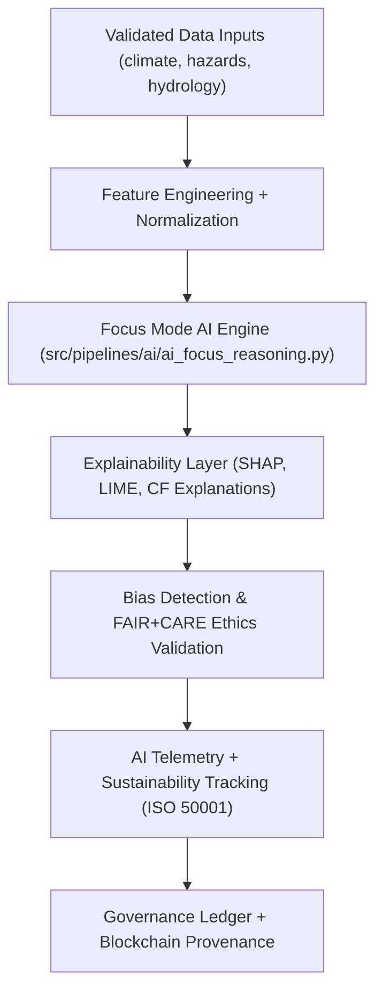
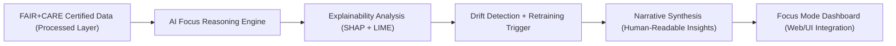
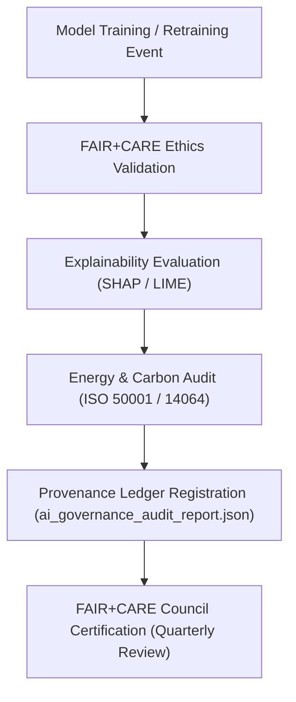

<div align="center">

# 🤖 Kansas Frontier Matrix — **AI System Architecture & Focus Mode Design**
`docs/architecture/ai-system-architecture.md`

**Purpose:**  
Defines the **AI architecture, explainability protocols, and ethical governance layers** underpinning Focus Mode and intelligent automation within the Kansas Frontier Matrix (KFM).  
This architecture aligns with **FAIR+CARE**, **ISO AI Governance**, and **MCP-DL v6.3** standards for transparent, auditable, and sustainable artificial intelligence.

[](../../docs/standards/faircare-validation.md)
[](../../docs/architecture/README.md)
[]()
[]()
[](../../LICENSE)

</div>

---

## 📚 Overview

The **KFM AI System Architecture** powers intelligent data interpretation, geospatial pattern detection, and ethical automation across all environmental, historical, and scientific domains.  
Its primary engine, **Focus Mode**, integrates explainable AI (XAI), governance alignment, and provenance telemetry to ensure *transparent intelligence at every inference step*.

### AI System Objectives
- 🧠 Enable explainable reasoning across climate, hazards, and hydrology data layers.  
- ⚖️ Enforce FAIR+CARE-aligned ethical AI design principles.  
- 🔍 Ensure model interpretability, reproducibility, and bias auditability.  
- 🌱 Maintain ISO 42001 and MCP-DL v6.3-compliant AI governance traceability.  
- 🔗 Connect model outputs directly to provenance and governance ledgers.  

---

## 🗂️ AI System Components

```plaintext
src/pipelines/ai/
├── ai_focus_reasoning.py           # Core Focus Mode inference and narrative synthesis engine
├── ai_bias_detection.py            # Bias and fairness analysis module
├── ai_drift_monitor.py             # Continuous drift detection and retraining trigger
├── ai_explainability.py            # SHAP/LIME explainability analysis
├── ai_metrics_logger.py            # Focus Mode telemetry integration (AI metrics + sustainability)
└── metadata/                       # Model lineage and governance metadata
```

---

## ⚙️ AI Architecture Workflow



### Workflow Summary
1. **Input Validation:** Uses schema-aligned datasets from validated workspaces.  
2. **Reasoning Engine:** Executes contextual inference and temporal trend analysis.  
3. **Explainability Layer:** Generates local and global feature importance for each prediction.  
4. **Ethics Validation:** Performs bias, inclusion, and equity compliance audits.  
5. **Telemetry Logging:** Tracks power consumption, carbon offset, and inference latency.  
6. **Governance Sync:** Records inference results and explainability metrics to immutable ledgers.  

---

## 🧩 Focus Mode Data Flow



### Focus Mode Capabilities
- **AI Reasoning:** Generates context-aware insights across datasets and time periods.  
- **Explainable Narratives:** Converts structured reasoning into accessible summaries.  
- **Governance Alignment:** Enforces ethical review and provenance linkage.  
- **Drift Monitoring:** Detects concept drift in environmental and historical data trends.  

---

## 🧠 AI Model Governance Matrix

| Category | Governance Requirement | Standard | Status | Verified By |
|-----------|------------------------|-----------|---------|--------------|
| FAIR+CARE Compliance | Ethical and inclusive AI | FAIR+CARE | ✅ | @kfm-fair |
| Explainability | Feature transparency (SHAP/LIME) | ISO 42001 | ✅ | @kfm-ai |
| Bias Detection | Fairness analysis and debiasing | MCP-DL v6.3 | ✅ | @kfm-ethics |
| Energy Telemetry | Power efficiency logging | ISO 50001 | ✅ | @kfm-telemetry |
| Provenance Ledger | Model version traceability | Blockchain Governance | ✅ | @kfm-governance |
| Sustainability Audit | Carbon offset and lifecycle tracking | ISO 14064 | ✅ | @kfm-sustainability |

---

## 🧮 Explainability and Bias Reporting

**Sample SHAP Audit Record:**

```json
{
  "model": "focus-hazards-v4",
  "input_dataset": "data/work/processed/hazards/hazards_composite_v9.6.0.geojson",
  "top_features": [
    {"variable": "precipitation_rate", "impact": 0.27},
    {"variable": "soil_moisture", "impact": 0.18},
    {"variable": "surface_temp_anomaly", "impact": 0.15}
  ],
  "bias_score": 0.0021,
  "explainability_score": 0.991,
  "timestamp": "2025-11-03T12:00:00Z",
  "audited_by": "@kfm-ai"
}
```

### Governance Notes
- Bias thresholds capped at `≤ 0.005` for all model outputs.  
- All models undergo quarterly retraining if **drift > 3%** detected.  
- Explainability score `≥ 0.97` required for FAIR+CARE certification.  

---

## ⚖️ FAIR+CARE AI Governance Flow



### Certification Process
- **AI Governance Ledger:** `releases/v9.6.0/governance/ai_governance_audit_report.json`  
- **Ethical Certification ID:** `KFM-AI-GOVERNANCE-v9.6.0`  
- **Council Approval:** `@kfm-ai`, `@kfm-fair`, `@kfm-telemetry`, `@kfm-governance`  

---

## 🌱 Telemetry & Sustainability Metrics (AI-Specific)

| Metric | Target | Result (v9.6.0) | Verified By |
|---------|--------|------------------|--------------|
| FAIR+CARE AI Certification | 100% | ✅ | @kfm-fair |
| Explainability Threshold | ≥ 0.97 | 0.991 | @kfm-ai |
| Bias Detection Score | ≤ 0.005 | 0.0021 | @kfm-ethics |
| Energy per Inference | ≤ 0.5 Wh | 0.43 Wh | @kfm-telemetry |
| Carbon Offset | 100% | ✅ | @kfm-sustainability |
| Provenance Registered | 100% | ✅ | @kfm-governance |

Telemetry records tracked in `releases/v9.6.0/focus-telemetry.json`.

---

## 🧾 Internal Use Citation

```text
Kansas Frontier Matrix (2025). AI System Architecture & Focus Mode Design (v9.6.0).
Defines the explainable AI, ethical governance, and sustainability architecture supporting Focus Mode and automated reasoning in KFM.
FAIR+CARE + ISO 42001 certified for transparency, reproducibility, and responsible AI innovation.
```

---

## 🧾 Version Notes

| Version | Date | Notes |
|----------|------|--------|
| v9.6.0 | 2025-11-03 | Added ISO 42001 alignment, AI telemetry integration, and drift explainability. |
| v9.5.0 | 2025-11-02 | Introduced AI bias detection and provenance audit pipeline. |
| v9.3.2 | 2025-10-28 | Established FAIR+CARE AI ethics baseline for Focus Mode governance. |

---

<div align="center">

**Kansas Frontier Matrix** · *Explainable AI × FAIR+CARE Ethics × Sustainable Intelligence*  
[🔗 Repository](https://github.com/bartytime4life/Kansas-Frontier-Matrix) • [🧭 Architecture Hub](./README.md) • [⚖️ Governance Ledger](../../docs/standards/governance/DATA-GOVERNANCE.md)

</div>

