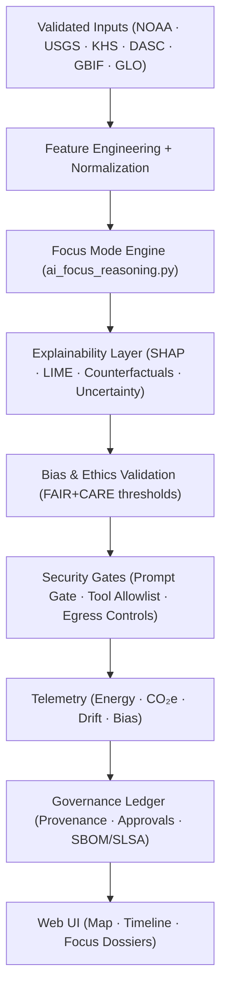
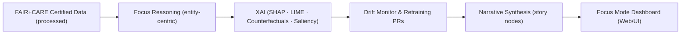

<div align="center">

# 🤖 **Kansas Frontier Matrix — AI System Architecture & Focus Mode Design**
`docs/architecture/ai-system-architecture.md`

**Purpose:**  
Define the **AI architecture, explainability protocols, security controls, and FAIR+CARE governance** powering Focus Mode and intelligent automation in the Kansas Frontier Matrix (KFM).  
Aligned with **FAIR+CARE**, **ISO 42001 (AI governance)**, **ISO 50001 (energy)**, **ISO 14064 (carbon)**, and **MCP-DL v6.3** for transparent, auditable, and sustainable AI.

[](./README.md)
[](../../LICENSE)
[](../standards/faircare.md)
[]()
[]()

</div>

---

## 📘 Overview

KFM’s **AI System Architecture** delivers interpretable, secure intelligence across environmental, historical, and cultural domains.  
**Focus Mode v2+** orchestrates XAI, ethics validation, security guardrails, and provenance telemetry — providing *transparent, governed intelligence at every inference step*.

### 🎯 AI System Objectives
- 🧠 Explainable reasoning over climate, hazards, hydrology, geology, ecology, treaties, and archives.  
- ⚖️ Enforce **FAIR+CARE** and **ISO 42001** throughout training, inference, and deployment.  
- 🔍 Guarantee interpretability, reproducibility, and bias auditability with ledgered provenance.  
- 🌱 Track energy and carbon (ISO 50001 / 14064) and uphold accessibility (WCAG/WAI-ARIA).  
- 🛡️ Integrate **security-by-design**: prompt-injection defense, tool allowlists, secrets policy, SLSA provenance, and IR playbooks.

---

## 🗂️ AI System Components

```plaintext
src/pipelines/ai/
├── ai_focus_reasoning.py        # Focus Mode orchestration & narrative synthesis
├── ai_bias_detection.py         # Group/feature parity, counterfactual fairness, thresholds
├── ai_drift_monitor.py          # Data/model drift detection & retraining triggers
├── ai_explainability.py         # SHAP/LIME + counterfactual & uncertainty explanations
├── ai_metrics_logger.py         # Latency, energy, CO₂e, usage; ISO 50001 hooks
├── policy/
│   ├── prompt_gate.py           # Control/data boundary enforcement
│   ├── tool_allowlist.yml       # Declarative tool contracts & constraints
│   └── guardrails.yml           # Refusal patterns, PII redaction, egress policies
└── metadata/                    # Model cards, lineage manifests, approvals & audit packs
```

**Related Security Docs**  
- Prompt Defense: `../security/prompt-injection-defense.md`  
- Supply Chain/Provenance: `../security/supply-chain.md`  
- Secrets Policy: `../security/secrets-policy.md`  
- Incident Response: `../security/incident-response.md`  
- Threat Model: `../security/threat-model.md`

---

## ⚙️ End-to-End AI Workflow



### Workflow Highlights
1. **Input Validation:** Only schema-conformant, checksum-verified, FAIR+CARE-certified data.  
2. **Reasoning:** Contextual/geospatial inference with temporal trends and scenario comparison.  
3. **Explainability:** Local/global attributions, counterfactuals, and interval-based uncertainty.  
4. **Bias & Ethics:** Parity metrics, equalized odds, and CF-fairness; auto-fail below thresholds.  
5. **Security Gates:** Signed prompts, policy-locked tools, offline-by-default egress, IR hooks.  
6. **Telemetry:** Power, CO₂e, latency, bias, drift, refusal rate logged to `focus-telemetry.json`.  
7. **Governance:** Immutable ledger entries tie models, datasets, decisions, and approvals to artifacts & SBOMs.

---

## 🧩 Focus Mode Data Flow



### Focus Mode Capabilities
- **Entity-Centric Insight:** Space×time narratives (events↔datasets↔actors) with confidence bounds.  
- **Explainable Dossiers:** Source-linked summaries; feature attributions embedded in “story nodes.”  
- **HITL Governance:** Checkpoints, approvals, and versioned model cards with ledger IDs.  
- **Continuous Quality:** Auto-alerts for drift; templated retraining PRs with reproducible configs.

---

## 🔐 Security Controls in AI Loop (excerpt)

| Control Domain | Primary Controls | Where Enforced |
|----------------|------------------|----------------|
| **Prompt Defense** | Signed prompt envelopes, control/data separation, sanitizer, refusal patterns | `policy/prompt_gate.py` · `../security/prompt-injection-defense.md` |
| **Tool Safety** | Allowlist contracts, runtime verifier, deny on unregistered tools | `policy/tool_allowlist.yml` |
| **Egress** | Offline-by-default, domain allowlists, response size/rate limits | API gateway / wrappers |
| **Supply Chain** | SLSA provenance, SBOM (SPDX/CycloneDX), Sigstore/Cosign | `../security/supply-chain.md` |
| **Secrets** | KMS/Vault rotation, OIDC MFA, least privilege | `../security/secrets-policy.md` |
| **IR & Audit** | NIST 800-61/ISO 27035 runbooks, signed postmortems | `../security/incident-response.md` |

---

## 🧠 AI Model Governance Matrix

| Category | Governance Requirement | Standard | Status | Verified By |
|---|---|---|---|---|
| FAIR+CARE Compliance | Inclusive & ethical AI ops | FAIR+CARE | ✅ | `@kfm-fair` |
| Explainability | SHAP/LIME/CF narratives & uncertainty | ISO 42001 | ✅ | `@kfm-ai` |
| Bias Detection | Parity/EO/CF fairness & thresholds | MCP-DL v6.3 | ✅ | `@kfm-ethics` |
| Energy Telemetry | Inference/build energy tracking | ISO 50001 | ✅ | `@kfm-telemetry` |
| Carbon Accounting | End-to-end CO₂e lifecycle | ISO 14064 | ✅ | `@kfm-sustainability` |
| Provenance Ledger | Versioning, SLSA, SBOM references | Governance Ledger | ✅ | `@kfm-governance` |

---

## 🧮 Explainability & Bias Reporting (examples)

```json
{
  "model": "focus-hazards-v6",
  "input_dataset": "data/processed/hazards/hazards_composite_v10.2.geojson",
  "top_features": [
    {"variable": "precipitation_rate", "impact": 0.24},
    {"variable": "soil_moisture", "impact": 0.18},
    {"variable": "surface_temp_anomaly", "impact": 0.16}
  ],
  "bias_score": 0.0016,
  "explainability_score": 0.992,
  "uncertainty_interval": [0.91, 0.97],
  "timestamp": "2025-11-09T12:00:00Z",
  "audited_by": "@kfm-ai"
}
```

**Governance Notes**
- Bias thresholds capped at **≤ 0.005** (balanced across groups/regions).  
- Quarterly retraining if **drift > 3%** or explainability < **0.97**.  
- All inference batches receive **ledger IDs**, SLSA attestations, and model card URNs.

---

## 🛰 Knowledge Graph, STAC, & Story Nodes

- **Knowledge Graph (Neo4j + RDF federation):** `EXPLAINS`, `DERIVED_FROM`, `USED_MODEL`, `HAS_UNCERTAINTY` relations.  
- **STAC 1.0 / DCAT 3.0:** Inference rasters/vectors published as Items; JSON-LD maps to **OWL-Time**, **GeoSPARQL**, **PROV-O**.  
- **Story Nodes:** `story-node.schema.json` binds XAI attributions, sources, and narrative claims rendered in Focus Mode dossiers.

---

## 🌱 Telemetry & Sustainability Metrics (AI)

| Metric | Target | Current | Verified By |
|---|---|---|---|
| FAIR+CARE AI Certification | 100% | ✅ | `@kfm-fair` |
| Explainability Threshold | ≥ 0.97 | 0.992 | `@kfm-ai` |
| Bias Score | ≤ 0.005 | 0.0016 | `@kfm-ethics` |
| Energy per Inference | ≤ 0.5 Wh | 0.40 Wh | `@kfm-telemetry` |
| Carbon Offset | 100% | ✅ | `@kfm-sustainability` |
| Provenance Registered | 100% | ✅ | `@kfm-governance` |

Telemetry: `../../releases/v10.2.0/focus-telemetry.json`

---

## 🧾 Internal Use Citation

```text
Kansas Frontier Matrix (2025). AI System Architecture & Focus Mode Design (v10.2.3).
Defines explainable, secure, and sustainable AI architecture for Focus Mode and automated reasoning in KFM.
FAIR+CARE · ISO 42001 · ISO 50001 · ISO 14064 aligned; Diamond⁹ Ω / Crown∞Ω Ultimate Certified.
```

---

## 🕰️ Version History

| Version | Date | Author | Summary |
|---:|---|---|---|
| v10.2.3 | 2025-11-09 | `@kfm-ai` | Align to v10.2: integrated security layer (prompt defense, supply chain, IR), updated telemetry/schema refs, expanded uncertainty reporting. |
| v10.2.0 | 2025-11-08 | `@kfm-ethics` | Added HITL checkpoints, tool allowlists, and FAIR+CARE thresholds to Focus Mode. |
| v9.7.0  | 2025-11-06 | `@kfm-ai` | STAC/graph/Story Node integration; telemetry paths refreshed; XAI & bias pipelines stabilized. |

---

<div align="center">

**Kansas Frontier Matrix**  
*Explainable AI × FAIR+CARE Ethics × Secure & Sustainable Intelligence*  
© 2025 Kansas Frontier Matrix · MIT · Master Coder Protocol v6.3 · Diamond⁹ Ω / Crown∞Ω Ultimate Certified  

[Back to Architecture](./README.md) · [Security Suite](../security/README.md) · [Governance Charter](../../docs/standards/governance/ROOT-GOVERNANCE.md)

</div>
