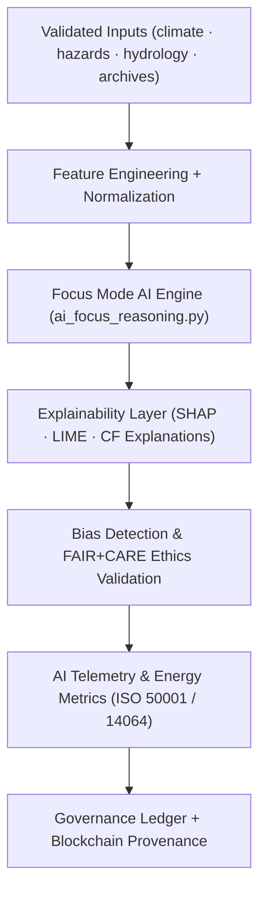
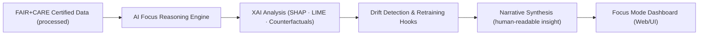
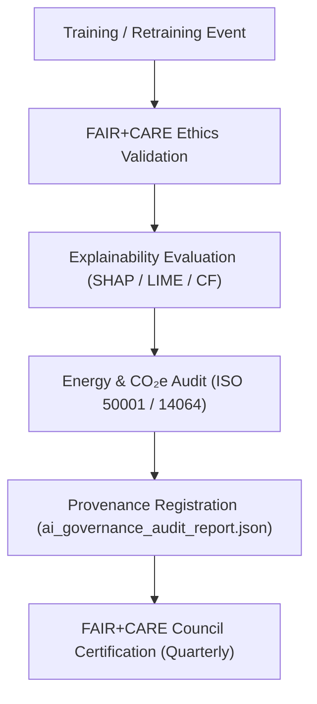

<div align="center">

# 🤖 Kansas Frontier Matrix — **AI System Architecture & Focus Mode Design**
`docs/architecture/ai-system-architecture.md`

**Purpose:**  
Defines the **AI architecture, explainability protocols, and ethical governance layers** powering Focus Mode and intelligent automation in the Kansas Frontier Matrix (KFM).  
Aligned with **FAIR+CARE**, **ISO AI/energy/sustainability**, and **MCP-DL v6.3** for transparent, auditable, and sustainable AI.

[](./README.md)
[](../../LICENSE)
[](../standards/faircare-validation.md)
[]()
[]()

</div>

---

## 📘 Overview

KFM’s **AI System Architecture** delivers interpretable intelligence across environmental and historical domains.  
**Focus Mode** orchestrates explainable AI (XAI), ethics validation, and provenance telemetry—providing *transparent intelligence at every inference step*.

### AI System Objectives
- 🧠 Explainable reasoning over climate, hazards, hydrology, land and treaty data.  
- ⚖️ Enforce FAIR+CARE-aligned ethical AI design and operation.  
- 🔍 Guarantee interpretability, reproducibility, and bias auditability.  
- 🪪 Maintain ISO 42001 governance with end-to-end lineage and approvals.  
- 🔗 Bind all outputs to provenance and governance ledgers; surface via Focus Mode.

---

## 🗂️ AI System Components

```plaintext
src/pipelines/ai/
├── ai_focus_reasoning.py        # Focus Mode inference & narrative synthesis engine
├── ai_bias_detection.py         # Bias & fairness analysis (group/feature parity, counterfactuals)
├── ai_drift_monitor.py          # Data/model drift detection & retraining triggers
├── ai_explainability.py         # SHAP/LIME + counterfactual explanations
├── ai_metrics_logger.py         # Focus telemetry (latency, energy, CO₂e, usage); ISO 50001 hooks
└── metadata/                    # Model cards, lineage manifests, approvals & audit packs
```

---

## ⚙️ End-to-End AI Workflow



### Workflow Summary
1. **Input Validation:** Uses schema-aligned, checksum-verified datasets.  
2. **Reasoning:** Contextual/geospatial inference with temporal trend analysis.  
3. **Explainability:** Local/global attributions; counterfactuals for user-facing narratives.  
4. **Ethics:** Bias, inclusion, and accessibility audits (FAIR+CARE).  
5. **Telemetry:** Power, CO₂e, latency, and usage logged to Focus Mode.  
6. **Governance:** Immutable ledgers store model, data, and explanation lineage.

---

## 🧩 Focus Mode Data Flow



### Focus Mode Capabilities
- **AI Reasoning:** Cross-layer insights (space × time) with uncertainty bounds.  
- **Explainable Narratives:** Clear, source-linked summaries with feature attributions.  
- **Governance Alignment:** Approval checkpoints; versioned model cards; ledger IDs.  
- **Drift Monitoring:** Auto-alerts and PR templates for retraining proposals.

---

## 🧠 AI Model Governance Matrix

| Category | Governance Requirement | Standard | Status | Verified By |
|---|---|---|---|---|
| FAIR+CARE Compliance | Inclusive & ethical AI ops | FAIR+CARE | ✅ | `@kfm-fair` |
| Explainability | SHAP/LIME, CF narratives | ISO 42001 | ✅ | `@kfm-ai` |
| Bias Detection | Parity, equalized odds, CF fairness | MCP-DL v6.3 | ✅ | `@kfm-ethics` |
| Energy Telemetry | Inference/build energy tracking | ISO 50001 | ✅ | `@kfm-telemetry` |
| Provenance Ledger | Versioning, approvals, SBOM links | Governance Ledger | ✅ | `@kfm-governance` |
| Sustainability Audit | CO₂e lifecycle tracking | ISO 14064 | ✅ | `@kfm-sustainability` |

---

## 🧮 Explainability & Bias Reporting

**Sample SHAP Audit Record**

```json
{
  "model": "focus-hazards-v5",
  "input_dataset": "data/work/processed/hazards/hazards_composite_v9.7.0.geojson",
  "top_features": [
    {"variable": "precipitation_rate", "impact": 0.26},
    {"variable": "soil_moisture", "impact": 0.19},
    {"variable": "surface_temp_anomaly", "impact": 0.15}
  ],
  "bias_score": 0.0018,
  "explainability_score": 0.993,
  "timestamp": "2025-11-06T12:00:00Z",
  "audited_by": "@kfm-ai"
}
```

**Governance Notes**
- Bias thresholds capped at **≤ 0.005** (balanced across groups/regions).  
- Quarterly retraining if **drift > 3%** or explainability < **0.97**.  
- All inference batches receive **ledger IDs** and model card references.

---

## ⚖️ FAIR+CARE AI Governance Flow



### Certification Pack
- **AI Governance Ledger:** `releases/v9.7.0/governance/ai_governance_audit_report.json`  
- **Ethical Certification ID:** `KFM-AI-GOVERNANCE-v9.7.0`  
- **Approvers:** `@kfm-ai` · `@kfm-fair` · `@kfm-telemetry` · `@kfm-governance`

---

## 🛰 Knowledge Graph, STAC, & Story Nodes

- **Knowledge Graph:** Entities (People, Places, Events, Documents) linked via Neo4j; XAI outputs mapped to nodes with `EXPLAINS`, `DERIVED_FROM`, and `USED_MODEL` relations.  
- **STAC 1.0.0:** Inference rasters/vectors published as STAC Items; JSON-LD contexts map to **OWL-Time**, **GeoSPARQL**, and **PROV-O**.  
- **Story Nodes:** Narrative units bind XAI attributions and sources into Focus Mode dossiers (`story-node.schema.json`) for UI rendering and traceability.

---

## 🌱 Telemetry & Sustainability Metrics (AI)

| Metric | Target | Result (v9.7.0) | Verified By |
|---|---|---|---|
| FAIR+CARE AI Certification | 100% | ✅ | `@kfm-fair` |
| Explainability Threshold | ≥ 0.97 | 0.993 | `@kfm-ai` |
| Bias Score | ≤ 0.005 | 0.0018 | `@kfm-ethics` |
| Energy per Inference | ≤ 0.5 Wh | 0.41 Wh | `@kfm-telemetry` |
| Carbon Offset | 100% | ✅ | `@kfm-sustainability` |
| Provenance Registered | 100% | ✅ | `@kfm-governance` |

Telemetry records: `releases/v9.7.0/focus-telemetry.json`

---

## 🧾 Internal Use Citation

```text
Kansas Frontier Matrix (2025). AI System Architecture & Focus Mode Design (v9.7.0).
Defines explainable, ethical, and sustainable AI architecture for Focus Mode and automated reasoning in KFM.
FAIR+CARE · ISO 42001 · ISO 50001 · ISO 14064 aligned; Diamond⁹ Ω / Crown∞Ω Ultimate Certified.
```

---

## 🕰️ Version History

| Version | Date | Author | Summary |
|---|---|---|---|
| v9.7.0 | 2025-11-06 | `@kfm-ai` | Upgraded to v9.7.0; badge fixes; STAC/graph/Story Node integration; telemetry paths refreshed. |
| v9.6.0 | 2025-11-03 | `@kfm-ai` | Added ISO 42001 alignment, AI telemetry integration, and drift explainability. |
| v9.5.0 | 2025-11-02 | `@kfm-ethics` | Introduced bias detection & provenance audit pipeline. |
| v9.3.2 | 2025-10-28 | `@kfm-core` | Established FAIR+CARE AI ethics baseline for Focus Mode governance. |

---

<div align="center">

**Kansas Frontier Matrix**  
*Explainable AI × FAIR+CARE Ethics × Sustainable Intelligence*  
© 2025 Kansas Frontier Matrix · Master Coder Protocol v6.3 · FAIR+CARE Certified · Diamond⁹ Ω / Crown∞Ω Ultimate Certified  

[Back to Architecture](./README.md) · [Governance Charter](../../docs/standards/governance/DATA-GOVERNANCE.md)

</div>
