# 🤖 AI System Overview

<kbd>🧠 RAG</kbd> <kbd>🦙 Ollama</kbd> <kbd>🛡️ OPA</kbd> <kbd>⛓️ PROV</kbd> <kbd>✅ No Source, No Answer</kbd> <kbd>🗺️ Map + Timeline + Story</kbd>

KFM’s AI is **not** a generic chatbot. It’s a **governed, evidence-first assistant** embedded in **Focus Mode**—an interactive reading experience that pairs Story Nodes with map + timeline context. The AI’s job is to help users explore KFM’s curated knowledge while keeping **provenance, safety, and sovereignty guardrails** intact.  

---

## 🧭 Table of Contents

- [North Star](#-north-star)
- [Hard Invariants](#-hard-invariants)
- [Focus Mode Hard Gates](#-focus-mode-hard-gates)
- [Where AI Lives in the Stack](#-where-ai-lives-in-the-stack)
- [Core Components](#-core-components)
- [RAG Request Lifecycle](#-rag-request-lifecycle)
- [Prompt + Citation Contract](#-prompt--citation-contract)
- [Governance, Safety, and Security](#-governance-safety-and-security)
- [Provenance & Audit](#-provenance--audit)
- [Performance & Caching](#-performance--caching)
- [Model Runtime & Swap-ability](#-model-runtime--swap-ability)
- [Agentic/Tool Use (Optional Extension)](#-agentictool-use-optional-extension)
- [Evidence Artifacts Lifecycle (AI/Analysis Outputs)](#-evidence-artifacts-lifecycle-aianalysis-outputs)
- [API Contract (Developer View)](#-api-contract-developer-view)
- [Testing & CI/CD](#-testing--cicd)
- [Observability](#-observability)
- [PR Checklist for AI Changes](#-pr-checklist-for-ai-changes)
- [Related Docs](#-related-docs)
- [Sources](#-sources)

---

## ⭐ North Star

KFM is built so that **every narrative claim can be traced to versioned evidence**, and **every derived output has explicit lineage**. The AI layer must reinforce that promise—never weaken it. :contentReference[oaicite:0]{index=0}

---

## 🧱 Hard Invariants

These are non-negotiables for AI features and AI-adjacent UI:

1. **Pipeline ordering is absolute**  
   ETL → Catalogs (STAC/DCAT/PROV) → Graph → API → UI → Story Nodes → Focus Mode.  
   No skipping stages. No “direct injection” into UI. :contentReference[oaicite:1]{index=1}

2. **API boundary rule**  
   The UI must never query the graph directly; **all access is through governed APIs**. :contentReference[oaicite:2]{index=2}

3. **Provenance first**  
   If it isn’t cataloged and provenance-linked, it’s treated as **not publishable / not displayable**. :contentReference[oaicite:3]{index=3}

4. **Evidence-first narrative**  
   No unsourced narrative in Story Nodes or Focus Mode, and AI-generated content must be clearly identified with provenance/confidence metadata. :contentReference[oaicite:4]{index=4}

5. **Classification propagation**  
   No output can be less restricted than its inputs; sensitive location handling must be enforced end-to-end. :contentReference[oaicite:5]{index=5}

---

## 🔒 Focus Mode Hard Gates

Focus Mode is designed with strict trust-preserving gates:

- **Only provenance-linked content**  
  Focus Mode displays only content that passed through the pipeline with provenance (Story Nodes + cataloged assets). If it’s not in catalogs/graph with provenance, it doesn’t show. :contentReference[oaicite:6]{index=6}

- **AI contributions must be opt-in and transparent**  
  AI-generated suggestions never appear by default, must be user-triggered, and must be labeled with uncertainty/confidence. :contentReference[oaicite:7]{index=7}

- **No sensitive location leaks**  
  Sensitive locations must be generalized/omitted so Focus Mode cannot become a side-channel around restrictions. :contentReference[oaicite:8]{index=8}

> [!IMPORTANT]
> Focus Mode operationalizes: **“no new narrative without sources, no data without provenance.”** :contentReference[oaicite:9]{index=9}

---

## 🗺️ Where AI Lives in the Stack

AI is a *layered* component—never a shortcut around governance.

```mermaid
flowchart TB
  subgraph P
    direction TB
    RAW["🏭 ETL: data/raw -> data/work -> data/processed"]
    CAT["🗂️ Catalogs: STAC / DCAT / PROV"]
    KG["🕸️ Graph: Neo4j + Ontology"]
    APIB["🔌 API Boundary: src/server/"]
    UIB["🗺️ UI: web/ (Map + Story + Focus Mode)"]
    STORY["📖 Story Nodes: docs/reports/story_nodes/"]
    FOCUS["🤖 Focus Mode: governed experience"]
    RAW --> CAT --> KG --> APIB --> UIB --> STORY --> FOCUS
  end

  subgraph AIsub
    direction TB
    PG["🚧 Prompt Gate"]
    RET["🔎 Retrieval: Neo4j / PostGIS / Search / Vector"]
    LLM["🦙 Ollama LLM Runtime"]
    OPA["🛡️ OPA Policy Check"]
    LEDGER["📒 Provenance Ledger + PROV records"]
  end

  UIB -->|"📨 POST /focus-mode/query"| APIB
  APIB --> PG --> RET --> LLM --> OPA --> APIB
  APIB --> LEDGER
```



AI is “powered by retrieval + governance” rather than “powered by model guessing.” :contentReference[oaicite:10]{index=10} :contentReference[oaicite:11]{index=11}

---

## 🧩 Core Components

| Component | Role | Key Behaviors |
|---|---|---|
| 🧼 **Prompt Gate** | Input filtering + sanitization | Neutralizes prompt injection attempts, strips disallowed content (profanity/hate/private data requests), ensures the model never sees unsafe instructions. :contentReference[oaicite:12]{index=12} |
| 🔎 **Retrieval Layer (RAG)** | Evidence gathering | Pulls context from **Neo4j**, **PostGIS**, **full-text search**, and **vector similarity search** (embeddings). Produces compact, high-signal evidence snippets with IDs. :contentReference[oaicite:13]{index=13} |
| 🦙 **Ollama Runtime** | Local LLM generation | Runs models locally (no external API calls). Generates answers from supplied context. :contentReference[oaicite:14]{index=14} |
| 🛡️ **OPA Policy Gate** | Output filtering + compliance | Verifies citations, checks sensitivity labels & user role, blocks or redacts disallowed outputs (fail-safe). :contentReference[oaicite:15]{index=15} |
| ⛓️ **Provenance Ledger** | Auditability | Logs question, sources, model version, prompt version, and policy decision in an append-only record (optionally sign/timestamp). :contentReference[oaicite:16]{index=16} |
| ⚡ **Caching Layer** | Performance | Caches retrieval context + session memory; Ollama doesn’t provide query-cache, so KFM caches at application layer. :contentReference[oaicite:17]{index=17} |

---

## 🔁 RAG Request Lifecycle

This is the canonical orchestration pattern for Focus Mode questions:

1. **User submits a question** (Focus Mode UI)  
2. **Prompt Sanitization (Prompt Gate)**  
3. **Context & Retrieval** (Neo4j + PostGIS + full-text + vector search)  
4. **LLM Generation** (Ollama /api/generate) using a prompt that includes SOURCES [1], [2], …  
5. **Policy & Provenance Check** (OPA Rego + internal checks)  
6. **Response Assembly + Citation Map** (UI clickable footnotes)  
7. **Immutable logging** (ledger + provenance record)  

This is the “multi-step RAG pipeline” contract. :contentReference[oaicite:18]{index=18} :contentReference[oaicite:19]{index=19}

```mermaid
flowchart TB
  subgraph P
    direction TB
    T1["🧭 Canonical Pipeline (Truth Path)"]
    RAW["🏭 ETL: data/raw -> data/work -> data/processed"]
    CAT["🗂️ Catalogs: STAC / DCAT / PROV"]
    KG["🕸️ Graph: Neo4j + Ontology"]
    APIB["🔌 API Boundary: src/server/"]
    UIB["🗺️ UI: web/ (Map + Story + Focus Mode)"]
    STORY["📖 Story Nodes: docs/reports/story_nodes/"]
    FOCUS["🤖 Focus Mode: governed experience"]
    T1 --> RAW --> CAT --> KG --> APIB --> UIB --> STORY --> FOCUS
  end

  subgraph AIsub
    direction TB
    T2["🧠 AI Subsystem (inside the boundary)"]
    PG["🚧 Prompt Gate"]
    RET["🔎 Retrieval: Neo4j / PostGIS / Search / Vector"]
    LLM["🦙 Ollama LLM Runtime"]
    OPA["🛡️ OPA Policy Check"]
    LEDGER["📒 Provenance Ledger + PROV records"]
    T2 --> PG --> RET --> LLM --> OPA
  end

  UIB -->|"📨 POST /focus-mode/query"| APIB
  APIB --> PG
  OPA --> APIB
  APIB --> LEDGER
```



---

## 🧾 Prompt + Citation Contract

### Citation format

- Retrieval produces evidence as a **numbered source list**: **[1]**, **[2]**, …
- The LLM must cite **[k]** for **every factual claim** derived from a source.
- The UI renders citation markers as **clickable footnotes** that resolve to dataset/doc/graph metadata. :contentReference[oaicite:20]{index=20}

### ✅ “No Source, No Answer” (hard enforcement)

KFM enforces a strict rule: **no factual claim without citation**. If retrieval finds nothing relevant, the assistant must **refuse** rather than guess. Enforcement is both prompt-level and gate-level:

- The backend scans outputs for **at least one citation marker**
- If absent: **discard/replace** with a safe failure message
- OPA/internal governance blocks uncited assertions as policy violations :contentReference[oaicite:21]{index=21} :contentReference[oaicite:22]{index=22}

> [!WARNING]
> An answer without citations is treated as a **bug** or **policy violation**, not “just a bad response.” :contentReference[oaicite:23]{index=23}

---

## 🛡️ Governance, Safety, and Security

### 1) Input Filtering (Prompt Gate)

- Removes prompt injection attempts (e.g., “Ignore all previous instructions…”)
- Filters profanity/hate speech
- Blocks requests that violate policy (private/personal data)  
This happens **upstream** because Ollama will attempt to answer whatever it’s given. :contentReference[oaicite:24]{index=24}

### 2) AI Sandbox (Least Privilege)

Baseline posture: **text generation only**, no direct access to internet/files/tools, explicit **allow-list** for any tool usage (often empty by default). :contentReference[oaicite:25]{index=25} :contentReference[oaicite:26]{index=26}

### 3) Output Filtering (OPA Governance Checks)

After generation, OPA evaluates whether the output is allowed:

- Must contain required citation brackets
- Must comply with sensitivity labels
- Must comply with user role permissions
- Can block, redact, or request clarification :contentReference[oaicite:27]{index=27} :contentReference[oaicite:28]{index=28}

### 4) Sovereignty + Sensitive Location Protections

Focus Mode merges narrative + spatial context, so it must not leak restricted locations. Sensitive points are generalized/omitted and rules prevent bypasses. :contentReference[oaicite:29]{index=29} :contentReference[oaicite:30]{index=30}

---

## ⛓️ Provenance & Audit

Every AI interaction is auditable:

- Ledger stores: **question**, **sources used**, **model version**, **prompt version**, **policy decision**
- Ledger is **append-only**; can be cryptographically signed/timestamped (planned)  
Purpose: reproduce the exact context and investigate any incorrect or problematic outputs. :contentReference[oaicite:31]{index=31}

Additionally, AI outputs can generate PROV records linking:
- the answer artifact
- the model (agent)
- the retrieval sources (entities)
- the generation activity (with parameters) :contentReference[oaicite:32]{index=32}

---

## ⚡ Performance & Caching

Because answers may require substantial context:

- Increase context window via `num_ctx` in an Ollama Modelfile (model-dependent).
- Use **context caching** at the application layer:
  - cache “frequently asked question” retrieval bundles
  - keep short-term caches for repeated graph/vector lookups
  - maintain session memory so follow-ups don’t re-fetch identical evidence  
Ollama does **not** provide an internal cache of past queries, so KFM handles caching outside the model. :contentReference[oaicite:33]{index=33}

---

## 🦙 Model Runtime & Swap-ability

Ollama runs as a **local LLM server** (REST + SDKs), containerized as part of the platform. The integration is designed to be modular so the pipeline can remain stable even if the model runtime changes. :contentReference[oaicite:34]{index=34}

### 🗂️ Illustrative module layout (backend)

> This is an illustrative layout (the key idea is *separation of concerns* and easy swap-ability).

```text
📁 KFM-Backend/
  📁 api/
    📁 routes/
      📄 focus_mode.py          # REST endpoint for AI queries
  📁 ai/
    📄 focus_pipeline.py        # parse -> retrieve -> prompt -> postprocess
    📄 ollama_client.py         # wrapper for generate + embed
    📄 retrieval.py             # Neo4j / PostGIS / Search / Vector adapters
    📁 prompt_templates/
      📄 focus_mode.txt
    📄 policy_checks.py         # calls OPA + local validators
```

The key architectural goal: swapping LLM runtimes should mostly touch the **LLM client wrapper**, not the whole system. :contentReference[oaicite:35]{index=35}

---

## 🧰 Agentic/Tool Use (Optional Extension)

There are two compatible “modes” described across project docs:

### ✅ Baseline (default): no tool use
- Explicit allow-list is empty; model only generates text/embeddings.
- Strongest safety posture (prevents a class of “AI goes rogue” risks). :contentReference[oaicite:36]{index=36}

### 🧠 Optional extension: governed tool calls
- Allow limited tools (e.g., “search database” via safe APIs) for multi-hop queries.
- Must remain allow-listed and fully governed (OPA + provenance). :contentReference[oaicite:37]{index=37}

> [!NOTE]
> If tool use is enabled, treat intermediate tool calls as **first-class provenance events** (PROV activities) and include them in the audit trail.

---

## 🧪 Evidence Artifacts Lifecycle (AI/Analysis Outputs)

KFM treats any AI/analysis output that becomes a dataset as a **first-class evidence artifact**—it must move through the same pipeline and standards as “regular data.”

### Evidence artifact pattern ✅
An evidence artifact must be:

- Stored in `data/processed/...`
- Cataloged in **STAC/DCAT**
- Traced in **PROV** (inputs, method/model, parameters, confidence metrics)
- Integrated into the graph cautiously with explicit provenance
- Exposed only via governed APIs (redaction/classification enforced) :contentReference[oaicite:38]{index=38}

### STAC/DCAT/PROV alignment policy (required) 🌐
Every new dataset/evidence artifact must have:

- STAC Collection + Items
- DCAT dataset entry
- PROV activity bundle  

These are boundary artifacts required before data is considered published and becomes usable downstream. :contentReference[oaicite:39]{index=39} :contentReference[oaicite:40]{index=40}

---

## 🔌 API Contract (Developer View)

Focus Mode AI is accessed via a governed backend endpoint (commonly):

- `POST /focus-mode/query` (some docs may also refer to `POST /ai/query` as an alias/prototype endpoint). :contentReference[oaicite:41]{index=41} :contentReference[oaicite:42]{index=42}

### Contract-first rule ✅
When adding/changing AI endpoints:

1. Define/extend the contract first (OpenAPI / GraphQL schema under `src/server/contracts/`)
2. Implement in `src/server/`
3. Add contract tests + any redaction rules
4. Update docs so the frontend uses the contract correctly :contentReference[oaicite:43]{index=43}

### Example request/response (shape)

```json
// Request
{
  "question": "What happened in this county in the mid-1930s?",
  "map_context": {
    "bbox": [-101.0, 37.0, -100.0, 38.0],
    "selected_place_id": "place:finney_county",
    "time_range": ["1934-01-01", "1936-12-31"],
    "active_layers": ["drought_index", "crop_yields"]
  },
  "story_node_id": "story:ks:dust-bowl:overview",
  "mode": "focus"
}
```

```json
// Response
{
  "answer": "In the mid-1930s, this area experienced severe drought impacts as part of the Dust Bowl [1] ... [2].",
  "citations": {
    "1": { "type": "dataset", "id": "dataset:drought_1935", "title": "Drought Index 1935", "provenance_id": "prov:..." },
    "2": { "type": "document", "id": "doc:newspaper_1936_...", "title": "Local newspaper excerpt (1936)", "provenance_id": "prov:..." }
  },
  "policy": { "decision": "allow", "redactions": [] },
  "provenance": { "ledger_id": "aiq:2026-02-04T..." }
}
```

---

## ✅ Testing & CI/CD

A healthy AI subsystem is *testable*:

- Unit tests for:
  - Prompt Gate sanitization
  - Retrieval bundling + source IDs
  - Citation parsing + mapping
  - Policy check integration (OPA allow/deny)
- Integration tests:
  - Spin up Ollama with a small model (CPU mode) and run deterministic “citation required” prompts
  - Validate response shape + minimum citations
- Regression tests:
  - Simulate a suite of Focus Mode questions and verify outputs include citations + expected keywords  
Ollama supports Python/JS libraries and can run in CI with smaller models, enabling AI regression tests in the pipeline. :contentReference[oaicite:44]{index=44}

---

## 📈 Observability

Minimum telemetry signals worth tracking:

- Retrieval hit rate per channel (Neo4j / PostGIS / search / vector)
- Citation coverage (claims vs citations, or at least presence of citations)
- OPA decisions (allow/deny/redact) and reason codes
- Latency breakdown (retrieve vs generate vs policy check)
- Cache hit rates and cache warm time
- “No Source, No Answer” refusal rate (and why) :contentReference[oaicite:45]{index=45} :contentReference[oaicite:46]{index=46}

---

## ✅ PR Checklist for AI Changes

Use this before merging anything that touches Focus Mode AI:

- [ ] **No bypass of the canonical pipeline** (no provenance-free content)
- [ ] Endpoint contract updated first (`src/server/contracts/…`) + tests
- [ ] Prompt template maintains **“use ONLY provided sources”** constraint
- [ ] “No Source, No Answer” gate still enforced (tests exist)
- [ ] OPA policies updated for any new data classifications/sensitivity rules
- [ ] Provenance logging includes model version + prompt version + sources list
- [ ] UI shows citations + clear “AI-generated” labeling when applicable (opt-in) :contentReference[oaicite:47]{index=47}

---

## 🔗 Related Docs

- 📄 `docs/architecture/ai/OLLAMA_INTEGRATION.md`
- 📄 `docs/MASTER_GUIDE_v13.md` (pipeline + governance source of truth)
- 📄 `docs/governance/ROOT_GOVERNANCE.md`
- 📄 `docs/governance/SOVEREIGNTY.md`
- 📄 `docs/governance/ETHICS.md` :contentReference[oaicite:48]{index=48}

---

## 📚 Sources

Primary project references used to build this overview:

- Kansas Frontier Matrix — Comprehensive System Documentation (AI infrastructure, RAG pipeline, citations, provenance, security) :contentReference[oaicite:49]{index=49} :contentReference[oaicite:50]{index=50}
- Kansas Frontier Matrix — Comprehensive Technical Blueprint (Focus Mode AI, local LLM via Ollama, optional tool use, governance) :contentReference[oaicite:51]{index=51}
- Master Guide v13 (pipeline invariants, evidence artifact pattern, Focus Mode hard gates, STAC/DCAT/PROV alignment) :contentReference[oaicite:52]{index=52} :contentReference[oaicite:53]{index=53}
- Node.js/React/CSS/HTML reference (GraphQL schema/contract concepts as a supporting implementation reference) :contentReference[oaicite:54]{index=54}

