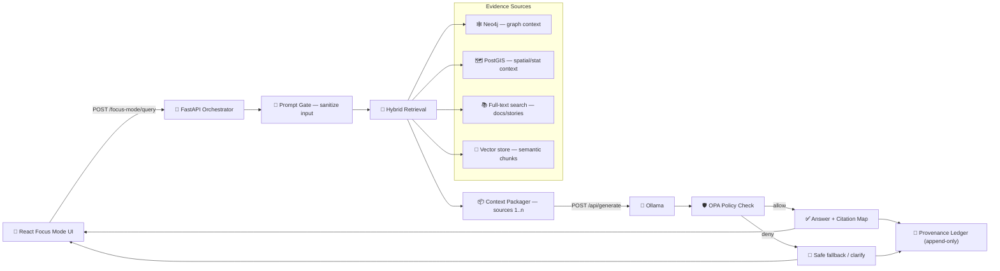

# 🦙 Ollama Integration (Focus Mode AI Layer)


> **Purpose:** Run **Focus Mode** on a **self-hosted** LLM runtime (**Ollama**) while preserving KFM’s **strict layering**, **evidence-first responses**, **policy gating**, and **provenance logging**.

---

## 📌 Table of Contents
- [🎯 Scope](#-scope)
- [✅ Non-Negotiables](#-non-negotiables)
- [🏗️ Architecture Fit](#️-architecture-fit)
- [🔍 Focus Mode RAG Pipeline](#-focus-mode-rag-pipeline)
- [🔌 Service Contracts](#-service-contracts)
- [⚙️ Configuration](#️-configuration)
- [🐳 Local Dev](#-local-dev)
- [🚢 Deployment](#-deployment)
- [🧠 Models & Modelfile](#-models--modelfile)
- [🧲 Embeddings & Vector Search](#-embeddings--vector-search)
- [🛡️ Governance](#️-governance)
- [📒 Provenance & Audit Trail](#-provenance--audit-trail)
- [🧪 Testing Strategy](#-testing-strategy)
- [🧯 Troubleshooting](#-troubleshooting)
- [🧭 Future Extensions](#-future-extensions)
- [📚 Related Docs](#-related-docs)

---

## 🎯 Scope

This document covers:

- Integrating **Ollama** as the **LLM runtime** for **Focus Mode**.
- Using Ollama for:
  - **Text generation** (answers)
  - **Embeddings** (semantic search / vector similarity)
- **Governance** integration:
  - Prompt sanitization (“Prompt Gate”)
  - Policy checks (OPA)
  - Evidence/citation enforcement
  - Provenance logging (append-only)

**Out of scope (for now):**
- Tool-calling/agents enabled by default (we keep “least privilege” and opt-in)
- Multimodal inference (images/audio)—tracked under [Future Extensions](#-future-extensions)

---

## ✅ Non-Negotiables

KFM’s AI layer is treated as **untrusted text generation** behind multiple guards:

- **No direct UI → LLM calls** ❌  
  All LLM calls route through the governed backend API.
- **Evidence-first answers** ✅  
  The LLM must only answer from retrieved context (Neo4j/PostGIS/search/vector chunks).
- **Citations required** ✅  
  Answers must include bracket citations like `[1] [2]` mapped to real KFM sources.
- **Fail-closed** 🔒  
  Missing provenance, missing citations, or policy failures → block/refuse safely.
- **Provenance logged** 🧾  
  Every AI response stores: question, sources, model id, prompt version, policy decision.

---

## 🏗️ Architecture Fit

KFM follows a strict multi-layer architecture:

- **Front-End (React/TypeScript)** 💬  
  Focus Mode chat UI calls backend endpoints (e.g. `POST /focus-mode/query`).
- **API Layer (FastAPI + GraphQL)** 🧠  
  Orchestrates retrieval + prompt assembly + calling Ollama + policy checks.
- **Datastores (Neo4j + PostGIS + Search/Index)** 🗃️  
  Sources of truth; retrieval targets for evidence.
- **Ollama LLM Service** 🦙  
  Runs models locally/on-prem (containerized or host install); accessed via REST or client wrapper.

### 🗺️ End-to-end Flow Diagram



---

## 🔍 Focus Mode RAG Pipeline

The Focus Mode backend orchestrates a multi-step **RAG** pipeline:

1. **Prompt Sanitization (Prompt Gate)** 🚧  
   Neutralize prompt injection, profanity, unsafe directives, or attempts to exfiltrate restricted data.

2. **Hybrid Retrieval** 🔎  
   Gather a compact bundle of high-signal evidence across **four channels**:
   - **Neo4j**: graph entities, events, relationships
   - **PostGIS**: spatial / statistical facts (e.g., counts by county/year)
   - **Full-text search**: documents & story nodes by keywords
   - **Vector similarity**: semantic chunks from embeddings

3. **Prompt Assembly** 🧩  
   The prompt is built from:
   - System rules (citation required, use only sources)
   - Sanitized user question
   - UI/map context (time window, selected geography, active layers)
   - `SOURCES:` list observed by the LLM as `[1]...[n]`

4. **LLM Generation (Ollama)** 🦙  
   Call Ollama’s generation endpoint (commonly `/api/generate`) with the assembled prompt.

5. **Policy + Provenance Check (OPA)** 🛡️  
   Verify:
   - Citations present
   - Safety constraints met
   - User role can see this info (RBAC)
   - Sensitivity labels respected  
   If policy fails → refuse or redact and return a safe response.

6. **Response Assembly + Logging** 📒  
   - Return the answer **plus a citation map**: `[1] → full metadata` for UI rendering
   - Append an immutable record:
     - question
     - sources used
     - model id/tag
     - prompt template version
     - policy decision

---

## 🔌 Service Contracts

### 1) Focus Mode API (KFM → UI)

**Endpoint:** `POST /focus-mode/query`  
**Responsibility:** Orchestrates retrieval → calls Ollama → policy checks → returns answer + citations.

**Request (example):**
```json
{
  "question": "What happened here in the mid-1930s?",
  "context": {
    "geometry": { "type": "Polygon", "coordinates": [/* ... */] },
    "place": "Finney County",
    "year_range": [1934, 1936],
    "layers": ["drought_index", "population"]
  }
}
```

**Response (example):**
```json
{
  "answer": "In the mid-1930s, this area experienced severe drought impacts as part of the Dust Bowl [1]. Dust storms and crop failures peaked around 1935 [2].",
  "citations": {
    "1": { "type": "dataset", "id": "ds_drought_1935", "title": "1935 Drought Index (Kansas)" },
    "2": { "type": "document", "id": "doc_1935_climate_report", "title": "1935 Kansas Climate Report" }
  },
  "provenance": {
    "model": "kfm-llama2:latest",
    "prompt_version": "focus_mode.v3",
    "policy_decision": "allow"
  }
}
```

### 2) Ollama API (KFM → Ollama)

**Generation:** typically `POST /api/generate`  
**Embeddings:** commonly `POST /api/embed` (or `/api/embeddings` depending on Ollama version)

---

## ⚙️ Configuration

> ⚠️ Always treat `.env.example` as the source of truth for actual variable names.

### Suggested Environment Variables

| Variable | Example | Notes |
|---|---|---|
| `OLLAMA_API_URL` | `http://ollama:11434` | Base URL used by the backend |
| `OLLAMA_MODEL` | `kfm-llama2:latest` | Main generation model |
| `OLLAMA_EMBEDDING_MODEL` | `mxbai-embed-large:latest` | Embeddings model for vector search |
| `AI_BACKEND_URL` *(optional alias)* | `http://host.docker.internal:11434` | Helpful when API runs in Docker but Ollama runs on host |

### ✅ Recommended Defaults
- Start with **one** primary generation model and **one** embedding model.
- Keep model selection configurable **without code changes**.

---

## 🐳 Local Dev

You have two supported approaches:

### Option A: Run Ollama on the Host (fastest to start)
1. Install/run Ollama on your machine.
2. Ensure the model runs:
   ```bash
   ollama run llama2 "Hello"
   ```
3. Point the API container to host Ollama:
   ```env
   OLLAMA_API_URL=http://host.docker.internal:11434
   ```
> Notes:
> - `host.docker.internal` is typically available on Docker Desktop.  
> - On Linux, you may need alternative routing (bridge IP, host networking, etc.).

### Option B: Run Ollama as a Container (closer to production)
<details>
<summary><b>🐳 Example docker-compose service (reference)</b></summary>

```yaml
services:
  ollama:
    image: ollama/ollama:latest
    ports:
      - "11434:11434"
    volumes:
      - ollama_data:/root/.ollama
    # GPU usage is environment-specific.
    # For Kubernetes prefer nvidia.com/gpu requests.
volumes:
  ollama_data:
```
</details>

---

## 🚢 Deployment

### Docker / Compose
- Run Ollama as a dedicated service.
- Mount a persistent volume to `/root/.ollama` so models don’t re-download on restart.

### Kubernetes
- Deploy Ollama as its own `Deployment` (or in some cases a sidecar; dedicated is cleaner).
- Use a persistent volume for `/root/.ollama`.
- For GPU:
  - schedule on GPU nodes
  - request resources like `nvidia.com/gpu: 1`
- Scale horizontally by running multiple Ollama replicas (load-balance from API layer).

---

## 🧠 Models & Modelfile

KFM can run:
- An off-the-shelf open model (baseline)
- A **custom KFM model** built via Ollama **Modelfile**
  - Base model + optional LoRA adapter
  - Prompt template baked in to enforce style/citations

### 📄 Example `Modelfile` (custom KFM model)
```text
FROM llama2:latest # base model

# (Optional) apply a fine-tuned weights adapter
ADAPTER ./kansas_finetune_lora.safetensors

# Set a prompt template that ensures citations and any custom system instructions
TEMPLATE """{{ if .System }}<|system|>{{ .System }}<|end|>{{ end }}
{{ if .Prompt }}<|user|>{{ .Prompt }}<|end|>{{ end }}<|assistant|>"""

SYSTEM """You are KFM's assistant, with access to Kansas data. Provide answers with sources."""
```

### Build & Use
```bash
ollama create kfm-llama2 -f Modelfile
```

### Multi-model Strategy (Optional)
Ollama can host multiple models concurrently:
- Small model → fast/simple Q&A
- Larger model → complex synthesis  
Model selection stays in the API layer so the UI remains unchanged.

---

## 🧲 Embeddings & Vector Search

KFM uses embeddings to support semantic search over:
- documents (reports, newspapers, archival text)
- story nodes
- knowledge graph text summaries

### Recommended Pattern
1. **Ingestion time**
   - chunk text
   - compute embeddings (Ollama embedding API)
   - store vectors in a vector store (e.g., **Chroma** or **Qdrant**) alongside ids/metadata

2. **Query time**
   - embed the user query
   - retrieve top-k similar chunks
   - merge with structured retrieval (Neo4j/PostGIS)
   - pack into prompt sources `[1..n]`

### 🔄 Hybrid Retrieval
Hybrid retrieval improves grounding and explainability:
- Graph: relationships, entities, events
- GIS: spatial facts and aggregates
- Text: exact matches + semantic matches

---

## 🛡️ Governance

### 🔒 Least Privilege by Default
The model:
- cannot access the internet
- cannot access databases directly
- only sees the curated `SOURCES` bundle
- produces **text** (and embeddings), nothing more

### ✅ Citation Enforcement
Citations are required and enforced twice:
1. **Prompt rules** (the model is instructed to cite `[n]`)
2. **Policy check** (OPA enforces structure)

#### Example OPA rule enforcing citations
```rego
package kfm.ai

default allow_answer = false

# Allow answer only if it contains at least one citation like "[number]"
allow_answer {
  re_match("\\[\\d+\\]", input.answer)
}
```

### 🔐 RBAC + Sensitivity
OPA policies should also ensure:
- role-based access (Public Viewer / Contributor / Maintainer / Admin)
- sensitivity labels are respected (deny or redact)
- “fail closed” behavior on missing metadata

---

## 📒 Provenance & Audit Trail

Every Focus Mode interaction creates a durable audit record:

- question
- sources included in the prompt
- model name/tag
- prompt template version
- policy decision (allow/deny + reasons)
- final answer returned to the UI

### Suggested Storage Pattern
- Create “AI Answer” nodes in Neo4j linked to:
  - source nodes
  - model/version metadata
  - policy decision record
- Optionally encode provenance using **W3C PROV-O** concepts.

---

## 🧪 Testing Strategy

### ✅ What to Test
- **Citation present**: output contains `[n]`
- **Citation map valid**: `[n]` maps to a real source id
- **Policy enforcement**: unsafe or uncited answers are blocked
- **Regression**: golden questions keep stable behavior

### 🧰 How to Test
- Unit test `prompt_templates/` + `context_packer` logic
- Integration test Focus Mode endpoint end-to-end
- CI can run Ollama with a smaller CPU-friendly model (or mock Ollama in unit tests)

### Libraries
Ollama has Python/JS client libraries; optional integration with LangChain/LlamaIndex is supported for experimentation—keep production pipeline explicit and auditable.

---

## 🧯 Troubleshooting

### 🔌 “API can’t reach Ollama”
- If API is in Docker and Ollama is on host:
  - ensure `OLLAMA_API_URL=http://host.docker.internal:11434`
  - confirm host firewall isn’t blocking `11434`
- If Ollama is containerized:
  - ensure service name `ollama` is resolvable on the Docker network
  - confirm port mapping is correct

### 🚪 Port Conflicts
Common ports to watch:
- Postgres/PostGIS: `5432`
- Neo4j: `7474`, `7687`
- FastAPI: `8000`
- React: `3000`
- Ollama: `11434`

If a port is taken, update `docker-compose` mappings or stop the conflicting service.

### 🐢 Slow Responses
- Large models may be slow on CPU
- Prefer GPU scheduling for production
- Use caching at the application layer:
  - cached retrieval bundles for repeated questions
  - session-level context reuse for follow-ups
- Increase context window (if needed) via `num_ctx` in the Modelfile (model-dependent)

### 📦 Models re-downloading on restart
- Ensure `/root/.ollama` is backed by a persistent volume in Docker/Kubernetes.

---

## 🧭 Future Extensions

- **Multimodal**: vision models or OCR pipelines feeding the text LLM
- **Selective cloud offload**: route only specific high-complexity queries to external models (with explicit governance)
- **Feedback loop**: thumbs up/down → fine-tune via LoRA adapters over time
- **Multi-agent/tool calling**: opt-in tools with strict allow-lists and sandboxing

---

## 📚 Related Docs

- `docs/architecture/AI_SYSTEM_OVERVIEW.md`
- `docs/architecture/system_overview.md`
- `.env.example`
- `docs/architecture/ai/` (other AI-layer docs)

---

## 📁 Repo Touchpoints (Recommended)

```text
📦 KFM-Backend/
├─ 📁 api/
│  └─ 🧩 routes/
│     └─ focus_mode.py           # POST /focus-mode/query
├─ 📁 ai/
│  ├─ 🧠 focus_pipeline.py       # parse → retrieve → prompt → postprocess
│  ├─ 🦙 ollama_client.py        # /api/generate + embeddings calls
│  ├─ 🔎 retrieval.py            # Neo4j/PostGIS/search/vector queries
│  ├─ 📄 prompt_templates/
│  │  └─ focus_mode.txt
│  └─ 🛡️ policy_checks.py        # OPA invocation + local rules
└─ ...
```

