# 🦙 Ollama Integration (Focus Mode LLM Runtime)

`🧭 KFM` · `🧾 Evidence-first` · `🔒 Sandboxed` · `🧩 Pluggable models` · `📦 Docker/K8s-ready`

> [!IMPORTANT]
> **Focus Mode is advisory-only.** The LLM must **never** take autonomous actions, and it must **always** return answers with citations (or refuse safely).

---

## 🎯 Purpose

This document defines **how Kansas Frontier Matrix (KFM)** integrates **Ollama** as the local/cluster LLM runtime for:

- 🗣️ **Focus Mode** (context-aware Q&A inside the UI)
- 🔍 **RAG** (hybrid retrieval: graph + geo + search + vectors)
- 🧾 **Evidence + provenance** (citations + audit trail + governance checks)

Ollama is treated as **a pure text/embedding engine**. All retrieval, policy enforcement, provenance logging, and UI-specific citation rendering are **KFM responsibilities**.

---

## 🧠 Design Principles (non‑negotiables)

### ✅ Evidence-first (No Source, No Answer)
- If KFM cannot retrieve relevant approved sources, **the system must not guess**.
- Responses must contain **citation markers** (e.g., `[1]`, `[2]`) that map to real KFM records.

### ✅ Least privilege AI (sandbox by default)
- The model can only **generate text** (and optionally embeddings).
- No direct DB access, no filesystem access, no internet access, no tool calls unless explicitly allow‑listed.

### ✅ Policy-as-code at the boundary
- Every answer must pass an **OPA output policy check** before returning to the UI.
- Input goes through **Prompt Gate** sanitization before touching the model.

### ✅ Clean architecture boundary
UI ➜ API ➜ Retrieval/Assembly ➜ Ollama ➜ Governance ➜ UI  
No shortcuts. No “UI talks to model directly”.

---

## ⚡ Quick Start (local dev)

> [!NOTE]
> Commands below assume you are running a local Ollama instance (native or container). Adjust to your environment.

1) **Start Ollama**
- Option A: native install (if already installed)
- Option B: Docker Compose (recommended for consistent dev)

2) **Pull a model**
```bash
ollama pull llama2
# optionally: ollama pull mxbai-embed-large
```

3) **Run the backend with env vars**
```bash
export OLLAMA_API_URL="http://localhost:11434"
export FOCUS_MODE_MODEL="kfm-llama2:latest"
export FOCUS_MODE_EMBED_MODEL="mxbai-embed-large"
```

4) **Call Focus Mode**
```bash
curl -X POST "http://localhost:8000/focus-mode/query" \
  -H "Content-Type: application/json" \
  -d '{"question":"What happened here in the 1930s?","context":{"place_id":"finney-county","year":1935}}'
```

---

## 🧩 Where Ollama fits in KFM

### 🗺️ High-level architecture (C4-ish)

```mermaid
flowchart LR
  UI["🖥️ UI (React/TS)\nFocus Mode panel + map context"] --> API["🧠 API (FastAPI)\n/focus-mode/query"]
  API --> PG["🧼 Prompt Gate\n(input sanitization)"]
  API --> RET["🔍 Retrieval\nNeo4j + PostGIS + Search + Vectors"]
  RET --> BUNDLE["📦 Context Bundle\n(numbered sources)"]
  BUNDLE --> OLL["🦙 Ollama\n/api/generate\n/api/embed"]
  OLL --> OPA["🛡️ OPA\n(output policy check)"]
  OPA --> PROV["⛓️ Provenance\nPROV-O + ledger entry"]
  PROV --> API
  API --> UI
```



### 🔁 Focus Mode request lifecycle


---

## 🧱 Components & Responsibilities

### 🖥️ UI (Focus Mode panel)
- Sends:
  - user question
  - map context (bounds/place id)
  - time context (year/range)
  - active layers / selected story node
- Renders:
  - answer text
  - clickable citations (footnotes)
  - optional “why this answer?” panel (showing retrieved snippets)

✅ The UI remains a **thin client**. It never manages models.

---

### 🧠 API (FastAPI Focus Mode service)
**Owns orchestration**:
- context gathering + normalization
- routing retrieval (graph/geo/search/vector)
- assembling the prompt
- calling Ollama
- running governance checks
- returning structured citations map
- writing provenance + immutable ledger entries

---

### 🔍 Retrieval layer (hybrid)
Typical retrieval sources:
- 🕸️ **Neo4j** (entities, relationships, story links, provenance subgraph)
- 🌍 **PostGIS** (spatial tables, stats by region/time)
- 🔎 **Search index** (keyword/full-text retrieval for documents + story content)
- 🧠 **Vector store** (semantic search using embeddings)

> [!TIP]
> Retrieval should return **small, high-signal context**, not a “dump everything” blob.

---

### 🦙 Ollama (LLM + embeddings)
Ollama is used for:
- **Generation**: synthesis of an answer using the provided context bundle
- **Embeddings**: vectorization of documents/snippets and user queries for similarity search

Ollama is **not** responsible for:
- enforcing citations
- filtering bad prompts
- enforcing content policy
- provenance logging
- caching strategy decisions

---

### 🛡️ Governance & safety
- **Prompt Gate**: input sanitization (strip/escape injection attempts, profanity, disallowed requests)
- **OPA**: output policy checks (citations present, sensitive content restrictions, role-based access, redactions)
- **No-tool sandbox**: tool allow‑list defaults to **empty**

---

## 🔌 API Contracts (recommended)

> [!NOTE]
> These endpoints are *recommended contracts* that match the design intent. Adjust naming to match your repo conventions.

### `POST /focus-mode/query`
**Request**
```json
{
  "question": "What happened here in the 1930s?",
  "context": {
    "place_id": "finney-county",
    "bbox": [-101.2, 37.5, -100.7, 38.1],
    "year": 1935,
    "active_layers": ["drought_index", "population_by_county"],
    "story_node_id": "dust-bowl-overview"
  },
  "options": {
    "top_k": 8,
    "max_tokens": 700,
    "temperature": 0.2
  }
}
```

**Response**
```json
{
  "answer": "Finney County experienced severe drought impacts in the mid‑1930s ... [1] ... [2]",
  "citations": [
    { "n": 1, "kind": "dataset", "id": "drought_index_1930s", "title": "Drought Index (1930–1939)" },
    { "n": 2, "kind": "document", "id": "doc_1935_report_ks", "title": "Kansas Climate Report (1935)" }
  ],
  "meta": {
    "model": "kfm-llama2:latest",
    "latency_ms": 1432,
    "policy": { "allowed": true, "redactions": 0 }
  }
}
```

### `POST /focus-mode/stream` (optional)
If streaming answers:
- Use SSE or WebSocket
- Stream *tokens/chunks* + periodic “citations so far” updates
- Final event returns `citations[]` map for stable UI rendering

---

## ⚙️ Configuration

### Environment variables (baseline)

| Variable | Purpose | Example |
|---|---|---|
| `OLLAMA_API_URL` | Where the API calls Ollama | `http://ollama:11434` |
| `FOCUS_MODE_MODEL` | Default generation model tag | `kfm-llama2:latest` |
| `FOCUS_MODE_EMBED_MODEL` | Default embedding model tag | `mxbai-embed-large` |
| `FOCUS_MODE_TOP_K` | Retrieval size (per channel) | `8` |
| `FOCUS_MODE_MAX_CONTEXT_CHARS` | Guardrail for prompt size | `50000` |
| `OPA_URL` | OPA sidecar/service endpoint | `http://opa:8181` |
| `PROMPT_GATE_MODE` | strict/lenient for dev | `strict` |

> [!TIP]
> Keep model choice **config-driven** so you can swap models without touching UI or core logic.

---

## 🧪 Prompting Strategy (citation-first)

### Prompt skeleton (conceptual)

```text
SYSTEM:
You are KFM’s assistant. Use only the SOURCES below. Every factual claim must include a citation like [1].
If the SOURCES do not contain the answer, say you cannot find it in the approved data.

USER QUESTION:
{safe_question}

CONTEXT (map/time/layers):
{normalized_context}

SOURCES:
[1] {source_1_title} — {snippet_1}
[2] {source_2_title} — {snippet_2}
...
```

### Output expectation
- The model produces:
  - narrative answer
  - citations embedded inline: `[1]`, `[2]`, …

### Post-processing
- Backend parses `[n]` markers
- Validates every `n` exists in the provided sources map
- Attaches `citations[]` metadata to response

---

## 🔍 RAG + Embeddings (how it works)

### Why embeddings? (KFM perspective)
- Embeddings provide a *dense vector representation* of text, enabling semantic similarity search (useful when wording differs).
- This complements keyword search and structured queries (Neo4j/PostGIS).

### Indexing workflow (offline / ingestion time)
1. Break documents into chunks (paragraphs, sections, etc.)
2. Generate embeddings via Ollama `/api/embed`
3. Store vectors in a vector store (e.g., Chroma/Qdrant) with:
   - source ID
   - chunk ID
   - provenance metadata pointers

### Query workflow (runtime)
1. Embed the user question
2. Retrieve top‑K similar chunks
3. Merge with:
   - graph facts (Neo4j)
   - geo stats (PostGIS)
   - full-text hits (search index)
4. Create the numbered “context bundle”
5. Generate answer with citations

---

## 🧠 Context size & caching

### Context window tuning
- Some answers require a large amount of supporting context.
- Prefer models with **larger context windows** and configure context settings (e.g., `num_ctx` via Modelfile when applicable).

### Caching strategy (application layer)
Ollama does **not** provide an internal cache of past queries, so KFM should cache at the API/retrieval layer:
- short‑term cache for repeated queries (FAQ-like)
- cache “retrieval bundles” per topic/time/place for recent sessions
- cache embeddings for repeated user questions

---

## 🧰 Custom Models (Modelfile)

> [!NOTE]
> Custom models are optional. RAG usually provides the biggest quality boost; fine-tuning is additive.

Example Modelfile (template-style):
```text
# Modelfile for KFM custom model
FROM llama2:latest

# Optional: LoRA adapter for Kansas-specific fine-tuning
ADAPTER ./kansas_finetune_lora.safetensors

# Prompt template (keep citations!)
TEMPLATE """{{ if .System }}<|system|>{{ .System }}<|end|>{{ end }}
{{ if .Prompt }}<|user|>{{ .Prompt }}<|end|>{{ end }}<|assistant|>"""

SYSTEM """You are KFM's assistant, with access to Kansas data. Provide answers with sources."""
```

Build and register:
```bash
ollama create kfm-llama2 -f Modelfile
```

---

## 🚀 Deployment

### Option A: External Ollama service (recommended)
Pros: scale independently, shared model cache, simpler ops  
Cons: network hop (usually minor)

**Docker Compose (example)**
```yaml
services:
  api:
    build: ./backend
    environment:
      - OLLAMA_API_URL=http://ollama:11434
    depends_on:
      - ollama

  ollama:
    image: ollama/ollama:latest
    ports:
      - "11434:11434"
    # Optional GPU and persistent model cache volume
    # deploy:
    #   resources:
    #     reservations:
    #       devices:
    #         - driver: nvidia
    #           count: 1
    #           capabilities: [gpu]
    # volumes:
    #   - ollama_models:/root/.ollama

# volumes:
#   ollama_models:
```

**Kubernetes (conceptual)**
- Deploy `ollama` as a Deployment + Service
- Mount a PersistentVolume for `/root/.ollama`
- Add GPU resource requests if needed
- Add liveness/readiness probes (e.g., check models endpoint)

---

### Option B: Sidecar Ollama (situational)
Pros: localhost latency, tighter coupling, isolation  
Cons: expensive (each pod loads model into memory)

Use this only when:
- you need per‑pod isolation
- you can afford per‑pod model memory footprint
- you want “bring your own model per tenant” experiments

---

## 🛡️ Security & Compliance Checklist

### ✅ Prompt Gate (input)
- [ ] Remove/escape prompt injection attempts (e.g., “ignore previous instructions”)
- [ ] Block disallowed requests (private personal info, hate, violence)
- [ ] Normalize context fields (bbox, year) to prevent injection through metadata

### ✅ AI Sandbox
- [ ] Tool allow‑list defaults to empty
- [ ] No DB credentials exposed to the model
- [ ] No direct HTTP tools exposed to the model

### ✅ OPA (output)
- [ ] Enforce presence of citations (at least one `[n]`)
- [ ] Enforce “No Source, No Answer”
- [ ] Apply redaction rules (e.g., sensitive coordinates, protected cultural sites)
- [ ] Role-based access for sensitive datasets

### ✅ Platform security
- [ ] Rate limit AI endpoints
- [ ] Add request/response size limits
- [ ] Log policy denials (without logging secrets)
- [ ] Restrict Ollama port exposure (internal network in prod)

---

## ⛓️ Provenance & Audit Trail

### What gets recorded
Every Focus Mode interaction should produce:
- the question asked (sanitized)
- the answer returned
- the model tag/version used
- the exact sources used (doc IDs, dataset IDs, graph node IDs)
- which policy checks ran + outcomes
- timestamps, user role (anonymized where appropriate)

### Where it’s stored
- **PROV-O record** for the generation activity (answer as derived artifact)
- **Append-only AI ledger** (signed/hashed entries) as the system “flight recorder”

> [!TIP]
> Treat AI outputs as **first-class evidence artifacts**: if an answer becomes a saved “note”, “story”, or “derived dataset”, it must carry full provenance.

---

## 📈 Observability (what to measure)

Recommended metrics:
- latency breakdown: retrieval vs generation vs policy check
- citation rate: average citations per answer
- OPA denials: count + reasons
- cache hit rate (retrieval bundle cache)
- model load times + memory/VRAM usage
- error budget for `/focus-mode/query`

Recommended logs (structured):
- `request_id`, `session_id` (if any)
- `model`, `embed_model`
- `sources_used_count`
- `policy.allowed`, `policy.rule_hits`

---

## 🧪 Testing Strategy

### Unit tests
- Ollama client wrapper:
  - retry/backoff
  - timeouts
  - schema validation of responses
- Prompt assembly:
  - stable numbering
  - deterministic ordering
- Output parsing:
  - citation extraction
  - mismatch detection

### Policy tests
- OPA rules:
  - must deny uncited outputs
  - must redact sensitive content patterns
  - must enforce role-based constraints

### Integration tests
- docker compose spins up:
  - API + Ollama + OPA (optional)
- run “golden questions” that must always:
  - include citations
  - cite only allowed sources
  - refuse safely when no sources exist

---

## 🧯 Troubleshooting

### “Ollama connection refused”
- Check `OLLAMA_API_URL`
- Confirm container is running and port is reachable
- Confirm network alias (`ollama`) resolves inside compose

### “Answer has no citations”
- Treat as **policy violation**
- Inspect:
  - prompt template
  - whether sources were provided
  - output parsing
- Ensure:
  - OPA blocks uncited answers
  - backend replaces with safe fallback

### “Responses are slow”
- Reduce context size (tighten retrieval top‑K)
- Add caching at retrieval layer
- Consider GPU scheduling
- Consider a smaller model for baseline Q&A + a bigger model for “deep dive”

### “Model downloads on every deploy”
- Use a persistent volume at `/root/.ollama`
- Or preload models into a custom image (heavier image, faster start)

---

## 🧭 Recommended repo layout (suggested)

```text
📁 docs/
  📁 architecture/
    📁 ai/
      📄 OLLAMA_INTEGRATION.md   👈 you are here
      📄 FOCUS_MODE_PIPELINE.md  (optional, future)

📁 backend/
  📁 api/
    📁 routes/
      🧩 focus_mode.py
  📁 ai/
    🧠 focus_pipeline.py
    🦙 ollama_client.py
    🧼 prompt_gate.py
    🛡️ opa_client.py
    🧾 provenance_logger.py
```

---

## 🔮 Future Extensions (keep governance intact)
- 🖼️ Multi-modal add-ons (image → OCR/vision model → text → citations)
- 🧠 Multi-model routing (fast model for small Qs, big model for complex)
- 🧪 Feedback loop (thumbs up/down → retrieval tuning → optional LoRA)

> [!IMPORTANT]
> Any new capability must still route through: **retrieval → policy → provenance**.