# 🧠 RAG Retrieval (Focus Mode) 🔍📚


> [!NOTE]
> This document defines **how retrieval works** for KFM’s **Focus Mode** (Retrieval-Augmented Generation). It complements:
> - 📄 `docs/architecture/ai/OLLAMA_INTEGRATION.md`
> - 📄 `docs/architecture/AI_SYSTEM_OVERVIEW.md`
> - 📄 `docs/architecture/system_overview.md`

---

## 🎯 Goals

KFM’s RAG retrieval is designed to:

- ✅ Produce **evidence-backed** answers (not “best guesses”)
- ✅ Keep context **compact + high-signal** (no full-article dumps)
- ✅ Provide **traceable citations** and clickable provenance
- ✅ Enforce **governance** (RBAC, sensitivity, safety) at runtime
- ✅ Make retrieval + prompting **debuggable** (no black boxes)

KFM’s Focus Mode pipeline explicitly treats retrieval as multi-channel (Neo4j + PostGIS + full-text + vector similarity).:contentReference[oaicite:0]{index=0}

---

## 🏗️ Where Retrieval Lives in the Architecture

High-level responsibilities:

- 🖥️ **UI**: sends question + current map context (does **not** talk to models directly)
- 🧠 **API Orchestrator (FastAPI)**: sanitizes → retrieves → assembles prompt → calls LLM → policy gate → returns answer + citations
- 🗃️ **Datastores** remain the sources of truth: Neo4j, PostGIS, search index (incl. vectors), etc.:contentReference[oaicite:1]{index=1}

Focus Mode retrieval is part of the orchestrated pipeline from user question → retrieval → LLM generation.:contentReference[oaicite:2]{index=2}

---

## 🔄 End-to-End Flow

```mermaid
flowchart TD
  U["🧑 User Question"] --> PG["🧼 Prompt Gate — sanitize input"]
  PG --> PI["🧭 Parse intent — entities, dates, location"]
  PI --> G["🕸️ Neo4j — graph context"]
  PI --> S["🗺️ PostGIS — spatial/stat context"]
  PI --> FT["🔎 Full-text search — keywords & phrases"]
  PI --> VS["🧲 Vector search — embedding similarity"]
  G --> M["🧩 Merge + rank + dedupe — evidence bundle"]
  S --> M
  FT --> M
  VS --> M
  M --> PA["🧾 Context assembly — sources 1..N"]
  PA --> LLM["🤖 Ollama — POST /api/generate"]
  LLM --> OPA["🛡️ OPA policy gate — citations + safety + RBAC"]
  OPA -->|"allow"| PP["🧷 Post-process — attach citations; write provenance"]
  OPA -->|"deny"| SAFE["🚫 Safe fallback — or ask clarification"]
  PP --> UI["📤 Return answer + citations"]
  PP --> LEDGER["📒 Append-only ledger / PROV logs"]
```



The pipeline includes:
- **Prompt sanitization** before retrieval (Prompt Gate):contentReference[oaicite:3]{index=3}
- **Multi-channel retrieval** for evidence:contentReference[oaicite:4]{index=4}
- **Prompt assembly with numbered sources** and explicit citation instructions:contentReference[oaicite:5]{index=5}
- **OPA policy gate** after generation:contentReference[oaicite:6]{index=6}

---

## 🧼 Prompt Gate (Input Sanitization)

Before any retrieval or prompting, KFM sanitizes the raw user question:

- 🚫 Neutralizes prompt injection attempts
- 🚫 Removes/encodes disallowed instructions
- 🚫 Filters profanity (and other disallowed content classes)

This prevents the LLM from seeing malicious content or hidden instructions.:contentReference[oaicite:7]{index=7}

> [!IMPORTANT]
> Retrieval is only as safe as its *inputs*. Prompt Gate is the front door.

---

## 🗂️ Retrieval Channels (Evidence-First)

KFM uses **four retrieval channels** and bundles the results into a single “evidence packet”:

1) 🕸️ **Neo4j (Graph context)**  
   - Related entities, events, relationships, story nodes

2) 🗺️ **PostGIS (Spatial/statistical context)**  
   - Map-bounded statistics, counts, time-sliced aggregations (e.g., “count of wells in county in 1930”)

3) 🔎 **Full-text search (Keyword context)**  
   - Documents/stories containing explicit terms

4) 🧲 **Vector similarity search (Semantic context)**  
   - Embedding-based retrieval of semantically relevant chunks/snippets

These channels are explicitly named in the system documentation and are combined into a single bundle of evidence with source IDs and titles.:contentReference[oaicite:8]{index=8}

### 🎛️ Output of Retrieval: “Evidence Bundle”
Each retrieved item should carry, at minimum:

- `source_id` ✅
- `title` ✅
- `channel` (neo4j | postgis | fulltext | vector) ✅
- `snippet/fact` ✅
- relevant metadata (time range, bbox, entity IDs) ✅

KFM compiles evidence into a **numbered list of sources** that will be fed to the LLM and deliberately keeps context compact and high-signal.:contentReference[oaicite:9]{index=9}

---

## 🧱 Indexing + Embeddings (Vector Retrieval)

### 🧠 Embeddings generation
KFM generates vector embeddings for unstructured text (reports, newspapers, archival texts) and potentially knowledge graph entries. The docs explicitly note using **Ollama’s embedding API** (`/api/embed`) and embedding models like **`all-minilm`** or **`mxbai-embed-large`**, potentially down to **paragraph-level** chunks.:contentReference[oaicite:10]{index=10}

### 🗄️ Vector store
The system describes maintaining an embedding store using:
- an in-memory vector DB like **Chroma**, or
- a service like **Qdrant**  
with embeddings stored alongside document IDs for similarity search.:contentReference[oaicite:11]{index=11}

### 🔁 Ingestion-time indexing
During ingestion, embeddings can be precomputed and the vector index updated for new entries so runtime semantic retrieval is fast.:contentReference[oaicite:12]{index=12}

> [!TIP]
> Treat vector indexing as part of your **ETL** pipeline, not a runtime side-effect.

---

## 🔀 Hybrid Retrieval (Structured + Unstructured)

Focus Mode retrieval is explicitly described as **hybrid**: structured querying (Neo4j/PostGIS) and unstructured querying (document index / vectors) run in tandem.:contentReference[oaicite:13]{index=13}

### ✅ Why hybrid matters
- Graph + spatial queries answer **“what/where/when/how many”**
- Full-text + vectors answer **“show me relevant text evidence”**
- Together they produce an answer with citations that is *both* correct *and* explainable

---

## 🧾 Context Assembly & Prompting

After retrieval, the orchestrator:

- Builds a prompt that contains:
  - **system instruction** emphasizing citation rules
  - **sanitized user question**
  - **current map context** (selected county/year/layers, etc.)
  - a list of **SOURCES** labeled `[1]`, `[2]`, …  
- Explicitly instructs the model to use **only provided sources** and cite them for every factual claim:contentReference[oaicite:14]{index=14}

### ✍️ Prompt Skeleton (Illustrative)
```text
SYSTEM:
  You are KFM's assistant. Use ONLY the SOURCES. Cite every factual claim as [n].

USER QUESTION:
  <sanitized question>

MAP CONTEXT:
  county=<...>
  year=<...>
  active_layers=<...>

SOURCES:
  [1] <title> — <snippet>
  [2] <title> — <snippet>
  ...
```

> [!IMPORTANT]
> The system documentation explicitly warns against dumping full articles into prompts; keep excerpts compact and high-signal.:contentReference[oaicite:15]{index=15}

---

## 🤖 LLM Call (Ollama)

The orchestrator sends the prompt to **Ollama’s** generation endpoint (`/api/generate`).:contentReference[oaicite:16]{index=16}

The model is treated as a **least-privilege** component: it cannot access the internet or other data beyond provided snippets, and it has no tools except text generation (and embeddings, as configured).:contentReference[oaicite:17]{index=17}

---

## 🛡️ Policy Gate + Citation Enforcement (OPA)

After the model returns a draft answer:

- KFM runs an **OPA policy check** (Rego) to verify:
  - Required citation brackets are present
  - Content does not violate safety rules/sensitivity labels
  - The user role permits seeing the information
- If the answer fails policy (missing citations, sensitive disclosure, etc.), KFM returns a safe fallback or clarification instead of the draft output.:contentReference[oaicite:18]{index=18}

### 🔒 Citation-as-Policy
The system documentation includes an example Rego policy for citation enforcement:

```rego
package kfm.ai

default allow_answer = false

# Allow answer only if it contains at least one citation like "[number]"
allow_answer {
  re_match("\\[\\d+\\]", input.answer)
}
```

:contentReference[oaicite:19]{index=19}

It also states the architecture expects automated checks/tests such that changes that would remove citations get caught (e.g., by CI).:contentReference[oaicite:20]{index=20}

---

## 🧷 Post-Processing, Clickable Citations, and Provenance

The blueprint describes that after LLM generation:

- The system attaches source references using KFM’s **clickable citation format** (e.g., `【†】` linking to Story nodes or data sources)
- The answer is run through the **policy engine** to block disallowed content
- The UI displays the answer with citations that users can click to inspect originals:contentReference[oaicite:21]{index=21}

### 📒 Provenance ledger
KFM keeps mandatory provenance/audit trails, including an immutable ledger of AI queries/outputs that records:

- the question
- sources used
- model version
- policy decision

This ledger is described as append-only and intended for auditability and reproducibility.:contentReference[oaicite:22]{index=22}

The documentation also suggests storing “AI answer” nodes (with model identity) linked to their sources in Neo4j.:contentReference[oaicite:23]{index=23}

---

## 📡 API Surface (How Clients Use It)

The public API exposes Focus Mode AI endpoints under `/api/v1/ai/`, including:

- `POST /api/v1/ai/query` (question + optional context like place/time) → answer with citations
- `POST /api/v1/ai/stream` (experimental streaming tokens)
- `GET /api/v1/ai/suggestions` (optional/future):contentReference[oaicite:24]{index=24}

### 🧪 Example Payload (Dev Testing)
The blueprint suggests testing with a JSON payload like:

```json
{"question": "What happened in Kansas in 1850?"}
```

:contentReference[oaicite:25]{index=25}

---

## 🧩 Reference Implementation Layout (Recommended Repo Structure)

The Ollama integration doc proposes a clean modular backend layout:

```text
📦 KFM-Backend/
  📁 api/
    📁 routes/
      📄 focus_mode.py          # API endpoint for AI queries
  📁 ai/
    🧠 focus_pipeline.py       # Orchestrates parse -> retrieve -> prompt -> postprocess
    🔌 ollama_client.py        # Wrapper for Ollama API calls (generate, embed)
    🔍 retrieval.py            # Query Neo4j, PostGIS, search index
    🛡️ policy_checks.py        # Invoke OPA / apply rules to answers
    📁 prompt_templates/
      📄 focus_mode.txt
```

:contentReference[oaicite:26]{index=26}

---

## 🔧 Configuration Knobs (Env-Driven)

The system documentation explicitly calls out environment configuration for Ollama usage, including:

- `FOCUS_MODE_MODEL` (model name)
- `OLLAMA_API_URL` (Ollama service URL, e.g., `http://ollama:11434` in compose setups):contentReference[oaicite:27]{index=27}

> [!NOTE]
> Retrieval-specific knobs (top-k per channel, max source tokens, chunk sizes, etc.) should be kept env-configurable even if not yet standardized.

---

## 📈 Observability & Debugging

KFM emphasizes that the AI pipeline is not a black box:

- Every step of Focus Mode (retrieval + prompt construction + output) is logged
- Developers can inspect what was retrieved and what was sent to the model
- Queries can be replayed offline by reusing logged context and rerunning prompts against the same local model:contentReference[oaicite:28]{index=28}

---

## 🧪 Testing Expectations (CI-Friendly)

Recommended automated checks:

- ✅ Citation presence checks (OPA + tests)
- ✅ “No evidence → no confident answer” behavior
- ✅ Regression tests for retrieval (stable inputs → stable evidence bundle)
- ✅ Policy-deny test cases (sensitive data, missing citations, prompt injection attempts)

The documentation explicitly mentions the idea of regression tests ensuring answers include citations and that Ollama can run locally (even in CI using smaller models / CPU mode).:contentReference[oaicite:29]{index=29}

---

## 🧯 Failure Modes & Fallbacks

Common failures and expected system behavior:

- ❓ **No evidence found** → ask for clarification (time/place) or return “insufficient evidence”
- 🚫 **Policy deny** (missing citations / sensitive content) → safe fallback / refuse response:contentReference[oaicite:30]{index=30}
- 🧲 **Vector index unavailable** → degrade to full-text + structured retrieval (still answer with citations)
- 🕸️ **Graph/DB partial outage** → return partial evidence bundle + explicit limitation note

---

## 🛣️ Roadmap Ideas (Optional Enhancements)

> These are suggestions consistent with the architecture (not necessarily implemented yet).

- 🔁 **Reranking**: cross-encoder or heuristic rerank of merged evidence bundle
- 🧭 **Query router**: detect if query is mostly spatial/stat vs narrative vs entity-relationship and prioritize channel weights
- 🧊 **Caching**: cache query embeddings + retrieval bundle for repeated queries in same map context
- 🧼 **Chunk governance**: propagate dataset/story sensitivity labels into chunk metadata so restricted chunks never enter prompts
- 📏 **Token budgeting**: enforce strict per-source token limits so prompts stay compact

---

## 📚 Source Anchors (Project Docs Used)

- Multi-step Focus Mode RAG pipeline (Prompt Gate → retrieval → prompt → generation):contentReference[oaicite:31]{index=31}
- Retrieval uses four channels + compact high-signal context:contentReference[oaicite:32]{index=32}
- Prompt assembly with map context + numbered sources + citation rule:contentReference[oaicite:33]{index=33}
- OPA policy gate after generation:contentReference[oaicite:34]{index=34}
- Citation enforcement policy example (Rego):contentReference[oaicite:35]{index=35}
- Embeddings + vector DB (Chroma/Qdrant) + Ollama `/api/embed`:contentReference[oaicite:36]{index=36}
- API endpoints (`/api/v1/ai/query`, streaming, suggestions):contentReference[oaicite:37]{index=37}
- Post-processing attaches clickable citations `【†】` + policy engine scan:contentReference[oaicite:38]{index=38}
- Provenance ledger + auditability for AI answers:contentReference[oaicite:39]{index=39}

---

