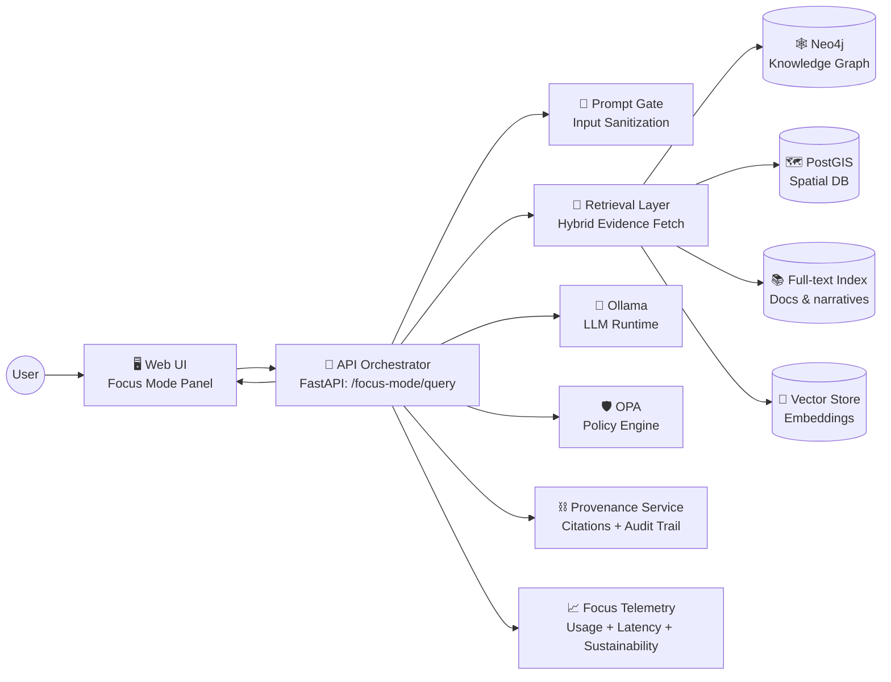
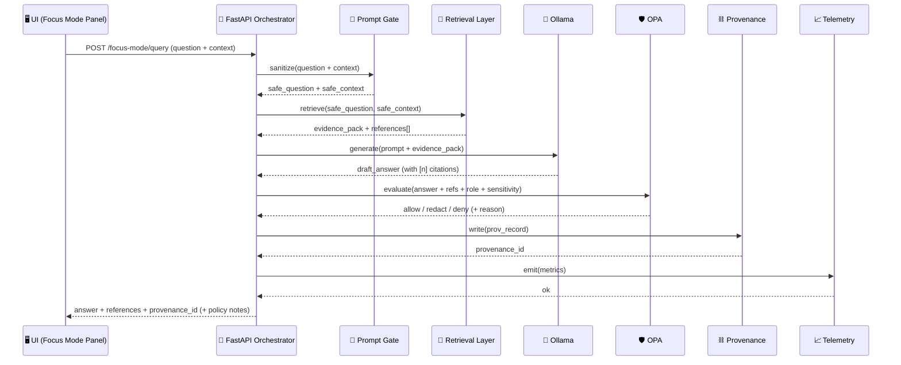

# 🧭🤖 AI Architecture — Focus Mode

`🧬 Provenance-First` `🔍 Hybrid RAG` `🗺️ Geo+Time Context` `🛡️ Policy-as-Code (OPA)` `🦙 Ollama Runtime` `🧪 Reproducible Analytics`

> [!IMPORTANT]
> **Focus Mode is advisory-only.** It never takes autonomous actions and it never “freewheels” beyond KFM’s data. If it can’t cite sources, it must say so.

---

## 📌 Purpose

This document describes how KFM’s AI capabilities are designed and integrated, focusing on:

- **Focus Mode** (user-facing Q&A + analysis assistant)
- **Evidence packaging** (citations, provenance, explainability)
- **Governance** (prompt filtering + OPA output policy layer)
- **Ollama integration** (local-first LLM runtime + embedding workflow)
- **Related AI subsystems** (Watcher→Planner→Executor automation + analytics modules)

---

## 🎯 Scope

| ✅ In scope | 🚫 Out of scope |
|---|---|
| Focus Mode pipeline & contracts | UI component styling specifics |
| Retrieval architecture (graph + DB + doc search + vectors) | Full ingestion pipeline internals (see data pipeline docs) |
| Governance layers (Prompt Gate + OPA) | Detailed Rego policy pack contents |
| Provenance & citation rules | Concrete dataset schemas (STAC/DCAT/PROV specifics live elsewhere) |
| Ollama runtime patterns (model config, embeddings, caching) | Picking “the best” model family (decision is environment-dependent) |

---

## 👥 Audience

- 🧑‍💻 Backend engineers (FastAPI, retrieval, policy, logging)
- 🧑‍🎨 Frontend engineers (Focus Mode panel integration + citations UX)
- 🧑‍🔬 Data/ML engineers (embeddings, evaluation, reproducible analytics)
- 🧑‍⚖️ Governance/security reviewers (OPA rules, sensitive-data constraints)

---

## 🧠 Glossary

- **Focus Mode**: KFM’s integrated AI assistant for context-aware Q&A with citations.
- **Evidence Pack**: The curated set of snippets/records/graph paths used to answer a question.
- **Hybrid RAG**: Retrieval across multiple stores (graph + spatial DB + full-text + embeddings).
- **Prompt Gate**: Input filtering stage to neutralize prompt-injection / policy violations.
- **OPA**: Open Policy Agent; evaluates AI output + context to allow/deny/redact.
- **PROV / Provenance record**: Machine-readable trace of what sources + processing created an output.
- **W-P-E**: Watcher→Planner→Executor automation loop (maintenance + pipeline ops).

---

## 🗺️ Quick Mental Model

Focus Mode is a **thin UI client** plus a **server-side orchestration pipeline**:

1. UI sends **question + current context** (map extent, layers, timeline, story state)
2. Backend runs **Prompt Gate** → **retrieval** → **LLM synthesis** → **OPA check**
3. Backend returns **structured answer + references + provenance ID**
4. UI renders answer with **footnotes/clickable citations** + (optional) **audit/explain panel**

---

## 🧱 Architecture Overview

### 🧩 C4-ish System Context



### 🧠 Why the split?

- **UI stays modular** ✅ (Focus Mode is additive, not entangled across the app)
- **Backend owns trust** ✅ (citations + policy enforcement happen server-side)
- **LLM remains replaceable** ✅ (Ollama is a pluggable runtime, not the architecture)

---

## 🔄 Focus Mode Pipeline

### ✅ Step-by-step (contractual)

1. **Context Gathering** 🗺️  
   Collect viewport, selected feature(s), active layers, timeline range, current story node.

2. **Prompt Gate (input)** 🧼  
   Strip/neutralize prompt injection and block policy-violating content.

3. **Intent + Query Plan** 🧭  
   Identify entity/time/space constraints and select retrieval routes (graph vs spatial vs docs vs vectors).

4. **Hybrid Retrieval** 🔎  
   Pull:
   - graph paths (relationships + entities)
   - spatial features/aggregates
   - document snippets (full-text)
   - semantically similar passages (vector)

5. **Evidence Pack Assembly** 📦  
   Normalize all retrieved items into a consistent structure (each with provenance pointers).

6. **Prompt Construction** 🧠  
   Compose system + task prompt + evidence pack, with strict citation rules.

7. **LLM Synthesis (Ollama)** 🦙  
   Generate a draft answer with citation markers (e.g., `[1] [2]`).

8. **Post-processing** 🧾  
   Validate citation coverage, map markers → reference objects, format answer.

9. **OPA Policy Check (output)** 🛡️  
   Allow/deny/redact + produce user-facing explanation if restricted.

10. **Provenance Record + Telemetry** ⛓️📈  
   Persist provenance and log metrics (including sustainability metrics if enabled).

### 🔁 Sequence Diagram



---

## 🧩 Core Components

## 1) 🖥️ Frontend — Focus Mode Panel

**Design goals**
- “Thin client” that only orchestrates UI state + API calls
- Provide the backend with *enough context* to narrow retrieval
- Render citations as **clickable footnotes** and support **audit/explain UI**

**Context you should send (minimum)**
- `viewport`: bounding box + zoom/center
- `timeline`: selected year or range
- `layers`: list of active layer IDs
- `selection`: selected feature IDs (county, point feature, story node)
- `story`: active story node ID (if any)
- `session`: conversation ID + (optional) short chat history

> [!TIP]
> Add “Ask Focus Mode” entry points on dataset pages and story nodes (contextual Q&A). It keeps questions precise and reduces retrieval load.

---

## 2) 🧰 API Orchestrator — `/focus-mode/query`

The orchestrator is the “contract owner” for Focus Mode:

- ✅ owns retrieval routing + evidence pack schema
- ✅ owns citation enforcement + refusal behavior
- ✅ owns OPA policy evaluation + redaction messaging
- ✅ owns provenance recording + telemetry events

**Design rule**
- UI never talks to the model directly.
- Model never talks to DBs directly.
- Retrieval + governance happen server-side only.

---

## 3) 🔎 Retrieval Layer — Hybrid RAG

Focus Mode uses **multiple truth stores**, each good at something:

### 🕸️ Knowledge Graph (Neo4j)
Best for:
- entity relationships (people ↔ places ↔ events ↔ organizations)
- multi-hop reasoning (via retrieval traversal, not “LLM guessing”)
- disambiguation (same name, different entity)

### 🗺️ Spatial DB (PostGIS)
Best for:
- spatial containment/intersection queries
- aggregations (counts, totals, histograms)
- feature discovery within map viewport/time filters

### 📚 Full-text Index
Best for:
- matching exact phrases (quotes, names, dates)
- story/narrative documents, scanned-text sources (once indexed)
- quick “find the paragraph” evidence

### 🧲 Vector Store (Embeddings)
Best for:
- semantic similarity (“this sounds like that”)
- fuzzy matches across historical phrasing
- thematic retrieval when keywords don’t match

---

## 4) 📦 Evidence Pack Contract

Focus Mode’s reliability depends on a strict evidence schema.

Every evidence item should contain:

- `ref_id`: stable reference ID (dataset/doc/node)
- `ref_type`: `dataset | document | graph_node | query_result`
- `title`: human-readable label
- `excerpt`: short snippet used in the answer
- `spatiotemporal`: optional bbox + time range
- `provenance`: source pointer(s), license, version/digest, checksum if available
- `sensitivity`: public / sensitive / restricted
- `retrieval_trace`: how we got it (query used, rank score, etc.)

> [!NOTE]
> Think of the evidence pack as a **mini bibliography** + **lab notebook** for the answer.

---

## 5) 🦙 LLM Runtime — Ollama

Ollama is treated like an **LLM runtime service**:
- local-first (offline-friendly)
- model switching via tags
- supports **Modelfiles** for templating + context settings
- can run embedding models for semantic search

### 🧠 Context size + caching
- Prefer models with larger context windows for “evidence-heavy” answers.
- Configure `num_ctx` in Modelfile when appropriate.
- Cache at the **application layer**:
  - frequently asked question contexts
  - repeated evidence packs for similar map/time queries
  - short-term session memory packs

### 🧬 Model customization
- Use Modelfiles to define:
  - base model (`FROM`)
  - optional LoRA adapters (`ADAPTER`)
  - system prompt + formatting rules (`SYSTEM`, `TEMPLATE`)
  - context window (`PARAMETER num_ctx ...`)

### 🧲 Embeddings + vector store
A typical pattern:
1. Use an Ollama embedding model to embed documents/chunks
2. Store vectors in a dedicated vector store
3. Retrieve nearest neighbors and include them as evidence items

---

## 6) 🛡️ Governance — Prompt Gate + OPA

## Prompt Gate (Input) 🧼
Goals:
- remove/neutralize prompt injection attempts
- block disallowed queries early (policy violations)
- normalize and de-risk user text before retrieval/LLM calls

## OPA (Output) 🛡️
OPA evaluates the **draft answer + references + user role + sensitivity** to decide:

- ✅ allow
- ⚠️ redact (with explanation)
- ⛔ deny/refuse (with explanation)

Typical rule families:
- **No citation → no answer**
- **No precise locations for sensitive sites**
- **No personal identifying details**
- **Role-based access constraints**
- **“Say no when you don’t know”** (no hallucinated completions)

> [!IMPORTANT]
> The policy layer must be updateable **without changing AI code** (policy-as-code workflow).

---

## 7) ⛓️ Provenance & Citation Enforcement

**Hard rule:** If a claim cannot be traced to evidence, it does not get said.

### Citation UX conventions
- Answer contains numbered markers: `[1] [2] ...`
- Response includes `references[]` with full metadata
- UI renders citations as footnotes/clickable links/popovers

### Provenance record content (minimum)
- question + sanitized question
- user context snapshot (map/time/layers/story)
- evidence pack IDs + digests/versions if available
- model identifier (name/tag) + prompt template version
- policy decision output
- timestamps + request IDs (traceability)

---

## 8) 📈 Observability — Focus Telemetry

Focus Telemetry should capture:
- usage frequency
- latency breakdown (retrieval vs generation vs policy)
- cache hits/misses
- policy denies/redactions (counts + reasons)
- sustainability metrics (energy/carbon if enabled)
- quality signals (citation coverage %, refusal rate, user feedback)

> [!TIP]
> Use telemetry thresholds to trigger scaling (e.g., add caching or scale LLM instances).

---

## 9) 🤖 Maintenance AI — Watcher→Planner→Executor (W-P-E)

Focus Mode is **user-facing AI**. W-P-E is **ops-facing AI**.

- **Watcher** detects issues (new data available, schema drift, vulnerabilities, governance gaps)
- **Planner** proposes a safe plan (policy-constrained)
- **Executor** runs changes (pipelines / PRs) with final policy gate + human review

Key safeguards:
- **idempotency** (don’t loop or spam)
- **global kill switch**
- **OPA-governed agent behavior**
- **human-in-the-loop merges**
- **supply-chain integrity** (SBOM, signatures, attestations)

---

## 10) 🧪 AI Analytics Modules (beyond Q&A)

KFM’s AI architecture is extensible to:
- remote sensing + ML pipelines (deterministic, reproducible)
- scenario/simulation “what-if” models (treated as annotated experiments)
- model governance workflows (approval, audit trail, reproducible environments)

---

## 🔌 API Contract (Recommended)

> [!NOTE]
> This is an **architecture-level contract**. Align field names with actual code when implementing.

### Request (example)

```json
{
  "question": "What happened here around this time?",
  "context": {
    "viewport_bbox": [-101.2, 37.0, -94.6, 40.1],
    "timeline": { "start": "1930-01-01", "end": "1939-12-31" },
    "active_layers": ["drought_index", "county_boundaries"],
    "selected_features": [
      { "type": "county", "id": "ks_finney" }
    ],
    "story_node_id": "dust-bowl-intro"
  },
  "session": {
    "conversation_id": "uuid-123",
    "history": [
      { "role": "user", "content": "Show me drought trends." }
    ]
  },
  "user": { "role": "public" },
  "model": { "name": "kfm-local-llm", "mode": "balanced" }
}
```

### Response (example)

```json
{
  "answer_markdown": "In the 1930s, this county experienced severe drought impacts... [1][2]",
  "references": [
    {
      "ref": 1,
      "ref_type": "dataset",
      "id": "stac:ks:drought:1930s:v3",
      "title": "Kansas Drought Index (1930–1939)",
      "excerpt": "1934–1936 values show sustained drought severity...",
      "provenance": {
        "prov_id": "prov:abc123",
        "license": "CC-BY-4.0",
        "digest": "sha256:..."
      },
      "spatiotemporal": {
        "bbox": [-100.9, 37.7, -100.0, 38.3],
        "time_range": { "start": "1930-01-01", "end": "1939-12-31" }
      }
    }
  ],
  "provenance_id": "prov:focusmode:run:xyz789",
  "policy": {
    "status": "allowed",
    "notes": []
  },
  "telemetry": {
    "latency_ms": 2840,
    "cache_hit": false
  }
}
```

---

## 🗂️ Suggested Backend Layout (AI module)

```text
KFM-Backend/
├── api/
│   └── routes/
│       └── focus_mode.py         # POST /focus-mode/query
├── ai/
│   ├── focus_pipeline.py         # Orchestration pipeline
│   ├── ollama_client.py          # Ollama API wrapper
│   ├── retrieval.py              # Graph/DB/search/vector retrieval
│   ├── prompt_templates/
│   │   └── focus_mode.txt        # System + task prompt templates
│   ├── policy_checks.py          # OPA integration + local checks
│   └── provenance.py             # provenance records & reference formatting
└── telemetry/
    └── focus_telemetry.py        # metrics/events
```

---

## 🔐 Security & Privacy Checklist

### ✅ Must-have controls
- Prompt Gate on every request
- OPA policy evaluation on every response
- AI runs sandboxed with **whitelisted tool access only**
- Secrets/credentials never enter prompts
- Rate limiting + abuse controls on the API
- Audit logging for governance review

### 🕵️ Privacy & inference control (design posture)
- Prefer aggregation/generalization for sensitive spatial features
- Consider query auditing patterns to reduce inference attacks (especially on small groups)

---

## ✅ Testing & Evaluation Checklist

### 🧪 Functional correctness
- retrieval unit tests (graph, spatial, text, vector)
- evidence pack schema validation tests
- response schema tests (answer + references always well-formed)

### 🧾 Trust & safety
- golden test suite: “no citation → refusal”
- policy tests: OPA rules (allow/deny/redact) with fixtures
- prompt injection tests (Prompt Gate should neutralize)

### 📉 Regression & drift
- benchmark latency per environment
- monitor refusal/redaction rates
- track citation coverage % and “unknown” responses

---

## 🧭 Roadmap Hooks

- 🌐 Federation across multiple “Frontier Matrix” instances (cross-region Q&A)
- 🧠 Multi-model routing (fast vs deep modes)
- 🧩 Expanded analytics modules (remote sensing, what-if simulation)
- 🧑‍🤝‍🧑 Community governance tooling (policy packs + review workflows)
- 🗺️ 4D/3D + AR experiences where AI citations remain first-class

---

## 📚 Sources of Truth in This Repo

> [!TIP]
> Treat these as **design contracts**. If code disagrees, either fix the code or create an ADR explaining why.

### 🧾 Core KFM Architecture Docs
- `Kansas Frontier Matrix (KFM) – AI System Overview 🧭🤖.pdf`
- `KFM AI Infrastructure – Ollama Integration Overview.pdf`
- `📚 Kansas Frontier Matrix (KFM) – Expanded Technical & Design Guide.pdf`
- `Kansas Frontier Matrix (KFM) – Comprehensive Technical Documentation.pdf`
- `Kansas Frontier Matrix (KFM) – Comprehensive Platform Overview and Roadmap.pdf`
- `Kansas Frontier Matrix (KFM) – Comprehensive Architecture, Features, and Design.pdf`
- `Kansas Frontier Matrix (KFM) – Comprehensive UI System Overview (Technical Architecture Guide).pdf`
- `Kansas-Frontier-Matrix_ Open-Source Geospatial Historical Mapping Hub Design.pdf`

### 🧪 Research + Engineering Library (Project Files)
<details>
<summary>📦 Supplemental PDFs & protocols (click to expand)</summary>

- `Scientific Method _ Research _ Master Coder Protocol Documentation.pdf` (reproducibility + documentation rigor)
- `Data Mining Concepts and Applications.pdf` (privacy, inference control, query auditing patterns)
- `KFM- python-geospatial-analysis-cookbook.pdf` (geospatial workflows + visualization patterns)

**PDF Portfolios (multi-doc bundles — open with a PDF portfolio-capable viewer):**
- `AI Concepts & more.pdf`
- `Maps-GoogleMaps-VirtualWorlds-Archaeological-Computer Graphics-Geospatial-webgl.pdf`
- `Various programming langurages & resources 1.pdf`
- `Data Managment-Theories-Architures-Data Science-Baysian Methods-Some Programming Ideas.pdf`
- `Mapping-Modeling-Python-Git-HTTP-CSS-Docker-GraphQL-Data Compression-Linux-Security.pdf`
- `Geographic Information-Security-Git-R coding-SciPy-MATLAB-ArcGIS-Apache Spark-Type Script-Web Applications.pdf`

</details>

---

## ✅ Next Actions (Recommended)

- [ ] Create/confirm the **evidence pack schema** (JSON Schema) and enforce it in CI
- [ ] Add a minimal **OPA policy pack** that enforces:
  - citations required
  - sensitive locations redacted
  - no PII
- [ ] Implement a **golden test suite** for Focus Mode (citations + refusal behavior)
- [ ] Add **telemetry dashboards** for latency, redactions, refusal rate, and cache efficacy
- [ ] Add ADRs for:
  - Ollama selection rationale
  - vector store selection
  - evidence pack contract versioning

---