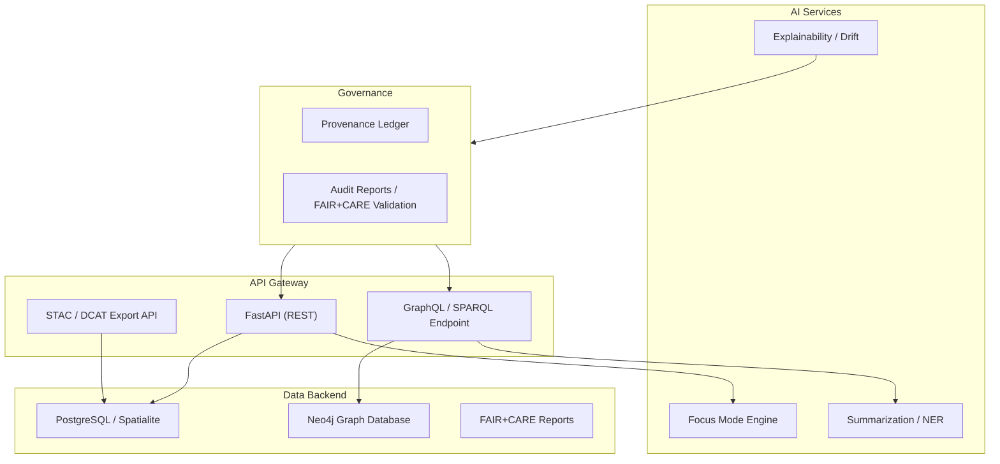

<div align="center">

# 🌐 **Kansas Frontier Matrix — API Architecture (v2.1.1 · Tier-Ω+∞ Certified)**  
`docs/architecture/api-architecture.md`

**Mission:** Define the **API layer** of the **Kansas Frontier Matrix (KFM)** — enabling secure, FAIR+CARE-aligned access  
to data, knowledge graph entities, AI reasoning, and provenance information through REST, GraphQL, and STAC/DCAT interfaces.

[](../../docs/)
[](../../src/api/openapi.yaml)
[](../../src/api/schema.graphql)
[](../../docs/standards/faircare-validation.md)
[](../../LICENSE)

</div>

---

## 📚 Overview

The **KFM API architecture** unifies access to all data, models, and governance resources under a modular, standards-based system.  
APIs provide external researchers, developers, and AI systems with access to:
- FAIR+CARE-compliant **STAC/DCAT datasets**  
- **GraphQL knowledge graph** queries  
- **AI reasoning** and explainability endpoints  
- **Provenance and governance** metadata  

All endpoints are **secured**, **versioned**, and **documented** automatically under **OpenAPI 3.1** and **GraphQL SDL** specifications.

---

## 🧩 API Layer Overview


<!-- END OF MERMAID -->

---

## ⚙️ Core API Components

| Component | Function | Technology | Output |
|:--|:--|:--|:--|
| **REST API** | Exposes dataset and metadata endpoints for public access. | FastAPI | `/api/v1/data/`, `/api/v1/meta/` |
| **GraphQL API** | Provides semantic query layer for entities and events. | Ariadne / Strawberry | `/graphql` |
| **STAC API** | Serves dataset collections following STAC 1.0 spec. | PySTAC + FastAPI | `/api/v1/stac/` |
| **DCAT Exporter** | Converts STAC metadata to DCAT 3.0. | Python / JSON-LD | `/api/v1/dcat/` |
| **Governance API** | Serves provenance and audit information. | REST + JSON | `/api/v1/governance/` |
| **AI API** | Exposes Focus Mode reasoning and summaries. | PyTorch + FastAPI | `/api/v1/ai/focus/` |

---

## 🧠 Example Endpoints

| Endpoint | Method | Description | Auth |
|:--|:--|:--|:--|
| `/api/v1/stac/collections` | GET | List all available STAC collections. | Public |
| `/api/v1/stac/items/{id}` | GET | Retrieve a specific STAC item metadata record. | Public |
| `/api/v1/graph/query` | POST | Run Cypher/GraphQL queries against Neo4j. | Authenticated |
| `/api/v1/ai/focus/{entity_id}` | GET | Retrieve Focus Mode AI summaries for entity. | Authenticated |
| `/api/v1/governance/ledger` | GET | Return current governance and audit logs. | Authenticated |
| `/api/v1/dcat/export` | GET | Export dataset catalog in DCAT 3.0 JSON-LD. | Public |

---

## 🧩 OpenAPI Specification (REST)

- **Version:** 3.1  
- **Base URL:** `https://api.kfm.ai/v1/`  
- **Auth:** OAuth2 / API Key  
- **Format:** JSON / GeoJSON / JSON-LD  
- **Schema Location:** `src/api/openapi.yaml`  
- **Validator Workflow:** `.github/workflows/api-validate.yml`

> Each REST endpoint is automatically documented and validated via CI/CD workflows (`api-validate.yml`).

---

## 🔗 GraphQL Schema (Knowledge Graph Access)

```graphql
type Query {
  person(id: ID!): Person
  place(id: ID!): Place
  event(id: ID!): Event
  document(id: ID!): Document
  searchEntities(keyword: String!): [Entity]
}

type Person {
  id: ID!
  name: String!
  participatedIn: [Event]
}

type Event {
  id: ID!
  label: String!
  occurredAt: Place
  dateRange: TimeInterval
}

type Place {
  id: ID!
  name: String!
  geometry: Geometry
}
```

---

## ⚖️ FAIR + CARE Integration

| Principle | Implementation | Artifact |
|:--|:--|:--|
| **Findable** | Dataset and entity endpoints indexable via STAC and GraphQL search. | `/api/v1/stac/` |
| **Accessible** | REST and GraphQL APIs open with rate-limited public access. | OAuth2 |
| **Interoperable** | JSON-LD + DCAT 3.0 + CIDOC mapping. | `metadata_bridge.py` |
| **Reusable** | All API outputs versioned and checksum-verified. | `releases/v*/manifest.zip` |
| **Collective Benefit (CARE)** | Governance endpoints ensure ethical data traceability. | `/api/v1/governance/` |

---

## 🔍 API Validation & CI/CD Workflows

| Workflow | Description | Output |
|:--|:--|:--|
| `api-validate.yml` | Validates OpenAPI and GraphQL schema syntax. | `reports/validation/api_validation_report.json` |
| `policy-check.yml` | Checks for license and metadata completeness. | `reports/audit/policy_check.json` |
| `stac-validate.yml` | Ensures STAC/DCAT metadata validity for endpoints. | `reports/validation/stac_validation_report.json` |
| `governance-ledger.yml` | Logs API version and checksum into provenance ledger. | `data/reports/audit/data_provenance_ledger.json` |

---

## 🔐 Security & Access Control

- **Auth Mechanisms:** OAuth2, API Key, and token-based access for restricted endpoints.  
- **Rate Limiting:** Adaptive rate control per IP and token.  
- **Data Encryption:** HTTPS (TLS 1.3) with HSTS policy.  
- **Audit Trails:** All access requests logged in the governance ledger.  
- **Vulnerability Scans:** Automated via CodeQL + Trivy CI jobs.  

---

## 🧾 Example FAIR+CARE Metadata for API Responses

```json
{
  "id": "api.v1.ai.focus.2025-11-16",
  "title": "Focus Mode AI Reasoning Endpoint",
  "license": "MIT · CC-BY 4.0",
  "governance": "docs/standards/governance/ROOT-GOVERNANCE.md",
  "provenance": {
    "ledger": "data/reports/audit/data_provenance_ledger.json",
    "checksum": "sha256:93f8a1cde0d...",
    "version": "v2.1.1"
  },
  "faircare": {
    "findable": true,
    "accessible": true,
    "interoperable": true,
    "reusable": true,
    "collective_benefit": true
  }
}
```

---

## 🧠 Observability Metrics

| Metric | Description | Threshold | Source |
|:--|:--|:--|:--|
| **availability_uptime** | API uptime monitoring | ≥ 99.9% | Prometheus |
| **response_latency** | 95th percentile latency | ≤ 250 ms | FastAPI metrics |
| **stac_metadata_validity** | Valid STAC/DCAT responses | 100% | `stac-validate.yml` |
| **governance_audit_sync** | Provenance ledger update success | 100% | `governance-ledger.yml` |

---

## 🕰 Version History

| Version | Date | Author | Summary |
|:--|:--|:--|:--|
| **v2.1.1** | 2025-11-16 | @kfm-architecture | Standardized API architecture doc; added FAIR+CARE compliance, governance ledger, and GraphQL schema. |
| v2.0.0 | 2025-10-25 | @kfm-api | Introduced provenance API and DCAT export endpoint. |
| v1.0.0 | 2025-10-04 | @kfm-architecture | Initial API layer documentation (REST + GraphQL). |

---

<div align="center">

**Kansas Frontier Matrix © 2025**  
*“Every Endpoint Has Ethics — Every Response Has Provenance.”*  
📍 `docs/architecture/api-architecture.md` — REST, GraphQL, and metadata API architecture for the Kansas Frontier Matrix.

</div>

