<div align="center">

# 🔌 **Kansas Frontier Matrix — API Architecture (v2.0.0 · Tier-Ω+∞ Certified)**  
`docs/architecture/api-architecture.md`

**Mission:** Specify the **API subsystem architecture** for the **Kansas Frontier Matrix (KFM)** — how data, metadata, and visualization assets are **exposed, validated, cached, versioned, and provenanced** via **standards-first** endpoints.  
APIs are designed for **reproducibility**, **interoperability**, and **supply-chain integrity** under **MCP-DL v6.3** and **FAIR/CARE**.

[](../../docs/)
[](../../.github/workflows/stac-validate.yml)
[](../../.github/workflows/codeql.yml)
[](../../.github/workflows/sbom.yml)
[](../../.github/workflows/slsa.yml)
[](../../LICENSE)

</div>

---

```yaml
---
title: "KFM — API Architecture"
document_type: "Architecture Spec"
version: "v2.0.0"
last_updated: "2025-11-16"
owners: ["@kfm-architecture","@kfm-data","@kfm-web","@kfm-security"]
status: "Stable"
maturity: "Production"
license: "MIT"
tags: ["api","stac","rest","graphql","json-ld","tiles","provenance","slsa","sbom","cache","etag","ogc"]
alignment:
  - MCP-DL v6.3
  - STAC 1.0 / STAC API
  - DCAT 2.0
  - JSON Schema / JSON-LD
  - CIDOC CRM / OWL-Time / GeoSPARQL
  - OGC (Tiles, Features)
validation:
  ci_required: ["stac-validate.yml","docs-validate.yml","policy-check.yml"]
  openapi_required_fields: ["info.version","servers","paths","components.schemas"]
observability:
  endpoint: "https://metrics.kfm.ai/api"
  metrics: ["p95_latency_ms","error_rate_pct","cache_hit_pct","stac_pass_rate","artifact_verification_pct"]
preservation_policy:
  retention: "api logs 90d · provenance bundles 365d"
  checksum_algorithm: "SHA-256"
---
```

---

## 📚 Overview

The **KFM API** is a **standards-first, read-optimized** layer serving:
- **STAC** catalogs/search, assets, and checksums  
- **Dataset/tiles** for maps and time-slices  
- **Graph** queries (GraphQL) and **JSON-LD** entity dossiers  
- **Diagnostics**: counts, domains, checksum reports  

> **Design tenets:** REST by default · STAC-driven · immutable versioning · stateless · cached · provenanced · observable.

---

## 🏗 Architecture Overview

```mermaid
flowchart TD
  A["data/stac/ (Catalogs)"] --> B["API Gateway<br/>/api/v1/"]
  A --> C["Graph Indexers"]
  B --> D["STAC JSON / Search"]
  B --> E["Data Assets<br/>/data/processed/ · /tiles/"]
  B --> F["Checksums · Sources<br/>/checksums · /sources"]
  B --> G["GraphQL & JSON-LD<br/>/api/v1/graph /entities/{id}"]
  B --> H["Diagnostics<br/>/stats · /metadata"]
  H --> I["Observability · Metrics"]
```


<!-- END OF MERMAID -->

---

## 🧩 API Design Principles

| Principle | Implementation |
|:--|:--|
| **Versioned & Predictable** | `/api/v1/...` (frozen), `/api/v2/...` reserved for OGC/graph expansions |
| **STAC-Driven** | STAC 1.0 catalog + **/stac/search** (bbox, datetime, intersects) |
| **Stateless** | No sessions or cookies; auth-free for public data |
| **Schema-Validated** | JSON Schema + STAC validators in CI and runtime smoke tests |
| **Provenance-Enforced** | Responses link to **checksums** and **source manifests**; provenance headers |
| **Content Negotiation** | `Accept: application/json, application/geo+json, application/ld+json` |
| **Caching & ETags** | CDN/Etag/Last-Modified enabled; immutable datasets use far-future cache |

---

## 🗺 Endpoint Map (v1)

```text
/api/
└── v1/
    ├── stac/
    │   ├── catalog.json                     # Root STAC
    │   ├── collections/*.json               # Domain catalogs
    │   └── search                           # STAC API search (GET/POST)
    ├── data/{domain}/{asset}.{tif|geojson}  # Immutable asset URLs
    ├── tiles/{layer}/{z}/{x}/{y}.pbf        # Vector tiles (if published)
    ├── checksums/{domain}/{asset}.sha256    # SHA-256 files for assets
    ├── sources/{domain}/{src}.json          # Source/manifests
    ├── metadata/{domain}.json               # Aggregated metadata summary
    ├── stats/{counts|domains|checksum_report}.json
    ├── entities/{id}                        # JSON-LD entity dossier (graph view)
    └── graph                                # GraphQL endpoint (POST)
```

> **v2 roadmap:** OGC API - Features/Tiles, parameterized time layers, and filtered entity collections.

---

## 🔎 Representative Endpoints

| Function | Method | Path | Notes |
|:--|:--|:--|:--|
| **Root Catalog** | GET | `/api/v1/stac/catalog.json` | Links collections & next pages |
| **STAC Search** | GET/POST | `/api/v1/stac/search?bbox=&datetime=&limit=` | Supports `bbox, datetime, intersects, collections` |
| **Asset** | GET | `/api/v1/data/terrain/ks_1m_dem_2018_2020.tif` | Cloud-Optimized GeoTIFF |
| **Checksum** | GET | `/api/v1/checksums/terrain/ks_1m_dem_2018_2020.tif.sha256` | For reproducibility |
| **Source** | GET | `/api/v1/sources/terrain/usgs_3dep_dem.json` | Provenance manifest |
| **Tiles** | GET | `/api/v1/tiles/{layer}/{z}/{x}/{y}.pbf` | Vector tile endpoint (optional) |
| **Entity Dossier** | GET | `/api/v1/entities/{id}` | JSON-LD dossier from graph |
| **GraphQL** | POST | `/api/v1/graph` | Typed queries for entities/events |

---

## 📦 Example STAC Search (GET)

```http
GET /api/v1/stac/search?bbox=-102,36.9,-94.5,40.0&datetime=2018-01-01/2020-12-31&limit=100
Accept: application/geo+json
```

**Response (abridged)**

```json
{
  "type": "FeatureCollection",
  "context": {"returned": 1, "limit": 100},
  "features": [{
    "type":"Feature",
    "id":"ks_1m_dem_2018_2020",
    "stac_version":"1.0.0",
    "properties":{
      "title":"Kansas LiDAR DEM (1m)",
      "datetime":"2020-01-01T00:00:00Z",
      "license":"Public Domain",
      "created":"2025-01-15T12:03:04Z"
    },
    "assets":{
      "data":{"href":"/api/v1/data/terrain/ks_1m_dem_2018_2020.tif","type":"image/tiff; application=geotiff; profile=cloud-optimized"},
      "checksum":{"href":"/api/v1/checksums/terrain/ks_1m_dem_2018_2020.tif.sha256"},
      "metadata":{"href":"/api/v1/sources/terrain/usgs_3dep_dem.json"}
    },
    "bbox":[-102.05,36.99,-94.59,40.00]
  }]
}
```

---

## 🧱 Response Contracts

### Standard Headers
| Header | Purpose |
|:--|:--|
| `ETag` | Asset/content cache validation |
| `Last-Modified` | Client cache control |
| `X-KFM-Checksum` | SHA-256 of payload (if small) |
| `X-KFM-Source` | Link to source manifest |
| `X-KFM-Provenance` | Link to provenance bundle (release) |
| `Cache-Control` | `public, max-age=31536000, immutable` for immutable assets |

### Error Schema

```json
{
  "error": {
    "code": "NotFound",
    "status": 404,
    "message": "Asset not found",
    "correlation_id": "9c8c8f8f-8c8f-4e7b-9d61-1e6cbd",
    "hint": "Verify dataset name and version"
  }
}
```

---

## 🧰 OpenAPI & GraphQL

- **OpenAPI spec** published at `docs/api/openapi.yaml` (CI-validated).  
- **GraphQL** schema introspection available in `docs/api/schema.graphql`.  
- Contract tests run via `make api-contract-test` and in CI (`api-contract.yml`, optional).

---

## 🔐 Security & Access

| Control | Description |
|:--|:--|
| **Open by Default** | Read-only endpoints for public data; no API key. |
| **HTTPS Only** | TLS enforced on production host. |
| **CORS** | Permissive for GET; restricted for future POST endpoints. |
| **Rate Limits** | e.g., `60 req/min/IP` (CDN/WAF enforced). |
| **Immutable Assets** | Assets are content-addressable by version; never mutated in place. |

> Private/preview endpoints are isolated behind environment gates when needed.

---

## 🚀 Performance & Caching

- **Static hosting** + CDN; COGs stream via HTTP range requests.  
- **ETags** + `Cache-Control: immutable` for assets, **surrogate control** at CDN layer.  
- **Pagination**: STAC search supports `limit` and (optional) `links.next`.

**SLOs**
- `GET /api/v1/stac/catalog.json`: p95 ≤ **150 ms** (cold)  
- `GET /api/v1/stac/search`: p95 ≤ **300 ms**  
- tile endpoint: ≥ **55 fps** rendering downstream (UI budget)

---

## 🧪 Validation & Logging

| Layer | Purpose | Workflow |
|:--|:--|:--|
| **STAC Validation** | Schema & links | `.github/workflows/stac-validate.yml` |
| **Checksum Sync** | Asset → checksum parity | `checksums.yml` |
| **OpenAPI Lint** | Spec completeness | `api-contract.yml` (optional) |
| **Link Smoke** | `GET` 200 checks | `make api-validate` |
| **Usage Logs** | Request/response status | `data/work/logs/api_requests.log` |

Provenance bundles (SBOM/SLSA/`.prov.json`) attached to releases.

---

## 🧭 Integration with Systems

| System | Integration | Description |
|:--|:--|:--|
| **Web Viewer** | Tiles + STAC | MapLibre loads tiles & metadata live |
| **ETL Pipelines** | Manifests + checksum endpoints | Reliable fetch & verify |
| **Researchers** | REST & STAC search | Reproducible data pulls |
| **STAC Federation** | Catalog linking | Compatible with NASA/NOAA/USGS hubs |

---

## 🧭 Content Negotiation & JSON-LD

- Clients may request `application/ld+json` for entity dossiers (`/entities/{id}`) to include **@context** and linked data.  
- When `Accept: application/geo+json`, STAC search returns a FeatureCollection.

---

## 🧭 OGC & v2 Roadmap (Preview)

- **OGC API - Tiles/Features** alignment for vector/raster endpoints.  
- **Time-parameterized tiles** (`/tiles/{layer}/{z}/{x}/{y}?t=YYYY`) for animation.  
- **Batch export** jobs (async) with webhook callbacks (if warranted).

---

## 🧪 Examples

**curl — STAC search**
```bash
curl -s "https://kfm.example.org/api/v1/stac/search?bbox=-102,36.9,-94.5,40.0&datetime=2018/2020&limit=10" \
  -H "Accept: application/geo+json" | jq '.context, .features[0].id'
```

**curl — checksum verify**
```bash
curl -s https://kfm.example.org/api/v1/checksums/terrain/ks_1m_dem_2018_2020.tif.sha256
```

**GraphQL — entity lookup**
```graphql
query($id: ID!) {
  entity(id: $id) {
    id
    label
    types
    related { id, label, relation }
  }
}
```

---

## 🧠 MCP Compliance Summary

| MCP Pillar | Implementation |
|:--|:--|
| Documentation-first | OpenAPI & GraphQL schema tracked; endpoints documented here |
| Reproducibility | Immutable URLs, checksums, STAC lineage |
| Open Standards | STAC, JSON Schema/LD, DCAT, OGC alignment |
| Provenance | Headers + checksum/source links; release bundles |
| Auditability | CI verifies schemas, links, and contracts |

---

## 🔗 Related Docs

- `docs/architecture/system-architecture-overview.md`  
- `docs/architecture/data-architecture.md`  
- `docs/architecture/knowledge-graph.md`  
- `docs/architecture/web-ui-architecture.md`  
- `.github/workflows/stac-validate.yml` · `.github/workflows/checksums.yml`

---

## 🗓 Version History

| Version | Date | Summary |
|:--|:--|:--|
| **v2.0.0** | 2025-11-16 | **Major**: Added OpenAPI/GraphQL contracts, content negotiation, caching/ETags, error schema, SLOs, observability, provenance headers, and OGC roadmap. |
| v1.0.0 | 2025-10-04 | Initial API architecture with STAC/REST endpoints and checksum/source links. |

---

<div align="center">

**Kansas Frontier Matrix — API Architecture**  
*“Every Endpoint Proven. Every Response Reproducible.”*

</div>