<div align="center">

# 🔗 **Kansas Frontier Matrix — API & Knowledge Graph Architecture**  
`docs/architecture/api-architecture.md`

**Purpose:**  
Describe the **backend API architecture**, **data access layers**, and **knowledge graph integration framework** powering the Kansas Frontier Matrix (KFM).  
Defines how all components—FastAPI, Neo4j, GraphQL, and STAC/DCAT metadata—interoperate under **FAIR+CARE** and **MCP-DL v6.3** to create a reproducible, ethically governed data ecosystem.

[](../README.md)
[](../../LICENSE)
[](../standards/faircare.md)
[](#)

</div>

---

## 📘 Overview

The **Kansas Frontier Matrix API layer** provides controlled access to structured, geospatial, and AI-enriched data via **FastAPI** and **GraphQL** endpoints.  
It sits atop a **Neo4j knowledge graph**, which connects people, places, events, and datasets using STAC/DCAT metadata, cultural ontologies, and FAIR+CARE governance rules.

**Core responsibilities:**
- Provide public and authenticated REST/GraphQL APIs for data access.  
- Query and maintain the **Knowledge Graph** (Neo4j + Cypher).  
- Integrate **STAC/DCAT catalogs** with FAIR+CARE metadata governance.  
- Enable AI-enhanced queries through Focus Mode and narrative summarization.  
- Enforce ethical and privacy rules through middleware governance checks.

---

## 🗂️ Directory Context

```plaintext
docs/
 └── architecture/
     ├── api-architecture.md        # This file — backend architecture doc
     ├── data-architecture.md       # Data schema and STAC/DCAT design
     ├── web-ui.md                  # Frontend and accessibility design
     └── github-architecture.md     # CI/CD and automation structure
```

---

## ⚙️ High-Level Architecture

```mermaid
flowchart TD
  A["User / Web Client"] --> B["FastAPI Gateway (REST / GraphQL)"]
  B --> C["Business Logic (ETL, Validation, Focus Mode AI)"]
  C --> D["Neo4j Knowledge Graph"]
  C --> E["STAC/DCAT Catalog Index"]
  D --> F["Data Sources (Tabular, Geo, AI Outputs)"]
  E --> F
  B --> G["Governance Middleware (FAIR+CARE · AuthZ)"]
  G --> H["Telemetry & Auditing (focus-telemetry.json)"]
```



### Components:
- **FastAPI** — primary service exposing REST and GraphQL endpoints.  
- **Neo4j** — graph database managing relationships between entities.  
- **STAC/DCAT** — metadata catalog interfaces, synchronized nightly.  
- **FAIR+CARE Middleware** — enforces ethical data visibility and access roles.  
- **Telemetry Layer** — logs all API calls, metrics, and compliance data.

---

## 🧩 API Endpoints Overview

| Route | Method | Description | Output |
|--------|---------|-------------|--------|
| `/api/search` | GET | Full-text and semantic search across graph and STAC metadata. | JSON / GraphQL |
| `/api/focus/{id}` | GET | Returns Focus Mode narrative for a graph entity. | Markdown / JSON |
| `/api/events` | GET | Time-bound query (ISO 8601) for historical events. | GeoJSON |
| `/api/places` | GET | Spatial lookup by bounding box or name. | GeoJSON / JSON-LD |
| `/api/map/layers` | GET | Returns active STAC/DCAT layers for map rendering. | JSON |
| `/api/telemetry` | POST | Receives telemetry event payloads. | HTTP 200 / JSON |
| `/api/governance/logs` | GET | Returns governance actions and CARE-tagged records. | JSON |

All endpoints are validated through OpenAPI 3.1 schemas and linked to FAIR+CARE governance rules.

---

## 🧮 GraphQL Schema Snapshot

```graphql
type Query {
  entity(id: ID!): Entity
  search(query: String!): [Entity]
  datasets(filter: DatasetFilter): [Dataset]
  timeline(year: Int): [Event]
}

type Entity {
  id: ID!
  label: String!
  type: String!
  summary: String
  relations: [Relation]
}

type Relation {
  type: String!
  target: Entity
  care_tag: String
}

type Dataset {
  id: ID!
  title: String!
  license: String
  checksum_sha256: String
  care_tag: String
}
```

This schema connects directly to **Neo4j nodes** through Cypher resolvers while enforcing FAIR+CARE constraints per entity.

---

## 🧠 Knowledge Graph Model (Neo4j)

The **Knowledge Graph** unifies datasets, documents, and entities through shared metadata and spatial context.

| Node Type | Ontology Reference | Example Properties |
|------------|--------------------|--------------------|
| `Person` | CIDOC CRM `E21 Person` | `name`, `birth_date`, `role`, `relation` |
| `Place` | CIDOC CRM `E53 Place` + GeoSPARQL | `geometry`, `country`, `bbox` |
| `Event` | CIDOC CRM `E5 Event` + OWL-Time | `time_start`, `time_end`, `description` |
| `Dataset` | DCAT 3.0 | `license`, `provenance`, `checksum`, `stac_ref` |
| `Document` | PROV-O / DCAT | `title`, `author`, `source_uri` |

### Governance Properties
- `care_tag`: `public`, `restricted`, or `sensitive`
- `governance_ref`: points to FAIR+CARE ledger entry
- `telemetry_ref`: logs all access and modification events

---

## ⚖️ FAIR+CARE Governance Integration

Each API request triggers a governance check:

| Checkpoint | Enforcement Mechanism | Reference |
|-------------|-----------------------|------------|
| **Authentication** | OAuth2 + JWT | `/api/auth/` |
| **Authorization** | Role-based access control (RBAC) | `governance_ref` |
| **CARE Filtering** | Query-level filtering of sensitive nodes | Neo4j Cypher filters |
| **Telemetry Logging** | Append event metadata to telemetry ledger | `focus-telemetry.json` |

Example Governance Rule:
```cypher
MATCH (n:Dataset)
WHERE n.care_tag = 'restricted' AND $userRole <> 'admin'
RETURN "Access Denied"
```

---

## 📊 Telemetry & Observability

Telemetry events emitted by the API include:
- `api_request` — request metadata (path, latency, user, status)
- `graph_query` — Cypher query metrics
- `governance_event` — ethical decision or access denial
- `focus_summary_generated` — AI narrative event
- `telemetry_merge` — daily aggregation summary

All telemetry merges into:  
`releases/v9.9.0/focus-telemetry.json` (validated under `telemetry_schema`).

---

## ♻️ Sustainability & Performance

| Metric | Target | Standard |
|--------|---------|-----------|
| Average API latency | ≤ 250 ms | ISO 19115 Service Response |
| Telemetry write success rate | 100% | ISO 50001 |
| Carbon efficiency (gCO₂e per 1000 req) | ≤ 1.5 | ISO 14064-1 |
| Availability | 99.9% uptime | FAIR+CARE Council Monitored |

---

## 🧭 Mermaid — Data Flow Overview


---

## 🔐 Security & Provenance

- **SLSA Level 3** provenance attestations for API deployments.  
- **Signed artifacts** using OIDC + Cosign.  
- **Audit logs** for every governance decision (`governance/ledger_snapshot.json`).  
- End-to-end encryption enforced via TLS 1.3.  
- Datasets served with checksum verification (SHA-256 + SPDX license ID).

---

## 🕰️ Version History

| Version | Date | Author | Summary |
|---------:|------|--------|---------|
| v9.9.0 | 2025-11-08 | `@kfm-architecture` | Added GraphQL schema, Neo4j integration, and telemetry governance linkage. |
| v9.8.0 | 2025-11-06 | `@kfm-backend` | Integrated FAIR+CARE middleware and sustainability metrics. |
| v9.7.0 | 2025-11-02 | `@kfm-core` | Established foundational FastAPI + Neo4j API documentation. |

---

<div align="center">

**Kansas Frontier Matrix**  
*Connected Data × FAIR+CARE Governance × Explainable Knowledge Graphs*  
© 2025 Kansas Frontier Matrix · CC-BY 4.0 · Master Coder Protocol v6.3 · FAIR+CARE Certified · Diamond⁹ Ω / Crown∞Ω Ultimate Certified  

[Back to Architecture Index](README.md) · [Governance Charter](../standards/governance/ROOT-GOVERNANCE.md)

</div>

