<div align="center">

# 🔗 **Kansas Frontier Matrix — API & Knowledge Graph Architecture**
`docs/architecture/api-architecture.md`

**Purpose:**  
Describe the **backend API architecture**, **data access layers**, and **knowledge graph integration framework** powering the Kansas Frontier Matrix (KFM).  
Defines how **FastAPI**, **GraphQL**, **Neo4j**, and **STAC/DCAT metadata** interoperate under **FAIR+CARE**, **SLSA**, and **MCP-DL v6.3** to create a reproducible, secure, and ethically governed data ecosystem.

[](../README.md)
[](../../LICENSE)
[](../standards/faircare.md)
[](../security/supply-chain.md)
[](#)
</div>

---

## 📘 Overview

The **KFM API layer** provides controlled access to structured, geospatial, and AI-enriched content through **FastAPI** (REST) and **GraphQL** endpoints.  
It sits atop a **Neo4j knowledge graph** that links People, Places, Events, Documents, and Datasets, bridged with **STAC 1.0 / DCAT 3.0** catalogs and governed by **FAIR+CARE** ethics and **security-by-design** controls.

**Core responsibilities**
- Expose **REST/GraphQL** for public and privileged access with **RBAC**.  
- Query and maintain the **Knowledge Graph** (Neo4j + Cypher/GraphQL resolvers).  
- Integrate **STAC/DCAT catalogs** with provenance, licensing, and CARE tags.  
- Enable **Focus Mode** & narrative summaries with explainability links.  
- Enforce ethical, privacy, and security controls via **governance middleware**.  
- Emit **telemetry** (latency, energy, CO₂e, access decisions) for audits and dashboards.

---

## 🗂️ Directory Context

```plaintext
docs/
 └── architecture/
     ├── api-architecture.md        # This file — backend architecture doc
     ├── data-architecture.md       # STAC/DCAT/CIDOC/GeoSPARQL/OWL-Time data model
     ├── web-ui-design.md           # Frontend & accessibility (MapLibre/Focus)
     ├── github-architecture.md     # CI/CD & governance automation
     └── telemetry-architecture.md  # Aggregation and sustainability metrics
```

**Related Security Suite**  
- Threat Model → `../security/threat-model.md`  
- Supply Chain → `../security/supply-chain.md`  
- Secrets Policy → `../security/secrets-policy.md`  
- Incident Response → `../security/incident-response.md`  
- Prompt Defense → `../security/prompt-injection-defense.md`

---

## ⚙️ High-Level Architecture

```mermaid
flowchart TD
  A["Client (Web/UI · Service)"] --> B["FastAPI Gateway (REST / GraphQL)"]
  B --> C["Gov Middleware (FAIR+CARE · AuthN/Z · Policy)"]
  C --> D["Business Layer (Resolvers · Focus · Validation)"]
  D --> E["Neo4j Knowledge Graph (Cypher/GraphQL)"]
  D --> F["STAC/DCAT Bridge (Catalog Index)"]
  E --> G["Data Sources (Geo · Tabular · Docs · AI Outputs)"]
  F --> G
  C --> H["Telemetry & Auditing (focus-telemetry.json)"]
```



### Components
- **FastAPI** — REST + GraphQL endpoints (OpenAPI 3.1).  
- **Governance Middleware** — OAuth2/OIDC, RBAC, CARE filters, rate limiting, egress rules.  
- **Business Layer** — Graph resolvers, Focus Mode orchestration, validation, caching.  
- **Neo4j** — Property graph with Cypher + @resolver mappings for GraphQL.  
- **STAC/DCAT Bridge** — Catalog sync + JSON-LD/DCAT round-trip parity checks.  
- **Telemetry** — ISO 50001 metrics; FAIR+CARE governance events; SLSA attestations.

---

## 🧩 API Endpoints (REST)

| Route | Method | Description | Output |
|------|--------|-------------|--------|
| `/api/search` | GET | Full-text + semantic search across graph & catalogs | JSON / GraphQL |
| `/api/focus/{id}` | GET | Focus narrative + subgraph (entity dossier) | JSON/Markdown |
| `/api/events` | GET | ISO 8601 time-range query for events | GeoJSON |
| `/api/places` | GET | BBOX/name spatial search with GeoJSON geometries | GeoJSON / JSON-LD |
| `/api/map/layers` | GET | Active STAC/DCAT layers for map rendering | JSON |
| `/api/datasets/{id}` | GET | DCAT dataset + STAC assets + checksums | JSON-LD |
| `/api/telemetry` | POST | Push client/runtime telemetry | 200 / JSON |
| `/api/governance/logs` | GET | FAIR+CARE actions & CARE-tagged records | JSON |

All inputs validated by **Pydantic/JSON Schema**; outputs carry **CARE tags** and **provenance**.

---

## 🧮 GraphQL Schema Snapshot

```graphql
type Query {
  entity(id: ID!): Entity
  search(query: String!, limit: Int = 25): [Entity]
  datasets(filter: DatasetFilter): [Dataset]
  timeline(range: TimeRange): [Event]
  focus(id: ID!): FocusDossier
}

type Entity {
  id: ID!
  label: String!
  type: String!
  summary: String
  relations(limit: Int = 50): [Relation]
  care_tag: String
  provenance: String
}

type Relation {
  type: String!
  target: Entity!
  care_tag: String
  source_ref: String
}

type Dataset {
  id: ID!
  title: String!
  license: String
  checksum_sha256: String
  stac_ref: String
  care_tag: String
}

type FocusDossier {
  entity: Entity!
  narrative: String
  explains: [Relation]
  uncertainty: Float
  model_card: String
}
```

Resolvers map to **Cypher** queries with **CARE-aware filters** and provenance joins.

---

## 🧠 Knowledge Graph Model (Neo4j)

The **Knowledge Graph** unifies entities and datasets with spatial-temporal semantics and governance metadata.

| Node Type | Ontology | Key Properties |
|-----------|----------|----------------|
| `Person` | CIDOC CRM `E21` | `name`, `roles`, `lifespan` |
| `Place` | CIDOC CRM `E53` + GeoSPARQL | `geometry`, `bbox`, `admin` |
| `Event` | CIDOC CRM `E5` + OWL-Time | `time_start`, `time_end`, `desc` |
| `Dataset` | DCAT 3.0 | `license`, `provenance`, `checksum`, `stac_ref` |
| `Document` | PROV-O/DCAT | `title`, `author`, `source_uri` |

**Governance Properties**  
`care_tag` (`public`, `restricted`, `sensitive`) · `governance_ref` (ledger pointer) · `telemetry_ref` (access log)

---

## 🛰 STAC · DCAT · JSON-LD Interoperability

- **STAC v1.0** (`data/stac/**`) validated and exposed via `/api/map/layers`.  
- **DCAT 3.0** datasets synchronize nightly with **round-trip parity** to STAC Items.  
- **JSON-LD contexts** map to **OWL-Time**, **GeoSPARQL**, **PROV-O** for linked data export.  
- **Checksums & licenses** (SPDX IDs) embedded in Items and DCAT distributions.

---

## 🔐 Security & Provenance (security-by-design)

| Control | Mechanism | Reference |
|--------|-----------|-----------|
| **AuthN** | OAuth2/OIDC + short-lived tokens | Gateway |
| **AuthZ** | RBAC (admin/editor/viewer) + CARE gating | Governance middleware |
| **Prompt Defense** | Signed prompt envelopes, control/data boundary, sanitizer | `../security/prompt-injection-defense.md` |
| **Supply Chain** | SLSA provenance, SBOM (SPDX/CycloneDX), Cosign | `../security/supply-chain.md` |
| **Secrets** | KMS/Vault, rotation 30–90 days, OIDC MFA | `../security/secrets-policy.md` |
| **IR** | NIST 800-61 / ISO 27035 runbooks, signed postmortems | `../security/incident-response.md` |

Additional hardening: TLS 1.3, rate limiting, WAF rules, response-size caps, domain egress allowlist, and cache poisoning guards.

---

## 📊 Telemetry & Observability

Emitted events (merged by `telemetry-export.yml`):
- `api_request` (path, latency, status, role)  
- `graph_query` (Cypher stats, rows, duration)  
- `governance_event` (CARE decision, rule id)  
- `focus_summary_generated` (model id, energy, CO₂e)  
- `telemetry_merge` (daily aggregates)

All roll into **`releases/v10.2.0/focus-telemetry.json`** and validate against **`telemetry_schema`**.

---

## ♻️ Sustainability & Performance

| Metric | Target | Current | Standard |
|--------|--------|--------|----------|
| Avg API latency | ≤ 250 ms | 208 ms | Service SLO |
| Telemetry write success | 100% | ✅ | ISO 50001 |
| CO₂e / 1k requests | ≤ 1.5 g | 1.2 g | ISO 14064-1 |
| Availability | ≥ 99.9% | 99.95% | FAIR+CARE Council |

Caching (read-through + CDN), pagination defaults, and N+1-safe resolvers ensure performance while guarding against abuse.

---

## 🧭 Data Flow (Mermaid)

```mermaid
flowchart LR
  A["Client (Web / API Consumer)"] --> B["FastAPI Gateway (REST/GraphQL)"]
  B --> C["AuthN/OIDC + RBAC + CARE Filters"]
  C --> D["Resolvers / Business Logic / Focus"]
  D --> E["Neo4j (Entities · Relations · Governance)"]
  D --> F["STAC/DCAT Bridge (Catalog Sync)"]
  E --> G["Governance Filter (CARE, Licensing)"]
  G --> H["Telemetry Exporter (focus-telemetry.json)"]
```



---

## ✅ Example Governance Rule (Cypher)

```cypher
// Deny restricted datasets to non-admins; emit governance event
MATCH (d:Dataset)
WHERE d.care_tag = 'restricted' AND $userRole <> 'admin'
CALL telemetry.log('governance_event', {
  user: $userId, rule: 'CARE-RESTRICTED-DATASET', dataset: d.id, action: 'deny'
})
RETURN "Access Denied";
```

---

## 🕰️ Version History

| Version | Date | Author | Summary |
|---------:|------|--------|---------|
| v10.2.3 | 2025-11-09 | `@kfm-architecture` | **Align to v10.2**: security-by-design, STAC/DCAT bridge parity, JSON-LD exports, telemetry schema v3, performance & sustainability SLOs. |
| v9.9.0  | 2025-11-08 | `@kfm-architecture` | Added GraphQL schema, Neo4j integration, and governance telemetry linkage. |
| v9.8.0  | 2025-11-06 | `@kfm-backend` | Integrated FAIR+CARE middleware and sustainability metrics. |
| v9.7.0  | 2025-11-02 | `@kfm-core` | Established foundational FastAPI + Neo4j API documentation. |

---

<div align="center">

**Kansas Frontier Matrix**  
*Connected Data × FAIR+CARE Governance × Explainable Knowledge Graphs*  
© 2025 Kansas Frontier Matrix · CC-BY 4.0 · Master Coder Protocol v6.3 · Diamond⁹ Ω / Crown∞Ω Ultimate Certified  

[Back to Architecture Index](README.md) · [Governance Charter](../standards/governance/ROOT-GOVERNANCE.md)

</div>
