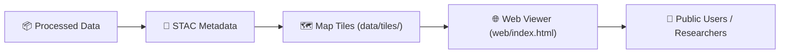

<div align="center">

# 🧭 Kansas Frontier Matrix — System Architecture  
`docs/architecture/architecture.md`

**Mission:** Define the full-stack architecture of the **Kansas Frontier Matrix (KFM)** —  
connecting data ingestion, transformation, validation, documentation, and visualization  
into a reproducible, transparent, and interoperable knowledge system.

[](../../.github/workflows/site.yml)
[](../../.github/workflows/stac-validate.yml)
[](../../.github/workflows/codeql.yml)
[](../../.github/workflows/trivy.yml)
[](../../docs/)
[](../../LICENSE)

</div>

---

## 📚 Overview

The **Kansas Frontier Matrix (KFM)** is a **modular, reproducible data architecture** that unifies  
Kansas’s fragmented historical, environmental, and scientific records into a coherent, traceable  
**spatiotemporal knowledge system**.

The architecture integrates:
- 🗺️ **Geospatial data pipelines** — terrain, hydrology, land cover, climate, hazards  
- 📊 **Structured datasets** — census, agriculture, economy  
- 📜 **Textual archives** — oral histories, treaties, newspapers, transcripts  
- 🧩 **Metadata systems** — STAC 1.0.0, JSON Schema, and MCP documentation  
- 🌐 **Web visualization** — MapLibre + static documentation site

Every layer adheres to **Master Coder Protocol (MCP)** principles:  
🧠 documentation-first, 🔁 reproducible, 🧾 auditable, 🌍 open-standard, and 🧬 provenance-tracked.

---

## 🏗️ High-Level System Architecture

```mermaid
flowchart TD
  A["🌐 External Data Sources\n(data/sources/)"] --> B["📦 Raw Data Storage\n(data/raw/)"]
  B --> C["⚙️ ETL Pipelines\n(src/pipelines/)"]
  C --> D["✅ Processed Data\n(data/processed/)"]
  D --> E["🧩 Metadata & STAC Catalog\n(data/stac/, data/processed/metadata/)"]
  E --> F["🔐 Checksums & Validation\n(data/checksums/)"]
  F --> G["🌎 Web Visualization & Docs\n(web/, docs/, data/tiles/)"]
  G --> H["🤖 CI/CD & Governance\n(.github/workflows/)"]

  style A fill:#fafafa,stroke:#888
  style B fill:#eef7ff,stroke:#0088cc
  style C fill:#fff0f5,stroke:#cc0088
  style D fill:#ecf9f0,stroke:#33aa33
  style E fill:#fffbea,stroke:#e8a500
  style F fill:#f0e8ff,stroke:#8844cc
  style G fill:#f9f9f9,stroke:#555
  style H fill:#f7f7f7,stroke:#222
````

<!-- END OF MERMAID -->

---

## 🧩 Core Architectural Components

| Layer                   | Directory                                | Description                                                                         |
| :---------------------- | :--------------------------------------- | :---------------------------------------------------------------------------------- |
| **Source Registry**     | `data/sources/`                          | JSON manifests defining data origins, licensing, and access endpoints.              |
| **Raw Data**            | `data/raw/`                              | Immutable snapshots of original datasets for provenance preservation.               |
| **ETL Processing**      | `src/pipelines/`                         | Python-based modular workflows that clean, transform, and standardize data.         |
| **Processed Data**      | `data/processed/`                        | Final validated and standardized outputs ready for analysis and publication.        |
| **Metadata & STAC**     | `data/stac/`, `data/processed/metadata/` | STAC 1.0.0-compliant metadata describing each dataset’s temporal and spatial scope. |
| **Checksums**           | `data/checksums/`                        | SHA-256 hash validation ensuring reproducibility and immutability.                  |
| **Web & Visualization** | `web/`, `data/tiles/`                    | MapLibre and static site integration for public interaction.                        |
| **Governance & CI/CD**  | `.github/`                               | GitHub workflows managing validation, deployment, and automation.                   |

---

## ⚙️ ETL Pipeline Architecture

The KFM ETL pipelines are domain-driven and **declarative**, ensuring every dataset
can be reproduced and validated through Makefile and Python-based orchestration.

| Domain    | Pipeline                | Input             | Output                            | Purpose                |
| :-------- | :---------------------- | :---------------- | :-------------------------------- | :--------------------- |
| Terrain   | `terrain_pipeline.py`   | LiDAR / DEMs      | Processed DEMs, slope, hillshade  | Surface modeling       |
| Hydrology | `hydrology_pipeline.py` | NHD, WBD, NFHL    | River networks, flood layers      | Water systems          |
| Landcover | `landcover_pipeline.py` | NLCD, USDA CDL    | Land use, vegetation, crop maps   | Ecological mapping     |
| Climate   | `climate_pipeline.py`   | NOAA, Daymet      | Temperature, precipitation grids  | Climate trends         |
| Hazards   | `hazards_pipeline.py`   | FEMA, NOAA        | Tornado, flood, wildfire datasets | Natural hazards        |
| Tabular   | `tabular_pipeline.py`   | Census, BEA, USDA | Normalized CSV/Parquet tables     | Statistical analysis   |
| Text      | `text_pipeline.py`      | OCR & transcripts | Cleaned JSONL + metadata          | Historical text corpus |

Each pipeline:

* Logs ETL progress in `data/work/logs/`
* Generates STAC Items and `.sha256` validation hashes
* Writes thumbnails and provenance under `data/processed/metadata/`

---

## 🧮 Metadata & Validation Architecture

Metadata validation follows **STAC 1.0.0 + JSON Schema** and is enforced via
CI/CD and pre-commit hooks.

| Validation Step           | Description                                              | Tools                                 |
| :------------------------ | :------------------------------------------------------- | :------------------------------------ |
| **Schema Validation**     | JSON Schema validation for metadata files.               | `jsonschema`                          |
| **STAC Validation**       | Ensures STAC Items and Collections comply with spec.     | `stac-validator`                      |
| **Checksum Verification** | Confirms SHA-256 hashes match between raw and processed. | `make checksums`                      |
| **CI/CD Enforcement**     | Auto-runs validation via GitHub Actions.                 | `.github/workflows/stac-validate.yml` |

---

## 🔐 Data Provenance Model

Each dataset follows a **traceable provenance chain**:

```text
Source Manifest (data/sources/*.json)
     ↓
Raw Data (data/raw/)
     ↓
Processed Data (data/processed/)
     ↓
Checksum (data/checksums/)
     ↓
STAC Metadata (data/stac/)
     ↓
Visualization Layer (data/tiles/, web/)
```

Every step includes:

* Versioned metadata
* Deterministic ETL scripts
* CI-verified integrity
* Cross-linked documentation

---

## 🧠 MCP Integration & Principles

| MCP Principle           | Implementation in KFM                                                  |
| :---------------------- | :--------------------------------------------------------------------- |
| **Documentation-first** | Every directory includes a README.md and schema definition.            |
| **Reproducibility**     | Deterministic Makefile + pipeline workflows produce identical outputs. |
| **Open Standards**      | STAC 1.0.0, GeoTIFF (COG), GeoJSON, CSV, JSON Schema, NetCDF.          |
| **Provenance**          | Full lineage tracked from source manifest to visualization layer.      |
| **Auditability**        | All transformations logged; CI/CD validation is public and traceable.  |

---

## 🧰 CI/CD Data Governance (Automation Stack)

| Workflow                       | Purpose                                                    | Frequency          |
| :----------------------------- | :--------------------------------------------------------- | :----------------- |
| **`fetch.yml`**                | Downloads and validates new data sources.                  | Scheduled / manual |
| **`checksums.yml`**            | Recomputes and verifies SHA-256 integrity checks.          | On data change     |
| **`stac-validate.yml`**        | Validates STAC structure and schema compliance.            | On PR / commit     |
| **`site.yml`**                 | Builds and deploys static documentation and maps.          | On merge to `main` |
| **`codeql.yml` / `trivy.yml`** | Scans for security vulnerabilities in code and containers. | Weekly             |

Logs for all runs are stored in `data/work/logs/`.

---

## 🌐 Web Architecture (Visualization Layer)

The KFM web interface integrates:

* **MapLibre GL JS** for interactive mapping
* **Timeline filters** for spatiotemporal navigation
* **Dynamic layer toggles** defined in `web/config/layers.json`
* **Thumbnails & metadata pop-ups** linked via STAC items
* **GitHub Pages deployment** via `site.yml`

Visualization hierarchy:



<!-- END OF MERMAID -->

---

## 🧩 Security & Integrity Layer

| Component              | Role                            | Enforcement                      |
| :--------------------- | :------------------------------ | :------------------------------- |
| **Checksums**          | Detect tampering or corruption. | SHA-256 validation               |
| **Immutable Raw Data** | Preserve source truth.          | Stored in `data/raw/`            |
| **CI/CD Validation**   | Automated integrity checks.     | GitHub Actions                   |
| **STAC Provenance**    | Dataset-to-metadata linkage.    | `rel:source`, `rel:derived_from` |
| **Access Control**     | Repository-level permissioning. | GitHub Teams & Branch Protection |

---

## 🧩 Extension & Scalability

KFM supports modular expansion via:

* 🧱 **New domains:** Add new `data/processed/<domain>/` + pipeline module.
* 🌐 **External integrations:** Link to remote STAC catalogs (NASA, NOAA, USGS).
* 🧩 **API exposure:** Build JSON or STAC-compliant endpoints from catalog metadata.
* ⚙️ **Versioned rebuilds:** Each ETL pipeline is fully deterministic, logged, and reproducible.

---

## 📎 Related Architecture Files

| Path                                   | Description                                             |
| :------------------------------------- | :------------------------------------------------------ |
| `data/ARCHITECTURE.md`                 | Detailed data architecture and lifecycle documentation. |
| `docs/architecture/system_overview.md` | Optional visual overview of software and CI/CD layers.  |
| `.github/workflows/README.md`          | Automation and governance workflow documentation.       |
| `web/config/`                          | Layer configuration and visualization schema.           |

---

## 📅 Version History

| Version | Date       | Summary                                                           |
| :------ | :--------- | :---------------------------------------------------------------- |
| v1.0    | 2025-10-04 | Initial Kansas Frontier Matrix system architecture documentation. |

---

<div align="center">

**Kansas Frontier Matrix** — *“Building a Reproducible Future for the Past.”*
📍 [`docs/architecture/architecture.md`](.) · The definitive guide to the architecture and design of the Kansas Frontier Matrix.

</div>
