<div align="center">

# 🧭 **Kansas Frontier Matrix — System Architecture (v2.0.0 · Tier-Ω+∞ Certified)**  
`docs/architecture/architecture.md`

**Mission:** Specify the **full-stack architecture** of the **Kansas Frontier Matrix (KFM)** — connecting data ingestion, transformation, validation, documentation, AI enrichment, and visualization into a **reproducible**, **auditable**, and **interoperable** knowledge system.

[](../../.github/workflows/site.yml)
[](../../.github/workflows/stac-validate.yml)
[](../../.github/workflows/codeql.yml)
[](../../.github/workflows/trivy.yml)
[](../../.github/workflows/sbom.yml)
[](../../.github/workflows/slsa.yml)
[](../../docs/)
[](../../LICENSE)

</div>

---

```yaml
---
title: "Kansas Frontier Matrix — System Architecture"
document_type: "Architecture Specification"
version: "v2.0.0"
last_updated: "2025-11-16"
owners: ["@kfm-architecture","@kfm-data","@kfm-ai","@kfm-web","@kfm-security","@kfm-accessibility"]
status: "Stable"
maturity: "Production"
license: "MIT"
tags: ["architecture","etl","stac","neo4j","react","maplibre","api","provenance","ai","ci","slsa","sbom","fair","care"]
alignment:
  - MCP-DL v6.3
  - STAC 1.0 / DCAT 2.0
  - CIDOC CRM / OWL-Time / GeoSPARQL
  - WCAG 2.1 AA / 3.0 readiness
  - FAIR / CARE
  - SLSA Level ≥2
validation:
  docs_ci_required: true
  frontmatter_required: ["title","version","last_updated","owners","license"]
  mermaid_end_marker: "<!-- END OF MERMAID -->"
observability:
  endpoint: "https://metrics.kfm.ai/architecture/system"
  metrics: ["stac_pass_rate","api_latency_p95_ms","graph_latency_ms","a11y_gai_score","artifact_verification_pct"]
preservation_policy:
  retention: "docs logs 90d · sbom/slsa 365d · releases permanent"
  checksum_algorithm: "SHA-256"
---
```

---

## 📚 Overview

**KFM** unifies Kansas’s historical, ecological, and cultural datasets into a **spatiotemporal knowledge system**.  
Architecture layers:

- 🗺️ **Geospatial ETL** — terrain, hydrology, hazards, land cover, climate  
- 📊 **Structured data** — census, agriculture, economics  
- 📰 **Text/OCR** — treaties, oral histories, newspapers  
- 🧩 **Metadata** — STAC 1.0 + JSON Schema (DCAT crosswalk)  
- 🌐 **APIs & Web** — FastAPI + GraphQL + MapLibre timeline map  
- 🤖 **AI/ML** — OCR/NER/summaries/linking with model governance  
- 🧪 **CI/CD** — validation, supply chain (SBOM/SLSA), and governance

---

## 🏗 High-Level System Diagram

```mermaid
flowchart TD
  A["🌐 Sources<br/>NOAA · USGS · FEMA · KHS · Archives · Census"] --> B["📦 Raw Storage<br/>data/raw/ (LFS/DVC)"]
  B --> C["⚙️ ETL Pipelines<br/>src/etl/ · Makefile · Checksums"]
  C --> D["✅ Processed Outputs<br/>data/processed/ (COG · GeoJSON · CSV)"]
  D --> E["🧩 STAC & Metadata<br/>data/stac/ · JSON Schema"]
  C --> I["🧠 AI Enrichment<br/>OCR · NER · Summaries · Linking"]
  E --> H["🕸 Knowledge Graph<br/>Neo4j · CIDOC CRM · OWL-Time · GeoSPARQL"]
  I --> H
  H --> J["🔌 API Layer<br/>FastAPI · GraphQL · JSON-LD · STAC API"]
  J --> F["🗺 Web Frontend<br/>React · MapLibre · Timeline · Focus Mode"]
  F --> G["♿ A11y & i18n<br/>WCAG 2.1 AA · RTL-ready"]
  D --> K["🧱 Tiles/Exports<br/>data/tiles/ · KML/KMZ (optional)"]
```


<!-- END OF MERMAID -->

---

## 🧩 Core Architectural Components

| Layer | Directory | Description |
|:--|:--|:--|
| **Source Registry** | `data/sources/` | Manifests for origin/license/coverage/URLs |
| **Raw Data** | `data/raw/` | Immutable snapshots (LFS/DVC) |
| **ETL** | `src/etl/` | Modular Python/GDAL/Rasterio pipelines |
| **Processed** | `data/processed/` | Validated outputs (COG/GeoJSON/CSV) |
| **Metadata** | `data/stac/` | STAC Items/Collections + JSON Schema |
| **Graph** | `src/graph/` | Neo4j schema + loaders + JSON-LD export |
| **API** | `src/api/` | FastAPI + GraphQL + STAC API endpoints |
| **Web** | `web/` | React + MapLibre + timeline interactions |
| **Governance** | `.github/` | CI/CD, SBOM, SLSA, policy-as-code |

---

## ⚙️ ETL Pipeline Architecture

**Declarative, deterministic, domain-driven** pipelines:

| Domain    | Pipeline                | Input                 | Output                          | Purpose |
|:--|:--|:--|:--|:--|
| Terrain   | `terrain_pipeline.py`   | LiDAR/DEMs            | DEM/slope/hillshade (COG)       | Surface modeling |
| Hydrology | `hydrology_pipeline.py` | NHD/WBD/NFHL          | Flowlines/watersheds (GeoJSON)  | Water systems |
| Landcover | `landcover_pipeline.py` | NLCD/USDA CDL         | Land use/veg maps (GeoTIFF/CSV) | Ecology |
| Climate   | `climate_pipeline.py`   | Daymet/NOAA           | Temp/precip grids (COG/CSV)     | Climate trends |
| Hazards   | `hazards_pipeline.py`   | FEMA/NOAA             | Tornado/flood/wildfire layers   | Risk |
| Tabular   | `tabular_pipeline.py`   | Census/BEA/USDA       | Normalized CSV/Parquet          | Stats |
| Text      | `text_pipeline.py`      | OCR/Transcripts       | JSONL + entities                | Historical text |

**Pipeline guarantees**
- Logs under `data/work/logs/`  
- STAC Items + `.sha256` per asset  
- Thumbnails & provenance in `data/processed/metadata/`

---

## 🧮 Metadata & Validation

| Step | Description | Tools |
|:--|:--|:--|
| **JSON Schema** | Validate metadata fields | `jsonschema` |
| **STAC Validate** | Conform to STAC spec | `stac-validator` |
| **Checksums** | SHA-256 parity raw→processed | `make checksums` |
| **CI Gates** | Auto-run on PR/commit | `.github/workflows/stac-validate.yml` |

---

## 🔐 Provenance & Supply Chain

- **Lineage**: STAC `derived_from`, PROV-O annotations; **DOI** snapshots on major releases  
- **Integrity**: checksums per asset; parity enforced in CI  
- **SBOM**: Syft CycloneDX (`sbom.cdx.json`); **Grype** CVE scans  
- **SLSA**: release attestations (`slsa.intoto.jsonl`) for build provenance  
- **Workflow Hygiene**: pinned GH Actions, OIDC least-privilege, signed tags

---

## 🤖 AI/ML Enrichment & Governance

- OCR (Tesseract/OpenCV), NER (spaCy/Transformers), summarization (BART/T5), entity linking  
- **Model Cards** with hashes/metrics/bias notes in `docs/templates/model_card.md`  
- **Quality gates** (min F1/ROUGE) + **bias benchmarks** (regression blocks CI)  
- **Human-in-the-loop**: `@kfm-ai` approves model updates

---

## 🌐 API & Web

- **API**: FastAPI + GraphQL, JSON/GeoJSON/JSON-LD; STAC API `/api/v1/stac/*`  
- **Web**: React + MapLibre; single time window across map & timeline; **Focus Mode** AI with sources and confidence  
- **Accessibility**: A11y budgets (route scores ≥ 95), keyboard/SR support, high-contrast tokens

---

## 🧭 Data & File Architecture

```text
data/
  sources/      # Source manifests
  raw/          # LFS/DVC snapshots
  processed/    # COG, GeoJSON, CSV
  stac/         # STAC Items/Collections
  tiles/        # (optional) generated tiles
```

**Every dataset** ships with provenance, STAC item, checksum, and a doc link.

---

## 📊 Observability & Health

- Dashboard: **https://metrics.kfm.ai/architecture/system**  
- Metrics: STAC pass rate, API p95 latency, graph query latency, a11y route score, action pinning, artifact verification  
- Alerts: CI sends anomalies to Slack `#ci-alerts`

---

## 🧠 MCP Integration

| MCP Pillar | Implementation |
|:--|:--|
| Documentation-first | READMEs & ADRs pre-implementation; CI enforces |
| Reproducibility | Deterministic ETL; pinned SHAs; checksums |
| Open Standards | STAC, DCAT, CIDOC CRM, OWL-Time, GeoSPARQL |
| Provenance | STAC lineage + PROV/O · SBOM + SLSA |
| Auditability | CI logs/artifacts public; policy gates on PRs |

---

## 🧩 Risk Register (Architecture)

| ID | Risk | Likelihood | Impact | Mitigation | Owner |
|:--|:--|:--:|:--:|:--|:--|
| ARCH-001 | STAC schema drift | M | M | schema gates | @kfm-data |
| ARCH-002 | API breaking change | L | H | OpenAPI diff in CI | @kfm-web |
| ARCH-003 | AI bias regression | M | M | bias suite + block | @kfm-ai |
| ARCH-004 | Unpinned action | L | H | OPA policy + audit | @kfm-security |

---

## 🧭 Environment & Quickstart

**Env vars**
```bash
NEO4J_URI=bolt://localhost:7687
NEO4J_USER=neo4j
NEO4J_PASS=neo4j
VITE_API_URL=http://localhost:8000
VITE_MAP_STYLE_URL=/tiles/style.json
```

**Run locally**
```bash
make fetch && make process && make stac
make serve
```

Open **http://localhost:3000** (web) · **http://localhost:7474** (Neo4j).

---

## 🔗 Cross-References

- `docs/architecture/system-architecture-overview.md`  
- `docs/architecture/data-architecture.md`  
- `docs/architecture/knowledge-graph.md`  
- `docs/architecture/web-ui-architecture.md`  
- `docs/architecture/api-architecture.md`  
- `.github/workflows/README.md`

---

## 🧾 Versioning & Lifecycle

```yaml
versioning:
  policy: "Semantic Versioning (MAJOR.MINOR.PATCH)"
  tag_pattern: "architecture-core-v*"
  doi_on_major: true
  provenance_bundle: ["architecture_core.prov.json","architecture_core.sha256","sbom.cdx.json","slsa.intoto.jsonl"]
```

---

## 🕰 Version History

| Version | Date | Summary |
|:--|:--|:--|
| **v2.0.0** | 2025-11-16 | Tier-Ω+∞ rewrite: supply-chain & provenance, AI governance, a11y route budgets, observability dashboard, risk register, versioning policy. |
| v1.0.0 | 2025-10-04 | Initial system architecture documentation. |

---

<div align="center">

**Kansas Frontier Matrix — System Architecture**  
*“Build once, reproduce forever. Cite everything.”*

</div>