# 🏗️ **Kansas Frontier Matrix — Architecture Master Specification (v2.1.1 · Tier-Ω+∞ Certified)**  
`docs/architecture/architecture.md`

**Mission:** Define the **holistic system architecture** of the **Kansas Frontier Matrix (KFM)** — detailing its data pipelines,  
AI integration, knowledge graph semantics, web interfaces, APIs, and governance layers under **Master Coder Protocol (MCP-DL v6.4.3)**.

---

## 📚 Overview

The **Architecture Master Specification** consolidates the structural and governance blueprints  
defining how the Kansas Frontier Matrix functions as a unified, reproducible, FAIR+CARE-aligned knowledge infrastructure.

This document establishes:
- KFM’s **multi-layered system model** (data, AI, graph, API, web, CI/CD).  
- Cross-domain **governance and validation framework**.  
- Interoperability standards and design contracts.  
- FAIR+CARE ethical architecture alignment.  

---

## 🧩 High-Level System Architecture

```mermaid
flowchart TD
  subgraph DATA["Data Platform"]
    D1["Raw Data (NOAA · USGS · FEMA · KGS)"]
    D2["ETL Processing (GDAL · Pandas · spaCy)"]
    D3["STAC/DCAT Metadata"]
  end

  subgraph AI["AI Layer"]
    A1["NER · Summarization · Geocoding"]
    A2["Focus Mode Reasoning · Bias Monitoring"]
  end

  subgraph GRAPH["Knowledge Graph"]
    G1["Neo4j · CIDOC CRM / OWL-Time / GeoSPARQL"]
    G2["Entity Linking · Provenance Chains"]
  end

  subgraph API["APIs"]
    P1["FastAPI (REST)"]
    P2["GraphQL / SPARQL"]
  end

  subgraph WEB["Web Layer"]
    W1["React + MapLibre"]
    W2["Timeline · Dossier UI"]
  end

  subgraph GOV["Governance & CI/CD"]
    C1["Docs-Validate · STAC-Validate"]
    C2["FAIR+CARE Audit · Policy Check"]
    C3["Governance Ledger · SBOM · SLSA"]
  end

  D1 --> D2 --> D3 --> A1 --> A2 --> G1 --> G2 --> P1 --> W1
  G2 --> P2 --> W2
  C1 --> C2 --> C3 --> D3
```

<!-- END OF MERMAID -->

---

## 🧱 Architectural Layers

| Layer | Description | Core Technologies |
|:--|:--|:--|
| **Data Layer** | Ingests and validates multi-source datasets with FAIR+CARE alignment. | Python, GDAL, Pandas, STAC, DCAT |
| **AI Layer** | Applies NLP and geospatial AI for entity linking, summarization, and Focus Mode insights. | spaCy, Transformers, PyTorch |
| **Graph Layer** | Semantic linking using Neo4j and CIDOC CRM ontologies. | Neo4j, OWL-Time, GeoSPARQL |
| **API Layer** | REST and GraphQL interfaces for data and AI access. | FastAPI, Ariadne, OpenAPI 3.1 |
| **Web Layer** | Map-based and timeline UIs for human interaction and exploration. | React, MapLibre, D3.js |
| **Governance Layer** | Continuous validation, provenance, and ethical oversight. | FAIR+CARE, OPA, Conftest, SLSA, SBOM |

---

## ⚙️ Interoperability Stack

| Standard | Purpose | Layer |
|:--|:--|:--|
| **STAC 1.0** | Spatiotemporal asset metadata schema | Data Layer |
| **DCAT 3.0** | Dataset catalog interoperability | Metadata Layer |
| **CIDOC CRM** | Cultural heritage semantics | Graph Layer |
| **OWL-Time** | Temporal relationships | Graph Layer |
| **GeoSPARQL 1.1** | Geospatial relationships | Graph Layer |
| **PROV-O / JSON-LD** | Provenance + Linked Data representation | Governance Layer |
| **FAIR + CARE** | Ethical data principles | Governance Layer |
| **SLSA / SPDX / SBOM** | Provenance and supply chain assurance | CI/CD |

---

## 🧮 Data and Metadata Flow

```mermaid
flowchart TD
  A["Raw Data Ingest"] --> B["ETL Transformation"]
  B --> C["Validation (Schema · FAIR+CARE)"]
  C --> D["STAC/DCAT Metadata Generation"]
  D --> E["Graph Integration (Neo4j CIDOC CRM)"]
  E --> F["Provenance Ledger Update"]
  F --> G["Public Release (API · Web · Archive)"]
```

<!-- END OF MERMAID -->

---

## ⚖️ FAIR + CARE Governance Integration

| Principle | Implementation | Validation |
|:--|:--|:--|
| **Findable** | STAC/DCAT indexing, persistent IDs, and searchable catalog. | `data/stac/catalog.json` |
| **Accessible** | All docs and datasets under open licenses (MIT/CC-BY). | `LICENSE` |
| **Interoperable** | Linked data formats and RDF ontologies. | `ontology-validate.yml` |
| **Reusable** | Reproducible ETL + AI pipelines with SBOM tracking. | `releases/v*/manifest.zip` |
| **Collective Benefit (CARE)** | Governance council approval and ethical reviews. | `data/reports/fair/data_care_assessment.json` |

---

## 🔍 Governance & CI/CD Workflows

| Workflow | Purpose | Output |
|:--|:--|:--|
| `docs-validate.yml` | Lints docs and validates diagrams. | `reports/validation/docs_validation.json` |
| `policy-check.yml` | Ensures metadata completeness and compliance. | `reports/audit/policy_check.json` |
| `stac-validate.yml` | Verifies dataset schema and metadata quality. | `reports/validation/stac_validation_report.json` |
| `governance-ledger.yml` | Registers checksums and governance signatures. | `data/reports/audit/data_provenance_ledger.json` |

---

## 🧩 Governance Model Overview

<!-- END OF MERMAID -->

---

## 🧠 Architecture Roles & Responsibilities

| Role | Responsibility | Tooling |
|:--|:--|:--|
| **Architecture Lead (@kfm-architecture)** | Defines architectural standards and approval processes. | Docs + CI |
| **Data Engineer (@kfm-data)** | Maintains ETL and metadata integrity. | Python, GDAL |
| **AI Lead (@kfm-ai)** | Oversees AI pipelines and explainability audits. | spaCy, PyTorch |
| **Governance Council (@kfm-governance)** | Validates FAIR+CARE compliance. | Policy-Check, Ledger |
| **Documentation Lead (@kfm-docs)** | Maintains architecture READMEs and diagrams. | Markdown, Mermaid |

---

## 🧾 Version History

| Version | Date | Author | Summary |
|:--|:--|:--|:--|
| **v2.1.1** | 2025-11-16 | @kfm-architecture | Created master specification document combining architecture structure, interoperability stack, and governance workflows. |
| v2.0.0 | 2025-10-25 | @kfm-data-lab | Added FAIR+CARE governance integration and provenance ledger. |
| v1.0.0 | 2025-10-04 | @kfm-architecture | Initial master specification draft. |

---

**Kansas Frontier Matrix © 2025**  
*“Architecture is Ethics in Action — Every Structure Has Provenance.”*  
📍 `docs/architecture/architecture.md` — The canonical system architecture specification for the Kansas Frontier Matrix.

