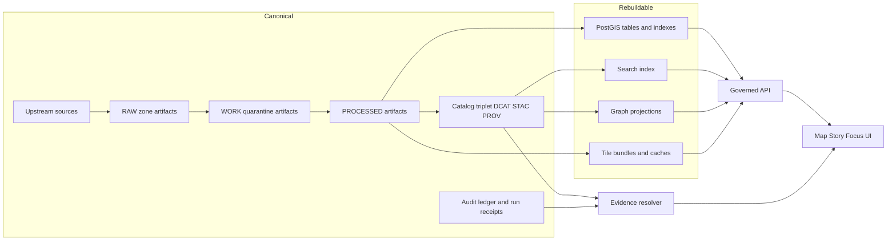

<!-- [KFM_META_BLOCK_V2]
doc_id: kfm://doc/0a3efbb6-1b69-45e9-bf48-0e9e5b47f0c7
title: Canonical and Rebuildable Stores
type: standard
version: v1
status: draft
owners: TBD
created: 2026-03-01
updated: 2026-03-01
policy_label: public
related:
  - kfm://doc/truth-path
  - kfm://doc/trust-membrane
  - kfm://doc/promotion-contract
tags: [kfm, architecture, governance, storage, reproducibility]
notes:
  - Distills the KFM vNext design decision: canonical artifacts + catalogs + audit ledger, with rebuildable DB/search/tiles projections.
  - File paths in "Related" are placeholders until linked to concrete repo docs.
[/KFM_META_BLOCK_V2] -->

# Canonical and Rebuildable Stores

**One-line purpose:** Define the KFM rule that *object storage + catalogs + provenance + audit* are the canonical source of truth, while *databases and indexes are rebuildable projections*.

  

**Owners:** TBD • **Last updated:** 2026-03-01

---

## Quick navigation

- [Decision summary](#decision-summary)
- [Definitions](#definitions)
- [Store taxonomy](#store-taxonomy)
- [Architecture flow](#architecture-flow)
- [Hard invariants](#hard-invariants)
- [How to classify a new store or table](#how-to-classify-a-new-store-or-table)
- [Rebuild runbook](#rebuild-runbook)
- [Testing and CI gates](#testing-and-ci-gates)
- [FAQ](#faq)

---

## Decision summary

**KFM design decision (normative):**

- **Canonical stores** hold the *source of truth* required for governance, reproducibility, and evidence inspection.
- **Rebuildable stores** hold *derived projections* that can be dropped and rebuilt from canonical artifacts.

> **Rule of thumb:** If losing it would force you to re-run the world, redo governance decisions, or guess provenance, it must be **canonical**. If you can deterministically reconstruct it from promoted artifacts and catalogs, it must be **rebuildable**.

---

## Definitions

### Canonical store

A storage surface that is treated as **authoritative** and **durable** for the system’s truth claims.

Canonical stores typically include:

- Immutable artifacts in truth-path zones (RAW, WORK/Quarantine, PROCESSED)
- Catalog triplet outputs (DCAT + STAC + PROV) that cross-link identity, metadata, assets, and lineage
- Append-only audit ledger / run receipts (who/what/when/why + inputs/outputs + policy decisions)

### Rebuildable store

A storage surface that is treated as a **projection** derived from canonical inputs.

Rebuildable stores typically include:

- PostGIS tables built from processed GeoParquet/features
- Search indexes built from processed texts/metadata
- Graph projections built from catalogs + entity resolution outputs
- Tile bundles and tile caches built from processed layers

### Projection

A representation optimized for query performance or UX (e.g., spatial indexing, full-text search, tiles). Projections can be:

- Recomputed (rebuildable) from canonical sources
- Versioned (recommended) so rollbacks are cheap and auditable

### Run receipt

A machine-readable record produced by an ingestion/build/rebuild run capturing:

- inputs (artifact digests, dataset_version_id)
- tooling versions/config
- validation results
- policy decisions and obligations applied
- output digests (so the run is reproducible)

---

## Store taxonomy

### Baseline classification

| Category | What it contains | Mutability | Examples |
|---|---|---:|---|
| **Canonical** | Truth-path artifacts + catalogs + audit | Immutable or append-only | RAW/WORK/PROCESSED object storage; DCAT/STAC/PROV; audit ledger |
| **Rebuildable** | Derived query surfaces | Drop-and-rebuild allowed | PostGIS tables/indexes; search index; graph projections; tiles |

### Why KFM makes this split

- **Operational safety:** A corrupt index should be an inconvenience, not a data loss event.
- **Reproducibility:** “What users saw” must be reconstructible from canonical artifacts + run receipts.
- **Migration friendliness:** Schema changes are cheaper when indexes are disposable and rebuildable.
- **Trust membrane compatibility:** Clients never need privileged access to storage; they only need governed APIs.

---

## Architecture flow

---

## Hard invariants

### Invariant 1: Canonical stores are the truth source

- The system must be able to answer: *What artifact(s) back this layer/claim/answer?* using canonical artifacts + catalogs + receipts.
- Canonical stores must be sufficient to rebuild all rebuildable projections.

### Invariant 2: Rebuildable stores are never the only place truth lives

- No manual edits, stewardship decisions, or governance-only transformations may exist solely in a rebuildable store.
- If a human correction is required, it must be captured as a **canonical artifact** (or a governed patch dataset version) and then projected.

### Invariant 3: Trust membrane is enforced

- Clients (UI/external) do not access object storage or databases directly.
- All read access flows through governed APIs with policy enforcement, redaction obligations, and logging.

### Invariant 4: Deterministic rebuilds are required

- Given the same canonical inputs + tool versions/config, a rebuild must produce identical outputs (or explicitly documented non-determinism).

> **WARNING:** If rebuilds are non-deterministic, then a rebuild becomes a silent data change. Treat that as a governance incident.

---

## How to classify a new store or table

Use this checklist when introducing a new storage surface.

### Classification checklist

- [ ] **Can we rebuild it from canonical artifacts + catalogs?**
  - If **no**, it must be **canonical** (or the design is incomplete).
- [ ] **Is the content required to reproduce user-facing claims?**
  - If **yes**, it must be **canonical** or fully derivable and referenced from canonical receipts.
- [ ] **Does it contain policy-restricted raw detail?**
  - If **yes**, prefer canonical storage with explicit policy labels + redaction plan, and only publish policy-safe projections.
- [ ] **Is it only for performance?**
  - If **yes**, it should be **rebuildable**.

### Common patterns

**Pattern A — Canonical patch, rebuildable projection**
- Canonical: `patch` artifact or “override dataset version” (small, reviewed)
- Rebuildable: tables/indexes incorporating the patch

**Pattern B — “Derived-but-citable” projection**
- Rebuildable store output is used at runtime, but every output is traceable:
  - output digest recorded in a rebuild receipt
  - rebuild receipt stored in canonical audit ledger
  - catalog references updated to point at the derived output as a PROCESSED artifact (only if it is truly publishable)

> **TIP:** When in doubt, push truth “left” into canonical artifacts and treat everything else as projection.

---

## Rebuild runbook

This runbook is intentionally tool-agnostic. Implementation can be a CLI, workflow runner, or CI job.

### When to rebuild

- A new dataset_version is promoted
- A schema/index strategy changes
- A policy or redaction rule changes and affects published surfaces
- Projection store corruption or drift is detected
- Major infra migrations (DB upgrades, search engine upgrades)

### Rebuild steps

1. **Select inputs**
   - Identify the dataset_version_id(s) and the canonical artifacts to rebuild from.
   - Confirm catalog triplet validation passes for the inputs.

2. **Rebuild projections**
   - PostGIS: ingest processed features/GeoParquet, rebuild tables and spatial indexes
   - Search: rebuild from catalog metadata + processed text artifacts
   - Graph: rebuild from catalogs + entity resolution artifacts
   - Tiles: rebuild tile bundles (e.g., PMTiles) from processed features

3. **Emit a rebuild receipt**
   - Record input artifact digests, configs, tool versions, and output digests.
   - Record any policy decisions/obligations that affect published surfaces.

4. **Promote the projection version**
   - Swap to the new projection version atomically if possible.
   - Keep previous projection versions for rollback until retention policy expires.

5. **Validate and publish**
   - Run post-rebuild checks (row counts, extent checks, sample queries).
   - Only then allow runtime traffic to use the new projection.

### Rollback

Rollback is a projection selection change:

- Canonical artifacts remain untouched
- Point runtime to the previous projection version
- Record rollback as an audit event

---

## Testing and CI gates

### Required tests

- **Rebuild-from-scratch smoke test**
  - Drop rebuildable stores in an isolated environment
  - Rebuild from canonical artifacts + catalogs
  - Assert core API queries succeed

- **Drift detection**
  - Compare rebuild outputs to expected digests (or stable invariants)
  - Fail if drift occurs without an explicit version bump or approved change record

- **Catalog cross-link validation**
  - DCAT/STAC/PROV must cross-link IDs correctly so EvidenceRefs resolve

- **Policy tests**
  - Default-deny semantics enforced
  - Redaction/generalization obligations verified for relevant datasets

### Definition of done for this document

- [ ] Related docs are linked to real repo paths (remove placeholder `kfm://doc/*`)
- [ ] At least one end-to-end rebuild test exists in CI
- [ ] At least one rebuild receipt schema exists and is validated
- [ ] At least one “projection drift” test exists and fails on unapproved change

---

## FAQ

### Does rebuildable mean disposable

Disposable in the sense that it can be dropped and recreated **without losing truth**.

It does **not** mean:

- no access control
- no audit logging
- no reliability requirements

Rebuildable stores still run in production and must be secured and monitored.

### Where do we store user edits or stewardship decisions

They must be captured canonically (versioned, reviewed, and auditable), then projected. Do not store them only in PostGIS or an index.

### Can a tile bundle be canonical

Only if it is treated as a publishable artifact (with digests, catalogs, and provenance), and still reproducible from earlier canonical inputs. Otherwise it remains a rebuildable cache.

---

## Appendix

### Glossary

- **Canonical:** authoritative truth source
- **Rebuildable:** derivable projection
- **Projection:** performance/UX-optimized derived store
- **Receipt:** reproducibility + audit record
- **Triplet:** DCAT + STAC + PROV cross-linked catalogs

---

[Back to top](#canonical-and-rebuildable-stores)
