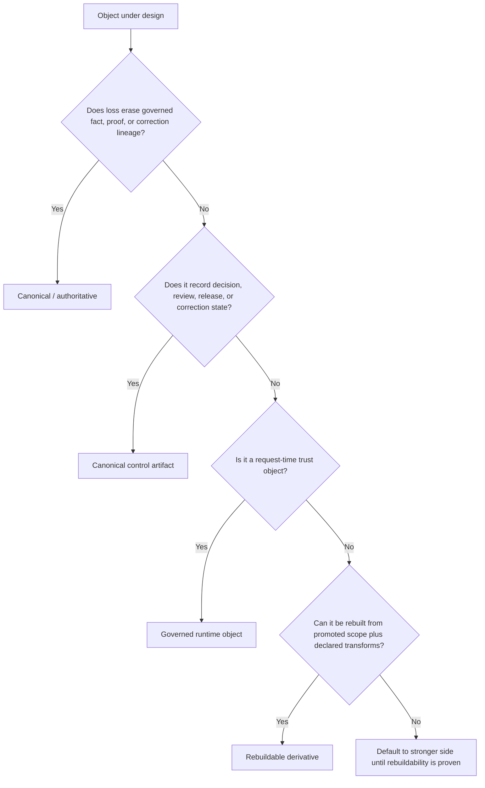
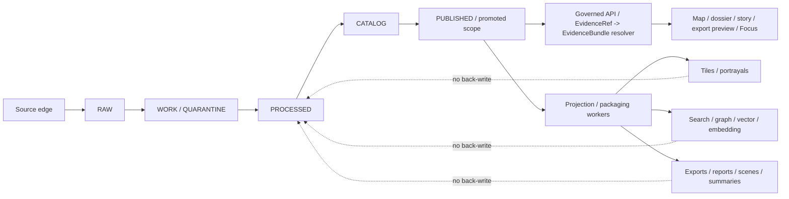

<!-- [KFM_META_BLOCK_V2]
doc_id: kfm://doc/<REVIEW-UUID-NEEDED>
title: Canonical vs. Rebuildable
type: standard
version: v1
status: review
owners: <REVIEW-OWNER-NEEDED>
created: <REVIEW-DATE-NEEDED>
updated: <REVIEW-DATE-NEEDED>
policy_label: <REVIEW-POLICY-LABEL-NEEDED>
related: [<REVIEW-RELATED-PATHS-NEEDED>]
tags: [kfm, architecture, evidence, canonical, rebuildable]
notes: [Workspace verification in this session was PDF-only; repo tree, adjacent Markdown, schemas, tests, workflows, manifests, and runtime logs were not directly visible.]
[/KFM_META_BLOCK_V2] -->

# Canonical vs. Rebuildable

Architecture rule for deciding what must remain authoritative, what may remain rebuildable, and what stays governed at runtime.

[Purpose](#purpose) · [Status & evidence boundary](#status--evidence-boundary) · [Term alignment](#term-alignment) · [Core rule](#core-rule) · [Decision ladder](#decision-ladder) · [Lifecycle view](#lifecycle-view) · [Default placement matrix](#default-placement-matrix) · [Promotion & correction rules](#promotion--correction-rules) · [Rebuildability checklist](#rebuildability-checklist) · [Surface consequences](#surface-consequences) · [Anti-patterns](#anti-patterns) · [Open verification items](#open-verification-items)

> [!NOTE]
> **Status posture for this draft:** **CONFIRMED** doctrine from the mounted KFM PDF corpus, **INFERRED** structural packaging and categorization, **PROPOSED** examples and starter object shapes, **UNKNOWN** mounted repo-local implementation depth.

> [!IMPORTANT]
> If deleting a thing would destroy the only surviving meaning, proof, release context, or correction lineage, that thing was never merely rebuildable.

## Purpose

This document defines the boundary between KFM’s **authoritative substrate** and its **rebuildable delivery and retrieval layers**.

The distinction is not a storage preference, not a renderer preference, and not a performance trick. It is a governance rule that protects outward claims from drifting away from released evidence, policy state, and correction lineage.

In practice:

- **Canonical / authoritative** objects preserve governed fact, geometry, time semantics, rights posture, review state, publication state, and correction history.
- **Rebuildable** objects are downstream projections optimized for delivery, retrieval, ranking, rendering, search, comparison, or speed.
- **Governed runtime objects** are request-time trust carriers that are reconstructible, but still contract-bearing and audit-bearing.

## Status & evidence boundary

This document is written under a narrow but explicit evidence boundary.

| Area | Current posture | What that means here |
|---|---|---|
| KFM doctrine | **CONFIRMED** | The mounted March 2026 KFM manuals are strong enough to define the rule. |
| Repo-local paths and file inventory | **UNKNOWN** | Exact repo placement, neighboring Markdown, schemas, tests, workflows, and manifests were not directly visible in this session. |
| Contract family names | **CONFIRMED** | The mounted corpus explicitly names the core proof and contract families. |
| File-level schema names | **PROPOSED** | Example filenames or starter paths remain placeholders unless directly verified in mounted implementation evidence. |

> [!CAUTION]
> This file should not be read as proof that a mounted repository already contains a schema registry, workflow inventory, or runtime proof objects under any specific path.

## Term alignment

The title uses the repo-facing shorthand **canonical vs. rebuildable**. The more exact doctrinal pair is shown below.

| This document says | Preferred doctrinal term | Working meaning |
|---|---|---|
| Canonical | **Authoritative truth** | The governed, versioned record of fact, geometry, time semantics, rights posture, and publication state. |
| Rebuildable | **Derived projection** | A delivery or retrieval layer such as graph, search, vector, tile, dashboard, cache, scene, or summary that can be regenerated from stronger released objects. |
| Public-safe | **Promoted scope** | A release state that has passed rights, sensitivity, precision, visibility, and review checks for the intended audience. |
| Runtime proof | **EvidenceBundle / RuntimeResponseEnvelope** | Request-time trust objects used to explain, constrain, and audit outward claims and answers. |
| Surface state | **Visible trust state** | A user-visible state such as promoted, generalized, partial, stale-visible, denied, abstained, or withdrawn. |

## Core rule

A thing belongs on the **canonical** side when any of these are true:

1. It carries the governed statement of fact.
2. It preserves time, support, rights, review, or publication meaning that later layers must inherit.
3. It records a decision, review, release, rollback, supersession, or correction event.
4. It is needed to reconstruct **why** a public-facing claim, export, map, or answer was allowed.

A thing may remain **rebuildable** only when all of these are true:

1. It is produced from **promoted** scope only.
2. Its transform family is declared strongly enough to rebuild it.
3. It does not back-write into authority.
4. Dropping it does **not** erase the only surviving meaning or proof.
5. Its freshness basis and correction behavior are explicit.

A thing belongs in the **governed runtime** category when it is:

1. request-time,
2. trust-bearing,
3. reconstructible from promoted scope,
4. still subject to contract, audit, and negative-outcome behavior.

### Operational test

| Question | If the answer is “yes” | Default placement |
|---|---|---|
| Would loss of this object erase governed fact or the only surviving proof? | Keep it in the authoritative or control-bearing substrate. | Canonical |
| Does it record policy, review, release, or correction state? | Keep it strong and inspectable. | Canonical control artifact |
| Is it request-time and accountability-bearing, but reconstructible? | Keep it governed and contract-bearing. | Governed runtime object |
| Can it be regenerated from promoted scope plus declared transforms? | Treat it as a projection, not as sovereign truth. | Rebuildable |

## Decision ladder

Use this ladder in order.


```mermaid
flowchart TD
    A[Object under design] --> B{Does loss erase governed fact, proof, or correction lineage?}
    B -- Yes --> C[Canonical / authoritative]
    B -- No --> D{Does it record decision, review, release, or correction state?}
    D -- Yes --> E[Canonical control artifact]
    D -- No --> F{Is it a request-time trust object?}
    F -- Yes --> G[Governed runtime object]
    F -- No --> H{Can it be rebuilt from promoted scope plus declared transforms?}
    H -- Yes --> I[Rebuildable derivative]
    H -- No --> J[Default to stronger side until rebuildability is proven]
```

### Delete test

If a delete would force KFM to answer any of these with “we no longer know,” the object is too strong to classify as merely rebuildable:

- what the governed fact was,
- what support it had,
- what release allowed it,
- what policy constrained it,
- what correction later changed it.

### Publish test

A delivery object is not safely publishable unless it can inherit:

- release linkage,
- policy posture,
- freshness basis,
- correction behavior,
- audit linkage.

## Lifecycle view


```mermaid
flowchart LR
    A[Source edge] --> B[RAW]
    B --> C[WORK / QUARANTINE]
    C --> D[PROCESSED]
    D --> E[CATALOG]
    E --> F[PUBLISHED / promoted scope]

    F --> G[Governed API / EvidenceRef -> EvidenceBundle resolver]
    F --> H[Projection / packaging workers]

    G --> I[Map / dossier / story / export preview / Focus]
    H --> J[Tiles / portrayals]
    H --> K[Search / graph / vector / embedding]
    H --> L[Exports / reports / scenes / summaries]

    J -. no back-write .-> D
    K -. no back-write .-> D
    L -. no back-write .-> D
```

The rule in one picture:

- truth moves forward through governed transitions;
- delivery layers are built **from** promoted scope;
- delivery layers do not become authority by convenience;
- runtime trust surfaces reconstruct public-safe scope rather than bypassing it;
- correction travels forward through the same object graph.

## Default placement matrix

### Must remain canonical or control-bearing

| Object family | Default class | Why it must stay strong |
|---|---|---|
| `SourceDescriptor` | Canonical control artifact | Declares source identity, stewardship, access mode, rights posture, support, cadence, validation plan, and publication intent. |
| `IngestReceipt` | Canonical control artifact | Proves a fetch and landing event occurred. |
| `ValidationReport` | Canonical control artifact | Records pass, fail, quarantine, and reason-bearing checks. |
| `DatasetVersion` | Canonical data artifact | Carries the authoritative candidate or promoted subject set. |
| `CatalogClosure` | Canonical publication artifact | Binds outward metadata, identifiers, and lineage closure. |
| `DecisionEnvelope` | Canonical governance artifact | Preserves machine-readable policy results. |
| `ReviewRecord` | Canonical governance artifact | Preserves approval, denial, escalation, and reviewer context. |
| `ReleaseManifest` / `ReleaseProofPack` | Canonical release artifact | Makes promotion, rollback, and public-safe release inspectable. |
| `CorrectionNotice` | Canonical correction artifact | Keeps withdrawal, replacement, supersession, or generalization visible. |
| `ProjectionBuildReceipt` | Canonical proof artifact | Proves that a derived layer was built from a known promoted scope. |

### Rebuildable by default

| Layer or object family | Default class | Why it should stay subordinate |
|---|---|---|
| Tiles, styles, legends, portrayals | Rebuildable derivative | Delivery optimization only; must inherit release linkage, freshness, policy posture, and correction state. |
| Search indexes | Rebuildable derivative | Retrieval acceleration; must not become the only surviving meaning. |
| Graph projections | Rebuildable derivative | Useful for relationship-heavy exploration, not sovereign truth. |
| Vector / embedding stores | Rebuildable derivative | Similarity and retrieval acceleration, not canonical fact. |
| Scene / 3D packages | Rebuildable derivative | Conditional visual aids; same evidence and policy rules as 2D, but still derived by default. |
| Cached summaries, rankings, embeddings | Rebuildable derivative | Performance artifacts; never independent truth. |
| Export packages and reports | Rebuildable outward artifact | Legitimate outward delivery artifacts, but still downstream of release and correction. |

### Governed runtime objects

| Object family | Class | Why this is a distinct category |
|---|---|---|
| `EvidenceBundle` | Reconstructible runtime trust object | Request-time package of supporting records, lineage hints, rights/sensitivity state, transform receipts, and preview policy. |
| `RuntimeResponseEnvelope` | Reconstructible runtime trust object | Request-time accountability object for answer, abstain, deny, or error outcomes. |

> [!NOTE]
> `EvidenceBundle` and `RuntimeResponseEnvelope` are **not** canonical truth, but they are also **not** disposable UI garnish. They are governed runtime trust objects.

## Promotion & correction rules

Promotion is a **governed state change**, not a file move.

A derived object may be published only when it is built from promoted scope and inherits the same trust-bearing constraints that shaped the release:

- release linkage,
- policy posture,
- freshness basis,
- correction behavior,
- auditability.

### Consequences

- A tile set does not become truth because users see it first.
- A search index does not become truth because it is queried most often.
- A graph projection does not become truth because it makes exploration easier.
- A scene does not become truth because it looks richer than the 2D shell.
- An export does not become truth because it crossed the system boundary.

### Correction rule

If an authoritative record is corrected, every affected derived layer must either:

- rebuild from corrected promoted scope, or
- surface visible stale, withdrawn, superseded, or generalized state.

“Fixed in the tile cache” is not a valid correction model.

## Rebuildability checklist

A layer is not safely rebuildable until all of the following are true:

| Check | What “good” looks like |
|---|---|
| Input scope | The release or dataset versions used to build it are explicit. |
| Transform identity | The build logic, projection type, or transform family is declared. |
| Proof object | A build receipt or equivalent artifact records what was built and from what. |
| Freshness | The layer has a declared freshness basis and a stale-after rule. |
| Correction flow | Rebuild after correction is part of the lifecycle, not an afterthought. |
| No back-write | The layer cannot silently mutate the authoritative substrate. |
| Safe loss | Dropping the layer does not erase the only surviving meaning or proof. |

### Illustrative example — `ProjectionBuildReceipt` (**PROPOSED**)

```json
{
  "object_type": "ProjectionBuildReceipt",
  "release_ref": "<release_id>",
  "projection_type": "map.tile",
  "surface_class": "public",
  "build_time": "<RFC3339 timestamp>",
  "freshness_basis": "<policy-key>",
  "stale_after": "<timestamp-or-duration>",
  "inputs": {
    "dataset_versions": ["<dataset_version_id>"],
    "catalog_closure": "<catalog_closure_id>"
  }
}
```

This example shows a **shape of responsibility**, not a verified mounted schema.

## Surface consequences

### Map / tile / portrayal

Released maps, tiles, legends, styles, and portrayals remain downstream delivery artifacts. They must inherit release linkage, policy posture, freshness, and correction state.

### Search / graph / vector / embedding

These layers may accelerate evidence resolution, provenance traversal, discovery, reranking, and relationship-heavy exploration. They remain derived and rebuildable unless explicitly promoted through the same governance path as other public objects.

### Evidence Drawer

Evidence remains one hop away from consequential claims. The drawer is part of the trust model, not optional chrome.

### Focus / governed assistance

Focus is bounded by published scope, citations, policy, and audit linkage. It must never read as though a runtime answer has become a stronger truth source than the evidence it resolved.

### Export / report

Exports are real outward artifacts, but they never outrun release state, policy posture, or correction linkage.

### Controlled 3D

3D is conditional and burden-bearing. If adopted, it carries the same Evidence Drawer, audit refs, policy state, release linkage, and correction state as the 2D shell.

## What this rule forbids

| Forbidden move | Why it fails |
|---|---|
| Treating a fast retrieval layer as sovereign truth | Speed does not outrank authority. |
| Publishing from candidate or unpublished scope | Derived layers must build from promoted scope only. |
| Using UI visibility as proof of authority | Public visibility is not a release decision. |
| Correcting only the presentation layer | Correction without lineage and rebuild trace is not a real correction. |
| Letting runtime answers bypass evidence resolution | KFM assistance is evidence-bounded and fail-closed. |
| Smuggling scenario or model output in as ordinary fact | Modeled outputs require visible modeled status and validation limits. |

## Anti-patterns

| Anti-pattern | Why it fails |
|---|---|
| “The dashboard is the source of truth.” | Dashboards are projections unless explicitly governed otherwise. |
| “We can promote by copying files into a public bucket.” | Promotion must emit typed artifacts, decisions, and proof. |
| “The search index already contains everything we need.” | Retrieval acceleration must not become the only place where meaning survives. |
| “We fixed the issue by updating the map tiles.” | Correction without lineage, notice, and rebuild trace is not a real correction. |
| “The export is final, so it no longer needs release context.” | Exports never outrun release state, policy posture, or correction linkage. |
| “The graph is richer than the canonical store, so we should read from the graph first.” | Relationship richness does not authorize write-back or epistemic promotion. |
| “Runtime answers can use convenience layers directly.” | Governed assistance must retrieve, cite, verify, and abstain instead of improvising. |

## Open verification items

The doctrine is strong. The mounted repo implementation behind it was not directly visible in this session.

| Status | Item to verify | Why it matters |
|---|---|---|
| UNKNOWN | Actual target repo path for this document | Needed to replace path placeholders and align local linking. |
| UNKNOWN | Adjacent architecture/docs conventions | Needed to align ownership markers, metadata rhythm, and local cross-references. |
| UNKNOWN | Current schema and contract inventory | Needed to replace illustrative examples with mounted names and real references. |
| UNKNOWN | Existing `ProjectionBuildReceipt`, `EvidenceBundle`, and `RuntimeResponseEnvelope` examples | Needed to move from doctrinal naming to file-level claims. |
| UNKNOWN | Workflow / CI inventory | Needed to tie this document to actual merge gates, stale-projection checks, and correction drills. |
| UNKNOWN | Release proof-pack implementation | Needed to ground promotion and rollback in real emitted artifacts. |
| UNKNOWN | Evidence resolver contracts and traces | Needed to prove actual runtime trust behavior instead of only doctrinal intent. |

## Maintenance rule

When mounted repo evidence becomes available:

1. preserve the doctrine;
2. replace placeholders only with directly verified values;
3. swap illustrative examples for mounted contract names where they exist;
4. add repo-relative links only after direct verification;
5. keep unknowns visible until resolved.

<details>
<summary><strong>Appendix — short glossary</strong></summary>

| Term | Meaning |
|---|---|
| Support | The real-world grain or footprint that makes a value meaningful. |
| Evidence state | The explicit status of a value or extract, such as source-stated, reviewed, modeled, generalized, or source-dependent. |
| Public-safe | A release state that has passed rights, sensitivity, precision, and visibility checks for the intended audience. |
| Surface state | The visible trust state of a map, feature, story, export, or Focus response, such as promoted, generalized, partial, stale-visible, denied, withdrawn, or abstained. |
| Thin slice | The smallest end-to-end governed implementation that proves the architecture on real evidence. |
| Governed runtime object | A reconstructible request-time trust carrier such as an `EvidenceBundle` or `RuntimeResponseEnvelope`. |
| Rebuildability | The condition in which a downstream layer can be regenerated from promoted scope plus declared transforms, without erasing the only surviving meaning or proof. |

</details>

[Back to top](#canonical-vs-rebuildable)
