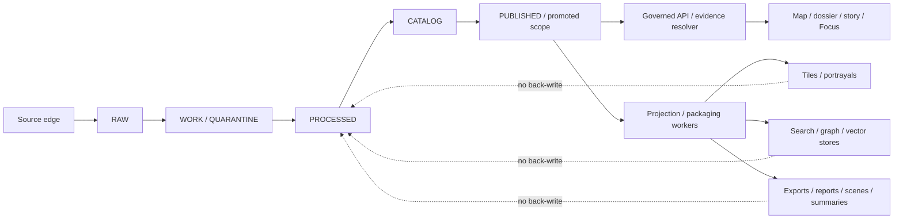

<!-- [KFM_META_BLOCK_V2]
doc_id: kfm://doc/<REVIEW-UUID-NEEDED>
title: Canonical vs. Rebuildable
type: standard
version: v1
status: review
owners: <REVIEW-OWNER-NEEDED>
created: <REVIEW-DATE-NEEDED>
updated: <REVIEW-DATE-NEEDED>
policy_label: <REVIEW-POLICY-LABEL-NEEDED>
related: [<REVIEW-RELATED-PATHS-NEEDED>]
tags: [kfm, architecture, evidence, canonical, rebuildable]
notes: [Workspace verification in this session was PDF-only; repo tree, adjacent Markdown, schemas, tests, workflows, manifests, and runtime logs were not directly visible.]
[/KFM_META_BLOCK_V2] -->

# Canonical vs. Rebuildable

Architecture rule for deciding what must remain authoritative and what may remain regenerable.

[Purpose](#purpose) · [Term alignment](#term-alignment) · [Core rule](#core-rule) · [Default placement matrix](#default-placement-matrix) · [Promotion rules](#promotion-rules) · [Rebuildability checklist](#rebuildability-checklist) · [Anti-patterns](#anti-patterns) · [Open verification items](#open-verification-items)

> [!NOTE]
> **Status posture for this draft:** **CONFIRMED** doctrine, **INFERRED** structural packaging, **PROPOSED** examples, **UNKNOWN** repo-local implementation depth.

## Purpose

This document defines the boundary between KFM’s **authoritative substrate** and its **rebuildable delivery/retrieval layers**.

The distinction is not a storage preference and not a performance optimization trick. It is a governance rule:

- **Canonical / authoritative** objects preserve governed fact, time semantics, rights posture, policy state, release state, and correction lineage.
- **Rebuildable** objects are downstream projections optimized for delivery, exploration, search, rendering, ranking, comparison, or speed.
- A rebuildable layer is useful only as long as it remains **subordinate** to promoted scope, evidence resolution, and correction behavior.

> [!IMPORTANT]
> If deleting a thing would destroy the only surviving meaning, proof, or correction lineage, that thing was never merely rebuildable.

## Term alignment

The file title uses the repo-facing shorthand **canonical vs. rebuildable**. The more exact doctrinal pair is shown below.

| This document says | Preferred doctrinal term | Working meaning |
|---|---|---|
| Canonical | **Authoritative truth** | The governed, versioned record of fact, geometry, time semantics, rights posture, and publication state. |
| Rebuildable | **Derived projection** | A delivery or retrieval layer such as graph, search, vector, tile, dashboard, cache, scene, or summary that can be regenerated from stronger released objects. |
| Public-safe | **Promoted scope** | A release state that has passed rights, sensitivity, precision, visibility, and review checks for the intended audience. |
| Runtime proof | **EvidenceBundle / RuntimeResponseEnvelope** | Request-time trust objects used to explain and constrain outward claims and answers. |

## Core rule

A thing belongs on the **canonical** side when it answers any of these questions:

1. Does it carry the governed statement of fact?
2. Does it preserve time, support, rights, or publication meaning that later layers must inherit?
3. Does it record a decision, review, release, or correction event?
4. Is it needed to reconstruct **why** a public-facing claim was allowed?

A thing may remain **rebuildable** when all of these are true:

1. It is produced from **promoted** scope only.
2. Its transform chain is declared strongly enough to rebuild it.
3. It does not back-write into authority.
4. Dropping it does **not** erase the only surviving meaning or proof.
5. Its freshness and correction behavior are explicit.

### Operational test

| Question | If the answer is “yes” | Default placement |
|---|---|---|
| Would loss of this object erase governed fact or proof? | Keep it in the authoritative/control substrate. | Canonical |
| Can it be regenerated from released scope plus declared transforms? | Treat it as a projection, not as sovereign truth. | Rebuildable |
| Is it request-time and trust-bearing, but reconstructible? | Keep it governed and contract-bearing, even if regenerated per request. | Runtime trust object |

## Lifecycle view


```mermaid
flowchart LR
    A[Source edge] --> B[RAW]
    B --> C[WORK / QUARANTINE]
    C --> D[PROCESSED]
    D --> E[CATALOG]
    E --> F[PUBLISHED / promoted scope]

    F --> G[Governed API / evidence resolver]
    F --> H[Projection / packaging workers]

    G --> I[Map / dossier / story / Focus]
    H --> J[Tiles / portrayals]
    H --> K[Search / graph / vector stores]
    H --> L[Exports / reports / scenes / summaries]

    J -. no back-write .-> D
    K -. no back-write .-> D
    L -. no back-write .-> D
```

The diagram is the rule in one picture:

- truth flows forward through governed transitions;
- delivery layers are built **from** promoted scope;
- delivery layers do not become authority by convenience;
- correction moves forward through the same object graph.

## Default placement matrix

### Must remain canonical or control-bearing

| Object family | Default class | Why it must stay strong |
|---|---|---|
| `SourceDescriptor` | Canonical control artifact | Declares source identity, stewardship, access mode, rights posture, support, cadence, validation, and publication intent. |
| `IngestReceipt` | Canonical control artifact | Proves a fetch and landing event occurred. |
| `ValidationReport` | Canonical control artifact | Records pass, fail, quarantine, and reason-bearing checks. |
| `DatasetVersion` | Canonical data artifact | Carries the authoritative candidate or promoted subject set. |
| `CatalogClosure` | Canonical publication artifact | Binds outward metadata, identifiers, and lineage closure. |
| `DecisionEnvelope` | Canonical governance artifact | Preserves machine-readable policy results. |
| `ReviewRecord` | Canonical governance artifact | Preserves approval, denial, escalation, and reviewer context. |
| `ReleaseManifest` / `ReleaseProofPack` | Canonical release artifact | Makes promotion, rollback, and public-safe release inspectable. |
| `CorrectionNotice` | Canonical correction artifact | Keeps withdrawal, replacement, supersession, or generalization visible. |
| `ProjectionBuildReceipt` | Canonical proof artifact | Proves a derived layer was built from a known promoted scope. |

### Rebuildable by default

| Object family | Default class | Why it should stay subordinate |
|---|---|---|
| Tiles and portrayals | Rebuildable derivative | Optimized map delivery; must inherit release linkage, freshness, policy posture, and correction state. |
| Search indexes and graph projections | Rebuildable derivative | Accelerate evidence resolution and navigation; must not become the only surviving meaning. |
| Vector stores and scene derivatives | Rebuildable derivative | Useful for delivery and interaction, but not the governed source of truth. |
| Cached summaries, rankings, embeddings | Rebuildable derivative | Performance and retrieval aids; never independent truth. |
| Export packages and reports | Rebuildable outward artifact | Public-facing delivery objects with their own lifecycle, but still downstream of release and correction. |

### Governed runtime objects

| Object family | Class | Why the binary needs one extra category |
|---|---|---|
| `EvidenceBundle` | Reconstructible runtime trust object | Request-time package of supporting records, lineage hints, rights/sensitivity state, transform receipts, and preview policy. |
| `RuntimeResponseEnvelope` | Reconstructible runtime trust object | Request-time accountability object for answer, abstain, deny, or error outcomes. |

> [!NOTE]
> Evidence bundles and runtime envelopes are **not** canonical truth, but they are also **not** disposable UI trivia. They are governed runtime objects.

## Promotion rules

Promotion is a **governed state change**, not a file move.

A derived object may be published only when it is built from promoted scope and inherits the same trust-bearing constraints that shaped the release:

- release linkage;
- policy posture;
- freshness basis;
- correction behavior;
- auditability.

### Consequences

- A tile set does not become truth because users see it first.
- A search index does not become truth because it is queried most often.
- A scene does not become truth because it is visually rich.
- An export does not become truth because it left the system boundary.

If a rebuildable thing must be kept for performance or outward delivery, what is preserved is its **governed delivery lifecycle**, not a claim that it outranks the stronger record beneath it.

## Rebuildability checklist

A layer is not safely rebuildable until all of the following are true:

| Check | What “good” looks like |
|---|---|
| Input scope | The release or dataset versions used to build it are explicit. |
| Transform identity | The build logic, projection type, or transform family is declared. |
| Proof object | A build receipt or equivalent artifact records what was built and from what. |
| Freshness | The layer has a declared freshness basis and a stale-after rule. |
| Correction flow | Rebuild after correction is part of the lifecycle, not an afterthought. |
| No back-write | The layer cannot silently mutate the authoritative substrate. |
| Safe loss | Dropping the layer does not erase the only surviving meaning or proof. |

### Illustrative example — `ProjectionBuildReceipt` (PROPOSED)

```json
{
  "object_type": "ProjectionBuildReceipt",
  "release_ref": "<release_id>",
  "projection_type": "map.tile",
  "surface_class": "public",
  "build_time": "<RFC3339 timestamp>",
  "freshness_basis": "<policy-key>",
  "stale_after": "<timestamp-or-duration>",
  "inputs": {
    "dataset_versions": ["<dataset_version_id>"],
    "catalog_closure": "<catalog_closure_id>"
  }
}
```

This example is intentionally illustrative. It shows the minimum *shape of responsibility*, not a verified mounted schema.

## Surface consequences

### Map / tile / portrayal

Released maps, tiles, legends, styles, and portrayals remain downstream delivery artifacts. They must inherit release linkage, policy posture, freshness, and correction state.

### Story / dossier / compare

These are not separate epistemic systems. They remain anchored in the same geography, time scope, evidence drill-through, and public-safe release logic.

### Focus / governed assistance

Focus is bounded by published scope, citations, policy, and audit linkage. It must never read as though a runtime answer has become a stronger truth source than the evidence it resolved.

### Evidence Drawer

Evidence remains one hop away from consequential claims. The drawer is part of the trust model, not optional supporting chrome.

## Anti-patterns

| Anti-pattern | Why it fails |
|---|---|
| “The dashboard is the source of truth.” | Dashboards are projections unless explicitly governed otherwise. |
| “We can promote by copying files into a public bucket.” | Promotion must emit typed artifacts, decisions, and proof. |
| “The search index already contains everything we need.” | Retrieval acceleration must not become the only place where meaning survives. |
| “We fixed the issue by updating the map tiles.” | Correction without lineage, notice, and rebuild trace is not a real correction. |
| “The export is final, so it no longer needs release context.” | Exports never outrun release state, policy posture, or correction linkage. |
| “The 3D scene is more complete than the 2D shell.” | KFM is 2D-first; 3D is conditional and burden-bearing. |
| “Runtime answers can use uncited convenience layers directly.” | Governed assistance is evidence-bounded and fail-closed. |

## Implementation note

A good proving lane for this distinction is a **hydrology-first thin slice** because it is public-safe, place/time-rich, and operationally legible. The same rule still applies:

- observations, versions, policy decisions, releases, and corrections stay strong;
- tiles, maps, indexes, summaries, and runtime accelerators stay rebuildable or reconstructible.

## Open verification items

The doctrine is strong. The mounted repo evidence for this file was not directly visible in this session.

| Status | Item to verify | Why it matters |
|---|---|---|
| UNKNOWN | Adjacent docs under `docs/architecture/` | Needed to align local linking, terminology rhythm, and neighboring ownership markers. |
| UNKNOWN | Actual schema and contract inventory | Needed to replace illustrative examples with mounted names and real references. |
| UNKNOWN | Existing `ProjectionBuildReceipt` or equivalent proof artifacts | Needed to remove hypothetical wording around rebuild proofs. |
| UNKNOWN | Current release-proof-pack implementation | Needed to tie this doc to real release and rollback evidence. |
| UNKNOWN | Runtime `EvidenceBundle` / `RuntimeResponseEnvelope` examples | Needed to confirm actual request-time trust objects and payload shapes. |
| UNKNOWN | Existing runbooks for stale projections and correction | Needed to link this doc to real operational procedures. |

## Maintenance rule

When mounted repo evidence becomes available:

1. preserve the doctrine;
2. replace placeholders with verified values;
3. swap illustrative examples for mounted contract names;
4. add repo-relative links only after direct verification;
5. keep unknowns visible until resolved.

<details>
<summary><strong>Appendix — short glossary</strong></summary>

| Term | Meaning |
|---|---|
| Support | The real-world grain or footprint that makes a value meaningful. |
| Evidence state | The explicit status of a value or extract, such as source-stated, reviewed, modeled, generalized, or source-dependent. |
| Public-safe | A release state that has passed rights, sensitivity, precision, and visibility checks for the intended audience. |
| Surface state | The visible trust state of a map, feature, story, export, or Focus response, such as promoted, generalized, partial, stale-visible, denied, or withdrawn. |
| Thin slice | The smallest end-to-end governed implementation that proves the architecture on real evidence. |

</details>

[Back to top](#canonical-vs-rebuildable)
