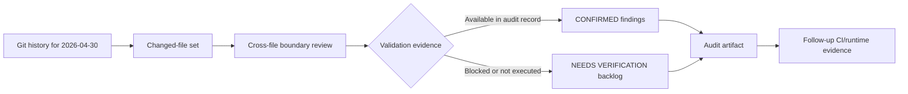
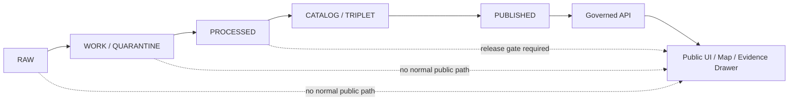

<!-- [KFM_META_BLOCK_V2]
doc_id: kfm://doc/NEEDS-VERIFICATION
title: Changed-file Audit — 2026-04-30
type: standard
version: v1
status: draft
owners: OWNER_TBD
created: 2026-04-30
updated: 2026-05-03
policy_label: NEEDS VERIFICATION
related: [docs/architecture/changed-file-audit-2026-04-30.md, apps/governed_api/server.py, tests/governed_api, apps/web/src/api/governedClient.js, apps/web/src/map, schemas/contracts/v1/ecology/layer_manifest.schema.json, data/published/ecology/dry-run/layer_manifest.json, .github/workflows]
tags: [kfm, audit, architecture, changed-files, governance, ecology, governed-api, web-ui]
notes: [Target path inferred from supplied rollback path, badges are static Markdown status labels rather than verified CI signals, owners and policy label require repository verification, implementation findings preserve the supplied audit record and were not replayed during this Markdown revision.]
[/KFM_META_BLOCK_V2] -->

<a id="top"></a>

# Changed-file Audit — 2026-04-30

Audit artifact for files changed on 2026-04-30, focused on KFM trust-boundary alignment, validation blockers, and safe follow-up work.

<p align="center">
  
  
  
  
  
  
  
  
</p>

<p align="center">
  <a href="#scope">Scope</a> ·
  <a href="#evidence-boundary">Evidence boundary</a> ·
  <a href="#findings-summary">Findings</a> ·
  <a href="#cross-file-alignment-matrix">Alignment matrix</a> ·
  <a href="#validation-backlog">Validation backlog</a> ·
  <a href="#rollback">Rollback</a>
</p>

> [!IMPORTANT]
> **Status:** `draft` audit artifact  
> **Owner:** `OWNER_TBD`  
> **Target path:** `docs/architecture/changed-file-audit-2026-04-30.md` — **INFERRED** from the supplied rollback path  
> **Truth posture:** **CONFIRMED** within the supplied audit record / **UNKNOWN** for current revalidation outside that checkout / **NEEDS VERIFICATION** for runtime, CI, schema-validation, and web-build outcomes

> [!NOTE]
> This document preserves the supplied audit’s reported checkout evidence. This Markdown revision did **not** replay the repository commands in a mounted KFM checkout. Treat current implementation behavior as **UNKNOWN** until the audit commands and validation steps are re-run in the target repository.

## At a glance

| Signal | Current value | What it means |
| --- | --- | --- |
| 🧭 **Document role** | Architecture audit artifact | Records changed-file review, not product approval. |
| 🧪 **Validation state** | Partial | Git/diff hygiene was reported; runtime, schema, web, and CI checks remain open. |
| 🧱 **Change type** | Documentation-only | No runtime, policy, schema, source, or release behavior is changed by this file. |
| 🧾 **Evidence mode** | Supplied audit record | Findings are preserved from the audit text and bounded by its evidence. |
| 🔒 **Publication posture** | No publication | This audit does not promote data, release artifacts, or public claims. |
| ↩️ **Rollback path** | Defined | Remove or revert this file if it becomes inaccurate or superseded. |

<details>
<summary>Badge legend</summary>

| Badge | Meaning | Verification status |
| --- | --- | --- |
| `status: draft` | This file is not a published or approved audit closure. | **CONFIRMED** by this document’s status field. |
| `truth: bounded audit` | Findings are bounded to the supplied audit evidence. | **CONFIRMED** by evidence boundary in this file. |
| `repo depth: unknown` | Current repo implementation was not revalidated during this Markdown revision. | **UNKNOWN** until target checkout is inspected. |
| `CI: needs verification` | CI workflow outcomes are not attached. | **NEEDS VERIFICATION** via run artifacts or job IDs. |
| `change: docs only` | The proposed patch is this audit artifact only. | **CONFIRMED** within supplied audit decision. |
| `policy: fail closed` | Open validation items should not be treated as release approval. | **PROPOSED** audit posture aligned to KFM doctrine. |
| `release: no publication` | No public release or promotion is implied. | **CONFIRMED** by this audit’s scope. |
| `rollback: defined` | Revert/remove path is included. | **CONFIRMED** in [Rollback](#rollback). |

</details>

---

## Scope

This audit records changed-file review for the 2026-04-30 workset and checks alignment against KFM invariants.

The review is intended to answer four narrow questions:

1. Which changed file families were reported by the audit?
2. Did the changed files appear to preserve governed API, public UI, evidence, schema, policy, and documentation boundaries?
3. Which checks were confirmed by the audit record?
4. Which checks remain blocked, unrun, or dependent on CI/runtime evidence?

[Back to top](#top)

## Document fit

| Field | Value |
| --- | --- |
| **Document role** | Architecture/control-plane audit artifact |
| **Inferred path** | `docs/architecture/changed-file-audit-2026-04-30.md` |
| **Upstream evidence** | Git history and command output from the 2026-04-30 audit record |
| **Downstream use** | Follow-up validation, CI artifact attachment, schema-validation confirmation, and rollback reference |
| **Primary audience** | KFM maintainers, reviewers, governance stewards, and implementation agents |

### Accepted inputs

This file may include:

- read-only git and repository inspection commands
- changed-file family summaries
- validation blockers
- cross-file alignment notes
- follow-up commands and expected evidence
- rollback instructions for this audit artifact
- CI job IDs, artifact links, or validation receipts after verification

### Exclusions

This file must not include:

- secrets, tokens, private environment details, or source credentials
- unsupported claims that runtime behavior passed
- public-release approval language
- direct publication or promotion instructions
- claims that AI output, map tiles, summaries, graph projections, or rendered surfaces are root truth

[Back to top](#top)

## Evidence boundary

The supplied audit record reports the following as its evidence basis:

- git working-tree and branch commands
- changed-file and diff hygiene commands
- repository file discovery under expected KFM homes
- changed-file extraction from git history for 2026-04-30
- path-level inspection of governed API, web UI, schema/contract, docs, and workflow surfaces

The Markdown revision preserves those findings but does not upgrade them beyond the original evidence.

| Evidence item | Status | What it supports | What it does not prove |
| --- | --- | --- | --- |
| Supplied audit command list | **CONFIRMED** as supplied source content | The audit’s stated inspection method | That commands were replayed during this Markdown revision |
| Supplied findings summary | **CONFIRMED** as supplied source content | The audit’s reported repo alignment findings | Current repo state after later commits |
| Current Markdown revision | **PROPOSED** documentation improvement | Clearer structure, labels, badges, rollback, and validation backlog | Runtime behavior, CI outcomes, dependency availability, or schema validation |
| CI artifacts for 2026-04-30 | **UNKNOWN** | Would confirm workflow outcomes if attached | Not available in the supplied Markdown |
| Web build/runtime evidence | **NEEDS VERIFICATION** | Would confirm UI behavior and app build health | Not executed in the supplied audit record |

> [!WARNING]
> A badge, table, diagram, or polished heading in this file is not proof of implementation. Verification still depends on repository command output, test results, schema-validation output, CI artifacts, runtime logs, or emitted KFM proof objects.

[Back to top](#top)

## Audit flow



## KFM trust membrane check



## Truth labels

The supplied audit used `NEEDS_VERIFICATION`. This revision normalizes that label to **NEEDS VERIFICATION**.

| Label | Meaning in this audit |
| --- | --- |
| **CONFIRMED** | Reported as verified from repository files or command output in the supplied audit record. |
| **NEEDS VERIFICATION** | Requires dependency setup, CI evidence, runtime execution, schema validation, or artifact links before it can be treated as verified. |
| **UNKNOWN** | Not verifiable from the supplied audit record alone. |
| **PROPOSED** | Recommended follow-up, command, or documentation structure not yet verified as completed. |

[Back to top](#top)

## Findings summary

### CONFIRMED within the supplied audit record

- Changed files on 2026-04-30 were concentrated in governed API, web UI ecology surfaces, contracts/schema, tests, CI workflows, and doctrine docs.
- No uncommitted working-tree drift was reported after the audit commands.
- `git diff --check` reported no whitespace or patch hygiene failures.
- Governance-critical boundaries remained represented in the audited file paths:
  - governed API routes under `apps/governed_api`
  - ecology EvidenceBundle resolver boundary tests under `tests/governed_api`
  - public-safe map/evidence client boundaries under `apps/web/src/api` and `apps/web/src/map`

### NEEDS VERIFICATION

- Python governed API tests could not execute in the audited local environment because `fastapi` was not installed; collection failed before behavior assertions ran.
- End-to-end web app build/runtime validation was not executed in the supplied audit pass.
- Schema validation for the published ecology dry-run layer manifest should be executed and recorded.
- Workflow results for `.github/workflows/*.yml` changed on 2026-04-30 require CI artifact links or job IDs.

### UNKNOWN

- CI runtime outcomes for the 2026-04-30 changes are unknown from the supplied local checkout record alone.
- Current repository state after 2026-04-30 is unknown in this Markdown revision.
- Current dependency availability, package manager state, branch protections, deployment posture, dashboards, runtime logs, and emitted proof objects are unknown.

[Back to top](#top)

## Cross-file alignment matrix

| Changed file family | Related files inspected in supplied audit | Finding | Required patch | Status |
| --- | --- | --- | --- | --- |
| API/runtime + tests | `apps/governed_api/server.py`, `tests/governed_api/*.py` | Local environment lacked the FastAPI dependency, so governed API tests did not reach behavior assertions. | No repository code patch indicated by the supplied audit. Re-run tests in a provisioned environment. | **NEEDS VERIFICATION** |
| UI ecology + map adapters | `apps/web/src/ecology/*`, `apps/web/src/map/*`, `apps/web/src/api/governedClient.js` | No broken-file references were reported in the audited paths. | None indicated by supplied audit. | **CONFIRMED** within audit record |
| Schema/contract + published manifest | `schemas/contracts/v1/ecology/layer_manifest.schema.json`, `data/published/ecology/dry-run/layer_manifest.json` | No immediate path-level mismatch was reported. | Execute schema validation in CI or an equivalent provisioned environment. | **NEEDS VERIFICATION** |
| Docs/architecture + control-plane docs | `docs/architecture/*`, `docs/control-plane/*` | No direct contradiction was reported against the current governed API/layout in the audited pass. | None indicated by supplied audit. | **CONFIRMED** within audit record |
| CI/workflows | `.github/workflows/*.yml` changed on audit date | Workflow command execution was not replayed locally. | Verify workflow jobs from CI run artifacts and attach job IDs. | **NEEDS VERIFICATION** |

[Back to top](#top)

## KFM boundary check

| Boundary | Audit result | Follow-up |
| --- | --- | --- |
| `RAW -> WORK / QUARANTINE -> PROCESSED -> CATALOG / TRIPLET -> PUBLISHED` | No lifecycle bypass was reported. | Reconfirm if changed files touch data promotion, published manifests, or release objects. |
| Public clients use governed interfaces | Public-safe API and map/evidence client boundaries were reported under `apps/web/src/api` and `apps/web/src/map`. | Confirm no direct canonical/internal-store access appears in web runtime paths. |
| EvidenceBundle before consequential claims | Ecology EvidenceBundle resolver boundary tests were reported under `tests/governed_api`. | Re-run governed API tests after dependencies are available. |
| Policy-aware fail-closed posture | No policy contradiction was reported in the audited pass. | Attach CI/policy validation evidence when available. |
| Derived surfaces are not root truth | No map/UI boundary violation was reported. | Keep map adapters downstream of governed API and released artifacts. |

## Receipt queue

| Receipt or artifact | Placeholder | Why it matters |
| --- | --- | --- |
| Governed API test result | `RECEIPT_TBD_GOVERNED_API_TESTS` | Confirms tests run after dependency setup. |
| Schema-validation result | `RECEIPT_TBD_ECOLOGY_SCHEMA_VALIDATION` | Confirms published dry-run manifest conforms to schema. |
| Web test/build result | `RECEIPT_TBD_WEB_BUILD` | Confirms public UI build/runtime path is not broken. |
| CI workflow job IDs | `CI_JOB_IDS_TBD_2026_04_30` | Confirms workflow outcomes for changed YAML. |
| Commit SHA under audit | `COMMIT_SHA_TBD` | Anchors this audit to a specific revision. |
| Owner approval | `OWNER_TBD` | Prevents orphaned audit closure. |

[Back to top](#top)

## Validation backlog

> [!WARNING]
> The commands below are follow-up validation targets. They should be run only in the intended repository checkout or CI environment, with dependency setup and package-manager conventions verified first.

### 1. Governed API tests

```bash
pytest tests/governed_api -q
```

Expected evidence to attach after success:

- test command
- environment or CI job ID
- dependency installation source
- pass/fail output
- failure trace if any
- follow-up issue or patch reference if blocked

### 2. Ecology layer manifest schema validation

```bash
# PROPOSED: replace <repo-schema-validator> with the repository's established validation command.
<repo-schema-validator> \
  schemas/contracts/v1/ecology/layer_manifest.schema.json \
  data/published/ecology/dry-run/layer_manifest.json
```

Expected evidence to attach after success:

- validator command or workflow name
- schema path
- instance path
- pass/fail result
- validation artifact, if emitted

### 3. Web app tests and build

```bash
npm --prefix apps/web test
npm --prefix apps/web run build
```

Expected evidence to attach after success:

- package manager confirmation
- command output
- CI job ID or local environment note
- build artifact path, if produced
- runtime smoke-test notes, if executed

### 4. Workflow outcome capture

Attach CI evidence for workflow files changed on 2026-04-30.

| Evidence to capture | Status |
| --- | --- |
| Workflow names | **NEEDS VERIFICATION** |
| CI run URLs or job IDs | **NEEDS VERIFICATION** |
| Commit SHA tested | **NEEDS VERIFICATION** |
| Failed jobs, if any | **NEEDS VERIFICATION** |
| Retest after dependency fix | **NEEDS VERIFICATION** |

[Back to top](#top)

## Definition of done

This audit should not be treated as closed until the following checks are complete or explicitly deferred with reasons.

- [ ] Confirm target path and owners.
- [ ] Confirm this audit still matches the commit SHA it describes.
- [ ] Attach governed API test result after dependency setup.
- [ ] Attach schema-validation result for the ecology dry-run layer manifest.
- [ ] Attach web test/build result or explain why not applicable.
- [ ] Attach CI workflow job IDs for changed workflow files.
- [ ] Confirm no public client bypasses governed interfaces.
- [ ] Confirm no documentation wording upgrades **NEEDS VERIFICATION** items to **CONFIRMED**.
- [ ] Confirm rollback target remains valid.
- [ ] Update badges only when the underlying evidence changes.

## Minimal patch decision

**Applied patch:** add this audit artifact only.

**Why minimal and safe:** the audit records observed evidence, unresolved validation blockers, and follow-up checks without changing runtime behavior, policy gates, source registries, schema authority, public UI paths, or publication state.

**Governance impact:** documentation-only. No data promotion, release, publication, connector activation, or AI behavior change is implied.

## Rollback

Rollback is appropriate if this artifact is superseded, contains inaccurate findings, weakens trust-boundary clarity, or causes maintainers to treat unverified runtime behavior as confirmed.

> [!CAUTION]
> Run rollback commands only in the intended repository checkout.

If committed:

```bash
git revert <commit>
```

If not yet committed:

```bash
git rm docs/architecture/changed-file-audit-2026-04-30.md
```

Rollback target: `docs/architecture/changed-file-audit-2026-04-30.md`

[Back to top](#top)

## Suggested follow-up actions

1. Install governed API test dependencies in CI or a provisioned local environment and run `pytest tests/governed_api -q`.
2. Validate `data/published/ecology/dry-run/layer_manifest.json` against `schemas/contracts/v1/ecology/layer_manifest.schema.json`.
3. Execute the web test/build checks after confirming the repository’s package-manager convention.
4. Confirm `.github/workflows/*.yml` outcomes from 2026-04-30 CI artifacts and attach job IDs to this audit.
5. Update this audit with validation receipts or supersede it with a follow-up audit if later commits materially change the evidence boundary.

## Appendix: reported evidence commands

<details>
<summary>Expand the supplied Phase 0 command list</summary>

```bash
pwd
git status --short
git branch --show-current
git rev-parse HEAD
git diff --name-only --diff-filter=ACMRTUXB
git diff --stat
git diff --check
find .github docs contracts schemas policy data tools tests apps packages pipelines migrations configs release -maxdepth 4 -type f
git log --since="today 00:00" --name-only --pretty=format: | sed '/^$/d' | sort -u
```

</details>

## Appendix: badge maintenance policy

<details>
<summary>Expand badge update rules</summary>

Badges in this file should remain conservative.

| Badge family | Allowed update | Evidence required |
| --- | --- | --- |
| `status` | `draft` -> `review` -> `published` | Owner/reviewer approval and repo convention confirmation. |
| `CI` | `needs verification` -> `passing` or `failed` | CI run URL, job ID, or attached artifact. |
| `repo depth` | `unknown` -> `verified` | Target checkout command output and commit SHA. |
| `change` | `docs only` -> another value | Patch includes non-doc changes and those changes are listed. |
| `release` | `no publication` -> release posture | Promotion/release decision and proof/receipt artifacts. |
| `rollback` | `defined` -> `tested` | Revert/remove dry run or documented rollback drill. |

Do not use badges to imply:

- workflow success without CI evidence
- production deployment
- public release approval
- policy enforcement
- schema validation
- runtime behavior
- source activation
- branch protection

</details>

## Appendix: review checklist

<details>
<summary>Expand full maintainer checklist</summary>

- [ ] Confirm `docs/architecture/changed-file-audit-2026-04-30.md` is the intended path.
- [ ] Replace `OWNER_TBD` with confirmed owner or team.
- [ ] Replace `kfm://doc/NEEDS-VERIFICATION` with a real document ID only if the repo convention supports doing so.
- [ ] Confirm `policy_label` value against the project’s document-label convention.
- [ ] Confirm related paths exist in the target checkout.
- [ ] Attach the commit SHA and branch reviewed by the original audit.
- [ ] Re-run or attach `git diff --check`.
- [ ] Re-run governed API tests after dependency setup.
- [ ] Run ecology layer-manifest schema validation.
- [ ] Run web test/build checks using the repo’s confirmed package manager.
- [ ] Attach workflow job IDs for changed `.github/workflows/*.yml`.
- [ ] Check that no public UI path reads canonical/internal stores directly.
- [ ] Check that map/evidence UI paths use governed interfaces and released artifacts.
- [ ] Check that EvidenceBundle resolver tests still exist and still pass.
- [ ] Confirm this file remains documentation-only.
- [ ] Confirm rollback command and target path remain valid.

</details><!-- [KFM_META_BLOCK_V2]
doc_id: kfm://doc/NEEDS-VERIFICATION
title: Changed-file Audit — 2026-04-30
type: standard
version: v1
status: draft
owners: OWNER_TBD
created: 2026-04-30
updated: 2026-05-02
policy_label: NEEDS VERIFICATION
related: [docs/architecture/changed-file-audit-2026-04-30.md, apps/governed_api/server.py, tests/governed_api, apps/web/src/api/governedClient.js, apps/web/src/map, schemas/contracts/v1/ecology/layer_manifest.schema.json, data/published/ecology/dry-run/layer_manifest.json, .github/workflows]
tags: [kfm, audit, architecture, changed-files, governance, ecology, governed-api, web-ui]
notes: [Target path inferred from supplied rollback path, owners and policy label require repository verification, implementation findings preserve the supplied audit record and were not replayed during this Markdown revision.]
[/KFM_META_BLOCK_V2] -->

# Changed-file Audit — 2026-04-30

Audit artifact for files changed on 2026-04-30, focused on KFM trust-boundary alignment, validation blockers, and safe follow-up work.

> [!IMPORTANT]
> **Status:** Draft audit record  
> **Target path:** `docs/architecture/changed-file-audit-2026-04-30.md` — **INFERRED** from the supplied rollback path  
> **Truth posture:** **CONFIRMED** within the supplied audit record / **UNKNOWN** for current revalidation outside that checkout / **NEEDS VERIFICATION** for runtime, CI, schema-validation, and web-build outcomes

> [!NOTE]
> This document preserves the supplied audit’s reported checkout evidence. This Markdown revision did **not** replay the repository commands in a mounted KFM checkout. Treat current implementation behavior as **UNKNOWN** until the audit commands and validation steps are re-run in the target repository.

## Quick navigation

- [Scope](#scope)
- [Document fit](#document-fit)
- [Evidence boundary](#evidence-boundary)
- [Findings summary](#findings-summary)
- [Cross-file alignment matrix](#cross-file-alignment-matrix)
- [Validation backlog](#validation-backlog)
- [Minimal patch decision](#minimal-patch-decision)
- [Rollback](#rollback)
- [Appendix: reported evidence commands](#appendix-reported-evidence-commands)

---

## Scope

This audit records changed-file review for the 2026-04-30 workset and checks alignment against KFM invariants.

The review is intended to answer four narrow questions:

1. Which changed file families were reported by the audit?
2. Did the changed files appear to preserve governed API, public UI, evidence, schema, policy, and documentation boundaries?
3. Which checks were confirmed by the audit record?
4. Which checks remain blocked, unrun, or dependent on CI/runtime evidence?

## Document fit

| Field | Value |
| --- | --- |
| **Document role** | Architecture/control-plane audit artifact |
| **Inferred path** | `docs/architecture/changed-file-audit-2026-04-30.md` |
| **Upstream evidence** | Git history and command output from the 2026-04-30 audit record |
| **Downstream use** | Follow-up validation, CI artifact attachment, schema-validation confirmation, and rollback reference |
| **Primary audience** | KFM maintainers, reviewers, governance stewards, and implementation agents |

### Accepted inputs

This file may include:

- read-only git and repository inspection commands
- changed-file family summaries
- validation blockers
- cross-file alignment notes
- follow-up commands and expected evidence
- rollback instructions for this audit artifact
- links or references to CI job artifacts after verification

### Exclusions

This file must not include:

- secrets, tokens, private environment details, or source credentials
- unsupported claims that runtime behavior passed
- public-release approval language
- direct publication or promotion instructions
- claims that AI output, map tiles, summaries, or graph projections are root truth

## Evidence boundary

The supplied audit record reports the following as its evidence basis:

- git working-tree and branch commands
- changed-file and diff hygiene commands
- repository file discovery under expected KFM homes
- changed-file extraction from git history for 2026-04-30
- path-level inspection of governed API, web UI, schema/contract, docs, and workflow surfaces

The Markdown revision preserves those findings but does not upgrade them beyond the original evidence.

| Evidence item | Status | What it supports | What it does not prove |
| --- | --- | --- | --- |
| Supplied audit command list | **CONFIRMED** as supplied source content | The audit’s stated inspection method | That commands were replayed during this Markdown revision |
| Supplied findings summary | **CONFIRMED** as supplied source content | The audit’s reported repo alignment findings | Current repo state after later commits |
| Current Markdown revision | **PROPOSED** documentation improvement | Clearer structure, labels, rollback, and validation backlog | Runtime behavior, CI outcomes, dependency availability, or schema validation |
| CI artifacts for 2026-04-30 | **UNKNOWN** | Would confirm workflow outcomes if attached | Not available in the supplied Markdown |
| Web build/runtime evidence | **NEEDS VERIFICATION** | Would confirm UI behavior and app build health | Not executed in the supplied audit record |

## Audit flow


## Truth labels

The supplied audit used `NEEDS_VERIFICATION`. This revision normalizes that label to **NEEDS VERIFICATION**.

| Label | Meaning in this audit |
| --- | --- |
| **CONFIRMED** | Reported as verified from repository files or command output in the supplied audit record. |
| **NEEDS VERIFICATION** | Requires dependency setup, CI evidence, runtime execution, schema validation, or artifact links before it can be treated as verified. |
| **UNKNOWN** | Not verifiable from the supplied audit record alone. |
| **PROPOSED** | Recommended follow-up, command, or documentation structure not yet verified as completed. |

## Findings summary

### CONFIRMED within the supplied audit record

- Changed files on 2026-04-30 were concentrated in governed API, web UI ecology surfaces, contracts/schema, tests, CI workflows, and doctrine docs.
- No uncommitted working-tree drift was reported after the audit commands.
- `git diff --check` reported no whitespace or patch hygiene failures.
- Governance-critical boundaries remained represented in the audited file paths:
  - governed API routes under `apps/governed_api`
  - ecology EvidenceBundle resolver boundary tests under `tests/governed_api`
  - public-safe map/evidence client boundaries under `apps/web/src/api` and `apps/web/src/map`

### NEEDS VERIFICATION

- Python governed API tests could not execute in the audited local environment because `fastapi` was not installed; collection failed before behavior assertions ran.
- End-to-end web app build/runtime validation was not executed in the supplied audit pass.
- Schema validation for the published ecology dry-run layer manifest should be executed and recorded.
- Workflow results for `.github/workflows/*.yml` changed on 2026-04-30 require CI artifact links or job IDs.

### UNKNOWN

- CI runtime outcomes for the 2026-04-30 changes are unknown from the supplied local checkout record alone.
- Current repository state after 2026-04-30 is unknown in this Markdown revision.
- Current dependency availability, package manager state, branch protections, deployment posture, dashboards, runtime logs, and emitted proof objects are unknown.

## Cross-file alignment matrix

| Changed file family | Related files inspected in supplied audit | Finding | Required patch | Status |
| --- | --- | --- | --- | --- |
| API/runtime + tests | `apps/governed_api/server.py`, `tests/governed_api/*.py` | Local environment lacked the FastAPI dependency, so governed API tests did not reach behavior assertions. | No repository code patch indicated by the supplied audit. Re-run tests in a provisioned environment. | **NEEDS VERIFICATION** |
| UI ecology + map adapters | `apps/web/src/ecology/*`, `apps/web/src/map/*`, `apps/web/src/api/governedClient.js` | No broken-file references were reported in the audited paths. | None indicated by supplied audit. | **CONFIRMED** within audit record |
| Schema/contract + published manifest | `schemas/contracts/v1/ecology/layer_manifest.schema.json`, `data/published/ecology/dry-run/layer_manifest.json` | No immediate path-level mismatch was reported. | Execute schema validation in CI or an equivalent provisioned environment. | **NEEDS VERIFICATION** |
| Docs/architecture + control-plane docs | `docs/architecture/*`, `docs/control-plane/*` | No direct contradiction was reported against the current governed API/layout in the audited pass. | None indicated by supplied audit. | **CONFIRMED** within audit record |
| CI/workflows | `.github/workflows/*.yml` changed on audit date | Workflow command execution was not replayed locally. | Verify workflow jobs from CI run artifacts and attach job IDs. | **NEEDS VERIFICATION** |

## KFM boundary check

| Boundary | Audit result | Follow-up |
| --- | --- | --- |
| `RAW -> WORK / QUARANTINE -> PROCESSED -> CATALOG / TRIPLET -> PUBLISHED` | No lifecycle bypass was reported. | Reconfirm if changed files touch data promotion, published manifests, or release objects. |
| Public clients use governed interfaces | Public-safe API and map/evidence client boundaries were reported under `apps/web/src/api` and `apps/web/src/map`. | Confirm no direct canonical/internal-store access appears in web runtime paths. |
| EvidenceBundle before consequential claims | Ecology EvidenceBundle resolver boundary tests were reported under `tests/governed_api`. | Re-run governed API tests after dependencies are available. |
| Policy-aware fail-closed posture | No policy contradiction was reported in the audited pass. | Attach CI/policy validation evidence when available. |
| Derived surfaces are not root truth | No map/UI boundary violation was reported. | Keep map adapters downstream of governed API and released artifacts. |

## Validation backlog

> [!WARNING]
> The commands below are follow-up validation targets. They should be run only in the intended repository checkout or CI environment, with dependency setup and package-manager conventions verified first.

### 1. Governed API tests

```bash
pytest tests/governed_api -q
```

Expected evidence to attach after success:

- test command
- environment or CI job ID
- dependency installation source
- pass/fail output
- failure trace if any
- follow-up issue or patch reference if blocked

### 2. Ecology layer manifest schema validation

```bash
# PROPOSED: replace <repo-schema-validator> with the repository's established validation command.
<repo-schema-validator> \
  schemas/contracts/v1/ecology/layer_manifest.schema.json \
  data/published/ecology/dry-run/layer_manifest.json
```

Expected evidence to attach after success:

- validator command or workflow name
- schema path
- instance path
- pass/fail result
- validation artifact, if emitted

### 3. Web app tests and build

```bash
npm --prefix apps/web test
npm --prefix apps/web run build
```

Expected evidence to attach after success:

- package manager confirmation
- command output
- CI job ID or local environment note
- build artifact path, if produced
- runtime smoke-test notes, if executed

### 4. Workflow outcome capture

Attach CI evidence for workflow files changed on 2026-04-30.

| Evidence to capture | Status |
| --- | --- |
| Workflow names | **NEEDS VERIFICATION** |
| CI run URLs or job IDs | **NEEDS VERIFICATION** |
| Commit SHA tested | **NEEDS VERIFICATION** |
| Failed jobs, if any | **NEEDS VERIFICATION** |
| Retest after dependency fix | **NEEDS VERIFICATION** |

## Minimal patch decision

**Applied patch:** add this audit artifact only.

**Why minimal and safe:** the audit records observed evidence, unresolved validation blockers, and follow-up checks without changing runtime behavior, policy gates, source registries, schema authority, public UI paths, or publication state.

**Governance impact:** documentation-only. No data promotion, release, publication, connector activation, or AI behavior change is implied.

## Rollback

Rollback is appropriate if this artifact is superseded, contains inaccurate findings, weakens trust-boundary clarity, or causes maintainers to treat unverified runtime behavior as confirmed.

> [!CAUTION]
> Run rollback commands only in the intended repository checkout.

If committed:

```bash
git revert <commit>
```

If not yet committed:

```bash
git rm docs/architecture/changed-file-audit-2026-04-30.md
```

Rollback target: `docs/architecture/changed-file-audit-2026-04-30.md`

## Suggested follow-up actions

1. Install governed API test dependencies in CI or a provisioned local environment and run `pytest tests/governed_api -q`.
2. Validate `data/published/ecology/dry-run/layer_manifest.json` against `schemas/contracts/v1/ecology/layer_manifest.schema.json`.
3. Execute the web test/build checks after confirming the repository’s package-manager convention.
4. Confirm `.github/workflows/*.yml` outcomes from 2026-04-30 CI artifacts and attach job IDs to this audit.
5. Update this audit with validation receipts or supersede it with a follow-up audit if later commits materially change the evidence boundary.

## Appendix: reported evidence commands

<details>
<summary>Expand the supplied Phase 0 command list</summary>

```bash
pwd
git status --short
git branch --show-current
git rev-parse HEAD
git diff --name-only --diff-filter=ACMRTUXB
git diff --stat
git diff --check
find .github docs contracts schemas policy data tools tests apps packages pipelines migrations configs release -maxdepth 4 -type f
git log --since="today 00:00" --name-only --pretty=format: | sed '/^$/d' | sort -u
```

</details>

## Appendix: review checklist

- [ ] Confirm target path and owners.
- [ ] Confirm this audit still matches the commit SHA it describes.
- [ ] Attach governed API test result after dependency setup.
- [ ] Attach schema-validation result for the ecology dry-run layer manifest.
- [ ] Attach web test/build result or explain why not applicable.
- [ ] Attach CI workflow job IDs for changed workflow files.
- [ ] Confirm no public client bypasses governed interfaces.
- [ ] Confirm no documentation wording upgrades **NEEDS VERIFICATION** items to **CONFIRMED**.
- [ ] Confirm rollback target remains valid.
