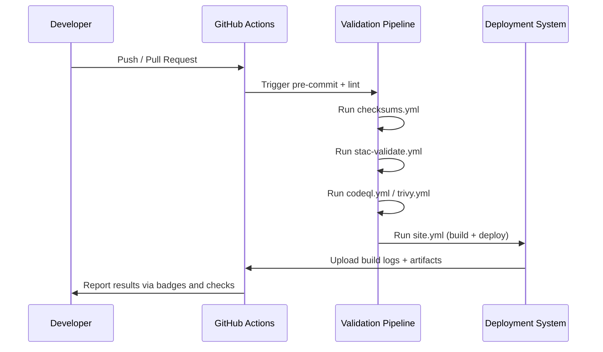

<div align="center">

# 🔄 Kansas Frontier Matrix — CI/CD Architecture  
`docs/architecture/ci-cd.md`

**Mission:** Describe the **Continuous Integration and Continuous Deployment (CI/CD)** system  
governing the Kansas Frontier Matrix (KFM) — ensuring **data integrity**, **code quality**,  
and **reproducibility** across every dataset, metadata file, and workflow.

[](../../.github/workflows/site.yml)
[](../../.github/workflows/stac-validate.yml)
[](../../.github/workflows/codeql.yml)
[](../../.github/workflows/trivy.yml)
[](../../docs/)
[](../../LICENSE)

</div>

---

## 📚 Overview

The **KFM CI/CD system** automates **validation, security, testing, and deployment**  
of all project components — data, code, documentation, and visualization assets.

This system is designed to:
- ✅ Ensure **data integrity** through checksums and STAC validation  
- 🧠 Maintain **reproducibility** for all ETL and metadata workflows  
- 🔍 Provide **automated security scanning** for dependencies and containers  
- 🧾 Log every build, validation, and deployment for **auditability**  
- ⚙️ Enforce **MCP principles** across data and code ecosystems  

All automation is implemented via **GitHub Actions**, with results stored in workflow logs and badges.

---

## 🧱 CI/CD System Overview

```mermaid
flowchart TD
  A["💾 Commit / Pull Request"] --> B["⚙️ Pre-Commit Hooks\n(Code linting, formatting)"]
  B --> C["🔄 CI Validation\n(STAC, Checksums, Tests)"]
  C --> D["🧠 Security Scanning\n(CodeQL, Trivy)"]
  D --> E["📦 Build & Deploy\n(Site, Docs, Tiles)"]
  E --> F["✅ Publish Artifacts\n(GitHub Pages, Data Catalogs)"]
  F --> G["🧾 Logs & Reports\n(data/work/logs/ci/)"]

  style A fill:#f8f9fa,stroke:#777
  style B fill:#eef7ff,stroke:#0077cc
  style C fill:#fff0f5,stroke:#cc0088
  style D fill:#ecf9f0,stroke:#33aa33
  style E fill:#fffbea,stroke:#e8a500
  style F fill:#f0e8ff,stroke:#8844cc
  style G fill:#f9f9f9,stroke:#555
````

<!-- END OF MERMAID -->

---

## 🧩 CI/CD Workflow Directory

```bash
.github/workflows/
├── README.md               # Workflow documentation index
├── site.yml                # Build & deploy static web docs + viewer
├── stac-validate.yml       # STAC metadata + JSON schema validation
├── checksums.yml           # SHA-256 integrity verification for datasets
├── fetch.yml               # Raw data acquisition automation
├── codeql.yml              # Code scanning for vulnerabilities
├── trivy.yml               # Dependency & container security scans
├── pre-commit.yml          # Enforces code linting and formatting
└── auto-merge.yml          # Automatically merges verified PRs
```

---

## ⚙️ Core Pipelines

| Workflow          | Role                                                             | Trigger            | Validation                     |
| :---------------- | :--------------------------------------------------------------- | :----------------- | :----------------------------- |
| **Pre-Commit**    | Linting, formatting, and code consistency.                       | On PR              | `pre-commit`, `black`, `ruff`  |
| **STAC Validate** | Validates all STAC Items, Collections, and metadata JSON.        | On PR / push       | `stac-validator`, `jsonschema` |
| **Checksums**     | Computes and verifies SHA-256 hashes for all processed datasets. | On data change     | `hashlib`, `make checksums`    |
| **Fetch Data**    | Downloads data defined in `data/sources/*.json`.                 | Scheduled / manual | Manifest validation            |
| **Site Build**    | Compiles and publishes documentation + web viewer.               | On merge to `main` | Jekyll / GitHub Pages          |
| **CodeQL**        | Performs static analysis and code security scans.                | Weekly / on PR     | GitHub CodeQL engine           |
| **Trivy**         | Scans container dependencies for CVEs.                           | Weekly             | Trivy CLI                      |
| **Auto Merge**    | Merges PRs after passing all required checks.                    | After CI success   | GitHub Actions                 |

---

## 🧾 Validation Flow (CI Lifecycle)



<!-- END OF MERMAID -->

---

## 🧮 Workflow Dependencies

| Dependency Type       | Example                                   | Function                             |
| :-------------------- | :---------------------------------------- | :----------------------------------- |
| **Pre-Commit Hooks**  | `black`, `ruff`, `isort`                  | Code formatting & static linting     |
| **Validation Tools**  | `stac-validator`, `jsonschema`, `hashlib` | Data and metadata compliance         |
| **Security Scanners** | `trivy`, `codeql`                         | Vulnerability detection              |
| **Build Tools**       | `mkdocs`, `mermaid-cli`, `make`           | Documentation and diagram generation |
| **Deployment Tools**  | GitHub Pages / Actions                    | Static site & catalog deployment     |

---

## 🧾 Data Validation Chain

Each dataset passes through the following CI/CD layers automatically:

| Stage                     | Task                          | Workflow             |
| :------------------------ | :---------------------------- | :------------------- |
| **Ingestion**             | Download data via manifest    | `fetch.yml`          |
| **Checksum Verification** | Confirm hash match            | `checksums.yml`      |
| **STAC Validation**       | Verify metadata compliance    | `stac-validate.yml`  |
| **Schema Validation**     | Enforce JSON Schema rules     | `stac-validate.yml`  |
| **CI Reporting**          | Output validation logs        | `data/work/logs/ci/` |
| **Deployment**            | Publish to documentation site | `site.yml`           |

> Each validation step produces logs for provenance and auditing
> — every build is traceable, reproducible, and externally verifiable.

---

## 🔐 Security & Quality Enforcement

| Tool                  | Purpose                                              | Scope                        |
| :-------------------- | :--------------------------------------------------- | :--------------------------- |
| **CodeQL**            | Detects vulnerabilities in source code.              | `src/`                       |
| **Trivy**             | Scans containers and dependencies for CVEs.          | Docker images / dependencies |
| **Pre-Commit**        | Ensures all commits meet style and linting rules.    | Repo-wide                    |
| **Branch Protection** | Prevents merging without passing CI workflows.       | `main`, `dev`                |
| **Secrets Scanning**  | Ensures no API keys or sensitive data are committed. | All files                    |

---

## 🧠 MCP Integration

The CI/CD architecture enforces **MCP (Master Coder Protocol)** compliance automatically:

| MCP Principle           | CI/CD Mechanism                                                  |
| :---------------------- | :--------------------------------------------------------------- |
| **Documentation-first** | Enforced via PR templates & README validation.                   |
| **Reproducibility**     | Validated through deterministic pipelines and checksum matching. |
| **Open Standards**      | Uses open tools: STAC, JSON Schema, GitHub Actions YAML.         |
| **Provenance**          | Logs include origin hashes, STAC links, and timestamps.          |
| **Auditability**        | CI artifacts stored, validated, and published automatically.     |

---

## 🧩 Deployment Model

### GitHub Pages (Static Site)

All validated builds are published automatically using the **`site.yml`** workflow.

| Artifact         | Destination                         | Description                      |
| :--------------- | :---------------------------------- | :------------------------------- |
| **Static Docs**  | `_site/` → GitHub Pages             | Built via `mkdocs` or Jekyll     |
| **Web Viewer**   | `web/` → GitHub Pages               | MapLibre UI + metadata explorer  |
| **STAC Catalog** | `data/stac/` → `/catalog/` endpoint | Interactive data catalog         |
| **Build Logs**   | `data/work/logs/ci/`                | Retained in repository for audit |

---

## 🧾 Logs & Artifacts

| File                          | Location             | Description                    |
| :---------------------------- | :------------------- | :----------------------------- |
| `ci_build.log`                | `data/work/logs/ci/` | Full run history of CI build   |
| `stac_validation_report.json` | `data/work/logs/ci/` | STAC validation results        |
| `checksum_report.json`        | `data/work/logs/ci/` | Dataset integrity comparison   |
| `deployment_summary.md`       | `_site/reports/`     | Summary report for public view |

---

## 📦 Makefile Integration

All CI/CD tasks can be executed manually for local testing.

```bash
make checksums         # Validate dataset integrity
make stac-validate     # Validate metadata and STAC Items
make site              # Build site locally
make ci-report         # Generate validation report summary
```

---

## 🧠 MCP Compliance Summary

| MCP Principle           | Implementation                                     |
| :---------------------- | :------------------------------------------------- |
| **Documentation-first** | Every workflow documented and version-controlled.  |
| **Reproducibility**     | Deterministic pipelines and reproducible builds.   |
| **Open Standards**      | Uses STAC 1.0.0, JSON Schema, GitHub Actions YAML. |
| **Provenance**          | Logs trace lineage of data, code, and CI results.  |
| **Auditability**        | CI/CD logs and reports archived for verification.  |

---

## 📎 Related Documentation

| Path                                     | Description                                   |
| :--------------------------------------- | :-------------------------------------------- |
| `.github/workflows/README.md`            | Details of all GitHub Actions workflows.      |
| `docs/architecture/architecture.md`      | Full system architecture overview.            |
| `docs/architecture/pipelines.md`         | Pipeline design and validation process.       |
| `data/ARCHITECTURE.md`                   | Data layer structure and validation workflow. |
| `docs/architecture/data-architecture.md` | Data flow and provenance documentation.       |

---

## 📅 Version History

| Version | Date       | Summary                                                                          |
| :------ | :--------- | :------------------------------------------------------------------------------- |
| v1.0    | 2025-10-04 | Initial CI/CD architecture documentation (validation + automation + deployment). |

---

<div align="center">

**Kansas Frontier Matrix** — *“Automation with Integrity. Validation with Provenance.”*
📍 [`docs/architecture/ci-cd.md`](.) · Continuous Integration and Deployment architecture for the Kansas Frontier Matrix.

</div>

