# ⚙️ **Kansas Frontier Matrix — CI/CD & Governance Automation Architecture (v2.1.1 · Tier-Ω+∞ Certified)**  
`docs/architecture/ci-cd.md`

**Mission:** Define the **Continuous Integration / Continuous Deployment (CI/CD) and Governance Automation** infrastructure  
that powers reproducibility, validation, and security for the **Kansas Frontier Matrix (KFM)** — integrating FAIR+CARE, SLSA, and MCP-DL reproducibility principles.

---

## 📚 Overview

The **KFM CI/CD system** serves as both a **deployment pipeline** and a **governance automation engine**.  
It enforces reproducibility, provenance integrity, and ethical compliance across **data**, **code**, **AI**, and **documentation** layers.

Every commit triggers a traceable pipeline that:
1. Validates documentation, metadata, and schema.  
2. Builds and deploys the documentation site and data artifacts.  
3. Runs FAIR+CARE ethical audits and provenance tracking.  
4. Publishes SBOMs and SLSA attestations for every release.

---

## 🧩 CI/CD Architecture Overview

<!-- END OF MERMAID -->

---

## 🧱 Core CI/CD Workflows

| Workflow | Description | Trigger | Output |
|:--|:--|:--|:--|
| `pre-commit.yml` | Runs lint, formatting, and documentation style checks. | On commit | Pre-validation logs |
| `docs-validate.yml` | Ensures frontmatter, diagram syntax, and link validity. | PR / Push | `reports/validation/docs_validation.json` |
| `stac-validate.yml` | Validates dataset metadata and schema integrity. | PR / Schedule | `reports/validation/stac_validation_report.json` |
| `faircare-validate.yml` | Executes FAIR+CARE ethical data checks. | PR / Weekly | `reports/fair/data_care_assessment.json` |
| `policy-check.yml` | Confirms metadata and governance compliance. | PR | `reports/audit/policy_check.json` |
| `governance-ledger.yml` | Registers checksums and audit signatures. | Merge / Release | `data/reports/audit/data_provenance_ledger.json` |
| `site.yml` | Builds and deploys documentation website. | Main branch merge | GitHub Pages |
| `sbom.yml` | Generates SPDX SBOM and attaches to releases. | Release | `releases/v*/sbom.spdx.json` |

---

## ⚙️ Infrastructure Components

| Component | Purpose | Tool / Framework |
|:--|:--|:--|
| **CI Engine** | Workflow orchestration and validation. | GitHub Actions |
| **Policy-as-Code** | Governance enforcement and validation rules. | OPA / Conftest |
| **Artifact Registry** | Stores validated data, logs, and reports. | GitHub Releases |
| **SBOM Generation** | Captures dependency provenance and license info. | Syft / CycloneDX |
| **SLSA Provenance** | Signs artifacts and ensures build integrity. | SLSA Attestations |
| **Monitoring & Telemetry** | Observes CI/CD performance and anomalies. | OpenTelemetry / Prometheus |

---

## 🧮 Governance & Provenance Chain

```mermaid
flowchart LR
  A["Source Code / Data Commit"] --> B["CI Validation (Docs · STAC · FAIR+CARE)"]
  B --> C["SBOM Generation & Signing"]
  C --> D["Governance Ledger Entry (SHA-256)"]
  D --> E["Release Manifest + Attestations"]
  E --> F["Public Deployment & Archive"]
```

<!-- END OF MERMAID -->

> Every artifact in the chain — from code to documentation — receives a cryptographic checksum and a governance signature stored in  
> `data/reports/audit/data_provenance_ledger.json`.

---

## 🧠 FAIR+CARE Enforcement via CI/CD

| Principle | Implementation | Verification Workflow |
|:--|:--|:--|
| **Findable** | CI indexes all outputs in STAC/DCAT and manifest.json. | `stac-validate.yml` |
| **Accessible** | Documentation and datasets deployed via GitHub Pages. | `site.yml` |
| **Interoperable** | CI enforces open schemas and metadata compatibility. | `policy-check.yml` |
| **Reusable** | Checksums and SBOM ensure reproducibility. | `governance-ledger.yml` |
| **Collective Benefit (CARE)** | Ethics validation part of pre-release gate. | `faircare-validate.yml` |

---

## 🧩 Release Lifecycle

| Stage | Action | Artifact |
|:--|:--|:--|
| **Build** | Run linting, validation, and docs build. | `_site/` |
| **Audit** | FAIR+CARE review and provenance check. | `reports/fair/` |
| **Sign** | Generate SBOM, SLSA attestations, and checksums. | `releases/v*/` |
| **Publish** | Deploy docs and artifacts. | GitHub Pages / Releases |
| **Governance Review** | Ledger verification and signature. | `data/reports/audit/data_provenance_ledger.json` |

---

## 🔍 CI/CD Observability Metrics

| Metric | Description | Source | Threshold |
|:--|:--|:--|:--|
| **ci_success_rate** | Successful workflow completion rate. | GitHub Actions | ≥ 99% |
| **stac_validation_pass** | STAC schema validation success rate. | `stac-validate.yml` | 100% |
| **faircare_compliance_score** | Ethical audit success percentage. | `faircare-validate.yml` | ≥ 95% |
| **checksum_integrity** | Hash verification pass rate. | `governance-ledger.yml` | 100% |
| **sbom_completeness** | Dependency coverage rate in SBOM. | `sbom.yml` | ≥ 99% |

---

## 🧱 CI/CD Security Model

- **Identity and Access Management:** GitHub OIDC tokens for keyless authentication.  
- **Dependency Security:** CodeQL + Trivy scans each build for CVEs.  
- **Immutable Builds:** Reproducible Docker builds validated by `slsa.yml`.  
- **Audit Logs:** All pipeline runs and signatures logged in ledger.  
- **Release Integrity:** Each manifest signed via GPG key in provenance chain.  

---

## ⚖️ Governance Integration Summary

| Governance Function | CI/CD Role | Artifact |
|:--|:--|:--|
| **Policy Validation** | Blocks merges if metadata or FAIR+CARE noncompliant. | `policy-check.yml` |
| **Ethical Oversight** | Enforces community and data ethics rules. | `faircare-validate.yml` |
| **Provenance Tracking** | Ensures traceability of builds, data, and docs. | `governance-ledger.yml` |
| **Transparency Reporting** | Generates FAIR+CARE compliance report each quarter. | `reports/fair/` |

---

## 🧾 Version History

| Version | Date | Author | Summary |
|:--|:--|:--|:--|
| **v2.1.1** | 2025-11-16 | @kfm-architecture | Standardized CI/CD governance integration; added FAIR+CARE and SLSA validation chain. |
| v2.0.0 | 2025-10-25 | @kfm-devops | Introduced provenance ledger synchronization and SBOM attestations. |
| v1.0.0 | 2025-10-04 | @kfm-architecture | Initial CI/CD documentation and automation overview. |

---

**Kansas Frontier Matrix © 2025**  
*“Automation with Integrity — Governance by Design.”*  
📍 `docs/architecture/ci-cd.md` — CI/CD and governance automation architecture for the Kansas Frontier Matrix.

