<div align="center">

# 🔄 **Kansas Frontier Matrix — CI/CD Architecture (v2.0.0 · Tier-Ω+∞ Certified)**  
`docs/architecture/ci-cd.md`

**Mission:** Define and govern the **Continuous Integration / Continuous Deployment (CI/CD)** system for the **Kansas Frontier Matrix (KFM)** — guaranteeing **data integrity**, **code quality**, **supply-chain security**, and **reproducibility** across datasets, models, docs, and apps under **MCP-DL v6.3** and **FAIR/CARE**.

[](../../.github/workflows/site.yml)
[](../../.github/workflows/stac-validate.yml)
[](../../.github/workflows/codeql.yml)
[](../../.github/workflows/trivy.yml)
[](../../.github/workflows/sbom.yml)
[](../../.github/workflows/slsa.yml)
[](../../docs/)
[](../../LICENSE)

</div>

---

```yaml
---
title: "KFM — CI/CD Architecture"
document_type: "Architecture Spec"
version: "v2.0.0"
last_updated: "2025-11-16"
owners: ["@kfm-security","@kfm-architecture","@kfm-data","@kfm-ai","@kfm-web","@kfm-docs"]
status: "Stable"
maturity: "Production"
license: "MIT"
tags: ["ci","cd","stac","checksums","policy","opa","slsa","sbom","gitleaks","codeql","trivy","observability","adr","fair","care"]
alignment:
  - MCP-DL v6.3
  - STAC 1.0 / DCAT 2.0
  - SPDX / CycloneDX
  - SLSA Level ≥ 2
  - WCAG 2.1 AA (Docs-as-Code)
validation:
  docs_ci_required: true
  frontmatter_required: ["title","version","owners","last_updated","license"]
  mermaid_end_marker: "<!-- END OF MERMAID -->"
observability:
  endpoint: "https://metrics.kfm.ai/ci"
  metrics: ["workflow_success_rate","stac_pass_rate","codeql_critical","trivy_critical","action_pinning_pct","artifact_verification_pct","a11y_route_score"]
preservation_policy:
  retention: "logs 90d · artifacts 30d · sbom/slsa 365d · releases permanent"
  checksum_algorithm: "SHA-256"
---
```

---

## 📚 Overview

KFM’s CI/CD orchestrates **pre-commit → validation (STAC/Schema/Checksums/Docs) → security (CodeQL/Trivy/Gitleaks/Policy) → build/deploy → attest (SBOM/SLSA)**.  
CI artifacts include **hash-stamped logs**, **SBOM**, **SLSA attestations**, and a **provenance ledger** for auditability.

---

## 🧪 Environments Matrix

| Env | Runners | Permissions | Approvals | Retention | Notes |
|:--|:--|:--|:--|:--|:--|
| **PR** | `ubuntu-latest` | `contents:read`, `id-token:write` | CODEOWNER(1) | logs 14d | All gating checks required |
| **Nightly** | `ubuntu-latest` | read-only data/model | — | logs 30d | AI evals · drift checks |
| **Stage** | `ubuntu-latest` | Pages preview deploy | Env approver(1) | artifacts 30d | Ephemeral previews |
| **Release** | `ubuntu-latest` | `contents:write`, Pages | Maintainer(1) | sbom/slsa 365d | Immutable bundle + DOI (major) |

---

## 🧱 CI/CD System Overview

```mermaid
flowchart TD
  A["💾 Commit / PR"] --> B["⚙️ Pre-Commit\n(lint · format · unit)"]
  B --> C["🔄 Validation\n(STAC · JSON Schema · Checksums · Docs)"]
  C --> D["🧠 Security\n(CodeQL · Trivy · Gitleaks · OPA)"]
  D --> E["📦 Build & Deploy\n(Site · Docs · Tiles)"]
  E --> F["✅ Publish Artifacts\n(Pages · Releases)"]
  F --> G["🧾 SBOM · SLSA · .prov.json\n(Release Bundle)"]
```


<!-- END OF MERMAID -->

---

## 🧭 Workflow DAG


<!-- END OF MERMAID -->

---

## 🗂 Workflow Directory (reference)

```text
.github/workflows/
├── site.yml                  # Build & deploy docs/site
├── preview.yml               # PR previews (ephemeral URLs)
├── stac-validate.yml         # STAC + JSON Schema + link validation
├── checksums.yml             # SHA-256 compute/diff for datasets
├── fetch.yml                 # Manifest-driven dataset fetch
├── dvc-sync.yml              # DVC/LFS pointer verification (optional)
├── docs-validate.yml         # Markdownlint + metadata + link check
├── ai-model.yml              # Train/eval models; publish metrics
├── ai-ethics.yml             # Bias/fairness/explainability gates
├── external-sync.yml         # NOAA/USGS/FEMA heartbeat monitor
├── codeql.yml                # Static analysis (SARIF)
├── trivy.yml                 # CVE scan + base image checks
├── dependency-review.yml     # GitHub advisory scan on PR
├── policy-check.yml          # OPA/Conftest policy gates
├── gitleaks.yml              # Secret scanning (SARIF)
├── docs-drift.yml            # Detect README ↔ workflow drift
├── release.yml               # SemVer releases + notes
├── sbom.yml                  # Syft CycloneDX export
├── slsa.yml                  # SLSA attestations
└── pre-commit.yml            # Format · lint · actionlint
```

---

## ⚙️ Core Pipelines (roles & gates)

| Workflow | Role | Trigger | Key Gates / Outputs |
|:--|:--|:--|:--|
| **Pre-Commit** | Lint/format/unit | PR | Ruff/Black/Markdownlint/actionlint |
| **STAC Validate** | STAC/Schema/links | PR/push | `stac-report.json` |
| **Checksums** | SHA-256 parity | data PR/manual | `.sha256` + diff logs |
| **Docs Validate** | Docs-as-Code | PR/push | metadata + links + mermaid parse |
| **AI-Model** | Train/eval | nightly/manual | metrics + model card |
| **AI-Ethics** | Bias/fairness gates | weekly | `ai_ethics_report.json` |
| **CodeQL** | Static analysis | PR/sched | `codeql.sarif` |
| **Trivy** | CVE scan | PR/weekly | `trivy.sarif` |
| **Release** | SemVer + notes | tag/manual | SBOM/SLSA bundle (post) |
| **Preview** | PR preview | PR label `preview` | ephemeral URL (24h TTL) |

---

## 🧩 Design Patterns

**OIDC + Least Privilege**
```yaml
permissions:
  contents: read
  id-token: write
  security-events: write
```

**Concurrency**
```yaml
concurrency:
  group: ${{ github.workflow }}-${{ github.ref }}
  cancel-in-progress: true
```

**Selective runs (monorepo)**
```yaml
on:
  pull_request:
    paths:
      - "web/**"
      - "!data/**"
```

**Reusable jobs**
```yaml
jobs:
  py:
    uses: ./.github/workflows/reusable/matrix-python.yml
    with: { python: '["3.11"]' }
```

**Caching**
```yaml
- uses: actions/cache@v4
  with:
    path: |
      ~/.cache/pip
      ~/.cache/pre-commit
      ~/.pnpm-store
    key: ${{ runner.os }}-${{ hashFiles('**/requirements*.txt','**/pnpm-lock.yaml') }}
```

---

## 🔐 Policy-as-Code (OPA / Conftest)

Rules that **block** merges:

- Actions must be **pinned** (tags allowed; critical by SHA).  
- No plaintext secrets in YAML.  
- Artifact **retention** declared.  
- Required PR labels present (`domain:*`, `security:*`).  
- **Restricted datasets** never published to public Pages.

Violations → inline PR annotations + failing status.

---

## 🌊 Data Governance & STAC

- **STAC** validation is **required** for any data PR.  
- **Checksum diffs** shown in PR; DVC/LFS pointers verified.  
- Required STAC fields: `license`, `providers`, `created`, `derived_from`, `links`.  
- **Ethics flags** (CARE) via `properties.data_ethics` enforce publication rules.

---

## 🔒 Security & Supply Chain

| Capability | Tool / Workflow | Output |
|:--|:--|:--|
| Static Analysis | CodeQL | `codeql.sarif` |
| CVE Scan | Trivy / Grype | `trivy.sarif` |
| SBOM | Syft CycloneDX | `sbom.cdx.json` |
| Provenance | SLSA (gha-provenance) | `slsa.intoto.jsonl` |
| Secrets | Gitleaks | `gitleaks.sarif` |

---

## 🧾 Data Validation Chain

| Stage | Task | Workflow |
|:--|:--|:--|
| Ingestion | Manifest fetch | `fetch.yml` |
| Integrity | SHA-256 parity | `checksums.yml` |
| Metadata | STAC/Schema | `stac-validate.yml` |
| Docs | Lint/links/metadata | `docs-validate.yml` |
| Deploy | Pages/site/artifacts | `site.yml` |

Logs are stored under `data/work/logs/ci/` with SHA-256 and timestamps.

---

## 📦 Makefile Bridges

```bash
make checksums         # Validate dataset integrity
make stac-validate     # Validate STAC Items/Collections
make site              # Build docs locally
make ci-report         # Summarize validation outputs
```

---

## 📈 Observability & Health

```yaml
observability:
  exporter: "OpenTelemetry + Prometheus"
  dashboard: "https://metrics.kfm.ai/ci"
  metrics:
    - ci_runtime_seconds
    - artifact_upload_latency_ms
    - stac_validation_rate
    - codeql_critical
    - trivy_critical
    - action_pinning_pct
    - a11y_route_score
  alerts:
    slack_channel: "#ci-alerts"
    thresholds:
      trivy_critical: 0
      codeql_critical: 0
      action_pinning_pct: 100
```

---

## 🧨 Threat Model (MITRE ATT&CK)

| Threat | ATT&CK | Mitigation | Workflow |
|:--|:--|:--|:--|
| Supply-chain tampering | T1195 | Pin by SHA + SBOM + SLSA | all |
| Credential leakage | T1552 | Gitleaks + no plaintext secrets | gitleaks.yml |
| Dependency CVE | T1190 | Trivy/Grype scans | trivy.yml |
| Data poisoning | TA0005 | STAC lineage + checksums | stac-validate.yml |
| Model bias drift | — | Bias benchmarks block release | ai-ethics.yml |

---

## 🧮 Risk Register

| ID | Risk | Likelihood | Impact | Mitigation | Owner |
|:--|:--|:--:|:--:|:--|:--|
| CI-SEC-001 | Unpinned action | L | H | OPA rule + SHA pin audit | @kfm-security |
| CI-DATA-002 | STAC drift | M | M | `stac-validate.yml` gate | @kfm-data |
| CI-AI-003 | Bias regression | M | M | `ai-ethics.yml` block | @kfm-ai |
| CI-DOC-004 | Docs drift | M | L | `docs-drift.yml` + PR hint | @kfm-docs |

---

## 🧯 Disaster Recovery & Drills

```yaml
dr_policy:
  rpo_minutes: 30
  rto_minutes: 60
  backups: ["SBOM/SLSA bundles","stac-report.json","ai_ethics_report.json"]
  drills_per_year: 2
```
Quarterly **game days** simulate runner outages, artifact loss, and CVE spikes.

---

## 🧠 MCP Compliance Summary

| MCP Pillar | Implementation |
|:--|:--|
| Documentation-first | Workflows documented and version-controlled |
| Reproducibility | Deterministic pipelines + checksum parity |
| Open Standards | STAC, JSON Schema, SPDX/CycloneDX, SLSA |
| Provenance | `.prov.json`, SBOM, SLSA bundles on release |
| Auditability | CI artifacts + logs retained per policy |

---

## 🔗 Related Documentation

- `.github/workflows/README.md` — Workflow catalog & governance  
- `docs/architecture/architecture.md` — Full system architecture  
- `docs/architecture/pipelines.md` — Pipeline orchestration  
- `docs/architecture/data-architecture.md` — Data flow & provenance  
- `docs/architecture/api-architecture.md` — API stack & contracts

---

## 🗓 Version History

| Version | Date | Summary |
|:--|:--|:--|
| **v2.0.0** | 2025-11-16 | Tier-Ω+∞: multi-env matrix, workflow DAG, OPA gates, observability, ATT&CK mapping, DR drills, selective runs, reusable jobs, supply-chain bundle. |
| v1.0.0 | 2025-10-04 | Initial CI/CD architecture documentation. |

---

<div align="center">

**Kansas Frontier Matrix — CI/CD Architecture**  
*“Automation with Integrity · Validation with Provenance · Releases with Evidence.”*

</div>