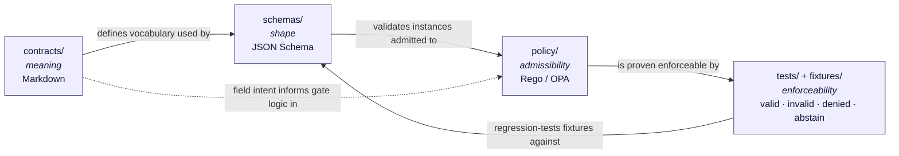
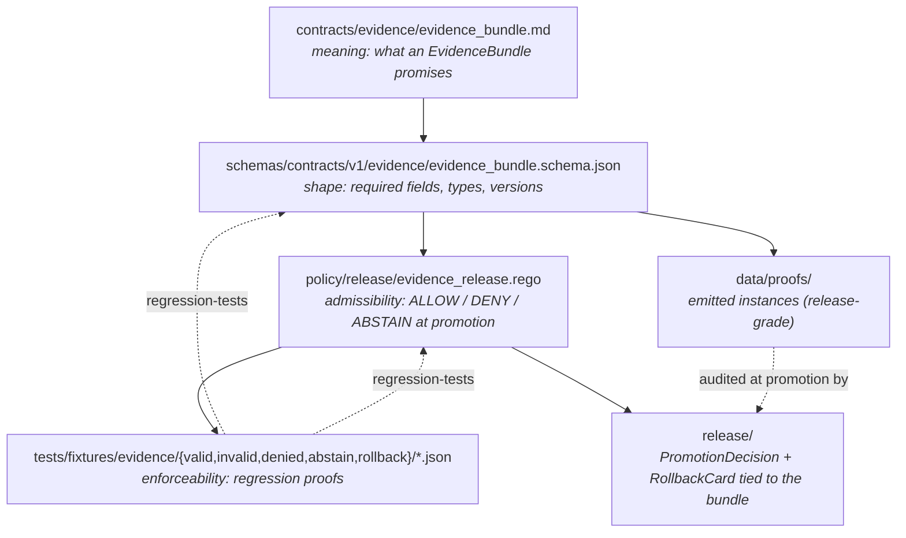

<!-- [KFM_META_BLOCK_V2]
doc_id: kfm://doc/architecture-contract-schema-policy-split
title: Contract / Schema / Policy / Test Split
type: standard
version: v1
status: draft
owners: TODO — Architecture steward + Docs steward (see CODEOWNERS)
created: 2026-05-14
updated: 2026-05-14
policy_label: public
related:
  - docs/doctrine/directory-rules.md
  - docs/doctrine/authority-ladder.md
  - docs/doctrine/truth-posture.md
  - docs/doctrine/trust-membrane.md
  - docs/doctrine/lifecycle-law.md
  - docs/adr/ADR-0001-schema-home.md
  - docs/architecture/README.md
  - docs/architecture/governed-api.md
  - contracts/README.md
  - schemas/README.md
  - policy/README.md
  - tests/README.md
tags: [kfm, architecture, contracts, schemas, policy, tests, doctrine]
notes:
  - Companion doc to Directory Rules §§6.3-6.5; canonical home of the four-layer split explanation.
  - PROPOSED status for any specific repo path until mounted-repo evidence verifies it.
[/KFM_META_BLOCK_V2] -->

# Contract / Schema / Policy / Test Split

> The architecture rule that keeps **meaning**, **shape**, **admissibility**, and **proof** as four separate layers — never collapsed, never duplicated, never silently mirrored.

[](#status)
[](../doctrine/directory-rules.md)
[](../adr/ADR-0001-schema-home.md)
[](../doctrine/lifecycle-law.md)
[](#last-updated)

| Status | Owners | Updated |
|---|---|---|
| `draft` (PROPOSED) | TODO — Architecture steward + Docs steward (see `CODEOWNERS`) | 2026-05-14 |

---

## Quick jump

- [1. Purpose](#1-purpose)
- [2. The four layers, in one breath](#2-the-four-layers-in-one-breath)
- [3. Why the split exists](#3-why-the-split-exists)
- [4. Layer 1 — `contracts/` (meaning)](#4-layer-1--contracts-meaning)
- [5. Layer 2 — `schemas/` (shape)](#5-layer-2--schemas-shape)
- [6. Layer 3 — `policy/` (admissibility)](#6-layer-3--policy-admissibility)
- [7. Layer 4 — `tests/` + `fixtures/` (enforceability)](#7-layer-4--tests--fixtures-enforceability)
- [8. How an object family flows across the four layers](#8-how-an-object-family-flows-across-the-four-layers)
- [9. ADR-0001 — the schema-home rule](#9-adr-0001--the-schema-home-rule)
- [10. Compatibility roots: `jsonschema/`, `policies/`](#10-compatibility-roots-jsonschema-policies)
- [11. Anti-patterns and their counter-rules](#11-anti-patterns-and-their-counter-rules)
- [12. Reviewer checklist](#12-reviewer-checklist)
- [13. Open questions / NEEDS VERIFICATION](#13-open-questions--needs-verification)
- [Appendix A — Object family × layer reference matrix](#appendix-a--object-family--layer-reference-matrix)
- [Appendix B — Glossary](#appendix-b--glossary)
- [Related docs](#related-docs)

---

## 1. Purpose

KFM's trust spine depends on four different kinds of authority being kept **structurally distinct** in the repository:

1. What an object **means**.
2. What an object **looks like** to a machine.
3. Whether an object is **allowed** through a gate.
4. Whether those three rules are **enforceable** in practice.

When these collapse into one folder — when a JSON Schema sits next to a prose contract, or a fixture doubles as a policy rule, or a doc page is cited as a release decision — the membrane between *intent* and *runtime* dissolves. Drift becomes invisible. Authority becomes ambient.

This document is the **canonical explanation** of how KFM keeps those four authorities apart. It is the companion to [`docs/doctrine/directory-rules.md`](../doctrine/directory-rules.md) §§6.3–6.5, and it is referenced from `directory-rules.md` §0 as related doctrine.

> [!IMPORTANT]
> The **rules** in this document are CONFIRMED from Directory Rules and the Unified Architecture Build Manual. The **specific repo paths** quoted are PROPOSED until verified against mounted-repo evidence per Directory Rules §0.

---

## 2. The four layers, in one breath

| Layer | Folder | Owns | Format | Question it answers |
|---|---|---|---|---|
| **Meaning** | `contracts/` | Object families, field intent, invariants, domain vocabulary, service commitments | Markdown (`.md`) | *What is this object, and what does each field promise?* |
| **Shape** | `schemas/` | Machine-checkable structure, required fields, enums, types, versioning | JSON Schema (Draft 2020-12), JSON-LD context | *Does this instance have the right keys and types?* |
| **Admissibility** | `policy/` | `ALLOW` / `DENY` / `RESTRICT` / `ABSTAIN` decisions; sensitivity classes; rights enforcement | Rego / OPA bundles (or equivalents) | *Given the rules in force, may this object pass this gate?* |
| **Enforceability** | `tests/` + `fixtures/` | Deterministic proof — valid, invalid, denied, abstain, rollback fixtures; assertions | Fixture files + test code | *Can we prove, against examples, that the rules above actually hold?* |

> [!NOTE]
> A single object family (e.g. `EvidenceBundle`) lives in **all four** layers simultaneously: a contract in `contracts/evidence/`, a schema in `schemas/contracts/v1/evidence/`, policy in `policy/runtime/` or `policy/release/`, and fixtures in `tests/fixtures/evidence/`. None of the four substitutes for any other.

[↑ Back to top](#quick-jump)

---

## 3. Why the split exists

KFM core invariants require that promotion is a **governed state transition, not a file move**, and that **EvidenceRef should resolve to EvidenceBundle when claims depend on evidence**. Both of those invariants assume that *the meaning of an object*, *its shape*, *its admissibility*, and *the proof it survives a gate* can be inspected separately.

If the layers collapse:

- **Meaning collapses into shape** → reviewers read JSON Schema to learn what a field *means*. Type annotations become folklore. Semantic invariants disappear.
- **Shape collapses into admissibility** → a schema rejects a field that policy would have merely abstained on. The system loses its abstain/deny distinction and starts denying things it should have asked review about.
- **Admissibility collapses into tests** → policy lives only in test code. There is no portable rule. CI passes, but no runtime gate is enforceable in production.
- **Tests collapse into fixtures** → fixtures become the spec. There is no negative-state proof. `DENY` and `ABSTAIN` paths go unexercised.

The split protects four properties simultaneously: **inspectability**, **portability**, **negative-state proof**, and **reversibility**. Lose any one, and the trust spine bends.



> [!TIP]
> Read the arrows as **"depends on the truth of"** — `policy/` cannot decide on a shape it does not know, `tests/` cannot prove a rule that is not written, and `contracts/` is the human-readable anchor for all three.

[↑ Back to top](#quick-jump)

---

## 4. Layer 1 — `contracts/` (meaning)

`contracts/` owns the **semantic** layer. Files here are Markdown documents that describe **what an object means**, **what each field intends**, and **what invariants the object carries**. Executable validation does **not** live here.

### 4.1 Layout

```text
contracts/
├── README.md
├── source/           # source_descriptor, ingest_receipt
├── evidence/         # evidence_ref, evidence_bundle
├── data/             # dataset_version, validation_report
├── runtime/          # runtime_response_envelope, decision_envelope, run_receipt, ai_receipt
├── release/          # release_manifest, promotion_decision, rollback_card
├── correction/       # correction_notice
├── governance/       # review_record
└── domains/
    ├── hydrology/   soil/   fauna/   …
```

Status of the layout above: CONFIRMED from `directory-rules.md` §6.3. Status of the specific path's **presence in the current repo**: PROPOSED until verified.

### 4.2 What `contracts/` does

- Names every **object family** in KFM's published language (e.g. `EvidenceBundle`, `RunReceipt`, `PromotionDecision`, `RollbackCard`).
- States **field intent** in human prose — what the field *means*, not just what type it is.
- Records **invariants** the object must satisfy (e.g. "an `EvidenceRef` must resolve to an `EvidenceBundle`").
- Anchors **domain vocabulary** used by the governed API surface (the *published language* in domain-driven terms).

### 4.3 What `contracts/` does **not** do

- It does **not** validate instances. That is `schemas/`'s job.
- It does **not** decide admissibility. That is `policy/`'s job.
- It does **not** carry executable assertions. That is `tests/`'s job.
- It does **not** host `.schema.json` files. Per ADR-0001 those live under `schemas/contracts/v1/...` (see §9).

> [!WARNING]
> A `.schema.json` file appearing under `contracts/<domain>/` is **lineage / CONFLICTED** per Directory Rules §6.4 and **MUST** be migrated to `schemas/contracts/v1/...` before any new schema lands. Maintaining divergent definitions in both `schemas/` and `contracts/` is explicitly forbidden.

[↑ Back to top](#quick-jump)

---

## 5. Layer 2 — `schemas/` (shape)

`schemas/` owns **machine-checkable shape**: required fields, enum values, formats, version constraints, and the structural surface validators can run against.

### 5.1 Layout

```text
schemas/
├── README.md
├── contracts/
│   └── v1/
│       ├── common/      source/      evidence/      data/
│       ├── runtime/     policy/      release/       correction/
│       └── domains/
│           ├── hydrology/   soil/   fauna/   …
└── tests/
    ├── valid/
    └── invalid/
```

CONFIRMED layout from `directory-rules.md` §6.4. PROPOSED for any specific repo path.

### 5.2 The shape contract

Schemas are **paired** with contracts. For every contract that describes an object family, there is at most one **canonical schema home** under `schemas/contracts/v1/<family>/<object>.schema.json`. Common object-family homes called out across the KFM corpus include:

| Object family | Proposed schema home (PROPOSED) |
|---|---|
| `SourceDescriptor` | `schemas/contracts/v1/source/source_descriptor.schema.json` |
| `EvidenceBundle` | `schemas/contracts/v1/evidence/evidence_bundle.schema.json` |
| `ValidationReport` | `schemas/contracts/v1/data/validation_report.schema.json` |
| `RunReceipt` | `schemas/contracts/v1/runtime/run_receipt.schema.json` |
| `DecisionEnvelope` | `schemas/contracts/v1/runtime/decision_envelope.schema.json` |
| `RuntimeResponseEnvelope` | `schemas/contracts/v1/runtime/runtime_response_envelope.schema.json` |
| `PolicyDecision` | `schemas/contracts/v1/policy/policy_decision.schema.json` |
| `PromotionDecision` | `schemas/contracts/v1/release/promotion_decision.schema.json` |
| `ReleaseManifest` | `schemas/contracts/v1/release/release_manifest.schema.json` |
| `RollbackCard` (rollback target) | `schemas/contracts/v1/release/rollback_card.schema.json` |
| `CorrectionNotice` | `schemas/contracts/v1/correction/correction_notice.schema.json` |
| `ReviewRecord` | `schemas/contracts/v1/governance/review_record.schema.json` |

These paths are PROPOSED. Confirm against the current `schemas/contracts/v1/` tree in the mounted repo before treating any of them as authoritative.

### 5.3 What `schemas/` does **not** do

- It does **not** explain what a field means. That is `contracts/`'s job.
- It does **not** say *who* may publish an instance. That is `policy/`'s job.
- A schema validation failure is a **shape** failure (`ERROR`), distinct from a policy denial (`DENY`) and from an evidence-shortage outcome (`ABSTAIN`). See [§6](#6-layer-3--policy-admissibility).

[↑ Back to top](#quick-jump)

---

## 6. Layer 3 — `policy/` (admissibility)

`policy/` is the **canonical singular** form. (`policies/`, if it exists, is a compatibility mirror — see [§10](#10-compatibility-roots-jsonschema-policies).)

### 6.1 Layout

```text
policy/
├── README.md
├── bundles/         # Rego/OPA bundles or equivalents
├── fixtures/        # policy fixtures distinct from tests/fixtures/
├── tests/           # policy tests
├── runtime/         # runtime gate policy (Focus Mode, evidence resolution, abstain)
├── promotion/       # promotion gate policy
├── sensitivity/     # sensitivity classes, redaction rules
├── rights/          # rights status, license enforcement
├── domains/
│   ├── fauna/   archaeology/   people-dna-land/   …
└── release/         # release-gate policy
```

CONFIRMED layout from `directory-rules.md` §6.5.

### 6.2 The four admissibility outcomes

KFM's truth posture is **cite-or-abstain** by default. Policy decisions must therefore admit more than a binary. The outcome vocabulary used across KFM contracts is:

| Outcome | Meaning | Typical surface |
|---|---|---|
| `ALLOW` / `ANSWER` | Evidence and rights support the answer; gate opens | Governed API, Focus Mode answer envelope |
| `DENY` | A rule (rights, sensitivity, policy bundle, sensitive-geometry guard) refuses release | Promotion gate, public surface |
| `ABSTAIN` | Insufficient admissible evidence; the system refuses to manufacture an answer | Focus Mode, evidence resolver |
| `ERROR` | Shape, integrity, or process failure (distinct from a content denial) | Validator, schema check, runtime envelope |

> [!NOTE]
> The `ALLOW` / `DENY` pair is the **policy-bundle** outcome (e.g. an OPA decision). The four-state vocabulary `ANSWER` / `ABSTAIN` / `DENY` / `ERROR` is the **runtime envelope** outcome (e.g. a `ValidationReport` or governed-AI response). Both are intentional; they describe different gates.

### 6.3 What `policy/` does **not** do

- It does **not** define field meanings (`contracts/`).
- It does **not** define field types (`schemas/`).
- It does **not** *prove* its rules; that is the role of `policy/tests/` and `tests/fixtures/` (see [§7](#7-layer-4--tests--fixtures-enforceability)).
- It does **not** publish artifacts. The trust path for public release runs through `apps/governed-api/` and the release-gate policy under `policy/release/` — never directly from `policy/` into a canonical store.

[↑ Back to top](#quick-jump)

---

## 7. Layer 4 — `tests/` + `fixtures/` (enforceability)

The fourth layer exists because **rules that are never exercised are not enforceable**. Every rule asserted in `contracts/`, `schemas/`, or `policy/` must be paired with **at least one fixture and at least one assertion that exercises the rule's negative state**.

### 7.1 The fixture rule (PROPOSED)

Every major object family should have:

- at least **one valid fixture**,
- at least **one invalid fixture** (shape failure → `ERROR`),
- at least **one denied fixture** (policy refusal → `DENY`),
- at least **one abstention fixture** (evidence shortage → `ABSTAIN`),
- and at least **one rollback or correction fixture** (governance reversal).

Status: PROPOSED per the Unified Architecture Build Manual §26 (Testing Strategy). Specific fixture inventories remain PROPOSED until verified against the mounted-repo tests tree.

### 7.2 Sensitive-lane fixtures

> [!CAUTION]
> Sensitive lanes — archaeology, rare-species locations, living-person data, DNA / genomic material, critical infrastructure detail, exact geometry near sensitive sites — **MUST NOT** carry real exact values in their fixtures. Use public-safe transformed fixtures (generalized geometry, synthetic identifiers, redacted timestamps). The denial path is itself part of the contract and must be testable without reproducing the harm.

### 7.3 The eight test classes (PROPOSED)

From the Unified Architecture Build Manual §26, the test taxonomy the four-layer split is designed to support:

| Test class | Example assertion |
|---|---|
| **Schema test** | Required fields and `schema_version` are present |
| **Contract test** | Object meaning matches vocabulary and lifecycle role |
| **Source-role test** | A source is not used outside its declared authority role |
| **Evidence test** | `EvidenceRef` resolves, **or** the answer abstains |
| **Policy test** | Unknown rights or sensitivity → DENY (or hold for review) |
| **Release test** | `ReleaseManifest` carries proof, correction path, rollback target |
| **UI trust test** | Evidence Drawer renders state and negative outcomes (`DENY`, `ABSTAIN`, `ERROR`) |
| **AI boundary test** | `MockAdapter` cannot answer without admissible evidence |

[↑ Back to top](#quick-jump)

---

## 8. How an object family flows across the four layers

The canonical example is `EvidenceBundle`, since it is the object the cite-or-abstain rule depends on.



Read the diagram as the **build order** for any new governed object: meaning → shape → admissibility → fixtures → emitted instances → release decision. Skipping a step is how parallel authority homes are born.

> [!IMPORTANT]
> The lifecycle invariant runs **alongside** this four-layer flow, not through it. `RAW → WORK/QUARANTINE → PROCESSED → CATALOG/TRIPLET → PUBLISHED` is the journey an *instance* takes; the four-layer split is the journey a *definition* takes. Both must hold for an artifact to be publishable.

[↑ Back to top](#quick-jump)

---

## 9. ADR-0001 — the schema-home rule

The default machine-schema home is **`schemas/contracts/v1/...`**, per ADR-0001.

| Rule | Statement |
|---|---|
| **Default schema home** | `schemas/contracts/v1/<family>/<object>.schema.json` |
| **Forbidden duplication** | A schema MUST NOT have divergent definitions in both `schemas/` and `contracts/` |
| **Lineage / CONFLICTED** | A `.schema.json` under `contracts/<domain>/` is lineage and MUST be migrated to `schemas/contracts/v1/...` before any new schema lands in that family |
| **Change discipline** | Changing the schema-home rule, creating a parallel schema/contract/policy/source/registry/release/proof/receipt home, or splitting a phase requires an **ADR** per Directory Rules §2.4 |

> [!WARNING]
> "Maintaining a temporary mirror" is **not** a workaround for ADR-0001. Mirrors are allowed only as part of an active migration declared in a migration manifest under `migrations/schema/`, with a recorded sunset date in `control_plane/deprecation_register.yaml`. A long-lived parallel home is drift, not a mirror.

For the migration discipline see Directory Rules §14.2.

[↑ Back to top](#quick-jump)

---

## 10. Compatibility roots: `jsonschema/`, `policies/`

Per Directory Rules §5 and §8, two compatibility roots can legitimately exist alongside the canonical layers:

| Compatibility root | Canonical counterpart | Class |
|---|---|---|
| `jsonschema/` | `schemas/` | Mirror — README **MUST** declare class as `mirror` or `legacy` |
| `policies/` (plural) | `policy/` (singular) | Mirror — README **MUST** declare class |

Compatibility roots are **mirrors**, not authority. They exist for tooling or backward-compatibility reasons and **MUST NOT evolve independently** of the canonical layer. A change that lands in `jsonschema/` but not in `schemas/contracts/v1/` is divergence and opens a drift register entry.

> [!NOTE]
> Whether either compatibility root actually exists in the current repo is **NEEDS VERIFICATION** per Directory Rules §18. Treat references to them in this doc as conditional on inspection.

[↑ Back to top](#quick-jump)

---

## 11. Anti-patterns and their counter-rules

| Anti-pattern | What goes wrong | Counter-rule |
|---|---|---|
| **Two parallel schema homes** | Schemas authored under both `schemas/` and `contracts/` (or `jsonschema/`) without an ADR; reviewers no longer know which version is authoritative | Single schema home (default `schemas/contracts/v1/…`); ADR-0001 governs migration |
| **Schema mirror divergence** | `schemas/` and `contracts/` (or `policies/` and `policy/`) evolve separately | One is canonical, the other is a generated mirror or frozen legacy; raise an ADR if unclear |
| **Schema authored alongside data file** | Schema and instance live in the same directory; reviewers drift | Shape under `schemas/`; meaning under `contracts/`; instance under `data/` |
| **Compatibility root used as authority** | Files that should live in `schemas/` or `policy/` end up in `jsonschema/` or `policies/` and harden into authority | Compatibility roots are mirrors; per-root README must declare class |
| **Test-only validator** | A validator lives only in a test file, not in `tools/validators/` | Extract validator to `tools/`; tests call into it |
| **Fixture sprawl** | Fixtures duplicated across `tests/fixtures/`, `fixtures/`, and per-domain folders | Choose one authority (root `fixtures/` or `tests/fixtures/`); document the rule in both READMEs |
| **Policy outcomes collapsed** | `ABSTAIN` rewritten as `DENY` (or vice versa) to simplify a path | Preserve the four-outcome vocabulary (`ANSWER`/`ABSTAIN`/`DENY`/`ERROR`) in runtime envelopes; the gate that loses `ABSTAIN` loses cite-or-abstain |
| **Documentation as truth** | A `docs/` page is cited as the source of a canonical decision | Promote to ADR or `control_plane/` register. `docs/` explains; it doesn't decide alone |

[↑ Back to top](#quick-jump)

---

## 12. Reviewer checklist

For any PR that adds, moves, or renames a contract, schema, policy bundle, or fixture, work through this:

- [ ] **Object family identified.** The change is associated with a known object family (e.g. `EvidenceBundle`, `RunReceipt`, `PromotionDecision`) or carries a contract-creating note.
- [ ] **All four layers checked.** The PR touches the appropriate layer(s) and **does not** smuggle one layer's content into another.
- [ ] **Schema home is canonical.** Any new `.schema.json` lives under `schemas/contracts/v1/...` per ADR-0001 (unless an accepted ADR amends).
- [ ] **No parallel authority.** No new home is created for schemas, contracts, policy, sources, registries, releases, proofs, or receipts without ADR.
- [ ] **Fixtures cover negative state.** Where applicable, valid · invalid · denied · abstain · rollback/correction fixtures all exist or are tracked in `docs/registers/VERIFICATION_BACKLOG.md`.
- [ ] **Compatibility mirror not divergent.** If `jsonschema/` or `policies/` is touched, the canonical counterpart is updated in the same PR.
- [ ] **READMEs synced.** Affected folders meet the Required README Contract per Directory Rules §15.
- [ ] **Rule cited in PR description.** The PR names the Directory Rules section that justifies the placement.

[↑ Back to top](#quick-jump)

---

## 13. Open questions / NEEDS VERIFICATION

These items are explicitly **not resolved** by this document and should be tracked in `docs/registers/VERIFICATION_BACKLOG.md`:

- **NEEDS VERIFICATION:** Whether the current mounted repo state actually has `contracts/`, `schemas/`, `policy/`, `tests/`, and `fixtures/` at the canonical layout shown in Directory Rules §§6.3–6.5. Per-root presence is PROPOSED until a directory-listing inspection confirms it.
- **NEEDS VERIFICATION:** Whether `contracts/` or `schemas/contracts/v1/` is the live machine-schema authority in the current repo. Default per ADR-0001 is `schemas/contracts/v1/`; resolve by inspection.
- **NEEDS VERIFICATION:** Whether `policies/` or `policy/` is canonical in the current repo. Default is `policy/`; resolve by inspection.
- **NEEDS VERIFICATION:** Whether `jsonschema/` exists, and if so at what entrenchment level — affects migration scope.
- **OPEN:** Whether `fixtures/` (repo root) or `tests/fixtures/` is the chosen authority for fixtures in the current repo. Directory Rules §13 names the duplication as drift but does not pick a winner; a one-line ADR is recommended to freeze it.
- **OPEN:** Whether `tests/fixtures/` should be partitioned by domain, object family, or both, and where the per-family `README.md` should live.
- **OPEN:** Whether `policy/fixtures/` (intentionally distinct from `tests/fixtures/` per §6.5) should mirror `policy/<subsystem>/` or `tests/fixtures/<subsystem>/`.

[↑ Back to top](#quick-jump)

---

## Appendix A — Object family × layer reference matrix

> The matrix below is a **PROPOSED** crosswalk drawn from the Unified Architecture Build Manual, the Whole-UI + Governed AI Expansion Report, and Master MapLibre Components. Every specific path is PROPOSED until verified.

<details>
<summary><b>Click to expand the full object family × layer matrix</b></summary>

| Object family | `contracts/` (meaning) | `schemas/contracts/v1/` (shape) | `policy/` (admissibility) | `tests/fixtures/` (proof) |
|---|---|---|---|---|
| `SourceDescriptor` | `contracts/source/source_descriptor.md` | `source/source_descriptor.schema.json` | `policy/rights/`, `policy/sensitivity/` | `tests/fixtures/sources/` |
| `EvidenceRef` | `contracts/evidence/evidence_ref.md` | `evidence/evidence_ref.schema.json` | `policy/runtime/` (resolution rules) | `tests/fixtures/evidence/` |
| `EvidenceBundle` | `contracts/evidence/evidence_bundle.md` | `evidence/evidence_bundle.schema.json` | `policy/release/`, `policy/runtime/` | `tests/fixtures/evidence/` |
| `ValidationReport` | `contracts/data/validation_report.md` | `data/validation_report.schema.json` | `policy/runtime/` (outcome handling) | `tests/fixtures/data/` |
| `RunReceipt` | `contracts/runtime/run_receipt.md` | `runtime/run_receipt.schema.json` | `policy/runtime/` | `tests/fixtures/runtime/` |
| `DecisionEnvelope` | `contracts/runtime/decision_envelope.md` | `runtime/decision_envelope.schema.json` | `policy/runtime/` | `tests/fixtures/runtime/` |
| `RuntimeResponseEnvelope` | `contracts/runtime/runtime_response_envelope.md` | `runtime/runtime_response_envelope.schema.json` | `policy/runtime/` | `tests/fixtures/runtime/` |
| `PolicyDecision` | `contracts/runtime/policy_decision.md` | `policy/policy_decision.schema.json` | `policy/bundles/` | `tests/fixtures/policy/` |
| `PromotionDecision` | `contracts/release/promotion_decision.md` | `release/promotion_decision.schema.json` | `policy/promotion/`, `policy/release/` | `tests/fixtures/release/` |
| `ReleaseManifest` | `contracts/release/release_manifest.md` | `release/release_manifest.schema.json` | `policy/release/` | `tests/fixtures/release/` |
| `RollbackCard` | `contracts/release/rollback_card.md` | `release/rollback_card.schema.json` | `policy/release/` (rollback eligibility) | `tests/fixtures/release/` |
| `CorrectionNotice` | `contracts/correction/correction_notice.md` | `correction/correction_notice.schema.json` | `policy/release/` (correction lineage) | `tests/fixtures/correction/` |
| `ReviewRecord` | `contracts/governance/review_record.md` | `governance/review_record.schema.json` | `policy/promotion/` (review state) | `tests/fixtures/review/` |

</details>

[↑ Back to top](#quick-jump)

---

## Appendix B — Glossary

<details>
<summary><b>Click to expand glossary of layer-relevant KFM terms</b></summary>

- **Object family** — A named class of KFM objects with a shared contract, schema home, and fixture set (e.g. `EvidenceBundle`).
- **Object meaning** — The prose contract describing what an object promises; lives in `contracts/`.
- **Shape** — The machine-checkable structure of an object; lives in `schemas/`.
- **Admissibility** — Whether a rule allows, denies, restricts, or abstains on a given object; lives in `policy/`.
- **Cite-or-abstain** — KFM's default truth posture: if evidence does not support an answer, the system abstains rather than manufacturing one.
- **Finite outcomes** — The four-state vocabulary `ANSWER` / `ABSTAIN` / `DENY` / `ERROR` used by runtime response envelopes.
- **`spec_hash`** — The content-addressed identifier of a contract or schema definition; tracked by `RunReceipt` and other process-memory objects.
- **Schema-home rule** — ADR-0001: the canonical home for machine schemas is `schemas/contracts/v1/...`.
- **Compatibility root** — A folder kept alongside a canonical one for backward compatibility (e.g. `jsonschema/`, `policies/`); MUST declare class in its README; MUST NOT evolve independently.
- **Drift** — Any divergence between layers, mirrors, or canonical and compatibility roots; tracked in `docs/registers/DRIFT_REGISTER.md`.

</details>

[↑ Back to top](#quick-jump)

---

## Related docs

- [`docs/doctrine/directory-rules.md`](../doctrine/directory-rules.md) — placement law (§§6.3–6.5 are the source of this document)
- [`docs/doctrine/authority-ladder.md`](../doctrine/authority-ladder.md) — TODO link target; PROPOSED
- [`docs/doctrine/truth-posture.md`](../doctrine/truth-posture.md) — TODO link target; PROPOSED
- [`docs/doctrine/trust-membrane.md`](../doctrine/trust-membrane.md) — TODO link target; PROPOSED
- [`docs/doctrine/lifecycle-law.md`](../doctrine/lifecycle-law.md) — TODO link target; PROPOSED
- [`docs/adr/ADR-0001-schema-home.md`](../adr/ADR-0001-schema-home.md) — schema-home rule
- [`docs/architecture/README.md`](./README.md) — architecture index
- [`docs/architecture/governed-api.md`](./governed-api.md) — the public trust path
- [`contracts/README.md`](../../contracts/README.md) — meaning layer index
- [`schemas/README.md`](../../schemas/README.md) — shape layer index
- [`policy/README.md`](../../policy/README.md) — admissibility layer index
- [`tests/README.md`](../../tests/README.md) — enforceability layer index

---

**Last updated:** 2026-05-14

[↑ Back to top](#quick-jump)
