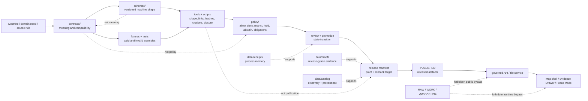

<!-- [KFM_META_BLOCK_V2]
doc_id: kfm://doc/NEEDS-VERIFICATION-contract-schema-policy-split
title: Contract, Schema, and Policy Split
type: standard
version: v1
status: draft
owners: OWNER_TBD_NEEDS_VERIFICATION
created: NEEDS_VERIFICATION
updated: 2026-05-06
policy_label: POLICY_LABEL_TBD_NEEDS_VERIFICATION
related: [../../README.md, ./README.md, ../adr/ADR-0001-schema-home.md, ../../contracts/README.md, ../../schemas/README.md, ../../policy/README.md, ../../tests/README.md, ../../tools/validators/README.md]
tags: [kfm, architecture, contracts, schemas, policy, validation, governance, evidence, release]
notes: [Target path is confirmed in the accessible GitHub repository; owners, created date, policy label, ADR acceptance, validator enforcement, workflow run status, branch protection, and release/runtime maturity remain NEEDS VERIFICATION.]
[/KFM_META_BLOCK_V2] -->

<a id="top"></a>

# Contract, Schema, and Policy Split

Contracts explain meaning; schemas validate shape; policy decides release and runtime admissibility.

<p align="left">
  
  
  
  
  
  
</p>

> [!IMPORTANT]
> **Status:** `draft`  
> **Path:** `docs/architecture/contract-schema-policy-split.md`  
> **Owning root:** `docs/` — human-facing architecture and governance documentation.  
> **Truth posture:** `CONFIRMED` project doctrine and repository placement / `PROPOSED` operating split where not yet accepted by ADR or enforcement proof / `NEEDS VERIFICATION` for owners, policy label, active workflow results, branch protections, and runtime behavior.  
> **Quick jumps:** [Scope](#scope) · [Repo fit](#repo-fit) · [Split at a glance](#split-at-a-glance) · [Architecture flow](#architecture-flow) · [Responsibility seams](#responsibility-seams) · [Known repo signals](#known-repo-signals) · [Object placement](#object-family-placement-map) · [Change workflow](#change-workflow) · [Gates](#gates-and-definition-of-done) · [Anti-patterns](#anti-patterns-to-reject) · [Open verification](#open-verification-backlog)

> [!NOTE]
> This document explains the operating split. It does **not** accept `ADR-0001` by itself, prove CI enforcement, or make any schema, policy, validator, release, or runtime surface authoritative without current repository evidence.

---

## Scope

This architecture note keeps three trust-critical surfaces separate without letting them drift:

| Surface | Short rule | Consequence |
|---|---|---|
| `contracts/` | Define meaning. | Maintainers can review what an object is for, what fields mean, and what compatibility promises downstream systems may rely on. |
| `schemas/` | Validate shape. | Tools can check whether an object instance is structurally valid for a versioned object family. |
| `policy/` | Decide admissibility. | Rules can allow, deny, restrict, hold, abstain, generalize, embargo, correct, or block release/runtime behavior. |

This file is for architecture, documentation, schema, policy, validator, API, UI, release, and domain-lane maintainers.

It is not a schema registry, policy bundle, validator implementation, test suite, release manifest, receipt, proof pack, or runtime contract.

### Accepted content

Content belongs here when it clarifies:

- how contract meaning, schema shape, and policy decisions relate;
- which adjacent root owns validation, fixtures, receipts, proofs, release records, or runtime behavior;
- how reviewers should detect authority drift;
- how object-family changes should move through contracts, schemas, policy, tests, validators, release, and docs;
- what must be verified before saying the split is enforced.

### Exclusions

| Do not define or store here | Proper home |
|---|---|
| JSON Schema bodies | `../../schemas/` or the ADR-approved schema home |
| Object semantics as machine schema only | `../../contracts/` plus schema references |
| Policy allow/deny logic | `../../policy/` |
| Valid/invalid fixtures | `../../fixtures/`, `../../tests/`, or the ADR-approved fixture home |
| Validator code | `../../tools/validators/`, `../../tools/`, or `../../scripts/` after repo convention verification |
| Receipts, proofs, manifests, rollback cards, or catalog records | Lifecycle, proof, release, or catalog homes after repo verification |
| API handlers, UI conditionals, or model adapters | App/package/runtime homes after repo verification |
| Claims that tests, workflows, or runtime gates passed | Only with current workflow, test, log, receipt, proof, or release evidence |

[Back to top](#top)

---

## Repo fit

| Field | Value |
|---|---|
| Target file | `docs/architecture/contract-schema-policy-split.md` |
| Document role | Cross-cutting architecture note for the contract/schema/policy boundary. |
| Directory Rules basis | `docs/architecture/` is the human-facing home for cross-domain system architecture; domains and machine artifacts remain under their responsibility roots. |
| Upstream orientation | [`../../README.md`](../../README.md), [`./README.md`](./README.md), [`../adr/ADR-0001-schema-home.md`](../adr/ADR-0001-schema-home.md) |
| Primary adjacent roots | [`../../contracts/README.md`](../../contracts/README.md), [`../../schemas/README.md`](../../schemas/README.md), [`../../policy/README.md`](../../policy/README.md) |
| Verification roots | [`../../tests/README.md`](../../tests/README.md), [`../../tools/validators/README.md`](../../tools/validators/README.md), `../../scripts/` when repo-native scripts own a check |
| Update trigger | Any material change to object meaning, machine shape, policy decisions, fixture mapping, validator behavior, runtime envelopes, release proof, correction, rollback, or schema-home authority. |

> [!WARNING]
> Architecture prose is not machine authority. Enforcement lives in the verified combination of ADRs, schemas, fixtures, validators, policy tests, workflow checks, release receipts, review state, and branch protection.

[Back to top](#top)

---

## Split at a glance

### Governing sentence

> Contracts explain meaning; schemas validate shape; policy decides release and runtime admissibility.

### Division of labor

| Lane | Owns | Must not silently own | Typical review question |
|---|---|---|---|
| `contracts/` | Object meaning, field intent, lifecycle semantics, compatibility rules, human-readable examples. | Machine validation as the only truth; policy decisions; emitted instances. | “Does this define what downstream systems may rely on?” |
| `schemas/` | Versioned machine-checkable shape, `$id` discipline, structural constraints, machine-readable vocabularies where approved. | Source authority, policy permission, release readiness, steward review. | “Can tools validate the object without guessing?” |
| `policy/` | Allow, deny, restrict, hold, abstain, obligations, reason codes, sensitivity, rights, review, release, correction, and runtime admissibility. | Object meaning, schema storage, lifecycle storage, UI-only trust state. | “What is permitted, blocked, generalized, held, or denied — and why?” |
| `fixtures/` / `tests/` | Positive and negative proof that the split behaves as claimed. | Contract authority, schema authority, policy authority. | “Can the happy path and failure path both be demonstrated?” |
| `tools/` / `scripts/` | Deterministic checks over schemas, fixtures, links, hashes, citations, manifests, evidence, and release candidates. | Policy law, publication approval, proof custody. | “Can the check fail closed with stable reasons?” |
| `data/receipts/` | Process memory and run history. | Normative definitions or release-grade proof. | “What happened, when, and with what inputs?” |
| `data/proofs/` / `release/` | Proof packs, release manifests, promotion decisions, rollback cards, correction objects. | Source-native raw data or schema definitions. | “Can this release be audited, corrected, and rolled back?” |
| `apps/` / `packages/` | Runtime consumers and implementations. | Hidden contract, schema, or policy authority. | “Does runtime consume the governed split instead of replacing it?” |

### What “valid” does not mean

A schema-valid object is not automatically publishable.

```text
schema-valid
≠ evidence-resolved
≠ rights-cleared
≠ sensitivity-safe
≠ policy-allowed
≠ reviewed
≠ released
≠ correction-ready
```

A KFM object becomes public-safe only when meaning, shape, evidence, policy, review, release, correction, and rollback all line up.

[Back to top](#top)

---

## Architecture flow



> [!CAUTION]
> A public map layer, search index, dashboard value, model answer, export, or story node is downstream of this flow. It must not become a shortcut around evidence, policy, review, release, correction, or rollback.

[Back to top](#top)

---

## Responsibility seams

### Contract seam

A contract change is needed when object **meaning** changes.

Examples:

- a field’s interpretation changes;
- a new object family is introduced;
- lifecycle meaning changes;
- compatibility promises change;
- a runtime surface relies on a new trust-bearing field;
- a release or correction workflow depends on a new semantic link.

A contract change should usually trigger schema, fixture, validator, policy, and docs review.

### Schema seam

A schema change is needed when machine **shape** changes.

Examples:

- required fields change;
- enum members change;
- `$id`, `$schema`, or versioning changes;
- cross-object `$ref` targets change;
- a fixture starts passing or failing differently;
- machine consumers need a new structural guarantee.

A schema change should not define public permission. It gives validators and tests the structure they need.

### Policy seam

A policy change is needed when **permission, restriction, review, or release behavior** changes.

Examples:

- a source role is allowed or denied for a claim type;
- unknown rights fail closed;
- exact geometry must be generalized;
- a runtime answer must abstain without citations;
- a release requires rollback target and correction path;
- a steward review threshold changes.

A policy change should ship with negative fixtures, reason/obligation codes, and review notes.

### Validator seam

A validator change is needed when enforceable **checking behavior** changes.

Examples:

- a schema must compile;
- a fixture family must pass or fail;
- `EvidenceRef` must resolve to `EvidenceBundle`;
- `ReleaseManifest` must prove rollback closure;
- a runtime envelope must reject non-finite outcomes.

Validators operationalize the split. They do not replace it.

[Back to top](#top)

---

## Known repo signals

The repository exposes signals that are useful for implementation review. These signals do not prove enforcement unless the checks are run and their results are reviewed.

| Signal | Status | Safe interpretation |
|---|---:|---|
| `docs/adr/ADR-0001-schema-home.md` | `CONFIRMED path` | The schema-home question is actively documented; the ADR remains draft/proposed unless accepted by maintainer evidence. |
| `contracts/README.md` | `CONFIRMED path` | `contracts/` is the semantic contract lane. |
| `schemas/README.md` | `CONFIRMED path` | `schemas/` is a real schema parent lane, but schema-home authority still needs explicit resolution. |
| `policy/README.md` | `CONFIRMED path` | `policy/` is the decision/admissibility lane. |
| `scripts/validate_schemas.py` | `CONFIRMED path` | A script targets first-wave schemas under `schemas/contracts/v1/`; pass/fail result still needs a current run. |
| `tools/validate_fixture_schema_mapping.py` | `CONFIRMED path` | Fixture-to-schema mapping exists for proof-slice artifacts; mapping completeness and run status still need verification. |
| `.github/workflows/baseline.yml` | `CONFIRMED path` | A baseline workflow invokes validators and tests; branch-protection and successful-run status remain separate verification items. |

> [!IMPORTANT]
> File presence is not enforcement proof. A workflow file can exist without being branch-protected, current, passing, required, or complete.

[Back to top](#top)

---

## Object-family placement map

This table is a placement guide, not a claim that every file already exists or is enforcement-grade. Exact paths, aliases, and versioning must follow the active ADR and repository evidence.

| Object family | Contract meaning home | Machine shape home | Policy touchpoint | Proof pressure |
|---|---|---|---|---|
| `SourceDescriptor` | `contracts/source/` | `schemas/contracts/v1/source/` | source role, rights, terms, cadence, sensitivity | source registry fixtures; source admission checks |
| `EvidenceRef` | `contracts/evidence/` | `schemas/contracts/v1/evidence/` | citation eligibility, evidence admissibility | resolver tests; unresolved-ref negative cases |
| `EvidenceBundle` | `contracts/evidence/` | `schemas/contracts/v1/evidence/` | public support, rights, review, release state | bundle composition fixtures; Evidence Drawer payload checks |
| `DecisionEnvelope` | `contracts/runtime/` or `contracts/policy/` | `schemas/contracts/v1/policy/` or runtime family | allow, deny, abstain, hold, obligations | finite outcome fixtures |
| `RuntimeResponseEnvelope` | `contracts/runtime/` | `schemas/contracts/v1/runtime/` | cite-or-abstain, public response permission | `ANSWER`, `ABSTAIN`, `DENY`, `ERROR` fixtures |
| `ValidationReport` | `contracts/data/` or validation contract lane | `schemas/contracts/v1/data/` | policy consumes validator result | pass/fail report fixtures |
| `PolicyDecision` | `contracts/policy/` or policy contract lane | `schemas/contracts/v1/policy/` | policy result itself | reason-code and obligation-code tests |
| `ReleaseManifest` | `contracts/release/` | `schemas/contracts/v1/release/` | publication state, release scope, rollback target | release closure tests |
| `ProofPack` | `contracts/release/` | `schemas/contracts/v1/release/` or release schema lane after ADR | promotion and public support | proof closure tests |
| `CorrectionNotice` | `contracts/correction/` | `schemas/contracts/v1/correction/` | supersession, withdrawal, correction propagation | correction and rollback drills |
| `AIReceipt` / `RunReceipt` | `contracts/runtime/` or receipt contract lane | `schemas/contracts/v1/runtime/` or receipt schema lane after ADR | runtime audit, no-hidden-truth posture | process-memory fixture tests |

> [!NOTE]
> If `contracts/` and `schemas/` both appear to contain normative machine definitions for the same object, stop and resolve authority before adding another file. Do not maintain divergent definitions in parallel.

[Back to top](#top)

---

## Change workflow

Use this workflow whenever a new trust-bearing object or rule appears.

```text
1. Name the object family or policy seam.
2. Define or update contract meaning.
3. Define or update machine schema shape.
4. Add or update valid and invalid fixtures.
5. Add or update validators.
6. Add or update policy rules when release/public/runtime behavior changes.
7. Add reviewer-facing test or CI summaries.
8. Update docs, ADRs, runbooks, and registers.
9. Confirm release, correction, and rollback impact.
10. Merge only with a visible validation and rollback story.
```

### Change matrix

| Change type | Minimum companion changes |
|---|---|
| New object family | contract card, schema, valid/invalid fixtures, validator path, docs links |
| Field added | schema change, contract meaning, fixture update, compatibility note |
| Required field added | breaking-change review, negative fixtures, downstream consumer review |
| Enum changed | vocabulary/reason-code review, policy impact review, fixtures |
| Policy rule changed | policy fixture pair, reason/obligation code review, release/runtime impact note |
| Runtime envelope changed | contract, schema, policy postcheck, Evidence Drawer/Focus Mode payload tests |
| Release object changed | release manifest validation, proof closure, rollback drill |
| Correction behavior changed | correction notice, supersession/withdrawal fixture, propagation test |
| Schema home moved | ADR or migration note, alias registry if needed, consumer inventory, rollback path |

[Back to top](#top)

---

## Gates and definition of done

A change that affects this split is not done until the relevant boxes are true.

### Architecture gate

- [ ] The owning surface is explicit: `contracts/`, `schemas/`, `policy/`, `fixtures/`, `tests/`, `tools/`, `scripts/`, data/proof/release, or runtime.
- [ ] No domain-specific shortcut creates a new root-level authority.
- [ ] The change preserves the RAW → WORK / QUARANTINE → PROCESSED → CATALOG / TRIPLET → PUBLISHED lifecycle boundary.
- [ ] Public clients remain downstream of governed APIs and released artifacts.

### Contract/schema gate

- [ ] Contract meaning and schema shape agree.
- [ ] Schema-home authority follows the active ADR or is visibly marked `NEEDS VERIFICATION`.
- [ ] Valid fixtures prove intended shape.
- [ ] Invalid fixtures prove fail-closed behavior.
- [ ] Compatibility impact is marked: additive, breaking, deprecated, alias-backed, or docs-only.

### Policy gate

- [ ] Unknown rights, sensitivity, review state, source role, or release state fails closed.
- [ ] Policy reason codes and obligations are stable enough to test.
- [ ] Runtime outcomes remain finite.
- [ ] Publication remains a governed state transition.
- [ ] Correction and rollback impacts are visible.

### Validator/test gate

- [ ] Validators consume contracts, schemas, and policy rather than redefining them.
- [ ] Tests include at least one negative path for consequential behavior.
- [ ] No test or validator silently reads RAW, WORK, QUARANTINE, unpublished candidates, secrets, or direct model outputs.
- [ ] CI/workflow claims are made only after workflow evidence is checked.

### Documentation gate

- [ ] Adjacent READMEs are updated when behavior changes.
- [ ] ADR links are updated when authority changes.
- [ ] Open placeholders remain visible instead of being smoothed into confident prose.
- [ ] Rollback or supersession path is described.

[Back to top](#top)

---

## Anti-patterns to reject

| Anti-pattern | Why it is unsafe |
|---|---|
| “It validates, so it can publish.” | Shape validation does not prove evidence, rights, policy, review, release, or rollback. |
| Contract meaning only inside JSON Schema descriptions. | Human-readable doctrine becomes hidden in machine files and hard to review. |
| Policy logic in UI conditionals. | Public behavior drifts from backend, release, and review gates. |
| Validators deciding release by themselves. | Validators verify; policy and promotion decide. |
| Receipts treated as proof packs. | Process memory is not release-grade proof. |
| Proof packs stored as schema examples. | Examples are not published proof custody. |
| `contracts/` and `schemas/` both carrying divergent definitions. | Split authority breaks auditability and testability. |
| Public runtime reading RAW or WORK data directly. | Bypasses the trust membrane. |
| AI output treated as evidence. | Generated text is interpretive and subordinate to `EvidenceBundle`, policy, review, and release state. |
| Future paths copied from prior reports without repo verification. | Repetition is lineage, not implementation proof. |

[Back to top](#top)

---

## Reviewer quickstart

Run these from a real checkout before reviewing a split-sensitive change. Adapt to repo-native tools after confirming package manager, CI, and branch conventions.

```bash
git status --short
git branch --show-current || true
git rev-parse --show-toplevel || true

find docs/architecture docs/adr contracts schemas policy fixtures tests tools scripts \
  -maxdepth 3 -type f 2>/dev/null | sort | sed -n '1,300p'

git grep -nE \
  'contract-schema-policy|schema home|canonical schema|EvidenceBundle|DecisionEnvelope|RuntimeResponseEnvelope|PolicyDecision|ReleaseManifest|CorrectionNotice|ABSTAIN|DENY|fail closed|RAW|QUARANTINE' \
  -- docs contracts schemas policy fixtures tests tools scripts 2>/dev/null || true
```

### Review questions

1. What does the contract say this object **means**?
2. What schema proves the object **shape**?
3. What policy decides whether the object is **admissible**?
4. Which fixtures prove the **happy path and failure path**?
5. Which validator produces a **stable report**?
6. Which release, correction, or rollback object changes?
7. Which UI or runtime surface consumes the result?
8. What happens when evidence, rights, sensitivity, or release state is unknown?

[Back to top](#top)

---

## Open verification backlog

| Item | Status | Why it matters |
|---|---:|---|
| Document owner | `NEEDS VERIFICATION` | Owner review routing must be confirmed before publication. |
| Policy label | `NEEDS VERIFICATION` | Public/restricted status must match the document registry or policy-label standard. |
| Created date | `NEEDS VERIFICATION` | Creation lineage needs maintainer or git-history confirmation. |
| `ADR-0001` acceptance state | `NEEDS VERIFICATION` | This note should not claim final schema-home law until ADR status and acceptance evidence are confirmed. |
| Schema-home aliases | `NEEDS VERIFICATION` | Old paths, if any, must be explicit, tested, and dated. |
| Canonical fixture home | `NEEDS VERIFICATION` | `schemas/tests/fixtures/`, root `fixtures/`, and repo-wide `tests/` must not fork proof authority. |
| Validator enforcement | `NEEDS VERIFICATION` | Scripts and tools exist, but current run output and branch requirements must be checked. |
| Baseline workflow result | `NEEDS VERIFICATION` | Workflow YAML exists, but successful run status and branch protection were not verified here. |
| Policy engine and runner | `UNKNOWN` | OPA/Conftest or equivalent enforcement cannot be claimed without tool evidence. |
| Runtime/API consumers | `UNKNOWN` | Route names, DTOs, and runtime behavior require source inspection and tests. |
| Release/proof artifacts | `UNKNOWN` | Release manifests, proof packs, receipts, and rollback objects require emitted artifact evidence. |

[Back to top](#top)

---

## Appendix: glossary

<details>
<summary><strong>Core terms</strong></summary>

| Term | Meaning in this document |
|---|---|
| Contract | Human-readable meaning and compatibility intent for a KFM object or seam. |
| Schema | Machine-checkable structure for a versioned object family. |
| Policy | Decision logic governing admissibility, restrictions, review, release, correction, runtime, and exposure. |
| Validator | Deterministic tool that checks shape, linkage, closure, hashes, citations, manifests, or fixture expectations. |
| Fixture | Small valid or invalid example used to prove behavior. |
| Receipt | Process-memory artifact that records what happened in a run. |
| Proof pack | Release-grade closure artifact that bundles validation, evidence, policy, integrity, and release support. |
| Release manifest | Governed declaration of published artifacts, scope, hashes, correction links, and rollback target. |
| EvidenceBundle | Resolved evidence support for a claim or runtime response. |
| Fail closed | Block, deny, abstain, hold, generalize, quarantine, or error instead of guessing. |
| Trust membrane | Boundary preventing public clients, UI, AI, exports, and derivatives from bypassing governed evidence, policy, and release paths. |

</details>

<details>
<summary><strong>Pre-publish checklist for this file</strong></summary>

- [x] KFM Meta Block V2 is present.
- [x] One H1 only.
- [x] Purpose line appears directly below the title.
- [x] Badges and quick jumps are present.
- [x] Repo fit is explicit.
- [x] Accepted content and exclusions are explicit.
- [x] Contract/schema/policy roles are separate.
- [x] Mermaid diagram is meaningful and grounded in KFM lifecycle and trust boundaries.
- [x] Tables clarify responsibility seams and object placement.
- [x] Code fences are language-tagged.
- [x] Long reference content is wrapped in `<details>`.
- [x] Unknowns and placeholders are visible.
- [ ] Owners, policy label, created date, ADR status, validator run results, workflow enforcement, branch protection, and release proof are verified by maintainers before promotion.

</details>

[Back to top](#top)
