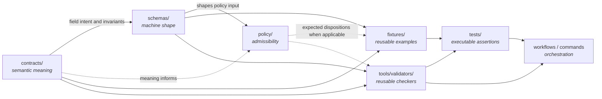
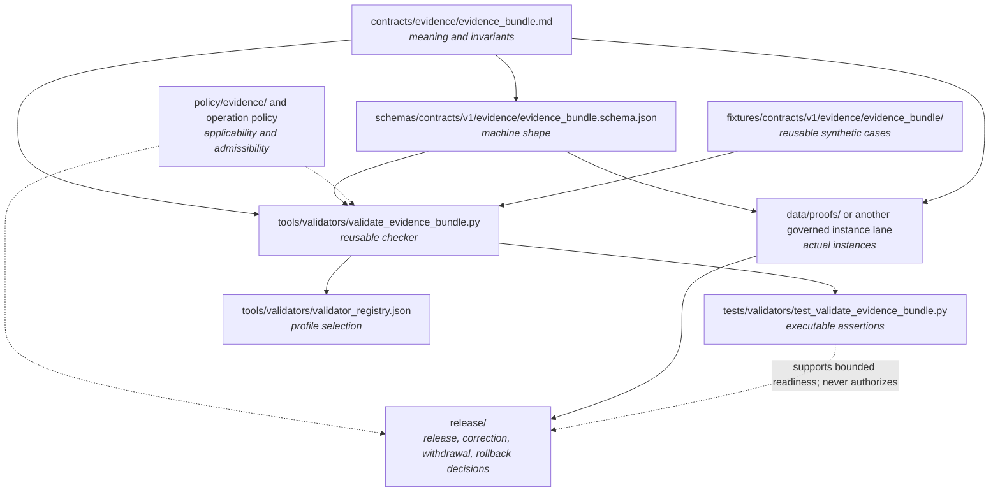

<!-- [KFM_META_BLOCK_V2]
doc_id: kfm://doc/architecture-contract-schema-policy-split
title: Contract / Schema / Policy / Test Split
type: architecture-standard
version: v2.0
status: draft; repository-grounded; explanatory; adopted-placement-aligned; mixed-maturity; non-authoritative
owners: NEEDS VERIFICATION — CODEOWNERS routes /docs/ to @bartytime4life; no independently verified architecture, contract/schema, policy, or QA stewardship charter was established
created: 2026-05-14
updated: 2026-08-18
policy_label: public; architecture; responsibility-boundaries; cite-or-abstain; no-parallel-authority; non-release; non-publication
current_path: docs/architecture/contract-schema-policy-split.md
owning_root: docs/
responsibility: explain how semantic meaning, machine shape, admissibility, reusable examples, executable tests, and repository validators compose without transferring authority among their owning roots
truth_posture: cite-or-abstain; repository-current claims are pinned to the evidence snapshot; this page explains accepted placement and current implementation boundaries but does not create semantic, schema, policy, review, release, or publication authority
evidence_snapshot:
  repository: bartytime4life/Kansas-Frontier-Matrix
  base_ref: main
  base_commit: f287d7e1501229ebde23737aba98c07279684dbc
  target_prior_blob: 101b921cf152f75da425ce61a0f00295334e58cb
  directory_rules_blob: fd49a0b83e55cef52c1124281f093e263526898d
  directory_rules_decision: ADR-0029 accepted
  root_registry_blob: 024f668b5f0a9239bafa4f8b09e2afd86300ff8c
  schema_validation_workflow_blob: e04e69a04d9f8fb57f803a23e3a05e79f85cdc58
related:
  - ../doctrine/directory-rules.md
  - ../doctrine/authority-ladder.md
  - ../doctrine/truth-posture.md
  - ../doctrine/trust-membrane.md
  - ../doctrine/lifecycle-law.md
  - ../adr/ADR-0029-adopt-directory-governance-standard-v2.md
  - ../adr/ADR-0001-schema-home--schemas-contracts-v1-is-canonical.md
  - ../adr/ADR-0002-contracts-vs-schemas-split.md
  - ./README.md
  - ./governed-api.md
  - ../../contracts/README.md
  - ../../schemas/README.md
  - ../../policy/README.md
  - ../../fixtures/README.md
  - ../../tests/README.md
  - ../../tools/validators/README.md
  - ../../control_plane/root_registry.yaml
  - ../../tools/validators/validator_registry.json
  - ../../.github/workflows/schema-validation.yml
tags: [kfm, architecture, contracts, schemas, policy, fixtures, tests, validators, governance]
notes:
  - "v2.0 replaces the May 2026 proposal-only posture with a repository-grounded explanation pinned to current main."
  - "Accepted ADR-0029, not proposed ADR-0001 or ADR-0002, supplies the binding top-level placement authority."
  - "Root fixtures/ is the canonical reusable-fixture authority; tests/fixtures/ is bounded test-local support and must not become a second reusable-fixture authority."
  - "Root-level jsonschema/ and policies/ were absent at the pinned base. This page does not authorize creating them."
  - "This change updates explanatory Markdown only; it changes no contract, schema, policy rule, fixture, validator, test, workflow, lifecycle object, release state, runtime behavior, or publication state."
[/KFM_META_BLOCK_V2] -->

<a id="top"></a>

# Contract / Schema / Policy / Test Split

[](#status)
[](../adr/ADR-0029-adopt-directory-governance-standard-v2.md)
[](#9-adr-0001--the-schema-home-rule)
[](../adr/ADR-0001-schema-home--schemas-contracts-v1-is-canonical.md)
[](../adr/ADR-0002-contracts-vs-schemas-split.md)
[](#authority-boundary)

> **One-line rule.** Keep **meaning**, **machine shape**, **admissibility**, **reusable examples**, **executable assertions**, and **reusable validation logic** in their owning responsibility roots; connect them by explicit references, never by duplicated authority.

> [!IMPORTANT]
> This page is a cross-cutting **architecture explanation**. It does not define an object's meaning, make a schema canonical by prose, activate policy, approve review, promote lifecycle state, authorize release, or publish anything. Accepted Directory Rules and ADRs control placement; the owning roots control their artifacts; current code, tests, workflows, and emitted records control implementation claims.

**Quick navigation:** [Purpose](#1-purpose) · [Four responsibilities](#2-the-four-layers-in-one-breath) · [Why the split exists](#3-why-the-split-exists) · [Contracts](#4-layer-1--contracts-meaning) · [Schemas](#5-layer-2--schemas-shape) · [Policy](#6-layer-3--policy-admissibility) · [Conformance](#7-layer-4--tests--fixtures-enforceability) · [Object-family flow](#8-how-an-object-family-flows-across-the-four-layers) · [Schema route](#9-adr-0001--the-schema-home-rule) · [Compatibility and drift](#10-compatibility-and-drift) · [Anti-patterns](#11-anti-patterns-and-their-counter-rules) · [Change planning](#12-change-planning-by-impact) · [Review checklist](#13-reviewer-checklist) · [Open verification](#14-open-questions--needs-verification) · [Matrix](#appendix-a--object-family--layer-reference-matrix) · [Glossary](#appendix-b--glossary)

---

<a id="status"></a>

## Current status and evidence boundary

| Surface | Current repository-grounded result at `main@f287d7e…` | Claim limit |
|---|---|---|
| Accepted placement authority | [`ADR-0029`](../adr/ADR-0029-adopt-directory-governance-standard-v2.md) adopts the exact bytes of [`docs/doctrine/directory-rules.md`](../doctrine/directory-rules.md). | Establishes responsibility-root placement; it does not validate every descendant or accept other ADRs. |
| Root projection | [`control_plane/root_registry.yaml`](../../control_plane/root_registry.yaml) projects `contracts/`, `schemas/`, `policy/`, `fixtures/`, `tests/`, and `tools/` as canonical roots with distinct allowed artifact kinds. | Machine projection supports conformance checks; it cannot create or amend authority. |
| Schema route | Directory Rules `DIR-AUTHROOT-001` makes `schemas/contracts/v1/<family>/` the default machine-schema route. | Does not make [`ADR-0001`](../adr/ADR-0001-schema-home--schemas-contracts-v1-is-canonical.md) accepted; that ADR remains proposed for dedicated routing, migration, and enforcement decisions. |
| Coupling decision | [`ADR-0002`](../adr/ADR-0002-contracts-vs-schemas-split.md) is present with effective status `proposed`. | Its stricter readiness and cross-surface coupling rules are recommendations until accepted. |
| Semantic root | [`contracts/`](../../contracts/README.md) exists and documents semantic authority plus known machine-schema drift. | Presence does not prove every contract is mature, paired, consumed, or correct. |
| Machine-shape root | [`schemas/`](../../schemas/README.md) exists; `schemas/contracts/v1/` is a configured validation surface with compatibility debt. | Shape validity is not semantic truth, evidence closure, policy approval, or release readiness. |
| Policy root | Singular [`policy/`](../../policy/README.md) exists and is the adopted policy-source root. | The current policy README records mixed maturity and no accepted repository-wide general evaluator. |
| Reusable fixture root | [`fixtures/`](../../fixtures/README.md) exists and is the canonical reusable, synthetic, public-safe fixture root. | A fixture is an example carrier, not data, evidence, policy, proof, or release authority. |
| Test root | [`tests/`](../../tests/README.md) exists and owns executable conformance evidence. | No complete repository-wide test suite is established by root presence or one green workflow. |
| Validator implementation | [`tools/validators/`](../../tools/validators/README.md) exists; the current `full` registry profile lists 20 bounded checks. | Registry membership and validator success prove only the declared checked scope. |
| Schema orchestration | [`schema-validation.yml`](../../.github/workflows/schema-validation.yml) coordinates JSON parsing, meta-schema checks, nine configured aggregate fixture families, aggregate validators, and schema/contract tests. | Workflow definition is not exact-head execution evidence and emits no policy, proof, release, or publication authority. |
| Root compatibility names | Root-level `jsonschema/` and `policies/` were absent at the pinned base. | Their absence does not close descendant drift; this document does not authorize creating either root. |
| Public or release effect | None. | This page and its pull request are explanatory repository changes only. |

### Truth labels used here

- **CONFIRMED** — verified from the pinned repository, accepted decision, supplied file, workflow, or machine projection.
- **PROPOSED** — recommended coupling, readiness, or future migration not accepted or implemented as a complete rule.
- **UNKNOWN** — evidence does not establish the answer.
- **NEEDS VERIFICATION** — a concrete repository, runtime, governance, or review check remains.

<a id="authority-boundary"></a>

### Authority boundary

This document owns one responsibility: **explain how the roots compose**.

| Question | Authority owner |
|---|---|
| What does the object or interface mean? | `contracts/` |
| What machine shape is valid? | `schemas/` |
| Under what conditions is an operation allowed, denied, held, restricted, or abstained? | `policy/` |
| Which reusable examples represent positive, negative, stale, denied, abstaining, correction, or rollback cases? | `fixtures/` |
| Can the declared behavior be exercised as an executable assertion? | `tests/` |
| Where does reusable checker or validator implementation live? | `tools/validators/` |
| Which check runs for a repository profile? | `tools/validators/validator_registry.json` and the invoking workflow or command |
| Which source or evidence supports a factual claim? | Governed source, evidence, and proof authorities |
| Which instance is in RAW, WORK, QUARANTINE, PROCESSED, CATALOG/TRIPLET, or PUBLISHED state? | Governed `data/` instance planes |
| Which release, correction, withdrawal, or rollback decision applies? | `release/` |
| How do these surfaces fit together for readers? | This architecture page and the owning-root READMEs |

> [!WARNING]
> A lower layer may reference an upstream authority without owning it. A schema may reference a contract; a validator may load a schema; a policy rule may consume schema-shaped input; a test may invoke a validator. None of those relationships transfers the upstream authority.

---

## 1. Purpose

KFM's trust spine depends on separate answers to six questions:

1. **Meaning** — What is the object, field, interface, or promise?
2. **Shape** — Which machine representation is structurally valid?
3. **Admissibility** — May this operation proceed for this actor, audience, source role, evidence state, rights posture, sensitivity, lifecycle state, review state, and release context?
4. **Examples** — Which small, synthetic cases represent the boundary?
5. **Proof** — Can executable assertions distinguish the intended positive and negative behavior?
6. **Validation** — Can the same checker be reused by CI, pipelines, review tooling, and release-readiness checks without hiding authority inside test code?

The repository groups those six questions into four architectural responsibilities:

- **semantic meaning** in `contracts/`;
- **machine shape** in `schemas/`;
- **admissibility** in `policy/`;
- **conformance** across `fixtures/`, `tests/`, and `tools/validators/`.

This is a responsibility split, not a demand that every edit mechanically touches every root. A change must update every **applicable** authority surface and state why an adjacent surface is unaffected.

> [!NOTE]
> The canonical lifecycle is separate from this definition architecture:
>
> ```text
> RAW -> WORK / QUARANTINE -> PROCESSED -> CATALOG / TRIPLET -> PUBLISHED
> ```
>
> Definitions live in the responsibility roots above. Governed instances move through lifecycle, evidence, accountability, and release planes. A contract, schema, policy source file, fixture, test, or validator is not promoted merely because it is committed.

[Back to top](#top)

---

## 2. The four layers, in one breath

| Responsibility | Canonical surface | Owns | Typical artifacts | Does not prove or decide |
|---|---|---|---|---|
| **Meaning** | `contracts/` | Object-family vocabulary, field intent, invariants, exclusions, compatibility promises, interface semantics | Markdown contracts and family indexes | Machine validity, factual truth, admissibility, execution, review, release |
| **Shape** | `schemas/` | Machine-checkable structure, references, required fields, enums, formats, versioned schema identity | JSON Schema Draft 2020-12 and other accepted machine-shape artifacts | Meaning, source authority, evidence sufficiency, rights, sensitivity, release |
| **Admissibility** | `policy/` | Operation-specific allow, deny, hold, restrict, abstain, and obligation rules | Reviewed Rego/OPA-compatible or equivalent rule source and bundle definitions | Meaning, shape, factual truth, human review, promotion, publication |
| **Conformance** | `fixtures/` + `tests/` + `tools/validators/` | Reusable examples, executable assertions, reusable fail-closed checkers, bounded diagnostics | Synthetic fixture families, test code, validators, registry entries | Semantic or policy authority, production parity, release approval, public truth |

### The proof surfaces are distinct

| Surface | Primary role | Boundary |
|---|---|---|
| `fixtures/` | Reusable, synthetic, deterministic, public-safe inputs and expected outputs | Examples only; no executable assertion and no governed instance authority |
| `tests/` | Authored executable assertions and integration/boundary checks | Proof for the checked scope only; no reusable-fixture or validator authority |
| `tools/validators/` | Reusable checker implementation and deterministic diagnostics | Checks declared authorities; does not define them |
| `.github/workflows/` | Orchestration of repository-owned commands | Runs checks; does not own validation semantics or grant release authority |

> [!TIP]
> A test should call a reusable validator when the same gate is needed outside that test. Production code, pipelines, or CI should not import test modules to obtain trust-bearing logic.

[Back to top](#top)

---

## 3. Why the split exists

The split makes drift inspectable and correction reversible.

| Collapse | Failure mode |
|---|---|
| Meaning into schema | Reviewers must infer field intent from types and enums; semantic limits become folklore. |
| Shape into policy | Structural rejection is confused with admissibility, and `ERROR`, `DENY`, `HOLD`, or `ABSTAIN` lose their distinct meanings. |
| Policy into schema | Rights, sensitivity, access, review, or release rules become static field constraints and cannot express operation-specific context. |
| Policy into tests | Rules exist only in a test harness and cannot be evaluated consistently by a governed runtime or promotion gate. |
| Validator into tests | Reusable gate logic is hidden in test code; pipelines and CI reimplement it or import the wrong authority. |
| Tests into fixtures | Example bytes become an unwritten specification with no executable negative-state proof. |
| Definition into instance | A receipt, proof, catalog record, or release object is mistaken for the normative definition of its family. |
| Workflow into authority | A green job is treated as schema, policy, review, release, or publication approval. |


```mermaid
flowchart LR
  C["contracts/<br/><i>semantic meaning</i>"]
  S["schemas/<br/><i>machine shape</i>"]
  P["policy/<br/><i>admissibility</i>"]
  F["fixtures/<br/><i>reusable examples</i>"]
  T["tests/<br/><i>executable assertions</i>"]
  V["tools/validators/<br/><i>reusable checkers</i>"]
  W["workflows / commands<br/><i>orchestration</i>"]

  C -->|"field intent and invariants"| S
  C -.->|"meaning informs"| P
  S -->|"shapes policy input"| P
  C --> F
  S --> F
  P -.->|"expected dispositions when applicable"| F
  F --> T
  V --> T
  C --> V
  S --> V
  P -.-> V
  V --> W
  T --> W
```

The arrows mean **depends on or checks**, not **owns**. The dependency must point toward the artifact's real authority rather than create a second writable copy.

[Back to top](#top)

---

## 4. Layer 1 — `contracts/` (meaning)

`contracts/` is the canonical semantic-meaning root.

### Owns

- object-family and interface vocabulary;
- field intent and invariants;
- identity and relationship semantics;
- allowed claim scope and explicit exclusions;
- compatibility, deprecation, correction, and supersession promises;
- references to applicable schemas, policy, fixtures, tests, validators, lifecycle records, and release objects.

### Does not own

- `.schema.json` machine definitions;
- executable policy source;
- reusable fixture payloads;
- test or validator implementation;
- source, evidence, receipt, proof, catalog, lifecycle, or release instances;
- runtime, API, UI, map, or AI behavior.

A semantic contract may describe `PolicyDecision`, `ReleaseManifest`, or `EvidenceBundle`. The topic name does not transfer those artifacts into `policy/`, `release/`, or `data/`; contracts still own only their **meaning**.

### Current repository pressure

[`contracts/README.md`](../../contracts/README.md) records three inherited `.schema.json` placement violations under `contracts/`. They are **CONFIRMED drift**, not precedent. This architecture update:

- freezes no path;
- migrates no schema;
- deletes no file;
- authorizes no new schema write under `contracts/`.

New machine-shape changes should use the adopted schema route unless an accepted ADR establishes a different profile.

[Back to top](#top)

---

## 5. Layer 2 — `schemas/` (shape)

`schemas/` is the canonical machine-shape root.

### Default route

Accepted Directory Rules `DIR-AUTHROOT-001` establish:

```text
schemas/contracts/v1/<family>/
```

as the default route for contract-backed machine schemas unless an accepted ADR establishes another versioned schema profile.

### Owns

- JSON Schema and accepted equivalent machine-shape artifacts;
- `$id`, `$ref`, composition, required fields, types, enums, formats, and shape-level constraints;
- schema-family indexes and declared compatibility;
- generated type/binding source declarations when the generated output names its schema source and regeneration process.

### Does not own

- field meaning or claim limits;
- source authority or evidence sufficiency;
- rights, sensitivity, access, consent, review, or release decisions;
- factual truth or lifecycle promotion;
- validator selection, runtime behavior, or public exposure.

> [!IMPORTANT]
> Schema validity is necessary for a shaped object and insufficient for a governed claim. A schema-valid payload may still be semantically wrong, unsupported, stale, source-role-confused, rights-uncleared, sensitive, policy-denied, unreviewed, unreleased, or unsafe for public use.

### Current validation surface

The current [`schema-validation` workflow](../../.github/workflows/schema-validation.yml):

- parses JSON under `schemas/`;
- meta-validates `*.schema.json`;
- requires Draft 2020-12 and unique `$id` values for the configured v1 route;
- requires nonempty valid and invalid lanes for nine aggregate fixture families;
- runs aggregate validators and repository-owned schema/contract tests;
- emits only logs and a job summary.

It does **not** emit an authoritative `ValidationReport`, receipt, proof, policy decision, promotion decision, release record, or published artifact.

### Compatibility debt inside `schemas/`

Root-level lanes under `schemas/` may be compatibility, migration, vocabulary, or transitional surfaces. Their presence does not establish a second machine-shape authority. New fields must not evolve independently in a compatibility lane and the versioned family route.

[Back to top](#top)

---

## 6. Layer 3 — `policy/` (admissibility)

Singular `policy/` is the adopted policy-source root.

### Owns

- operation-specific admissibility rules;
- rights, sensitivity, consent, access, render, export, AI, lifecycle, promotion, release, correction, and rollback policy source;
- stable rule package names, entrypoints, reason codes, and obligations;
- fail-closed behavior for missing, unknown, stale, conflicted, restricted, or untrusted context.

### Does not own

- semantic meaning;
- machine shape;
- source or evidence facts;
- emitted policy-decision instances merely because their type contains “policy”;
- human review, promotion, release, correction, rollback, or publication authority;
- evaluator, adapter, CLI, server, or reusable runtime implementation.

A policy rule evaluates explicit, versioned inputs. It must not silently fetch missing facts, infer rights, invent evidence, downgrade sensitivity, or turn a passing validator into authorization.

### Keep outcome axes separate

Different surfaces use different finite vocabularies. Do not flatten them into one ambiguous `status` field.

| Axis | Example vocabulary | Owner |
|---|---|---|
| Policy disposition | `ALLOW`, `DENY`, `HOLD`, `RESTRICT`, `ABSTAIN`, plus obligations or reasons as defined by the accepted policy contract | Policy contract, schema, and rule source |
| Runtime response | `ANSWER`, `ABSTAIN`, `DENY`, `ERROR` | Runtime response contract and governed implementation |
| Validation execution | `PASS`, `FAIL`, `ERROR`, or a validator-specific expected-rejection marker | Validator contract and implementation |
| Review state | `pending`, `approved`, `changes_requested`, `rejected`, or the accepted review vocabulary | Review contract and record |
| Placement result | `PLACE`, `SPLIT`, `MIGRATE`, `MIRROR`, `HOLD`, `DENY` | Directory Rules |
| Truth label | `CONFIRMED`, `PROPOSED`, `UNKNOWN`, `NEEDS VERIFICATION` | Evidence posture |

The accepted object-family contract controls the actual vocabulary. This table is a cross-axis warning, not a universal enum declaration.

### Current maturity boundary

[`policy/README.md`](../../policy/README.md) records a broad but mixed-maturity tree, one bounded executable Rego profile, and no accepted repository-wide general evaluator or proven production decision flow. Policy path presence therefore does not prove active enforcement.

[Back to top](#top)

---

## 7. Layer 4 — `tests/` + `fixtures/` (enforceability)

The conformance responsibility uses three roots with different owners.

### 7.1 Reusable fixture authority

Root [`fixtures/`](../../fixtures/README.md) owns reusable, synthetic, deterministic, public-safe fixture families.

A good fixture declares:

- the contract and schema it exercises;
- whether it is valid, invalid, denied, restricted, abstaining, held, stale, erroneous, corrected, rolled back, or golden;
- the expected result or reason code when stable;
- the consumer test or validator;
- its no-network, time, randomness, locale, rights, and sensitivity assumptions.

`tests/fixtures/` is bounded **test-local support**, not a second repository-wide reusable-fixture authority. A test-local input may stay beside its test when it is not a shared fixture family. Shared or cross-consumer examples belong under root `fixtures/`.

### 7.2 Executable test authority

Root [`tests/`](../../tests/README.md) owns authored executable assertions:

- schema and contract checks;
- validator polarity and diagnostic tests;
- policy-boundary tests;
- source, evidence, lifecycle, release, correction, rollback, API, runtime, map, and UI boundary tests;
- integration and end-to-end checks where implemented.

A green test supports only its named assertion, fixture, command, and checked revision. It does not prove production parity, source authority, policy approval, human review, release, or publication.

### 7.3 Reusable validator authority

[`tools/validators/`](../../tools/validators/README.md) owns reusable repository checkers and deterministic diagnostics. A validator may:

- load canonical contracts, schemas, rule inputs, and fixtures;
- reject malformed, unsupported, stale, sensitive, or inconsistent candidates;
- emit bounded result objects or diagnostics;
- be reused by tests, CI, pipelines, review tooling, and release-readiness checks.

A validator may not:

- redefine the contract or schema it checks;
- invent source or evidence support;
- decide policy outside an accepted evaluator;
- approve review, promotion, release, or publication;
- mutate canonical stores as a side effect of ordinary validation.

The current [`validator registry`](../../tools/validators/validator_registry.json) has a 20-entry `full` profile. That is **bounded configured coverage**, not complete proof that every schema, policy lane, object family, domain, runtime, or release path is validated.

### 7.4 Applicability-aware fixture and test rule

**CONFIRMED placement:** examples, tests, and validators have separate owning roots.

**PROPOSED readiness rule:** a trust-bearing object-family change should include every applicable positive and negative case. Typical cases include:

- valid acceptance;
- invalid shape;
- semantic invariant violation;
- denied or restricted use;
- evidence-bounded abstention;
- stale, conflict, or hold behavior;
- correction, withdrawal, supersession, or rollback;
- deterministic identity and replay;
- non-disclosure for negative outcomes.

Not every family needs every case. A non-applicable surface requires an explicit rationale; silent omission must not masquerade as complete readiness.

### 7.5 Sensitive fixtures

Real or exact values from sensitive lanes must not be copied into repository fixtures. Use synthetic identifiers, generalized geometry, redacted timestamps, transformed examples, or denial-only cases. This includes living-person data, DNA/genomic material, rare-species locations, archaeology, critical infrastructure, private land/title, and comparable protected detail.

[Back to top](#top)

---

## 8. How an object family flows across the four layers

The flow below uses the currently registered `EvidenceBundle` family as a concrete example.


```mermaid
flowchart TD
  C["contracts/evidence/evidence_bundle.md<br/><i>meaning and invariants</i>"]
  S["schemas/contracts/v1/evidence/evidence_bundle.schema.json<br/><i>machine shape</i>"]
  P["policy/evidence/ and operation policy<br/><i>applicability and admissibility</i>"]
  F["fixtures/contracts/v1/evidence/evidence_bundle/<br/><i>reusable synthetic cases</i>"]
  V["tools/validators/validate_evidence_bundle.py<br/><i>reusable checker</i>"]
  T["tests/validators/test_validate_evidence_bundle.py<br/><i>executable assertions</i>"]
  R["tools/validators/validator_registry.json<br/><i>profile selection</i>"]
  I["data/proofs/ or another governed instance lane<br/><i>actual instances</i>"]
  D["release/<br/><i>release, correction, withdrawal, rollback decisions</i>"]

  C --> S
  C --> V
  S --> V
  P -.-> V
  F --> V
  V --> T
  V --> R
  S --> I
  C --> I
  P -.-> D
  I --> D
  T -. "supports bounded readiness; never authorizes" .-> D
```

### Definition flow versus instance flow

| Definition and conformance plane | Instance and decision plane |
|---|---|
| `contracts/`, `schemas/`, `policy/`, `fixtures/`, `tests/`, `tools/validators/` | `data/` lifecycle and accountability lanes, governed evidence/proof records, and `release/` decisions |
| Defines and checks what could be valid or admissible | Records what source material, evidence, process, review, or release state actually exists |
| Versioned through repository review | Governed by lifecycle, identity, evidence, policy, review, correction, and rollback |
| Never becomes PUBLISHED by path | Promotion creates a governed released version or state |

> [!IMPORTANT]
> Build order is not publication order. Writing a contract, schema, policy rule, fixture, test, and validator can make a definition **reviewable**. It cannot make a real-world claim **true**, an instance **admissible**, or a carrier **published** without the separate evidence, review, release, correction, and rollback chain.

[Back to top](#top)

---

## 9. ADR-0001 — the schema-home rule

### What is accepted

Accepted [`ADR-0029`](../adr/ADR-0029-adopt-directory-governance-standard-v2.md) adopts the exact Directory Rules v2 bytes. Those rules establish:

| Rule | Adopted effect |
|---|---|
| `DIR-AUTHROOT-001` | Machine schemas default to `schemas/contracts/v1/<family>/` unless an accepted ADR establishes another versioned schema profile. |
| `DIR-AUTHROOT-002` | `contracts/` may contain semantic Markdown and interface specifications; a duplicated embedded schema must be generated from or reference the canonical schema. |
| `DIR-AUTHROOT-003` | Policy rule source is singular under `policy/`; decision instances live with the governed process or release object they record. |
| `DIR-AUTHROOT-004` | Generated language bindings are derived artifacts and must identify their schema source and regeneration command. |

### What remains proposed

[`ADR-0001`](../adr/ADR-0001-schema-home--schemas-contracts-v1-is-canonical.md) remains `proposed`. It is the dedicated candidate decision for:

- family routing below the adopted schema root;
- compatibility classification;
- migration and deprecation gates;
- validator parity and acceptance evidence;
- dedicated enforcement and rollback requirements.

[`ADR-0002`](../adr/ADR-0002-contracts-vs-schemas-split.md) also remains effectively `proposed`. It is the candidate decision for stricter object-family coupling and readiness.

> [!WARNING]
> Do not cite a proposed ADR as if it supplied accepted authority. Cite accepted ADR-0029 and Directory Rules for current placement; cite ADR-0001 or ADR-0002 only for their proposed dedicated decision packages.

### Authority-changing edits

Changing an object family's authority owner, creating a parallel schema/contract/policy/fixture/release/proof home, or changing root/lifecycle authority requires the applicable accepted ADR and migration discipline. This architecture page cannot authorize that change.

[Back to top](#top)

---

<a id="10-compatibility-roots-jsonschema-policies"></a>

## 10. Compatibility and drift

### Root-level compatibility names

At the pinned base:

- `jsonschema/` — **absent**;
- `policies/` — **absent**.

Do not create either root as a convenience alias. Under adopted Directory Rules, a new tracked compatibility root requires an accepted decision and explicit one-way mirror, consumer, generation, deprecation, and exit rules.

### Current drift and mixed-maturity surfaces

| Surface | Current posture | Required treatment |
|---|---|---|
| Three `.schema.json` files under `contracts/` recorded by `contracts/README.md` | `CONFIRMED` machine-shape placement drift | Hold new divergent writes; classify and migrate through reviewed, reversible work. |
| Root-level compatibility or transitional lanes inside `schemas/` | `CONFIRMED` mixed-maturity debt | Do not evolve independently of the versioned family route; migrate object by object. |
| `tests/fixtures/` | Existing test-local support lane | Keep local-only data local; move reusable multi-consumer fixtures to root `fixtures/` through bounded changes. |
| Contract documents under names such as `contracts/policy/` or `contracts/schemas/` | Semantic documents whose topic is policy or schemas | Preserve semantic responsibility; folder words do not grant policy or schema authority. |
| Schema documentation under `schemas/.../policy/` | Machine shape for policy-related objects | Preserve machine-shape responsibility; it is not executable policy source. |
| Policy tests or policy-local synthetic cases | Owner-local checks where accepted by the policy lane | Do not substitute them for root reusable fixtures, repository tests, or the active evaluator. |
| Generated or compatibility entrypoints | One-way derived or wrapper surfaces | Name the canonical source, forbid independent writes, and define retirement evidence. |

### Mirror rules

A legitimate mirror must be:

1. required by a verified consumer;
2. generated one way from one canonical source;
3. read-only for normal contributors;
4. digest- or parity-checked;
5. named in a migration or compatibility record;
6. assigned a sunset or exit condition;
7. incapable of granting new authority.

Without those conditions, return `HOLD` or `DENY` rather than create a second writable home.

[Back to top](#top)

---

## 11. Anti-patterns and their counter-rules

| Anti-pattern | What goes wrong | Counter-rule |
|---|---|---|
| **Schema as meaning** | Reviewers infer intent and claim limits from types and field names. | Put meaning and invariants in `contracts/`; schemas reference them. |
| **Contract as validator** | Prose is presented as enforcement without executable coverage. | Add applicable schema, fixture, validator, and test support. |
| **Policy by field name** | A field called `public` or `approved` is trusted without governed context. | Evaluate explicit policy input and bind the decision to policy identity/version. |
| **Schema success as policy allow** | Structural validity becomes permission to expose or release. | Run separate policy, review, evidence, and release gates. |
| **Test-only validator** | Gate logic is hidden in a test module and duplicated elsewhere. | Move reusable checker logic to `tools/validators/`; test the public checker interface. |
| **Fixture as truth** | Synthetic or copied example bytes are treated as evidence or canonical data. | Keep fixtures synthetic, public-safe, and explicitly non-authoritative. |
| **Fixture sprawl** | Reusable cases are duplicated across root and test-local lanes. | Root `fixtures/` owns shared cases; `tests/fixtures/` stays local to bounded tests. |
| **Workflow as authority** | A green check is treated as review, release, or publication approval. | Workflows orchestrate owner-defined commands and report bounded outcomes only. |
| **Proposed ADR as accepted law** | A design candidate is used to justify authority-changing work. | Use the canonical ADR index and accepted decisions; label proposals explicitly. |
| **Compatibility by copy** | A temporary duplicate evolves into a second authority. | Require one-way generation, parity checks, migration record, and exit criteria. |
| **Definition as instance** | A schema-shaped file under a proof or release path is assumed governed. | Validate identity, lifecycle, evidence, policy, review, and release closure separately. |
| **One overloaded status** | Truth, policy, review, validation, placement, and runtime outcomes collapse. | Keep each state axis named, typed, and owned by its contract. |
| **Documentation as decision** | This architecture page is cited to approve a migration or release. | Use an accepted ADR or the owning governed decision object. |

[Back to top](#top)

---

## 12. Change planning by impact

A coherent change closes its **directly affected** surfaces, not every imaginable sibling.

| Change | Required impact analysis | Typical directly affected surfaces |
|---|---|---|
| Semantic meaning or invariant | Determine whether shape, policy, examples, validators, consumers, compatibility, and migration change. | Contract; schema/policy/fixtures/tests/validators when behavior changes |
| Machine-shape change | Preserve contract meaning, versioning, fixtures, validator behavior, consumer compatibility, and rollback. | Schema, valid/invalid fixtures, validator, tests; contract if meaning changed |
| Admissibility change | Bind operation, inputs, rule version, outcomes, obligations, negative cases, evaluator, and consumers. | Policy source; policy contract/schema if output shape changes; fixtures/tests/validator |
| Fixture change | Preserve synthetic/public-safe posture, expected polarity, consumer binding, and hashes. | Fixture plus consuming test/validator; docs when local contract changes |
| Validator change | Preserve authority inputs, deterministic diagnostics, side-effect boundary, registry selection, and tests. | `tools/validators/`, focused tests, registry/workflow only when routing changes |
| Test change | Keep assertion scope explicit and avoid embedding reusable gate logic. | `tests/`; fixture or validator only when the test exposes a real gap |
| Workflow change | Preserve least privilege, untrusted-code posture, stable names, repository-owned commands, and bounded outputs. | Workflow plus invoked command/validator/test documentation |
| Authority or path migration | Freeze authority inputs, inventory producers/consumers, define compatibility, correction, and rollback. | Accepted ADR, migration record, aliases/parity checks, docs and affected roots |
| Explanatory documentation change | Verify links and claims; do not imply implementation or authority changes. | `docs/` plus generated receipt for substantive AI-authored work |

### Applicability record

When a surface is not changed, record why:

- **not applicable** — the change cannot affect that responsibility;
- **unchanged after inspection** — the surface was checked and remains correct;
- **deferred with a blocker** — required closure is known but cannot be completed safely;
- **unknown** — evidence is insufficient; do not imply readiness.

[Back to top](#top)

---

## 13. Reviewer checklist

### Scope and authority

- [ ] Base branch and immutable commit are recorded.
- [ ] The object family, operation, and audience are explicit.
- [ ] Accepted Directory Rules and applicable accepted ADRs were checked.
- [ ] Proposed ADRs are labeled as proposals, not current authority.
- [ ] No new root or parallel authority home is introduced without the required decision and migration plan.

### Meaning and shape

- [ ] Contract meaning, field intent, invariants, exclusions, and compatibility promises are clear.
- [ ] Machine shape is under the adopted schema route or an accepted alternative.
- [ ] A schema change does not silently change semantics.
- [ ] `$id`, references, versioning, generated bindings, and consumer compatibility are reviewed where applicable.

### Admissibility and evidence

- [ ] Policy applicability is explicit.
- [ ] Rights, sensitivity, consent, source role, evidence state, lifecycle state, review state, and release context fail closed where required.
- [ ] Runtime, policy, validation, review, placement, and truth outcomes remain separate.
- [ ] No policy result invents evidence, review, release, or factual truth.

### Fixtures, tests, and validators

- [ ] Reusable fixtures are under root `fixtures/`; test-local support remains local.
- [ ] Fixtures are synthetic, deterministic, public-safe, and bound to a consumer.
- [ ] Positive and applicable negative cases have explicit expected outcomes or reason codes.
- [ ] Reusable validator logic is under `tools/validators/`, not hidden in tests.
- [ ] Tests state what a pass proves and what it does not prove.
- [ ] Network, time, randomness, locale, filesystem, and side-effect assumptions are controlled.

### Delivery and rollback

- [ ] Repository-native targeted validation was run or omissions are explicit.
- [ ] Exact-head hosted checks are classified separately from local/source validation.
- [ ] Generated receipt exists for substantive AI-authored work and remains pending human review.
- [ ] Rollback restores the prior bytes and reruns the same validation.
- [ ] No commit, pull request, workflow, or merge is described as release or publication.

[Back to top](#top)

---

## 14. Open questions / NEEDS VERIFICATION

The earlier version's root-existence questions are closed at the pinned base. Material gaps remain:

- **NEEDS VERIFICATION — accountable stewardship:** CODEOWNERS and machine projections route review, but independently accepted contract/schema, policy, fixture/test, validator, and architecture steward roles are not established by this page.
- **NEEDS VERIFICATION — complete object-family catalog:** the current object-family register is partial and navigational; a complete authoritative schema/contract/policy/fixture/test/validator crosswalk is not established.
- **NEEDS VERIFICATION — policy activation:** a repository-wide accepted evaluator, active bundle selector, decision receipts, governed consumers, and production enforcement are not proved.
- **NEEDS VERIFICATION — conformance coverage:** the 20-entry full validator profile is bounded configured coverage, not complete schema-tree, domain, app, policy, release, or runtime proof.
- **NEEDS VERIFICATION — fixture locality:** each `tests/fixtures/` consumer should be classified as genuinely test-local or migrated to root `fixtures/` when shared.
- **NEEDS VERIFICATION — compatibility retirement:** known contract/schema placement drift and transitional schema lanes need inventoried consumers, migration receipts, parity checks, and rollback before retirement.
- **NEEDS VERIFICATION — branch controls:** workflow presence does not prove required-check coupling, branch protection, review separation, or exact-head success.
- **NEEDS VERIFICATION — applicability policy:** ADR-0002's proposed applicability-aware readiness rule is not accepted as a repo-wide decision.
- **UNKNOWN — production parity:** no documentation, fixture, test, validator, or workflow alone proves deployed behavior.

Record newly confirmed placement conflicts in [`docs/registers/DRIFT_REGISTER.md`](../registers/DRIFT_REGISTER.md) and unresolved concrete checks in [`docs/registers/VERIFICATION_BACKLOG.md`](../registers/VERIFICATION_BACKLOG.md). Do not expand this page into a substitute registry.

[Back to top](#top)

---

## Appendix A — Object family × layer reference matrix

The matrix is a **current, bounded example**, not a complete registry. Paths are shown relative to their owning roots.

| Object family | Meaning | Shape | Reusable fixtures | Validator / tests | Policy applicability |
|---|---|---|---|---|---|
| `SourceDescriptor` | `contracts/source/source_descriptor.md` | `schemas/contracts/v1/source/source_descriptor.schema.json` | `fixtures/contracts/v1/source/source_descriptor/` | `tools/validators/validate_source_descriptor.py`; focused validator tests | Rights, source role, activation, access, sensitivity |
| `EvidenceRef` | `contracts/evidence/evidence_ref.md` | `schemas/contracts/v1/evidence/evidence_ref.schema.json` | `fixtures/contracts/v1/evidence/evidence_ref/` | `tools/validators/validate_evidence_ref.py`; focused validator tests | Resolution scope, disclosure, admissible evidence class |
| `EvidenceBundle` | `contracts/evidence/evidence_bundle.md` | `schemas/contracts/v1/evidence/evidence_bundle.schema.json` | `fixtures/contracts/v1/evidence/evidence_bundle/` | `tools/validators/validate_evidence_bundle.py`; focused validator tests | Citation, rights, sensitivity, review, release, requested use |
| `RuntimeResponseEnvelope` | `contracts/runtime/runtime_response_envelope.md` | `schemas/contracts/v1/runtime/runtime_response_envelope.schema.json` | `fixtures/contracts/v1/runtime/runtime_response_envelope/` | `tools/validators/validate_runtime_response_envelope.py`; focused validator tests | Outward answer/abstain/deny/error projection and non-disclosure |
| `DecisionEnvelope` | `contracts/runtime/decision_envelope.md` | `schemas/contracts/v1/runtime/decision_envelope.schema.json` | `fixtures/contracts/v1/runtime/decision_envelope/` | `tools/validators/validate_decision_envelope.py`; focused validator tests | Decision provenance, obligations, audience-safe projection |
| `RunReceipt` | `contracts/runtime/run_receipt.md` | `schemas/contracts/v1/runtime/run_receipt.schema.json` | `fixtures/contracts/v1/runtime/run_receipt/` | `tools/validators/validate_run_receipt.py`; focused validator tests | Target zone, source/evidence refs, policy binding, disclosure |
| `ReleaseManifest` | `contracts/release/release_manifest.md` | `schemas/contracts/v1/release/release_manifest.schema.json` | `fixtures/release/release_manifest/` | `tools/validators/release/validate_release_manifest.py`; focused validator tests | Release, correction, withdrawal, rollback, public-safe exposure |

> [!NOTE]
> A row records known current relationships. It does not certify family maturity, policy activation, emitter binding, release readiness, or publication.

[Back to top](#top)

---

## Appendix B — Glossary

- **Admissibility** — Whether a bounded operation may proceed under explicit policy, rights, sensitivity, consent, source, evidence, lifecycle, review, and release context.
- **Authority owner** — The one responsibility allowed to define or mutate an artifact family.
- **Compatibility surface** — A temporary, one-way, non-authoritative alias or derived copy required by a verified consumer and governed by migration and exit rules.
- **Conformance** — Bounded executable support that a declared rule behaves as expected for the checked cases.
- **Contract** — Human-readable semantic meaning, field intent, invariants, exclusions, and compatibility promises.
- **Fixture** — Synthetic, deterministic, public-safe example input or expected output used by tests and validators.
- **Machine shape** — Required fields, types, references, enums, formats, and structural constraints represented by a schema.
- **Object family** — A named class of related KFM objects that shares semantic identity and may have schema, policy, fixture, test, validator, instance, and release relationships.
- **Policy rule source** — Reviewed executable or declarative rule definition under `policy/`; distinct from an emitted policy-decision instance.
- **Proof surface** — Fixtures, tests, validators, and workflows that support bounded enforceability without becoming semantic, policy, evidence, review, or release authority.
- **Schema route** — The adopted default `schemas/contracts/v1/<family>/` path for contract-backed machine schemas.
- **Truth label** — Evidence posture (`CONFIRMED`, `PROPOSED`, `UNKNOWN`, `NEEDS VERIFICATION`), distinct from policy, validation, review, placement, or runtime state.
- **Validator** — Reusable fail-closed checker that consumes declared authorities and emits bounded diagnostics or results without owning those authorities.

[Back to top](#top)

---

## Related docs and machine surfaces

### Adopted authority and decisions

- [`docs/doctrine/directory-rules.md`](../doctrine/directory-rules.md) — adopted placement doctrine.
- [`ADR-0029`](../adr/ADR-0029-adopt-directory-governance-standard-v2.md) — accepted decision adopting the exact Directory Rules bytes.
- [`ADR-0001`](../adr/ADR-0001-schema-home--schemas-contracts-v1-is-canonical.md) — proposed dedicated schema-route, migration, and enforcement decision.
- [`ADR-0002`](../adr/ADR-0002-contracts-vs-schemas-split.md) — proposed stricter cross-surface coupling and readiness decision.

### Doctrine and architecture

- [`docs/doctrine/authority-ladder.md`](../doctrine/authority-ladder.md)
- [`docs/doctrine/truth-posture.md`](../doctrine/truth-posture.md)
- [`docs/doctrine/trust-membrane.md`](../doctrine/trust-membrane.md)
- [`docs/doctrine/lifecycle-law.md`](../doctrine/lifecycle-law.md)
- [`docs/architecture/README.md`](./README.md)
- [`docs/architecture/governed-api.md`](./governed-api.md)

### Owning roots

- [`contracts/README.md`](../../contracts/README.md)
- [`schemas/README.md`](../../schemas/README.md)
- [`policy/README.md`](../../policy/README.md)
- [`fixtures/README.md`](../../fixtures/README.md)
- [`tests/README.md`](../../tests/README.md)
- [`tools/validators/README.md`](../../tools/validators/README.md)

### Machine projection and validation

- [`control_plane/root_registry.yaml`](../../control_plane/root_registry.yaml)
- [`tools/validators/validator_registry.json`](../../tools/validators/validator_registry.json)
- [`.github/workflows/schema-validation.yml`](../../.github/workflows/schema-validation.yml)
- [`CONTRIBUTING.md`](../../CONTRIBUTING.md)
- [`docs/registers/DRIFT_REGISTER.md`](../registers/DRIFT_REGISTER.md)
- [`docs/registers/VERIFICATION_BACKLOG.md`](../registers/VERIFICATION_BACKLOG.md)

---

**Last reviewed:** 2026-08-18 against `main@f287d7e1501229ebde23737aba98c07279684dbc`.

[Back to top](#top)
