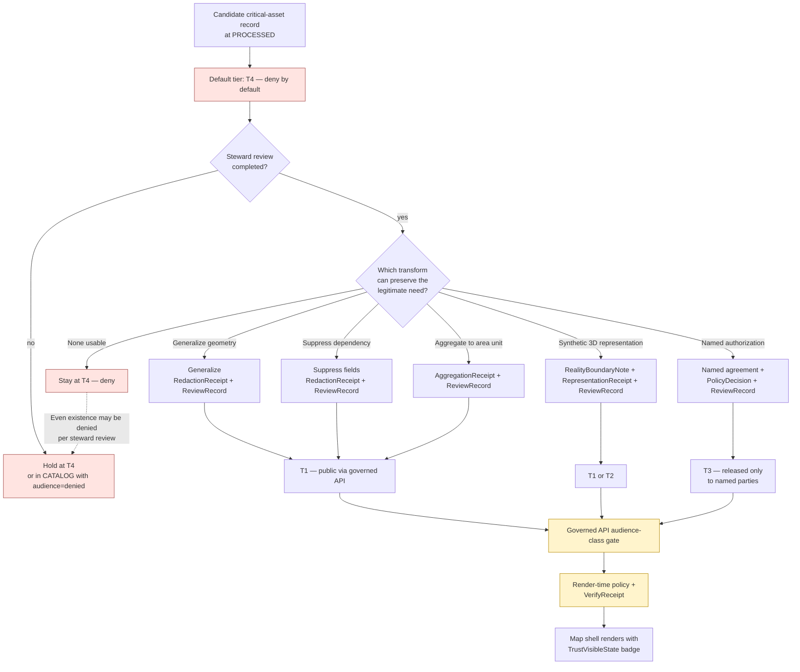

<!-- [KFM_META_BLOCK_V2]
doc_id: kfm://doc/architecture/critical-asset-exposure
title: Critical-Asset Exposure — Architectural Treatment
type: standard
version: v1
status: draft
owners: <TBD: docs steward + sensitivity/policy lead + infrastructure-domain steward + map/UI lead>
created: 2026-05-24
updated: 2026-05-24
policy_label: public
related: [
  docs/doctrine/trust-membrane.md,
  docs/doctrine/authority-ladder.md,
  docs/doctrine/truth-posture.md,
  docs/architecture/TRUST_MEMBRANE.md,
  docs/architecture/system-context.md,
  docs/architecture/governed-api.md,
  docs/architecture/map-shell.md,
  docs/architecture/maplibre-3d.md,
  docs/architecture/ui/CONTINUITY_NOTES.md,
  docs/standards/MAP_TRUST_STATES.md,
  docs/standards/EVIDENCE_BUNDLE.md,
  docs/standards/RELEASE_MANIFEST.md,
  docs/standards/SENSITIVITY_RUBRIC.md,
  docs/standards/REDACTION_DETERMINISM.md,
  docs/standards/DUO_PROFILE.md,
  policy/sensitivity/infrastructure/,
  policy/render/,
  contracts/v1/receipts/,
  schemas/contracts/v1/receipts/
]
tags: [kfm, architecture, critical-asset, infrastructure, sensitivity, t4, geoprivacy, redaction, generalization, adversary-mapping]
notes: [
  "Architectural treatment of how KFM handles exposure of critical assets — infrastructure detail, vulnerability information, archaeological sites, rare-species locations, and adjacent high-sensitivity asset classes.",
  "Defers to docs/doctrine/trust-membrane.md (what the membrane is) and docs/architecture/TRUST_MEMBRANE.md (how it's built); this doc is one narrow application of the sensitivity rubric.",
  "Surfaces a corpus tension between Atlas Domains §24.5.2 (critical infrastructure detail = T4) and kfm_unified_doctrine_synthesis.md §16 (critical assets = T2 summary) — see §14 item 1."
]
[/KFM_META_BLOCK_V2] -->

# Critical-Asset Exposure — Architectural Treatment

> The architecture of how KFM decides what to show, generalize, suppress, or deny when the data describes a **critical asset** — bridges, dams, power lines, water systems, hospitals, archaeological sites, rare-species locations, and the adjacent asset classes whose precise public exposure could enable real-world harm.

[](#)
[](#)
[](#)
[](#)
[](#)
[](#)

| Status | Owners | Last reviewed |
|---|---|---|
| **draft** | _TBD — docs steward + sensitivity/policy lead + infrastructure-domain steward + map/UI lead_ | 2026-05-24 |

---

> [!CAUTION]
> **This document is an architectural treatment, not a doctrine, not a contract, and not a policy.** Doctrine lives in `docs/doctrine/trust-membrane.md` and (PROPOSED) `docs/standards/SENSITIVITY_RUBRIC.md`. The OPA rules that mechanically deny are in `policy/sensitivity/infrastructure/`. The receipt object meanings are in `contracts/v1/receipts/`. This document explains the architecture — the components, transforms, decision flow, and cross-lane risks — that sit between those canonical homes. See §2.

---

## Quick jump

- [1. Purpose](#1-purpose)
- [2. Scope and repo fit](#2-scope-and-repo-fit)
- [3. Authority and standing](#3-authority-and-standing)
- [4. What KFM calls a critical asset](#4-what-kfm-calls-a-critical-asset)
- [5. The exposure decision flow](#5-the-exposure-decision-flow)
- [6. The four exposure outcomes](#6-the-four-exposure-outcomes)
- [7. The four transforms](#7-the-four-transforms)
- [8. The receipts that record each transform](#8-the-receipts-that-record-each-transform)
- [9. Cross-lane risks — the join hazards](#9-cross-lane-risks--the-join-hazards)
- [10. Hazards × Settlements — the canonical adversary case](#10-hazards--settlements--the-canonical-adversary-case)
- [11. Render-time enforcement](#11-render-time-enforcement)
- [12. Reality Boundary Notes in critical-asset 3D scenes](#12-reality-boundary-notes-in-critical-asset-3d-scenes)
- [13. Anti-patterns](#13-anti-patterns)
- [14. Tensions and known limits](#14-tensions-and-known-limits)
- [15. Open questions](#15-open-questions)
- [16. Related docs](#16-related-docs)
- [Appendix A — Asset-class × tier × transform matrix](#appendix-a--asset-class--tier--transform-matrix)
- [Appendix B — Worked example](#appendix-b--worked-example)

---

## 1. Purpose

CONFIRMED — Atlas Domains §24.9.2 names the failure mode in one row:

> *"Sensitive content released without redaction. `RedactionReceipt` missing; rights / sovereignty violation. DENY surface: Release queue; sensitivity reviewer."*

CONFIRMED — `kfm_unified_doctrine_synthesis.md` §17:

> *"Hazards × Settlements: Public exposure summary OK; **critical-asset precise locations DENY**. Failure mode: Adversary mapping."*

These two doctrinal lines, taken together, describe the structural concern this document is the architecture of. KFM ingests, normalizes, and publishes information about **infrastructure, archaeological sites, rare-species locations, sensitive cultural resources, and other critical-asset classes**. Some of that information is genuinely public; some of it is genuinely not; most of it is **dual-use** — useful to a city planner, a researcher, or a steward, and dangerous to an adversary, a looter, or someone who would exploit a precise location for harm.

The trust membrane's *what* (denial of raw / unreviewed / restricted state from becoming public) is doctrinal. Its *how* (the components, denial surfaces, foundations) is the subject of `docs/architecture/TRUST_MEMBRANE.md`. This document is the **architecture of one narrow but consequential application**: how KFM decides, mechanically, what is shown, what is generalized, what is suppressed, and what is denied when the data describes a critical asset.

The architectural choices documented here flow from one rule:

> **Default-deny for critical detail; release only the safest representation that still answers the legitimate question.**

The rest of this document is the structural elaboration of that one sentence.

[Back to top](#quick-jump)

---

## 2. Scope and repo fit

### 2.1 What this document is

| Aspect | Value | Label |
|---|---|---|
| Document class | KFM architecture explainer | CONFIRMED per Directory Rules §6.1 (`docs/architecture/`) |
| Proposed path | `docs/architecture/critical-asset-exposure.md` | PROPOSED; casing matches sibling architecture-folder convention |
| Sibling architecture docs | `system-context.md`, `governed-api.md`, `map-shell.md`, `maplibre-3d.md`, `contract-schema-policy-split.md`, `TRUST_MEMBRANE.md`, `ui/CONTINUITY_NOTES.md` | CONFIRMED per Directory Rules §6.1 (mounted-repo presence NEEDS VERIFICATION) |
| Primary doctrine anchors | `docs/doctrine/trust-membrane.md`; `kfm_unified_doctrine_synthesis.md` §15–§17, §19; Atlas §24.5.2, §24.5.3, §24.9.2 | CONFIRMED |
| Authority NOT held | Doctrine; the sensitivity-rubric vocabulary; OPA rules; object meaning; deployment topology | CONFIRMED |

### 2.2 What this document is NOT

| If the content is about… | …it lives at | …not here |
|---|---|---|
| The sensitivity-tier vocabulary itself (T0–T4) | `docs/standards/SENSITIVITY_RUBRIC.md` (PROPOSED, not yet authored) | this doc |
| `RedactionReceipt`, `AggregationReceipt`, `RepresentationReceipt`, `ReviewRecord`, `PolicyDecision` object meaning | `contracts/v1/receipts/` (PROPOSED home) | this doc |
| Their JSON Schemas | `schemas/contracts/v1/receipts/` (PROPOSED home) | this doc |
| OPA rules that gate critical-asset exposure | `policy/sensitivity/infrastructure/`, `policy/sensitivity/archaeology/`, `policy/sensitivity/fauna/`, `policy/sensitivity/flora/` (PROPOSED homes) | this doc |
| Geometry-transform code (generalization, suppression, fuzz/jitter) | `packages/geometry/` (PROPOSED home) | this doc |
| Render-time policy on cached tiles | `packages/maplibre-runtime/src/verifier/` (PROPOSED home); `policy/render/` | this doc |
| Per-domain critical-asset inventories | `data/source/`, `contracts/v1/domains/` | this doc |
| Per-deployment audience-class policies | `policy/api/` | this doc |
| Determinism of redaction transforms | `docs/standards/REDACTION_DETERMINISM.md` (PROPOSED, not yet authored) | this doc |
| Tests and fixtures | `tests/sensitivity/`, `fixtures/sensitivity/` | this doc |
| Per-domain runbooks | `docs/runbooks/sensitivity/` (PROPOSED home) | this doc |

What this document **does** own:

- The architectural definition of what KFM treats as a critical asset (§4).
- The exposure decision flow (§5).
- The four exposure outcomes (§6) and the four transforms (§7).
- The receipts each transform emits (§8).
- The cross-lane join-risk register (§9–§10).
- The render-time enforcement architecture for critical assets (§11).
- The Reality Boundary Note rule for 3D critical-asset scenes (§12).
- The anti-pattern register (§13).

[Back to top](#quick-jump)

---

## 3. Authority and standing

| Aspect | Value | Label |
|---|---|---|
| Document class | KFM architecture explainer | CONFIRMED per Directory Rules §6.1 |
| Canonical path | `docs/architecture/critical-asset-exposure.md` | PROPOSED |
| Primary doctrine anchor | `kfm_unified_doctrine_synthesis.md` §15 (T0–T4), §16 (per-domain matrix), §17 (cross-lane joins), §19 (negative states) | CONFIRMED |
| Atlas anchor | `KFM_Domains_v1_1_+_Pass23_Pass32_Consolidated_Atlas` §24.5.2 (per-domain tier defaults), §24.5.3 (tier transitions), §24.9.2 (trust-membrane anti-patterns) | CONFIRMED |
| Architecture companion | [`docs/architecture/TRUST_MEMBRANE.md`](./TRUST_MEMBRANE.md) | CONFIRMED authored (prior session) |
| Standards companion | [`docs/standards/MAP_TRUST_STATES.md`](../standards/MAP_TRUST_STATES.md), [`EVIDENCE_BUNDLE.md`](../standards/EVIDENCE_BUNDLE.md), [`RELEASE_MANIFEST.md`](../standards/RELEASE_MANIFEST.md), [`DUO_PROFILE.md`](../standards/DUO_PROFILE.md) | CONFIRMED authored (prior session) |
| MapLibre Category Q anchor | `Master_MapLibre_Components-Functions-Features` Category Q — Sensitive Geometry, Geoprivacy, Rights, and Policy | CONFIRMED |
| Authority NOT held | Doctrine, vocabulary, OPA code, contract Markdown, schemas, geometry-transform code, tests, deployment topology | CONFIRMED |

[Back to top](#quick-jump)

---

## 4. What KFM calls a critical asset

The term "critical asset" is used in the corpus across multiple domains, with similar but not identical meanings. This section enumerates the asset classes the architecture treats together — i.e., classes for which the **default-deny posture for precise detail** is doctrinally established.

CONFIRMED — drawn from Atlas Domains §24.5.2 per-domain tier defaults and `kfm_unified_doctrine_synthesis.md` §16.

| Asset class | Domain | Default tier (CONFIRMED) | Why "critical" |
|---|---|---|---|
| **Infrastructure Asset (critical)** | Settlements/Infrastructure | **T4** for critical detail; **T1** for generalized footprint | Dams, bridges, substations, water treatment, telecom backbones — adversary mapping risk; cascading-failure risk |
| **Infrastructure — condition / vulnerability** | Settlements/Infrastructure | **T4**; **T3** only to named authorities | Knowing *where* a critical asset is, is one thing; knowing *that it is weak* is another |
| **Critical asset dependency** | Settlements/Infrastructure | **T4** for precise dependency graphs | Adversary use of node-link knowledge for cascading attack |
| **Archaeological site location (precise)** | Archaeology | **T4**; T1 generalized only after steward review | Looting; sovereignty harm; cultural-resource destruction |
| **Human remains / sacred sites** | Archaeology | **T4 forever** for public; T3 only under explicit named authorization | Sovereignty; cultural harm; legal protection under NAGPRA-class regimes |
| **Sensitive fauna occurrence** | Fauna | **T4**; T1 only via geoprivacy generalization | Poaching; nest disturbance; commercial collection |
| **Rare or culturally sensitive plant location** | Flora | **T4**; T1 only via generalization + steward review | Wild harvest pressure; cultural sovereignty |
| **Sensitive 3D scene content** | Planetary/3D | **T4**; T1/T2 only with `RealityBoundaryNote` + `RepresentationReceipt` | A 3D reconstruction of a sensitive asset re-encodes the same precision the 2D denial existed to protect |
| **Living-person × parcel join** | People × Settlements/Land | **T4** | Privacy, identity exposure |
| **Critical infrastructure × Hazards exposure join** | Settlements × Hazards | **DENY** at the join level | Adversary mapping (§10) |

The asset classes above share architectural treatment even when their underlying domains differ. **Critical asset** in this document means *any asset class whose default-deny tier is T4 due to harm potential* — not just the literal "Infrastructure Asset (critical)" object family.

> [!NOTE]
> A "critical asset" in this architectural sense is defined by **the doctrine's default tier and the harm it protects against**, not by the asset's importance to the operator. A historical settlement marker can be culturally critical without being a critical asset in this sense; a power substation is one whether or not anyone considers it culturally important.

[Back to top](#quick-jump)

---

## 5. The exposure decision flow

PROPOSED architectural composition. The flow combines doctrinal inputs (default tier, audience class, evidence and policy state) into a finite outcome at the outer mouth of the trust membrane (per `docs/architecture/TRUST_MEMBRANE.md` §5.4).



PROPOSED — diagram composes Atlas §24.5.3 tier transitions with the trust-membrane denial surfaces from `docs/architecture/TRUST_MEMBRANE.md` §6. Tooling and route names NEED VERIFICATION.

### 5.1 What the diagram is **not** showing

The diagram intentionally omits:

- **Audience-class projection** (`public` / `partner` / `steward` / `internal` / `denied`). Audience-class gating sits at every `API_GATE` step; a T1 record may render differently to a `public` audience vs a `steward` audience. See `docs/architecture/TRUST_MEMBRANE.md` §9.
- **Consent state** for consent-bearing critical assets (e.g., archaeological records contributed under specific consent). Consent gates run alongside sensitivity gates; see `docs/standards/DUO_PROFILE.md`.
- **Per-domain steward chains.** The diagram says "Steward review"; the actual reviewer matrix is per-domain (archaeology stewards, infrastructure stewards, fauna stewards, etc.) and is governed by separation-of-duties policy (Atlas §24.9.3).

[Back to top](#quick-jump)

---

## 6. The four exposure outcomes

For critical-asset content, **T0 is structurally unavailable** — a critical asset by definition is not public-safe without transformation. The four outcomes that **are** available correspond to T1, T2, T3, and T4.

CONFIRMED — `kfm_unified_doctrine_synthesis.md` §15 tier table.

| Outcome | Tier | What gets published | Required transforms / authorizations |
|---|---|---|---|
| **Generalized public release** | T1 | Generalized footprint; suppressed dependency; aggregated unit | `RedactionReceipt` + `ReviewRecord` + `PolicyDecision` |
| **Steward-only release** | T2 | Higher detail to authenticated stewards/reviewers; public sees T1 or denial | `PolicyDecision` + `ReviewRecord` |
| **Named-authority release** | T3 | Full detail (incl. condition/vulnerability) to named, recorded parties | Named agreement + `PolicyDecision` + `ReviewRecord` |
| **Denied** | T4 | Nothing — existence may be denied per steward review | None (the absence is the answer) |

> [!IMPORTANT]
> **T0 is unavailable for critical assets by doctrine, not by accident.** The exposure decision (§5) never produces a T0 outcome from a T4 input without a redaction transform — and the transform produces T1, not T0.

### 6.1 What "denied" actually means at the surface

CONFIRMED — `MAP_TRUST_STATES.md` §4 and §10 (anti-patterns).

A denied critical-asset request returns a chip — *"Restricted — not publicly available"* — at the map shell, popup, Drawer, and AI panel. It does **not** return a blank tile. For the highest-sensitivity classes (e.g., human remains, sacred sites), per `MAP_TRUST_STATES.md` §12 item 6 (denial-leakage open question), the chip may say *"unavailable"* rather than *"denied"* so that the existence of the record is not itself disclosed.

[Back to top](#quick-jump)

---

## 7. The four transforms

CONFIRMED — Atlas §24.5.3 *Allowed transforms* and per-domain transforms in `kfm_unified_doctrine_synthesis.md` §16. KFM uses **four** canonical transforms to demote a critical-asset record from T4 to a public-releasable tier.

| Transform | What it does | Example | Receipt |
|---|---|---|---|
| **Generalization** | Replaces precise geometry with a coarser proxy (county, watershed, H3 cell, fuzzed buffer) | Precise dam location → county; precise nest → watershed | `RedactionReceipt` (geometry_transform field) |
| **Suppression** | Removes specific fields while preserving others | Drop `condition_score` and `dependency_graph`; keep `facility_type`, `service_area` | `RedactionReceipt` (removed_fields, kept_fields) |
| **Aggregation** | Replaces per-asset records with area-unit summaries | Per-substation outage records → county-decade summary | `AggregationReceipt` |
| **Synthetic representation** | Replaces direct evidence with a clearly-marked reconstruction or synthetic surface | 3D scene of a fortified site rebuilt from generalized surface; not a re-publication of the precise model | `RepresentationReceipt` + `RealityBoundaryNote` |

### 7.1 Composition rules

PROPOSED. Transforms compose, with constraints:

1. **Generalization + suppression** is the most common composition (e.g., generalized footprint with dependency fields suppressed). Both receipts are emitted; the resulting record is T1.
2. **Aggregation + suppression** combines per-asset records into area units while also dropping condition fields. Both receipts.
3. **Synthetic representation never composes with raw evidence in the same artifact.** A `RepresentationReceipt` artifact is its own thing; mixing reconstruction with precise observation in one layer collapses the boundary the `RealityBoundaryNote` exists to maintain (§12).
4. **Deterministic transforms preferred.** When a generalization or fuzz is applied, the function should be deterministic on the input so that re-running the pipeline produces byte-identical output (see `REDACTION_DETERMINISM.md`, PROPOSED, not yet authored). Non-deterministic jitter is permitted only when randomness itself is the protection — and even then, the seed and parameters are recorded.

### 7.2 What transforms cannot do

Transforms cannot:

- Turn a T4 record into T0. The result of a redaction transform is at best T1.
- Reverse without correction. Once a T1 derivative ships, demoting it back to T4 requires a `CorrectionNotice` and may require a tombstone if the derivative cached (`RELEASE_MANIFEST.md` §10).
- Substitute for steward review. The receipt records the transform; the review records the human judgment that the transform is adequate for this asset class.

[Back to top](#quick-jump)

---

## 8. The receipts that record each transform

CONFIRMED — Atlas object-family table; `kfm_unified_doctrine_synthesis.md` §24.1 receipt list.

| Receipt | Records | Required content (CONFIRMED Atlas) |
|---|---|---|
| `RedactionReceipt` | A redaction or generalization step on a sensitive object | `policy_ref`, `redaction_method`, `kept_fields`, `removed_fields`, `geometry_transform`, `reviewer` |
| `AggregationReceipt` | An aggregation step (county-year roll-up, watershed total, decadal mean) | `geometry_scope`, `time_scope`, `aggregation_method`, `input_source_refs`, `suppression_rule`, `output_unit` |
| `RepresentationReceipt` | A representation step where surface fidelity differs from evidence fidelity (3D scene from 2D evidence, synthetic terrain) | `evidence_ref`, `representation_method`, `parameters`, `reality_boundary_note_ref` |
| `RealityBoundaryNote` | The public-facing or steward-facing statement that a carrier is synthetic or reconstructed and not direct evidence | `scope`, `method_summary`, `evidence_refs[]`, `visibility` |
| `ReviewRecord` | A steward, rights-holder, or policy reviewer's decision on a candidate transition | `reviewer`, `role`, `decision`, `evidence_refs[]`, `policy_ref`, `time` |
| `PolicyDecision` | The OPA-level rule evaluation that allowed or denied the transform | `policy_id`, `target_object`, `decision`, `reason_code`, `time`, `evidence_refs[]` |

### 8.1 The receipt chain for a typical critical-asset transform

PROPOSED — chain composition NEEDS VERIFICATION against `contracts/v1/receipts/`.

```text
SourceDescriptor (T4-tier source) 
  → RunReceipt (transform execution)
    → RedactionReceipt (geometry generalized, dependency suppressed)
      → ReviewRecord (infrastructure steward ALLOW)
        → PolicyDecision (policy.sensitivity.infrastructure ALLOW)
          → EvidenceBundle (T1 derivative)
            → PromotionDecision (release into PUBLISHED)
              → ReleaseManifest (entry referencing the T1 derivative)
                → governed API → public surface (T1 layer with TrustVisibleState=verified)
```

Every step in the chain is **content-addressed** and **resolvable from the public artifact** by EvidenceRef → EvidenceBundle resolution. A reviewer or auditor reading the public-facing T1 derivative can walk the chain back to the T4 source through governed APIs without ever directly accessing the T4 data.

[Back to top](#quick-jump)

---

## 9. Cross-lane risks — the join hazards

CONFIRMED — `kfm_unified_doctrine_synthesis.md` §17 *Cross-lane relations and source-role anti-collapse*. The most powerful KFM views come from joins across domains; so do the most dangerous **source-role collisions** that re-expose what each side individually suppressed.

| Join | What re-exposes the critical asset | Mitigation |
|---|---|---|
| **Hazards × Settlements** | Critical-asset precise location implied by hazard impact area. See §10. | DENY at the precise-location join; publish only "public exposure summary." |
| **Roads/Rail × Archaeology** | Site coordinates inferred from corridor inflection or survey route. | Historical corridor may publish; site coordinates do not. |
| **People × Land** | Living-person identifier joined to parcel re-exposes residence. | Deceased historical assertions at T1; living-person × parcel deny. |
| **Soil × Agriculture** | Aggregation re-exposes per-operator yield through narrow cell counts. | No farm/operator × parcel × yield join for public release. |
| **Hydrology × Fauna (aquatic species)** | Generalized species range polygon plus stream geometry implies occurrence. | Species sensitivity sets the join tier; HUC may stay T0 only if no occurrence join is published. |
| **Atmosphere × Hazards** | Source-role anti-collapse: observed/modeled/regulatory/aggregate must remain distinct. | Source-role anti-collapse rule (Atlas §24.9.3). |
| **Planetary/3D × Infrastructure** | A 3D scene reconstructs a critical-asset facility in detail visible at zoom. | `RealityBoundaryNote` + scene admission gate; sensitive geometry not eligible for high-fidelity 3D. |
| **Frontier-matrix × all** | A flattened "frontier score" treated as one number obscures the source-role distinction. | Named definition + uncertainty + source-role preservation per cell. |

> [!WARNING]
> **Source-role collapse is the most common silent failure** (`unified-doctrine §17`). A modeled value cited as an observation, an aggregate cited as a per-place observation, a synthetic surface presented as reality — these are doctrine violations even when the underlying data are correct. The cross-lane join is where the collapse most often happens.

### 9.1 The join-evaluation architecture

PROPOSED. A cross-lane join that involves a critical-asset class on **either** side must:

1. Evaluate each side's `EvidenceBundle` independently.
2. Compute the **most-restrictive applicable tier** across the join.
3. Resolve the join only if the most-restrictive tier permits the requested audience class.
4. Emit a `PolicyDecision` recording the join evaluation, even when ALLOW — the audit trail records that the join was considered, not just executed.
5. Treat the joined output as a **new derivative** with its own EvidenceBundle and its own receipts; the join is not a free composition.

The most-restrictive rule is identical to the trust-state precedence rule in `MAP_TRUST_STATES.md` §6.2: doubt always demotes, never promotes.

[Back to top](#quick-jump)

---

## 10. Hazards × Settlements — the canonical adversary case

CONFIRMED — `kfm_unified_doctrine_synthesis.md` §17:

> *"Hazards × Settlements: Public exposure summary OK; critical-asset precise locations DENY. Failure mode: Adversary mapping."*

This is the load-bearing example. KFM has rich, legitimate uses for hazards × settlements joins — flood exposure for emergency planning, drought impact on water utilities, severe-weather risk for transportation networks. It also has a doctrinal default-deny on **precise critical-asset coordinates** in any such join, because the same join that helps a planner identify mitigation priorities can help an adversary identify single-point-of-failure targets.

### 10.1 What is and is not published

| Question a user might ask | Architecturally permitted? | What gets returned |
|---|---|---|
| *"What is the flood exposure of the county's water utilities?"* | **Yes** | County-level summary; counts; aggregate impact estimates; no precise facility coordinates |
| *"Which dams in this watershed are within the 100-year floodplain?"* | **Conditional** | If the dam population is generalized (e.g., "three of seven facilities"), yes. If it would identify specific facilities, no. |
| *"Where exactly is the substation that serves this hospital, and what is its condition rating?"* | **No** | T4 + T4 join; the question itself is denied. Hospital may be T1 generalized; substation location + condition is T4. |
| *"Show me a map of every critical bridge in Kansas with its load rating and vulnerability assessment."* | **No** | Quintessential adversary-mapping query; T4 across the board. |
| *"What is the historical record of dam failures in Kansas?"* | **Yes** | Historical (T0) hazard events; named facilities only where already a matter of public record. |

### 10.2 The architectural enforcement

PROPOSED — implementation NEEDS VERIFICATION.

The Hazards × Settlements join is gated at three points, any of which fails closed independently:

1. **At the lifecycle plane (CATALOG):** The join projection that combines `HazardEvent` × `InfrastructureAsset` carries the most-restrictive tier label. If either side is T4, the projection is T4. The CATALOG record may exist; its `audience_class` is `denied` for `public`.
2. **At the promotion gate (the inner mouth):** No `PromotionDecision` admits a T4 projection to PUBLISHED without a transform receipt demoting it to T1 or lower.
3. **At the governed API (the outer mouth):** Audience-class projection refuses to serve T2/T3/T4 projections to a `public` caller; AI surfaces refuse to answer queries that would reconstruct the T4 join from public derivatives.

The render-time AI rule (`kfm_unified_doctrine_synthesis.md` §20) is the third line: even if a query is phrased to *infer* a critical-asset location from public-tier derivatives, the AI must ABSTAIN — its citation-validity check fails when the inference target is itself denied.

> [!CAUTION]
> **AI inference is a covert adversary-mapping path.** An adversary need not request the precise coordinates if the AI can be coaxed into stitching them together from public-safe derivatives. The §6 denial surface 5 (governed AI runtime) in `docs/architecture/TRUST_MEMBRANE.md` exists for exactly this reason.

[Back to top](#quick-jump)

---

## 11. Render-time enforcement

CONFIRMED — KFM-P1-FEAT-0042 (viewer-side verification fails closed); ML-058-034 (render-time consent verification); `kfm_unified_doctrine_synthesis.md` §20 (AI boundary).

The trust membrane gates at promotion; render-time enforcement is the second line. Per `docs/architecture/TRUST_MEMBRANE.md` §6 denial surface 4, the render-time verifier is the component that refuses tiles or features whose signatures, sidecars, hashes, or `ReleaseManifest` cannot be verified. For critical-asset exposure, that surface also:

| Render-time check | What it refuses |
|---|---|
| Audience-class re-check | A tile fetched by a session that is not the audience class the tile was released for |
| Consent freshness | A tile bearing consent-revoked critical-asset data (e.g., archaeological record with revoked steward consent) |
| Sensitivity re-check | A tile whose `release_state` is `withdrawn` due to sensitivity reclassification |
| Reality-boundary chip | A 3D scene of a critical asset that lacks an attached `RealityBoundaryNote` reference |
| Generalization-floor check | A tile whose geometry resolution at the current zoom would exceed the policy's published-resolution floor for the asset class |

The generalization-floor check is the architectural defense against a subtle failure mode: a layer that publishes generalized geometry at low zoom may, at high zoom, render at a precision that defeats the generalization. The render-time verifier holds the floor.

> [!IMPORTANT]
> A T1 derivative is not architecturally safer than its `RedactionReceipt` guarantees. The render-time verifier exists to enforce the receipt's claims at the pixel: if the receipt says "generalized to county," the renderer enforces that no zoom level reveals sub-county detail of the critical-asset geometry — by clipping, snapping to the generalized geometry, or refusing the tile.

[Back to top](#quick-jump)

---

## 12. Reality Boundary Notes in critical-asset 3D scenes

CONFIRMED — Atlas Planetary/3D object family; ML-057 / ML-059 series:

> *"Each scene carries a `RealityBoundaryNote`; synthetic is never observed."*

3D scenes are an exposure architecture all their own. A 3D reconstruction of a critical-asset facility, even when based on generalized 2D evidence, can re-encode information about the asset that the 2D generalization existed to suppress. The doctrinal answer is:

1. **Sensitive 3D scene content defaults to T4** (Atlas §24.5.2). A 3D scene of a critical asset is denied unless steward review + `RepresentationReceipt` + `RealityBoundaryNote` are present.
2. **Every released 3D scene carries a `RealityBoundaryNote`** that names the scope (what part is synthetic), the method summary, the upstream evidence refs, and the visibility (public-facing vs steward-only).
3. **Synthetic surfaces are never labeled "observed."** A 3D reconstruction is a representation; the doctrine refuses any framing that lets a synthetic surface read as direct evidence.
4. **The chip is mandatory at the surface.** Per `MAP_TRUST_STATES.md` §7.3, the `RealityBoundaryNote` chip renders alongside the trust-state badge; one is not a substitute for the other.

### 12.1 Architectural composition

```text
3D scene of a critical asset
  ↓ requires
RepresentationReceipt (the method record)
  ↓ requires
RealityBoundaryNote (the public-facing chip and steward-facing scope statement)
  ↓ requires
EvidenceBundle (the upstream T1 generalized 2D evidence the scene was built from)
  ↓ requires
RedactionReceipt (the upstream redaction that demoted the source from T4 to T1)
```

A 3D scene that is missing any link in this chain fails closed at the scene admission gate (`docs/architecture/TRUST_MEMBRANE.md` §6 denial surface — extended for 3D admission).

[Back to top](#quick-jump)

---

## 13. Anti-patterns

CONFIRMED — Atlas §24.9.2 *Trust-membrane anti-patterns* (rows directly relevant to critical-asset exposure are reproduced and extended).

| Anti-pattern | What goes wrong | DENY surface |
|---|---|---|
| **Sensitive content released without redaction** | `RedactionReceipt` missing; rights / sovereignty violation. | Release queue; sensitivity reviewer. |
| **Critical-asset precise location published in a Hazards × Settlements join** | Adversary mapping. | Promotion gate (CATALOG → PUBLISHED); governed API (outer mouth). |
| **AI infers a critical-asset location from public-tier derivatives** | Covert adversary-mapping path; cite-or-abstain broken. | Governed AI runtime; `AIReceipt` evaluator. |
| **3D scene of a critical asset rendered without `RealityBoundaryNote`** | Reconstruction read as observation; doctrinal §12 violation. | Scene admission gate; representation-receipt validator. |
| **Generalization defeated at high zoom** | Published layer reveals sub-county detail of the asset at zoom 17 because the renderer does not enforce the resolution floor. | Render-time verifier; generalization-floor check (§11). |
| **T4 demoted to T0** (rather than T1) | Tier transition rule violated; redaction transforms produce T1, not T0. | Promotion gate. |
| **Source-role collapse on join** | Modeled value cited as observation; aggregate as per-place observation; synthetic as reality. | Validator; Focus Mode citation evaluator. |
| **Critical-asset dependency graph published** | The dependency structure is itself sensitive even when individual assets are public. | Promotion gate; `policy/sensitivity/infrastructure/`. |
| **Critical-asset condition/vulnerability released to public tier** | Atlas §24.5.2: T3 only to named authorities; never T0/T1. | Promotion gate; named-party agreement check. |
| **Cached withdrawn critical-asset tile continues to render** | Cache invalidation incomplete; withdrawn content survives the invalidation window. | Render-time verifier; cache-invalidation contract (C6-08). |
| **Steward review skipped on transform** | Transform receipt exists but `ReviewRecord` is missing; the receipt records the *what* without the human judgment. | Promotion gate; review-record validator. |
| **"Show me all critical bridges" type query allowed via AI** | Quintessential adversary-mapping query passed through. | Governed AI runtime; query-class denylist. |
| **Existence of T4 record disclosed by denial chip** | Chip says "denied" rather than "unavailable"; the existence is itself the leak. | Render-time chip selection; per-tier chip policy. |
| **Per-domain critical-asset list maintained ad hoc, not in policy** | The asset list is part of doctrine, not configuration; ad hoc maintenance loses the audit chain. | `policy/sensitivity/infrastructure/`. |

> [!IMPORTANT]
> The Atlas §24.9.2 anti-patterns table is **authoritative**. This document does not extend its doctrinal force; it preserves the relevant rows and adds critical-asset-specific entries in the same style. New anti-patterns observed in practice go into the Atlas (or a successor doctrine doc), not into this file.

[Back to top](#quick-jump)

---

## 14. Tensions and known limits

| # | Tension | Source | KFM posture |
|---|---|---|---|
| 1 | **Corpus-internal tier conflict** on Settlements/Infrastructure critical assets. Atlas §24.5.2 lists *"Infrastructure Asset (critical): T4 default for critical detail; T1 for generalized footprint."* `kfm_unified_doctrine_synthesis.md` §16 lists *"Settlements/Infrastructure — critical assets: **T2** (public summary only; precise locations deny)."* | Atlas §24.5.2 vs unified-doctrine §16 | Surfaced rather than smoothed. PROPOSED reconciliation: **T4 default for critical detail, T2 for public summary, T1 for generalized footprint.** The three tiers describe three different objects (detail vs summary vs footprint), not the same object. ADR resolution NEEDED — §15 item 1. |
| 2 | Generalization as a transform is most effective when the asset class is dense (many assets, large area). Sparse asset classes (e.g., few large dams in a watershed) are harder to generalize without re-identification. | §7 | Per-asset-class generalization parameters; the receipt records the parameters; steward review confirms adequacy. PROPOSED — needs per-class guidance in `policy/sensitivity/infrastructure/`. |
| 3 | The render-time generalization-floor check (§11) costs a per-zoom evaluation. | §11 | Performance cost is the price of the floor; bypass is not an option. Per-asset-class budgets in `policy/render/`. |
| 4 | Cross-lane join evaluation (§9) requires computing the most-restrictive tier across both sides; this is expensive at query time. | §9 | Pre-compute the join's tier at CATALOG time and store on the projection; query-time check is a single lookup, not a recomputation. PROPOSED. |
| 5 | The "show me all critical bridges" query class is not always overt; an adversary may phrase it as a planning question. | §10, §13 | Query intent is not the gate; tier and audience-class are. AI ABSTAIN is the safe failure mode regardless of phrasing. |
| 6 | 3D reconstructions of sensitive sites may be required for cultural-heritage stewardship or research, where the steward and the public's safe-need diverge. | §12 | Steward-only T2 release is the architectural answer; the same scene may be T4 for `public` and T2 for `steward`. |
| 7 | Some critical assets are legitimately a matter of public record (named in news, plaques, government inventories) and cannot be "denied" coherently. | §6.1, §13 | Public-record status is part of the source role; the doctrine does not deny what is already public. The denial chip is not used for already-public content; the architecture is bounded by what is genuinely sensitive. |
| 8 | The denial-leakage problem (§6.1) — knowing that a denial exists for a feature can itself be sensitive. | `MAP_TRUST_STATES.md` §12 item 6 | Per-tier chip policy: T4 denial chip says "unavailable"; T3 denial chip may say "restricted to named parties"; T2 denial says "available to authenticated reviewers." Implementation NEEDED. |
| 9 | The list of asset classes in §4 is partial; new asset classes may emerge as KFM expands. | §4 | The list is doctrinal, not configurational. Adding to it requires steward + governance review, not just data ingestion. |
| 10 | Air-gapped or partial-network deployments cannot reach external transparency logs in real time; signature checks degrade. | `docs/architecture/TRUST_MEMBRANE.md` §13 | The default-deny posture for critical assets means the safe failure mode is *more* denial, not less. A degraded signature path may downgrade a T1 critical-asset layer to `unknown` per `MAP_TRUST_STATES.md` §4, not silently render. |
| 11 | Determinism of redaction transforms is required for reproducibility but conflicts with the case where randomness *is* the protection. | §7.1 | `REDACTION_DETERMINISM.md` (PROPOSED) governs the determinism policy; seeded randomness is the documented compromise. |

[Back to top](#quick-jump)

---

## 15. Open questions

UNKNOWN / NEEDS VERIFICATION items, tracked here until resolved by ADR or mounted-repo evidence.

1. **Critical-infrastructure tier reconciliation** (§14 item 1) — Atlas §24.5.2 says T4 default for detail / T1 for footprint; unified-doctrine §16 says T2 summary. PROPOSED resolution treats these as three distinct objects (detail / summary / footprint) at three distinct tiers; ADR confirmation NEEDED.
2. **`SENSITIVITY_RUBRIC.md`** authoring (PROPOSED in `docs/standards/`) — this document defers to it for vocabulary; until it exists, the tier definitions reference unified-doctrine §15 directly.
3. **`REDACTION_DETERMINISM.md`** authoring (PROPOSED in `docs/standards/`) — same shape; this document references the determinism rule §7.1 in advance of its publication.
4. **Per-asset-class generalization parameters** — generalization-distance defaults per asset class; documented in `policy/sensitivity/infrastructure/`, `policy/sensitivity/archaeology/`, `policy/sensitivity/fauna/`, etc.
5. **Generalization-floor enforcement at render time** — implementation in `packages/maplibre-runtime/src/verifier/`. PROPOSED; NEEDS VERIFICATION.
6. **Per-tier denial-chip copy** — T2 / T3 / T4 chip text policy (§14 item 8). NEEDS DECISION.
7. **Pre-computed join tiers vs query-time evaluation** — performance/correctness trade-off (§14 item 4). PROPOSED pre-compute; NEEDS DECISION.
8. **AI query-class denylist** — the catalogue of query shapes that trigger automatic ABSTAIN even before evidence resolution (e.g., "show me all critical bridges"). PROPOSED in §13; NEEDS curation.
9. **3D scene admission gate path** — where in the promotion pipeline 3D scenes are gated. PROPOSED placeholder in §12; NEEDS placement in `docs/architecture/`.
10. **Steward chain per asset class** — the reviewer matrix (which steward(s) sign off on which asset class's transforms). PROPOSED per-domain; ADR / Directory Rules update NEEDED.
11. **Named-party agreement registry** — where T3 named-party authorizations are recorded. PROPOSED in `release/named-parties/`; NEEDS VERIFICATION.
12. **Public-record exception protocol** — when an asset is already a matter of public record (§14 item 7), the architecture does not generate a denial chip; the architecture for *deciding* whether something is "already public" is itself a steward-review process.
13. **Cross-deployment portability** — whether a T1 layer released in one deployment can be re-served by a partner deployment whose own policy may differ. PROPOSED no (each deployment makes its own release decisions); NEEDS DECISION.
14. **Withdrawal propagation for critical assets** — given the asymmetric harm of a delayed withdrawal vs a delayed publication, withdrawal cache-invalidation budgets may be tighter for critical-asset layers. PROPOSED yes; NEEDS DECISION.

[Back to top](#quick-jump)

---

## 16. Related docs

PROPOSED links — verify all paths against mounted repo before publishing.

### Doctrine

- [`docs/doctrine/trust-membrane.md`](../doctrine/trust-membrane.md) — the doctrine this document is a narrow application of.
- [`docs/doctrine/authority-ladder.md`](../doctrine/authority-ladder.md) — anchors the audience-class facet.
- [`docs/doctrine/truth-posture.md`](../doctrine/truth-posture.md) — anchors cite-or-abstain.

### Sibling architecture

- [`docs/architecture/TRUST_MEMBRANE.md`](./TRUST_MEMBRANE.md) — how the trust membrane is constructed; this document is one application of it.
- [`docs/architecture/system-context.md`](./system-context.md) — _PROPOSED placement._
- [`docs/architecture/governed-api.md`](./governed-api.md) — _PROPOSED placement._
- [`docs/architecture/map-shell.md`](./map-shell.md) — _PROPOSED placement._
- [`docs/architecture/maplibre-3d.md`](./maplibre-3d.md) — anchors the 3D scene admission gate (§12).
- [`docs/architecture/ui/CONTINUITY_NOTES.md`](./ui/CONTINUITY_NOTES.md) — UI continuity assumes the trust state from this document.
- [`docs/architecture/contract-schema-policy-split.md`](./contract-schema-policy-split.md) — the rule that keeps this document out of `contracts/`, `schemas/`, and `policy/`.

### Standards

- [`docs/standards/MAP_TRUST_STATES.md`](../standards/MAP_TRUST_STATES.md) — `TrustVisibleState` vocabulary used at the chip (§6.1, §11, §13).
- [`docs/standards/EVIDENCE_BUNDLE.md`](../standards/EVIDENCE_BUNDLE.md) — bundle the receipt chain composes into.
- [`docs/standards/RELEASE_MANIFEST.md`](../standards/RELEASE_MANIFEST.md) — release-side handling; withdrawal propagation (§14 item 14).
- [`docs/standards/PROV/README.md`](../standards/PROV/README.md) — provenance threading.
- [`docs/standards/DUO_PROFILE.md`](../standards/DUO_PROFILE.md) — consent gates for consent-bearing critical-asset content.
- [`docs/standards/SENSITIVITY_RUBRIC.md`](../standards/SENSITIVITY_RUBRIC.md) — _PROPOSED, not yet authored._ Tier vocabulary.
- [`docs/standards/REDACTION_DETERMINISM.md`](../standards/REDACTION_DETERMINISM.md) — _PROPOSED, not yet authored._ Determinism rule for redaction transforms.

### Implementation homes

- [`contracts/v1/receipts/`](../../contracts/v1/receipts/) — object meaning for `RedactionReceipt`, `AggregationReceipt`, `RepresentationReceipt`, `RealityBoundaryNote`, `ReviewRecord`, `PolicyDecision`.
- [`schemas/contracts/v1/receipts/`](../../schemas/contracts/v1/receipts/) — machine shape.
- [`policy/sensitivity/infrastructure/`](../../policy/sensitivity/infrastructure/) — _PROPOSED home._
- [`policy/sensitivity/archaeology/`](../../policy/sensitivity/archaeology/) — _PROPOSED home._
- [`policy/sensitivity/fauna/`](../../policy/sensitivity/fauna/) — _PROPOSED home._
- [`policy/sensitivity/flora/`](../../policy/sensitivity/flora/) — _PROPOSED home._
- [`policy/render/`](../../policy/render/) — render-time enforcement.
- [`packages/geometry/`](../../packages/geometry/) — generalization, suppression, fuzz/jitter transforms.
- [`packages/maplibre-runtime/src/verifier/`](../../packages/maplibre-runtime/src/verifier/) — render-time generalization-floor check.

### Tests / runbooks

- [`tests/sensitivity/`](../../tests/sensitivity/) — positive/negative fixtures for each anti-pattern.
- [`fixtures/sensitivity/`](../../fixtures/sensitivity/) — input fixtures.
- [`docs/runbooks/sensitivity/`](../runbooks/sensitivity/) — _PROPOSED home._ Steward how-to for redaction reviews.

[Back to top](#quick-jump)

---

<details>
<summary><strong>Appendix A — Asset-class × tier × transform matrix</strong></summary>

PROPOSED consolidated matrix — synthesizing Atlas §24.5.2, unified-doctrine §16, and the asset-class enumeration in §4 of this document. Every row NEEDS VERIFICATION against `policy/sensitivity/<domain>/`.

| Asset class | Default tier | T4 → T1 transform | T4 → T2 transform | T4 → T3 transform | Receipts required |
|---|---|---|---|---|---|
| Critical infrastructure — detail | **T4** | Generalized footprint + suppressed dependency | Steward review (no transform needed) | Named authorization | `RedactionReceipt` + `ReviewRecord` + `PolicyDecision` |
| Critical infrastructure — condition / vulnerability | **T4** | — (no public release) | — (steward-only release exists but is rare) | Named authorization | `ReviewRecord` + named-party agreement |
| Critical infrastructure — dependency graph | **T4** | Suppressed dependency (publish only the node set, not the edges) | Steward review | Named authorization | `RedactionReceipt` (suppression) + `ReviewRecord` |
| Archaeological site location (precise) | **T4** | Generalized geometry to coarse cell + steward review | Steward review | Named authorization | `RedactionReceipt` + `ReviewRecord` |
| Human remains / sacred sites | **T4 forever** | — (doctrine forbids) | — | Named authorization with sovereignty review | Sovereignty `ReviewRecord` + `PolicyDecision` |
| Sensitive fauna occurrence | **T4** | Geoprivacy generalization to watershed | Steward review | Research-collaborator agreement | `RedactionReceipt` + `ReviewRecord` |
| Rare / culturally sensitive plant location | **T4** | Generalization + steward review | Steward review | Research-collaborator agreement | `RedactionReceipt` + `ReviewRecord` |
| 3D scene of a critical asset | **T4** | Synthetic representation with `RealityBoundaryNote` + generalized 2D source | Steward review | Named authorization | `RepresentationReceipt` + `RealityBoundaryNote` + `ReviewRecord` + `RedactionReceipt` (upstream) |
| Living-person × parcel join | **T4** | — (doctrine forbids public release) | — | — | — |
| Critical infrastructure × Hazards exposure join | **T4 / DENY at precise location** | Aggregated to county-level public-exposure summary | Steward review | — | `AggregationReceipt` + `ReviewRecord` |

</details>

<details>
<summary><strong>Appendix B — Worked example</strong></summary>

A county-government planning question: *"What is the flood-exposure profile of the water-utility infrastructure in this county?"*

**Input data (internal, behind the membrane):**

| Object | Domain | Tier | Notes |
|---|---|---|---|
| `InfrastructureAsset` records for each water-utility facility | Settlements/Infrastructure | **T4** | Precise location + condition rating + dependency graph |
| `HazardEvent` records for historical floods | Hazards | T0 | Historical hazard data is public |
| `100-year floodplain polygon` | Hydrology | T0 | NFHL regulatory layer |

**The naïve join (DENY):**

A naïve `InfrastructureAsset × HazardEvent × Floodplain` join would produce a per-facility flood-exposure record with precise location and condition rating. This is **denied** — it is the §10 canonical adversary-mapping case.

**The architectural answer (T1 release):**

The pipeline produces a transformed projection:

```text
InfrastructureAsset (T4)
  ↓ RedactionReceipt: generalize geometry to county; suppress condition rating
    ↓ AggregationReceipt: count assets per county per exposure category
      ↓ EvidenceBundle (T1): { county, facility_count_by_exposure_category, methodology_ref }
        ↓ ReviewRecord: infrastructure steward ALLOW
          ↓ PolicyDecision: policy.sensitivity.infrastructure ALLOW
            ↓ PromotionDecision: release into PUBLISHED
              ↓ ReleaseManifest entry
                ↓ Governed API audience-class projection: public
                  ↓ Map shell renders T1 layer: 
                       "12 water-utility facilities in this county;
                        4 within 100-year floodplain; 8 outside."
```

**What the planner sees:**

- A county-level layer with the aggregate counts.
- A chip indicating the data is aggregated (the `AggregationReceipt` is visible in the Evidence Drawer).
- A trust-state badge: `verified`.
- A footer reference to the methodology document.
- **No precise facility locations.**
- **No condition ratings.**

**What a researcher with steward access sees:**

- Same layer at the public tier, *plus* a steward-mode toggle that resolves the underlying T2 projection with per-facility (still generalized) data and (if their role permits) condition ratings.
- Same Evidence Drawer; the per-facility detail is visible because the steward's audience class permits it.
- Same trust-state badge: `verified`.

**What an adversary sees, having only public access:**

- The same county-level aggregate.
- A denial chip on any deep-link, popup, or API query that would request per-facility detail.
- An AI panel that ABSTAINs on any query phrased to infer the per-facility detail (e.g., *"Which water-utility facility in county X is at greatest flood risk?"* — citation closure cannot complete because the cited bundle is denied to public).

**What happens if the data is withdrawn (e.g., consent revoked on a contributed dataset):**

- `RELEASE_MANIFEST.md` §10 transition: `verified → withdrawn`.
- Cache invalidation propagates to CDN; during propagation, the layer shows `unknown` per `MAP_TRUST_STATES.md` §4.
- Once propagation completes, the layer shows `withdrawn` with a `CorrectionNotice` link.
- A planner who bookmarked the URL still resolves the layer — but sees the withdrawal chip, not the previous content.

This is the architecture, end-to-end, for one critical-asset class. The same shape applies to every row in Appendix A; the specific transforms and receipts differ per asset class.

</details>

---

### Footer

> **Document class:** Architecture explainer (narrow application of the sensitivity rubric to critical assets) · **Scope:** How KFM gates exposure of critical assets — components, decision flow, transforms, receipts, cross-lane risks, render-time enforcement · **Authority NOT held:** doctrine, the sensitivity-tier vocabulary, OPA rules, object meaning, deployment topology.

| | |
|---|---|
| **Doctrine** | [`docs/doctrine/trust-membrane.md`](../doctrine/trust-membrane.md) |
| **Membrane architecture** | [`TRUST_MEMBRANE.md`](./TRUST_MEMBRANE.md) — the broader architecture; this doc is one application |
| **Sibling architecture** | [system-context.md](./system-context.md) · [governed-api.md](./governed-api.md) · [map-shell.md](./map-shell.md) · [maplibre-3d.md](./maplibre-3d.md) · [ui/CONTINUITY_NOTES.md](./ui/CONTINUITY_NOTES.md) |
| **Companion standards** | [MAP_TRUST_STATES.md](../standards/MAP_TRUST_STATES.md) · [EVIDENCE_BUNDLE.md](../standards/EVIDENCE_BUNDLE.md) · [RELEASE_MANIFEST.md](../standards/RELEASE_MANIFEST.md) · [DUO_PROFILE.md](../standards/DUO_PROFILE.md) · [PROV/](../standards/PROV/README.md) · _SENSITIVITY_RUBRIC.md (PROPOSED)_ · _REDACTION_DETERMINISM.md (PROPOSED)_ |
| **Canonical implementation homes** | Meaning → [`contracts/v1/receipts/`](../../contracts/v1/receipts/) · Shape → [`schemas/contracts/v1/receipts/`](../../schemas/contracts/v1/receipts/) · Rules → [`policy/sensitivity/`](../../policy/sensitivity/) · Render → [`policy/render/`](../../policy/render/) · Transforms → [`packages/geometry/`](../../packages/geometry/) |
| **Last updated** | 2026-05-24 |
| **Doc owner** | _TBD_ |

[Back to top](#quick-jump)
