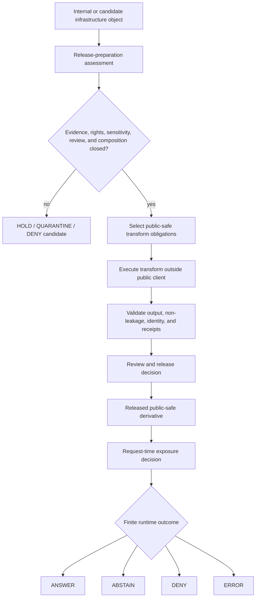

<!-- [KFM_META_BLOCK_V2]
doc_id: kfm://doc/architecture/critical-asset-exposure
title: Critical Asset Exposure — Current Architecture and Control Map
type: architecture-reference
version: v2.0-draft
status: draft; repository-grounded; mixed-maturity; fail-closed; no-policy-authority; no-release; no-publication
owners:
  - "@bartytime4life — verified GitHub review route through CODEOWNERS"
  - "NEEDS VERIFICATION — architecture, security, infrastructure-sensitivity, policy, evidence, release, and public-client stewards"
created: 2026-05-24
updated: 2026-08-18
policy_label: public
owning_root: docs/
responsibility: >
  Explain the cross-root architecture for identifying, transforming, reviewing,
  releasing, and serving public-safe representations of critical or potentially
  exploit-enabling infrastructure information without becoming policy source,
  schema authority, an operational-security assessment, release authority, or
  implementation proof.
truth_posture: >
  CONFIRMED current repository paths, accepted Directory Rules placement,
  proposed ADR status, scaffold and inactive policy surfaces, reserved exposure
  schema family, proposed settlements-infrastructure schemas, placeholder
  generalized-infrastructure fixtures, documentation-first test boundary, and
  fail-closed Governed API scaffold / PROPOSED two-stage control architecture,
  input closure, public-safe transform obligations, validation matrix, and
  graduation sequence / UNKNOWN active policy bundle, accepted evaluator,
  authenticated reviewers, authoritative exposure decision, transform execution,
  release integration, public-client enforcement, deployed isolation, correction
  propagation, and operational effectiveness.
current_path: docs/architecture/critical-asset-exposure.md
evidence_snapshot:
  repository: bartytime4life/Kansas-Frontier-Matrix
  base_ref: main
  base_commit: 0af1823ff5a54d2fa3b5f0dfe5db18e5056aa372
  prior_blob: 243f75697987e28d7083a55efa3964274d5df571
  directory_rules_blob: fd49a0b83e55cef52c1124281f093e263526898d
  directory_rules_decision: ADR-0029 accepted
  codeowners_blob: dd2a84aa514d8ecd9208bc347f90f9a2ed37dd61
  sensitivity_rubric_blob: e2ef5cccdcc1bf6f8d93b977005444239bebabf4
  exposure_schema_readme_blob: b00ef1ddb630e7359eee0306329ecba93348345f5
  generalized_fixture_readme_blob: 2bca20ed40364fd8ee48d95ec6a57d9062a82bad
  governed_api_main_blob: 4eb335c7c0b27f62c7419c478542e8fe40e1ff38
  governed_api_routes_blob: 3418168d0b267160d6ad6dd87f289e880ef4a024
  governed_api_stub_blob: 371e60d9f96c78e31c8a1e6109d19dee5da4213b
  policy_vocabulary_contract_blob: 51158caefd7b440851fb37489c511a5c710bed2b
  policy_vocabulary_registry_blob: ae68a9f3cf80308f18bd0427ef2c85057750f12
  redaction_receipt_contract_blob: c686cdf5c79a8b99ac66d4b01cd30d2f450f645f
related:
  - README.md
  - TRUST_MEMBRANE.md
  - governed-api/README.md
  - cross-lane-join-policy.md
  - data-classification-framework.md
  - ../standards/SENSITIVITY_RUBRIC.md
  - ../standards/MAP_TRUST_STATES.md
  - ../security/EXPOSURE_PLAN.md
  - ../doctrine/directory-rules.md
  - ../adr/ADR-0010-deny-by-default-for-dna-rare-species-archaeology-infrastructure.md
  - ../adr/ADR-0025-public-client-never-reads-canonical-internal-stores.md
  - ../adr/ADR-0029-adopt-directory-governance-standard-v2.md
  - ../domains/settlements-infrastructure/README.md
  - ../domains/hazards/PUBLICATION_AND_BOUNDARY.md
  - ../../policy/domains/settlements-infrastructure/README.md
  - ../../policy/sensitivity/README.md
  - ../../contracts/policy/policy_decision_vocabulary.md
  - ../../contracts/shared/redaction_receipt.md
  - ../../schemas/contracts/v1/exposure/README.md
  - ../../schemas/contracts/v1/domains/settlements-infrastructure/README.md
  - ../../fixtures/infrastructure-generalized/README.md
  - ../../tests/domains/settlements-infrastructure/README.md
  - ../../apps/governed-api/README.md
  - ../../schemas/contracts/v1/runtime/runtime_response_envelope.schema.json
notes:
  - "Same-path architecture-document modernization only."
  - "No policy source, contract, schema, fixture, validator, test, route, data object, release record, deployment, publication, or repository setting is changed."
  - "The former document's useful threat, generalization, role-separation, and rollback concepts are retained but reclassified against current repository evidence."
  - "ADR-0010 and ADR-0025 remain proposed. This document cannot accept them by description."
[/KFM_META_BLOCK_V2] -->

# Critical Asset Exposure — Current Architecture and Control Map

> **Purpose.** Explain how KFM should prevent exact, operational, compositional, or otherwise exploit-enabling infrastructure detail from crossing into public or semi-public surfaces, while showing exactly which parts of that control path are present, proposed, held, or unverified in the current repository.

| Field | Current result |
|---|---|
| **Document role** | Cross-cutting architecture explanation under `docs/architecture/`; not policy, schema, release authority, an operational vulnerability assessment, or emergency guidance. |
| **Evidence snapshot** | `main@0af1823ff5a54d2fa3b5f0dfe5db18e5056aa372`. |
| **Directory result** | `PLACE` at the existing requested path. Accepted Directory Rules assign human-readable cross-root architecture to `docs/architecture/`; no move, alias, new root, or authority migration is needed. |
| **Decision posture** | [`ADR-0010`](../adr/ADR-0010-deny-by-default-for-dna-rare-species-archaeology-infrastructure.md) and [`ADR-0025`](../adr/ADR-0025-public-client-never-reads-canonical-internal-stores.md) remain effectively **PROPOSED**. |
| **Policy posture** | Sensitivity and Settlements/Infrastructure policy source is tracked but scaffolded, mixed, evaluator-unbound, and not established as active public enforcement. |
| **Exposure-contract posture** | [`schemas/contracts/v1/exposure/`](../../schemas/contracts/v1/exposure/README.md) is a reserved, empty schema family; no accepted exposure request or decision shape is present. |
| **Fixture and test posture** | The generalized-infrastructure fixture lane is placeholder-only; the domain-test parent is documentation-first, with identity as its only confirmed child README and no proved critical-exposure test suite. |
| **Dynamic public boundary** | The Governed API has three GET routes (`/bootstrap`, `/layers`, `/evidence`) that return `ABSTAIN / NOT_IMPLEMENTED`; unknown routes and unsupported methods return safe `ERROR` envelopes. No critical-asset exposure route or evidence-backed `ANSWER` path is proved. |
| **Publication effect** | None. This page, a schema pass, policy file, workflow, pull request, merge, map layer, or denial message is not a release or publication decision. |

> [!IMPORTANT]
> **The repository contains control surfaces, not a complete control path.** Current evidence supports architecture and policy documentation, proposed schemas, an inactive policy-decision vocabulary, placeholder fixtures, bounded structural checks, and a fail-closed API scaffold. It does **not** support a claim that KFM can currently classify, transform, approve, release, serve, revoke, or audit critical-asset exposure end to end.

> [!CAUTION]
> **Critical-asset risk is representation- and operation-dependent.** A record is not automatically public-safe because it is individually ordinary, generalized at one zoom level, or stored in a published-looking directory. Geometry, attributes, time, joins, queryability, bulk export, audience, and surrounding released layers can combine into harmful precision.

> [!WARNING]
> **Client-side hiding is not protection.** Map styling, omitted popup fields, coarse default zoom, hidden layers, search filters, private-looking routes, model refusal prompts, or UI feature flags cannot substitute for server-side policy, irreversible public-safe transformation, release review, and negative tests over the delivered bytes.

**Quick navigation:** [Role](#1-role-authority-and-truth-posture) · [Scope](#2-scope-and-terminology) · [Repository state](#3-current-repository-state) · [Threat model](#4-exposure-threat-model) · [Architecture](#5-two-stage-control-architecture) · [Inputs](#6-required-decision-context) · [Transforms](#7-public-safe-transform-and-obligation-model) · [Outcomes](#8-finite-outcomes-and-public-safe-reasons) · [Composition](#9-cross-lane-and-aggregation-risk) · [Surfaces](#10-public-client-map-ai-and-export-boundaries) · [Release](#11-release-correction-withdrawal-and-rollback) · [Validation](#12-validation-and-negative-proof) · [Maturity](#13-maturity-matrix-and-change-checklist) · [Open work](#14-conflicts-holds-and-open-verification) · [Related](#15-related-repository-evidence)

---

## 1. Role, authority, and truth posture

### 1.1 What this page owns

This page owns one responsibility: a human-readable architecture map of the control path between internally held infrastructure information and released public-safe representations.

It explains:

- what KFM means by critical-asset exposure;
- why a single record, a cross-lane join, or an apparently harmless derivative may create risk;
- the difference between preparing a public-safe release candidate and answering a public request;
- the evidence, rights, sensitivity, review, release, and correction context needed at each stage;
- how generalization, redaction, aggregation, delay, and export limits should be represented as obligations rather than informal UI behavior;
- which current repository surfaces participate in the design; and
- which tests and runtime evidence would be required before claiming enforcement.

It does not own:

| Concern | Owning surface |
|---|---|
| Directory placement | Accepted [`ADR-0029`](../adr/ADR-0029-adopt-directory-governance-standard-v2.md) and [`docs/doctrine/directory-rules.md`](../doctrine/directory-rules.md) |
| Binding deny-by-default decision | Accepted ADR and reviewed policy; ADR-0010 is currently proposed |
| Domain object meaning | [`contracts/domains/`](../../contracts/domains/) and shared contracts |
| Machine-checkable object shape | [`schemas/contracts/v1/`](../../schemas/contracts/v1/) |
| Sensitivity and admissibility rules | [`policy/`](../../policy/README.md), especially domain and sensitivity lanes |
| Evidence support | `EvidenceRef`, `EvidenceBundle`, proofs, receipts, and their accepted resolvers |
| Release, correction, withdrawal, rollback | [`release/`](../../release/README.md) and referenced accountability objects |
| Deployable enforcement | Governed applications, accepted evaluators, packages, infrastructure, and observed runtime evidence |
| Proof of enforceability | [`tests/`](../../tests/README.md), [`fixtures/`](../../fixtures/README.md), validators, workflows, and exact-head runs |

### 1.2 Current review route and functional ownership

[`CODEOWNERS`](../../.github/CODEOWNERS) routes repository review to `@bartytime4life`. That is a GitHub review route only. The following functional authorities remain **NEEDS VERIFICATION**:

- architecture stewardship;
- critical-infrastructure and operational-security review;
- sensitivity-policy stewardship;
- municipal, utility, transportation, communications, and emergency-services source review;
- rights and redistribution review;
- evidence and release review;
- independent approval where policy significance requires separation of duties; and
- correction, incident, withdrawal, and rollback authority.

### 1.3 Truth labels used here

| Label | Meaning in this page |
|---|---|
| `CONFIRMED` | Verified from the pinned repository tree, current files, tests, schemas, contracts, accepted placement authority, or exact runtime scaffold. |
| `PROPOSED` | Architecture, decision, input, transform, outcome mapping, validator, or graduation step not established as active behavior. |
| `UNKNOWN` | Current evidence cannot support a stronger claim. |
| `NEEDS VERIFICATION` | A named repository, policy, security, release, deployment, or runtime check can settle the question. |
| `CONFLICTED` | Current surfaces assign incompatible or overlapping status, vocabulary, scope, or authority. |
| `HOLD` | The safe current disposition is to prevent graduation until required evidence or authority exists. |

[Back to top](#top)

---

## 2. Scope and terminology

### 2.1 Critical asset

In this architecture, a **critical asset** is an infrastructure object, system, relationship, or operational representation whose public precision, combination, timing, or accessibility could create material safety, security, continuity, privacy, cultural, rights, or public-service risk.

Candidate object families may include:

- infrastructure assets, facilities, nodes, segments, corridors, service areas, operators, condition observations, and dependencies;
- energy generation, transmission, distribution, storage, and fuel-support representations;
- drinking-water, wastewater, pumping, treatment, storage, and distribution representations;
- transportation chokepoints, crossings, terminals, depots, control points, and network dependencies;
- communications, public-safety communications, dispatch, control, and coordination representations;
- public-service continuity and emergency-support facilities; and
- cross-domain joins that reveal asset function, condition, accessibility, dependency, or consequence.

This list is architectural scope, not a source registry, legal classification, current operational inventory, or statement that any named asset is critical.

### 2.2 Exposure

**Exposure** is any operation that makes information available beyond its approved internal or steward-only context. It includes more than a public map:

- API responses and query endpoints;
- map, tile, PMTiles, COG, GeoParquet, search, graph, and catalog projections;
- downloads, bulk exports, screenshots, stories, reports, dashboards, and notebooks;
- Evidence Drawer and Focus Mode payloads;
- logs, telemetry, error messages, denial reasons, and diagnostics;
- caches, object storage, CDNs, browser bundles, source maps, and offline packages;
- role-gated review surfaces when their authorization boundary is weak or unclear; and
- combinations of individually released surfaces.

### 2.3 Public-safe derivative

A **public-safe derivative** is a separately identified representation produced from governed input under an accepted transform profile, validated against the intended audience and operation, reviewed where required, and released with correction and rollback support.

A public-safe derivative:

- is not the canonical exact source object;
- does not inherit authority merely because it is generalized;
- must preserve evidence and limitations appropriate to the claim it carries;
- must not reveal reversal-enabling parameters in public receipts or reasons; and
- remains subject to correction, withdrawal, supersession, and re-evaluation when surrounding releases change.

### 2.4 Out of scope

This document does not provide:

- facility-specific vulnerability findings;
- access, maintenance, security, response, bypass, targeting, or exploitation instructions;
- emergency alerts or operational advice;
- legal determinations about critical-infrastructure classification;
- real protected coordinates, topology, credentials, private dependency data, or operational status;
- an accepted sensitivity tier for any real object; or
- permission to activate, ingest, transform, serve, export, or publish a live source.

[Back to top](#top)

---

## 3. Current repository state

### 3.1 Evidence inventory

| Surface | CONFIRMED current state | Safe conclusion |
|---|---|---|
| This architecture page | Existing tracked file under `docs/architecture/`; prior content was predominantly greenfield and repository-unverified | Same-path modernization receives `PLACE`; the page remains explanatory only. |
| [`ADR-0029`](../adr/ADR-0029-adopt-directory-governance-standard-v2.md) | Accepted; adopts exact Directory Rules v2 bytes | Placement authority is established. It does not decide critical-asset policy. |
| [`ADR-0010`](../adr/ADR-0010-deny-by-default-for-dna-rare-species-archaeology-infrastructure.md) | Source metadata `draft`; effective status `proposed` | Deny-by-default architecture is proposed, not an accepted cross-domain decision. |
| [`ADR-0025`](../adr/ADR-0025-public-client-never-reads-canonical-internal-stores.md) | Proposed decision around public-client store isolation | Useful constraint and implementation pressure; not accepted or deployed isolation proof. |
| [`SENSITIVITY_RUBRIC.md`](../standards/SENSITIVITY_RUBRIC.md) | Draft T0–T4 explanatory rubric | Vocabulary aid only; not an accepted policy mapping for every infrastructure object. |
| [`policy/sensitivity/`](../../policy/sensitivity/README.md) | Proposed scaffold corpus with mixed Rego defaults; no accepted shared evaluator or bundle | Runtime sensitivity behavior is `UNKNOWN`; operations depending on it remain held. |
| [`policy/domains/settlements-infrastructure/`](../../policy/domains/settlements-infrastructure/README.md) | Four direct Rego sources; current documentation reports three inert `default deny := false` stubs, one generated `default allow := false` scaffold, no operative non-default rule body, no direct native test, zero JSON fixtures, and evaluator-unbound readiness checks | Correctly placed policy source exists, but no complete critical-asset policy is proved. |
| [`policy/decision/vocabulary.v1.json`](../../policy/decision/vocabulary.v1.json) | `PROPOSED_INACTIVE` registry for finite policy reasons and `ANSWER` obligations | The vocabulary is a fixture-first candidate, not an evaluator or decision authority. |
| [`schemas/contracts/v1/exposure/`](../../schemas/contracts/v1/exposure/README.md) | Reserved folder with no schema instances | No accepted generic exposure request or exposure decision shape exists. |
| [`schemas/contracts/v1/domains/settlements-infrastructure/`](../../schemas/contracts/v1/domains/settlements-infrastructure/README.md) | Minimal proposed schemas for settlement, public asset, infrastructure node, and infrastructure corridor | Shape scaffolding exists; exposure semantics, policy closure, and release behavior remain outside those schemas. |
| [`contracts/shared/redaction_receipt.md`](../../contracts/shared/redaction_receipt.md) | Proposed cross-domain semantics; related schema is permissive and field-empty | Useful semantic direction; no enforceable critical-asset transform receipt is established. |
| [`fixtures/infrastructure-generalized/`](../../fixtures/infrastructure-generalized/README.md) | Placeholder `.gitkeep`; no valid or invalid fixture payloads | Generalization proof is absent. |
| [`tests/domains/settlements-infrastructure/`](../../tests/domains/settlements-infrastructure/README.md) | Domain test-parent documentation; identity is the only confirmed child README, while policy, release, map/API, AI, and no-network families are proposed | No executable critical-asset exposure suite or pass state is proved. |
| Governed API source | Three registered routes; all return deterministic `ABSTAIN / NOT_IMPLEMENTED`; unknown routes and unsupported methods return safe `ERROR` | Fail-closed scaffold is present. No critical-asset exposure endpoint, policy evaluation, evidence resolution, transform selection, or released `ANSWER` is proved. |
| [`RuntimeResponseEnvelope`](../../schemas/contracts/v1/runtime/runtime_response_envelope.schema.json) | Proposed closed schema with `ANSWER`, `ABSTAIN`, `DENY`, and `ERROR`; `ANSWER` requires evidence refs and precision metadata | Intended outward shape exists, but active critical-asset integration is absent. |

### 3.2 What is not proved

Current repository evidence does not prove:

- an accepted critical-asset taxonomy or sensitivity mapping;
- an authoritative exposure-request input contract;
- an active policy bundle, selector, evaluator, or authenticated actor context;
- a deterministic generalization/redaction implementation for infrastructure;
- a complete transform receipt with accepted machine shape;
- independent security or infrastructure review;
- a release candidate assembled from a public-safe derivative;
- public API, map, search, graph, export, or AI enforcement;
- cache invalidation after correction or withdrawal;
- deployed browser, CDN, object-store, database, graph, model-runtime, or network isolation; or
- operational metrics showing denied exposure, false-clear prevention, or reversal resistance.

[Back to top](#top)

---

## 4. Exposure threat model

This section defines defensive architecture concerns. It does not enumerate real assets or provide exploitation guidance.

### 4.1 Single-object harmful precision

A single payload may expose too much through:

- exact point, line, polygon, interior, entrance, or control geometry;
- asset identifiers that join easily to external operational detail;
- capacity, condition, maintenance, outage, repair, staffing, access, or status fields;
- high-resolution imagery, elevation, topology, or network attributes;
- timestamps or update cadence that reveal current activity; or
- metadata, filenames, URLs, logs, and errors that reveal hidden structure.

### 4.2 Compositional or adversary-mapping risk

Individually ordinary releases may become sensitive when combined. Risk can arise from:

- joining an asset layer to hazards, access routes, population, service areas, or operational observations;
- exposing upstream and downstream dependencies across infrastructure families;
- correlating public geometry with condition, timing, imagery, or third-party datasets;
- repeated queries that reconstruct a withheld boundary or feature set;
- bulk export that enables complete inventory reconstruction; or
- multiple zoom levels or historical releases that reveal the exact source representation.

The public-safety question is therefore not only **“is this field sensitive?”** It is also **“what can the released representation reveal when combined with the rest of the public corpus?”**

### 4.3 Reverse inference

A generalized derivative may still leak protected detail through:

- deterministic displacement with public reversal parameters;
- stable ordering, unique counts, or sparse aggregates;
- residual exact vertices or unchanged attributes;
- tile boundaries, source-layer names, or feature IDs;
- public receipts that disclose hidden transform parameters;
- diffs between releases; or
- a denial reason that confirms the presence, type, or condition of a protected asset.

### 4.4 Temporal disclosure

Freshness itself may be sensitive. A safe historical layer can become unsafe when paired with current status or frequent updates. Exposure assessment must keep observation, valid, retrieval, release, correction, and withdrawal times distinct where material.

### 4.5 Authorization and delivery drift

Protection can fail after policy evaluation through:

- a direct static URL that bypasses the Governed API;
- stale caches after withdrawal;
- search or graph indexes retaining exact values;
- exports carrying fields not shown in the UI;
- role-gated routes that are reachable without the intended authorization;
- model context packets that include internal detail;
- logs or telemetry retaining denied values; or
- a future client interpreting an inactive vocabulary as active permission.

### 4.6 Failure precedence

When evidence, rights, sensitivity, review, release, transform integrity, or evaluator state is unresolved, the safe precedence is:

1. `ERROR` when the required evaluator, bundle, input, or runtime mechanism cannot be trusted;
2. `DENY` when public precision, rights, sensitivity, or exposure policy blocks the operation;
3. `ABSTAIN` when evidence, freshness, scope, or support is insufficient to make the claim;
4. `ANSWER` only when the public-safe artifact is already prepared, validated, released, current, and supported.

[Back to top](#top)

---

## 5. Two-stage control architecture

Critical-asset controls need two distinct decisions. Collapsing them makes it easy to treat a runtime request as permission to transform or publish internal data.

```mermaid
flowchart TD
  A["Internal or candidate infrastructure object"] --> B["Release-preparation assessment"]
  B --> C{"Evidence, rights, sensitivity, review, and composition closed?"}
  C -->|"no"| D["HOLD / QUARANTINE / DENY candidate"]
  C -->|"yes"| E["Select public-safe transform obligations"]
  E --> F["Execute transform outside public client"]
  F --> G["Validate output, non-leakage, identity, and receipts"]
  G --> H["Review and release decision"]
  H --> I["Released public-safe derivative"]
  I --> J["Request-time exposure decision"]
  J --> K{"Finite runtime outcome"}
  K --> L["ANSWER"]
  K --> M["ABSTAIN"]
  K --> N["DENY"]
  K --> O["ERROR"]
```

The diagram is a proposed architecture over current scaffolded surfaces. It is not a claim that the flow executes today.

### 5.1 Stage A — release-preparation assessment

This internal stage decides whether a candidate may advance toward a public-safe derivative. It may require:

- exact internal retention with no public derivative;
- geometry generalization;
- exact-location redaction;
- attribute suppression;
- aggregation;
- delayed release;
- bulk-export prohibition;
- removal of identifiers or dependency edges;
- specialist or steward review;
- re-evaluation after surrounding layers change; or
- quarantine, rejection, or hold.

These are **candidate dispositions and obligations**, not public runtime outcomes.

### 5.2 Stage B — request-time exposure decision

This stage evaluates a request only against released, public-safe, current, policy-bound material. It must not fetch internal exact data and generalize it opportunistically in the browser.

A request-time `ANSWER` requires at least:

- an allowed operation and audience;
- a released artifact or governed projection;
- resolved evidence support;
- satisfied rights and sensitivity obligations;
- verified transform and artifact identity;
- current correction/withdrawal state;
- requested precision no greater than released precision; and
- a safe response envelope.

### 5.3 No hidden third path

The following paths are denied by architecture:

- internal store directly to browser;
- candidate directly to tile service;
- policy scaffold directly to public allow;
- schema-valid object directly to publication;
- map style directly to redaction;
- AI prompt directly to sensitive-data control;
- reviewer UI directly to public route; and
- release directory placement directly to public state.

[Back to top](#top)

---

## 6. Required decision context

A mature release-preparation or request-time evaluation should receive explicit, versioned context. Current repository evidence does not establish one accepted aggregate input profile; the table below is **PROPOSED**.

| Context family | Minimum questions |
|---|---|
| Operation | Is the request view, query, identify, search, compare, export, bulk-download, print, story, AI context, or reviewer retrieval? |
| Audience and actor | Public, semi-public, authenticated reviewer, steward, system process; which role and purpose are actually authenticated? |
| Target identity | Which object, artifact, layer, feature, release, field set, geography, and temporal version are in scope? |
| Requested precision | Exact geometry, generalized geometry, aggregate, attribute detail, temporal recency, query volume, and exportability. |
| Object role | Asset, facility, node, segment, corridor, service area, operator, condition observation, dependency, or derivative carrier. |
| Source and evidence | SourceDescriptor, source role, rights, EvidenceRefs, EvidenceBundle, limitations, and freshness. |
| Sensitivity | Accepted sensitivity label or profile, harmful-precision posture, cross-lane composition risk, and review trigger. |
| Transform | Selected profile, input/output digests, non-disclosure guard, validation evidence, and proposed RedactionReceipt reference. |
| Review | Required specialist roles, exact candidate version, decision time, independence, and expiry. |
| Release | Candidate/release identity, ReleaseManifest, policy version, rollback target, correction state, withdrawal state, and cache/index invalidation plan. |
| Evaluator | Policy bundle digest, evaluator version, input-profile version, effective time, and failure behavior. |
| Surrounding exposure | Other released layers, joins, graph edges, search fields, exports, stories, model context, and prior versions that can change the risk. |

### 6.1 Inputs that must not be inferred

The evaluator must not infer permission from:

- a domain name;
- a source being official;
- a record already existing in the repository;
- a low map zoom;
- missing sensitivity metadata;
- absence of an explicit deny rule;
- a previously released sibling artifact;
- an authenticated caller without operation-specific authorization;
- a model-generated summary;
- a passing schema check; or
- an old policy decision applied to a corrected or recomposed artifact.

### 6.2 Sensitivity tiers are supporting vocabulary, not automatic decisions

The draft [`SENSITIVITY_RUBRIC.md`](../standards/SENSITIVITY_RUBRIC.md) provides T0–T4 explanatory labels. This architecture does not assign one fixed tier to every infrastructure record.

Classification must consider:

- exact representation and fields;
- audience and operation;
- time and currentness;
- cross-lane joins and derivative surfaces;
- source terms and rights;
- public benefit and alternatives;
- reversal and reconstruction risk; and
- qualified review requirements.

A public-safe aggregate may be lower risk than its exact source. A seemingly low-risk record may escalate when paired with current condition or dependency data.

[Back to top](#top)

---

## 7. Public-safe transform and obligation model

### 7.1 Obligation vocabulary

The inactive policy-decision vocabulary currently includes useful candidate obligations:

- `GENERALIZE_GEOMETRY`;
- `REDACT_EXACT_LOCATION`;
- `DELAY_PUBLICATION`;
- `WITHHOLD_EXPORT`;
- `REQUIRE_STEWARD_REVIEW`;
- `ATTACH_CITATIONS`;
- `ATTACH_RIGHTS_NOTICE`; and
- `VERIFY_ROLLBACK_TARGET`.

Those entries are `PROPOSED_INACTIVE`. They define no active permission. A future accepted evaluator must prove that every obligation is enforced before returning or releasing an `ANSWER`-eligible derivative.

### 7.2 Transform families

| Transform family | Defensive purpose | Minimum proof expectation |
|---|---|---|
| Generalize geometry | Reduce location or network precision to the approved public representation | No exact residual geometry; deterministic or reviewable output; precision disclosed without reversal parameters |
| Redact exact location | Remove coordinates or location-bearing attributes | Exact values absent from payload, tiles, indexes, logs, receipts, and exports |
| Aggregate | Replace sparse or identifying records with a safe group or region | Minimum group/coverage rule; no singleton recovery; uncertainty and scope visible |
| Suppress attributes | Remove capacity, condition, access, dependency, operator, identifier, or operational detail | Closed output field allowlist; no hidden source properties in tiles or downloads |
| Simplify or clip | Reduce line/polygon detail or constrain to a safe boundary | Topology and artifact checks; no concealed exact child geometry |
| Delay | Reduce current operational sensitivity | Explicit embargo/end condition; no watcher or cache path exposes early bytes |
| Withhold export | Permit bounded viewing without bulk retrieval | API, static delivery, browser, and CDN controls; no alternate download path |
| Withhold entirely | Produce no public derivative | Public-safe denial/absence behavior without confirming protected details |

### 7.3 Transform receipt boundary

The proposed shared [`RedactionReceipt`](../../contracts/shared/redaction_receipt.md) is the correct semantic direction for recording a protective transform, but its machine schema is currently permissive and field-empty.

A future critical-asset transform receipt should bind, without leaking protected content:

- receipt, candidate, input, and output identity;
- transform class and versioned profile;
- policy and review references;
- evidence and source-role references;
- input and output digests;
- validation reports;
- release candidate and eventual release references;
- correction, withdrawal, and rollback references; and
- a non-disclosure guard for hidden transform parameters.

The receipt records what happened. It does not select policy, prove sufficiency, approve release, or expose the original value.

### 7.4 No client-only transforms

The browser may render a released generalized derivative. It must not receive exact geometry and hide, round, displace, aggregate, or suppress it as the only protection. Public-safe transformation belongs before delivery and must be validated against the actual emitted bytes.

[Back to top](#top)

---

## 8. Finite outcomes and public-safe reasons

### 8.1 Runtime outcomes

Trust-bearing public responses use the finite runtime vocabulary:

| Outcome | Critical-asset meaning |
|---|---|
| `ANSWER` | A released, current, evidence-supported public-safe derivative satisfies the request at no greater precision than approved. |
| `ABSTAIN` | Evidence, freshness, scope, identity, or support is insufficient to make the requested claim reliably. |
| `DENY` | Rights, sensitivity, harmful precision, role, operation, release state, or exposure policy blocks the request. |
| `ERROR` | Required policy, evaluator, schema, resolver, release, or runtime context is missing or failed, so reliable evaluation is impossible. |

`GENERALIZE`, `REDACT`, `DELAY`, `AGGREGATE`, `WITHHOLD_EXPORT`, and `REQUIRE_REVIEW` are obligations or candidate dispositions. They are not additional top-level runtime outcomes.

### 8.2 Current inactive reason codes

The proposed inactive vocabulary includes relevant public-safe reason codes:

| Code | Outcome | Safe architectural use |
|---|---|---|
| `PUBLIC_PRECISION_UNSAFE` | `DENY` | Requested detail exceeds the released public-safe representation. |
| `SENSITIVITY_UNRESOLVED` | `DENY` | Sensitivity classification or required transform is unresolved. |
| `RIGHTS_UNKNOWN` | `DENY` | Public use or redistribution rights are unresolved. |
| `EVIDENCE_UNRESOLVED` | `ABSTAIN` | Required evidence does not resolve. |
| `EVIDENCE_STALE` | `ABSTAIN` | Available evidence is outside the admitted freshness window. |
| `POLICY_INPUT_INCOMPLETE` | `ERROR` | Required actor, operation, evidence, sensitivity, review, release, or evaluator context is absent. |
| `POLICY_BUNDLE_UNAVAILABLE` | `ERROR` | The selected bundle or evaluator context cannot be verified. |
| `OPERATION_ALLOWED_WITH_OBLIGATIONS` | `ANSWER` | The bounded operation may proceed only after every accepted obligation is enforced. |

These codes remain inactive candidates. A public response must not expose internal rule paths, protected classifications, exact denied values, stack traces, or details that confirm a sensitive asset's presence or condition.

### 8.3 Reason minimization

Public reasons should explain the outcome without revealing the protected fact. Operator-grade detail belongs in authenticated audit or review surfaces with appropriate access and retention controls.

Examples of safe public posture:

- “Requested precision is unavailable for this audience.”
- “The requested representation is not released for public use.”
- “Evidence is not current enough to support this claim.”
- “The policy decision service could not complete reliably.”

Unsafe posture includes echoing exact coordinates, restricted fields, internal paths, rule source, hidden asset type, or operational condition.

[Back to top](#top)

---

## 9. Cross-lane and aggregation risk

### 9.1 Cross-lane joins are separate governed objects

A join that combines infrastructure with hazards, hydrology, roads/rail, settlements, people/land, archaeology, imagery, or other domains must follow the architecture in [`cross-lane-join-policy.md`](./cross-lane-join-policy.md).

The join must not:

- upcast source authority;
- inherit public safety from either input;
- hide temporal mismatch;
- collapse missing support into a false match;
- expose restricted reasons or exact geometry;
- become canonical truth merely because it is materialized; or
- bypass release and rollback because both inputs were previously released.

### 9.2 Aggregation is not automatically safe

Aggregation can still leak when groups are sparse, unique, stable across releases, or paired with outside data. A safe aggregate needs explicit thresholds, representation rules, uncertainty, audience, export posture, and reconstruction tests.

### 9.3 Surrounding-release dependency

Exposure safety is not purely local to one artifact. A new release can make an older generalized layer unsafe through composition. Release review should therefore record material surrounding layers and trigger re-evaluation when high-risk joins become possible.

### 9.4 Query and rate posture

Even a public-safe per-request response may become unsafe under exhaustive query, enumeration, differencing, or bulk access. Future enforcement may need:

- query-shape limits;
- bounded spatial and temporal windows;
- export restrictions;
- anti-enumeration controls;
- caching that does not preserve denied content;
- audit-safe rate observation; and
- denial behavior that does not reveal hidden set membership.

These controls are **PROPOSED / NEEDS VERIFICATION**. This page does not claim they exist.

[Back to top](#top)

---

## 10. Public client, map, AI, and export boundaries

### 10.1 Governed API

The Governed API is the intended dynamic trust boundary, but current code is a three-route fail-closed scaffold. A future critical-asset request must not graduate directly from this page or from a route name.

Before a route can return `ANSWER`, current architecture requires:

- accepted request and response contracts;
- authenticated actor and operation context where applicable;
- authoritative evidence lookup;
- accepted policy bundle and evaluator;
- public-safe artifact resolution;
- release, correction, and withdrawal checks;
- response-envelope validation;
- safe reason handling;
- no-network deterministic fixtures and negative tests; and
- deployed isolation evidence.

### 10.2 MapLibre and Evidence Drawer

MapLibre is a renderer and interaction surface, not exposure authority.

A public map may:

- render an already released public-safe derivative;
- show public-safe trust, release, freshness, and limitation state;
- link to Evidence Drawer citations and public-safe transform notices; and
- withhold or visibly deny unavailable precision.

It must not:

- fetch exact internal geometry;
- contain hidden sensitive source properties;
- derive permission from zoom, style, opacity, or visibility;
- reveal denied content through hit-testing, source inspection, feature state, or client cache;
- treat a map click as authorization; or
- reconstruct a withheld asset through neighboring layers.

The draft [`MAP_TRUST_STATES.md`](../standards/MAP_TRUST_STATES.md) is vocabulary guidance, not proof of implemented state propagation.

### 10.3 Governed AI / Focus Mode

AI may interpret released public-safe evidence. It must not receive exact internal infrastructure detail merely because the final prose is intended to be general.

For critical-asset questions, AI must:

- operate behind the Governed API;
- receive only the released precision allowed for the caller and operation;
- cite admissible released evidence;
- preserve limitations and transform notices;
- return `ABSTAIN`, `DENY`, or `ERROR` when support or policy is unresolved; and
- avoid confirming restricted presence, condition, topology, or operational detail through generated language.

A prompt or refusal message is not the primary data control.

### 10.4 Search, graph, and catalog

Search indexes, graph projections, and catalogs are downstream carriers. They need the same field, geometry, release, correction, and withdrawal controls as the visible map.

A public-safe map paired with an exact search result is not public-safe. A denied map feature whose graph neighbors remain queryable is not withheld.

### 10.5 Exports, stories, screenshots, and offline packages

Exports can remove interactive guardrails and enable bulk analysis. Every export profile should define:

- released artifact and version;
- included fields and geometry precision;
- evidence and rights notices;
- limitations and public-safe transform state;
- audience and reuse constraints;
- expiry or correction behavior where material; and
- withdrawal and rollback references.

A screenshot or story can also reveal precise context through labels, scale, basemap, or nearby features. Communication artifacts are not exempt from exposure review.

[Back to top](#top)

---

## 11. Release, correction, withdrawal, and rollback

### 11.1 Release prerequisites

A critical-asset public-safe derivative should not enter released state until the candidate has evidence appropriate to consequence, including:

- stable identity and digests;
- source-role and rights closure;
- sensitivity and harmful-precision assessment;
- transform profile and receipt;
- output byte and field validation;
- composition and reverse-inference tests;
- required specialist and independent review;
- release manifest and public scope;
- correction and withdrawal path;
- rollback target; and
- cache, search, graph, tile, export, and AI invalidation plan.

Current repository evidence does not prove that this closure exists for a critical-asset candidate.

### 11.2 Corrections

A correction may be required when:

- an asset or derivative was misclassified;
- public precision was excessive;
- a transform failed or leaked residual detail;
- source rights or terms changed;
- surrounding releases increased compositional risk;
- a reviewer decision was superseded;
- evidence became stale or conflicted; or
- the public representation no longer matches the released object.

Correction must preserve lineage. Do not silently edit a released derivative and leave old caches or exports authoritative.

### 11.3 Withdrawal and emergency containment

When exposure risk is suspected, the safe immediate action is containment: disable or withdraw affected public carriers, prevent new exports, block AI context, and preserve evidence for review. Containment does not create a new canonical classification or prove an incident root cause.

### 11.4 Rollback

Rollback must target a known prior public-safe release or a withdrawn/empty public state. It must not restore an older artifact whose policy, rights, or composition posture is no longer valid.

A rollback rehearsal should verify:

- release alias or lookup reversion;
- cache/CDN invalidation;
- tile, search, graph, export, story, and AI-context parity;
- correction or withdrawal notices;
- audit and receipt retention; and
- no re-exposure of the exact source object.

[Back to top](#top)

---

## 12. Validation and negative proof

### 12.1 Current validation boundary

Current evidence supports documentation and readiness checks, not a complete critical-asset exposure proof. The placeholder generalized fixture lane and proposed test families must not be counted as executable coverage.

### 12.2 Minimum synthetic fixture set

A future fixture-first slice should include fake, clearly non-real objects and no network or model calls.

| Fixture | Expected result |
|---|---|
| Released public-safe aggregate with current evidence, rights, transform receipt, review, and rollback | `ANSWER` at the released precision only |
| Exact geometry requested when only generalized geometry is released | `DENY / PUBLIC_PRECISION_UNSAFE` |
| Missing EvidenceBundle resolution | `ABSTAIN / EVIDENCE_UNRESOLVED` |
| Stale evidence for a current-status claim | `ABSTAIN / EVIDENCE_STALE` |
| Unknown redistribution rights | `DENY / RIGHTS_UNKNOWN` |
| Missing sensitivity or transform context | `DENY / SENSITIVITY_UNRESOLVED` |
| Missing evaluator or incomplete policy input | `ERROR` with a public-safe reason |
| Exact value remains in an attribute, tile property, search field, graph edge, log, or export after generalization | Validation failure and release block |
| Generalized records can be differenced or joined to recover exact membership | Validation failure and release block |
| Browser bundle or static URL addresses internal lifecycle paths | Boundary failure and release block |
| AI context contains more precision than the released artifact | Boundary failure and `DENY` |
| Withdrawal leaves old tile/search/graph/export/AI surfaces reachable | Rollback/correction failure |
| Denial reason confirms protected presence or condition | Safe-reason failure |
| Default tests attempt DNS, sockets, live sources, model runtime, or external policy service | Test failure / `ERROR` |

### 12.3 Required validation layers

| Layer | Proof needed |
|---|---|
| Contract and schema | Closed, accepted request, policy input, decision, transform receipt, release, and runtime envelope shapes |
| Policy | Native positive and negative tests against an accepted bundle and exact evaluator version |
| Transform | Determinism or bounded reproducibility, field allowlist, no residual exact detail, reverse-inference tests |
| Evidence | EvidenceRef resolution, source-role preservation, freshness, citation closure |
| Release | Candidate closure, reviewer authority, manifest binding, correction and rollback targets |
| API | Finite outcomes, safe reasons, auth/role behavior, no internal paths, no direct store reads |
| Browser and static delivery | Bundle inspection, network route inventory, CORS/CSP and static-host posture, no hidden exact fields |
| Derived surfaces | Tile, search, graph, catalog, export, story, screenshot, offline package, and AI-context parity |
| Operations | Logs, telemetry, cache invalidation, incident containment, withdrawal propagation, rollback drill |

### 12.4 Non-vacuity

A test suite is not meaningful when it only checks that empty directories exist, that a README contains a phrase, or that all current routes abstain. Graduation requires at least one supported synthetic public-safe case and representative `ABSTAIN`, `DENY`, and `ERROR` cases across the actual evaluator and consumer boundary.

[Back to top](#top)

---

## 13. Maturity matrix and change checklist

### 13.1 Current maturity

| Capability | Current status | Evidence-backed interpretation |
|---|---|---|
| Architecture doctrine | **PARTIAL / repository-grounded** | Multiple current docs describe the intended boundary; acceptance of ADR-0010/0025 is still held. |
| Sensitivity vocabulary | **DRAFT** | T0–T4 and map trust-state documents exist as explanatory drafts. |
| Domain policy source | **SCAFFOLD** | Correctly placed files and documentation exist; operative critical-asset rules are not established. |
| Shared sensitivity evaluator | **HOLD** | No accepted bundle, selector, input assembly, evaluator, or governed consumer binding is proved. |
| Exposure contract/schema | **RESERVED / EMPTY** | Folder exists; no schema instances. |
| Infrastructure schemas | **PROPOSED MINIMAL SHAPES** | Domain shape scaffolds exist without exposure closure. |
| Transform semantics | **PROPOSED** | Shared RedactionReceipt prose exists; machine shape and validator are not closed. |
| Generalization fixtures | **PLACEHOLDER** | No payloads or expected-output cases. |
| Exposure tests | **DOCUMENTATION-FIRST / HELD** | No complete executable policy, transform, release, map/API, export, or AI exposure suite is proved. |
| Governed API | **FAIL-CLOSED SCAFFOLD** | Three routes abstain; no evidence-backed exposure behavior. |
| Public map/export/AI enforcement | **UNKNOWN / NOT PROVED** | No deployed or exact consumer proof. |
| Release/correction/rollback | **MIXED FIXTURE-FIRST / CRITICAL-ASSET CLOSURE UNPROVED** | Repository has general release machinery, but no bounded critical-asset end-to-end proof is established here. |

### 13.2 Checklist for any future implementation change

Before changing a critical-asset exposure surface, confirm:

- [ ] The owning responsibility root is identified and Directory Rules placement is checked.
- [ ] No parallel contract, schema, policy, fixture, test, proof, receipt, release, or public-data home is created.
- [ ] The affected object family and source roles are explicit.
- [ ] Actor, audience, purpose, operation, and requested precision are explicit.
- [ ] Evidence, rights, sensitivity, review, release, correction, and rollback context is version-bound.
- [ ] Public-safe transforms happen before public delivery.
- [ ] The transform emits a safe, auditable receipt without reversal-enabling detail.
- [ ] The output is tested across API, map, tile, search, graph, export, logs, telemetry, cache, and AI context as applicable.
- [ ] Cross-lane and aggregate reconstruction risk is evaluated.
- [ ] Negative reasons are public-safe.
- [ ] Default tests are deterministic and no-network.
- [ ] At least one supported and representative `ABSTAIN`, `DENY`, and `ERROR` case is proved.
- [ ] Correction, withdrawal, invalidation, and rollback are exercised.
- [ ] Documentation is updated without presenting passing checks as publication authority.

### 13.3 Smallest legitimate implementation sequence

The smallest dependency-ordered sequence is **PROPOSED**:

1. Ratify or revise the governing default-deny decision and reviewer roles.
2. Close one bounded exposure input/decision contract and schema profile without activating live sources.
3. Adopt one synthetic critical-asset representation and one public-safe derivative profile.
4. Implement a deterministic transform plus safe receipt shape and negative fixtures.
5. Bind one accepted policy bundle and evaluator to the synthetic profile.
6. Prove finite outcomes and no-network behavior in a non-public harness.
7. Bind the released synthetic derivative to Governed API projection and public-client negative tests.
8. Run correction, withdrawal, cache invalidation, and rollback rehearsal.
9. Only then consider a real source or public release through separate governed admission and release work.

This document performs none of those transitions.

[Back to top](#top)

---

## 14. Conflicts, holds, and open verification

### 14.1 Current conflicts

| ID | Conflict | Safe disposition |
|---|---|---|
| `CAE-C01` | ADR-0010 expresses a proposed deny-by-default decision, while active cross-domain enforcement is not established | Keep decision and enforcement as separate held transitions. |
| `CAE-C02` | Draft T0–T4 vocabulary can be mistaken for an accepted automatic infrastructure classification | Treat tiers as explanatory until policy and reviewer authority are accepted. |
| `CAE-C03` | Settlements/Infrastructure policy documentation reports a machine T0 baseline tension with proposed T4 critical-detail escalation | Do not infer either mapping as authoritative; require operation-specific policy input. |
| `CAE-C04` | Native policy source uses mixed boolean defaults, while outward systems require `ANSWER / ABSTAIN / DENY / ERROR` | Require accepted normalization and failure precedence before any consumer binding. |
| `CAE-C05` | Exposure schema family is reserved but empty, while architecture prose names request and decision concepts | Hold generic exposure integration until semantic and machine authority close. |
| `CAE-C06` | Shared RedactionReceipt semantics are substantive, but the schema is permissive and field-empty | Do not treat receipt presence as transform proof or release support. |
| `CAE-C07` | Generalized-infrastructure fixtures and broad domain-test families are documented but not implemented | Keep maturity at placeholder/documentation-first. |
| `CAE-C08` | Map trust-state vocabulary includes proposed extensions and path-shaped implementation claims | Use it as draft UX vocabulary only, not runtime proof. |

### 14.2 Open verification register

1. Which accepted object family should carry release-preparation exposure assessment: a dedicated `ExposureDecision`, a policy decision with obligations, or another accepted profile?
2. Which exact input contract supplies actor, operation, audience, requested precision, evidence, rights, sensitivity, review, release, and composition context?
3. Which policy bundle, evaluator, selector, and digest-binding mechanism is authoritative?
4. Which infrastructure object families and representation classes require specialist review?
5. Which generalization, aggregation, temporal-delay, and export thresholds are safe for each accepted profile?
6. How are surrounding public layers enumerated and re-evaluated for compositional risk?
7. Which transform parameters may be auditable without enabling reversal or re-identification?
8. Which synthetic fixture becomes the first non-vacuous supported case?
9. Which tests prove exact geometry and attributes are absent from tiles, search, graph, exports, logs, telemetry, caches, and AI context?
10. Which deployed controls prove browsers and static hosts cannot address internal or candidate stores?
11. Which authenticated roles may view internal exact representations, and how is least privilege enforced?
12. Which reviewer roles require independence from author, evaluator operator, and release approver?
13. How are corrections and withdrawals propagated across CDN, object storage, API caches, search, graph, map, stories, exports, and AI?
14. What is the first rollback target and how is rollback rehearsed without restoring unsafe prior bytes?
15. Which metrics detect false clears, over-denial, stale decisions, reconstruction risk, and incomplete invalidation without logging protected values?

### 14.3 HOLD conditions

Keep implementation or release on hold when any of the following is unresolved:

- rights or redistribution terms;
- asset identity or object role;
- requested operation or authenticated audience;
- evidence support or freshness;
- sensitivity or harmful-precision assessment;
- public-safe transform profile;
- reviewer authority;
- policy bundle or evaluator integrity;
- release, correction, withdrawal, or rollback state;
- surrounding-release composition risk; or
- proof that emitted bytes contain no protected detail.

[Back to top](#top)

---

## 15. Related repository evidence

### Governing placement and decisions

- [`docs/doctrine/directory-rules.md`](../doctrine/directory-rules.md)
- [`ADR-0029 — Adopt Directory Governance Standard v2`](../adr/ADR-0029-adopt-directory-governance-standard-v2.md) — accepted placement authority
- [`ADR-0010 — Deny-by-Default for DNA, Rare Species, Archaeology, and Critical Infrastructure`](../adr/ADR-0010-deny-by-default-for-dna-rare-species-archaeology-infrastructure.md) — proposed
- [`ADR-0025 — Public Client Never Reads Canonical or Internal Stores`](../adr/ADR-0025-public-client-never-reads-canonical-internal-stores.md) — proposed

### Architecture, security, and standards companions

- [`docs/architecture/TRUST_MEMBRANE.md`](./TRUST_MEMBRANE.md)
- [`docs/architecture/governed-api/README.md`](./governed-api/README.md)
- [`docs/architecture/cross-lane-join-policy.md`](./cross-lane-join-policy.md)
- [`docs/architecture/data-classification-framework.md`](./data-classification-framework.md)
- [`docs/security/EXPOSURE_PLAN.md`](../security/EXPOSURE_PLAN.md)
- [`docs/standards/SENSITIVITY_RUBRIC.md`](../standards/SENSITIVITY_RUBRIC.md)
- [`docs/standards/MAP_TRUST_STATES.md`](../standards/MAP_TRUST_STATES.md)
- [`docs/domains/settlements-infrastructure/README.md`](../domains/settlements-infrastructure/README.md)
- [`docs/domains/hazards/PUBLICATION_AND_BOUNDARY.md`](../domains/hazards/PUBLICATION_AND_BOUNDARY.md)

### Current policy, contract, schema, fixture, and test surfaces

- [`policy/domains/settlements-infrastructure/README.md`](../../policy/domains/settlements-infrastructure/README.md)
- [`policy/sensitivity/README.md`](../../policy/sensitivity/README.md)
- [`contracts/policy/policy_decision_vocabulary.md`](../../contracts/policy/policy_decision_vocabulary.md)
- [`policy/decision/vocabulary.v1.json`](../../policy/decision/vocabulary.v1.json)
- [`contracts/shared/redaction_receipt.md`](../../contracts/shared/redaction_receipt.md)
- [`schemas/contracts/v1/exposure/README.md`](../../schemas/contracts/v1/exposure/README.md)
- [`schemas/contracts/v1/domains/settlements-infrastructure/README.md`](../../schemas/contracts/v1/domains/settlements-infrastructure/README.md)
- [`fixtures/infrastructure-generalized/README.md`](../../fixtures/infrastructure-generalized/README.md)
- [`tests/domains/settlements-infrastructure/README.md`](../../tests/domains/settlements-infrastructure/README.md)

### Current dynamic boundary

- [`apps/governed-api/README.md`](../../apps/governed-api/README.md)
- [`apps/governed-api/src/governed_api/main.py`](../../apps/governed-api/src/governed_api/main.py)
- [`apps/governed-api/src/governed_api/routes/registry.py`](../../apps/governed-api/src/governed_api/routes/registry.py)
- [`apps/governed-api/src/governed_api/stub.py`](../../apps/governed-api/src/governed_api/stub.py)
- [`schemas/contracts/v1/runtime/runtime_response_envelope.schema.json`](../../schemas/contracts/v1/runtime/runtime_response_envelope.schema.json)

---

## Footer

| Field | Value |
|---|---|
| **Document class** | Cross-cutting architecture reference |
| **Evidence snapshot** | `main@0af1823ff5a54d2fa3b5f0dfe5db18e5056aa372` |
| **Last updated** | 2026-08-18 |
| **Current result** | Repository-grounded same-path modernization; no policy, runtime, release, or publication effect |
| **Rollback** | Revert this documentation commit; no data, policy, contract, schema, fixture, test, runtime, release, deployment, cache, or publication state changes |

[Back to top](#top)
