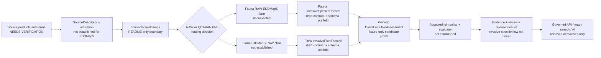

<!-- [KFM_META_BLOCK_V2]
doc_id: kfm://doc/architecture/cross-domain-invasives
title: Cross-Domain Invasives — Architecture and Current Implementation Boundary
type: architecture
version: v2.0.0
status: draft; repository-grounded; implementation-partial; join-policy-inactive; sources-inactive; non-publisher
owners:
  - "@bartytime4life"
created: 2026-05-24
updated: 2026-08-18
policy_label: public
owning_root: docs/
responsibility: Explain how KFM preserves Fauna and Flora authority, source role, evidence, rights, sensitivity, review, release, correction, and public-boundary controls when invasive-species records participate in cross-domain work.
base_commit: 93c58960fa18214148e576901adfdcc93f1bd5f7
prior_blob: 76d30414b1bc02820f6989946e316b886bd94731
directory_governance: ADR-0029 adopts docs/doctrine/directory-rules.md as the sole writable human Directory Rules authority; this existing same-path architecture page remains explanatory only.
truth_posture: CONFIRMED current repository evidence; PROPOSED invasive-specific integration architecture; UNKNOWN production behavior unless explicitly identified below
related:
  - ../doctrine/directory-rules.md
  - ../adr/ADR-0029-adopt-directory-governance-standard-v2.md
  - ./TRUST_MEMBRANE.md
  - ./cross-lane-join-policy.md
  - ./critical-asset-exposure.md
  - ./contract-schema-policy-split.md
  - ../../control_plane/cross_domain_seam_register.yaml
  - ../../control_plane/source_authority_register.yaml
  - ../../contracts/domains/fauna/invasive_species_record.md
  - ../../contracts/domains/flora/invasive_plant_record.md
  - ../../schemas/contracts/v1/domains/fauna/invasive_species_record.schema.json
  - ../../schemas/contracts/v1/domains/flora/invasive_plant_record.schema.json
  - ../../connectors/eddmaps/README.md
  - ../../policy/joins/README.md
  - ../../contracts/joins/cross_lane_join_assessment.md
  - ../../schemas/contracts/v1/joins/cross_lane_join_assessment.schema.json
  - ../../schemas/contracts/v1/policy/policy_decision.schema.json
  - ../../tools/joins/join_candidates.py
  - ../../fixtures/contracts/v1/joins/cross_lane_join_assessment/cases.json
  - ../../tests/joins/test_join_candidates.py
  - ../../.github/workflows/cross-lane-join-assessment.yml
tags: [kfm, architecture, invasives, fauna, flora, cross-domain, cross-lane, source-role, evidence, sensitivity, rights, non-publisher]
notes:
  - "@bartytime4life is the only verified CODEOWNERS review route. Fauna, Flora, source, sensitivity, join-policy, and release stewardship remain NEEDS VERIFICATION."
  - "The current invasive-species semantic contracts are draft documents and their paired schemas are empty permissive scaffolds; field-level machine enforcement is not established."
  - "The EDDMapS connector lane is README-only, the source-authority register has no entries, and no EDDMapS SourceDescriptor or live activation is established."
  - "The generic cross-lane candidate assessment is deterministic, fixture-only, no-network, no-write, and non-publishing. No invasive-specific pair profile, active join policy, or public release path was found in the bounded inspection."
[/KFM_META_BLOCK_V2] -->

<a id="top"></a>

# Cross-Domain Invasives — Architecture and Current Implementation Boundary

> **Operating rule.** Fauna owns animal invasive-species meaning; Flora owns invasive-plant meaning. Cross-domain work may emit a reviewable candidate only while every endpoint keeps its domain authority, source role, evidence reference, temporal and spatial support, rights posture, and strictest applicable sensitivity. A candidate is never relationship truth, policy approval, release approval, an alert, management instruction, or publication.


| Field | Current bounded result |
|---|---|
| **Evidence snapshot** | `main@93c58960fa18214148e576901adfdcc93f1bd5f7` |
| **Architecture page** | **CONFIRMED** at this path; explanatory authority only |
| **Fauna object meaning** | Draft [`InvasiveSpeciesRecord`](../../contracts/domains/fauna/invasive_species_record.md) semantic contract |
| **Flora object meaning** | Draft [`InvasivePlantRecord`](../../contracts/domains/flora/invasive_plant_record.md) semantic contract |
| **Machine shape** | Both paired domain schemas are **PROPOSED permissive scaffolds** with no declared properties or required fields |
| **Source intake** | [`connectors/eddmaps/`](../../connectors/eddmaps/README.md) is README-only; no connector implementation, product SourceDescriptor, or activation is established |
| **Cross-domain seam authority** | The machine seam register is partial and review-only; no invasive-specific Fauna–Flora seam is registered |
| **Candidate assessment** | A generic, synthetic, no-network `CrossLaneJoinAssessment` exists; no invasive-specific profile was found |
| **Join policy** | [`policy/joins/`](../../policy/joins/README.md) is documented but inactive; ADR-S-14 remains unresolved |
| **Public/release path** | **UNKNOWN / not proven complete** for invasive derivatives |
| **Review route** | `@bartytime4life` through `CODEOWNERS`; independent and domain-specialist review remain **NEEDS VERIFICATION** |

> [!IMPORTANT]
> **Do not read this page as activated invasive policy or current public-product proof.** It explains the architecture that an invasive-specific implementation must satisfy and records the repository surfaces that actually exist. It does not create a source descriptor, source activation, relationship contract, policy decision, review record, evidence bundle, release manifest, rollback card, API route, map layer, alert, or management plan.

> [!CAUTION]
> The generic join helper's `ALLOW` outcome means only **“emit a reviewable `CANDIDATE_RELATION` assessment.”** It does not mean the invasive relationship is true, the source is authoritative, a policy family allowed the use, evidence closure exists, reviewers approved it, or public exposure is permitted.

## Quick jump

- [1. Purpose](#1-purpose)
- [2. Scope and repo fit](#2-scope-and-repo-fit)
- [3. Authority and standing](#3-authority-and-standing)
- [4. What KFM calls an invasive](#4-what-kfm-calls-an-invasive)
- [5. The invasives architecture overview](#5-the-invasives-architecture-overview)
- [6. Domain ownership — Fauna and Flora](#6-domain-ownership--fauna-and-flora)
- [7. Cross-lane joins — the eight cross-cutting paths](#7-cross-lane-joins--the-eight-cross-cutting-paths)
- [8. Source-role anti-collapse for invasives](#8-source-role-anti-collapse-for-invasives)
- [9. Sensitivity and exposure architecture](#9-sensitivity-and-exposure-architecture)
- [10. Management framing vs instruction — the line KFM does not cross](#10-management-framing-vs-instruction--the-line-kfm-does-not-cross)
- [11. Cross-lane joins as governed projections](#11-cross-lane-joins-as-governed-projections)
- [12. Public products](#12-public-products)
- [13. Anti-patterns](#13-anti-patterns)
- [14. Tensions and known limits](#14-tensions-and-known-limits)
- [15. Open questions](#15-open-questions)
- [16. Related docs](#16-related-docs)
- [Appendix A — Cross-lane invasive scenarios matrix](#appendix-a--cross-lane-invasive-scenarios-matrix)
- [Appendix B — Source-role anti-collapse worked example](#appendix-b--source-role-anti-collapse-worked-example)

---

## 1. Purpose

This page explains how invasive-species material can participate in KFM without creating a new sovereign “Invasives” domain or allowing a cross-domain join to erase the meaning, limits, or governance of its inputs.

The current repository establishes two separate semantic families:

- Fauna's [`InvasiveSpeciesRecord`](../../contracts/domains/fauna/invasive_species_record.md) for animal invasive, nuisance, prohibited, regulated, watch-list, or management-relevant taxon context.
- Flora's [`InvasivePlantRecord`](../../contracts/domains/flora/invasive_plant_record.md) for invasive-plant occurrence, status, spread, survey, treatment-record, model, aggregate, and candidate context.

Both contracts are drafts. Both explicitly reject treatment or enforcement authority, direct public exposure of sensitive or private context, and source-role collapse. Their machine schemas remain permissive scaffolds, so this page must not imply field-level enforcement that the repository does not yet provide.

This page therefore has three jobs:

1. **Preserve domain ownership.** Animal and plant meaning remain with Fauna and Flora.
2. **Define the cross-domain safety boundary.** Source role, evidence, rights, sensitivity, time, space, and release state remain visible through any candidate or derivative.
3. **Bound current maturity.** Existing generic join tooling is fixture-first and non-publishing; invasive-specific source, join-policy, release, API, and map behavior remain incomplete or unverified.

### 1.1 Non-effects

This page does **not**:

- create a unified `InvasiveRecord` object family;
- admit an “invasives” domain or repository root;
- activate EDDMapS or any other source;
- choose a current jurisdictional invasive-species list;
- declare a detection, establishment, spread, impact, treatment, or eradication fact;
- activate [`policy/joins/`](../../policy/joins/README.md) or accept ADR-S-14;
- add `joins` to the current `PolicyDecision.policy_family` enum;
- make the generic join-candidate helper an invasive relationship authority;
- authorize a public layer, search index, graph edge, export, Focus Mode answer, alert, treatment recommendation, release, deployment, promotion, or publication.

[Back to top](#top)

---

## 2. Scope and repo fit

### 2.1 Responsibility signature

| Axis | Current classification |
|---|---|
| `artifact_kind` | Human architecture document |
| `authority_owner` | `docs/` explanatory architecture |
| `scope_kind` | Cross-domain seam: invasive-species use across independently governed lanes |
| `exposure` | Public documentation; no sensitive source payloads or operational coordinates |
| `mutability` | Versioned replacement at the existing tracked path |
| `placement_outcome` | `PLACE` — same-path modernization under accepted Directory Rules |
| `authority_not_held` | Domain meaning, machine shape, policy source, source activation, evidence instances, review decisions, release decisions, runtime behavior, or publication |

Accepted [ADR-0029](../adr/ADR-0029-adopt-directory-governance-standard-v2.md) makes [Directory Rules v2](../doctrine/directory-rules.md) the placement authority. This file remains at `docs/architecture/` because it explains how multiple responsibility roots and bounded domain contexts compose. It does not create a new root, lane, policy family, or schema home.

### 2.2 Current repository evidence

| Surface | Confirmed state at the evidence snapshot | Safe interpretation |
|---|---|---|
| This file | Existing tracked page; prior blob `76d30414b1bc02820f6989946e316b886bd94731` | Same-path semantic modernization; rollback is one-file revert. |
| Directory governance | ADR-0029 is accepted and pins `docs/doctrine/directory-rules.md` as the writable authority | Placement is settled for this edit; invasive policy and source admission are not. |
| Fauna contract | [`contracts/domains/fauna/invasive_species_record.md`](../../contracts/domains/fauna/invasive_species_record.md), draft v0.2 | Semantic expectations exist; machine enforcement and release behavior remain incomplete. |
| Flora contract | [`contracts/domains/flora/invasive_plant_record.md`](../../contracts/domains/flora/invasive_plant_record.md), draft v0.2 | Semantic expectations exist; machine enforcement and release behavior remain incomplete. |
| Fauna schema | [`invasive_species_record.schema.json`](../../schemas/contracts/v1/domains/fauna/invasive_species_record.schema.json) has no properties and `additionalProperties: true` | It does not validate the contract's recommended fields. |
| Flora schema | [`invasive_plant_record.schema.json`](../../schemas/contracts/v1/domains/flora/invasive_plant_record.schema.json) has no properties and `additionalProperties: true` | It does not validate the contract's recommended fields. |
| EDDMapS connector | [`connectors/eddmaps/README.md`](../../connectors/eddmaps/README.md) is the only confirmed connector-lane file | No fetcher, parser, package, tests, fixture contract, credentials, product binding, or runtime route is established. |
| Source authority | [`control_plane/source_authority_register.yaml`](../../control_plane/source_authority_register.yaml) is `PROPOSED` with `entries: []` | No source obtains authority or activation through this register today. |
| Raw routing | A Fauna EDDMapS RAW README exists; no EDDMapS-specific Flora RAW child was established in the connector review | Do not dual-write or infer a Flora route. Unresolved material belongs in governed quarantine. |
| Seam projection | [`cross_domain_seam_register.yaml`](../../control_plane/cross_domain_seam_register.yaml) is partial, `PROPOSED`, review-only, and lists five `HOLD_UNRESOLVED` seams | No invasive Fauna–Flora seam is registered; the Fauna–Hydrology seam is not authorized for public use. |
| Candidate contract/schema/helper | Generic fixture-first [`CrossLaneJoinAssessment`](../../contracts/joins/cross_lane_join_assessment.md), closed schema, helper, fixtures, tests, and workflow exist | They prove a bounded candidate-assessment profile, not invasive relation truth or policy. |
| Invasive-specific candidate profile | Bounded repository search found no invasive `CrossLaneJoinAssessment` profile, fixture family, helper, or workflow | Invasive candidate behavior remains **ABSENT / PROPOSED**. |
| Join policy | [`policy/joins/`](../../policy/joins/README.md) contains documentation and pair-routing children but no executable bundle or evaluator | Generic join policy is inactive. |
| Outward policy schema | [`PolicyDecision`](../../schemas/contracts/v1/policy/policy_decision.schema.json) allows six policy families and excludes `joins` | A join-family `PolicyDecision` is currently schema-invalid. |
| Public/release integration | No complete invasive-specific evidence, review, release, correction, rollback, API, map, search, export, or AI flow was established by the inspected surfaces | Remains **UNKNOWN / NEEDS VERIFICATION**. |

### 2.3 What belongs elsewhere

| Concern | Owning surface |
|---|---|
| Animal invasive-species meaning | [`contracts/domains/fauna/invasive_species_record.md`](../../contracts/domains/fauna/invasive_species_record.md) |
| Invasive-plant meaning | [`contracts/domains/flora/invasive_plant_record.md`](../../contracts/domains/flora/invasive_plant_record.md) |
| Machine shape | [`schemas/contracts/v1/domains/fauna/`](../../schemas/contracts/v1/domains/fauna/) and [`schemas/contracts/v1/domains/flora/`](../../schemas/contracts/v1/domains/flora/) |
| Source-specific access and parsing | [`connectors/eddmaps/`](../../connectors/eddmaps/README.md) or another accepted source connector |
| Source identity, role, rights, cadence, citation, activation | `data/registry/sources/` plus accepted source-admission controls |
| Relationship/candidate meaning | [`contracts/joins/`](../../contracts/joins/) or an accepted relation contract |
| Join-candidate machine shape | [`schemas/contracts/v1/joins/`](../../schemas/contracts/v1/joins/) |
| Operation-specific join admissibility | [`policy/joins/`](../../policy/joins/README.md) after acceptance and evaluator binding |
| Validation | [`tools/joins/`](../../tools/joins/) and [`tests/joins/`](../../tests/joins/) |
| Evidence, receipts, proofs, catalog, release, correction, rollback | Their existing responsibility and lifecycle roots |
| Public API, map, search, export, and AI | Governed applications consuming released derivatives only |

The former proposal to create `policy/invasives/`, `tests/invasives/`, or `fixtures/invasives/` as parallel topic homes is **not current repository authority**. Any new family must first satisfy Directory Rules, existing-root reuse, overlap analysis, and the applicable ADR trigger.

[Back to top](#top)

---

## 3. Authority and standing

A cross-domain invasive feature may touch many roots, but each artifact keeps one authority owner.

| Concern | Owning authority | Cross-domain rule |
|---|---|---|
| Animal taxon and invasive-record meaning | Fauna contracts and accepted Fauna domain authority | Flora, Agriculture, Hydrology, Hazards, and UI surfaces may cite; they may not rewrite Fauna meaning. |
| Plant taxon and invasive-record meaning | Flora contracts and accepted Flora domain authority | Fauna, Habitat, Agriculture, Hydrology, Archaeology, and UI surfaces may cite; they may not rewrite Flora meaning. |
| Source identity and role | SourceDescriptor and source-admission authorities | A portal, list, survey, model, aggregate, or management record keeps its own role and limits. |
| Relationship meaning | An accepted join/relation/domain contract | Spatial or key matching cannot invent semantics. |
| Candidate computation | Bounded tooling such as `tools/joins/` | A helper may propose a candidate; it may not create truth or policy. |
| Admissibility | Accepted policy source and evaluator | Current `policy/joins/` lane is inactive. |
| Evidence | EvidenceRef/EvidenceBundle and proof authorities | Endpoint support and relationship support remain separately resolvable. |
| Sensitivity and rights | Applicable policy families and qualified review | The derivative inherits the strictest endpoint posture and may become more restrictive through composition. |
| Review | Governed review record and accountable routes | CODEOWNERS routing is not proof of review or approval. |
| Release/correction/rollback | `release/` and the appropriate accountability roots | No contract, validator, policy result, issue, branch, or pull request substitutes for release closure. |
| Public delivery | Governed API and released-carrier surfaces | Public clients never consume RAW, WORK, QUARANTINE, candidate, or direct source stores. |

> [!IMPORTANT]
> **Six different claims must remain separate:** endpoint validity, invasive-status validity, occurrence validity, relationship validity, policy admissibility, and release approval. Proving any one does not prove the others.

### 3.1 Review standing

[`CODEOWNERS`](../../.github/CODEOWNERS) routes repository review to `@bartytime4life`, the only verified named owner. That routing does not prove Fauna, Flora, source, rights, sensitivity, join-policy, legal, cultural, or independent release review. Those roles remain **NEEDS VERIFICATION** and must not be invented in this page or a pull request.

[Back to top](#top)

---

## 4. What KFM calls an invasive

The current repository does not define one cross-domain `InvasiveRecord`. It defines two draft, domain-owned semantic records with related but non-identical responsibilities.

| Object family | Owning domain | Current bounded meaning | Current enforcement |
|---|---|---|---|
| `InvasiveSpeciesRecord` | Fauna | Source-bound evidence or governed context about a non-native, invasive, nuisance, prohibited, regulated, watch-list, or management-relevant animal taxon | Draft semantic contract; permissive schema scaffold |
| `InvasivePlantRecord` | Flora | Evidence-bound invasive-plant occurrence, infestation, survey, status, spread, treatment-record, model, aggregate, candidate, or management context | Draft semantic contract; permissive schema scaffold |

### 4.1 Three claims that must remain distinct

1. **Taxon identity** — what biological subject the source means.
2. **Status or designation** — whether a named authority or source classifies that subject as invasive, regulated, noxious, prohibited, watch-list, managed, or otherwise concern-worthy for a stated jurisdiction and time.
3. **Place-time occurrence or condition** — whether evidence supports presence, non-detection, infestation, abundance, impact, or treatment at a particular spatial and temporal support.

A valid answer may require all three. None substitutes for another.

### 4.2 Current anti-collapse semantics

The domain contracts already support these durable rules:

- A regulatory or administrative list does not prove occurrence at a place and time.
- A single detection does not automatically prove establishment, spread, abundance, or impact.
- A modeled risk or suitability surface is not an observation.
- An aggregate is not a precise occurrence.
- A treatment or management record proves an action was recorded; it does not automatically prove current presence.
- A survey non-detection is not biological absence unless method, effort, season, support, and limits justify that claim.
- A public-safe geometry is a released derivative, not canonical exact support.
- A candidate report is not a confirmed occurrence.

### 4.3 What an invasive record is not

An invasive record is not, by itself:

- a legal determination outside its cited authority and jurisdiction;
- source admission or rights clearance;
- treatment, control, eradication, pesticide, dosage, timing, or operational advice;
- an emergency or regulatory alert;
- permission to expose a private parcel, sensitive taxon, monitoring site, cultural site, or critical asset;
- a release decision, public map layer, graph edge, AI answer, or publication record.

[Back to top](#top)

---

## 5. The invasives architecture overview

The diagram distinguishes confirmed repository surfaces from proposed or unproven transitions. Dashed arrows are not implemented-flow claims.



### 5.1 Read the diagram conservatively

- The source documentation and connector README do not establish current upstream terms, access, payloads, or source activation.
- The documented Fauna RAW child is a placement surface, not proof of payload presence or a running connector.
- The Flora EDDMapS RAW child is not established and must not be created or inferred through this document.
- Domain contracts provide semantic expectations; their permissive schemas do not enforce those expectations.
- The generic join assessment can evaluate synthetic candidates only. It has no invasive pair profile and creates no lifecycle, evidence, policy, review, release, or publication effects.
- No dashed arrow authorizes implementation, source access, or public exposure.

[Back to top](#top)

---

<a id="6-domain-ownership--fauna-and-flora"></a>

## 6. Domain ownership — Fauna and Flora

### 6.1 Fauna owns the animal side

Fauna owns the meaning of its animal taxon, occurrence, invasive-status context, monitoring, and sensitivity records. A cross-domain derivative may reference those objects but must not copy them into another domain as a competing authority.

Current invasive-specific surfaces:

- [`contracts/domains/fauna/invasive_species_record.md`](../../contracts/domains/fauna/invasive_species_record.md)
- [`schemas/contracts/v1/domains/fauna/invasive_species_record.schema.json`](../../schemas/contracts/v1/domains/fauna/invasive_species_record.schema.json)
- [`data/raw/fauna/eddmaps/README.md`](../../data/raw/fauna/eddmaps/README.md)
- [`data/registry/sources/fauna/README.md`](../../data/registry/sources/fauna/README.md)
- [`policy/sensitivity/fauna/`](../../policy/sensitivity/fauna/)

The contract is draft, the schema is a scaffold, and no EDDMapS source admission or runtime path is established.

### 6.2 Flora owns the plant side

Flora owns plant taxon identity, occurrence, survey, infestation, invasive-status, spread, management-record, habitat-association, and public-safe plant-side meaning.

Current invasive-specific surfaces:

- [`contracts/domains/flora/invasive_plant_record.md`](../../contracts/domains/flora/invasive_plant_record.md)
- [`schemas/contracts/v1/domains/flora/invasive_plant_record.schema.json`](../../schemas/contracts/v1/domains/flora/invasive_plant_record.schema.json)
- [`data/registry/sources/flora/README.md`](../../data/registry/sources/flora/README.md)
- [`policy/sensitivity/flora/`](../../policy/sensitivity/flora/)

No EDDMapS-specific Flora RAW child, source descriptor, connector route, or runtime implementation was established by the inspected connector boundary.

### 6.3 No third domain or object family

KFM currently has no:

- root-level `invasives/` authority;
- `docs/domains/invasives/` bounded context;
- unified `InvasiveRecord` semantic contract;
- invasive-specific join schema or pair profile;
- active invasive policy bundle;
- invasive-specific release authority.

A cross-domain artifact can live under an existing cross-domain responsibility family only after its one authority owner, semantics, machine shape, policy boundary, review route, and rollback path are established. Topic importance does not create a new home.

[Back to top](#top)

---

<a id="7-cross-lane-joins--the-eight-cross-cutting-paths"></a>

## 7. Cross-lane joins — the eight cross-cutting paths

The prior edition presented eight paths as if their governed join architecture were established. Current repository evidence supports a narrower conclusion: one relevant generic seam is registered as `HOLD_UNRESOLVED`; the remaining invasive-specific pairs are design candidates, not active joins.

### 7.1 Current machine seam evidence

| Seam | Current register state | Invasive relevance | Public effect |
|---|---|---|---|
| `fauna--hydrology--aquatic-occurrence-context` | `HOLD_UNRESOLVED`; `public_join_allowed: false` | Can contextualize an aquatic animal occurrence by hydrologic-unit or reach identity | None; candidate/review context only |
| Fauna–Flora invasive context | No entry in the partial seam register | Could compare or relate animal and plant invasive context without merging domains | Not authorized |
| Flora–Habitat invasive context | No entry in the partial seam register | Could relate plant records to habitat context | Not authorized |
| Fauna–Agriculture pest context | No entry in the partial seam register | Could relate animal taxon identity to separately supported agricultural impact | Not authorized |
| Flora–Agriculture invasive-plant context | No entry in the partial seam register | Could relate plant identity/status to separately supported agricultural context | Not authorized |
| Fauna/Flora–Hazards context | No invasive-specific entry | Could cite disease, wildfire, flood, drought, or other hazard context without collapsing roles | Not authorized |
| Fauna/Flora–Settlements/Infrastructure context | No invasive-specific entry | Could create composition risk around private parcels or critical assets | Not authorized |
| Flora–Archaeology context | No invasive-specific entry | Could create sensitive-location and cultural inference risk | Not authorized |

The table is a **verification and design backlog**, not a declared relation catalog. A future seam must have explicit endpoint authority, relationship semantics, relation evidence, policy input profile, finite outcomes, sensitivity composition, correction behavior, and release non-effects before it can move beyond `HOLD`.

### 7.2 The aquatic invasive special case

The current seam register allocates:

- occurrence evidence, species sensitivity, and taxon identity to Fauna;
- hydrologic-unit identity, reach identity, and water-observation context to Hydrology.

It prohibits two inferences:

- treating an aquatic occurrence as an established population; and
- treating a public HUC as the precise location of a sensitive occurrence.

That seam is still `HOLD_UNRESOLVED`. This page must not upgrade it to an invasive public layer or policy profile.

[Back to top](#top)

---

## 8. Source-role anti-collapse for invasives

The current generic join schema constrains endpoint source roles to seven values. That vocabulary is **CONFIRMED for the fixture-first `CrossLaneJoinAssessment` profile**; global adoption and domain-specific interpretation remain governance work.

| Role | Bounded meaning | Invasive guardrail |
|---|---|---|
| `OBSERVED` | Direct evidentiary record tied to stated method, place, time, scale, and uncertainty | Do not infer establishment, spread, impact, or regulatory status beyond support. |
| `REGULATORY` | Determination or designation with administrative or legal force | Do not present a list or designation as place-time occurrence. |
| `MODELED` | Derived prediction, suitability, spread, or risk output | Preserve model identity, inputs, uncertainty, and run support; never relabel as observed. |
| `AGGREGATE` | Summary over a unit or interval with record-level detail removed | Do not project to a parcel, point, individual report, or single event. |
| `ADMINISTRATIVE` | Compiled registration, inspection, treatment, management, or accounting record | Preserve documentary caveats; do not substitute for observation or current status. |
| `CANDIDATE` | Unresolved report or pre-authority object requiring evidence and review | Never expose as released invasive truth. |
| `SYNTHETIC` | Generated, reconstructed, or simulation-only object | Carry a reality-boundary disclosure; never present as observed reality. |

### 8.1 Role is not source quality

A role states what kind of claim a source can support. It does not by itself decide identification quality, methodology quality, authority rank, rights, currentness, or release fitness. For example, two `OBSERVED` records may have very different methods and review states. Those differences belong in source descriptors, evidence, validation, and review—not in a hidden role upgrade.

### 8.2 Required anti-collapse controls

An invasive-specific candidate profile must:

1. preserve each endpoint's `source_descriptor_ref`, `source_role`, `evidence_ref`, valid interval, geometry precision, and sensitivity;
2. reject missing endpoint evidence for a positive candidate;
3. keep status/designation evidence separate from occurrence evidence;
4. require independent relationship support before a candidate becomes a governed derivative;
5. retain aggregation scale and model uncertainty;
6. prevent administrative or treatment records from becoming occurrence facts;
7. keep candidate and synthetic records out of public truth surfaces;
8. record corrections and invalidate dependent candidates or derivatives when an input changes.

### 8.3 Current evidence limitation

The generic candidate schema can require endpoint references and emit finite outcomes, but its `effects` object is locked to `false` for lifecycle writes, evidence-bundle creation, policy decisions, review decisions, release decisions, publication, and public-use authorization. That is the correct current boundary.

[Back to top](#top)

---

## 9. Sensitivity and exposure architecture

Sensitivity is not a permanent property of a species name. It is a claim-specific result of source rights, place, time, geometry, audience, private or steward context, other joined records, and release state.

### 9.1 Current supported rules

The current domain contracts support these conservative rules:

- public reporting may be possible for released, rights-cleared, public-safe invasive records;
- private-parcel or landowner detail requires aggregation, redaction, staged access, or denial;
- sensitive taxa, exact sensitive occurrences, monitoring sites, disease context, steward-controlled records, culturally sensitive context, and re-identifying joins remain fail-closed;
- a public-safe derivative must not replace canonical exact support;
- a cross-domain result inherits at least the strictest endpoint posture;
- composition may create a more restrictive result than either endpoint alone;
- aggregation or generalized geometry does not automatically lower sensitivity;
- unclear rights, consent, source terms, role, geometry, or release state returns `ABSTAIN`, `DENY`, `HOLD`, or `ERROR` rather than an optimistic allow.

### 9.2 What is not established

This page does not establish operational `T0`–`T4` defaults for invasive classes. It also does not establish an early-detection threshold, embargo period, minimum aggregation cell count, private-parcel suppression rule, or public-record exception. Those require accepted policy, domain/source review, deterministic fixtures, and enforceable tests.

### 9.3 Composition-aware examples

| Composition | Required posture |
|---|---|
| Public regulatory list + restricted occurrence | Result remains restricted; the public list does not launder occurrence sensitivity. |
| Generalized waterbody + exact sensitive occurrence | Result cannot expose the exact occurrence through map, search, popup, export, or AI inference. |
| Public invasive record + private agricultural impact | Private operator/parcel/impact detail remains protected. |
| Public plant record + archaeological context | Archaeology's location and cultural controls dominate the joint use. |
| Public county aggregate + critical-asset condition | Critical-asset precision and vulnerability controls dominate. |
| Two individually public records whose combination identifies a private party or sensitive site | Composition risk may require a stricter result than either input. |

[Back to top](#top)

---

<a id="10-management-framing-vs-instruction--the-line-kfm-does-not-cross"></a>

## 10. Management framing vs instruction — the line KFM does not cross

Both current invasive semantic contracts reject treatment, control, eradication, enforcement, quarantine, and emergency-alert authority. This is an architectural boundary, not merely an editorial preference.

### 10.1 Allowed public posture after governed release

A released KFM surface may:

- state what a cited source or authority classifies, observed, modeled, summarized, or recorded;
- distinguish regulatory status from occurrence evidence;
- expose released spatial and temporal support at the approved precision;
- explain uncertainty, limitations, stale state, and correction state;
- identify the responsible source-of-record or official authority from released evidence;
- provide management **context** and links to authoritative material without converting them into a KFM instruction.

### 10.2 Disallowed posture

KFM must not generate or present:

- treatment product, dosage, timing, application, removal, eradication, or control instructions;
- a site-specific management plan;
- an enforcement, inspection, quarantine, legal-compliance, or landowner-notification order;
- an emergency, disease, regulatory, or eradication alert on KFM's own authority;
- an instruction inferred from a join, model, aggregate, or AI response;
- a guarantee that an official authority will take a particular action.

### 10.3 API and governed-AI consequence

A future invasive-capable governed API or Focus Mode must have deterministic negative tests for instruction-seeking prompts and unsafe map actions. The safe runtime outcome is a bounded `ABSTAIN` or `DENY` that explains KFM's scope and points to a released source-of-record reference when one exists. Exact response copy, runtime wiring, and official-authority routing remain **PROPOSED** until contracts, policy, fixtures, tests, and a released consumer prove them.

[Back to top](#top)

---

## 11. Cross-lane joins as governed projections

### 11.1 What the current helper proves

The current generic fixture profile proves a bounded local assessment with:

- exact-key or synthetic spatial-temporal predicates;
- two explicit domain endpoints;
- source descriptor references, source roles, evidence references, sensitivity, geometry precision, and valid intervals;
- finite validator outcomes `ALLOW`, `DENY`, `ABSTAIN`, and `ERROR`;
- an output role fixed to `CANDIDATE_RELATION`;
- inherited sensitivity;
- no network, in-memory SQLite, deterministic identity, and no lifecycle writes;
- no identity, relationship-truth, policy, review, release, or publication authority.

It does **not** prove an invasive-specific relation profile, source rights, real geometry behavior, EvidenceBundle resolution, review, policy, release, correction propagation, or public consumption.

### 11.2 Required progression for an invasive derivative

```text
Domain-owned endpoint records
  -> source identity, rights, role, evidence, time, space, sensitivity
  -> invasive-specific relationship contract and fixture profile
  -> deterministic candidate assessment
  -> independent relationship evidence
  -> accepted policy source + evaluator + finite policy decision
  -> accountable multi-domain / sensitivity review
  -> derived artifact + transform/aggregation/redaction receipts
  -> proof and catalog closure
  -> release manifest + correction and rollback targets
  -> governed API / released map, search, export, or AI surface
```

Every arrow is a separate governed transition. The current repository proves only portions of the endpoint-semantic and generic candidate-assessment layers.

### 11.3 Minimum invasive-specific candidate profile

A future profile should, at minimum, bind:

| Requirement | Why it is needed |
|---|---|
| Named relation semantics and version | A matching predicate must have meaning. |
| Fauna/Flora or other domain endpoint refs | Domain authority must remain visible. |
| Product-specific SourceDescriptor refs | Source role, rights, cadence, citation, and activation must be explicit. |
| Separate status, occurrence, and relationship evidence refs | One claim cannot stand in for the others. |
| Valid-time and source/retrieval-time posture | Old or revised invasive records must not appear current by default. |
| Spatial support and public geometry | Exact support and released representation must remain distinct. |
| Sensitivity and composition-risk inputs | The derivative can be stricter than each endpoint. |
| Finite candidate outcomes and reason codes | Missing support must fail closed. |
| Non-effects block | Candidate assessment must not write lifecycle state or authorize public use. |
| Correction dependency list | Input correction, withdrawal, or reclassification must invalidate the candidate. |

### 11.4 Policy boundary remains inactive

`policy/joins/` has no local executable policy source, accepted bundle, selector, evaluator, or decision emitter. The current `PolicyDecision` schema does not allow `policy_family: joins`. No invasive-specific implementation may claim a join policy decision until that authority and shape are accepted and wired through an independently reviewed change.

[Back to top](#top)

---

## 12. Public products

No invasive-specific public product was proven complete by the inspected contracts, schemas, connector, source register, seam register, policy lane, candidate helper, tests, workflow, or release surfaces.

### 12.1 Required public boundary

A future invasive map, API, search result, export, graph projection, Story Node, or Focus Mode answer must:

- consume only released, public-safe derivatives through governed interfaces;
- preserve domain ownership and source-role labels;
- show observation, regulation, model, aggregate, administrative, candidate, and synthetic distinctions where relevant;
- expose spatial and temporal support, uncertainty, stale state, and correction state;
- resolve claim evidence or return `ABSTAIN`;
- enforce rights, sensitivity, and composition obligations before serialization;
- prevent restricted details from leaking through popups, filters, tile attributes, search snippets, exports, URLs, logs, cache keys, or AI synthesis;
- preserve release identity and correction lineage in exports;
- avoid alert styling, imperative language, or treatment recommendations unless the content is a clearly attributed released artifact from the responsible authority and KFM remains a carrier rather than the issuer.

### 12.2 Finite outward outcomes

| Outcome | Invasive use |
|---|---|
| `ANSWER` | Released evidence supports the bounded claim; policy and citation checks pass. |
| `ABSTAIN` | Evidence, time, scope, relation support, or source role is insufficient or unresolved. |
| `DENY` | Rights, sensitivity, private-parcel, cultural, critical-asset, source-term, instruction, or audience controls block exposure. |
| `ERROR` | Resolver, validator, policy evaluator, release lookup, or runtime dependency failed; never fall back to unsafe allow. |

### 12.3 Product status vocabulary

Until an actual released product exists, use precise labels such as:

- `PROPOSED public layer`;
- `candidate assessment only`;
- `source inactive`;
- `schema scaffold`;
- `policy inactive`;
- `release not proven`;
- `public use not authorized`.

Do not use `implemented`, `published`, `live`, `authoritative`, or `alert` merely because a README, schema filename, candidate fixture, map concept, or workflow exists.

[Back to top](#top)

---

## 13. Anti-patterns

| Anti-pattern | Why it fails | Required outcome |
|---|---|---|
| Unified `InvasiveRecord` created outside Fauna and Flora authority | Creates parallel semantic authority | `DENY` or `SPLIT` |
| New `policy/invasives/` topic home added without accepted placement and policy decision | Bypasses existing `policy/joins/` boundary and may create parallel policy authority | `HOLD` / ADR and overlap review |
| EDDMapS documentation treated as an active source | README and catalog scaffolds do not prove terms, descriptor, access, code, or activation | `ABSTAIN` / source admission required |
| One source capture dual-written into Fauna and Flora | Duplicates source authority and correction lineage | Preserve one admitted capture; create governed domain candidates |
| Regulatory list treated as occurrence | Status/designation does not prove place-time presence | `DENY` claim |
| Model or aggregate presented as observed point | Source-role and support collapse | `DENY` / relabel and re-render |
| Treatment record treated as current occurrence | Administrative action does not automatically prove current presence | `ABSTAIN` unless separate occurrence support resolves |
| Single detection treated as established population or impact | Overclaims evidence | Narrow claim or `ABSTAIN` |
| Generic helper `ALLOW` treated as policy or release allow | Candidate assessment has all effects locked false | `DENY` escalation |
| Join endpoint evidence used as relationship evidence | Endpoint validity does not prove the relation | `ABSTAIN` / add relation support |
| Public geometry used as canonical exact truth | Released carrier replaces source support | `DENY` authority collapse |
| Aggregation used to lower sensitivity automatically | Composition risk and re-identification remain possible | Independent policy and transform proof required |
| Early or private detection exposed through map inference | Sensitive response or private-parcel detail may be reconstructed | `DENY`, redact, generalize, stage, or delay |
| Treatment or eradication instruction generated by API or AI | Exceeds KFM authority and may create safety/legal risk | `ABSTAIN` or `DENY` with source-of-record redirection |
| Invasive public layer claimed because an architecture page names it | Documentation is not runtime or release proof | `UNKNOWN` until release evidence exists |
| Correction to taxon/status/source not propagated | Dependent candidates and derivatives become stale or false | Invalidate, correct, withdraw, or roll back |

[Back to top](#top)

---

## 14. Tensions and known limits

### 14.1 Current closure matrix

| Capability | Current state | Evidence needed to close |
|---|---|---|
| Fauna invasive semantics | `PARTIAL` — draft contract | Reviewed fielded schema, fixtures, validator, source and policy bindings |
| Flora invasive semantics | `PARTIAL` — draft contract | Reviewed fielded schema, fixtures, validator, source and policy bindings |
| EDDMapS source admission | `ABSENT / HOLD` | Product-specific source descriptor, current terms/rights verification, fixture, connector, admission tests, explicit activation decision |
| Cross-domain source capture routing | `CONFLICTED / NEEDS DECISION` | One-capture routing contract, domain candidate transforms, quarantine behavior, correction lineage |
| Invasive relation semantics | `ABSENT` | Accepted join/relation contract with versioned predicates and evidence requirements |
| Invasive candidate assessment | `ABSENT` | Synthetic pair fixture profile, schema binding, helper tests, no-network/no-write proof |
| Generic join candidate tooling | `IMPLEMENTED, BOUNDED` | Already proves its fixture profile only; does not close invasive behavior |
| Join policy | `INACTIVE` | ADR-S-14 disposition, accepted rule source, selector/evaluator, native tests, decision binding |
| Join `PolicyDecision` family | `ABSENT` | Reviewed schema/contract evolution and compatibility fixtures |
| EvidenceBundle resolution for invasive joins | `UNKNOWN` | Resolver integration, endpoint and relation evidence fixtures, fail-closed tests |
| Sensitivity composition | `PROPOSED` | Accepted policy, representative negative fixtures, reviewer accountability |
| Review/release/correction/rollback | `UNKNOWN` | Review records, proof/catalog closure, release manifest, rollback and correction rehearsal |
| Governed public products | `UNKNOWN / NOT PROVEN` | Released API/map/search/export/AI fixtures and boundary tests |

### 14.2 Smallest dependency-ordered implementation slices

These are **PROPOSED follow-up slices**, not work authorized by this documentation pull request:

1. **Field one domain schema at a time.** Choose Fauna or Flora; add the smallest closed semantic-schema-fixture-validator-test set without live sources.
2. **Admit one source product on paper and in fixtures.** Verify current authoritative terms and role, create one product-specific SourceDescriptor candidate, and prove RAW/QUARANTINE routing with no network.
3. **Add one invasive-specific candidate profile.** Use synthetic public-safe endpoints and preserve the generic helper's no-effect boundary.
4. **Resolve policy authority separately.** Do not use a candidate-profile change to imply ADR-S-14 acceptance, activate a policy family, or approve release.
5. **Prove correction before public delivery.** Reclassify or withdraw one synthetic input and prove dependent candidate invalidation and release denial.

Each slice should remain independently reviewable and reversible.

### 14.3 Validation for this documentation change

The documentation update is complete only when:

- the target remains at the existing path;
- its original section and appendix anchors remain available;
- every repository-relative link resolves at the pinned base or is clearly rendered as non-link code;
- code fences, Mermaid fences, tables, details blocks, and meta block are balanced;
- no current path is mislabeled as proposed merely because the prior document lacked repo evidence;
- no absent source, policy, schema enforcement, release, or public product is mislabeled as implemented;
- no new authority root, policy family, source activation, live network behavior, release, deployment, or publication is implied.

### 14.4 Rollback

Rollback for this page is a one-file revert to prior blob `76d30414b1bc02820f6989946e316b886bd94731`. The change has no source, lifecycle, policy, runtime, release, deployment, or publication effect.

[Back to top](#top)

---

## 15. Open questions

| # | Question | Status / required authority |
|---|---|---|
| 1 | Who holds accountable Fauna, Flora, source, sensitivity, join-policy, and release stewardship beyond CODEOWNERS routing? | `NEEDS VERIFICATION` — human governance decision |
| 2 | Which invasive semantic contract should receive the first fielded schema and fixture set? | `PROPOSED` sequencing decision |
| 3 | What is the accepted global versus profile-local source-role vocabulary and evolution rule? | `NEEDS DECISION` — contract/schema governance |
| 4 | Which EDDMapS product, endpoint, terms, rights, citation, cadence, and access method are admissible? | `NEEDS VERIFICATION` — authoritative external source review plus steward decision |
| 5 | Where does one admitted mixed-domain source capture live, and how are Fauna/Flora candidates derived without dual-write? | `NEEDS DECISION` — source/lifecycle architecture |
| 6 | Does an invasive relation belong under `contracts/joins/`, `schemas/contracts/v1/joins/`, `relations/`, or a narrower accepted domain profile? | `CONFLICTED / NEEDS DECISION` — no prose shortcut |
| 7 | Which invasive seams should enter `cross_domain_seam_register.yaml`, and should they begin as `HOLD_UNRESOLVED`? | `PROPOSED` control-plane update after semantics review |
| 8 | What disposition resolves ADR-S-14 and activates or rejects generic join policy? | `OPEN` governance decision |
| 9 | Should `PolicyDecision.policy_family` gain `joins`, or should join admissibility use another accepted family/profile? | `NEEDS DECISION` — contract/schema/policy compatibility review |
| 10 | What early-detection, embargo, private-parcel, aggregation, and composition-risk rules apply by source and audience? | `NEEDS VERIFICATION` — qualified domain/rights/sensitivity review |
| 11 | What minimum relationship evidence distinguishes correlation, co-location, host association, impact, treatment, and causation? | `NEEDS DECISION` — domain and evidence contracts |
| 12 | Which correction event invalidates a candidate, retracts a public derivative, purges caches, and updates AI/search surfaces? | `NEEDS IMPLEMENTATION` — correction/release integration |
| 13 | What public invasive product, if any, is the first bounded proof target? | `PROPOSED` product decision; no current product is implied |
| 14 | Which exact negative-state copy should API/UI/AI use for missing evidence, restricted geometry, inactive policy, and management-instruction requests? | `PROPOSED` runtime/UI contract work |

[Back to top](#top)

---

## 16. Related docs

### Governing and adjacent architecture

- [Directory Rules v2](../doctrine/directory-rules.md) — accepted placement authority through ADR-0029.
- [ADR-0029](../adr/ADR-0029-adopt-directory-governance-standard-v2.md) — adoption and compatibility boundary.
- [Trust Membrane](./TRUST_MEMBRANE.md) — public versus internal boundary.
- [Cross-Lane Join Policy](./cross-lane-join-policy.md) — current generic candidate-assessment and inactive-policy boundary.
- [Critical Asset Exposure](./critical-asset-exposure.md) — precision and composition risk around infrastructure.
- [Contract / Schema / Policy Split](./contract-schema-policy-split.md) — meaning, shape, admissibility, and proof separation.

### Current invasive and source surfaces

- [Fauna `InvasiveSpeciesRecord`](../../contracts/domains/fauna/invasive_species_record.md)
- [Flora `InvasivePlantRecord`](../../contracts/domains/flora/invasive_plant_record.md)
- [Fauna invasive schema scaffold](../../schemas/contracts/v1/domains/fauna/invasive_species_record.schema.json)
- [Flora invasive schema scaffold](../../schemas/contracts/v1/domains/flora/invasive_plant_record.schema.json)
- [EDDMapS connector boundary](../../connectors/eddmaps/README.md)
- [EDDMapS source catalog](../sources/catalog/eddmaps/README.md)
- [Source authority register](../../control_plane/source_authority_register.yaml)
- [Cross-domain seam register](../../control_plane/cross_domain_seam_register.yaml)

### Current generic join surfaces

- [CrossLaneJoinAssessment contract](../../contracts/joins/cross_lane_join_assessment.md)
- [CrossLaneJoinAssessment schema](../../schemas/contracts/v1/joins/cross_lane_join_assessment.schema.json)
- [Join candidate helper](../../tools/joins/join_candidates.py)
- [Synthetic fixture matrix](../../fixtures/contracts/v1/joins/cross_lane_join_assessment/cases.json)
- [Focused tests](../../tests/joins/test_join_candidates.py)
- [Read-only workflow](../../.github/workflows/cross-lane-join-assessment.yml)
- [Inactive join-policy boundary](../../policy/joins/README.md)
- [PolicyDecision schema](../../schemas/contracts/v1/policy/policy_decision.schema.json)

[Back to top](#top)

---

<a id="appendix-a--cross-lane-invasive-scenarios-matrix"></a>

<details>
<summary><strong>Appendix A — Cross-lane invasive scenarios matrix</strong></summary>

The scenarios are synthetic design cases. They do not assert real species, places, source activation, current legal status, or repository implementation.

| Synthetic scenario | Domain endpoints | Required source-role distinction | Candidate disposition |
|---|---|---|---|
| Regulatory animal list plus one reported detection | Fauna status + Fauna occurrence | `REGULATORY` versus `CANDIDATE` or `OBSERVED` | Status and occurrence remain separate; no establishment claim |
| Invasive plant detection plus crop-impact report | Flora + Agriculture | `OBSERVED` versus `ADMINISTRATIVE` or another reviewed impact role | Taxon/plant occurrence and impact remain separately evidenced; no treatment instruction |
| Aquatic animal occurrence plus waterbody identity | Fauna + Hydrology | `OBSERVED` plus hydrologic identity/context | Current machine seam remains `HOLD_UNRESOLVED`; no public join |
| Modeled spread surface plus habitat context | Fauna or Flora + Habitat | `MODELED` plus context role | Candidate may support a model-context view only; never an occurrence map |
| Treatment log plus historical occurrence | Fauna or Flora | `ADMINISTRATIVE` versus `OBSERVED` | Treatment does not prove current occurrence; time and correction support required |
| Private-parcel early report plus public county aggregate | Fauna or Flora + Agriculture/Geography | `CANDIDATE` versus `AGGREGATE` | Private detail remains restricted; aggregate cannot reveal or confirm the parcel |
| Invasive condition near a critical asset | Fauna or Flora + Settlements/Infrastructure | Endpoint roles preserved | Composition risk may become more restrictive; precise asset/condition view denied |
| Invasive plant context near a cultural site | Flora + Archaeology | Plant source role plus steward-controlled context | Cultural and exact-location controls dominate; public relation may be denied entirely |
| Synthetic training example | Any pair | `SYNTHETIC` | Fixture/test use only; reality-boundary label required |

</details>

---

<a id="appendix-b--source-role-anti-collapse-worked-example"></a>

<details>
<summary><strong>Appendix B — Source-role anti-collapse worked example</strong></summary>

### Synthetic question

> “Does animal taxon X occur in waterbody Y?”

### Synthetic evidence set

| Record | Source role | What it can support |
|---|---|---|
| Community-submitted report | `CANDIDATE` or reviewed `OBSERVED` | A bounded report or observation, not establishment by itself |
| Method-documented survey result | `OBSERVED` | A detection or non-detection within the survey's method, place, time, and limits |
| Habitat-suitability model | `MODELED` | Predicted suitability, not occurrence |
| Jurisdictional prohibited-species list | `REGULATORY` | Status/designation, not presence |
| Monitoring or treatment log | `ADMINISTRATIVE` | Recorded action, not automatically current occurrence |
| County or watershed summary | `AGGREGATE` | Summary at its stated support, not a precise point |

### Unsafe collapse

```text
“Yes. Taxon X is established in waterbody Y.”
```

That sentence may collapse candidate, observed, modeled, regulatory, administrative, and aggregate claims into an unsupported establishment conclusion.

### Current repository-safe outcome

The current repository has no invasive-specific pair profile, source activation, relation evidence contract, active join policy, or released answer path. For a real-world question, the safe current system claim is therefore:

```text
ABSTAIN / HOLD:
No invasive-specific governed relation profile and released evidence path were
proven for this request. Review the source-specific records separately and do
not infer establishment, spread, impact, or management action from a generic
candidate assessment.
```

### Future released-answer shape

After all governed layers close, a bounded answer could separately state:

- what the released survey observed and within which method/time/support;
- whether a candidate report is corroborative or unresolved;
- what the model predicts, explicitly labeled as modeled;
- what the regulatory source designates;
- what action a management log records, without treating it as occurrence proof;
- which official source owns management or alert authority;
- what geometry, details, or reasoning were withheld;
- the release ID, evidence references, correction state, and date.

It must not add treatment instructions, infer establishment beyond evidence, expose restricted coordinates, or treat KFM as the issuing authority.

### Correction behavior

If the survey is corrected, the taxon identification changes, the regulatory status is superseded, or a source record is withdrawn, dependent candidate assessments and released derivatives must be invalidated, corrected, withdrawn, or rolled back according to their dependency and release records. Silent regeneration is not correction.

</details>

---

### Footer

| Field | Value |
|---|---|
| **Document class** | Cross-domain architecture explanation |
| **Current implementation posture** | Draft domain contracts; schema scaffolds; source inactive; generic fixture-only candidate assessment; join policy inactive; public release not proven |
| **Authority not held** | Source activation, domain meaning changes, machine shape, policy source, evidence instances, review, release, runtime, alert, instruction, or publication |
| **Evidence snapshot** | `main@93c58960fa18214148e576901adfdcc93f1bd5f7` |
| **Prior blob / rollback target** | `76d30414b1bc02820f6989946e316b886bd94731` |
| **Review route** | `@bartytime4life` via CODEOWNERS; specialized and independent stewardship still `NEEDS VERIFICATION` |
| **Last updated** | 2026-08-18 |

[Back to top](#top)
