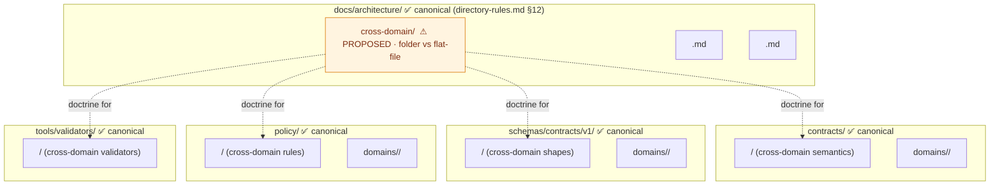
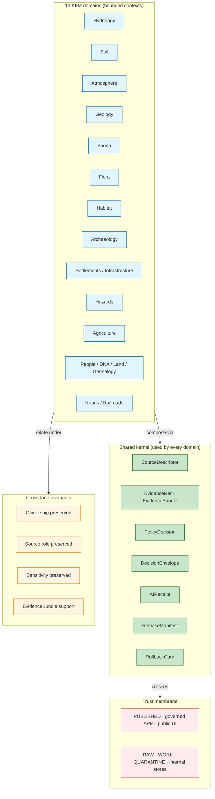

<!-- [KFM_META_BLOCK_V2]
doc_id: kfm://doc/architecture-cross-domain-readme
title: Cross-Domain Architecture
type: standard
version: v0.1
status: draft
owners: <ARCHITECTURE-DOCTRINE-OWNER> · NEEDS VERIFICATION
created: 2026-05-24
updated: 2026-05-24
policy_label: public
related:
  - directory-rules.md#12
  - directory-rules.md#multi-domain-and-cross-cutting-files
  - kfm_unified_doctrine_synthesis.md#7
  - kfm_unified_doctrine_synthesis.md#10
  - kfm_unified_doctrine_synthesis.md#11
  - kfm_unified_doctrine_synthesis.md#17
  - Kansas_Frontier_Matrix_-_Domains_v1_1___Pass_23_32_Consolidated_Atlas.md#241
  - connected-dots-architecture-brief.md
  - DomainDriven_Design_Reference.pdf
tags: [kfm, architecture, cross-domain, doctrine, source-role, trust-membrane]
notes:
  - PROPOSED. Folder-vs-flat-file placement diverges from directory-rules.md §12 pattern (see §2.1); open OPEN-DR-10 for ADR resolution.
  - No mounted repo evidence in this session; all repo-shaped claims labeled PROPOSED.
[/KFM_META_BLOCK_V2] -->

<a id="top"></a>

# Cross-Domain Architecture

> *Landing doc for the architectural concerns that span more than one KFM domain — source-role anti-collapse, cross-lane relations, shared-kernel objects, the trust membrane, and where multi-domain files belong.*


-blue)


**Status:** draft · **Owners:** `<ARCHITECTURE-DOCTRINE-OWNER>` *(NEEDS VERIFICATION)* · **Last updated:** 2026-05-24

> [!IMPORTANT]
> **What "cross-domain" means here.** A KFM **domain** is a bounded responsibility lane with owned object semantics and governed cross-lane relations *(`kfm_unified_doctrine_synthesis.md` §10, CONFIRMED)*. **Cross-domain** architecture is the set of constraints, vocabularies, and patterns that govern *how those lanes compose* without collapsing source role, ownership, sensitivity, or `EvidenceBundle` support. This doc is the navigation point for those topics; per-file doctrine lives in the siblings listed in §4.

> [!CAUTION]
> **Path placement diverges from Directory Rules v1.2 §12.** §12 shows the convention as `docs/architecture/<topic>.md` *(flat files)*; this lane introduces a `cross-domain/` **subfolder** with a README inside. Recorded as **OPEN-DR-10 (PROPOSED)** below. Until reconciled, treat sibling paths under this folder as PROPOSED. See [§2 — Repo fit](#2-repo-fit--directory-rules-basis).

> [!NOTE]
> **What this README is not.** It is not the authoritative source for any single cross-domain concept. Each substantive concept (anti-collapse, cross-lane relations, shared kernel, etc.) is governed by its own primary carrier — `kfm_unified_doctrine_synthesis.md`, the Atlas Chapter 24 registers, `directory-rules.md` §12, and the source dossiers. This README links and orients; canonical statements live there.

---

## Table of contents

1. [Scope](#1-scope)
2. [Repo fit — Directory Rules basis](#2-repo-fit--directory-rules-basis)
3. [What lives here · What does not live here](#3-what-lives-here--what-does-not-live-here)
4. [Directory tree (PROPOSED)](#4-directory-tree-proposed)
5. [The cross-domain landscape](#5-the-cross-domain-landscape)
6. [Source-role anti-collapse](#6-source-role-anti-collapse)
7. [Cross-lane relations — the four invariants](#7-cross-lane-relations--the-four-invariants)
8. [Shared-kernel objects](#8-shared-kernel-objects)
9. [Cross-cutting compositional units](#9-cross-cutting-compositional-units)
10. [Multi-domain file placement](#10-multi-domain-file-placement)
11. [Anti-patterns](#11-anti-patterns)
12. [Open questions and ADR triggers](#12-open-questions-and-adr-triggers)
13. [Related docs](#13-related-docs)
14. [Appendix — glossary and reference](#14-appendix--glossary-and-reference)

---

## 1. Scope

This lane gathers the architectural doctrine that **applies to more than one domain at once**. A new contributor working on a single domain *(e.g., hydrology or archaeology)* can mostly read that domain's dossier and the per-domain README; a contributor whose work *touches multiple domains* — a habitat × fauna × hydrology validator, a settlement × people/land timeline, a hazards × air × hydrology event — needs the constraints that bind those compositions together. Those are gathered here.

> [!TIP]
> **When to read this folder.** If a change you are making picks exactly one domain segment in `data/`, `contracts/`, `schemas/`, `policy/`, or `tests/`, you probably do not need this folder. If your change requires picking *one* domain segment but conceptually involves *two or more*, read this folder first.

[↑ Back to top](#top)

---

## 2. Repo fit — Directory Rules basis

### 2.1 Path divergence (must be resolved)

| Concern | Requested path | Canonical pattern *(`directory-rules.md` §12)* | Recommended resolution |
|---|---|---|---|
| Folder vs flat file | `docs/architecture/cross-domain/README.md` *(folder)* | `docs/architecture/<topic>.md` *(flat file)* | Decide via ADR whether cross-domain warrants a folder *(because it fans into multiple sub-topics)* or stays as a single flat `docs/architecture/cross-domain.md`. **PROPOSED.** |
| Sub-file placement | `docs/architecture/cross-domain/<topic>.md` | Same `<topic>.md` would live at `docs/architecture/<topic>.md` under the flat pattern | If OPEN-DR-10 keeps the folder, this README is the landing for the folder. If it reverts to flat, all sub-files migrate one level up and this README is renamed `cross-domain.md`. |

> [!IMPORTANT]
> **OPEN-DR-10 (PROPOSED).** Decide whether `docs/architecture/cross-domain/` is canonical *(a folder lane)* or `docs/architecture/cross-domain.md` is canonical *(a flat file)*. The trade-off: a folder makes navigation easier when there are many sub-topics, but it diverges from the §12 example which is consistently flat. Recommendation: keep the folder if there are ≥3 substantive sibling files; otherwise flatten. Resolution lands as an ADR amendment to `directory-rules.md` §12 *(or as a clarification stating both patterns are acceptable)*.

### 2.2 Where this folder sits relative to canonical responsibility roots



> **Doctrine basis.** `directory-rules.md` §12 (Domain Placement Law) states: *"Cross-domain doctrine → `docs/architecture/<topic>.md`, not under `docs/domains/<picked-one>/`"* — **CONFIRMED**.

[↑ Back to top](#top)

---

## 3. What lives here · What does not live here

### 3.1 What lives here

| Content | Why it belongs in `docs/architecture/cross-domain/` | Truth label |
|---|---|---|
| Doctrine that **applies to two or more domains** *(source-role classes, cross-lane invariants, shared-kernel objects, trust-membrane rules)* | These rules are not owned by any single domain dossier; placing them under one domain would create false ownership | CONFIRMED doctrine; PROPOSED placement |
| Cross-domain **navigation** — pointers to the canonical Atlas §24 registers, synthesis sections, and Directory Rules sections that govern cross-domain concerns | A landing doc that orients without duplicating the authoritative text | CONFIRMED doctrine |
| Diagrams of **cross-lane relations** at a level above any one domain | Per-domain "F. Cross-lane relations" tables exist in the Atlas; the meta-pattern across them lives here | CONFIRMED doctrine |
| **Open questions** and **ADR triggers** that span domains | A reviewer of a multi-domain PR finds them in one place | CONFIRMED doctrine *(`directory-rules.md` §2.4)* |
| Anti-pattern register **scoped to cross-domain failure modes** | E.g., regulatory-as-event, aggregate-as-per-place, modeled-as-observed | CONFIRMED doctrine *(Atlas §24.1.2)* |

### 3.2 What does NOT live here

| Excluded | Why | Canonical home |
|---|---|---|
| Per-domain doctrine *(hydrology specifics, archaeology specifics, fauna specifics, …)* | Domain dossiers own those | `docs/domains/<domain>/` |
| `.schema.json` files for cross-domain shapes | Schema home rule | `schemas/contracts/v1/<topic>/` |
| Rego policy implementing cross-domain rules | Policy home rule | `policy/<topic>/` |
| Validators / admission-check scripts | Validator home rule | `tools/validators/<topic>/` |
| Focus Mode area-scoped material | Focus Mode is cross-cutting but geographic, not topical; governed by its own placement contract | `docs/focus-modes/<area>-<scope>/` *(per `directory-rules.md` §6.7)* |
| Specific cross-domain runtime envelopes *(`DecisionEnvelope`, `AIReceipt`, `MapContextEnvelope`)* | Runtime envelope schemas | `schemas/contracts/v1/runtime/` |

> [!WARNING]
> **Do not let this lane absorb implementation.** A doctrine lane that grows schemas, policies, validators, or UI code inside `docs/` becomes a parallel authority and violates Directory Rules §6.4 *(schema)*, §6.5 *(policy)*, §7.5 *(tools)*. Keep this folder lean and reference-only.

[↑ Back to top](#top)

---

## 4. Directory tree (PROPOSED)

**PROPOSED — assumes OPEN-DR-10 resolves to "keep the folder".** If OPEN-DR-10 resolves to *flatten*, every file below moves to `docs/architecture/<topic>.md`.

```text
docs/architecture/cross-domain/        ⚠ PROPOSED · folder vs §12 flat-file pattern
├── README.md                          ◄── this file (landing + navigation)
├── source-role-anti-collapse.md       ◄── seven source-role classes, DENY conditions, guardrails (PROPOSED)
├── cross-lane-relations.md            ◄── the four invariants every domain×domain relation MUST preserve (PROPOSED)
├── shared-kernel.md                   ◄── EvidenceRef, EvidenceBundle, SourceDescriptor, DecisionEnvelope, ReceiptAuthority (PROPOSED)
├── trust-membrane.md                  ◄── the public-vs-internal boundary and the rules that govern crossings (PROPOSED)
├── compositional-units.md             ◄── Focus Modes, Frontier Matrix, Planetary/3D as cross-cutting compositions (PROPOSED)
├── multi-domain-placement.md          ◄── where shared validators, schemas, and contracts go (PROPOSED)
└── responsibility-layers.md           ◄── evidence · policy · catalog · release · API · UI · AI · operations (PROPOSED)
```

> [!NOTE]
> Each sibling is a **prose doctrine doc** that links to the canonical primary carrier *(Atlas §24, synthesis §§7–17, directory-rules §12)* and surfaces the cross-domain implications for implementers. Machine artifacts *(schemas, Rego, validators)* go under their canonical homes, not here.

[↑ Back to top](#top)

---

## 5. The cross-domain landscape

> **Evidence basis:** `kfm_unified_doctrine_synthesis.md` §§7–11, §17; `Kansas_Frontier_Matrix_-_Domains_v1_1___Pass_23_32_Consolidated_Atlas.md` Ch. 24; `directory-rules.md` §12; `connected-dots-architecture-brief.md`. **CONFIRMED doctrine throughout.**

KFM's thirteen domains *(hydrology, soil, atmosphere, geology, fauna, flora, habitat, archaeology, settlements/infrastructure, hazards, agriculture, people/DNA/land/genealogy, roads/railroads)* are independent bounded contexts. They compose through a **shared kernel** of objects and a **set of invariants** that every cross-lane relation must preserve. The trust membrane sits across the whole picture.



> [!NOTE]
> **Reading the picture.** No domain is special. The shared kernel is what lets domains compose without merging. The four invariants are what every cross-domain relation must satisfy. The trust membrane is what keeps the inside from leaking outside.

[↑ Back to top](#top)

---

## 6. Source-role anti-collapse

> **Evidence basis:** `Kansas_Frontier_Matrix_-_Domains_v1_1___Pass_23_32_Consolidated_Atlas.md` §24.1 *(Master Source-Role Anti-Collapse Register, CONFIRMED doctrine)*; KFM-P{PASS}-IDEA Source-Role Anti-Collapse Register Pattern *(seed card)*.

KFM treats **source role as a first-class identity attribute, fixed at admission and preserved through every promotion**. An observed reading is not interchangeable with a modeled estimate; a regulatory determination is not interchangeable with an administrative compilation; an aggregate publication is not interchangeable with candidate evidence; synthetic content is never the same thing as observed reality. **The lifecycle and the governed API both fail closed when these roles are conflated.**

### 6.1 The seven canonical source-role classes

| Role | Definition *(CONFIRMED doctrine)* | Typical example | Allowed downstream role |
|---|---|---|---|
| **Observed** | Direct reading, measurement, or first-hand evidentiary record tied to a place and time. | Stream-gauge stage; soil pedon; air-quality sample; ground archaeological observation. | May feed modeled or aggregate products; **never** relabeled "regulatory" or "administrative". |
| **Regulatory** | Authoritative determination by a regulatory or governing body with legal/administrative force. | NFHL flood-zone designation; non-attainment ruling; designated critical habitat unit; protected-species listing. | Cite as regulatory context; **never** an "observed" event or "modeled" estimate. |
| **Modeled** | Derived product from inputs, assumptions, or fitted parameters; uncertainty and input provenance preserved. | Hydrograph reconstruction; smoke trajectory model; suitability raster; population estimation surface; AODRaster. | Cite with model identity, run receipt, bounds; **never** an observation. |
| **Aggregate** | Published summary, total, or average over a unit *(county, year, watershed)*; irreversible loss of individual-record fidelity. | USDA crop county totals; Census tract aggregates; decadal climate normal. | Cite with aggregation receipt; **never** a per-place record. |
| **Administrative** | Compiled record produced by an agency for administration, registration, or accounting — not necessarily observation or regulation. | Land office tract book; deed index; county incorporation record; transport facility roster. | Cite as administrative context; **never** collapsed with observation or regulation. |
| **Candidate** | Proposed record awaiting validation, evidence resolution, deduplication, or steward review; not yet authoritative. | Quarantined connector output; unresolved person assertion; duplicate site candidate. | May be cited as candidate evidence in `WORK`/`QUARANTINE`; **must not** appear in `PUBLISHED` without promotion. |
| **Synthetic** | Content generated by simulation, reconstruction, AI, or interpolation with no underlying first-hand observation. | Synthetic terrain surface; reconstructed historical scene; AI-drafted summary of an `EvidenceBundle`. | Carries `Reality Boundary Note` + `Representation Receipt`; **never** presented as observed reality. |

### 6.2 Anti-collapse failure modes — the DENY conditions

| Collapse pattern | Domains most at risk | Denied outcome | Required guardrail |
|---|---|---|---|
| **Modeled product labeled or queried as observed** | Air; Hydrology; Habitat; Agriculture; 3D | `DENY` at publication; `ABSTAIN` at AI surface | Run receipt + uncertainty surface + role-preserving DTO field |
| **Regulatory zone labeled as an observed flood / event** | Hydrology; Hazards; Air | `DENY` publication of regulatory layer as event evidence | Separate regulatory-layer and observed-event lanes; UI banner |
| **Aggregate cited as a per-place truth** | Agriculture; People; Geology; Air | `DENY` join from aggregate cell to single record; `ABSTAIN` at AI | Aggregation receipt; geometry-scope guard; matrix-cell semantics |
| **Administrative compilation cited as observation** | People/Land; Settlements; Roads | `DENY` publication of compilation as observed event timeline | Source-role tag preserved; named `LifeEvent` / `AdminEvent` types |
| **Candidate record exposed on a public surface** | All | `DENY` at trust membrane; route to `QUARANTINE` | Promotion gate; no `PUBLISHED` edge to `WORK`/`QUARANTINE` |
| **Synthetic content presented as observed reality** | Planetary/3D; AI; Archaeology; Habitat | `DENY` publication; `HOLD` for steward review; `ABSTAIN` at AI | `Reality Boundary Note`; `Representation Receipt`; UI badge |
| **AI text treated as evidence** | All Focus Mode surfaces | `DENY` publication; `ABSTAIN` at Focus Mode; `AIReceipt` mandatory | Cite-or-abstain rule; `AIReceipt`; release state required |

> [!CAUTION]
> **Promotion does not upgrade source role.** Promotion from `PROCESSED` to `PUBLISHED` does not turn an observation into a regulation, a model into an aggregate, or a candidate into a verified record. Those are **separate governed transitions** with their own evidence and review requirements *(`kfm_unified_doctrine_synthesis.md` §17, CONFIRMED)*.

[↑ Back to top](#top)

---

## 7. Cross-lane relations — the four invariants

> **Evidence basis:** Every per-domain "F. Cross-lane relations" section in the Atlas (Parts 1 and 2) uses the same constraint clause; the meta-pattern is consolidated here. **CONFIRMED doctrine.**

Every cross-domain relation in KFM — *Hydrology × Hazards*, *People/Land × Settlements*, *Fauna × Habitat × Flora*, *Archaeology × People/Land*, *Roads × Settlements*, etc. — MUST preserve **four invariants** at the relation boundary. A relation that violates any one of them is not a valid cross-domain composition.

| Invariant | What it requires | What it forbids |
|---|---|---|
| **(1) Ownership preserved** | The relation names which domain owns which object on each side, and ownership does not transfer across the relation. | A cross-lane join that silently rebinds an object's owning domain. |
| **(2) Source role preserved** | Each object carries its source role *(observed / regulatory / modeled / aggregate / administrative / candidate / synthetic)* across the relation. | Cross-lane joins that collapse roles *(§6.2)*. |
| **(3) Sensitivity preserved** | The most restrictive sensitivity on either side of the relation applies. Aggregation does **not** lower sensitivity. | Joining a `T0`-public object to a `T3`-restricted object and treating the result as `T0`. |
| **(4) `EvidenceBundle` support** | Every claim that asserts the relation resolves to an `EvidenceBundle` on both sides; closure is required before public exposure. | Cross-lane assertions with `EvidenceRef` that does not resolve. |

> [!IMPORTANT]
> **Where these invariants live in code.** Validation of (1)–(4) happens at promotion gate **C — Sensitivity** *(synthesis §8)* and gate **E — Evidence closure**. The Conftest/OPA bundle SHOULD deny when any invariant is broken; the cross-lane validator SHOULD fail-closed on missing source-role tags or unresolved `EvidenceRef` on either side of a join.

[↑ Back to top](#top)

---

## 8. Shared-kernel objects

> **Evidence basis:** `kfm_unified_doctrine_synthesis.md` §10 *(core object families)*; `connected-dots-architecture-brief.md` §6. **CONFIRMED doctrine.**

DDD's *Shared Kernel* pattern applies in KFM with one caveat: the corpus warns that shared kernels work only between closely coordinated teams, and KFM's "team" is **the doctrine itself**. The objects below are the kernel that lets all thirteen domains compose without each domain reinventing identity, evidence, policy, or release.

| Object | Cross-domain role | First-proof expectation |
|---|---|---|
| **`SourceDescriptor`** | Identity, source role, authority class, rights, sensitivity precheck. Every source from every domain admits through one schema. | A public-safe source is admitted only with role and rights known or explicitly held. |
| **`EvidenceRef` / `EvidenceBundle`** | Stable pointer + resolved support object that every consequential claim in every domain depends on. | Every consequential claim has at least one resolvable evidence pointer **or abstains**. |
| **`PolicyDecision`** | `ALLOW` / `DENY` / `RESTRICT` / `HOLD` / `ABSTAIN` with reasons and obligations. Same envelope for every domain. | Rights unknown, sensitive geometry, stale source, or missing evidence produces visible `DENY` / `ABSTAIN` / `HOLD`. |
| **`DecisionEnvelope` / `RuntimeResponseEnvelope`** | Finite output `ANSWER` / `ABSTAIN` / `DENY` / `ERROR` *(synthesis §11)*. Same envelope across every governed surface. | No raw fluent answer reaches UI without envelope validation. |
| **`AIReceipt`** | Context + provider/model profile + hashes + policy decisions for every AI surface answer. | Every AI surface answer emits one. |
| **`ReleaseManifest`** | Authoritative record of what is `PUBLISHED`; same schema across domains. | No `PUBLISHED` state without an applicable manifest. |
| **`RollbackCard`** | Rollback target that preserves history while repointing current release state. | Every release has a rollback target. |
| **`MapContextEnvelope`** | Bounded context that the Focus Mode runtime sees of the map *(across all domains)*. | Focus Mode runtime accepts the envelope only after admission. |

> [!TIP]
> **Renaming any kernel object is ADR-class.** A rename ripples across every domain dossier, every contract, every schema, every validator, and every UI surface. Per `ai-build-operating-contract.md` §28, ADR is required before introducing or retiring an object family.

[↑ Back to top](#top)

---

## 9. Cross-cutting compositional units

> **Evidence basis:** `directory-rules.md` §6.7 *(Focus Modes)*; Atlas §17 *(Frontier Matrix)* and §18 *(Planetary, 3D, Digital Twin)*. **CONFIRMED doctrine.**

Three kinds of cross-cutting unit appear in KFM. Each composes across domains and the shared kernel, but none of them is a domain, and none of them becomes a root folder.

| Compositional unit | What it composes | Where it lives | Authority anchor |
|---|---|---|---|
| **Focus Mode** *(county / region / corridor / state-scale proof slice)* | One geographic area × multiple domains × one UI × one release | `docs/focus-modes/<area>-<scope>/`, plus cross-root lanes in `contracts/`, `schemas/`, `fixtures/`, `apps/`, `tools/`, `data/`, `release/` | `directory-rules.md` §6.7 |
| **Frontier Matrix** *(county-year panel across domains)* | County × year × multiple domains *(population, economy, ag, access, settlement, land)* | Lanes inside responsibility roots, not a root folder | Atlas §17 |
| **Planetary / 3D / Digital Twin** *(renderer-class composition)* | Multiple domains × 3D representation × Reality Boundary discipline | `packages/maplibre/` *(or future `packages/renderer/`)*; `data/published/scenes/`; `release/manifests/scenes/` | Atlas §18; `kfm_unified_doctrine_synthesis.md` §18 |

> [!WARNING]
> **None of these become a root folder.** A `focus_modes/`, `frontier_matrix/`, or `scenes/` directory at repo root is drift per `directory-rules.md` §3 *(root-stays-boring)* and §13.5 *(anti-pattern register)*.

[↑ Back to top](#top)

---

## 10. Multi-domain file placement

> **Evidence basis:** `directory-rules.md` §12 *(Domain Placement Law — "Multi-domain and cross-cutting files")*. **CONFIRMED doctrine.**

When a file legitimately spans domains *(e.g., a habitat × fauna × hydrology validator)*, place it under the **lowest common responsibility root** that owns the file's responsibility, **without** a domain segment.

| Cross-domain file kind | Place under | Do **not** place under |
|---|---|---|
| Shared validator | `tools/validators/<topic>/...` | `tools/validators/domains/<picked-one>/...` |
| Cross-domain schema | `schemas/contracts/v1/<topic>/...` | `schemas/contracts/v1/domains/<picked-one>/...` |
| Cross-domain semantic contract | `contracts/<topic>/...` | `contracts/domains/<picked-one>/...` |
| Cross-domain Rego policy | `policy/<topic>/...` | `policy/domains/<picked-one>/...` |
| Cross-domain doctrine *(this folder's purpose)* | `docs/architecture/<topic>.md` or `docs/architecture/cross-domain/<topic>.md` *(pending OPEN-DR-10)* | `docs/domains/<picked-one>/<topic>.md` |
| Cross-domain fixture *(rare; usually domain-owned)* | `fixtures/<topic>/...` | `fixtures/domains/<picked-one>/...` |
| Cross-domain tests | `tests/<topic>/...` | `tests/domains/<picked-one>/...` |

> [!IMPORTANT]
> **"Picking a domain" is the failure mode.** When a file legitimately spans domains, picking one of them as the owner creates a parallel authority that other domains then have to crosswalk to. The §12 rule prevents that by routing cross-domain files to **non-domain** segments of the same responsibility roots.

[↑ Back to top](#top)

---

## 11. Anti-patterns

| Anti-pattern | Why it breaks the trust path | Mitigation |
|---|---|---|
| **Domain-as-root folder** *(`hydrology/`, `archaeology/` at repo root)* | Fragments the lifecycle; competes with responsibility roots. | `directory-rules.md` §12 Domain Placement Law; lane pattern only. |
| **Cross-domain file under a single domain** *(e.g., habitat × fauna validator placed under `tests/domains/fauna/`)* | Creates false ownership; the other domain has to cross-walk through the picked one. | Route to `<root>/<topic>/...` per §10 above. |
| **Source-role collapse** *(observed-as-modeled, regulatory-as-event, aggregate-as-per-place, candidate-on-public, synthetic-as-observed, admin-as-observation, AI-text-as-evidence)* | Breaks the truth posture; same evidence carries different meaning depending on where you stand. | §6.2 DENY conditions; OPA bundle; source-role-preserving DTO. |
| **Cross-lane relation without invariant check** *(joining two domains' objects without preserving ownership, source role, sensitivity, or `EvidenceBundle` support)* | The relation looks plausible but breaks downstream audit. | §7 four-invariants check at gates C and E. |
| **Renaming a shared-kernel object without ADR** *(e.g., changing `EvidenceBundle` to `Evidence`)* | Ripples across every domain dossier, contract, schema, validator, and UI surface. | ADR required *(`ai-build-operating-contract.md` §28)*. |
| **Cross-cutting unit as a root folder** *(`focus_modes/`, `frontier_matrix/`, `scenes/` at root)* | Same root-stays-boring violation as domain-as-root. | `directory-rules.md` §3, §6.7, §13.5. |
| **Doctrine doc absorbs implementation** *(schemas, policies, validators, UI code landing inside `docs/architecture/`)* | Creates parallel authority outside canonical roots. | Keep this folder reference-only; §3.2 lists exclusions. |

[↑ Back to top](#top)

---

## 12. Open questions and ADR triggers

| Open item | Class | Suggested ADR title *(PROPOSED)* |
|---|---|---|
| **OPEN-DR-10** — Reconcile `docs/architecture/cross-domain/` *(folder)* vs `docs/architecture/cross-domain.md` *(flat file)* per `directory-rules.md` §12. | Directory Rules §2.4 *(structural)* | "Cross-domain architecture lane — folder vs flat file". |
| Should `HOLD` appear as a separate sensitivity outcome at the cross-lane invariant check, or remain folded into `DENY`/`ABSTAIN`? | Vocabulary | "Cross-lane HOLD modeling". |
| Should "Reality Boundary" *(Atlas §18)* become a kernel object across all domains, or stay scoped to Planetary/3D? | Object family | "Reality Boundary as cross-domain kernel object". |
| Receipt schema layout — `schemas/contracts/v1/receipts/` vs `schemas/contracts/v1/<domain>/receipts/`? | Schema home | ADR-S-03 *(PROPOSED — Atlas §24.12)*. |
| Source-role vocabulary stability — adopt the seven classes as canonical and freeze, or allow extension? | Vocabulary | ADR-S-04 *(PROPOSED — Atlas §24.12)*. |

> [!IMPORTANT]
> **Until OPEN-DR-10 resolves, this README is doctrinally usable but structurally provisional.** Cite it as `kfm://doc/architecture-cross-domain-readme` *(stable `doc_id`)*, not as a path.

[↑ Back to top](#top)

---

## 13. Related docs

| Reference | Role | Truth label |
|---|---|---|
| `directory-rules.md` §12 *(Domain Placement Law; multi-domain and cross-cutting files)* | Placement authority | CONFIRMED doctrine |
| `directory-rules.md` §6.7 *(Focus Mode placement contract)* | Cross-cutting compositional unit placement | CONFIRMED doctrine |
| `kfm_unified_doctrine_synthesis.md` §7 *(promotion as a governed state transition)* | Cross-domain promotion rule | CONFIRMED doctrine |
| `kfm_unified_doctrine_synthesis.md` §8 *(promotion gates A–G)* | Cross-domain enforcement points | CONFIRMED doctrine |
| `kfm_unified_doctrine_synthesis.md` §10 *(core object families)* | Shared-kernel objects | CONFIRMED doctrine |
| `kfm_unified_doctrine_synthesis.md` §11 *(finite outcome envelope)* | Cross-domain runtime vocabulary | CONFIRMED doctrine |
| `kfm_unified_doctrine_synthesis.md` §17 *(cross-lane relations and source-role anti-collapse)* | Direct upstream for §§6–7 of this README | CONFIRMED doctrine |
| `Kansas_Frontier_Matrix_-_Domains_v1_1___Pass_23_32_Consolidated_Atlas.md` §24.1 *(Master Source-Role Anti-Collapse Register)* | Canonical source-role authority | CONFIRMED doctrine |
| `connected-dots-architecture-brief.md` *(responsibility roots; shared kernel; domain lanes)* | Architecture brief that complements this README | CONFIRMED doctrine |
| `DomainDriven_Design_Reference.pdf` *(Shared Kernel, Anticorruption Layer, Open-host Service, Context Map, Pluggable Component Framework)* | External grounding for KFM's bounded-context posture | EXTERNAL — reference only |
| `ai-build-operating-contract.md` §28 *(ADR requirements)* | When cross-domain changes need an ADR | CONFIRMED doctrine |
| `docs/focus-modes/README.md` *(or `docs/focus-mode/README.md` per OPEN-DR-08)* | Focus Mode landing | PROPOSED |
| `docs/registers/DRIFT_REGISTER.md` *(if/when present)* | Drift log home | PROPOSED |

[↑ Back to top](#top)

---

## 14. Appendix — glossary and reference

<details>
<summary><strong>14.1 Glossary of cross-domain vocabulary</strong></summary>

| Term | Definition *(CONFIRMED doctrine unless noted)* |
|---|---|
| **Domain** | Bounded responsibility lane with owned object semantics and governed cross-lane relations *(`kfm_unified_doctrine_synthesis.md` §10)*. |
| **Bounded context** | Reference-model boundary where a term has defined meaning and ownership *(DDD)*. |
| **Shared kernel** | Small subset of the model shared by two or more bounded contexts under tight coordination. In KFM, the coordination is enforced by **doctrine**, not by team co-location. |
| **Cross-lane relation** | A relation that crosses a domain boundary; subject to the four invariants of §7. |
| **Source role** | First-class identity attribute of a source, fixed at admission, preserved through promotion. Seven canonical classes per §6.1. |
| **Anti-collapse** | The rule that source roles MUST NOT be silently conflated; promotion does not upgrade role. |
| **Trust membrane** | Doctrine boundary that prevents raw, unreviewed, restricted, or generated state from becoming public truth. |
| **Cross-cutting compositional unit** | A unit that composes across domains and the shared kernel without becoming a domain *(Focus Mode, Frontier Matrix, Planetary/3D)*. |
| **Multi-domain file** | A file whose responsibility legitimately spans two or more domains; placed under the lowest common responsibility root **without** a domain segment *(§10)*. |
| **Responsibility layers** | The KFM-P9-PROG-0001 (PROPOSED) layering: evidence, policy, catalog, release, API, UI, AI, operations — orthogonal to domains. |
| **Reality Boundary Note** | Marker that distinguishes synthetic / reconstructed / simulated content from observed reality *(Atlas §18; §6.1 row "Synthetic")*. |

</details>

<details>
<summary><strong>14.2 The thirteen KFM domains (canonical list)</strong></summary>

| # | Domain | Atlas chapter *(approx.)* | Notable sensitivities |
|---|---|---|---|
| 1 | Hydrology | Atlas ch. *(varies)* | Regulatory floodplain vs observed event; gauge-data freshness. |
| 2 | Soil | Atlas ch. *(varies)* | SSURGO yearly diffs; SDA cadence. |
| 3 | Atmosphere / Air | Atlas ch. 11 | Modeled vs observed; non-attainment regulatory vs ambient observed. |
| 4 | Geology | Atlas ch. *(varies)* | Aggregate resource estimates vs per-place observations. |
| 5 | Fauna | Atlas ch. *(varies)* | Exact sensitive occurrences fail closed. |
| 6 | Flora | Atlas ch. 8 | Rare/protected species; consent for steward-reviewed records. |
| 7 | Habitat | Atlas ch. 6 | Habitat assignments are modeled, not observed. |
| 8 | Archaeology / Cultural Heritage | Atlas ch. 15 | Exact locations DENY at any scale; tribal sovereignty. |
| 9 | Settlements / Infrastructure | Atlas ch. 14 | Critical-infrastructure exact-location carve-outs. |
| 10 | Hazards | Atlas ch. 12 | Regulatory zone vs observed event; emergency-alert posture is ABSTAIN. |
| 11 | Agriculture | Atlas ch. 9 | County-level aggregates vs producer-level privacy. |
| 12 | People / DNA / Land / Genealogy | Atlas ch. 16 | Living-person identifiers, DNA, parcel-title fail closed. |
| 13 | Roads / Railroads | Atlas ch. *(varies)* | Administrative compilations vs observed events. |

> [!NOTE]
> **Atlas chapter numbers vary slightly across atlas editions.** Verify against the current consolidated atlas at the time of citation. Chapters above are illustrative only.

</details>

<details>
<summary><strong>14.3 The four cross-lane invariants — at-a-glance card</strong></summary>

```text
Every domain × domain relation MUST preserve:

  (1) Ownership          — neither side rebinds the other's owning domain
  (2) Source role        — observed/regulatory/modeled/aggregate/admin/
                           candidate/synthetic carried across the relation
  (3) Sensitivity        — most-restrictive applies; aggregation does NOT lower
  (4) EvidenceBundle     — every claim resolves on BOTH sides; closure required
                           support           before public exposure
```

If any one fails, the relation is invalid as a public KFM composition and the
promotion gates (C — Sensitivity, E — Evidence closure) MUST deny.

</details>

<details>
<summary><strong>14.4 Truth-label legend</strong></summary>

- **CONFIRMED** — verified this session from attached docs, workspace evidence, tests, logs, or generated artifacts.
- **PROPOSED** — design, recommendation, file path, placement, or inference not yet verified in implementation.
- **INFERRED** — reasonably derivable from visible evidence but not directly stated.
- **NEEDS VERIFICATION** — checkable, but not yet checked strongly enough to act as fact.
- **UNKNOWN** — not resolvable without more evidence.
- **EXTERNAL** — sourced from authoritative external research *(not applied in this doc; no external research was triggered)*.

</details>

---

**Related (mini)** · [`directory-rules.md` §12](../../../directory-rules.md) · [`kfm_unified_doctrine_synthesis.md` §10](../../../kfm_unified_doctrine_synthesis.md) · [`Kansas_Frontier_Matrix_-_Domains_v1_1___Pass_23_32_Consolidated_Atlas.md` §24.1](../../../Kansas_Frontier_Matrix_-_Domains_v1_1___Pass_23_32_Consolidated_Atlas.md) · [`connected-dots-architecture-brief.md`](../../../connected-dots-architecture-brief.md) · [`docs/focus-modes/README.md` *(or `docs/focus-mode/README.md`)*](../../focus-modes/README.md)

**Last updated:** 2026-05-24 · **Doc version:** v0.1 · **Doc status:** draft · **Path status:** PROPOSED *(OPEN-DR-10)*

[↑ Back to top](#top)
