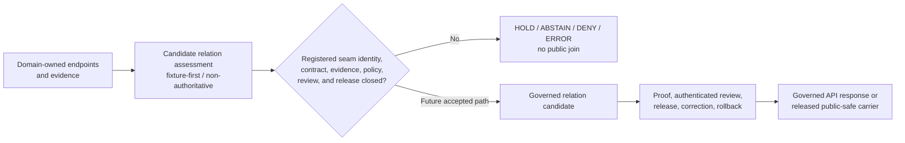

<!-- [KFM_META_BLOCK_V2]
doc_id: kfm://doc/architecture-cross-domain-readme
title: Cross-Domain Architecture
type: standard
version: v0.4.0
prior_version: v0.3.0
status: draft; repository-grounded architecture index; sibling-wave-reconciled; projection-aware; fail-closed; non-authoritative; non-publisher
owners:
  - "@bartytime4life - verified CODEOWNERS review route; routing is not stewardship, independent review, approval, release authority, or publication authority"
owner_status: "Cross-domain architecture, participating-domain, source, evidence, policy, sensitivity, validation, review, release, correction, rollback, API, UI, AI, and security stewards remain NEEDS VERIFICATION"
created: 2026-05-24
updated: 2026-08-20
policy_label: public; architecture; cross-domain; cite-or-abstain; fail-closed; non-release; non-publication
truth_posture: cite-or-abstain
owning_root: docs/
responsibility_root: docs/
responsibility: "Index and explain cross-domain architecture, relation invariants, source-role anti-collapse, responsibility placement, compositional boundaries, trust-membrane requirements, and current repository maturity without becoming contract, schema, policy, registry, implementation, evidence, review, release, or publication authority."
current_path: docs/architecture/cross-domain/README.md
canonical_relationship: "Same-path nested architecture index under accepted Directory Rules section 12.5; no sibling authority, new root, seam activation, or migration created."
supersedes:
  - v0.3.0 at the same path
superseded_by: []
evidence_snapshot:
  repository: bartytime4life/Kansas-Frontier-Matrix
  visibility: public
  base_ref: main
  base_commit: 18da9e4700f930776340367f4a5c8ffc3dbb5781
  target_prior_blob: 3353a0a0ab5fe3f8f5fdea937b8eecfa34b81032
  parent_architecture_readme_blob: 0b92d8d809b25a5b39c19bc0fa7e94f98ea499b9
  directory_rules_blob: fd49a0b83e55cef52c1124281f093e263526898d
  adr_0029_blob: a4de0d7a96b78da59cfc499d1025e1508afd8dd9
  cross_domain_seam_register_blob: dc87ea9c2ab11cc10e51cf4e8284c030e7c9ab29
  direct_child_files: 9
  direct_sibling_pages: 8
  compositional_units_blob: 3604f66bff6323fbde1a4bc95035d6abf327fdc1
  cross_lane_relations_blob: 15b7fe05fee251490d1a5db77844cc44b48288bd
  multi_domain_placement_blob: ab0ec2500a69ab3ae39d6e55d4b1fdae9aef9c06
  responsibility_layers_blob: 75cfe3aeb8d8686eeb3e47afdb46ab84172266c4
  shared_kernel_blob: 88397872eb400d72af9dcfec3890e01d62af1a18
  source_role_anti_collapse_blob: 89da72168d6165c744ebb4970ba45c80940ce746
  trust_membrane_blob: 7a7a859ed038cabde9938ac850ea317c970fa1a6
  vegetation_stress_blob: 9d98b7c6241ce259a77aae8d646ef287c9e31d08
  join_assessment_contract_blob: 2d78246d66d64d69413686e460321635adfc6170
  join_assessment_schema_blob: 7fd77721e82bade0a9775fdff6a42df420ea9c71
  join_assessment_helper_blob: ffaac998f1295c6661a8de1d1dd4d076c5835e47
  join_assessment_fixture_blob: 176a869a2d9857c7fcc225682369319078cf2bb3
  join_assessment_tests_blob: 48585d4ad064d8a48fc9d270ca3beafa198b63a6
  join_assessment_workflow_blob: 22170cf546e16dd93303400a370509477a20a7f2
  domain_context_map_contract_blob: baba984fbab331550f14a49f0713866d5178072f
  domain_context_map_schema_blob: f91db6efd377b6440d4061bae7b9dc9e359d7151
  responsibility_layer_contract_blob: 5e2000c77a845493ef3272b0d75fbe3495cb73a4
  responsibility_layer_schema_blob: c2a3e9a9570174ead9451d25c43c9196da4243a2
inspection_boundary: >-
  Current-session GitHub reads covered current main, this complete prior README,
  all eight direct sibling pages and their exact blobs, accepted ADR-0029, adopted
  Directory Rules v2, the complete partial Cross-Domain Seam Register, the
  fixture-first CrossLaneJoinAssessment workflow and its declared contract,
  schema, helper, fixture, and test packet, the DomainContextMapAssessmentCandidate
  contract and schema, the ResponsibilityLayerImpactAssessmentCandidate packet as
  recorded by its repository-grounded sibling, the generated-receipt schema,
  CODEOWNERS routing, exact-target pull-request overlap, and the prior generated
  receipt. No live source, production join, authenticated policy evaluator,
  authoritative EvidenceBundle service, deployed public client, cross-domain
  ANSWER, release packet, correction cascade, cache invalidation, or rollback
  execution was exercised.
related:
  - ../README.md
  - ../SKELETON_MAP.md
  - ../../doctrine/directory-rules.md
  - ../../adr/ADR-0029-adopt-directory-governance-standard-v2.md
  - ../../doctrine/evidence-first.md
  - ../../doctrine/lifecycle-law.md
  - ../../doctrine/trust-membrane.md
  - ./compositional-units.md
  - ./cross-lane-relations.md
  - ./multi-domain-placement.md
  - ./responsibility-layers.md
  - ./shared-kernel.md
  - ./source-role-anti-collapse.md
  - ./trust-membrane.md
  - ./vegetation-stress.md
  - ../../../control_plane/cross_domain_seam_register.yaml
  - ../../../contracts/joins/cross_lane_join_assessment.md
  - ../../../schemas/contracts/v1/joins/cross_lane_join_assessment.schema.json
  - ../../../contracts/governance/domain_context_map_assessment.md
  - ../../../schemas/contracts/v1/governance/domain_context_map_assessment.schema.json
  - ../../../contracts/governance/responsibility_layer_impact_assessment.md
  - ../../../schemas/contracts/v1/governance/responsibility_layer_impact_assessment.schema.json
tags: [kfm, architecture, cross-domain, context-map, seam, relation, source-role, shared-kernel, composition, responsibility-layers, trust-membrane, evidence, policy, release, correction, rollback]
notes:
  - "v0.4.0 synchronizes the directory index with the completed August 19-20 sibling documentation modernization wave."
  - "All eight sibling pages are now repository-grounded drafts; that documentation maturity does not accept their proposed architecture classifications or create runtime authority."
  - "All five registered seams remain HOLD_UNRESOLVED, non-public, non-mutating, and without a seam contract path; vegetation stress remains unregistered."
  - "The generic CrossLaneJoinAssessment is a fixture-first candidate assessment only. ALLOW means emit JOIN_CANDIDATE for review, not relationship truth, policy permission, release, or publication."
  - "No adopted Shared Kernel membership was verified. Shared object-family references remain candidates or published-language/interface relationships until an accepted context-map decision says otherwise."
  - "This update changes documentation and its required generated authoring receipt only."
[/KFM_META_BLOCK_V2] -->

<a id="top"></a>

# Cross-Domain Architecture

[](#status-and-evidence-boundary)
[](#4-directory-map)
[](#current-register-profile)
[](#public-boundary-result)
[](../../doctrine/evidence-first.md)
[](#authority-boundary)

Architecture index for relationships and compositions that span independently
governed KFM bounded contexts while preserving ownership, source role, evidence,
time, rights, sensitivity, policy, review, release, correction, and rollback.

> [!IMPORTANT]
> **This directory explains cross-domain architecture; it does not create
> cross-domain authority.** A page, diagram, register entry, schema-valid object,
> helper outcome, test, workflow, receipt, pull request, merge, map, graph, or AI
> explanation cannot activate a seam, authorize a public join, transfer domain
> ownership, resolve evidence, approve policy, release a carrier, or publish a
> claim.

> [!CAUTION]
> **All five registered seams remain held, and vegetation stress remains
> unregistered.** The current seam register is a partial navigational and review
> projection. Every listed seam is `HOLD_UNRESOLVED`, disallows public joins, and
> has no seam contract path. The vegetation-stress page is a worked architecture
> profile, not a sixth registered seam.

> [!WARNING]
> **The current bounded executable proof stops before public truth.** The generic
> `CrossLaneJoinAssessment` can emit a reviewable `JOIN_CANDIDATE`; current
> Governed API evidence described by this lane proves negative envelopes, not a
> cross-domain `ANSWER`. Missing evidence, policy, review, release, correction,
> or rollback support therefore remains a fail-closed condition.

## Navigation

| Read | Use it for |
|---|---|
| [Status and evidence boundary](#status-and-evidence-boundary) | Current pinned evidence, truth labels, and limits. |
| [1. Scope](#1-scope) | Decide when a relation is genuinely cross-domain. |
| [2. Repo fit](#2-repo-fit--directory-rules-basis) | Apply accepted placement and authority boundaries. |
| [3. Boundary](#3-what-lives-here--what-does-not-live-here) | Separate explanation from owning artifact roots. |
| [4. Directory map](#4-directory-map) | Read the reconciled nine-file lane. |
| [5. Landscape](#5-the-cross-domain-landscape) | Understand registered, unregistered, and candidate states. |
| [6-10. Architecture](#6-source-role-anti-collapse) | Preserve role, relation, kernel, composition, and placement boundaries. |
| [11-12. Risks and decisions](#11-anti-patterns) | Avoid authority collapse and identify ADR-class work. |
| [13. Related docs](#13-related-docs) | Follow doctrine, contracts, schemas, policy, implementation, and release owners. |
| [Validation](#validation-and-maintenance) | Run bounded repository checks and preserve rollback. |
| [14. Appendix](#14-appendix--glossary-and-reference) | Use the glossary, evidence ledger, and change history. |

---

<a id="status-and-evidence-boundary"></a>

## Status and evidence boundary

| Surface | Verified state at `main@18da9e4700f930776340367f4a5c8ffc3dbb5781` | Safe interpretation |
|---|---|---|
| This README | Present at prior blob `3353a0a0ab5fe3f8f5fdea937b8eecfa34b81032`; version `v0.3.0`. | Same-path modernization only; no structural or authority change. |
| Directory contents | Nine direct files: this index plus eight sibling pages. | Directory inventory is complete for the inspected commit. |
| Sibling documentation wave | All eight sibling pages are repository-grounded drafts updated on August 19 or 20, 2026. | Documentation maturity improved; architecture acceptance and runtime closure did not automatically follow. |
| Directory authority | Accepted [ADR-0029](../../adr/ADR-0029-adopt-directory-governance-standard-v2.md) adopts [Directory Rules v2](../../doctrine/directory-rules.md). | Section 12.5 supports `PLACE` for this same-path architecture index and routes implementation artifacts by responsibility root. |
| Seam projection | [`cross_domain_seam_register.yaml`](../../../control_plane/cross_domain_seam_register.yaml) is `PROPOSED`, partial, navigation/review only, and contains five held seams. | Registration is not activation; every public join remains denied. |
| Generic relation candidate | [`CrossLaneJoinAssessment`](../../../contracts/joins/cross_lane_join_assessment.md) has a closed schema, deterministic no-network helper, 19 synthetic cases, 10 focused tests, and a read-only workflow. | This is bounded fixture proof. `ALLOW` means emit `JOIN_CANDIDATE`, not relationship truth or permission. |
| Generic join policy | The join-policy lane remains documented but inactive; no accepted generic evaluator or outward `joins` policy family is established. | Candidate computation cannot substitute for policy. |
| Shared-kernel assessment | A fixture-only `DomainContextMapAssessmentCandidate` contract and schema may label a proposal `SHARED_KERNEL` while keeping authority flags false and review pending. | No adopted KFM Shared Kernel membership is established. |
| Responsibility-layer assessment | A fixture-only `ResponsibilityLayerImpactAssessmentCandidate` packet exists for the proposed eight-layer lens. | The eight-layer model remains proposed and cannot place files or assign stewards. |
| Source-role profiles | Current repository surfaces expose multiple overlapping role vocabularies. | No accepted global enum or crosswalk is established; coercion by string matching is unsafe. |
| Trust membrane | The cross-domain trust page records schema-backed `ABSTAIN` and `ERROR` behavior and no proved cross-domain `ANSWER`. | Negative behavior is useful bounded proof, not a complete public path. |
| Vegetation stress | The page is repository-grounded and explicitly unregistered; its pipeline and Atmosphere × Agriculture validation lanes remain README-only in the inspected slice. | No vegetation-specific executable, policy profile, release, or public join is established. |
| Review routing | [`.github/CODEOWNERS`](../../../.github/CODEOWNERS) routes default review to `@bartytime4life`. | Routing is not accepted stewardship, independent review, policy approval, or release authority. |

<a id="truth-posture"></a>

### Truth posture

- **CONFIRMED:** current main, exact target and sibling blobs, accepted placement
  authority, nine direct files, five held register entries, and the bounded
  fixture-first packets described above.
- **PROPOSED:** complete seam profiles, Shared Kernel membership, the eight-layer
  model as canonical structure, universal source-role mappings, and any future
  active or public relation.
- **UNKNOWN:** deployed cross-domain joins, authoritative EvidenceBundle
  resolution, authenticated policy and review, ordinary public-client use,
  correction propagation, cache invalidation, and rollback execution.
- **NEEDS VERIFICATION:** accountable stewards, accepted per-seam contracts and
  policy, required-check coupling, consumer closure, and exact-head hosted
  validation for this revision.
- **CONFLICTED:** current implementation naming across `cross_domain`,
  `cross_lane`, `joins`, pair-profile, and topic-specific paths, plus current
  source-role vocabulary and schema-alias seams.
- **HOLD:** every registered seam, the unregistered vegetation-stress profile,
  every unaccepted Shared Kernel proposal, and every proposed public join.

<a id="public-boundary-result"></a>

### Public-boundary result

The current safe public interpretation is:

```text
REGISTERED ≠ ACTIVE
ALLOW ≠ ANSWER
RESOLVED ≠ PUBLISHED
SCHEMA_VALID ≠ AUTHORIZED
DOCUMENTED ≠ IMPLEMENTED
MERGED ≠ RELEASED
```

A cross-domain public `ANSWER` requires independent closure of endpoint validity,
relation support, source-role compatibility, rights and sensitivity, policy,
authenticated review, release state, correction lineage, and rollback support.
No current lane-wide proof closes that chain.

[Back to top](#top)

---

## 1. Scope

Use this lane when an architecture question genuinely spans two or more bounded
contexts and the relationship itself requires explicit treatment of ownership,
translation, evidence, policy, sensitivity, review, release, correction, or
rollback.

Typical readers include:

- maintainers designing binary or n-ary relations among domain-owned objects;
- reviewers checking spatial, temporal, source-role, rights, and sensitivity
  preservation;
- contract, schema, policy, fixture, validator, pipeline, API, UI, AI, and
  release authors aligning one bounded seam;
- stewards investigating false inference, stale dependency, correction
  propagation, withdrawal, cache invalidation, or rollback across a relation.

Do **not** place an artifact here merely because several domains consume it. A
file with one authority owner remains in that responsibility root and domain
lane, references its dependencies, and preserves the other contexts' identities.
A convenience topic folder is not an authority boundary.

> [!TIP]
> Classify one authority owner first. If a proposed file contains two
> independently editable authorities, return `SPLIT` before selecting a path.

[Back to top](#top)

---

## 2. Repo fit — Directory Rules basis

### Responsibility signature

| Axis | This README |
|---|---|
| Artifact kind | Human architecture index and nested directory README |
| Authority owner | Cross-domain architecture explanation |
| Lifecycle stage | Not applicable; no lifecycle payload |
| Execution role | None |
| Scope kind | Cross-domain architecture lane |
| Exposure | Public repository documentation |
| Mutability | Versioned replacement through review |
| Retention | Durable documentation |
| Placement result | `PLACE` at the existing same path |
| Current action | Update in place and add the required generated authoring receipt |

Accepted Directory Rules section 12.5 illustrates responsibility routing for
cross-domain work:

| Artifact responsibility | Placement model |
|---|---|
| Human architecture explanation | `docs/architecture/cross-domain/<seam_id>.md` |
| Semantic contract | `contracts/cross_domain/<seam_id>/` |
| Tests | `tests/cross_domain/<seam_id>/` |
| Shared repository validator | `tools/validators/cross_domain/<seam_id>/` |

Those examples do not authorize mechanical creation of every illustrated path.
Schemas, policy, fixtures, pipelines, lifecycle instances, catalogs, receipts,
proofs, releases, public carriers, corrections, and rollback objects remain in
their own responsibility roots under verified local profiles.

<a id="authority-boundary"></a>

### Authority boundary

| Surface | Owns | This README may do |
|---|---|---|
| [`docs/doctrine/`](../../doctrine/README.md) and accepted ADRs | Governing invariants and reviewed decisions | Explain and link; never silently amend. |
| [`control_plane/`](../../../control_plane/README.md) | Machine projections and indexes | Describe current projection state; never convert it into governing authority. |
| [`contracts/`](../../../contracts/README.md) | Semantic meaning and interface promises | Point to owning contracts; never redefine fields here. |
| [`schemas/`](../../../schemas/README.md) | Machine-checkable shape | Point to current shapes; never imply prose validates an instance. |
| [`policy/`](../../../policy/README.md) | Allow, deny, restrict, hold, and abstain rules | State prerequisites; never invent an allow decision. |
| [`fixtures/`](../../../fixtures/README.md) and [`tests/`](../../../tests/README.md) | Representative executable conformance | Cite exact assertions and limits; never infer completeness from filenames. |
| [`pipelines/`](../../../pipelines/README.md), [`packages/`](../../../packages/README.md), [`runtime/`](../../../runtime/README.md), and [`apps/`](../../../apps/README.md) | Executable processing and delivery | Describe inspected behavior; never claim unobserved deployment. |
| [`data/`](../../../data/README.md) | Lifecycle, registry, receipt, proof, catalog, triplet, and published instances | Explain lineage; never move or promote state through documentation. |
| [`release/`](../../../release/README.md) | Release, correction, withdrawal, rollback, and signature decisions | Explain prerequisites; never claim publication. |
| This lane | Cross-domain explanatory architecture and navigation | Preserve boundaries, expose conflicts, and route readers to owners. |

> [!CAUTION]
> Architecture prose is not an enforcement shortcut. A detailed page, green
> badge, or passing Markdown check cannot replace semantic authority, resolvable
> evidence, policy, review, release, correction, or rollback.

[Back to top](#top)

---

## 3. What lives here · What does not live here

### What lives here

- architecture explanations that genuinely span independently governed contexts;
- Context Map and seam vocabulary that preserves ownership rather than selecting
  a convenient lead domain;
- source-role anti-collapse and most-restrictive sensitivity guidance;
- responsibility and dependency maps that link to owning contracts, schemas,
  policy, implementation, tests, evidence, and releases;
- trust-membrane explanations for candidate, internal, restricted, and public
  states;
- repository-grounded status, conflict, migration, correction, and rollback
  guidance;
- open verification items and ADR triggers for authority-changing decisions.

### What does not live here

| Excluded content | Owning surface |
|---|---|
| Domain-specific architecture with one owner | `docs/domains/<domain>/` |
| Binding architecture decision | `docs/adr/` |
| KFM-wide doctrine | `docs/doctrine/` |
| Machine seam, domain, source, or object-family projection | `control_plane/` |
| Semantic contract or machine schema | `contracts/` or `schemas/` |
| Executable policy, validator, pipeline, package, runtime, or application | `policy/`, `tools/`, `pipelines/`, `packages/`, `runtime/`, or `apps/` |
| RAW, WORK, QUARANTINE, PROCESSED, CATALOG, TRIPLET, receipt, proof, registry, or PUBLISHED instance | The applicable governed `data/` lane |
| Promotion, release, correction, withdrawal, or rollback decision | `release/` |
| Precise sensitive ecological, archaeological, cultural, living-person, genomic, private-land, well, or infrastructure data | Restricted owning systems; documentation placement never makes it public-safe |

[Back to top](#top)

---

<a id="4-directory-tree-proposed"></a>

## 4. Directory map

The current directory contains this index and eight direct architecture pages.
All eight were modernized into repository-grounded drafts during the August
19–20 wave. That closes the older **documentation-refresh** backlog only; it does
not accept every classification, activate any seam, or prove deployment.

```text
docs/architecture/cross-domain/
├── README.md                        # lane index and boundary — this file
├── compositional-units.md           # scope, analytical, and representation composition
├── cross-lane-relations.md          # relation invariants and fixture-first candidate boundary
├── multi-domain-placement.md        # authority-first responsibility-root placement
├── responsibility-layers.md         # proposed eight-layer lens and bounded assessment
├── shared-kernel.md                 # DDD relationship and candidate-member assessment
├── source-role-anti-collapse.md     # cross-profile role preservation and vocabulary hold
├── trust-membrane.md                # cross-domain public/internal boundary
└── vegetation-stress.md             # unregistered worked architecture profile
```

| Page | Current version | Primary question | Repository-grounded posture |
|---|---:|---|---|
| [Compositional units](./compositional-units.md) | `v0.3.0` | How do Focus Mode, Frontier Matrix, and Planetary/3D compose without becoming domains or roots? | Three-part taxonomy proposed; bounded fixture-first evidence; no public-join authority. |
| [Cross-lane relations](./cross-lane-relations.md) | `v0.2.0` | What must a relation preserve at a bounded-context edge? | Four-invariant spine plus fixture-only `JOIN_CANDIDATE`; generic policy inactive. |
| [Multi-domain placement](./multi-domain-placement.md) | `v0.2.0` | How should shared artifacts be routed by responsibility? | Accepted Directory Rules reconciled; mixed naming and migration remain held. |
| [Responsibility layers](./responsibility-layers.md) | `v0.3.0` | How do Evidence, Policy, Catalog, Release, API, UI, AI, and Operations remain distinct? | Eight-layer lens proposed; bounded assessment packet is fixture-only and non-authoritative. |
| [Shared kernel](./shared-kernel.md) | `v0.3.0` | What would an explicit DDD Shared Kernel relationship require? | No adopted membership; current context-map assessment is review-required and non-authoritative. |
| [Source-role anti-collapse](./source-role-anti-collapse.md) | `v0.2.0` | How must source posture survive composition? | Multiple current vocabularies; no accepted global crosswalk; public seam held. |
| [Trust membrane](./trust-membrane.md) | `v0.2.0` | What extra closure must a multi-domain result satisfy before ordinary public use? | Five held seams; bounded negative API envelopes; no proved cross-domain `ANSWER`. |
| [Vegetation stress](./vegetation-stress.md) | `v0.2.0` | How may vegetation-stress candidates be reasoned about without creating truth or exposure? | Unregistered, execution-unestablished, public-join hold. |

### Maturity summary

| Capability | Current bounded result |
|---|---|
| Human architecture documentation | **CONFIRMED:** all eight direct sibling pages are repository-grounded drafts. |
| Machine seam projection | **CONFIRMED:** five held entries; partial and non-authoritative. |
| Generic relation candidate | **CONFIRMED:** deterministic fixture-first assessment; no authority effects. |
| Generic relation policy | **UNKNOWN / inactive:** no accepted generic evaluator or public decision path. |
| Shared Kernel relationship | **PROPOSED:** no adopted participants or members. |
| Source-role convergence | **CONFLICTED / HOLD:** multiple vocabularies and compatibility seams. |
| Public cross-domain result | **UNKNOWN / HOLD:** no proved cross-domain `ANSWER`. |
| Correction and rollback | **UNKNOWN:** architecture requirements exist; execution was not observed. |

### Recommended reading order

1. Start here for the authority and evidence boundary.
2. Read [Source-Role Anti-Collapse](./source-role-anti-collapse.md) and
   [Cross-Lane Relations](./cross-lane-relations.md) before modeling a relation.
3. Read [Multi-Domain Placement](./multi-domain-placement.md) before proposing
   any file or directory.
4. Read [Shared Kernel](./shared-kernel.md) and
   [Responsibility Layers](./responsibility-layers.md) before proposing shared
   ownership or a system-wide change lens.
5. Read [Compositional Units](./compositional-units.md) before building a Focus
   Mode, matrix, or 3D representation.
6. Read [Trust Membrane](./trust-membrane.md) before exposing any result.
7. Treat [Vegetation Stress](./vegetation-stress.md) as an unregistered worked
   profile, not as a universal template or released capability.

[Back to top](#top)

---

## 5. The cross-domain landscape

A cross-domain seam is a governed relationship between bounded contexts, not a
transfer or merger of their authority. Current KFM evidence contains three
different states that must not be collapsed:

| State | Current meaning | Authority effect |
|---|---|---|
| Registered seam projection | One of five entries in the partial control-plane register | Navigation and review only; all are held |
| Unregistered worked profile | A detailed architecture page such as vegetation stress | No seam identity, participant allocation, or join permission |
| Generic candidate assessment | A fixture-first helper evaluates a declared relation packet | Emits a reviewable candidate or fail-closed outcome only |


```mermaid
flowchart LR
    A["Domain-owned endpoints<br/>and evidence"] --> B["Candidate relation assessment<br/>fixture-first / non-authoritative"]
    B --> C{"Registered seam identity,<br/>contract, evidence, policy,<br/>review, and release closed?"}
    C -->|No| H["HOLD / ABSTAIN / DENY / ERROR<br/>no public join"]
    C -->|Future accepted path| D["Governed relation candidate"]
    D --> E["Proof, authenticated review,<br/>release, correction, rollback"]
    E --> F["Governed API response or<br/>released public-safe carrier"]
```

The `Future accepted path` is architectural. No current register entry has proved
that progression.

<a id="current-register-profile"></a>

### Current register profile

| Field | Current value | Consequence |
|---|---|---|
| Status | `PROPOSED` | No accepted machine seam authority |
| Authority | `navigational_and_review_projection_only` | Cannot authorize joins, writes, or public claims |
| Coverage | `high_risk_initial_seams`; `partial` | Not a complete cross-domain inventory |
| Interaction default | `CITE_ONLY` | Reference context; no mutation |
| Evidence default | `EACH_PARTICIPANT_EVIDENCE_BUNDLE_REQUIRED` | Every consequential participant remains independently supported |
| Source-role default | `PRESERVE` | A join cannot relabel what a source can prove |
| Sensitivity and policy defaults | `MOST_RESTRICTIVE` | Composition cannot silently lower protection |
| Release default | `EACH_PARTICIPANT_RELEASE_REQUIRED` | One released participant cannot release another |
| Mutation/publication authority | `false` / `false` | Projection is non-operational and non-publisher |
| Decision dependency | `ADR_S_14_PENDING` | Graduation remains governed decision work |

### Five current held seams

| Seam ID | Participants | Main anti-collapse boundary |
|---|---|---|
| `agriculture--soil--suitability-context` | Agriculture · Soil | Soil properties cannot become observed crop yield or a private farm/operator/parcel join. |
| `archaeology--roads-rail-trade--historic-corridor-context` | Archaeology · Roads/Rail/Trade | Corridor context cannot become archaeological site location or evidence by proximity. |
| `atmosphere--hazards--condition-advisory-context` | Atmosphere · Hazards | Advisories cannot become measurements; models and forecasts cannot become observations. |
| `fauna--hydrology--aquatic-occurrence-context` | Fauna · Hydrology | Public hydrologic identity cannot disclose a precise sensitive occurrence or prove an established population. |
| `hazards--settlements-infrastructure--exposure-context` | Hazards · Settlements/Infrastructure | Exposure summaries cannot reveal precise critical assets or transfer asset identity authority. |

Every row is `HOLD_UNRESOLVED`, has `public_join_allowed: false`, and has
`seam_contract_path: null`.

### Unregistered vegetation-stress profile

The current vegetation-stress architecture page is **not** in the seam register.
Its presence therefore establishes no:

- registered seam ID;
- accepted participant allocation;
- seam-specific contract or schema;
- executable ownership;
- generic or vegetation-specific policy allow;
- public join;
- release, correction, or rollback execution.

Its next legitimate implementation slice remains a separately governed,
fixture-first, vegetation-specific candidate packet—not a live connector,
MapLibre layer, model endpoint, or public release.

### Minimum seam packet

Before any seam may move beyond `HOLD`, require at least:

1. stable seam identity and named participating bounded contexts;
2. explicit authority allocation and prohibited inferences;
3. accepted semantic contract and closed schema;
4. spatial, temporal, identity, source-role, and uncertainty support;
5. relation-specific evidence in addition to endpoint evidence;
6. rights, consent, sovereignty, cultural, ecological, privacy, and sensitivity
   evaluation;
7. policy input, decision, obligations, and authenticated review;
8. finite outcomes for missing, stale, conflicted, expired, denied, or unsafe
   dependencies;
9. deterministic positive and exact-negative fixtures and tests;
10. release, correction, withdrawal, invalidation, rebuild, and rollback plans;
11. governed API or released-carrier projection with no internal-store bypass;
12. observable exact-head validation and a correctable audit trail.

[Back to top](#top)

---

## 6. Source-role anti-collapse

A cross-domain relation may not silently strengthen the meaning of any
participant. Source role must remain visible through capture, normalization,
joining, aggregation, modeling, graphing, mapping, exporting, AI interpretation,
review, and release.

### Current vocabulary surfaces

Current repository evidence does **not** prove one global source-role enum:

| Surface | Current bounded role |
|---|---|
| Rich `SourceDescriptor` profile | A 16-value machine vocabulary plus authority, claim, rights, sensitivity, review, release, and lifecycle context |
| `SourceRoleTransitionAssessment` profile | A separate seven-class uppercase fixture vocabulary for declared transformations |
| Human source-role reference | A broader explanatory taxonomy |
| This lane | A composition rule: preserve every native posture and declare any derived role |

The surfaces overlap but are not interchangeable. No accepted global crosswalk
or migration was verified. A relation must carry the original profile identity
and version rather than coerce roles by spelling.

### Anti-collapse requirements

| Requirement | Relation behavior |
|---|---|
| Preserve native role | Retain every endpoint role and profile identity. |
| Declare derivation | Aggregation, modeling, synthesis, interpolation, or generation creates an explicit derived posture. |
| Retain lineage | Derived output links to every input role, transformation, and evidence dependency. |
| Preserve authority rank | Administrative, advisory, regulatory, modeled, and observed authority cannot be flattened. |
| Preserve claim scope | Aggregate support cannot become individual, parcel, asset, taxon, or exact-place fact. |
| Preserve time | Historical, forecast, current, modeled, and valid-time semantics remain distinct. |
| Preserve review and release | Candidate or internal state cannot become public merely because a relation computes. |
| Expose uncertainty | Method, coverage, missingness, uncertainty, and no-data remain visible. |

### Claim-strength ladder

A cross-domain result must not jump between these levels without additional
support:

1. **Context:** one endpoint is relevant to interpreting another.
2. **Pattern:** a declared spatial or temporal pattern exists in the inputs.
3. **Candidate relation:** a bounded assessment says the relation is reviewable.
4. **Supported association:** evidence supports a specific association under a
   defined scope.
5. **Causal explanation:** a causal model and evidence support the mechanism.
6. **Prescription or advisory:** a separate authority supports recommended
   action.

A `JOIN_CANDIDATE` stops at level 3.

### Fail-closed patterns

| Pattern | Required response |
|---|---|
| Role is missing, unknown, or profile-incompatible | Hold, abstain, deny, error, or quarantine; do not guess. |
| Join changes a role label | Reject or require an explicit reviewed derivation with preserved lineage. |
| Aggregate narrows to a person, parcel, asset, or precise place | Deny the unsupported inference. |
| Model, forecast, advisory, regulation, or synthetic output appears as observation | Preserve and disclose the native role. |
| AI-generated language is treated as evidence | Resolve underlying evidence; generated language remains interpretive. |
| Candidate or restricted state reaches an ordinary public client | Stop at the trust membrane and require governed release evidence. |

See [Cross-Domain Source-Role Anti-Collapse](./source-role-anti-collapse.md) for
the full profile comparison and current convergence hold.

[Back to top](#top)

---

## 7. Cross-lane relations — the four invariants

The current relation architecture retains four durable invariants:

| Invariant | Relation requirement | Failure signal |
|---|---|---|
| Ownership preserved | Keep each participant's owner and identify relation ownership separately. | A join silently rebinds, mutates, or overrides another context. |
| Source role preserved | Carry each input role and every explicit derivation. | Unlike roles become equivalent or a derivative becomes observation. |
| Sensitivity preserved | Apply the most restrictive applicable posture until policy authorizes a reviewed transform. | Aggregation, styling, or joining silently lowers protection. |
| Evidence support preserved | Resolve endpoint and relation evidence before authoritative use. | Proximity, matching keys, or fluent explanation outruns support. |

### Current bounded implementation

The repository currently provides a fixture-first candidate packet:

- semantic contract:
  [`contracts/joins/cross_lane_join_assessment.md`](../../../contracts/joins/cross_lane_join_assessment.md);
- closed schema:
  [`cross_lane_join_assessment.schema.json`](../../../schemas/contracts/v1/joins/cross_lane_join_assessment.schema.json);
- deterministic no-network helper:
  [`tools/joins/join_candidates.py`](../../../tools/joins/join_candidates.py);
- 19 synthetic cases:
  [`cases.json`](../../../fixtures/contracts/v1/joins/cross_lane_join_assessment/cases.json);
- 10 focused tests:
  [`test_join_candidates.py`](../../../tests/joins/test_join_candidates.py);
- read-only workflow:
  [`cross-lane-join-assessment.yml`](../../../.github/workflows/cross-lane-join-assessment.yml).

The packet proves only its declared synthetic exact-key and spatial-temporal
candidate assessment. It does not prove:

- endpoint truth or relation truth;
- complete `EvidenceRef` → `EvidenceBundle` resolution;
- generic join-policy evaluation;
- authenticated review;
- release integration;
- public projection;
- correction propagation;
- rollback execution.

> [!CAUTION]
> Helper `ALLOW` means only “emit a reviewable `JOIN_CANDIDATE` report.” It does
> not mean `ANSWER`, `OPEN`, policy approval, review approval, release, or
> publication.

### Additional relation obligations

The four invariants are necessary but not sufficient. A consequential relation
also needs:

- stable endpoint and relation identity;
- explicit spatial support and geometry semantics;
- valid-time, transaction-time, and freshness semantics as applicable;
- cardinality, duplicate, null, and non-detection behavior;
- rights and sensitivity composition;
- deterministic transformation and evidence receipts;
- finite public outcomes;
- correction and withdrawal propagation;
- prior-safe rollback targets.

[Back to top](#top)

---

## 8. Shared-kernel objects

KFM uses **Shared Kernel** as a Domain-Driven Design Context Map relationship,
not as a synonym for every object used by multiple domains. A Shared Kernel
requires a deliberately small shared model-and-implementation subset, named
participants, joint stewardship, coordinated change, compatibility discipline,
and cross-context continuous integration.

### Current membership posture

- **CONFIRMED:** a fixture-only
  [`DomainContextMapAssessmentCandidate`](../../../contracts/governance/domain_context_map_assessment.md)
  contract and
  [schema](../../../schemas/contracts/v1/governance/domain_context_map_assessment.schema.json)
  can classify a synthetic proposal as `SHARED_KERNEL`.
- **CONFIRMED:** that profile keeps authority flags false,
  `public_join_allowed: false`, and `assessment_state: REVIEW_REQUIRED`.
- **UNKNOWN:** adopted participants, joint mutation rights, accepted members,
  compatibility policy, shared implementation ownership, and cross-context CI.
- **HOLD:** any claim that KFM already has one universal Shared Kernel.

### Relationship classes must remain distinct

| Relationship | Meaning | What it is not |
|---|---|---|
| Shared Kernel candidate | Explicitly proposed jointly maintained subset | Broad reuse, a common filename, or an API dependency |
| Published Language | A stable outward contract understood by several consumers | Joint ownership of every producer model |
| Customer/Supplier or Conformist | Directional dependency with explicit translation or conformance | Shared mutation authority |
| Anti-Corruption Layer | Translation that protects a bounded context | Proof that source semantics are identical |
| Governed API | Public or internal interface through the trust membrane | Canonical store access or a Shared Kernel by itself |

### Current object-family candidates

The following families are cross-domain interface or accountability candidates.
Their exact status must be read from their owning contracts, schemas, registers,
validators, and implementations:

| Family | Cross-domain purpose | Boundary |
|---|---|---|
| `SourceDescriptor` | Source identity, role, authority, rights, sensitivity, access, freshness, and citation context | Does not activate or admit a source |
| `EvidenceRef` / `EvidenceBundle` | Resolve consequential claims to inspectable support | Reference is not closure until resolved and governed |
| `PolicyDecision` / decision envelope | Record scoped outcomes, reasons, rule versions, and obligations | One decision cannot silently authorize another context |
| Runtime response envelope | Expose finite governed response state | An envelope shape does not prove the dependencies behind it |
| `AIReceipt` and other run/transform receipts | Preserve process and interpretive execution memory | Receipt is not proof, approval, release, or publication |
| `ReleaseManifest`, promotion decision, and `RollbackCard` | Bind reviewed public state, correction, and prior-safe targets | Commit, PR, merge, or GitHub release is not a KFM release |
| `MapContextEnvelope` | Bound place, time, selection, layers, evidence, and policy context | Viewport or map click cannot bypass the trust membrane |
| Cross-Domain Seam Register | Navigate ownership, prohibited inference, and held posture | Projection is not an active join contract |

`ReceiptAuthority` is not presented as a current KFM family because the
repository-grounded shared-kernel review found no matching contract, schema,
register entry, validator, or implementation surface.

### Admission threshold

Before any object enters an accepted Shared Kernel relationship, verify:

1. named participating bounded contexts and shared purpose;
2. exact member list and excluded concepts;
3. semantic contract and machine shape;
4. one joint change and compatibility process;
5. implementation ownership and dependency direction;
6. cross-context CI and negative compatibility tests;
7. policy, evidence, release, correction, and rollback impact;
8. migration and consumer-closure plan;
9. accepted decision and accountable human stewardship.

[Back to top](#top)

---

## 9. Cross-cutting compositional units

Cross-cutting concepts compose domain outputs but do not become domains,
authority roots, or truth sources merely because they span the system.

| Composition class | Current KFM example | Boundary |
|---|---|---|
| Scope composition | Focus Mode | Bounded geography, time, evidence, UI, and release context; not a domain or root |
| Analytical composition | Frontier Matrix | Comparative cells preserve definitions, observations, uncertainty, evidence, and release state |
| Representation composition | Planetary / 3D / digital-twin views | Rendering, reconstruction, and simulation remain downstream representations with a visible reality boundary |
| Seam-specific analytical profile | Vegetation stress | Unregistered worked profile; not a universal unit or public join |

### Common composition contract

Every composition should declare:

- participating object identities and versions;
- owner for the composition and retained owners for inputs;
- spatial and temporal support;
- source-role vector and derivation;
- evidence support and unresolved references;
- rights, sensitivity, and policy posture;
- no-data, missingness, uncertainty, and conflict behavior;
- review and release state;
- correction dependencies and rollback target;
- public projection and disclosure limits.

### Composition cannot perform these transitions

A composition cannot, by itself:

- admit a source;
- promote lifecycle state;
- resolve evidence;
- authorize policy;
- lower sensitivity;
- convert a candidate into a verified observation;
- create Shared Kernel membership;
- release or publish a carrier;
- erase correction or rollback lineage.

See [Cross-Cutting Compositional Units](./compositional-units.md) for the
three-part taxonomy and [Vegetation Stress](./vegetation-stress.md) for the
unregistered worked profile.

[Back to top](#top)

---

## 10. Multi-domain file placement

Placement follows the artifact's **one authority owner**, not the number of
domains mentioned in its title.

### Current topology

The repository contains several cross-domain-looking families:

| Current path | Verified role | Current caution |
|---|---|---|
| [`docs/architecture/cross-domain/`](./README.md) | Human architecture explanations | Explanatory only |
| [`contracts/cross_domain/`](../../../contracts/cross_domain/README.md) | Semantic contract lane and pair profiles | Inventory and naming remain incomplete |
| [`schemas/contracts/v1/joins/`](../../../schemas/contracts/v1/joins/README.md) | Join-shape profiles and documentation | Shape does not settle semantic owner, policy, or release |
| [`tests/cross_domain/`](../../../tests/cross_domain/README.md) | Bounded executable and documentation tests | Coverage is narrow and naming remains mixed |
| [`pipelines/cross_lane/`](../../../pipelines/cross_lane/README.md) | Cross-lane pipeline documentation and compatibility state | Not a proved generic seam framework or publication path |
| [`control_plane/cross_domain_seam_register.yaml`](../../../control_plane/cross_domain_seam_register.yaml) | Proposed Context Map projection | Partial, held, non-mutating, non-publishing |

Hyphenated documentation, snake-case code and machine paths, `cross_lane`,
`joins`, and pair-profile locations coexist. Presence is implementation evidence,
not automatic canon or migration authority.

### Placement protocol

1. Classify the artifact kind and one authority owner.
2. Select the responsibility root.
3. Apply lifecycle, execution-role, exposure, mutation, and retention exclusions.
4. Apply a registered domain, source, geography, object-family, or seam identity
   only after the root is fixed.
5. Search canonical, compatibility, generated, historical, and legacy homes.
6. Inspect producers, consumers, imports, links, tests, workflows, and write
   capabilities.
7. Preserve one writable authority and explicit one-way compatibility where
   needed.
8. Return one finite result: `PLACE`, `SPLIT`, `MIGRATE`, `MIRROR`, `HOLD`, or
   `DENY`.
9. Define validation, correction, and rollback before structural change.

### Finite placement outcomes

| Outcome | Use when |
|---|---|
| `PLACE` | One verified authority and destination already exist |
| `SPLIT` | One proposed file contains independently editable responsibilities |
| `MIGRATE` | Canonical destination and consumer-closure plan are accepted |
| `MIRROR` | A read-only compatibility projection is necessary and bounded |
| `HOLD` | Authority, identity, destination, compatibility, or safety is unresolved |
| `DENY` | The proposal would create parallel authority, bypass governance, or expose unsafe content |

The current update is `PLACE`: same file, same `doc_id`, same H1, same
responsibility root, no new root or migration.

See [Multi-Domain File Placement](./multi-domain-placement.md) for the full
root-first procedure.

[Back to top](#top)

---

## 11. Anti-patterns

| Anti-pattern | Why it fails | Required response |
|---|---|---|
| Pick a lead domain by convenience | Creates false ownership and asymmetric dependencies | Route by authority owner or split the artifact |
| Treat registered as active | Projection becomes operational authority | Keep the seam held until its dependency packet closes |
| Treat unregistered architecture as a seam | Documentation creates an identity and permission it does not own | Register through the governed process or remain unregistered |
| Treat helper `ALLOW` as public permission | Candidate assessment becomes policy and release | Normalize it only as `JOIN_CANDIDATE` |
| Treat negative envelopes as a complete trust path | Refusal behavior is mistaken for authoritative positive behavior | Prove the first governed cross-domain `ANSWER` separately |
| Treat every common object as Shared Kernel | Broad reuse becomes joint mutation authority | Classify the actual DDD relationship and require accepted membership |
| Coerce source-role vocabularies by spelling | Different profiles silently change meaning | Preserve profile identity and use an accepted crosswalk |
| Re-state contract or schema fields in architecture prose | Creates parallel semantic or shape authority | Link to the owning contract/schema |
| Infer a relation from proximity, key match, or plausibility | Spatial or linguistic confidence substitutes for evidence | Resolve relation evidence or fail closed |
| Lower sensitivity through aggregation, generalization, styling, or rendering | Derivative becomes an exposure channel | Apply most restrictive posture, policy, receipts, review, and release |
| Treat a map, tile, graph, index, scene, dashboard, or AI answer as truth | Delivery or interpretation becomes sovereign | Route through evidence, policy, review, release, and correction |
| Treat receipt, proof, review, manifest, and published artifact as interchangeable | Accountability families collapse | Keep identities, writers, validators, and effects separate |
| Create parallel `cross_domain`, `cross_lane`, or `joins` authorities | Multiple writers and incompatible identities emerge | Freeze expansion and decide or migrate with compatibility and rollback |
| Hide correction, withdrawal, invalidation, or rollback impact | Consumers retain stale or unsafe state | Preserve lineage and propagate change through every dependent surface |

[Back to top](#top)

---

## 12. Open questions and ADR triggers

| ID | Question | Current state | Closure evidence |
|---|---|---:|---|
| XD-OV-001 | What accepted decision, if any, supersedes `ADR_S_14_PENDING` for seam registration and activation? | **NEEDS VERIFICATION** | Accepted ADR or explicit decision mapping |
| XD-OV-002 | Who are the accountable architecture, domain, source, evidence, policy, sensitivity, security, release, correction, and rollback stewards? | **UNKNOWN** | Verified assignments and review rules |
| XD-OV-003 | Which source-role vocabulary and cross-profile mappings are accepted? | **CONFLICTED / HOLD** | Contract, schemas, crosswalks, negative fixtures, migration |
| XD-OV-004 | What path grammar is canonical across `cross-domain`, `cross_domain`, `cross_lane`, `joins`, and pair profiles? | **CONFLICTED** | Directory-governance decision and reversible migration plan |
| XD-OV-005 | Which per-seam contracts, schemas, policies, evidence profiles, review states, and release profiles are accepted? | **HOLD** | Dependency-closed seam packet with deterministic tests |
| XD-OV-006 | Is the five-entry register complete enough for its stated high-risk scope, and how is an entry admitted? | **PARTIAL / NEEDS VERIFICATION** | Coverage assessment, admission contract, steward review |
| XD-OV-007 | Which current tests prove runtime ownership, sensitivity, evidence, correction, and public-boundary behavior? | **UNKNOWN / PARTIAL** | Exact test inventory plus observed governed flow |
| XD-OV-008 | Which public clients consume cross-domain products, and do they use released governed interfaces only? | **UNKNOWN** | Current code, deployment, route, and runtime evidence |
| XD-OV-009 | How do correction, withdrawal, cache invalidation, graph/search rebuild, AI context, and rollback propagate? | **UNKNOWN** | Correction drill and rollback/replay evidence |
| XD-OV-010 | Are the eight sibling pages repository-grounded? | **CONFIRMED for documentation** | Current pinned sibling blobs; acceptance and implementation remain separate |
| XD-OV-011 | Which focused workflows are required checks, and what exact-current-head results support reliance? | **NEEDS VERIFICATION** | Ruleset evidence plus exact-head hosted runs |
| XD-OV-012 | When may a held or unregistered relation become active or public? | **HOLD** | Accepted activation contract, evidence, policy, review, release, correction, and rollback |
| XD-OV-013 | Which object families, if any, form an accepted Shared Kernel and which are Published Language or anti-corruption boundaries? | **UNKNOWN / HOLD** | Accepted context-map decision, member list, stewardship, compatibility, CI |
| XD-OV-014 | What proves the first authoritative cross-domain `ANSWER` without bypassing the trust membrane? | **UNKNOWN / HOLD** | Governed end-to-end evidence, policy, review, release, public projection, correction, rollback |

A change is ADR-class when it changes:

- an authority owner;
- a canonical or compatibility path;
- a bounded-context or Shared Kernel relationship;
- a shared object identity;
- the trust membrane;
- lifecycle or release responsibility;
- public exposure;
- migration, correction, or rollback contracts.

A README cannot close those decisions.

[Back to top](#top)

---

## 13. Related docs

### Governing authority

| Reference | Role | Current posture |
|---|---|---|
| [Directory Rules](../../doctrine/directory-rules.md) | Human placement authority adopted by ADR-0029 | Accepted bytes; post-adoption convergence remains separately gated |
| [ADR-0029](../../adr/ADR-0029-adopt-directory-governance-standard-v2.md) | Directory-governance adoption decision | Accepted |
| [Evidence First](../../doctrine/evidence-first.md) | Cite-or-abstain truth posture | Governing doctrine |
| [Lifecycle Law](../../doctrine/lifecycle-law.md) | RAW → WORK/QUARANTINE → PROCESSED → CATALOG/TRIPLET → PUBLISHED | Governing doctrine |
| [Trust Membrane doctrine](../../doctrine/trust-membrane.md) | Ordinary clients use governed interfaces and released carriers | Governing doctrine |

### Current cross-domain projections and candidate packets

- [Cross-Domain Seam Register](../../../control_plane/cross_domain_seam_register.yaml)
- [CrossLaneJoinAssessment contract](../../../contracts/joins/cross_lane_join_assessment.md)
- [CrossLaneJoinAssessment schema](../../../schemas/contracts/v1/joins/cross_lane_join_assessment.schema.json)
- [Candidate helper](../../../tools/joins/join_candidates.py)
- [Candidate fixtures](../../../fixtures/contracts/v1/joins/cross_lane_join_assessment/cases.json)
- [Candidate tests](../../../tests/joins/test_join_candidates.py)
- [Candidate workflow](../../../.github/workflows/cross-lane-join-assessment.yml)
- [Domain context-map assessment](../../../contracts/governance/domain_context_map_assessment.md)
- [Domain context-map schema](../../../schemas/contracts/v1/governance/domain_context_map_assessment.schema.json)
- [Responsibility-layer impact assessment](../../../contracts/governance/responsibility_layer_impact_assessment.md)
- [Responsibility-layer schema](../../../schemas/contracts/v1/governance/responsibility_layer_impact_assessment.schema.json)

### Adjacent architecture and implementation

- [Architecture index](../README.md)
- [Skeleton Map](../SKELETON_MAP.md)
- [Whole-system trust membrane](../trust-membrane.md)
- [Governed API architecture](../governed-api/README.md)
- [Publication promotion gates](../publication/promotion-gates.md)
- [Release state machine](../publication/release-state-machine.md)
- [Cross-domain contracts](../../../contracts/cross_domain/README.md)
- [Join schemas](../../../schemas/contracts/v1/joins/README.md)
- [Cross-domain tests](../../../tests/cross_domain/README.md)
- [Cross-lane pipelines](../../../pipelines/cross_lane/README.md)
- [Governed API application](../../../apps/governed-api/README.md)
- [Explorer Web](../../../apps/explorer-web/README.md)
- [Release responsibility root](../../../release/README.md)

[Back to top](#top)

---

## Validation and maintenance

### Repository-native bounded checks

From the repository root:

```bash
python -m unittest discover \
  --start-directory tests/validators/directory_governance \
  --pattern 'test_validate_cross_domain_seam_register.py' \
  --verbose

python tools/validators/directory_governance/validate_cross_domain_seam_register.py

python tools/joins/join_candidates.py --fixtures

python -m pytest tests/joins/test_join_candidates.py \
  -q --strict-config --strict-markers
```

These commands validate the declared projection and synthetic candidate packet.
They do not activate a seam, prove complete evidence resolution, authenticate
review, evaluate production policy, release a carrier, or publish a result.

### Documentation checks for this README

A change to this page must:

- preserve the stable `doc_id`, path, H1, created date, `#top` anchor, major
  numbered sections, and legacy `4-directory-tree-proposed` anchor;
- parse the metadata block and retain responsibility-root agreement;
- use UTF-8, LF endings, no trailing whitespace, and a final newline;
- keep balanced fences, valid tables, and unique explicit anchors;
- resolve every introduced local fragment and repository-relative link;
- distinguish accepted authority, repository fact, lineage, proposal, conflict,
  unknown, and hold;
- avoid secrets, private URLs, personal data, restricted payloads, and precise
  sensitive locations;
- emit and validate the generated authoring receipt;
- keep the diff bounded to this README and its receipt unless a direct validator
  proves another repair necessary.

### Generated authoring receipt

Validate the new receipt with:

```bash
python tools/validators/validate_generated_receipt.py \
  data/receipts/generated/genrec-cross-domain-readme-<content-hash>.json \
  --repo-root .
```

A pending receipt is provenance, not approval. Human review and any separate
mergeability rule remain distinct.

### Hosted evidence posture

- Pull-request checks begin after the draft PR opens.
- A green documentation check proves only its encoded assertions.
- The cross-lane workflow does not trigger for a README-only change unless one
  of its declared paths also changes.
- Existing repository-topology drift must be classified against current main;
  it must not be normalized by weakening or regenerating the frozen baseline.
- A merged documentation change is still not seam activation, release,
  deployment, or publication.

### Review workflow

1. Architecture/docs review confirms same-path scope and no new authority.
2. Domain, source, evidence, policy, sensitivity, release, and security reviewers
   inspect any material seam claim; this page does not authenticate those roles.
3. Repository checks run against the exact pull-request head.
4. Introduced failures are repaired only within the smallest dependency-closed
   scope.
5. Human review updates the authoring receipt through the accepted process.
6. Merge, source activation, release, deployment, and publication remain separate
   transitions.

### Rollback and correction

Before merge, close the draft PR and abandon the feature branch.

After an authorized merge, use a transparent revert or restore the prior README
blob:

```text
3353a0a0ab5fe3f8f5fdea937b8eecfa34b81032
```

Supersede or correct the paired generated receipt through the repository's
legitimate correction process. Do not leave a receipt presenting superseded
artifact bytes as current. This documentation-only change creates no connector,
registry, contract, schema, policy, fixture, validator, workflow, lifecycle,
release, deployment, or publication rollback obligation.

[Back to top](#top)

---

## 14. Appendix — glossary and reference

### Glossary

| Term | Meaning in this lane |
|---|---|
| Bounded context | A domain model boundary within which terms and rules have defined meaning |
| Context Map | Reviewed description of ownership, translation, dependency, and relationship among bounded contexts |
| Cross-domain seam | A relation requiring explicit treatment across two or more bounded contexts |
| Registered seam | A current machine-projection entry; not necessarily active or accepted |
| Unregistered profile | Architecture or implementation idea without an admitted seam identity |
| Join candidate | Non-authoritative output of the fixture-first assessment helper |
| Shared Kernel | Explicit, small, jointly maintained DDD relationship with coordinated change and CI |
| Published Language | Stable outward contract that does not by itself create joint model ownership |
| Anti-Corruption Layer | Translation that protects a bounded context from another model |
| Source-role anti-collapse | Rule that composition cannot silently change what a source can prove |
| Most restrictive | Fail-closed combination of applicable sensitivity or policy until reviewed transformation permits less exposure |
| Projection | Machine-readable index or derived view that does not create governing authority independently |
| Public join | Released public-safe relation; no current register entry permits one |
| Trust membrane | Boundary keeping ordinary public clients on governed APIs and released public-safe carriers |
| Correction cascade | Propagation of correction, withdrawal, invalidation, rebuild, and cache effects through dependencies |

### Truth labels

| Label | Meaning |
|---|---|
| **CONFIRMED** | Verified in the current review from pinned repository bytes, accepted decisions, tests, workflows, or generated artifacts |
| **PROPOSED** | Design, classification, or future state not accepted or verified as current |
| **UNKNOWN** | Evidence is insufficient to establish the claim |
| **NEEDS VERIFICATION** | A concrete check can resolve the question but has not yet done so |
| **CONFLICTED** | Current admissible surfaces make incompatible authority, identity, vocabulary, or placement claims |
| **HOLD** | The transition stops until governing dependencies are resolved |

### Evidence ledger

| Evidence family | What it supports | What it does not support |
|---|---|---|
| Accepted ADR-0029 and pinned Directory Rules bytes | Current placement authority and migration boundaries | Automatic implementation or consumer closure |
| Current direct paths and blobs | Presence, exact content identity, and self-declared status | Runtime maturity or public fitness |
| Seam register | Five held entries, defaults, prohibited inferences, and partial coverage | Active join, authenticated review, or release |
| CrossLaneJoinAssessment packet | Deterministic synthetic candidate behavior | Relationship truth, production policy, or public authorization |
| Domain context-map assessment | Reviewable relationship classification shape | Adopted Shared Kernel membership |
| Responsibility-layer assessment | Bounded fixture checks for the proposed eight names | Canonical model adoption or file placement |
| Trust-membrane negative envelopes | Finite refusal/error behavior in the bounded inspected path | First authoritative cross-domain `ANSWER` |
| Generated authoring receipt | Process memory and artifact binding | Human approval, proof, release, or publication |
| Architecture pages | Explanatory lineage and repository-grounded status | Sovereign truth or implementation authority |

### Definition of done for v0.4.0

- [x] Stable identity, path, H1, created date, top anchor, and major numbered
  headings are preserved.
- [x] Current main and prior target blob are pinned.
- [x] All nine direct files and all eight current sibling versions are reconciled.
- [x] Five registered held seams and the unregistered vegetation-stress profile
  are distinguished.
- [x] Generic `ALLOW` is bounded to `JOIN_CANDIDATE`.
- [x] No adopted Shared Kernel membership is claimed.
- [x] Multiple source-role vocabularies and unresolved crosswalk are visible.
- [x] Proposed responsibility-layer model remains non-authoritative.
- [x] No proved cross-domain `ANSWER` is claimed.
- [x] Validation, review, correction, and rollback boundaries are explicit.
- [x] No non-documentation authority or behavior is changed.
- [ ] Pull-request hosted checks settle at the exact head.
- [ ] Human review is recorded through the accepted review and receipt process.

### Change history

| Version | Date | Material change | Rollback |
|---|---|---|---|
| v0.1 | 2026-05-24 | Initial cross-domain architecture index and draft vocabulary | Repository history |
| v0.2.0 | 2026-07-26 | Repository-grounded modernization before Directory Rules adoption | Repository history |
| v0.3.0 | 2026-08-14 | Accepted-authority, seam-register, direct-child, workflow, conflict, validation, and rollback reconciliation | Restore blob `3353a0a0ab5fe3f8f5fdea937b8eecfa34b81032` |
| v0.4.0 | 2026-08-20 | Reconciled eight modernized sibling pages, fixture-first relation boundary, unregistered vegetation profile, Shared Kernel relationship posture, source-role convergence hold, and no-cross-domain-ANSWER boundary | Revert reviewed change or restore v0.3.0 blob |

[Back to top](#top)
