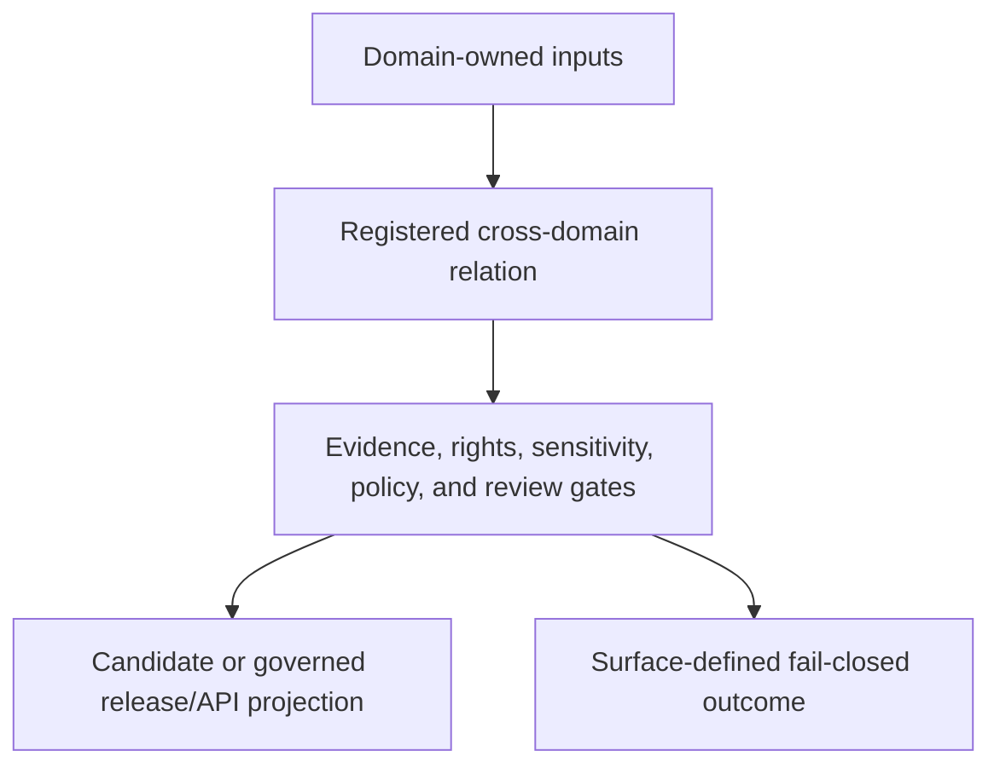

<!-- [KFM_META_BLOCK_V2]
doc_id: kfm://doc/architecture-cross-domain-readme
title: Cross-Domain Architecture
type: standard
version: v0.2.0
status: draft; repository-grounded architecture index; explanatory; non-authoritative
owners:
  - "@bartytime4life - verified CODEOWNERS review route; routing is not stewardship, independent review, or approval"
created: 2026-05-24
updated: 2026-07-26
policy_label: public
related:
  - docs/architecture/README.md
  - docs/architecture/SKELETON_MAP.md
  - docs/doctrine/directory-rules.md
  - docs/adr/ADR-0029-adopt-directory-governance-standard-v2.md
  - docs/doctrine/evidence-first.md
  - docs/doctrine/lifecycle-law.md
  - docs/doctrine/trust-membrane.md
  - docs/registers/DRIFT_REGISTER.md
  - docs/registers/VERIFICATION_BACKLOG.md
tags: [kfm, architecture, cross-domain, evidence, source-role, trust-membrane]
notes:
  - "Same-path Markdown modernization only; no doctrine, ADR status, contract, schema, policy, validator, runtime, release, or publication state changed."
  - "Directory Rules v2.0.0-draft.1 and ADR-0029 remain proposed. The legacy docs/architecture/directory-rules.md path is absent at the evidence boundary even though ADR-0029 still records its deletion as held."
  - "All seven linked sibling architecture pages exist at the evidence boundary and remain v0.1 drafts with unverified placeholder ownership."
[/KFM_META_BLOCK_V2] -->

<a id="top"></a>

# Cross-Domain Architecture

[](#status-and-evidence-boundary)
[](#2-repo-fit--directory-rules-basis)
[](../../doctrine/evidence-first.md)
[](../../adr/ADR-0029-adopt-directory-governance-standard-v2.md)
[](#authority-boundary)

Architecture index for relations that span KFM domain lanes while preserving
ownership, source role, sensitivity, evidence, policy, release, correction, and
rollback boundaries.

> [!IMPORTANT]
> This directory explains how cross-domain composition is intended to work. It does not adopt doctrine or ADRs, define semantic meaning or machine shape, decide policy, prove runtime enforcement, promote a candidate, or publish KFM content. Use the owning doctrine, decision, contract, schema, policy, test evidence, and release record for those claims.

## Navigation

| Read | Use it for |
|---|---|
| [Status and evidence boundary](#status-and-evidence-boundary) | What is confirmed, proposed, conflicted, or still unverified. |
| [1. Scope](#1-scope) | When this lane applies. |
| [2. Repo fit](#2-repo-fit--directory-rules-basis) | Responsibility, authority, and placement basis. |
| [3. Boundary](#3-what-lives-here--what-does-not-live-here) | What belongs here and what must stay elsewhere. |
| [4. Directory map](#4-directory-map) | Verified sibling pages and their roles. |
| [5-10. Architecture](#5-the-cross-domain-landscape) | Flow, anti-collapse, invariants, shared objects, compositions, and placement. |
| [11-12. Risks and decisions](#11-anti-patterns) | Failure modes and unresolved authority work. |
| [13. Related docs](#13-related-docs) | Owning and supporting surfaces. |
| [Validation](#validation-and-maintenance) | Document checks, workflow holds, review, and rollback. |
| [14. Appendix](#14-appendix--glossary-and-reference) | Vocabulary, truth labels, and change history. |

---

## Status and evidence boundary

| Surface | Verified state at `main@67f1d7eac9baabd69da997ba569de54c6b7c1d11` | Meaning |
|---|---|---|
| This README | Present at `docs/architecture/cross-domain/README.md`; baseline blob `5ed58879a3724439cf296845241960fc1f39cdc8`; 510 lines; LF endings; final newline present. | File presence proves documentation only. |
| Sibling architecture pages | All seven pages in the [directory map](#4-directory-map) exist; each identifies itself as version `v0.1`, status `draft`, updated 2026-05-24, with placeholder ownership. | The lane is implemented as documentation, but adoption, review, and enforcement are not established. |
| Proposed Directory Rules successor | [`docs/doctrine/directory-rules.md`](../../doctrine/directory-rules.md) is `2.0.0-draft.1`, `PROPOSED_FOR_ADOPTION`, blob `fd49a0b83e55cef52c1124281f093e263526898d`. | Useful proposed placement guidance; no adoption or supersession effect. |
| Adoption decision | [ADR-0029](../../adr/ADR-0029-adopt-directory-governance-standard-v2.md) is `proposed`. | It does not adopt v2, accept this lane, or authorize dependent migration. |
| Legacy Directory Rules path | `docs/architecture/directory-rules.md` returns `404` at the evidence boundary, while ADR-0029 still records deletion as `HOLD / not authorized`. | **CONFLICTED:** absence must not be interpreted as accepted migration, supersession, or consumer closure. |
| Review routing | [`.github/CODEOWNERS`](../../../.github/CODEOWNERS) routes the default `*` pattern to `@bartytime4life`. | Routing is not a StewardshipAssignment, ReviewRecord, independent approval, or publication authority. |
| Documentation automation | [`link-check.yml`](../../../.github/workflows/link-check.yml) and [`docs-build.yml`](../../../.github/workflows/docs-build.yml) run read-only readiness holds on pull requests. | They do not check links, render this page, deploy a preview, or prove its claims. |

### Truth posture

- **CONFIRMED:** the pinned file, sibling, authority, CODEOWNERS, and workflow facts listed above.
- **PROPOSED:** unaccepted Directory Rules v2 placement profiles and architecture expectations not backed by accepted contracts or executable proof.
- **UNKNOWN:** external consumers, runtime conformance, current branch-protection coupling, and accountable cross-domain stewardship.
- **NEEDS VERIFICATION:** accepted source-role vocabulary, seam registry, owning contracts/schemas/policy, substantive cross-domain tests, and correction/rollback drills.
- **CONFLICTED:** Directory Rules adoption and legacy-path migration state.

[Back to top](#top)

---

## 1. Scope

Use this lane when a design, relation, validator, contract, policy question, map interaction, or release concern spans two or more domain-owned objects.

Typical readers include:

- maintainers designing a relation between domain lanes;
- reviewers checking that a join preserves ownership, source role, sensitivity, time, and evidence;
- contract, schema, policy, fixture, test, validator, API, UI, and release authors who need a shared cross-domain vocabulary;
- stewards investigating cross-domain drift, correction propagation, or rollback impact.

Do not use this lane merely because one domain depends on another system. A file with one clear domain owner remains in that domain lane and references its dependencies.

> [!TIP]
> Start with the artifact's authority owner, not its topic. If two owners must independently define the same artifact, split it into linked artifacts before choosing paths.

[Back to top](#top)

---

## 2. Repo fit — Directory Rules basis

### Responsibility signature

| Axis | This README |
|---|---|
| Artifact kind | Human architecture index and nested directory README |
| Authority owner | Human-readable cross-domain architecture explanation |
| Lifecycle stage | Not applicable; this file carries no lifecycle payload |
| Scope | Cross-domain architecture lane |
| Exposure | Public repository documentation |
| Mutability | Versioned replacement through review |
| Current action | Same-path update; no move, rename, new root, or parallel authority |

The existing `docs/architecture/cross-domain/` lane is repository evidence. Proposed Directory Rules v2 section 12.5 also describes cross-domain architecture pages at `docs/architecture/cross-domain/<seam_id>.md`, but v2 is not controlling until a reviewed decision accepts it. This update therefore preserves the current path without claiming that the broader authority conflict is resolved.

<a id="authority-boundary"></a>

### Authority boundary

| Surface | Owns | This README may do |
|---|---|---|
| [`docs/doctrine/`](../../doctrine/README.md) | KFM-wide intended invariants and vocabulary, subject to each document's status | Explain and link; never silently amend. |
| [`docs/adr/`](../../adr/README.md) | Numbered decisions and their effective status | Cite exact status; never infer acceptance. |
| [`contracts/`](../../../contracts/README.md) | Semantic meaning | Point to an owning contract; do not redefine objects here. |
| [`schemas/`](../../../schemas/README.md) | Machine-checkable shape | Point to a schema; do not treat prose as validation. |
| [`policy/`](../../../policy/README.md) | Surface-specific admissibility decisions | Describe the boundary; do not invent a universal outcome enum. |
| [`tests/`](../../../tests/README.md) and [`fixtures/`](../../../fixtures/README.md) | Representative enforceability evidence | Cite observed coverage and gaps; do not infer it from filenames. |
| [`release/`](../../../release/README.md) | Promotion, release, correction, withdrawal, and rollback decisions | Explain dependencies; never claim publication. |
| This lane | Cross-domain explanatory architecture and navigation | Preserve boundaries, surface conflicts, and route readers to owners. |

> [!CAUTION]
> Architecture prose is not an enforcement shortcut. A diagram, badge, README, merge, or green readiness hold cannot replace an accepted decision, resolvable evidence, policy result, review record, release manifest, correction notice, or rollback target.

[Back to top](#top)

---

## 3. What lives here · What does not live here

### What lives here

- architecture explanations that genuinely span multiple domain lanes;
- cross-domain relation patterns and seam vocabulary;
- source-role anti-collapse and trust-boundary explanations;
- shared-object dependency maps that link to owning contracts and schemas;
- placement guidance clearly distinguished as current evidence, accepted law, or proposal;
- open verification items and ADR triggers for cross-domain authority changes.

### What does not live here

| Excluded content | Owning surface |
|---|---|
| Domain-specific architecture | `docs/domains/<domain>/` |
| Binding architecture decision | `docs/adr/` |
| KFM-wide intended invariant | `docs/doctrine/` |
| Semantic contract or machine schema | `contracts/` or `schemas/` |
| Executable policy, validator, pipeline, or application code | `policy/`, `tools/`, `pipelines/`, `packages/`, or `apps/` |
| RAW, WORK, QUARANTINE, processed, catalog, proof, receipt, or published payload | The applicable governed `data/` lane |
| Promotion, release, correction, withdrawal, or rollback decision | `release/` |
| Precise sensitive ecological, archaeological, cultural, living-person, genomic, land/title, or infrastructure data | Restricted owning systems; never made public-safe by documentation placement |

[Back to top](#top)

---

<a id="4-directory-tree-proposed"></a>

## 4. Directory map

The following direct children were read from `main` during this update. Their presence and self-declared draft state are confirmed; their architecture claims remain bounded by the evidence and authority they cite.

```text
docs/architecture/cross-domain/
├── README.md                        # lane index and boundary - this file
├── compositional-units.md           # Focus Mode, Frontier Matrix, and 3D compositions
├── cross-lane-relations.md          # ownership, source-role, sensitivity, and evidence invariants
├── multi-domain-placement.md        # responsibility-root placement guidance
├── responsibility-layers.md         # evidence through operations as orthogonal layers
├── shared-kernel.md                 # draft shared-object architecture vocabulary
├── source-role-anti-collapse.md     # draft source-role vocabulary and collapse failures
└── trust-membrane.md                # public-versus-internal boundary explanation
```

| Page | Primary question | Repository-grounded status |
|---|---|---|
| [Source-role anti-collapse](./source-role-anti-collapse.md) | What meaning must not collapse when sources compose? | `v0.1` draft; placeholder ownership |
| [Cross-lane relations](./cross-lane-relations.md) | What must a relation preserve at a domain boundary? | `v0.1` draft; placeholder ownership |
| [Shared kernel](./shared-kernel.md) | Which object families are intended to connect domains? | `v0.1` draft; placeholder ownership |
| [Trust membrane](./trust-membrane.md) | What may cross from internal or candidate state to governed public use? | `v0.1` draft; placeholder ownership |
| [Compositional units](./compositional-units.md) | How do Focus Modes, matrix views, and 3D compose without becoming domains? | `v0.1` draft; placeholder ownership |
| [Multi-domain placement](./multi-domain-placement.md) | How should a shared artifact be routed by responsibility? | `v0.1` draft; placeholder ownership |
| [Responsibility layers](./responsibility-layers.md) | How do evidence, policy, release, API, UI, AI, and operations remain distinct? | `v0.1` draft; placeholder ownership |

[Back to top](#top)

---

## 5. The cross-domain landscape

A cross-domain relation is a composition, not a transfer of authority. Each side keeps its owner and evidence lineage; the relation receives its own identity, scope, policy treatment, review state, and release consequences where the owning contracts require them.


```mermaid
flowchart TD
    A["Domain-owned inputs"] --> B["Registered cross-domain relation"]
    B --> C["Evidence, rights, sensitivity, policy, and review gates"]
    C --> D["Candidate or governed release/API projection"]
    C --> E["Surface-defined fail-closed outcome"]
```

The diagram is an architecture model, not runtime proof. Exact object names, fields, gate order, and finite outcomes come from the applicable accepted contracts, schemas, policy, tests, and release process.

### Minimum relation questions

1. Who owns each input and the relation itself?
2. What source role, spatial scope, temporal scope, rights posture, and sensitivity follow each side?
3. Which `EvidenceRef` values resolve, and what evidence supports the relation rather than only its inputs?
4. Which contract and schema define the relation?
5. Which policy surface decides its use, and which negative outcomes are valid there?
6. What review, release, correction, withdrawal, invalidation, and rollback obligations propagate downstream?

[Back to top](#top)

---

## 6. Source-role anti-collapse

Source role must remain visible through normalization, joins, projections, summaries, AI interpretation, and release review. Promotion may change lifecycle or review state; it does not retroactively change what a source can prove.

The seven-role vocabulary below is preserved from this lane's v0.1 drafts and supplied architecture lineage. Its acceptance as one repository-wide canonical enum remains **NEEDS VERIFICATION**.

| Draft role | Bounded meaning | Collapse to prevent |
|---|---|---|
| Observed | Direct measurement or first-hand evidentiary record | Model, aggregate, or regulation presented as an observation |
| Regulatory | Determination with governing or legal force | Zone or designation presented as an observed event |
| Modeled | Derived estimate with inputs, assumptions, uncertainty, and run identity | Estimate presented as direct measurement |
| Aggregate | Summary over a declared unit or interval | Aggregate presented as a person-, parcel-, or place-specific fact |
| Administrative | Record compiled for administration, registration, or accounting | Compilation presented as direct observation |
| Candidate | Unresolved or unpromoted record under validation or review | Candidate exposed as released public truth |
| Synthetic | Simulated, reconstructed, interpolated, or generated representation | Representation presented as observed reality |

### Fail-closed patterns

| Pattern | Required architectural response |
|---|---|
| Role is missing or ambiguous | Hold, abstain, deny, or quarantine according to the owning contract; do not guess. |
| Join changes a role label | Reject the relation or record an explicit, reviewable derivation that preserves input roles. |
| Aggregate is narrowed to an individual or exact place | Deny the unsupported inference and retain the aggregate scope. |
| Synthetic or AI-generated content is treated as evidence | Require underlying evidence and a visible representation boundary; generated language remains interpretive. |
| Candidate or restricted state reaches an ordinary public client | Stop at the trust boundary and require governed promotion and release evidence. |

See [Source-Role Anti-Collapse](./source-role-anti-collapse.md) for the extended draft register.

[Back to top](#top)

---

## 7. Cross-lane relations — the four invariants

The sibling [Cross-Lane Relations](./cross-lane-relations.md) page carries four draft invariants. This README preserves them as architecture expectations while avoiding a claim that a substantive validator currently enforces them.

| Invariant | Relation requirement | Failure signal |
|---|---|---|
| Ownership preserved | Keep each input's owning domain and identify the owner of the relation. | A join silently rebinds or overrides an owner. |
| Source role preserved | Carry each input's role and any explicit derivation into the relation. | A relation makes unlike roles look equivalent. |
| Sensitivity preserved | Apply the most restrictive relevant posture until owning policy authorizes a safer projection. | Aggregation or joining silently lowers protection. |
| Evidence support preserved | Resolve evidence for consequential input and relation claims before authoritative use. | A plausible relation outruns its evidence. |

These invariants do not define one universal policy outcome vocabulary. A governed response may use `ANSWER | ABSTAIN | DENY | ERROR`; a validator, review, promotion, or placement surface may use a different contract-defined set.

[Back to top](#top)

---

## 8. Shared-kernel objects

The terms below are cross-domain architecture vocabulary carried by the current lane. Their authoritative fields, versions, and compatibility rules belong in verified contracts and schemas.

| Object family | Cross-domain purpose | Boundary |
|---|---|---|
| `SourceDescriptor` | Carries stable source identity, role, authority, rights, sensitivity, and freshness context. | A descriptor does not make a source admissible or public-safe. |
| `EvidenceRef` and `EvidenceBundle` | Connect a consequential claim to resolvable support. | A pointer is not closure until it resolves and passes applicable policy. |
| `PolicyDecision` | Records a decision, reasons, and obligations for a defined policy surface. | Do not infer one universal enum across surfaces. |
| `DecisionEnvelope` or runtime response envelope | Makes governed response state explicit. | Exact envelope identity and fields require contract verification. |
| `RunReceipt` and `AIReceipt` | Record process or interpretive execution context. | A receipt is not proof, review, release, or publication. |
| `ReleaseManifest` | Binds an approved release to identified inputs, proofs, policy, and carriers. | A filename, commit, PR, or GitHub release is not a KFM release manifest. |
| `RollbackCard` and correction records | Preserve prior-safe targets and visible correction lineage. | Rollback must not erase history or recreate parallel writers. |
| `MapContextEnvelope` | Bounds map, time, selection, evidence, and policy context for a governed interaction. | A map selection cannot bypass evidence or policy. |

Before adding, renaming, merging, or retiring a shared object family, inspect the owning contract, schema, policy, fixtures, tests, consumers, and decision history. An authority-changing rename requires a governed decision and migration plan.

[Back to top](#top)

---

## 9. Cross-cutting compositional units

This lane carries three cross-cutting concepts from KFM architecture lineage. None becomes a domain or a repository root by topic alone.

| Unit | Composition | Current boundary |
|---|---|---|
| Focus Mode | A bounded geographic, temporal, evidence, UI, and release slice across selected domains. | Exact repository profile and current implementation remain **NEEDS VERIFICATION**. |
| Frontier Matrix | A comparative panel across place, time, and multiple domain measures. | Derived matrix cells do not replace underlying domain evidence or release state. |
| Planetary / 3D / digital-twin view | A renderer-level composition of released or candidate representations. | Rendering is not truth, policy, review, or publication authority. |

See [Cross-Cutting Compositional Units](./compositional-units.md) for the extended draft treatment. Verify every proposed path there before implementation.

[Back to top](#top)

---

## 10. Multi-domain file placement

For any new shared artifact, identify one authority owner first, then add a registered seam identifier only after selecting the owning responsibility root.

Proposed Directory Rules v2 section 12.5 gives the following examples. They remain **PROPOSED** until adoption and registry support are verified:

| Artifact | Proposed v2 lane |
|---|---|
| Architecture explanation | `docs/architecture/cross-domain/<seam_id>.md` |
| Semantic contract | `contracts/cross_domain/<seam_id>/` |
| Test | `tests/cross_domain/<seam_id>/` |
| Repository validator | `tools/validators/cross_domain/<seam_id>/` |

For schemas, policy, fixtures, pipelines, data, releases, or public carriers, use the owning root and an accepted local profile. Do not copy the v0.1 README's guessed `<topic>/` paths into implementation without verifying the current authority, registry, writers, consumers, and migration impact.

### Placement decision

1. classify the artifact and its single authority owner;
2. select the responsibility root;
3. reject roots that violate lifecycle, exposure, mutation, or dependency boundaries;
4. use a verified domain, source, object-family, geography, or seam identifier;
5. search for canonical, compatibility, generated, and legacy copies;
6. preserve single-write authority and dependency direction;
7. return a finite result: place, split, migrate, mirror, hold, or deny under the controlling rules.

When authority remains unresolved, `HOLD` is the safe result. A convenient path is not evidence.

[Back to top](#top)

---

## 11. Anti-patterns

| Anti-pattern | Why it fails | Required response |
|---|---|---|
| Pick a "lead" domain for a shared artifact | Creates false ownership and asymmetric dependencies. | Route by authority owner or split the artifact. |
| Re-state a contract or schema in architecture prose | Creates a second semantic or machine authority. | Link to the owner and explain only the relationship. |
| Collapse source roles during a join | Changes what evidence can prove. | Preserve roles and record explicit derivation. |
| Treat a plausible relation as evidence | Fluency or spatial proximity substitutes for support. | Resolve evidence or fail closed. |
| Lower sensitivity through aggregation or rendering | Derived surfaces become an exposure channel. | Apply owning policy, generalization, review, and public-safe projection. |
| Let UI, map, graph, index, tile, scene, or AI become truth | A downstream carrier becomes sovereign. | Route through governed evidence, policy, and release boundaries. |
| Treat a receipt, proof, catalog record, and release manifest as interchangeable | Trust-object responsibilities collapse. | Keep object families and writers separate. |
| Treat proposed Directory Rules or an unaccepted ADR as active law | Dependent work outruns authority. | Keep the proposal labeled and wait for reviewed adoption. |
| Hide correction or rollback impact | Consumers continue using stale or withdrawn state. | Preserve lineage and propagate correction, invalidation, and rollback. |

[Back to top](#top)

---

## 12. Open questions and ADR triggers

| Item | State | Evidence or decision required |
|---|---|---|
| Directory Rules authority and legacy-path deletion | **CONFLICTED** | Reconcile current tree with proposed ADR-0029, reverify consumers and fragments, and record an effective reviewed decision before claiming migration completion. |
| Prior `OPEN-DR-10` folder-versus-file question | **LINEAGE / NARROWED** | The folder and seven siblings now exist, and proposed v2 explicitly describes the lane. Formal placement authority still depends on adopted rules; this README does not declare the old issue accepted or closed. |
| Cross-domain seam registry and IDs | **NEEDS VERIFICATION** | Machine register, ownership, aliases, schema, fixtures, validator, tests, and migration rules. |
| Source-role vocabulary | **NEEDS VERIFICATION** | Accepted semantic contract or decision that defines the enum, extension policy, mappings, and negative cases. |
| Shared-object authority | **NEEDS VERIFICATION** | Object-to-contract-to-schema-to-policy-to-test crosswalk and compatible versioning. |
| Cross-domain policy outcomes | **NEEDS VERIFICATION** | Surface-specific contracts; no universal enum should be inferred here. |
| Sibling ownership and maturity | **NEEDS VERIFICATION** | Replace placeholder owners only with verified stewardship and review evidence; review each v0.1 draft against current repository state. |
| Link and render enforcement | **HOLD** | Accepted repository-native link checker, deterministic fixtures, Markdown/Mermaid render validation, and explicit docs-build contract. |
| Runtime, correction, and rollback proof | **UNKNOWN** | Substantive tests, observed governed flow, release records, correction propagation, cache invalidation, and rollback drill evidence. |

An open question becomes ADR-class when it changes an authority owner, canonical or compatibility path, shared object identity, trust boundary, lifecycle or release responsibility, public exposure, or migration/rollback contract.

[Back to top](#top)

---

## 13. Related docs

### Directory authority and repository orientation

| Reference | Role | Current status |
|---|---|---|
| [Directory Rules v2](../../doctrine/directory-rules.md) | Proposed successor placement standard | `PROPOSED_FOR_ADOPTION`; not controlling |
| [ADR-0029](../../adr/ADR-0029-adopt-directory-governance-standard-v2.md) | Proposed adoption and compatibility migration decision | `proposed`; no adoption effect |
| [Architecture README](../README.md) | Parent explanatory boundary | Existing but contains stale repository-state placeholders |
| [Skeleton Map](../SKELETON_MAP.md) | Repository orientation and design lineage | Documentation; not implementation proof |
| [Domain documentation](../../domains/README.md) | Per-domain architecture and lane orientation | Existing repository-grounded draft; the domain roster belongs there |
| [Drift Register](../../registers/DRIFT_REGISTER.md) | Recorded structural conflicts | Existing human register |
| [Verification Backlog](../../registers/VERIFICATION_BACKLOG.md) | Open verification work | Existing human register; current coverage is incomplete |

### Trust and lifecycle

- [Evidence First](../../doctrine/evidence-first.md) - draft cite-or-abstain and evidence-closure doctrine.
- [Lifecycle Law](../../doctrine/lifecycle-law.md) - draft lifecycle and promotion doctrine.
- [Trust Membrane](../../doctrine/trust-membrane.md) - draft public-versus-internal boundary doctrine.
- [Authority Ladder](../../doctrine/authority-ladder.md) - draft source and decision ordering.

### Owning implementation surfaces

- [Contracts](../../../contracts/README.md) - semantic meaning.
- [Schemas](../../../schemas/README.md) - machine shape.
- [Policy](../../../policy/README.md) - admissibility.
- [Tests](../../../tests/README.md) and [fixtures](../../../fixtures/README.md) - representative enforceability evidence.
- [Release](../../../release/README.md) - promotion, release, correction, withdrawal, and rollback.
- [Governed API](../../../apps/governed-api/README.md) and [Explorer Web](../../../apps/explorer-web/README.md) - draft public-boundary and map-client documentation.

[Back to top](#top)

---

## Validation and maintenance

### Document validation

For a change to this README:

- preserve the stable `doc_id`, path, created date, and explicit `#top` anchor;
- verify one H1, logical heading levels, balanced fences, valid tables and alerts, unique explicit anchors, and a final newline;
- verify every introduced or changed repository-relative link at the proposed head;
- check internal fragments against GitHub heading slugs;
- parse Mermaid source and inspect its rendered meaning when tooling is available;
- distinguish accepted authority, current repository fact, design lineage, proposal, and unknown;
- scan for secrets, private URLs, personal data, sensitive locations, and rights-restricted material;
- ensure the diff changes only this path and does not imply runtime, policy, release, or publication maturity.

### Current workflow posture

The repository's `link-check` and `docs-build` workflows intentionally report readiness holds. A green result means the hold assumptions remain unchanged; it does not mean links were resolved, Markdown or Mermaid rendered, accessibility passed, or documentation was published.

### Review burden

- CODEOWNERS routes this path to `@bartytime4life` through the default rule.
- Architecture, affected domain, contract/schema, policy, evidence, sensitivity, API/UI, and release reviewers are required when the substance touches their authority.
- Accountable stewardship and independent approval remain **NEEDS VERIFICATION**.
- This README must not self-approve a new object family, path, outcome vocabulary, trust-boundary exception, or public exposure.

### Correction and rollback

If this README conflicts with an owning authority or current evidence:

1. narrow or withdraw the unsupported claim;
2. link the owning source and preserve the correction history;
3. record material structural drift in the approved register;
4. update affected inbound links and fragments;
5. re-run document validation.

Before merge, rollback is leaving or closing the draft PR or replacing its commit through a reviewed update. After merge, use a transparent revert or corrective PR; do not rewrite shared history. Reverting this README does not revert any separate runtime, policy, release, or public state.

[Back to top](#top)

---

## 14. Appendix — glossary and reference

<details>
<summary><strong>Cross-domain vocabulary</strong></summary>

| Term | Bounded meaning |
|---|---|
| Domain | A responsibility lane with owned semantics and governed relations to other lanes. |
| Cross-domain relation | An identified relation between domain-owned objects that preserves each side's authority and evidence. |
| Seam ID | A proposed stable identifier for one cross-domain concern; registry support remains unverified. |
| Source role | What a source or derivative can and cannot prove. |
| Anti-collapse | Refusal to silently make unlike source roles, owners, sensitivities, evidence, or trust objects equivalent. |
| Shared object | An object family referenced across domains through owning contracts and schemas. |
| Trust membrane | The boundary that keeps internal, candidate, restricted, or unreleased state out of ordinary public use. |
| Compositional unit | A bounded view or proof slice that combines domain outputs without becoming a domain or root. |
| Governed projection | A policy- and release-aware derivative or response; not canonical truth by itself. |

</details>

<details>
<summary><strong>Truth-label legend</strong></summary>

- **CONFIRMED** - verified from pinned repository evidence or supplied source material in this review.
- **PROPOSED** - a design or decision not yet accepted or implemented.
- **UNKNOWN** - available evidence is insufficient.
- **NEEDS VERIFICATION** - a concrete check can resolve the claim.
- **CONFLICTED** - admissible evidence or writable authority surfaces disagree.
- **LINEAGE** - preserved prior design or history; not current authority by itself.
- **NARROWED** - scope was deliberately reduced to remain supportable or safe.

</details>

<details>
<summary><strong>Change history</strong></summary>

| Version | Date | Change |
|---|---|---|
| `v0.2.0` | 2026-07-26 | Re-grounded the complete README against the repository; replaced stale path and owner assumptions; verified all seven siblings; repaired badges and links; separated accepted authority from proposed v2 guidance; surfaced the legacy-path conflict and workflow holds; preserved core anti-collapse, invariant, shared-object, placement, risk, correction, and rollback material. Markdown only. |
| `v0.1` | 2026-05-24 | Initial draft architecture landing page. |

</details>

**Last evidence review:** 2026-07-26  
**Evidence boundary:** `main@67f1d7eac9baabd69da997ba569de54c6b7c1d11`  
**Review trigger:** authority, sibling, contract/schema, policy, writer, consumer, exposure, sensitivity, workflow, release, correction, withdrawal, invalidation, or rollback change.

[Back to top](#top)
