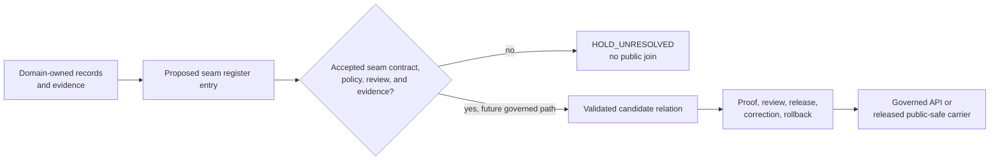

<!-- [KFM_META_BLOCK_V2]
doc_id: kfm://doc/architecture-cross-domain-readme
title: Cross-Domain Architecture
type: standard
version: v0.3.0
status: draft; repository-grounded architecture index; explanatory; projection-aware; non-authoritative
owners:
  - "@bartytime4life - verified CODEOWNERS review route; routing is not stewardship, independent review, or approval"
owner_status: "Accepted cross-domain architecture, domain, evidence, policy, release, and migration stewards remain NEEDS VERIFICATION"
created: 2026-05-24
updated: 2026-08-14
policy_label: public
truth_posture: cite-or-abstain
owning_root: docs/
responsibility_root: docs/
responsibility: "Explain cross-domain architecture, seam ownership, anti-collapse constraints, repository topology, and trust boundaries without becoming contract, schema, policy, registry, test, release, or publication authority."
current_path: docs/architecture/cross-domain/README.md
supersedes:
  - v0.2.0 at the same path
superseded_by: []
evidence_snapshot:
  repository: bartytime4life/Kansas-Frontier-Matrix
  base_ref: main
  base_commit: 3974da9794fa11bd5355c49243c9193d22b9e81e
  target_prior_blob: b8c7396aed20a14c54a011a02b8ded78839868f3
  directory_rules_blob: fd49a0b83e55cef52c1124281f093e263526898d
  directory_rules_sha256: sha256:44f7e94344cb42b630008eb0bc03a13fcb97dbdfba6f3e56579693a272571e6e
  adr_0029_blob: a4de0d7a96b78da59cfc499d1025e1508afd8dd9
  legacy_directory_rules_blob: 18653c00ba193a4afaa3e07a0924452807fb98ef
  root_registry_blob: 024f668b5f0a9239bafa4f8b09e2afd86300ff8c
  domain_lane_register_blob: 1bfc6f91cfa713a5e3d51ece011b63b46310734f
  cross_domain_seam_register_blob: dc87ea9c2ab11cc10e51cf4e8284c030e7c9ab29
  cross_domain_seam_contract_blob: e03e6b18b0b3b287393728de2d096b1875502445
  cross_domain_seam_schema_blob: 835a78d7fa538bccc642741343e58173a58bab82
  cross_domain_seam_validator_blob: 94693fced0628eae6b363e5238d26a93d2cf39e9
  cross_domain_seam_tests_blob: 9be5f155a09fc2bf40432630c5ae2dfbea248ab7
  cross_domain_seam_workflow_blob: 628e86a2290b2f43d49af36278c3d291a0cd2e50
  cross_domain_seam_receipt_blob: c7696716c3292f2a1cac020e15270e57187b2153
  codeowners_blob: dd2a84aa514d8ecd9208bc347f90f9a2ed37dd61
  direct_child_files: 9
  latest_observed_seam_workflow_run: 31804168422
  latest_observed_seam_workflow_head: 4485290384b68a70283275b7b9773dc817e4fe26
  latest_observed_seam_workflow_result: success
inspection_boundary: >
  Current-session GitHub reads covered this README, every direct sibling page,
  accepted ADR-0029, the adopted Directory Rules bytes and restored legacy compatibility
  body, Root Registry, Domain Lane Register, Cross-Domain Seam Register contract/schema/
  instance/validator/tests/workflow/generated receipt, representative cross-domain contract,
  join-schema, test, pipeline, application, release, and CODEOWNERS surfaces, open pull
  requests, active branches, and the latest observed hosted seam-register run. No live source,
  deployed API, policy evaluator, production database, public client, release packet,
  correction cascade, cache invalidation, or rollback execution was exercised.
related:
  - docs/architecture/README.md
  - docs/architecture/SKELETON_MAP.md
  - docs/doctrine/directory-rules.md
  - docs/adr/ADR-0029-adopt-directory-governance-standard-v2.md
  - docs/doctrine/evidence-first.md
  - docs/doctrine/lifecycle-law.md
  - docs/doctrine/trust-membrane.md
  - docs/registers/DRIFT_REGISTER.md
  - docs/registers/VERIFICATION_BACKLOG.md
  - control_plane/root_registry.yaml
  - control_plane/domain_lane_register.yaml
  - control_plane/cross_domain_seam_register.yaml
  - contracts/governance/cross_domain_seam_register.md
  - schemas/contracts/v1/governance/cross_domain_seam_register.schema.json
  - tools/validators/directory_governance/validate_cross_domain_seam_register.py
  - tests/validators/directory_governance/test_validate_cross_domain_seam_register.py
  - .github/workflows/cross-domain-seam-register.yml
  - data/receipts/generated/genrec-cross-domain-seam-register-20260808.json
tags: [kfm, architecture, cross-domain, context-map, seam-register, evidence, source-role, sensitivity, trust-membrane, correction, rollback]
notes:
  - "v0.3.0 is a same-path repository-evidence refresh. It changes documentation and its required generated-work receipt only."
  - "ADR-0029 is accepted and adopts the exact Directory Rules v2 bytes at docs/doctrine/directory-rules.md; the internal PROPOSED_FOR_ADOPTION label remains part of those pinned bytes and does not undo the accepted decision."
  - "The restored docs/architecture/directory-rules.md body is read-only compatibility state; tombstoning and physical deletion remain separate held migration work."
  - "The Cross-Domain Seam Register exists as a PROPOSED navigational and review projection. Its five entries remain HOLD_UNRESOLVED, public_join_allowed false, and seam_contract_path null."
  - "This update assigns no seam owner, activates no join, accepts no source-role enum, changes no contract/schema/policy/validator/runtime behavior, and releases or publishes nothing."
[/KFM_META_BLOCK_V2] -->

<a id="top"></a>

# Cross-Domain Architecture

[](#status-and-evidence-boundary)
[](../../adr/ADR-0029-adopt-directory-governance-standard-v2.md)
[](#5-the-cross-domain-landscape)
[](../../doctrine/evidence-first.md)
[](#authority-boundary)

Architecture index for relations that span KFM domain lanes while preserving bounded-context ownership, source role, evidence, time, rights, sensitivity, policy, review, release, correction, and rollback boundaries.

> [!IMPORTANT]
> **This directory explains cross-domain architecture; it does not create cross-domain authority.** Accepted Directory Rules establish the placement model, while the current machine register remains a proposed projection. A page, register entry, schema-valid object, green workflow, or plausible spatial relation does not authorize a join, activate a source, mutate a domain record, lower sensitivity, release a carrier, or publish a claim.

> [!CAUTION]
> **Every currently registered seam is held.** The five entries in `control_plane/cross_domain_seam_register.yaml` are `HOLD_UNRESOLVED`, prohibit public joins, carry no seam contract path, and retain `mutation_authority: false` and `publication_authority: false` through the register defaults. Treat this as fail-closed architecture evidence, not as an active integration catalog.

## Navigation

| Read | Use it for |
|---|---|
| [Status and evidence boundary](#status-and-evidence-boundary) | Current authority, repository evidence, workflow evidence, and limits. |
| [1. Scope](#1-scope) | When a relation is genuinely cross-domain. |
| [2. Repo fit](#2-repo-fit--directory-rules-basis) | Accepted placement basis and responsibility signature. |
| [3. Boundary](#3-what-lives-here--what-does-not-live-here) | What belongs here and what remains in owning roots. |
| [4. Directory map](#4-directory-map) | The nine direct files and their different maturity levels. |
| [5. Landscape](#5-the-cross-domain-landscape) | Seam register, context-map flow, and current held entries. |
| [6-10. Architecture](#6-source-role-anti-collapse) | Anti-collapse, invariants, shared objects, composition, and placement. |
| [11-12. Risks and decisions](#11-anti-patterns) | Failure modes, conflicts, and ADR triggers. |
| [13. Related docs](#13-related-docs) | Owning and adjacent surfaces. |
| [Validation](#validation-and-maintenance) | Repository-native checks, workflow scope, review, and rollback. |
| [14. Appendix](#14-appendix--glossary-and-reference) | Vocabulary, truth labels, evidence ledger, and history. |

---

## Status and evidence boundary

| Surface | Verified state at `main@3974da9794fa11bd5355c49243c9193d22b9e81e` | Meaning |
|---|---|---|
| This README | Present at the stable path; prior blob `b8c7396aed20a14c54a011a02b8ded78839868f3`. | Same-path documentation modernization; no structural authority change. |
| Directory contents | Nine direct files: this README plus eight sibling architecture pages. | Presence proves documentation inventory, not acceptance or runtime behavior. |
| Directory Rules | [`docs/doctrine/directory-rules.md`](../../doctrine/directory-rules.md) is the sole writable human authority adopted by accepted [ADR-0029](../../adr/ADR-0029-adopt-directory-governance-standard-v2.md). | Section 12.5 places shared architecture explanation in this lane and routes other artifacts by responsibility root. |
| Legacy Directory Rules body | [`docs/architecture/directory-rules.md`](../directory-rules.md) exists as a restored, read-only compatibility body. | Its presence preserves consumers; tombstoning and physical deletion remain separate migration work. |
| Root and domain projections | [`root_registry.yaml`](../../../control_plane/root_registry.yaml) and [`domain_lane_register.yaml`](../../../control_plane/domain_lane_register.yaml) exist as machine projections. | They support validation and navigation but cannot create authority independently. |
| Cross-Domain Seam Register | [`cross_domain_seam_register.yaml`](../../../control_plane/cross_domain_seam_register.yaml) is `PROPOSED`, partial, and projection-only, with five held entries. | No seam is active, public, or authorized merely because it is registered. |
| Contract and schema | A proposed semantic contract and closed JSON Schema define the register projection. | Meaning and shape are implemented as draft artifacts; neither authorizes a join. |
| Validator and tests | A bounded validator plus focused deterministic tests check shape, identity, registered domains, fail-closed state, and repository bindings. | Evidence is limited to the assertions actually encoded and executed. |
| Hosted seam workflow | Latest observed run `31804168422` succeeded at `4485290384b68a70283275b7b9773dc817e4fe26`. | This is prior exact-head evidence, not proof for current main or this README change. |
| Generated seam receipt | `genrec-cross-domain-seam-register-20260808.json` exists with human review pending. | Process memory and byte binding; not proof, approval, release, or publication. |
| Review routing | [`.github/CODEOWNERS`](../../../.github/CODEOWNERS) falls through to `@bartytime4life`. | Routing is not accepted stewardship, independent review, policy approval, or release authority. |

### Truth posture

- **CONFIRMED:** the pinned paths, blobs, statuses, direct-child inventory, register entries, workflow source, and latest observed hosted result described here.
- **PROPOSED:** the seam-register authority model, shared source-role vocabulary, unresolved path convergence, and any future active seam profile.
- **UNKNOWN:** deployed cross-domain runtime behavior, production data joins, public-client behavior, complete seam coverage, correction propagation, and rollback execution.
- **NEEDS VERIFICATION:** accountable stewards, authenticated review authority, accepted per-seam contracts and policy, exact-current-head workflow results, and consumer closure for any migration.
- **CONFLICTED:** current cross-domain implementation naming and responsibility placement across `cross_domain`, `cross_lane`, `joins`, domain-local, and topic-specific paths.
- **HOLD:** every registered cross-domain seam and every proposed public join.

[Back to top](#top)

---

## 1. Scope

Use this lane when an architecture question genuinely spans two or more bounded domain contexts and the relation itself needs explicit ownership, evidence, policy, sensitivity, release, or correction treatment.

Typical readers include:

- maintainers designing a relation between domain-owned objects;
- reviewers checking that a join preserves ownership, source role, spatial and temporal scope, rights, sensitivity, and evidence;
- contract, schema, policy, fixture, test, validator, pipeline, API, UI, AI, and release authors aligning one seam without creating parallel authority;
- stewards investigating drift, false inference, correction propagation, cache invalidation, withdrawal, or rollback across domain boundaries.

Do **not** use this lane merely because one domain consumes another domain's released output. A file with one clear authority owner remains in that responsibility and domain lane, references its dependency, and preserves the other domain's identity.

> [!TIP]
> Start with the artifact's one authority owner, not its topic or most visible consumer. If two authorities need to edit the same artifact independently, return `SPLIT` before choosing a path.

[Back to top](#top)

---

## 2. Repo fit — Directory Rules basis

### Responsibility signature

| Axis | This README |
|---|---|
| Artifact kind | Human architecture index and nested directory README |
| Authority owner | Human-readable cross-domain architecture explanation |
| Lifecycle stage | Not applicable; no lifecycle payload |
| Execution role | None |
| Scope kind | Cross-domain architecture lane |
| Exposure | Public repository documentation |
| Mutability | Versioned replacement through review |
| Retention | Durable documentation |
| Placement result | `PLACE` at the existing same path |
| Current action | Update in place; add the required generated-work receipt; no move, rename, root admission, or migration |

Accepted Directory Rules section 12.5 routes cross-domain artifacts by the responsibility that owns them:

| Artifact responsibility | Accepted placement model |
|---|---|
| Human architecture explanation | `docs/architecture/cross-domain/<seam_id>.md` |
| Semantic contract | `contracts/cross_domain/<seam_id>/` |
| Test | `tests/cross_domain/<seam_id>/` |
| Shared repository validator | `tools/validators/cross_domain/<seam_id>/` |

Those examples establish responsibility routing; they do not make every illustrated path fully implemented, accepted for every object family, or safe to create mechanically. Schemas, policy, fixtures, pipelines, lifecycle instances, releases, and public carriers still go to their own responsibility roots under verified local profiles.

<a id="authority-boundary"></a>

### Authority boundary

| Surface | Owns | This README may do |
|---|---|---|
| [`docs/doctrine/`](../../doctrine/README.md) and accepted ADRs | Governing invariants and reviewed architecture decisions | Explain and link; never silently amend. |
| [`control_plane/`](../../../control_plane/README.md) | Machine-readable projections and indexes | Describe current projection state; never convert it into authority. |
| [`contracts/`](../../../contracts/README.md) | Semantic meaning and interface promises | Point to owning contracts; never redefine fields here. |
| [`schemas/`](../../../schemas/README.md) | Machine-checkable shape | Point to schemas and validators; never claim prose validates an instance. |
| [`policy/`](../../../policy/README.md) | Allow, deny, restrict, hold, and abstain rules | State the boundary; never invent or bypass policy outcomes. |
| [`tests/`](../../../tests/README.md) and [`fixtures/`](../../../fixtures/README.md) | Representative executable conformance | Cite exact assertions and gaps; never infer completeness from filenames. |
| [`data/`](../../../data/README.md) | Lifecycle, registry, receipt, proof, catalog, and published instances | Explain lineage; never write or promote an instance through documentation. |
| [`release/`](../../../release/README.md) | Release, correction, withdrawal, rollback, and signature decisions | Explain prerequisites; never claim publication. |
| This lane | Cross-domain explanatory architecture and navigation | Preserve boundaries, expose conflicts, and route readers to the owner. |

> [!CAUTION]
> Architecture prose is not an enforcement shortcut. A diagram, badge, README, register, schema-valid object, commit, pull request, merge, or green workflow cannot replace accepted semantic authority, resolvable evidence, policy, authenticated review, release state, correction lineage, or rollback support.

[Back to top](#top)

---

## 3. What lives here · What does not live here

### What lives here

- architecture explanations that genuinely span multiple bounded contexts;
- Context Map and seam vocabulary that preserve ownership rather than choose a lead domain;
- source-role anti-collapse, trust-membrane, and most-restrictive-policy explanations;
- dependency and responsibility maps that link to owning contracts, schemas, policy, tests, registries, and releases;
- repository-grounded status, conflict, migration, correction, and rollback guidance;
- open verification items and ADR triggers for authority-changing seam decisions.

### What does not live here

| Excluded content | Owning surface |
|---|---|
| Domain-specific architecture with one owner | `docs/domains/<domain>/` |
| Binding architecture decision | `docs/adr/` |
| KFM-wide doctrine | `docs/doctrine/` |
| Machine context-map or seam registry instance | `control_plane/` |
| Semantic contract or machine schema | `contracts/` or `schemas/` |
| Executable policy, validator, pipeline, package, or application code | `policy/`, `tools/`, `pipelines/`, `packages/`, or `apps/` |
| RAW, WORK, QUARANTINE, processed, catalog, triplet, receipt, proof, registry, or published instance | The applicable governed `data/` lane |
| Promotion, release, correction, withdrawal, or rollback decision | `release/` |
| Precise sensitive ecological, archaeological, cultural, living-person, genomic, private-land, well, or infrastructure data | Restricted owning systems; documentation placement never makes it public-safe |

[Back to top](#top)

---

<a id="4-directory-tree-proposed"></a>

## 4. Directory map

The direct-child inventory below was read at the evidence commit. It records presence and bounded self-declared maturity; it does not normalize every page to one status.

```text
docs/architecture/cross-domain/
├── README.md                        # lane index and boundary — this file
├── compositional-units.md           # cross-cutting views and Focus Mode composition
├── cross-lane-relations.md          # four relation-preservation invariants
├── multi-domain-placement.md        # responsibility-root placement guidance
├── responsibility-layers.md         # orthogonal evidence-to-operations layers
├── shared-kernel.md                 # draft shared-object architecture vocabulary
├── source-role-anti-collapse.md     # source-role vocabulary and collapse failures
├── trust-membrane.md                # public-versus-internal boundary explanation
└── vegetation-stress.md             # repository-grounded Habitat/Agriculture/Soil seam profile
```

| Page | Primary question | Current repository-grounded posture |
|---|---|---|
| [Compositional units](./compositional-units.md) | How do Focus Modes, matrix views, and 3D compose without becoming domains or roots? | `v0.2`; repository-grounded explanatory draft |
| [Cross-lane relations](./cross-lane-relations.md) | What must a relation preserve at a bounded-context edge? | `v0.1`; older draft; ownership and current evidence need refresh |
| [Multi-domain placement](./multi-domain-placement.md) | How should shared artifacts be routed by responsibility? | `v0.1`; older draft; accepted Directory Rules reconciliation is due |
| [Responsibility layers](./responsibility-layers.md) | How do evidence, policy, release, API, UI, AI, and operations stay distinct? | `v0.2`; repository-grounded explanatory draft |
| [Shared kernel](./shared-kernel.md) | Which object families connect domains without becoming one model? | `v0.1`; draft vocabulary; accepted object authority remains unverified |
| [Source-role anti-collapse](./source-role-anti-collapse.md) | What meaning must remain distinct when sources compose? | `v0.2`; repository-grounded draft; global vocabulary acceptance remains open |
| [Trust membrane](./trust-membrane.md) | What may cross from internal or candidate state to ordinary public use? | `v0.1`; older draft; runtime and release enforcement remain unverified |
| [Vegetation stress](./vegetation-stress.md) | How can Habitat, Agriculture, and Soil support one bounded analytical profile? | `v1.1`; substantive repository-grounded profile, still proposed, inactive, and non-publisher |

### Reading order

1. Start here for the authority and evidence boundary.
2. Read [Source-Role Anti-Collapse](./source-role-anti-collapse.md) and [Cross-Lane Relations](./cross-lane-relations.md) before modeling a seam.
3. Read [Multi-Domain Placement](./multi-domain-placement.md) before proposing a path.
4. Read [Responsibility Layers](./responsibility-layers.md) and [Trust Membrane](./trust-membrane.md) before exposing a result.
5. Treat [Vegetation Stress](./vegetation-stress.md) as one bounded profile, not as a universal seam template or released capability.

[Back to top](#top)

---

## 5. The cross-domain landscape

A cross-domain seam is a governed relationship between bounded contexts, not a transfer or merger of their authority. The current machine register acts as a Context Map projection: it records participants, owned concepts, prohibited inferences, most-restrictive defaults, and held public posture.


```mermaid
flowchart LR
    A["Domain-owned records<br/>and evidence"] --> B["Proposed seam register entry"]
    B --> C{"Accepted seam contract,<br/>policy, review, and evidence?"}
    C -->|no| H["HOLD_UNRESOLVED<br/>no public join"]
    C -->|yes, future governed path| D["Validated candidate relation"]
    D --> E["Proof, review, release,<br/>correction, rollback"]
    E --> F["Governed API or<br/>released public-safe carrier"]
```

The forward path after `yes` is architectural, not proof that any current seam has reached it.

### Current register profile

| Field | Current value | Consequence |
|---|---|---|
| Status | `PROPOSED` | No accepted machine seam authority |
| Authority | `navigational_and_review_projection_only` | Cannot authorize joins, writes, or public claims |
| Coverage | `high_risk_initial_seams`; `partial` | Not a complete cross-domain inventory |
| Interaction default | `CITE_ONLY` | Reference context; no mutation |
| Evidence default | `EACH_PARTICIPANT_EVIDENCE_BUNDLE_REQUIRED` | Each consequential participant remains independently supported |
| Source-role default | `PRESERVE` | A join cannot relabel what a source can prove |
| Sensitivity and policy defaults | `MOST_RESTRICTIVE` | Composition cannot silently reduce protection |
| Release default | `EACH_PARTICIPANT_RELEASE_REQUIRED` | One released participant cannot release the other |
| Mutation/publication authority | `false` / `false` | The register is non-operational and non-publisher |
| Decision dependency | `ADR_S_14_PENDING` | Graduation remains governed decision work |

### Five current held seams

| Seam ID | Participants | Main anti-collapse boundary |
|---|---|---|
| `agriculture--soil--suitability-context` | Agriculture · Soil | Soil properties cannot become observed crop yield or a private farm/operator/parcel join |
| `archaeology--roads-rail-trade--historic-corridor-context` | Archaeology · Roads/Rail/Trade | Historic corridors cannot become archaeological site locations or evidence by proximity |
| `atmosphere--hazards--condition-advisory-context` | Atmosphere · Hazards | Advisories cannot become measurements; models and forecasts cannot become observations |
| `fauna--hydrology--aquatic-occurrence-context` | Fauna · Hydrology | A public hydrologic unit cannot disclose a precise sensitive occurrence or prove an established population |
| `hazards--settlements-infrastructure--exposure-context` | Hazards · Settlements/Infrastructure | Exposure summaries cannot reveal precise critical assets or transfer asset identity authority |

Every row is `HOLD_UNRESOLVED`, `public_join_allowed: false`, and `seam_contract_path: null`.

### Minimum seam questions

1. Which bounded contexts participate, and what does each one own?
2. What is the seam's stable identity, relation class, and prohibited-inference set?
3. Which source role, spatial scope, temporal scope, rights, and sensitivity follow each input?
4. Which evidence supports the relation itself rather than only its participants?
5. Which accepted contract and schema define the candidate relation?
6. Which policy and authenticated review decide use, precision, access, and obligations?
7. Which release, correction, withdrawal, invalidation, cache, and rollback effects propagate downstream?
8. Which finite outcome applies when any dependency is missing, stale, conflicted, expired, or unsafe?

[Back to top](#top)

---

## 6. Source-role anti-collapse

Source role must remain visible through capture, normalization, joining, modeling, summarization, graph projection, map rendering, AI interpretation, and release review. Promotion may change lifecycle and review state; it does not retroactively change what a source can prove.

The seven-role vocabulary below is retained from this lane's architecture lineage. Its acceptance as one repository-wide enum remains **NEEDS VERIFICATION**.

| Draft role | Bounded meaning | Collapse to prevent |
|---|---|---|
| Observed | Direct measurement or first-hand evidentiary record | Model, aggregate, advisory, or regulation presented as observation |
| Regulatory | Determination with governing or legal force | Zone, permit, or designation presented as observed physical state |
| Modeled | Derived estimate with inputs, assumptions, uncertainty, and run identity | Estimate presented as direct measurement |
| Aggregate | Summary over a declared unit, population, or interval | Aggregate presented as individual-, parcel-, asset-, or exact-place fact |
| Administrative | Record compiled for administration, registration, or accounting | Compilation presented as direct observation |
| Candidate | Unresolved or unpromoted record under validation or review | Candidate exposed as released public truth |
| Synthetic | Simulated, reconstructed, interpolated, or generated representation | Representation presented as observed reality |

### Fail-closed patterns

| Pattern | Required architectural response |
|---|---|
| Role is missing or ambiguous | Hold, abstain, deny, error, or quarantine under the owning contract; do not guess. |
| Join changes a role label | Reject the relation or record an explicit, reviewable derivation that preserves every input role. |
| Aggregate is narrowed to a person, parcel, asset, or precise place | Deny the unsupported inference and retain aggregate scope. |
| Model, advisory, regulation, or synthetic output is shown as observation | Preserve the native role and expose method, authority, time, and limits. |
| AI-generated language is treated as evidence | Resolve underlying evidence; generated language remains interpretive. |
| Candidate or restricted state reaches an ordinary public client | Stop at the trust membrane and require governed release evidence. |

See [Source-Role Anti-Collapse](./source-role-anti-collapse.md) for the extended draft vocabulary and examples.

[Back to top](#top)

---

## 7. Cross-lane relations — the four invariants

The sibling [Cross-Lane Relations](./cross-lane-relations.md) page carries four architecture invariants. Current seam-register defaults and validation support the same fail-closed direction, but this README does not claim complete runtime enforcement.

| Invariant | Relation requirement | Failure signal |
|---|---|---|
| Ownership preserved | Keep each participant's bounded-context owner and identify the seam or relation owner separately. | A join silently rebinds, mutates, or overrides another context. |
| Source role preserved | Carry each input role and every explicit derivation into the relation. | Unlike roles become equivalent or a derivative becomes observation. |
| Sensitivity preserved | Apply the most restrictive relevant posture until accepted policy authorizes a reviewed public-safe transform. | Aggregation, generalization, styling, or joining silently lowers protection. |
| Evidence support preserved | Resolve evidence for consequential input and relation claims before authoritative use. | A plausible or spatially proximate relation outruns its support. |

Additional current register constraints are equally important:

- no participant may modify another context;
- each participant requires its own evidence and release support;
- prohibited inferences remain explicit;
- the default interaction is citation-only;
- a missing seam contract keeps the seam held.

[Back to top](#top)

---

## 8. Shared-kernel objects

Shared object families connect contexts through a published language; they do not merge the domain models. Authoritative fields, versions, extension rules, and compatibility behavior belong in accepted contracts and schemas.

| Object family | Cross-domain purpose | Boundary |
|---|---|---|
| `SourceDescriptor` | Stable source identity, role, authority, rights, sensitivity, access, freshness, and citation context | A descriptor does not activate a source or approve public use |
| `EvidenceRef` / `EvidenceBundle` | Resolve consequential claims to inspectable support | A reference is not closure until it resolves and passes policy/review requirements |
| `PolicyDecision` | Record a scoped decision, reasons, rule version, and obligations | One policy decision cannot silently authorize another context |
| `DecisionEnvelope` / runtime response envelope | Expose finite governed response state | Exact identity and fields require current contract verification |
| `RunReceipt`, transform receipts, and `AIReceipt` | Preserve process and interpretive execution memory | A receipt is not proof, approval, release, or publication |
| `ReleaseManifest` and promotion decision objects | Bind reviewed public state to artifacts, evidence, policy, and rollback | A commit, PR, merge, workflow, or GitHub release is not a KFM release |
| `RollbackCard`, correction, and withdrawal records | Preserve prior-safe targets and public lineage | Rollback never erases history or restores parallel writers |
| `MapContextEnvelope` | Bound place, time, selection, layer, evidence, and policy context | A map click or viewport cannot bypass the trust membrane |
| Cross-Domain Seam Register | Navigate ownership, prohibited inference, and held seam posture | A projection is not an active join contract |

Before adding, renaming, merging, or retiring any shared family, inspect the owning contract, schema, policy, fixtures, tests, producers, consumers, registry entries, release objects, correction behavior, and decision history.

[Back to top](#top)

---

## 9. Cross-cutting compositional units

These cross-cutting concepts compose released or candidate domain outputs; none becomes a domain, authority root, or source of truth merely because it spans the system.

| Unit | Composition | Boundary |
|---|---|---|
| Focus Mode | Bounded geography, time, evidence, UI, and release context across selected domains | Composition scope, not a domain or root; exact profile remains decision- and implementation-specific |
| Frontier Matrix | Comparative panel across place, time, definitions, and domain observations | Derived cells do not replace underlying observations, uncertainty, evidence, or release state |
| Planetary / 3D / digital-twin view | Renderer-level composition of released or candidate representations | Rendering, reconstruction, and simulation remain downstream carriers with a visible reality boundary |
| Vegetation-stress profile | Habitat-led analytical composition using Agriculture and Soil context | One proposed profile; it does not activate the registered Agriculture/Soil seam or establish universal join authority |

See [Cross-Cutting Compositional Units](./compositional-units.md) and [Vegetation Stress](./vegetation-stress.md) for bounded treatments.

[Back to top](#top)

---

## 10. Multi-domain file placement

For a new shared artifact, identify one authority owner first, then apply a registered seam identifier only after the responsibility root is fixed.

### Current repository topology

The repository currently contains several cross-domain-looking families:

| Current path | Verified role | Current caution |
|---|---|---|
| [`contracts/cross_domain/`](../../../contracts/cross_domain/README.md) | Semantic-contract lane and README | Naming and accepted inventory remain incomplete; no broad runtime authority |
| [`schemas/contracts/v1/joins/`](../../../schemas/contracts/v1/joins/README.md) | Join-shape scaffolds and guardrail documentation | Shape family does not settle semantic owner, policy, or release authority |
| [`tests/cross_domain/`](../../../tests/cross_domain/README.md) | Bounded executable and documentation test surface | Current coverage is narrow and placement/naming remain conflicted |
| [`pipelines/cross_lane/`](../../../pipelines/cross_lane/README.md) | Cross-lane pipeline documentation with limited children | Not a proven generic seam framework or publication path |
| [`control_plane/cross_domain_seam_register.yaml`](../../../control_plane/cross_domain_seam_register.yaml) | Proposed Context Map projection | Partial, held, non-mutating, non-publishing |

Their presence is implementation evidence, not automatic canon. The path grammar mixes hyphenated human architecture, snake-case machine/code families, `cross_lane`, and `joins`. Convergence requires an evidence-backed migration or accepted decision rather than opportunistic renaming.

### Placement protocol

1. Classify the artifact and one authority owner.
2. Select the responsibility root.
3. Apply lifecycle, execution-role, exposure, mutation, and retention exclusions.
4. Use a registered domain, source, object-family, geography, or seam identity.
5. Search canonical, compatibility, generated, and legacy homes.
6. Check producer/consumer dependency direction and write capabilities.
7. Preserve one writable authority and explicit one-way compatibility where required.
8. Return a finite placement result: `PLACE`, `SPLIT`, `MIGRATE`, `MIRROR`, `HOLD`, or `DENY`.
9. Record validation, correction, and rollback before structural change.

When the authority, identity, target, or compatibility plan is unresolved, `HOLD` is the correct result. A convenient path or existing import is not authority.

[Back to top](#top)

---

## 11. Anti-patterns

| Anti-pattern | Why it fails | Required response |
|---|---|---|
| Pick a “lead” domain by convenience | Creates false ownership and asymmetric dependencies | Route by authority owner or split the artifact |
| Treat the seam register as activation | A projection becomes operational authority | Keep entries held until accepted contracts, policy, review, and release support exist |
| Re-state contract or schema fields in architecture prose | Creates parallel semantic or shape authority | Link to the owner and explain only the relationship |
| Collapse source roles during a join | Changes what evidence can prove | Preserve roles and record explicit derivation |
| Infer a relation from proximity or plausibility | Spatial adjacency or fluent explanation substitutes for evidence | Resolve evidence or fail closed |
| Lower sensitivity through aggregation, generalization, styling, or rendering | A derivative becomes an exposure channel | Apply accepted policy, transform receipts, review, and public-safe release |
| Treat map, graph, index, tile, scene, dashboard, or AI answer as truth | A downstream carrier becomes sovereign | Route through evidence, policy, review, and release |
| Treat receipt, proof, catalog, review, and release as interchangeable | Accountability families collapse | Keep identities, writers, validators, and effects separate |
| Create parallel `cross_domain`, `cross_lane`, or `joins` authority | Multiple writers and incompatible identities emerge | Freeze expansion and decide or migrate with compatibility and rollback |
| Hide correction, withdrawal, invalidation, or rollback impact | Consumers continue using stale or unsafe state | Preserve lineage and propagate changes through every released consumer |

[Back to top](#top)

---

## 12. Open questions and ADR triggers

| ID | Question | Current state | Closure evidence |
|---|---|---:|---|
| XD-OV-001 | What accepted decision, if any, supersedes `ADR_S_14_PENDING` for seam registration and activation? | **NEEDS VERIFICATION** | Accepted ADR or explicit decision mapping |
| XD-OV-002 | Who are the accountable architecture, domain, evidence, policy, security, release, and correction stewards? | **UNKNOWN** | Verified assignments and review rules |
| XD-OV-003 | Which source-role vocabulary is accepted, and how may domains extend or map it? | **NEEDS VERIFICATION** | Contract, schema, mappings, negative fixtures, migration |
| XD-OV-004 | What path grammar is canonical across `cross-domain`, `cross_domain`, `cross_lane`, and `joins`? | **CONFLICTED** | Directory-governance decision and reversible migration plan |
| XD-OV-005 | Which per-seam contracts, schemas, policies, evidence profiles, review states, and release profiles are accepted? | **HOLD** | Dependency-closed seam packet with deterministic tests |
| XD-OV-006 | Is the five-entry register complete enough for its stated high-risk scope, and what admission process adds an entry? | **PARTIAL / NEEDS VERIFICATION** | Coverage assessment, admission contract, steward review |
| XD-OV-007 | Which current tests prove runtime ownership, sensitivity, evidence, correction, and public-boundary behavior? | **UNKNOWN / PARTIAL** | Exact test inventory plus observed governed flow |
| XD-OV-008 | What public-client surfaces consume cross-domain products, and do they use released governed interfaces only? | **UNKNOWN** | Current code, deployment, route, and runtime evidence |
| XD-OV-009 | How do correction, withdrawal, cache invalidation, search/graph rebuild, AI context, and rollback propagate across a seam? | **UNKNOWN** | Correction drill and rollback/replay evidence |
| XD-OV-010 | Which older sibling pages should be refreshed, superseded, or retained as lineage? | **NEEDS VERIFICATION** | Page-by-page authority and evidence review |
| XD-OV-011 | Is the seam-register workflow required by branch rules, and what exact-current-head result supports reliance? | **NEEDS VERIFICATION** | Ruleset evidence plus exact-head hosted run |
| XD-OV-012 | When may a held seam become active or public? | **HOLD** | Accepted activation contract, authenticated review, policy, proof, release, correction, and rollback |

A change is ADR-class when it changes an authority owner, canonical or compatibility path, shared object identity, trust boundary, lifecycle/release responsibility, public exposure, or migration/rollback contract. A README cannot close those decisions.

[Back to top](#top)

---

## 13. Related docs

### Directory authority and control plane

| Reference | Role | Current posture |
|---|---|---|
| [Directory Rules](../../doctrine/directory-rules.md) | Accepted human placement authority | Exact bytes adopted by ADR-0029 |
| [ADR-0029](../../adr/ADR-0029-adopt-directory-governance-standard-v2.md) | Adoption and compatibility-migration decision | `accepted`; post-adoption migration remains partial |
| [Legacy Directory Rules body](../directory-rules.md) | Read-only compatibility surface | Restored; tombstone/deletion held |
| [Root Registry](../../../control_plane/root_registry.yaml) | Machine root-class projection | Projection, not independent authority |
| [Domain Lane Register](../../../control_plane/domain_lane_register.yaml) | Machine domain identity projection | Proposed projection |
| [Cross-Domain Seam Register](../../../control_plane/cross_domain_seam_register.yaml) | Machine Context Map projection | Proposed, partial, all entries held |

### Seam register implementation family

- [Semantic contract](../../../contracts/governance/cross_domain_seam_register.md)
- [JSON Schema](../../../schemas/contracts/v1/governance/cross_domain_seam_register.schema.json)
- [Validator](../../../tools/validators/directory_governance/validate_cross_domain_seam_register.py)
- [Focused tests](../../../tests/validators/directory_governance/test_validate_cross_domain_seam_register.py)
- [Read-only workflow](../../../.github/workflows/cross-domain-seam-register.yml)
- [Generated authoring receipt](../../../data/receipts/generated/genrec-cross-domain-seam-register-20260808.json)

### Trust and lifecycle

- [Evidence First](../../doctrine/evidence-first.md)
- [Lifecycle Law](../../doctrine/lifecycle-law.md)
- [Trust Membrane](../../doctrine/trust-membrane.md)
- [Drift Register](../../registers/DRIFT_REGISTER.md)
- [Verification Backlog](../../registers/VERIFICATION_BACKLOG.md)

### Adjacent implementation surfaces

- [Cross-domain contracts](../../../contracts/cross_domain/README.md)
- [Join schemas](../../../schemas/contracts/v1/joins/README.md)
- [Cross-domain tests](../../../tests/cross_domain/README.md)
- [Cross-lane pipelines](../../../pipelines/cross_lane/README.md)
- [Governed API](../../../apps/governed-api/README.md)
- [Explorer Web](../../../apps/explorer-web/README.md)
- [Release decision plane](../../../release/README.md)

[Back to top](#top)

---

## Validation and maintenance

### Repository-native seam checks

From the repository root:

```bash
python -m unittest discover \
  --start-directory tests/validators/directory_governance \
  --pattern 'test_validate_cross_domain_seam_register.py' \
  --verbose

python tools/validators/directory_governance/validate_cross_domain_seam_register.py

python tools/validators/validate_generated_receipt.py \
  data/receipts/generated/genrec-cross-domain-seam-register-20260808.json \
  --repo-root .
```

These checks validate the bounded projection family. They do not activate a seam, prove complete runtime confinement, approve rights or sensitivity, release a join, or publish a public carrier.

### Documentation checks for this README

A change to this page must:

- preserve the stable `doc_id`, H1, path, created date, and `#top` anchor;
- parse the metadata block and keep responsibility-root agreement;
- preserve logical headings, balanced fences, valid tables and alerts, unique explicit anchors, UTF-8, LF endings, and a final newline;
- resolve every introduced repository-relative link at the proposed head;
- distinguish accepted authority, repository fact, lineage, proposal, conflict, unknown, and hold;
- avoid secrets, private URLs, personal data, restricted payloads, or precise sensitive locations;
- emit and validate the generated-work receipt required by [`CONTRIBUTING.md`](../../../CONTRIBUTING.md);
- keep the diff bounded to this README and its generated-work receipt unless a validator proves a direct repair is necessary.

Repository documentation workflows such as `docs-meta-block`, document-graph, stale-scan, control-plane, and link checks remain authoritative for their declared scopes. The seam-register workflow does not list this README in its path trigger, so a README-only update does not create fresh seam-register execution evidence.

### Hosted evidence posture

- The latest observed seam-register run succeeded at an earlier main commit.
- Pull-request documentation checks are **PENDING** until the draft PR opens.
- A green documentation check proves only its assertions.
- A merged documentation change is still not a seam activation, release, deployment, or publication event.

### Review workflow

1. Architecture/docs review confirms same-path scope, accepted Directory Rules framing, and no new authority.
2. Domain/evidence/policy/release reviewers inspect any material seam claim; this README update does not authenticate those roles.
3. Repository checks run against the exact pull-request head.
4. Introduced failures are repaired only within the smallest dependency-closed scope.
5. Human review updates the generated-work receipt through the repository's accepted process; the authoring receipt begins `pending`.
6. Merge, release, deployment, source activation, and publication remain separate transitions.

### Rollback and correction

Before merge, close the draft PR and abandon the feature branch.

After an authorized merge, revert the merge or restore prior README blob:

```text
b8c7396aed20a14c54a011a02b8ded78839868f3
```

Remove or supersede the paired generated-work receipt through the repository's legitimate correction process; do not leave a receipt claiming a superseded artifact hash as current. No connector, registry, contract, schema, policy, fixture, validator, workflow, lifecycle instance, release object, or public client requires rollback for this documentation-only change.

[Back to top](#top)

---

## 14. Appendix — glossary and reference

### Glossary

| Term | Meaning in this lane |
|---|---|
| Bounded context | A domain model boundary within which terms and rules have defined meaning |
| Context Map | A reviewed description of relationships, ownership, translation, and dependency between bounded contexts |
| Cross-domain seam | A relation requiring explicit treatment across two or more bounded contexts |
| Shared kernel | A deliberately shared, versioned language or object family; not a merger of domains |
| Source-role anti-collapse | Rule that composition cannot silently change what a source can prove |
| Most restrictive | Fail-closed combination of applicable sensitivity or policy until reviewed transformation authorizes less exposure |
| Projection | A machine-readable index or derived view that does not create governing authority by itself |
| Held seam | A registered relation that lacks enough accepted contract, policy, evidence, review, or release support to activate |
| Public join | A released public-safe relation; no current seam-register entry permits one |
| Trust membrane | Boundary that keeps ordinary public clients on governed APIs and released carriers |
| Correction cascade | Propagation of correction, withdrawal, invalidation, rebuild, and cache effects through every dependent surface |

### Truth labels

| Label | Meaning |
|---|---|
| **CONFIRMED** | Verified in the current review from repository bytes, accepted decisions, tests, workflows, or generated artifacts |
| **PROPOSED** | Design or implementation posture not accepted or verified as current authority |
| **UNKNOWN** | Evidence is insufficient to establish the claim |
| **NEEDS VERIFICATION** | A concrete check can resolve the question but has not yet done so |
| **CONFLICTED** | Admissible current surfaces make incompatible authority, identity, or placement claims |
| **HOLD** | The transition must stop until its governing dependencies are resolved |

### Evidence ledger

| Evidence family | What it supports | What it does not support |
|---|---|---|
| Accepted ADR-0029 and pinned Directory Rules bytes | Current placement authority and migration boundaries | Automatic implementation or consumer closure |
| Direct repository paths and blobs | Presence, exact content identity, and self-declared status | Runtime maturity or public fitness |
| Seam register contract/schema/instance | Proposed semantics, shape, and five held entries | Active join, authenticated review, or release |
| Validator, tests, and workflow source | Encoded bounded checks and orchestration | Complete runtime confinement, policy, or production behavior |
| Latest observed hosted run | Passing assertions at one exact earlier head | Current-main or future-head success |
| Generated authoring receipt | AI process memory and artifact bindings | Human approval, proof, release, or publication |
| Architecture and domain pages | Explanatory lineage and bounded repository evidence | Sovereign truth or implementation authority |

### Definition of done for v0.3.0

- [x] Stable identity, path, H1, created date, and explanatory authority are preserved.
- [x] Accepted ADR-0029 and the adopted Directory Rules bytes replace stale proposed framing.
- [x] Restored legacy Directory Rules compatibility state is recorded without declaring migration complete.
- [x] All nine direct files are inventoried, including `vegetation-stress.md`.
- [x] Current Cross-Domain Seam Register contract, schema, instance, validator, tests, workflow, receipt, and last observed run are reconciled.
- [x] Every registered seam remains visibly held and non-public.
- [x] Current cross-domain contract, join-schema, test, and pipeline naming conflicts remain visible.
- [x] Validation, review, correction, and rollback boundaries are explicit.
- [x] No non-documentation authority or behavior is changed.
- [ ] Pull-request hosted documentation checks pass at the exact head.
- [ ] Human review is recorded through the accepted review and receipt process.

### Change history

| Version | Date | Material change | Rollback |
|---|---|---|---|
| v0.1 | 2026-05-24 | Initial cross-domain architecture index and draft vocabulary | Repository history |
| v0.2.0 | 2026-07-26 | Repository-grounded modernization before Directory Rules adoption | Restore blob `b8c7396aed20a14c54a011a02b8ded78839868f3` |
| v0.3.0 | 2026-08-14 | Accepted-authority, seam-register, direct-child, workflow, conflict, validation, and rollback reconciliation | Revert the reviewed change or restore v0.2.0 blob |

[Back to top](#top)
