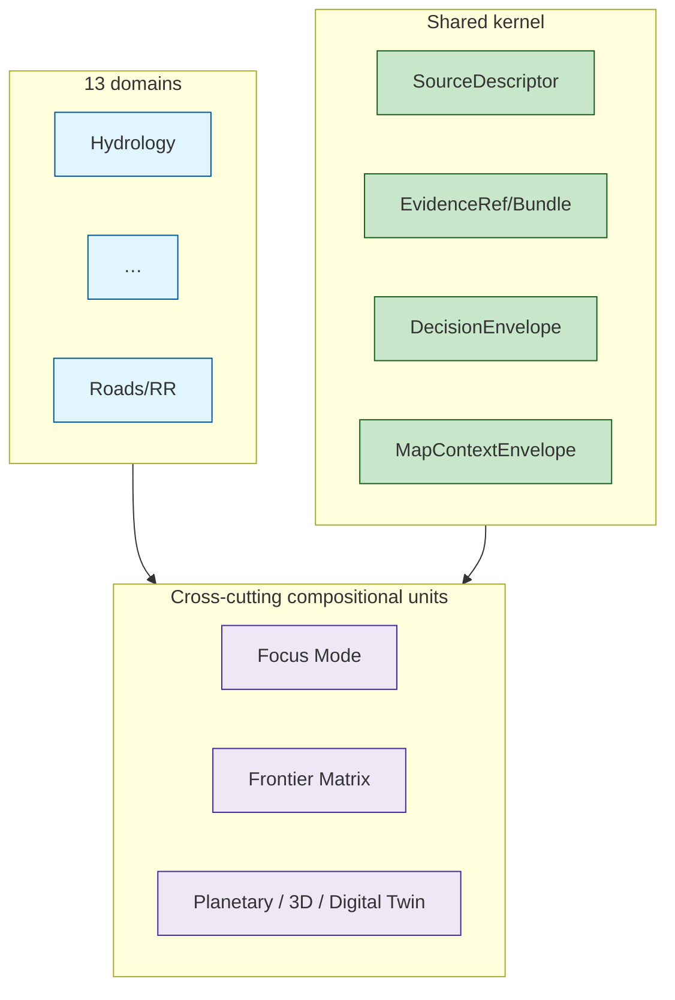

<!-- [KFM_META_BLOCK_V2]
doc_id: kfm://doc/architecture-cross-domain-compositional-units
title: Cross-Cutting Compositional Units
type: standard
version: v0.1
status: draft
owners: <ARCHITECTURE-DOCTRINE-OWNER> · NEEDS VERIFICATION
created: 2026-05-24
updated: 2026-05-24
policy_label: public
related:
  - README.md
  - multi-domain-placement.md
  - shared-kernel.md
  - trust-membrane.md
  - responsibility-layers.md
  - directory-rules.md#6.7
  - directory-rules.md#3
  - directory-rules.md#13.5
  - Kansas_Frontier_Matrix_-_Domains_v1_1___Pass_23_32_Consolidated_Atlas.md#17
  - Kansas_Frontier_Matrix_-_Domains_v1_1___Pass_23_32_Consolidated_Atlas.md#18
tags: [kfm, architecture, cross-domain, focus-modes, frontier-matrix, planetary-3d, doctrine]
notes:
  - PROPOSED placement; folder vs §12 flat-file pattern is OPEN-DR-10.
  - Compositional units compose across domains; none of them is a domain; none of them becomes a root folder.
[/KFM_META_BLOCK_V2] -->

<a id="top"></a>

# Cross-Cutting Compositional Units

> *Focus Modes, the Frontier Matrix, and Planetary/3D/Digital-Twin renderers are the cross-cutting compositions that span domains and the shared kernel. None of them is a domain; none of them becomes a root folder.*


-blue)


**Status:** draft · **Owners:** `<ARCHITECTURE-DOCTRINE-OWNER>` *(NEEDS VERIFICATION)* · **Last updated:** 2026-05-24

> [!IMPORTANT]
> **Compositional units compose across domains but are not themselves domains.** Each one is anchored in canonical doctrine *(`directory-rules.md` §6.7 for Focus Modes; Atlas §17 for Frontier Matrix; Atlas §18 for Planetary / 3D / Digital Twin)* and routes its artifacts through the existing responsibility roots — never as a new root folder.

> [!CAUTION]
> **`focus_modes/`, `frontier_matrix/`, or `scenes/` at the repo root is drift.** Such a root folder violates `directory-rules.md` §3 *(root-stays-boring)* and §13.5 *(anti-pattern register)*. Compositional units land in lanes inside the canonical roots *(`docs/`, `contracts/`, `schemas/`, `fixtures/`, `apps/`, `tools/`, `data/`, `release/`)*, not at root.

---

## Table of contents

1. [Scope](#1-scope)
2. [The three compositional units](#2-the-three-compositional-units)
3. [Focus Modes](#3-focus-modes)
4. [Frontier Matrix](#4-frontier-matrix)
5. [Planetary / 3D / Digital Twin](#5-planetary--3d--digital-twin)
6. [What none of them are](#6-what-none-of-them-are)
7. [Shared rules across all three](#7-shared-rules-across-all-three)
8. [Anti-patterns](#8-anti-patterns)
9. [Open questions and ADR triggers](#9-open-questions-and-adr-triggers)
10. [Related docs](#10-related-docs)
11. [Appendix](#11-appendix)

---

## 1. Scope

This doc tells implementers **how to think about a cross-cutting unit** that composes multiple domains and the kernel. It is the bridge between the per-domain dossiers, the shared kernel, and the canonical responsibility roots. It does **not** define any single Focus Mode, Frontier Matrix panel, or scene — those live in their own dossiers.

> [!TIP]
> **When this doc binds.** Any time you are building or modifying a Focus Mode, a Frontier Matrix panel, or a Planetary/3D scene; or any time you are tempted to create a new root folder for a cross-cutting concern.

[↑ Back to top](#top)

---

## 2. The three compositional units

> **Evidence basis:** `directory-rules.md` §6.7 *(Focus Modes, CONFIRMED)*; Atlas §17 *(Frontier Matrix, CONFIRMED)*; Atlas §18 *(Planetary / 3D / Digital Twin, CONFIRMED)*; `kfm_unified_doctrine_synthesis.md` §18.

| Unit | What it composes | Where it lives | Authority anchor |
|---|---|---|---|
| **Focus Mode** *(county / region / corridor / state-scale proof slice)* | One geographic area × multiple domains × one UI × one release | `docs/focus-modes/<area>-<scope>/`, plus cross-root lanes in `contracts/`, `schemas/`, `fixtures/`, `apps/`, `tools/`, `data/`, `release/` | `directory-rules.md` §6.7 |
| **Frontier Matrix** *(county-year panel across domains)* | County × year × multiple domains *(population, economy, ag, access, settlement, land)* | Lanes inside responsibility roots, not a root folder | Atlas §17 |
| **Planetary / 3D / Digital Twin** *(renderer-class composition)* | Multiple domains × 3D representation × Reality Boundary discipline | `packages/maplibre/` *(or future `packages/renderer/`)*; `data/published/scenes/`; `release/manifests/scenes/` | Atlas §18; `kfm_unified_doctrine_synthesis.md` §18 |



[↑ Back to top](#top)

---

## 3. Focus Modes

> **Evidence basis:** `directory-rules.md` §6.7 *(Focus Mode placement contract, CONFIRMED)*.

A Focus Mode is a **proof slice**: one named geographic area + one named scope, composing multiple domains under one UI shell and one release.

| Aspect | Rule |
|---|---|
| Dossier home | `docs/focus-modes/<area>-<scope>/README.md` *(or `docs/focus-mode/` per OPEN-DR-08)* |
| Cross-root lanes | `contracts/focus-modes/<area>-<scope>/`, `schemas/contracts/v1/focus-modes/<area>-<scope>/`, `policy/focus-modes/<area>-<scope>/`, `fixtures/focus-modes/<area>-<scope>/`, `tools/validators/focus-modes/<area>-<scope>/`, `data/published/focus-modes/<area>-<scope>/`, `release/manifests/focus-modes/<area>-<scope>/`, `apps/focus-modes/<area>-<scope>/` |
| Release identity | A Focus Mode releases as a unit; its manifest is the authoritative inventory of what is published under that slice. |
| Kernel use | Uses `MapContextEnvelope`, `DecisionEnvelope`, `EvidenceBundle`, `AIReceipt` exactly as defined in the kernel — no Focus-Mode-local variants. |
| Membrane | Same membrane as everything else; promotion gates apply per-record. |

> [!IMPORTANT]
> **A Focus Mode is not a domain.** It does not own object semantics; it composes domains. Adding a Focus Mode does not extend the kernel or the source-role vocabulary.

[↑ Back to top](#top)

---

## 4. Frontier Matrix

> **Evidence basis:** `Kansas_Frontier_Matrix_-_Domains_v1_1___Pass_23_32_Consolidated_Atlas.md` §17 *(Frontier Matrix, CONFIRMED)*.

The Frontier Matrix is the **county × year panel** composition: for a given county and year, panels across multiple domains *(population, economy, agriculture, access, settlement, land)* are presented as one coherent reading surface.

| Aspect | Rule |
|---|---|
| Doctrine home | Atlas §17 (canonical); per-panel notes live with each domain dossier. |
| Lane home *(PROPOSED)* | `contracts/frontier-matrix/`, `schemas/contracts/v1/frontier-matrix/`, `policy/frontier-matrix/`, `data/published/frontier-matrix/<county>/<year>/`, `release/manifests/frontier-matrix/`. |
| Cell semantics | A matrix cell is a **(county, year, domain)** triple. Aggregation rules apply per domain; aggregate-as-per-place collapse is denied. |
| Sensitivity | Joint sensitivity per cross-lane invariant (3); fail-closed members downgrade the cell to fail-closed. |
| Kernel use | Uses `EvidenceBundle` per cell; cite-or-abstain at every panel. |

> [!CAUTION]
> **No `frontier_matrix/` root folder.** The matrix lives in lanes inside canonical roots, as above. A root folder for the matrix is the same drift class as a domain-as-root folder.

[↑ Back to top](#top)

---

## 5. Planetary / 3D / Digital Twin

> **Evidence basis:** `Kansas_Frontier_Matrix_-_Domains_v1_1___Pass_23_32_Consolidated_Atlas.md` §18 *(CONFIRMED)*; `kfm_unified_doctrine_synthesis.md` §18 *(CONFIRMED)*.

Planetary / 3D / Digital Twin compositions render multiple domains in a **3D representation surface** with strict **Reality Boundary** discipline: synthetic, reconstructed, or simulated content MUST carry the Reality Boundary Note and a `RepresentationReceipt`.

| Aspect | Rule |
|---|---|
| Renderer home | `packages/maplibre/` today; `packages/renderer/` if/when generalized. |
| Scene-data home | `data/published/scenes/`. |
| Release manifests | `release/manifests/scenes/`. |
| Reality Boundary | Synthetic / reconstructed / simulated content surfaces with badge, note, and receipt. Observed and modeled content are also badge-distinct. |
| Kernel use | `MapContextEnvelope` is the runtime envelope; `EvidenceBundle` cites each datum; `AIReceipt` for any AI-generated decoration; `RepresentationReceipt` for synthetic content. |
| Membrane | Same as everywhere; scenes promote through gates A–G. |

> [!IMPORTANT]
> **Planetary/3D does not get to skip cite-or-abstain.** A pretty render is not a free pass to publish unsupported content. Every renderable layer either resolves a bundle or is badged as synthetic with a receipt.

[↑ Back to top](#top)

---

## 6. What none of them are

| Forbidden interpretation | Reality |
|---|---|
| "A Focus Mode is a domain." | No — it composes domains; it does not own object semantics. |
| "The Frontier Matrix needs its own object family." | No — it uses the kernel's `EvidenceBundle`, `PolicyDecision`, `DecisionEnvelope`. |
| "Planetary/3D needs its own release lifecycle." | No — scenes promote through Gates A–G like everything else. |
| "We can fast-track a county Focus Mode by adding `focus_modes/` at root." | No — that root folder is drift per §3 and §13.5. |
| "Compositional units can extend the source-role vocabulary." | No — vocabulary changes are ADR-S-04 class. |

[↑ Back to top](#top)

---

## 7. Shared rules across all three

| Rule | Applies to |
|---|---|
| Lives in lanes inside canonical roots, not a new root folder | All three |
| Uses kernel objects without forking | All three |
| Promotes through Gates A–G | All three |
| Respects the four cross-lane invariants on every domain × domain composition it produces | All three |
| Cite-or-abstain at every public surface | All three |
| Renames / reshapes are ADR-class when they touch kernel or vocabulary | All three |
| Source role preserved per `source-role-anti-collapse.md` | All three |

[↑ Back to top](#top)

---

## 8. Anti-patterns

| Anti-pattern | Why it breaks the trust path | Mitigation |
|---|---|---|
| **`focus_modes/`, `frontier_matrix/`, `scenes/` at repo root** | Root-stays-boring violation; competes with responsibility roots. | Lane pattern per §3–5 above. |
| **Focus-Mode-local kernel variant** *(e.g., `FocusModeEvidenceBundle`)* | Fragments the kernel; readers cannot trust cross-mode comparison. | Use kernel objects; extend via documented fields, not forks. |
| **Frontier Matrix cell built by aggregating across domains without preserving roles** | Source-role collapse; per-place inference from aggregate. | Per-cell role distribution carried; aggregation receipts mandatory. |
| **3D scene with synthetic decoration but no `RepresentationReceipt`** | Synthetic-as-observed presentation; reality boundary erodes. | `RepresentationReceipt` mandatory; UI badge. |
| **Compositional unit owning Rego that domains have to crosswalk** | Policy ownership confusion. | Place Rego under `policy/<unit>/` lane and reference per-domain rules; don't override them. |

[↑ Back to top](#top)

---

## 9. Open questions and ADR triggers

| Open item | Class | Suggested ADR title |
|---|---|---|
| **OPEN-DR-08** — `docs/focus-modes/` vs `docs/focus-mode/` directory naming. | Directory Rules | "Focus Mode dossier directory name". |
| Frontier Matrix lane homes — adopt the `frontier-matrix/` lane pattern as canonical or keep per-cell scattering? | Placement | "Frontier Matrix lane placement". |
| Planetary / 3D renderer home — `packages/maplibre/` vs `packages/renderer/` generalization? | Package | "Renderer package home". |
| Reality Boundary as kernel object across all domains *(not just 3D)*? | Object family | "Reality Boundary as cross-domain kernel". |

[↑ Back to top](#top)

---

## 10. Related docs

| Reference | Role | Truth label |
|---|---|---|
| `README.md` *(this folder)* §9 | Landing summary | CONFIRMED doctrine |
| `multi-domain-placement.md` *(sibling)* | Where compositional artifacts go | CONFIRMED doctrine |
| `shared-kernel.md` *(sibling)* | Kernel objects compositional units use | CONFIRMED doctrine |
| `trust-membrane.md` *(sibling)* | Same membrane applies | CONFIRMED doctrine |
| `responsibility-layers.md` *(sibling)* | Compositional units are orthogonal to the eight layers | CONFIRMED doctrine |
| `directory-rules.md` §6.7 | Focus Mode placement contract | CONFIRMED doctrine |
| `directory-rules.md` §3 | Root-stays-boring | CONFIRMED doctrine |
| `directory-rules.md` §13.5 | Anti-pattern register | CONFIRMED doctrine |
| `Kansas_Frontier_Matrix_-_Domains_v1_1___Pass_23_32_Consolidated_Atlas.md` §17 | Frontier Matrix | CONFIRMED doctrine |
| `Kansas_Frontier_Matrix_-_Domains_v1_1___Pass_23_32_Consolidated_Atlas.md` §18 | Planetary / 3D / Digital Twin | CONFIRMED doctrine |
| `kfm_unified_doctrine_synthesis.md` §18 | Reality Boundary discipline | CONFIRMED doctrine |

[↑ Back to top](#top)

---

## 11. Appendix

<details>
<summary><strong>11.1 Compositional units — at-a-glance</strong></summary>

```text
Focus Mode             — area × scope × domains × UI × release
                         docs/focus-modes/<area>-<scope>/
                         + lanes in contracts/, schemas/, policy/, fixtures/,
                         tools/, data/, release/, apps/

Frontier Matrix        — county × year × domains (population, economy,
                         agriculture, access, settlement, land)
                         lanes under canonical roots

Planetary / 3D /       — multi-domain × 3D × Reality Boundary discipline
Digital Twin            packages/maplibre/ (renderer)
                         data/published/scenes/
                         release/manifests/scenes/
```

</details>

<details>
<summary><strong>11.2 Truth-label legend</strong></summary>

- **CONFIRMED** — verified this session from attached docs.
- **PROPOSED** — design / placement / inference not yet verified in implementation.
- **INFERRED** — derivable from confirmed evidence but not directly stated.
- **NEEDS VERIFICATION** — checkable, but not yet checked strongly enough to act as fact.

</details>

---

**Related (mini)** · [`README.md`](README.md) · [`multi-domain-placement.md`](multi-domain-placement.md) · [`shared-kernel.md`](shared-kernel.md) · [`trust-membrane.md`](trust-membrane.md) · [`responsibility-layers.md`](responsibility-layers.md) · [`directory-rules.md` §6.7](../../../directory-rules.md) · [Atlas §§17,18](../../../Kansas_Frontier_Matrix_-_Domains_v1_1___Pass_23_32_Consolidated_Atlas.md)

**Last updated:** 2026-05-24 · **Doc version:** v0.1 · **Doc status:** draft · **Path status:** PROPOSED *(OPEN-DR-10)*

[↑ Back to top](#top)
