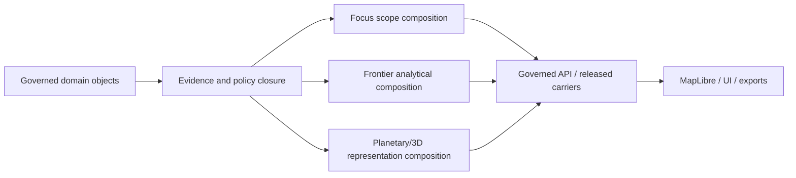
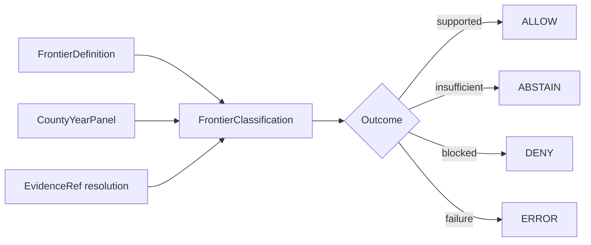

<!-- [KFM_META_BLOCK_V2]
doc_id: kfm://doc/architecture-cross-domain-compositional-units
title: Cross-Cutting Compositional Units
type: standard
version: v0.3.0
prior_version: v0.2.0
status: draft; repository-grounded architecture reference; bounded implementation; non-authoritative; non-publisher
owners: "@bartytime4life via CODEOWNERS; independent cross-domain, evidence, policy, sensitivity, release, Focus Mode, Frontier Matrix, and Planetary/3D stewardship NEEDS VERIFICATION"
created: 2026-05-24
updated: 2026-08-19
policy_label: public; architecture; cross-domain; composition; cite-or-abstain; non-release; non-publication
responsibility_root: docs/
canonical_relationship: same-path architecture reference; no sibling authority created
truth_posture: >-
  CONFIRMED accepted Directory Rules v2, current repository paths, proposed
  domain-lane and cross-domain seam projections, bounded Focus Mode, Frontier
  Matrix, and Planetary/3D implementation surfaces, and the named focused
  FrontierClassification workflow result / PROPOSED three-part compositional
  taxonomy and final classifications / CONFLICTED stale domain-named lineage
  versus current cross-cutting projections / UNKNOWN deployed runtime, public
  releases, correction propagation, and rollback execution / NEEDS VERIFICATION
  accepted classifications, accountable stewardship, registered composition
  identities, complete seam contracts, policy and review closure, required-check
  coupling, and public parity.
evidence_snapshot:
  repository: bartytime4life/Kansas-Frontier-Matrix
  visibility: public
  base_ref: main
  base_commit: 5451e5bc1ae7ffd8d721197b930cadd827fbbd7f
  target_prior_blob: 60fd278707d3773e2361e34d7f75f8a798d81838
  parent_readme_blob: 3353a0a0ab5fe3f8f5fdea937b8eecfa34b81032
  directory_rules_v2_blob: fd49a0b83e55cef52c1124281f093e263526898d
  adr_0029_blob: a4de0d7a96b78da59cfc499d1025e1508afd8dd9
  domain_lane_register_blob: 1bfc6f91cfa713a5e3d51ece011b63b46310734f
  cross_domain_seam_register_blob: dc87ea9c2ab11cc10e51cf4e8284c030e7c9ab29
  focus_docs_blob: 8600c0ac09452b4b03e5f60b94f1eb27c072b5db
  frontier_definition_blob: 066976e0b859474191548d8ef06ad328c1c78299
  county_year_panel_blob: 6c8ea550ce9c550539d00bf677e0d8485c759b52
  frontier_classification_blob: 0c178ec594043119790200b5f4f0df541cc8bfeb
  frontier_classification_workflow_blob: b74d891cc04f1aa004c6c9117aef9645936a7a8b
  planetary_3d_architecture_blob: 41e26697a05c9479fc78b43d5112279d9125a492
  three_d_admission_contract_blob: e71692ce8897596e3477a8dafc0ef5c12fcd130a
  representation_receipt_contract_blob: 4e4a7e4d1d98c8592a76d0d3127eb90233906614
related:
  - ./README.md
  - ./cross-lane-relations.md
  - ./multi-domain-placement.md
  - ./shared-kernel.md
  - ./source-role-anti-collapse.md
  - ./trust-membrane.md
  - ./responsibility-layers.md
  - ../../doctrine/directory-rules.md
  - ../../adr/ADR-0029-adopt-directory-governance-standard-v2.md
  - ../../focus-mode/README.md
  - ../../registers/DOMAIN_LANE.md
  - ../planetary-3d.md
  - ../../../control_plane/domain_lane_register.yaml
  - ../../../control_plane/cross_domain_seam_register.yaml
  - ../../../contracts/evidence/frontier_definition.md
  - ../../../contracts/data/county_year_panel.md
  - ../../../contracts/evidence/frontier_classification.md
  - ../../../contracts/map/three_d_admission_decision.md
  - ../../../contracts/receipts/representation_receipt.md
tags: [kfm, architecture, cross-domain, composition, focus-mode, frontier-matrix, planetary-3d, evidence, governance]
notes:
  - "v0.3.0 is a same-path repository-grounded modernization; it creates no doctrine, ADR, domain, scope, seam, contract, schema, policy, runtime, release, promotion, deployment, or publication authority."
  - "Accepted Directory Rules v2 classify geography and Focus Mode as composition scopes and require registered seam IDs for cross-domain artifacts."
  - "The proposed machine domain-lane projection lists 13 domains and explicitly excludes matrix, scene, and spatial; that projection is evidence, not an accepted reclassification decision."
  - "Frontier Matrix has fixture-first definition, county-year panel, and classification packets with deterministic validation, but no real county classification or release."
  - "Planetary/3D has bounded admission and representation-receipt profiles while renderer and release surfaces remain held or incomplete."
  - "All five current cross-domain seam-register entries remain HOLD_UNRESOLVED, disallow public joins, and have no seam contract path."
[/KFM_META_BLOCK_V2] -->

# Cross-Cutting Compositional Units

Focus Mode, Frontier Matrix, and Planetary/3D connect KFM material across
bounded contexts, but they do so through different responsibilities:
**scope composition**, **analytical composition**, and **representation
composition**. Composition never transfers source, evidence, policy, review,
release, correction, rollback, or publication authority.

> [!IMPORTANT]
> **Composition preserves authority; it does not absorb it.** Every participating
> object retains its owner, source role, evidence support, spatial and temporal
> scope, rights and sensitivity posture, review state, release lineage,
> correction lineage, and rollback target.

> [!WARNING]
> **No compositional unit authorizes a public join.** The current proposed seam
> register is partial. All five entries are `HOLD_UNRESOLVED`, set
> `public_join_allowed: false`, and have no seam contract path.

## Table of contents

1. [Scope and authority](#1-scope-and-authority)
2. [Classification model](#2-classification-model)
3. [Focus Mode](#3-focus-mode)
4. [Frontier Matrix](#4-frontier-matrix)
5. [Planetary / 3D / Digital Twin](#5-planetary--3d--digital-twin)
6. [Shared trust and seam rules](#6-shared-trust-and-seam-rules)
7. [Placement](#7-placement)
8. [Anti-patterns](#8-anti-patterns)
9. [Open decisions and validation](#9-open-decisions-and-validation)
10. [Related documentation](#10-related-documentation)

---

## Status and evidence boundary

This page is a draft, repository-grounded architecture reference. It is not a
domain or scope register, semantic contract, schema, policy decision, review
record, release manifest, runtime receipt, or publication decision.

| Evidence | Bounded finding at `main@5451e5b` | Limit |
|---|---|---|
| Target | Same-path file exists at prior blob `60fd278`; prior version `v0.2.0` | Presence proves documentation only |
| Directory authority | [ADR-0029](../../adr/ADR-0029-adopt-directory-governance-standard-v2.md) accepts the exact bytes at [`docs/doctrine/directory-rules.md`](../../doctrine/directory-rules.md) | The pinned artifact retains its internal proposal label; follow-on structural changes remain separately gated |
| Composition rule | Directory Rules v2 §12.4 classifies a county, corridor, watershed, region, or Focus Mode as a composition scope, not a domain or root | It does not settle every legacy name or runtime profile |
| Domain projection | [`domain_lane_register.yaml`](../../../control_plane/domain_lane_register.yaml) proposes 13 lanes and excludes `matrix`, `scene`, and `spatial` as cross-cutting | The projection declares non-effects and is not an accepted domain decision |
| Seam projection | [`cross_domain_seam_register.yaml`](../../../control_plane/cross_domain_seam_register.yaml) contains five held high-risk seams | It is partial, navigational, and not join or publication authority |
| Focus Mode | [`docs/focus-mode/README.md`](../../focus-mode/README.md) records bounded Explorer projection, synthetic tests, inactive policy, and naming/placement holds | No authenticated service, live policy, release, or public operation is established |
| Frontier Matrix | Fixture-first definition, panel, classification, validators, tests, and a focused workflow exist | No real county classification, source activation, API, map layer, or release is established |
| Planetary/3D | [`planetary-3d.md`](../planetary-3d.md) records bounded admission and representation-receipt profiles | Renderer, scene release, live policy, and browser runtime remain held or incomplete |
| Review routing | [`.github/CODEOWNERS`](../../../.github/CODEOWNERS) routes the default pattern to `@bartytime4life` | Routing is not independent approval or release authority |

### Truth posture

- **CONFIRMED:** the accepted placement decision, current tracked paths and
  blobs, proposed register contents, bounded fixture-first profiles, and named
  focused workflow result inspected for this revision.
- **PROPOSED:** the three-class taxonomy, final identities, complete seam and
  scope registries, operational contracts, policy, routes, release profiles,
  and public products not established by accepted decisions and evidence.
- **UNKNOWN:** deployed runtime, external consumers, public release state,
  correction propagation, and rollback execution.
- **NEEDS VERIFICATION:** accountable stewardship, accepted classifications,
  registered composition IDs, contract/schema/policy closure, negative-path
  tests, required-check coupling, correction drills, and public parity.
- **CONFLICTED:** older Atlas and stale domain-named lineage versus current
  cross-cutting projections and architecture boundaries.

[Back to top](#top)

---

## 1. Scope and authority

This page classifies a cross-cutting composition before paths, joins, or public
behavior are assigned. It covers geographic and interaction scopes, analytical
alignments across geography and time, and 2D/2.5D/3D representation assemblies.
It does not register a domain, scope, seam, object family, source, policy,
release, or route.

### Authority boundary

| This page may | This page may not |
|---|---|
| Explain evidence, bounds, and conflicts | Accept or reinterpret an ADR |
| Distinguish domain, scope, analytical, and carrier roles | Add, remove, rename, or merge a domain |
| Preserve trust and source-role invariants | Define contract, schema, policy, or register fields |
| Route artifacts to an owning responsibility root | Make an alias, path, package, seam, or scope canonical |
| Name validation, correction, and rollback prerequisites | Approve a join, review, release, deployment, or publication |

When classification, ownership, sensitivity, or join authority is unresolved,
the safe result is **HOLD**. Do not create a second writable authority merely to
keep implementation moving.

---

## 2. Classification model

| Unit | Proposed class | Strongest current evidence | Safe statement | Decision still open |
|---|---|---|---|---|
| Focus Mode | Scope composition | Accepted Directory Rules §12.4; current bounded Focus docs and Explorer projection | A governed geographic or interaction scope that composes released evidence without becoming a domain | Final singular/plural identity, scope registry, stewardship, policy profile, and runtime contract |
| Frontier Matrix | Analytical composition | Current fixture-first `FrontierDefinition`, `CountyYearPanel`, and `FrontierClassification` families | A versioned analytical composition over governed observations; not a flat truth table | Accepted domain-versus-cross-cutting classification, authority owner, real source admissions, release profile, and public projection |
| Planetary/3D | Representation composition | Current Planetary/3D architecture plus bounded admission and representation receipts | A downstream representation and delivery composition; reconstruction is not observation | Accepted naming/classification, renderer admission, scene family, public-safe release, and correction parity |

The current machine projection narrows the dispute by excluding `matrix`,
`scene`, and `spatial` from its proposed 13-domain set. That evidence does not
supersede older Atlas lineage or make this document an accepted classifier.

```mermaid
flowchart LR
    D[Governed domain objects] --> E[Evidence and policy closure]
    E --> F[Focus scope composition]
    E --> M[Frontier analytical composition]
    E --> P[Planetary/3D representation composition]
    F --> G[Governed API / released carriers]
    M --> G
    P --> G
    G --> U[MapLibre / UI / exports]
```

---

## 3. Focus Mode

Focus Mode answers a bounded question for a place, corridor, watershed, region,
or interaction context. It is a composition scope, not a parallel domain or a
shortcut around evidence resolution.

### Current repository boundary

| Surface | Current state | Consequence |
|---|---|---|
| Documentation | [`docs/focus-mode/README.md`](../../focus-mode/README.md) is the current singular lane and records migration holds | Maintain same-path documentation; do not create a competing plural tree |
| Contracts and schema | `contracts/focus_mode/`, `contracts/focus/`, and schema surfaces coexist | Treat the family and ownership seam as unresolved, not silently canonical |
| Policy | [`policy/focus/README.md`](../../../policy/focus/README.md) is inactive | No live policy or public authorization claim |
| Workflow | [`focus-mock-test.yml`](../../../.github/workflows/focus-mock-test.yml) is read-only and synthetic | A green fixture test does not prove live evidence, policy, review, release, or deployment |
| Explorer | Bounded composed-claim and Evidence Drawer tests are documented | App-local projection does not become canonical truth or a release decision |

### Minimum safe Focus packet

A Focus composition must carry, directly or through resolvable references:

- stable composition and geography identities;
- requested spatial and temporal scope;
- participating domain object IDs and source roles;
- `EvidenceRef` resolution state and released `EvidenceBundle` support;
- policy, sensitivity, consent, rights, and generalization outcomes;
- finite runtime outcome: `ANSWER`, `ABSTAIN`, `DENY`, or `ERROR`;
- release, correction, supersession, and rollback references;
- representation and citation metadata sufficient for the Evidence Drawer.

Missing evidence, policy, review, or release closure must narrow the request or
produce `ABSTAIN`/`DENY`; it must not be replaced with a model-generated answer.

---

## 4. Frontier Matrix

Frontier Matrix aligns versioned observations across geography and time under a
named analytical definition. It is a derived composition, not a source and not a
flat spreadsheet of sovereign truth.

### Current bounded object flow

```mermaid
flowchart LR
    FD[FrontierDefinition] --> FC[FrontierClassification]
    CY[CountyYearPanel] --> FC
    ER[EvidenceRef resolution] --> FC
    FC --> O{Outcome}
    O -->|supported| A[ALLOW]
    O -->|insufficient| B[ABSTAIN]
    O -->|blocked| D[DENY]
    O -->|failure| X[ERROR]
```

| Surface | Current bounded evidence | Does not prove |
|---|---|---|
| [`FrontierDefinition`](../../../contracts/evidence/frontier_definition.md) | Proposed inactive deterministic classification-method declaration | Accepted definition authority or real classification |
| [`CountyYearPanel`](../../../contracts/data/county_year_panel.md) | Proposed fixture-first aggregate with explicit no-values boundary | Real county-year data, public product, or canonical store |
| [`FrontierClassification`](../../../contracts/evidence/frontier_classification.md) | Synthetic-only evidence assessment with finite outcomes | Policy approval, release, or public truth |
| [`frontier-classification.yml`](../../../.github/workflows/frontier-classification.yml) | Read-only focused workflow; run `31961861956` succeeded on PR #2977 head `d1fec315` | Whole-repo health, required-check status, release readiness, or attribution of broader failures |

### Graduation requirements

A real Frontier Matrix product still requires accepted ownership and definition
versioning; admitted source descriptors; geography-version and temporal rules;
evidence and uncertainty closure; policy/review/release decisions; deterministic
rebuilds; public-safe API/map contracts; correction propagation; and a tested
rollback target.

---

## 5. Planetary / 3D / Digital Twin

Planetary/3D composes released carriers into terrain, extrusions, point clouds,
meshes, scenes, globe views, or synthetic reconstructions. It is a representation
layer and must preserve the difference between observation, inference, model,
and reconstruction.

### Current repository boundary

| Surface | Current state | Consequence |
|---|---|---|
| Architecture | [`planetary-3d.md`](../planetary-3d.md) is repository-grounded v2.0 | Use as the current architecture explanation, not release proof |
| Admission | [`ThreeDAdmissionDecision`](../../../contracts/map/three_d_admission_decision.md) is fixture-only | No renderer, asset, policy, review, or public-use authorization |
| Process memory | [`RepresentationReceipt`](../../../contracts/receipts/representation_receipt.md) records transform intent | A receipt is not evidence, proof, review, release, or publication authority |
| Scene schema | [`schemas/contracts/v1/scene/README.md`](../../../schemas/contracts/v1/scene/README.md) is guardrail documentation | No accepted scene schema family is established |
| Released scene lane | [`data/published/layers/scene/README.md`](../../../data/published/layers/scene/README.md) is a hold surface | No released scene artifact is established |
| Older domain doc | [`docs/domains/planetary-3d/README.md`](../../domains/planetary-3d/README.md) remains lineage | Do not treat stale domain naming as current implementation authority |

### Minimum admission packet

A 3D or synthetic carrier needs asset identity and digest, source/evidence refs,
representation class, transform chain, uncertainty and reality-boundary notes,
rights and sensitivity review, geometry generalization where required, renderer
and performance constraints, release manifest, correction behavior, and rollback
target. Missing closure yields `HOLD`, `ABSTAIN`, or `DENY`.

> [!CAUTION]
> A photorealistic or immersive view can increase persuasive force without
> increasing evidence quality. Visual realism must never be presented as
> observational certainty.

---

## 6. Shared trust and seam rules

All three compositions must preserve these rules:

1. `EvidenceBundle` outranks generated language, map pixels, analytical scores,
   scene realism, and UI state.
2. Source roles remain explicit: observed, modeled, forecast, interpreted,
   administrative, aggregate, and synthetic support are not interchangeable.
3. Geography and time are versioned inputs, not display-only filters.
4. Rights, sensitivity, sovereignty, consent, and harmful precision fail closed.
5. Public clients consume governed APIs or released public-safe carriers, never
   canonical/internal stores as the normal path.
6. Receipts, proofs, catalogs, manifests, reviews, decisions, corrections,
   rollback records, and published artifacts remain distinct object families.
7. Promotion is a governed state transition, not a file move, workflow pass,
   commit, pull request, merge, or render.
8. Corrections and withdrawals propagate to every derived composition and
   carrier that depended on the superseded support.

### Cross-domain seam interaction

Directory Rules v2 §12.5 routes a cross-domain semantic contract to
`contracts/cross_domain/<seam_id>/`, seam tests to
`tests/cross_domain/<seam_id>/`, seam validation to
`tools/validators/cross_domain/<seam_id>/`, and explanation to
`docs/architecture/cross-domain/<seam_id>.md`. These are responsibility lanes,
not permission to create an unregistered seam.

The current seam register is a proposed control-plane projection. Until a seam
has accepted identity, owning and contributing lanes, relation vocabulary,
evidence and temporal rules, policy/review closure, contract path, tests, and a
public-join decision, the outcome remains **HOLD**.

---

## 7. Placement

A compositional unit spans responsibility roots; it does not receive a new root.
Place each artifact by the responsibility that owns it.

| Artifact responsibility | Owning root | Rule |
|---|---|---|
| Human explanation | `docs/` | Same-path architecture or scope documentation; no duplicate canon |
| Semantic meaning | `contracts/` | One owning contract family; cross-domain seams require a registered seam ID |
| Machine shape | `schemas/` | Schema mirrors an accepted semantic owner; it does not create meaning |
| Policy decision logic | `policy/` | Fail closed for unknown rights, sensitivity, consent, or review state |
| Reusable implementation | `packages/` | No evidence, policy, release, or publication authority |
| Deployable service/UI | `apps/` | Consume governed interfaces; no direct canonical-store or model path |
| Validation | `tools/validators/` and `tests/` | Include exact-negative, stale, denied, and correction cases |
| Lifecycle material | `data/` | Preserve RAW → WORK/QUARANTINE → PROCESSED → CATALOG/TRIPLET → PUBLISHED |
| Release decision and manifest | `release/` | Keep separate from receipts, proofs, catalogs, and temporary artifacts |
| Build/QA output | `artifacts/` | Non-canonical and disposable; never a release authority shortcut |

`docs/architecture/cross-domain/compositional-units.md` remains the correct
same-path explanation because the artifact explains a cross-domain architecture
boundary. This update creates no new root, authority home, or parallel document.

---

## 8. Anti-patterns

Reject these patterns:

- creating `focus-mode/`, `frontier-matrix/`, `planetary-3d/`, `matrix/`,
  `scene/`, or `spatial/` as a new repository root;
- treating a county, watershed, corridor, region, or view as a domain because it
  spans several lanes;
- letting an analytical panel overwrite source observations or uncertainty;
- treating a scene, tile, graph, score, screenshot, or AI answer as sovereign
  truth;
- joining held seams because matching identifiers or geometry appear plausible;
- inventing a lead domain that absorbs evidence, policy, or release duties from
  contributing lanes;
- allowing a passing synthetic workflow to imply source activation, production
  readiness, release, or publication;
- exposing exact sensitive geometry or denial reasons through public clients;
- creating parallel contract, schema, policy, registry, receipt, proof, release,
  or documentation authorities to avoid resolving a conflict;
- generating a composition without correction, withdrawal, cache invalidation,
  and rollback behavior.

---

## 9. Open decisions and validation

### Open decisions

| Decision | Current state | Required closure |
|---|---|---|
| Focus naming and identity | Singular/plural and family seams remain | Accepted scope identity, compatibility plan, and accountable owner |
| Frontier Matrix classification | Analytical surface exists; final domain/cross-cutting authority remains open | Accepted decision or ADR with owner, definition/version rules, and migration impact |
| Planetary/3D classification | Current architecture treats it as cross-domain representation; stale domain lineage remains | Accepted decision preserving object lineage and renderer boundary |
| Seam coverage | Five high-risk seams are registered and held; coverage is partial | Registered IDs, contracts, validators, tests, policy/review state, and explicit public-join decisions |
| Public parity | No complete correction/rollback parity proof was inspected | Fixture-driven propagation and rollback rehearsal across API, map, UI, export, and AI surfaces |

### ADR triggers

An ADR or accepted equivalent is required when a change adds/removes/renames a
domain; creates or retires an authority root; changes canonical ownership;
changes contract/schema/policy responsibility; makes a compatibility path
canonical; authorizes a new public join; changes the renderer boundary; or
changes release, correction, or rollback semantics.

### Validation for this revision

The source artifact was checked for KFM meta-block YAML, stable `doc_id`, one H1,
legacy explicit anchors, balanced fences, internal fragment resolution,
repository-relative target presence, Mermaid source structure, UTF-8/LF text,
no trailing whitespace or tabs, and a final newline. These checks validate the
Markdown source only. They do not prove GitHub host rendering, accepted
classification, runtime correctness, policy enforcement, release readiness,
correction propagation, or rollback execution.

### Rollback

Rollback is a same-path revert of this Markdown file and its generated authoring
receipt. No schema, contract, policy, source, runtime, lifecycle, release, or
published object is migrated by this change.

---

## 10. Related documentation

| Document | Relationship | Authority note |
|---|---|---|
| [Cross-domain index](./README.md) | Parent architecture lane and seam-register index | Repository-grounded documentation, non-publisher |
| [Cross-lane relations](./cross-lane-relations.md) | Relation and join boundary | Does not authorize a held seam |
| [Multi-domain placement](./multi-domain-placement.md) | Responsibility-root placement | Draft architecture guidance |
| [Shared kernel](./shared-kernel.md) | Shared vocabulary and contract discipline | No domain-specific authority transfer |
| [Source-role anti-collapse](./source-role-anti-collapse.md) | Source-role preservation | Cite-or-abstain boundary |
| [Trust membrane](./trust-membrane.md) | Governed client boundary | Public clients remain downstream |
| [Responsibility layers](./responsibility-layers.md) | Authority separation | Draft architecture guidance |
| [Directory Rules v2](../../doctrine/directory-rules.md) | Accepted placement and composition-scope standard | Exact bytes accepted by ADR-0029 |
| [Domain Lane Register](../../registers/DOMAIN_LANE.md) | Human-facing lane lineage | Read with the current machine projection and accepted doctrine |
| [Focus Mode](../../focus-mode/README.md) | Scope-composition boundary | Bounded implementation; operational state held |
| [FrontierClassification](../../../contracts/evidence/frontier_classification.md) | Analytical composition packet | Synthetic-only and inactive |
| [Planetary/3D architecture](../planetary-3d.md) | Representation-composition boundary | Bounded profiles; renderer/release held |

<strong>v0.2.0 → v0.3.0 material changes</strong>

- Replaced stale planning-only statements with current repository evidence.
- Classified the three units as scope, analytical, and representation
  compositions while preserving unresolved authority decisions.
- Added the current 13-lane projection and its `matrix`, `scene`, and `spatial`
  exclusions without treating the proposal as adopted doctrine.
- Added the five held seam entries and no-public-join posture.
- Grounded Focus Mode in its bounded Explorer, synthetic-test, inactive-policy,
  and migration-hold state.
- Grounded Frontier Matrix in its fixture-first definition, county-year panel,
  classification, and focused hosted workflow evidence.
- Grounded Planetary/3D in its admission and representation-receipt profiles,
  renderer/release holds, and stale domain-named lineage.
- Preserved the H1, section order, explicit legacy anchors, truth labels,
  anti-collapse rules, and no-publication boundary.

---

**Last updated:** 2026-08-19 · **Doc version:** v0.3.0 ·
**Status:** draft · **Authority:** architecture explanation only

[Back to top](#top)
