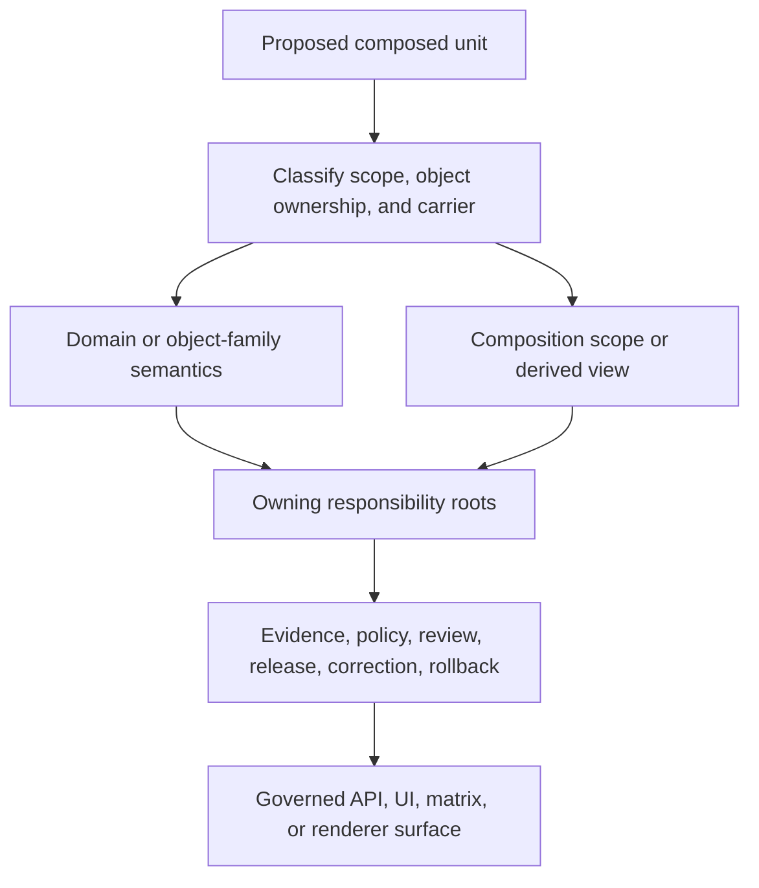
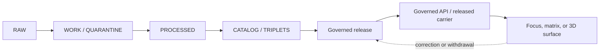

<!-- [KFM_META_BLOCK_V2]
doc_id: kfm://doc/architecture-cross-domain-compositional-units
title: Cross-Cutting Compositional Units
type: standard
version: v0.2.0
prior_version: v0.1
status: draft; repository-grounded architecture reference; non-authoritative
owners: "NEEDS VERIFICATION - CODEOWNERS routes the default pattern to @bartytime4life; no dedicated cross-domain architecture steward or independent approval control was verified"
created: 2026-05-24
updated: 2026-07-26
policy_label: public
responsibility_root: docs/
canonical_relationship: same-path architecture reference; no sibling authority created
truth_posture: "CONFIRMED current repository paths and source classifications / CONFLICTED compositional-unit versus domain classification for Frontier Matrix and Planetary-3D / PROPOSED exact lane homes and implementation / UNKNOWN operational conformance / NEEDS VERIFICATION accountable stewardship, accepted classification decisions, registered scope and seam IDs, contract-schema-policy closure, tests, release records, correction drills, and rollback drills"
evidence_snapshot:
  repository: bartytime4life/Kansas-Frontier-Matrix
  visibility: public
  base_ref: main
  base_commit: 59194561bc6f0813fe6fb3cc505d042747c86948
  target_prior_blob: 02e8964847b4a059631e6ce7d08f05c381bcca47
  parent_readme_blob: b8c7396aed20a14c54a011a02b8ded78839868f3
  directory_rules_v2_blob: fd49a0b83e55cef52c1124281f093e263526898d
  adr_0029_blob: cd044a38047cc9b3725d2e083eb201eb86109308
  directory_rules_legacy_blob: 18653c00ba193a4afaa3e07a0924452807fb98ef
  codeowners_blob: dd2a84aa514d8ecd9208bc347f90f9a2ed37dd61
  focus_docs_blob: 008cf7b3496fdfe56ff3a23b12cb470c27dcf76e
  focus_contract_readme_blob: cf6faac30891f3f874f37a011b123bb6d473214e
  planetary_domain_readme_blob: a0eea744a6dd249903720cf1599ee14420a0b25c
  maplibre_package_readme_blob: 3ba48e7d61b013a659ed51b9336eee788d06b8f2
related:
  - ./README.md
  - ./cross-lane-relations.md
  - ./multi-domain-placement.md
  - ./shared-kernel.md
  - ./source-role-anti-collapse.md
  - ./trust-membrane.md
  - ./responsibility-layers.md
  - ../../doctrine/directory-rules.md
  - ../../adr/ADR-0029-adopt-directory-governance-standard-v2.md
  - ../../focus-mode/README.md
  - ../../domains/planetary-3d/README.md
  - ../../../contracts/focus_mode/README.md
  - ../../../packages/maplibre/README.md
tags: [kfm, architecture, cross-domain, composition, focus-mode, frontier-matrix, planetary-3d, evidence, governance]
notes:
  - "Same-path Markdown modernization only; no doctrine, ADR status, domain classification, contract, schema, policy, implementation, release, promotion, or publication state changed."
  - "The prior universal claim that none of the three units is a domain conflicts with the supplied consolidated Atlas, whose chapters 17 and 18 explicitly classify Frontier Matrix and Planetary-3D as domains."
  - "At the pinned base, ADR-0029 is accepted and adopts the exact v2 bytes at docs/doctrine/directory-rules.md even though their pinned internal artifact label remains PROPOSED_FOR_ADOPTION."
  - "The architecture-side v1.3.1 body is restored as a read-only legacy compatibility surface; tombstoning, reference migration, and physical deletion remain separately gated and unauthorized by this page."
[/KFM_META_BLOCK_V2] -->

# Cross-Cutting Compositional Units

Focus Mode, Frontier Matrix, and Planetary/3D connect multiple KFM lanes, but
their classifications are not interchangeable: composition behavior, domain
ownership, renderer behavior, and repository placement must be decided
separately.

> [!IMPORTANT]
> A composition may join domain evidence or render released domain products
> without acquiring their truth, policy, review, or publication authority.
> Every participating object keeps its owner, source role, sensitivity,
> evidence support, temporal scope, and release lineage.

**Classification warning.** The previous statement that all three units are
non-domains is not supportable. The supplied consolidated Atlas names Frontier
Matrix and Planetary/3D as domains and assigns them object families. Until a
reviewed decision reconciles that lineage with the cross-domain composition
model, implementations must preserve both the domain-ownership and composition
boundaries.

## Table of contents

1. [Scope](#1-scope)
2. [The three compositional units](#2-the-three-compositional-units)
3. [Focus Modes](#3-focus-modes)
4. [Frontier Matrix](#4-frontier-matrix)
5. [Planetary / 3D / Digital Twin](#5-planetary--3d--digital-twin)
6. [What none of them are](#6-what-none-of-them-are)
7. [Shared rules across all three](#7-shared-rules-across-all-three)
8. [Anti-patterns](#8-anti-patterns)
9. [Open questions and ADR triggers](#9-open-questions-and-adr-triggers)
10. [Related docs](#10-related-docs)
11. [Appendix](#11-appendix)

---

## Status and evidence boundary

This page is a draft, repository-grounded architecture reference. It explains
boundaries and records unresolved classification work. It is not a domain
register, path registry, semantic contract, schema, policy decision, review
record, release manifest, implementation proof, or publication decision.

| Evidence | Confirmed at `main@5919456` | Limit |
|---|---|---|
| This target | Present at the same path; prior blob `02e8964`; version `v0.1`; 297 lines | Presence proves documentation only |
| Parent lane | [`README.md`](./README.md) and all seven sibling pages exist | The parent snapshot predates ADR-0029 acceptance; all siblings remain draft documentation and runtime conformance is not established |
| Directory Rules | [ADR-0029](../../adr/ADR-0029-adopt-directory-governance-standard-v2.md) adopts the exact v2 blob `fd49a0b` at [`docs/doctrine/directory-rules.md`](../../doctrine/directory-rules.md); [`docs/architecture/directory-rules.md`](../directory-rules.md) is restored at legacy blob `18653c0` | The v2 artifact's internal `PROPOSED_FOR_ADOPTION` label is part of the adopted bytes; the legacy body is compatibility evidence, not a second writable authority |
| Adoption decision | ADR-0029 is `accepted` and effective on the pinned base | It authorizes one writable doctrine path and controlled migration; it does not authorize the legacy tombstone, reference migration, or physical deletion |
| Focus Mode evidence | [`docs/focus-mode/README.md`](../../focus-mode/README.md) and [`contracts/focus_mode/README.md`](../../../contracts/focus_mode/README.md) exist | The docs path is singular while its H1 and many internal claims use plural; implementation and schema/policy closure remain unverified |
| Frontier Matrix evidence | The supplied consolidated Atlas chapter 17 defines a domain and county-year object family | Candidate repository lane paths checked for this update did not establish implementation |
| Planetary/3D evidence | [`docs/domains/planetary-3d/README.md`](../../domains/planetary-3d/README.md) exists; [`packages/maplibre/README.md`](../../../packages/maplibre/README.md) records a private `0.0.0` scaffold and placeholder export | The named domain and renderer carrier are related but not the same authority |
| Review routing | [`.github/CODEOWNERS`](../../../.github/CODEOWNERS) routes the default pattern to `@bartytime4life` | Routing is not a StewardshipAssignment, independent review, approval, release, or publication authority |
| Documentation automation | [`docs-build.yml`](../../../.github/workflows/docs-build.yml) and [`link-check.yml`](../../../.github/workflows/link-check.yml) are read-only readiness holds | They do not render this page or validate its local links and fragments |

### Truth posture

- **CONFIRMED:** the pinned paths, blobs, declared states, and bounded source
  classifications recorded above.
- **PROPOSED:** exact implementation lanes, contracts, schemas, policy,
  registries, runtime bindings, release profiles, and validation behavior not
  established by current evidence.
- **UNKNOWN:** operational conformance, external consumers, released instances,
  and runtime behavior beyond the inspected evidence.
- **NEEDS VERIFICATION:** accountable stewardship, accepted classification
  decisions, registered scope/seam IDs, implementation closure, correction
  propagation, and rollback drills.
- **CONFLICTED:** singular/plural Focus Mode documentation identity and
  domain-versus-composition classification for Frontier Matrix and
  Planetary/3D.

[Back to top](#top)

---

## 1. Scope

This document helps an implementer decide what kind of thing a proposed
cross-cutting unit is before assigning paths or authority. It covers:

- geographic or interaction scopes that compose evidence from several domains;
- comparative views that align domain measures across place and time;
- 3D, scene, and digital-twin object families and their renderer carrier;
- the trust, placement, validation, correction, and rollback boundaries shared
  by those compositions.

It does not define a new domain, close a domain-classification dispute, admit a
root or lane, invent a scope/seam ID, standardize an object family, or authorize
publication.

### Authority boundary

| This page may | This page may not |
|---|---|
| Explain current evidence and conflicts | Create, supersede, or reinterpret an ADR |
| Compare domain, scope, view, and carrier roles | Create or retire a domain |
| Preserve cross-domain trust invariants | Define contract or schema fields |
| Route readers to owning responsibility roots | Make a candidate path canonical |
| State validation and migration prerequisites | Approve policy, release, deployment, or publication |

When classification or ownership is unresolved, the safe result is **HOLD**:
do not create a second authority surface merely to keep implementation moving.

[Back to top](#top)

---

## 2. The three compositional units

The three names describe different kinds of composition. Treating them as one
uniform architectural class hides the most important distinction: some evidence
describes a **scope**, some describes a **domain/object family**, and some
describes a **downstream view or carrier**.

### Classification matrix

| Unit | Strongest inspected evidence | Supportable current statement | Classification work still open |
|---|---|---|---|
| **Focus Mode** | Adopted Directory Rules v2 §12.4 calls a Focus Mode a composition scope, not a domain or root; the MapLibre manual describes evidence-bounded AI inside the shell | A downstream geographic/interaction scope over governed evidence | Exact docs slug, registered scope IDs, payload boundaries, and implementation closure |
| **Frontier Matrix** | The supplied consolidated Atlas chapter 17 explicitly calls it a domain and assigns county-year object families; this lane also describes a comparative view | A domain-bounded matrix model may feed one or more comparative views | Whether domain semantics and view composition need separate registered identities and contracts |
| **Planetary / 3D / Digital Twin** | The supplied Atlas chapter 18 and the repository domain README assign scene/3D object families; the MapLibre package is a downstream renderer scaffold | Domain-owned scene/representation semantics may be carried by a separate renderer/runtime boundary | Domain/scene slug, object-family authority, renderer package home, and accepted renderer decision |

> [!NOTE]
> "Composes across domains" and "is a domain" are not logical opposites. A domain
> can own scene or matrix semantics while a view built from those semantics
> composes released evidence from many other domains. The repository must name
> and validate those two roles instead of collapsing them.

```mermaid
flowchart TD
    REQUEST["Proposed composed unit"] --> CLASSIFY["Classify scope, object ownership, and carrier"]
    CLASSIFY --> DOMAIN["Domain or object-family semantics"]
    CLASSIFY --> VIEW["Composition scope or derived view"]
    DOMAIN --> ROOTS["Owning responsibility roots"]
    VIEW --> ROOTS
    ROOTS --> GATES["Evidence, policy, review, release, correction, rollback"]
    GATES --> SURFACE["Governed API, UI, matrix, or renderer surface"]
```

The diagram is a decision boundary, not implementation proof. A renderer or
matrix surface remains downstream even when a named domain owns the object
semantics it consumes.

[Back to top](#top)

---

## 3. Focus Modes

A Focus Mode is best supported as a bounded composition scope and governed
interaction surface, not as an independent domain or repository root.

### Focus Mode evidence-backed boundary

| Aspect | Current evidence | Safe conclusion |
|---|---|---|
| Scope classification | Adopted Directory Rules v2 §12.4: geography and Focus Mode are composition scopes | Do not model Focus Mode as a root or use geography to select an authority root |
| UI/AI behavior | Supplied MapLibre manual: `MapContextEnvelope -> policy -> EvidenceRef/EvidenceBundle -> bounded synthesis -> citation validation` | Focus Mode remains evidence-subordinate with finite `ANSWER`, `ABSTAIN`, `DENY`, or `ERROR` behavior where the governing contract uses those outcomes |
| Repository docs | `docs/focus-mode/README.md` exists, but its H1 and proposed tree say `docs/focus-modes/` | Treat the dossier slug as **CONFLICTED**; do not add a second docs lane |
| Semantic contract | `contracts/focus_mode/README.md` and its payload contract exist | Contract presence establishes prose semantics only, not schema, route, policy, test, release, or runtime closure |
| Publication | Draft sources describe release-aware payloads and rollback references | A Focus Mode is not published merely because its UI, payload, branch, or manifest-shaped file exists |

### Minimum safe composition

1. Accept a bounded map, place, time, audience, and release context.
2. Resolve requested claims through governed interfaces to admissible
   `EvidenceBundle` support.
3. Apply rights, source-role, sensitivity, review, freshness, and release checks
   before interpretation.
4. Emit only the finite outcome allowed by the applicable contract.
5. Keep citations, withheld/generalized state, correction lineage, and rollback
   references visible to the consuming surface.

> [!CAUTION]
> Do not copy domain records into a Focus Mode merely to populate an area folder.
> A Focus Mode references or projects domain-owned released evidence; it does not
> acquire canonical ownership of that evidence.

[Back to top](#top)

---

## 4. Frontier Matrix

The inspected Atlas describes the Frontier Matrix as a domain governing
county-year panels, geography versions, frontier definitions, observations,
crosswalks, uncertainty, thresholds, and matrix releases. The previous version
of this page reduced it to a view and declared it non-domain; that reduction is
now recorded as unsupported.

### Domain semantics versus matrix view

| Concern | Domain-semantic role | Composition/view role |
|---|---|---|
| Identity | County-year panel, geography version, frontier definition, and owned observation identities | Selection of place, time, and visible comparison dimensions |
| Evidence | Each owned or referenced claim preserves source role, time, geography, and evidence support | The view exposes citations and distinct support per cell or panel |
| Aggregation | Defines domain-specific interpretation and uncertainty rules | Must not infer per-place facts from aggregates or merge unlike source roles |
| Sensitivity | Applies source and join-specific restrictions | Uses the most restrictive participating posture; generalization is a governed transform |
| Release | Matrix release semantics belong to the owning release model | A rendered table, dashboard, export, or API response is not itself a release decision |

### Current implementation boundary

Bounded checks at the pinned base did not establish README-backed lanes at the
previously proposed `contracts/frontier-matrix/`,
`schemas/contracts/v1/frontier-matrix/`, `policy/frontier-matrix/`,
`data/published/frontier-matrix/`, or
`release/manifests/frontier-matrix/` paths. Absence of those checked READMEs is
not a complete recursive tree inventory, but it is enough to reject the prior
page's unqualified placement claims.

Until a domain/seam register, owning contracts, schemas, policy, fixtures,
validators, tests, releases, and consumers are verified:

- keep exact lane paths **PROPOSED**;
- preserve the Atlas domain lineage rather than relabeling it silently;
- separate domain-owned matrix semantics from downstream visual composition;
- use **HOLD** when ownership or sensitivity cannot be resolved.

[Back to top](#top)

---

## 5. Planetary / 3D / Digital Twin

Planetary/3D has two connected but distinct boundaries:

1. a draft domain/object-family boundary for scene manifests, terrain models,
   3D tile sets, glTF assets, point clouds, digital-twin views, synthetic
   surfaces, view state, representation receipts, reality-boundary notes, and
   admission decisions; and
2. a downstream renderer/runtime carrier that may display released,
   policy-allowed representations without becoming truth authority.

### 3D evidence-backed boundary

| Surface | Confirmed repository state | Safe conclusion |
|---|---|---|
| Domain documentation | `docs/domains/planetary-3d/README.md` exists as a `draft` and explicitly labels its slug and implementation paths proposed | Preserve its domain lineage, but do not infer adoption or implementation |
| Renderer package | `packages/maplibre/README.md` exists; its evidence snapshot records a private `0.0.0` manifest and placeholder export | Package documentation and scaffolding do not prove a functioning adapter |
| Alternative package homes | Checked `packages/maplibre-runtime/README.md` and `packages/renderer/README.md` were not found | Do not present either as a current implemented home |
| Scene publication lanes | Checked `data/published/scenes/README.md` and `release/manifests/scenes/README.md` were not found | Keep those exact lanes proposed pending responsibility and release evidence |
| Reality boundary | The supplied Atlas and 3D sources require synthetic/reconstructed/interpolated content to remain distinguishable from observed evidence | Require a visible reality-boundary statement and the governed receipt/object defined by accepted contracts before public reliance |

> [!IMPORTANT]
> 3D is a carrier, not sovereign truth. A successful render, screenshot, scene
> manifest, package build, or visual match cannot prove evidence closure, rights,
> sensitivity clearance, review, release, or publication.

### Admission rule

A 3D or digital-twin representation is eligible for a public-facing carrier only
when the applicable contracts and policy establish:

- released and integrity-bound source artifacts;
- evidence references and source-role preservation;
- explicit observed, modeled, reconstructed, interpolated, or synthetic status;
- rights, sensitivity, geoprivacy, and audience decisions;
- safe geometry and attribute precision;
- review and release state;
- correction, cache invalidation, withdrawal, and rollback targets.

Missing or conflicting support yields the applicable fail-closed result. This
architecture page does not invent a universal outcome enum for every 3D surface.

[Back to top](#top)

---

## 6. What none of them are

The domain-classification dispute does not weaken these shared negatives.

| Forbidden interpretation | Boundary |
|---|---|
| A new repository root justified by the unit's name | Domain, geography, renderer, feature, or view names do not create responsibility roots |
| A replacement for participating domain truth | Compositions reference or project domain-owned evidence; ownership does not transfer |
| Evidence, policy, review, or release authority | Those duties remain with their owning object families and responsibility roots |
| A bypass around the trust membrane | Ordinary public surfaces use governed APIs and released public-safe carriers |
| A reason to fork shared objects | Do not create unit-local `EvidenceBundle`, `PolicyDecision`, release, receipt, or rollback variants without an accepted versioned decision |
| Proof of implementation | A README, Atlas chapter, badge, diagram, branch, pull request, package scaffold, or rendered scene is not runtime evidence |
| Automatic publication | Promotion is a governed state transition, not a file move, commit, merge, build, or display action |

[Back to top](#top)

---

## 7. Shared rules across all three

| Rule | Required effect |
|---|---|
| One authority owner per artifact | Mixed-authority objects are split; a convenient producer or filename does not select the home |
| Domain ownership preserved | A composition names participating owners and never silently rebinds their objects |
| Source role preserved | Observed, regulatory, modeled, aggregate, administrative, candidate, and synthetic roles remain distinguishable |
| Sensitivity fails closed | The combined surface cannot be more permissive than its most restrictive admissible input |
| Evidence resolves | Consequential claims resolve through `EvidenceRef` to admissible `EvidenceBundle` support or narrow/abstain |
| Space and time remain explicit | Geography versions, valid/observed/retrieval/release/correction time, and aggregation scope do not collapse |
| Derived stays derived | Matrix cells, scenes, tiles, summaries, graph projections, and AI responses do not replace canonical evidence |
| Public clients stay downstream | UI and renderer surfaces consume governed interfaces and released carriers, not RAW, WORK, QUARANTINE, restricted, or canonical stores |
| Promotion stays governed | Evidence, rights, sensitivity, validation, review, release, correction, and rollback close before public reliance |
| Watchers and AI do not publish | They may propose, interpret, or report; they do not approve or perform publication |

### Placement and authority

For this document, the current responsibility signature is:

| Axis | Value |
|---|---|
| Artifact kind | Human architecture reference |
| Authority owner | Architecture explanation only |
| Lifecycle stage | Not applicable |
| Scope kind | Cross-domain architecture |
| Exposure | Public |
| Mutability | Versioned replacement |
| Current path outcome | Preserve the existing same path; no move or new authority surface |

For implementation artifacts, select the responsibility root before adding a
unit, domain, source, geography, scene, matrix, or seam segment:

| Artifact responsibility | Owning root |
|---|---|
| Human doctrine, decisions, architecture, and guidance | `docs/` |
| Semantic meaning | `contracts/` |
| Machine-checkable shape | `schemas/` |
| Allow, deny, restrict, hold, or abstain decisions | `policy/` |
| Deployable app behavior | `apps/` |
| Reusable implementation | `packages/` |
| Tests and reusable fixtures | `tests/`, `fixtures/` |
| Lifecycle data and released carriers | `data/<phase>/` |
| Release, correction, withdrawal, and rollback decisions | `release/` |

ADR-0029 is accepted at the pinned base: the doctrine-side v2 bytes are the sole
writable human Directory Rules authority, while the restored architecture-side
body is a read-only legacy compatibility surface. Follow the adopted standard,
avoid parallel writers, and preserve the legacy path until a separately
reviewed tombstone and reference-migration change satisfies its gates. Physical
deletion remains on hold.

### Trust flow

```mermaid
flowchart LR
    RAW["RAW"] --> WQ["WORK / QUARANTINE"]
    WQ --> PROC["PROCESSED"]
    PROC --> PROJ["CATALOG / TRIPLETS"]
    PROJ --> REL["Governed release"]
    REL --> API["Governed API / released carrier"]
    API --> COMP["Focus, matrix, or 3D surface"]
    COMP -. "correction or withdrawal" .-> REL
```

The final surface is interpretive or representational. It does not become the
canonical store or the release decision that authorized its inputs.

[Back to top](#top)

---

## 8. Anti-patterns

| Anti-pattern | Why it breaks KFM | Safe response |
|---|---|---|
| `focus_modes/`, `frontier_matrix/`, `planetary_3d/`, or `scenes/` as a new repository root | Topic or feature name displaces responsibility-root ownership | **DENY** the root; classify each artifact by responsibility |
| Declaring all three non-domains | Erases explicit Atlas domain ownership for Frontier Matrix and Planetary/3D | **HOLD** classification; preserve both source positions |
| Unit-local kernel variants | Fragments object meaning and cross-surface interoperability | Reuse accepted object families or open a versioned decision |
| Matrix aggregation that drops geography, time, uncertainty, or source roles | Derived comparison is presented as homogeneous truth | Preserve per-input context and emit a governed aggregation record |
| Synthetic or reconstructed 3D presented as observed | Crosses the reality boundary and misstates evidence | Fail closed; show the accepted boundary note and receipt |
| Renderer, matrix, or Focus payload reading internal stores directly | Bypasses policy, release, and evidence resolution | Route through governed APIs and released carriers |
| Unit policy overriding participating domain restrictions | The composition becomes a hidden policy authority | Combine applicable decisions without weakening the strictest input |
| Proposed paths described as implemented | Documentation outruns current repository evidence | Label paths **PROPOSED** and verify exact consumers before use |
| Branch, PR, merge, badge, or render treated as publication | GitHub or UI state is mistaken for governed release state | Require release, correction, and rollback evidence |

[Back to top](#top)

---

## 9. Open questions and ADR triggers

| Open item | Current state | Evidence or decision required |
|---|---|---|
| Directory Rules compatibility migration | **ACCEPTED / MIGRATION OPEN:** v2 exact bytes are adopted; the legacy body is restored read-only; tombstone, reference migration, and deletion remain held | A separate migration change with consumer and fragment inventory, redirect or tombstone mapping, zero-writer enforcement, link closure, rollback, and explicit later deletion authority |
| Focus Mode docs slug | **CONFLICTED:** path `docs/focus-mode/`; H1 and proposed references use `docs/focus-modes/` | Accepted path/alias decision, consumer inventory, one-writer rule, and migration/rollback plan |
| Focus Mode scope and implementation profile | **NEEDS VERIFICATION** | Registered scope IDs, semantic contract, schema, policy, fixtures, validators, routes, release profile, and finite-outcome tests |
| Frontier Matrix classification | **CONFLICTED / LINEAGE** | Decision separating or unifying domain semantics, object ownership, comparative view identity, contracts, and release model |
| Planetary/3D classification | **CONFLICTED / NARROWED** | Decision separating domain/scene semantics from renderer/runtime carrier and selecting registered slugs |
| Renderer package boundary | **NEEDS VERIFICATION** | Accepted renderer ADR, one canonical package home, dependency/import policy, functioning adapter, consumers, tests, CI, correction, and software rollback |
| Scene and matrix publication lanes | **PROPOSED** | Directory authority, object-family registry, contract/schema/policy closure, release manifests, corrections, and rollback evidence |
| Cross-domain seam registry | **NEEDS VERIFICATION** | Stable IDs, owners, aliases, schemas, fixtures, validator, negative tests, migration rules, and machine-register parity |

### Decision triggers

Open or update an ADR when work would:

- accept, reject, split, merge, or rename a domain or object-family identity;
- choose a canonical or compatibility path, alias, or package home;
- introduce a cross-domain seam or scope identifier with repository-wide effect;
- fork a shared contract, schema, policy vocabulary, receipt, or release family;
- change public finite outcomes or the trust membrane;
- weaken rights, sensitivity, source-role, evidence, correction, or rollback
  requirements.

[Back to top](#top)

---

## 10. Related docs

| Reference | Role | Current evidence state |
|---|---|---|
| [Cross-domain architecture index](./README.md) | Parent scope, lane map, evidence boundary, and open-work register | Repository-grounded draft whose pinned authority snapshot predates ADR-0029 acceptance |
| [Cross-lane relations](./cross-lane-relations.md) | Draft treatment of ownership, role, sensitivity, and evidence invariants | `v0.1` draft; implementation claims need independent verification |
| [Multi-domain placement](./multi-domain-placement.md) | Responsibility-first routing guidance | `v0.1` draft |
| [Shared kernel](./shared-kernel.md) | Draft object-family catalog | `v0.1` draft; accepted object registry remains unverified |
| [Source-role anti-collapse](./source-role-anti-collapse.md) | Draft source-role separation guidance | `v0.1` draft |
| [Trust membrane](./trust-membrane.md) | Public-versus-internal boundary | `v0.1` draft |
| [Responsibility layers](./responsibility-layers.md) | Evidence, policy, catalog, release, API, UI, AI, and operations separation | `v0.1` draft |
| [Directory Rules v2](../../doctrine/directory-rules.md) | Adopted responsibility, scope, placement, and migration standard | Exact blob `fd49a0b` adopted by ADR-0029 at `main@5919456`; its internal `PROPOSED_FOR_ADOPTION` label is retained as part of the pinned bytes |
| [ADR-0029](../../adr/ADR-0029-adopt-directory-governance-standard-v2.md) | Adoption and compatibility-migration decision | `accepted`; legacy tombstone, reference migration, and deletion remain separately gated |
| [Focus Mode docs](../../focus-mode/README.md) | Draft proof-slice/control-plane design | Existing path; singular/plural identity conflict |
| [Focus Mode contracts](../../../contracts/focus_mode/README.md) | Payload semantic meaning | Existing draft lane; implementation closure unverified |
| [Planetary/3D domain](../../domains/planetary-3d/README.md) | Draft domain and object-family treatment | Existing; slug and implementation proposed |
| [MapLibre package](../../../packages/maplibre/README.md) | Renderer package and compatibility boundary | Existing private package scaffold; functional adapter not established |

[Back to top](#top)

---

## 11. Appendix

<strong>11.1 Implementation admission card</strong>

Before implementing a Focus, matrix, or 3D artifact:

1. Freeze the accepted Directory Rules and ADR baseline.
2. Classify scope, object-family ownership, carrier behavior, lifecycle, exposure,
   and retention separately.
3. Select one owning responsibility root.
4. Verify registered domain, scope, seam, source, and object-family IDs.
5. Resolve contracts, schemas, policy, fixtures, validators, and negative tests.
6. Preserve evidence, source role, geography, time, rights, and sensitivity.
7. Keep public consumers behind governed interfaces and released carriers.
8. Define correction, withdrawal, cache invalidation, and rollback behavior.
9. Reject parallel writers, placeholder authority, and path-by-topic shortcuts.
10. Record **PLACE**, **SPLIT**, **MIGRATE**, **MIRROR**, **HOLD**, or **DENY**
    only when the governing placement vocabulary is effective.

<strong>11.2 Truth-label legend</strong>

- **CONFIRMED** - verified from the pinned repository evidence or supplied source
  inspected for this update.
- **PROPOSED** - a design, path, classification, or behavior not established as
  current authority or implementation.
- **UNKNOWN** - available evidence is insufficient to determine the state.
- **NEEDS VERIFICATION** - a concrete repository, governance, test, runtime,
  release, correction, or rollback check is still required.

Qualifiers such as **CONFLICTED**, **NARROWED**, and **LINEAGE** explain why a
core truth label is constrained; they do not replace the four core labels.

<strong>11.3 Validation and maintenance</strong>

Update this page when:

- the Directory Rules or ADR-0029 authority state changes;
- a domain, scope, seam, scene, matrix, or renderer identity is accepted,
  superseded, or migrated;
- implementation-bearing contracts, schemas, policy, tests, releases, or
  rollback records replace a proposal;
- correction or withdrawal behavior changes the public composition boundary.

Source validation for this revision checks Markdown structure, anchors,
repository-relative links, Mermaid syntax, badge construction, sensitive
content, and semantic no-loss. A passing source check does not prove GitHub
rendering, accepted doctrine, implementation, test coverage, operational
health, release, publication, correction propagation, or rollback readiness.

---

**Related:** [Cross-domain index](./README.md) ·
[Focus Mode](../../focus-mode/README.md) ·
[Planetary/3D domain](../../domains/planetary-3d/README.md) ·
[Directory Rules v2](../../doctrine/directory-rules.md) ·
[ADR-0029](../../adr/ADR-0029-adopt-directory-governance-standard-v2.md)

**Last updated:** 2026-07-26 · **Doc version:** v0.2.0 ·
**Doc status:** draft · **Authority:** architecture explanation only

[Back to top](#top)
