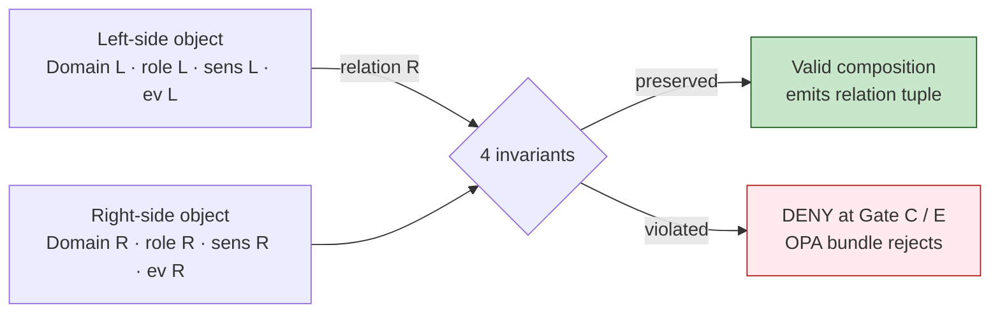

<!-- [KFM_META_BLOCK_V2]
doc_id: kfm://doc/architecture-cross-domain-cross-lane-relations
title: Cross-Lane Relations — The Four Invariants
type: standard
version: v0.1
status: draft
owners: <ARCHITECTURE-DOCTRINE-OWNER> · NEEDS VERIFICATION
created: 2026-05-24
updated: 2026-05-24
policy_label: public
related:
  - README.md
  - source-role-anti-collapse.md
  - shared-kernel.md
  - trust-membrane.md
  - multi-domain-placement.md
  - kfm_unified_doctrine_synthesis.md#8
  - kfm_unified_doctrine_synthesis.md#17
  - Kansas_Frontier_Matrix_-_Domains_v1_1___Pass_23_32_Consolidated_Atlas.md#24
tags: [kfm, architecture, cross-domain, cross-lane, invariants, doctrine]
notes:
  - PROPOSED placement; folder vs §12 flat-file pattern is OPEN-DR-10.
  - Canonical authority is each Atlas per-domain "F. Cross-lane relations" table; this doc is the consolidated meta-pattern.
[/KFM_META_BLOCK_V2] -->

<a id="top"></a>

# Cross-Lane Relations — The Four Invariants

> *Every domain × domain relation in KFM MUST preserve four invariants: ownership, source role, sensitivity, and `EvidenceBundle` support. A relation that breaks any one of them is not a valid cross-domain composition.*


-blue)


**Status:** draft · **Owners:** `<ARCHITECTURE-DOCTRINE-OWNER>` *(NEEDS VERIFICATION)* · **Last updated:** 2026-05-24

> [!IMPORTANT]
> **The invariants are doctrine, not vibes.** They are checked at promotion gates **C — Sensitivity** and **E — Evidence closure** *(`kfm_unified_doctrine_synthesis.md` §8)*; the Conftest/OPA bundle MUST deny when any invariant is broken; the cross-lane validator MUST fail closed on missing source-role tags or unresolved `EvidenceRef` on either side of a join.

> [!NOTE]
> **This doc consolidates a pattern that appears in every domain.** Each domain dossier carries an "F. Cross-lane relations" table listing its relations to other domains; the constraint clause those tables share is the meta-pattern documented here.

---

## Table of contents

1. [Scope](#1-scope)
2. [The four invariants](#2-the-four-invariants)
3. [Invariant (1) — Ownership preserved](#3-invariant-1--ownership-preserved)
4. [Invariant (2) — Source role preserved](#4-invariant-2--source-role-preserved)
5. [Invariant (3) — Sensitivity preserved](#5-invariant-3--sensitivity-preserved)
6. [Invariant (4) — `EvidenceBundle` support](#6-invariant-4--evidencebundle-support)
7. [Where the invariants execute](#7-where-the-invariants-execute)
8. [Worked example — Hydrology × Hazards](#8-worked-example--hydrology--hazards)
9. [Anti-patterns](#9-anti-patterns)
10. [Open questions and ADR triggers](#10-open-questions-and-adr-triggers)
11. [Related docs](#11-related-docs)
12. [Appendix](#12-appendix)

---

## 1. Scope

This doc defines the invariants that govern **every cross-lane relation** in KFM — *Hydrology × Hazards*, *People/Land × Settlements*, *Fauna × Habitat × Flora*, *Archaeology × People/Land*, *Roads × Settlements*, *Air × Agriculture*, and the long tail. The invariants apply uniformly: the four constraints do not change by domain pair.

> [!TIP]
> **When this doc binds.** Any time a query, join, contract, schema, validator, or release composes records from two or more domains. Single-domain operations are out of scope.

[↑ Back to top](#top)

---

## 2. The four invariants

> **Evidence basis:** Every per-domain "F. Cross-lane relations" section in the Atlas (Parts 1 and 2) shares the same constraint clause. **CONFIRMED doctrine.**

| # | Invariant | What it requires | What it forbids |
|---|---|---|---|
| **(1)** | **Ownership preserved** | The relation names which domain owns which object on each side; ownership does not transfer across the relation. | A cross-lane join that silently rebinds an object's owning domain. |
| **(2)** | **Source role preserved** | Each object carries its source role *(observed / regulatory / modeled / aggregate / administrative / candidate / synthetic)* across the relation. | Cross-lane joins that collapse or drop roles *(see `source-role-anti-collapse.md` §3)*. |
| **(3)** | **Sensitivity preserved** | The most restrictive sensitivity on either side of the relation applies. Aggregation does **not** lower sensitivity. | Joining a `T0`-public object to a `T3`-restricted object and publishing the result as `T0`. |
| **(4)** | **`EvidenceBundle` support** | Every claim that asserts the relation resolves to an `EvidenceBundle` on both sides; closure is required before public exposure. | Cross-lane assertions with `EvidenceRef` that does not resolve, or that resolve only on one side. |

> [!CAUTION]
> **The invariants compose; they do not substitute.** All four must hold. A relation that preserves ownership and source role but loses sensitivity is still invalid. A relation that satisfies sensitivity and evidence but rebinds ownership is still invalid.



[↑ Back to top](#top)

---

## 3. Invariant (1) — Ownership preserved

A cross-lane relation **names** but **does not transfer** ownership. When `Settlements` references a `Parcel` owned by `People/Land`, the parcel is still owned by People/Land; the settlement record carries a pointer, not a copy that becomes its own. This is the **Open-host Service** posture from DDD: each domain publishes a stable interface for the others to reference.

| Requirement | Concrete shape |
|---|---|
| Relation tuple names each side's owning domain | `{ left: { domain, id }, right: { domain, id }, relation_type }` |
| The relation lives **in a cross-domain segment**, not under either side's domain segment | `contracts/<topic>/`, `schemas/contracts/v1/<topic>/` — see [`multi-domain-placement.md`](multi-domain-placement.md) |
| Edits to the relation flow through the joint domain owners, not one side alone | ADR if disputed *(`ai-build-operating-contract.md` §28)* |

> [!IMPORTANT]
> **"Picking a domain" is the failure mode.** If a relation between A and B is filed under domain A, then B's domain stewards have to crosswalk through A's segment to find or edit it. Place cross-domain artifacts under non-domain segments.

[↑ Back to top](#top)

---

## 4. Invariant (2) — Source role preserved

Each side of the relation **carries** its source role through the join. The output relation record does not synthesize a new role; it surfaces both. Detail on the seven roles, DENY conditions, and guardrails is in [`source-role-anti-collapse.md`](source-role-anti-collapse.md).

| Pattern | Outcome |
|---|---|
| Both sides are `observed` | Relation tuple is `observed × observed` *(suitable for evidentiary use)*. |
| One side is `regulatory`, one is `observed` | Tuple is `regulatory × observed`; UI MUST NOT present as a single homogeneous fact. |
| Either side is `candidate` | Tuple is candidate; **not** allowed on `PUBLISHED` until promoted. |
| Either side is `synthetic` | Tuple carries Reality Boundary Note. |
| Either side is `aggregate` | Tuple is restricted to aggregate-scope semantics; per-place inference is denied. |

> [!CAUTION]
> **Do not synthesize a "new" role from a join.** A join of two observations is two observations *(linked)*, not a new observation. A join of an observation and a regulation does not become a regulation. Collapse here breaks the trust path downstream.

[↑ Back to top](#top)

---

## 5. Invariant (3) — Sensitivity preserved

Sensitivity is **monotonic across joins**: the output inherits the **most restrictive** input. Aggregation, summarization, or geometric coarsening do **not** lower sensitivity.

| Left | Right | Output |
|---|---|---|
| `T0 (public)` | `T0 (public)` | `T0` |
| `T0` | `T1 (restricted)` | `T1` |
| `T1` | `T2 (sensitive)` | `T2` |
| `T0` | `T3 (fail-closed)` | `T3` *(and DENY publication of join entirely if either side requires fail-closed)* |

Cross-lane joins that include any **fail-closed** domain *(archaeology exact-location, living-person identifiers, DNA, parcel-title, critical-infrastructure exact-location)* take their fail-closed posture as the joint posture.

> [!IMPORTANT]
> **Aggregation is not a sensitivity laundromat.** Computing a county aggregate of producer-level records does not produce a public artifact unless the aggregate itself, by k-anonymity / suppression rules at the aggregation gate, is publishable.

[↑ Back to top](#top)

---

## 6. Invariant (4) — `EvidenceBundle` support

Every consequential claim that the relation expresses MUST resolve to an `EvidenceBundle` on **both** sides. If either side cites an unresolved `EvidenceRef`, the relation is not closed for publication. *Closure* means: each pointer resolves; each support record is present; sensitivity and role tags are intact; the bundle is internally consistent.

| Stage | Behavior |
|---|---|
| `RAW` / `WORK` | `EvidenceRef` may be unresolved; relation is candidate. |
| `PROCESSED` | Resolution is attempted; unresolved relations move to `QUARANTINE`. |
| `PUBLISHED` | Resolution is required; promotion gate E denies otherwise. |
| Governed API | API returns `ABSTAIN` envelope when bundle does not resolve at request time. |
| Governed AI | `AIReceipt` cites bundle; cite-or-abstain applies. |

> [!TIP]
> **Closure is a runtime fact, not a build-time fact.** Pointers can fail to resolve between releases *(deleted source, schema mismatch, manifest drift)*. The runtime checks closure on every public surface, not only at build.

[↑ Back to top](#top)

---

## 7. Where the invariants execute

> **Evidence basis:** `kfm_unified_doctrine_synthesis.md` §8 *(promotion gates A–G, CONFIRMED)*; `directory-rules.md` §6.5 *(policy)*, §7.5 *(validators)*.

| Gate / surface | Invariant checks |
|---|---|
| **Gate A — Source admission** | Source role tagged; sensitivity precheck; rights known. |
| **Gate C — Sensitivity** | Invariants (2) and (3) enforced for any join produced by the pipeline. |
| **Gate E — Evidence closure** | Invariant (4) enforced; relation rejected if either side is unresolved. |
| **Gate G — Release** | Manifest entry carries the joint role distribution and sensitivity; rollback target present. |
| **OPA bundle** | `policy/<topic>/cross-lane.rego` denies promotion violating (1)–(4). |
| **Cross-lane validator** | `tools/validators/cross-lane/` fails closed on missing role tag, unresolved evidence, ownership drift, or sensitivity downgrade. |
| **Governed API** | Returns `DENY` / `ABSTAIN` envelope on any surfaced violation. |

[↑ Back to top](#top)

---

## 8. Worked example — Hydrology × Hazards

Suppose a Focus Mode wants to display a county-scale layer that overlays **NFHL flood zones** *(Hydrology → Regulatory)* with **observed flood events** *(Hazards → Observed)* in 1951.

| Invariant | What the relation tuple records | Pass / fail |
|---|---|---|
| (1) Ownership | Left: Hydrology owns the NFHL polygon. Right: Hazards owns the observed event record. Relation tuple does not transfer ownership. | Pass |
| (2) Source role | Left role: `regulatory`. Right role: `observed`. Tuple keeps both. UI labels them distinctly. | Pass *(if labeled)* / Fail *(if displayed as one "flood layer")* |
| (3) Sensitivity | NFHL is public *(`T0`)*. Observed-event record from the gauge network is public *(`T0`)*. Output: `T0`. | Pass |
| (4) Evidence | NFHL polygon resolves to FEMA dataset receipt; observed event resolves to gauge stage record. Both bundles resolve. | Pass |

> [!IMPORTANT]
> **Failure mode for this pair.** The most common collapse here is presenting the joint layer as a single "1951 flood" picture, conflating regulatory designation with observed event. The role-preservation invariant denies that presentation; the UI MUST show two distinct sub-layers with distinct badges.

[↑ Back to top](#top)

---

## 9. Anti-patterns

| Anti-pattern | Mitigation |
|---|---|
| **Relation tuple stored under one domain** *(`schemas/contracts/v1/domains/<picked-one>/joins/`)* | Place under `<root>/<topic>/` *(`multi-domain-placement.md`)*. |
| **Joint sensitivity computed as min, not max** | OPA rule enforces max; reject during admission test. |
| **Role label collapsed into one** *(e.g., relation has `source_role: "regulatory"` only)* | Tuple schema requires `left.source_role` and `right.source_role`. |
| **Evidence closure checked only at build, not runtime** | Governed API must call closure check on every request; cache invalidation tied to release. |
| **Public surface displays the joint relation without disambiguating badges** | UI contract requires per-side role badge on joint records. |

[↑ Back to top](#top)

---

## 10. Open questions and ADR triggers

| Open item | Class | Suggested ADR title |
|---|---|---|
| Should the joint relation carry an explicit *uncertainty composition* policy *(e.g., propagate widest interval)*? | Modeling | "Uncertainty composition across cross-lane joins". |
| Cross-lane validator implementation surface — Python in `tools/`, Rego only, or both? | Tooling | "Cross-lane validator implementation surface". |
| Should `HOLD` appear as a separate sensitivity outcome at the cross-lane invariant check, or stay folded into `DENY`/`ABSTAIN`? | Vocabulary | "Cross-lane HOLD modeling". |

[↑ Back to top](#top)

---

## 11. Related docs

| Reference | Role | Truth label |
|---|---|---|
| `README.md` *(this folder)* §7 | Landing summary of the four invariants | CONFIRMED doctrine |
| `source-role-anti-collapse.md` *(sibling)* | Detail of invariant (2) | CONFIRMED doctrine |
| `shared-kernel.md` *(sibling)* | `EvidenceBundle` definition for invariant (4) | CONFIRMED doctrine |
| `trust-membrane.md` *(sibling)* | Public-vs-internal boundary the invariants protect | CONFIRMED doctrine |
| `multi-domain-placement.md` *(sibling)* | Where joint relation artifacts live | CONFIRMED doctrine |
| `kfm_unified_doctrine_synthesis.md` §8 | Promotion gates A–G | CONFIRMED doctrine |
| `kfm_unified_doctrine_synthesis.md` §17 | Cross-lane relations and source-role anti-collapse | CONFIRMED doctrine |
| `Kansas_Frontier_Matrix_-_Domains_v1_1___Pass_23_32_Consolidated_Atlas.md` Ch. 24 | Per-domain "F. Cross-lane relations" tables (the source of the meta-pattern) | CONFIRMED doctrine |

[↑ Back to top](#top)

---

## 12. Appendix

<details>
<summary><strong>12.1 Invariants — at-a-glance card</strong></summary>

```text
Every domain × domain relation MUST preserve:

  (1) Ownership          — neither side rebinds the other's owning domain
  (2) Source role        — observed/regulatory/modeled/aggregate/admin/
                           candidate/synthetic carried across the relation
  (3) Sensitivity        — most-restrictive applies; aggregation does NOT lower
  (4) EvidenceBundle     — every claim resolves on BOTH sides; closure required
                           support              before public exposure

If any one fails, the relation is invalid as a public KFM composition and the
promotion gates (C — Sensitivity, E — Evidence closure) MUST deny.
```

</details>

<details>
<summary><strong>12.2 Truth-label legend</strong></summary>

- **CONFIRMED** — verified this session from attached docs.
- **PROPOSED** — design / placement / inference not yet verified in implementation.
- **INFERRED** — derivable from confirmed evidence but not directly stated.
- **NEEDS VERIFICATION** — checkable, but not yet checked strongly enough to act as fact.

</details>

---

**Related (mini)** · [`README.md`](README.md) · [`source-role-anti-collapse.md`](source-role-anti-collapse.md) · [`shared-kernel.md`](shared-kernel.md) · [`trust-membrane.md`](trust-membrane.md) · [`multi-domain-placement.md`](multi-domain-placement.md)

**Last updated:** 2026-05-24 · **Doc version:** v0.1 · **Doc status:** draft · **Path status:** PROPOSED *(OPEN-DR-10)*

[↑ Back to top](#top)
