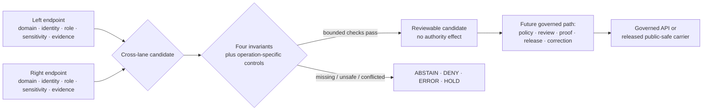

<!-- [KFM_META_BLOCK_V2]
doc_id: kfm://doc/architecture-cross-domain-cross-lane-relations
title: Cross-Lane Relations — Four Invariants and Current Implementation Boundary
type: architecture
version: v0.2.0
status: draft; repository-grounded; explanatory; fixture-first implementation partial; policy inactive; non-publisher
owners:
  - "@bartytime4life - verified CODEOWNERS review route; routing is not stewardship, independent review, or approval"
owner_status: "Cross-domain architecture, participating-domain, evidence, policy, sensitivity, review, release, correction, and rollback stewards remain NEEDS VERIFICATION"
created: 2026-05-24
updated: 2026-08-19
policy_label: public
truth_posture: cite-or-abstain
owning_root: docs/
responsibility_root: docs/
responsibility: Explain the invariant boundary for cross-lane relation candidates and reconcile it with current repository evidence without becoming semantic, schema, policy, evidence, review, release, or publication authority.
current_path: docs/architecture/cross-domain/cross-lane-relations.md
base_commit: 7293f40cc4f2bc7cc48f1956218fd6c15536f787
prior_blob: 15ca8eb8c7790d2962b710097196ed9b1eea0f79
directory_governance: "Accepted ADR-0029 adopts docs/doctrine/directory-rules.md; section 12.5 confirms this existing shared-architecture lane and routes contracts, tests, and validators to their own responsibility roots."
related:
  - README.md
  - ../cross-lane-join-policy.md
  - ../../doctrine/directory-rules.md
  - ../../adr/ADR-0029-adopt-directory-governance-standard-v2.md
  - source-role-anti-collapse.md
  - shared-kernel.md
  - trust-membrane.md
  - multi-domain-placement.md
  - ../../../control_plane/cross_domain_seam_register.yaml
  - ../../../contracts/joins/cross_lane_join_assessment.md
  - ../../../schemas/contracts/v1/joins/cross_lane_join_assessment.schema.json
  - ../../../tools/joins/join_candidates.py
  - ../../../fixtures/contracts/v1/joins/cross_lane_join_assessment/cases.json
  - ../../../tests/joins/test_join_candidates.py
  - ../../../policy/joins/README.md
tags: [kfm, architecture, cross-domain, cross-lane, relation, ownership, source-role, sensitivity, evidence, fail-closed, non-publisher]
notes:
  - "The four-invariant architecture spine is retained: ownership, source role, sensitivity, and evidence support."
  - "Current executable proof is bounded to a deterministic no-network candidate assessment and a separate projection-only seam-register validator."
  - "No active generic join-policy bundle, generic join validator executable, join PolicyDecision family, public relation path, or release integration is claimed."
[/KFM_META_BLOCK_V2] -->

<a id="top"></a>

# Cross-Lane Relations — Four Invariants and Current Implementation Boundary

> **Operating rule.** A cross-lane result may be no stronger than its participating endpoints, the evidence for the relationship itself, and the most restrictive applicable rights, sensitivity, policy, review, and release posture. A candidate relation is not relationship truth, policy approval, review approval, release approval, or publication.

| Field | Current bounded result |
|---|---|
| **Evidence snapshot** | `main@7293f40cc4f2bc7cc48f1956218fd6c15536f787` |
| **Document role** | Human-readable cross-domain architecture explanation |
| **Placement** | **CONFIRMED** at the existing path under accepted Directory Rules §12.5 |
| **Four-invariant spine** | Ownership · source role · sensitivity · evidence support |
| **Seam register** | **PROPOSED**, partial, projection-only; five entries remain `HOLD_UNRESOLVED` |
| **Executable candidate proof** | **CONFIRMED** fixture-first contract, closed schema, deterministic helper, 19 synthetic cases, 10 focused tests, and read-only workflow |
| **Generic join policy** | Documented but **inactive**; no accepted local bundle, selector, evaluator, or decision emitter |
| **Generic join validator** | README-defined boundary only; no direct executable, dedicated fixture/test lane, or dedicated workflow established there |
| **Public or release authority** | None created by this page, the seam register, or the candidate helper |

> [!IMPORTANT]
> **The invariants are architecture constraints, not proof that every KFM join is enforced.** Current repository evidence proves a projection-only seam-register validator and a synthetic candidate-assessment slice. It does not prove generic relationship truth, complete `EvidenceRef` → `EvidenceBundle` resolution, accepted join policy, accountable review, release integration, deployed public consumption, correction propagation, or rollback execution.

> [!CAUTION]
> **A helper `ALLOW` means only “emit a reviewable `JOIN_CANDIDATE` report.”** It does not mean `ANSWER`, `OPEN`, policy permission, evidence closure, relation truth, release, or publication.

**Quick navigation:** [Status](#status-and-evidence-boundary) · [Purpose](#1-purpose-and-non-effects) · [Authority](#2-authority-and-responsibility-split) · [Four invariants](#3-the-four-invariants) · [Ownership](#4-ownership-preserved) · [Source role](#5-source-role-preserved) · [Sensitivity](#6-sensitivity-and-composition-risk-preserved) · [Evidence](#7-evidence-support-preserved) · [Additional obligations](#8-additional-operational-obligations) · [Implementation](#9-current-repository-implementation) · [Held seams](#10-current-held-seams) · [Worked example](#11-worked-synthetic-example) · [Outcomes](#12-finite-outcomes-and-non-effects) · [Public surfaces](#13-public-surface-and-trust-membrane-boundary) · [Correction](#14-correction-invalidation-and-rollback) · [Validation](#15-validation-and-acceptance) · [Open work](#16-open-decisions-and-verification-backlog) · [References](#17-related-repository-surfaces) · [Appendix](#18-appendix)

---

<a id="status-and-evidence-boundary"></a>

## Status and evidence boundary

This revision replaces the older May 2026 planning posture with a repository-grounded boundary. The target remains explanatory documentation. It does not become contract, schema, policy, validator, evidence, registry, review, release, or runtime authority merely because it is detailed.

| Surface | Confirmed repository state | Safe interpretation |
|---|---|---|
| This page | Existing file; prior blob `15ca8eb8c7790d2962b710097196ed9b1eea0f79` | Same-path modernization; no new authority home or migration |
| Directory governance | [ADR-0029](../../adr/ADR-0029-adopt-directory-governance-standard-v2.md) is accepted and pins [Directory Rules v2](../../doctrine/directory-rules.md) | Placement is settled for this page; relation semantics and policy acceptance are not |
| Cross-domain architecture index | [This lane's README](README.md) identifies this page as an older draft requiring ownership and current-evidence refresh | The refresh is repository-owned documentation work |
| Seam projection | [`cross_domain_seam_register.yaml`](../../../control_plane/cross_domain_seam_register.yaml) records five high-risk seams, all held | The register supports navigation and review; it authorizes no join |
| Seam projection validator | [`validate_cross_domain_seam_register.py`](../../../tools/validators/directory_governance/validate_cross_domain_seam_register.py) checks ownership allocations, registered domains, fail-closed defaults, and repository bindings | It validates the projection, not a real relationship or public derivative |
| Candidate semantics | [`CrossLaneJoinAssessment`](../../../contracts/joins/cross_lane_join_assessment.md) is proposed, fixture-first, dry-run, local-only, and non-authoritative | Meaning is bounded to candidate assessment |
| Machine shape | [`cross_lane_join_assessment.schema.json`](../../../schemas/contracts/v1/joins/cross_lane_join_assessment.schema.json) is a closed Draft 2020-12 profile, version `0.1.0` | The fixture assessment has an enforceable shape |
| Helper and synthetic evidence | [`join_candidates.py`](../../../tools/joins/join_candidates.py), [19-case fixtures](../../../fixtures/contracts/v1/joins/cross_lane_join_assessment/cases.json), and [10 focused tests](../../../tests/joins/test_join_candidates.py) exist | Deterministic candidate computation is implemented for the declared synthetic profile |
| Dedicated candidate workflow | [`cross-lane-join-assessment.yml`](../../../.github/workflows/cross-lane-join-assessment.yml) runs no-network fixtures, tests, and receipt validation | Workflow success proves only that bounded profile |
| Generic validator boundary | [`tools/validators/cross-domain-joins/`](../../../tools/validators/cross-domain-joins/README.md) is README-only; [`cross-lane/`](../../../tools/validators/cross-lane/README.md) is a compatibility bridge | Do not claim a generic executable validator from either path |
| Join-policy boundary | [`policy/joins/`](../../../policy/joins/README.md) is documented but inactive | No accepted join-policy evaluator or bundle is established |
| Outward policy shape | Current [`PolicyDecision`](../../../schemas/contracts/v1/policy/policy_decision.schema.json) does not include a `joins` family | Do not emit or document `policy_family: joins` as current schema-valid behavior |
| Policy-gate register | [`policy_gate_register.yaml`](../../../control_plane/policy_gate_register.yaml) is `PROPOSED` with no entries | No active generic join gate is registered |
| Public/release integration | No complete generic flow is established by the inspected contract, schema, helper, policy lane, gate register, tests, or workflow | Remains **UNKNOWN / NEEDS VERIFICATION** |

### Truth posture

- **CONFIRMED:** file presence, accepted placement authority, current projection defaults, five held seams, current fixture schema, helper behavior expressed in code, 19 synthetic cases, 10 focused tests, path-scoped workflows, inactive policy lane, closed `PolicyDecision` family enum, and empty proposed gate register.
- **PROPOSED:** complete generic relation policy, pair-profile graduation rules, outward decision normalization, public-surface obligations, and any future active seam.
- **UNKNOWN:** production joins, deployed consumers, runtime EvidenceBundle resolution, authenticated review, released cross-lane derivatives, correction propagation, cache invalidation, and rollback execution.
- **NEEDS VERIFICATION:** accepted stewards, relation-profile authority, generic validator implementation, policy bundle/evaluator binding, required-check significance, and consumer closure.
- **HOLD:** every currently registered seam and every proposed public join.

[Back to top](#top)

---

## 1. Purpose and non-effects

This page explains the invariant boundary for binary and n-ary relation candidates that span independently governed KFM domain lanes. It reconciles the durable four-invariant architecture spine with the repository's current fixture-first and projection-only implementation.

It answers:

1. What must remain separate when domain-owned endpoints are evaluated together?
2. What do current repository surfaces actually prove?
3. Which controls remain before a candidate may become a governed derivative?
4. Which negative outcome applies when support is incomplete, conflicted, unsafe, or unavailable?

This page does **not**:

- define endpoint truth or relationship truth;
- transfer ownership between domains;
- select a universal relation taxonomy, contract family, or schema family;
- activate a source, connector, policy bundle, evaluator, route, or public client;
- resolve an `EvidenceRef` into an `EvidenceBundle`;
- create a `PolicyDecision`, `ReviewRecord`, receipt, proof, release manifest, correction notice, or rollback card;
- write RAW, WORK, QUARANTINE, PROCESSED, CATALOG, TRIPLET, or PUBLISHED state;
- authorize release, deployment, promotion, publication, or public use;
- lower rights, consent, privacy, sovereignty, cultural, ecological, archaeological, living-person, genomic, private-land, well, or infrastructure protections;
- turn proximity, overlap, name similarity, a matching key, schema validity, validator success, workflow success, or AI language into authoritative knowledge.

The page belongs in `docs/architecture/cross-domain/` because it explains a shared architecture seam. Accepted Directory Rules route each implementation artifact to the root that owns its primary responsibility rather than placing every cross-lane artifact beside this document.

[Back to top](#top)

---

## 2. Authority and responsibility split

A cross-lane feature touches several roots, but each object family retains one owner. A relation does not create a sovereign merged domain above its participants.

| Concern | Owning surface | Boundary |
|---|---|---|
| Endpoint meaning and identity | Participating domain contracts, schemas, and domain documentation | One domain may reference but not rewrite another domain's object |
| Relationship meaning | An accepted semantic profile under `contracts/` | Policy and tooling cannot invent semantics |
| Machine shape | An accepted schema profile under `schemas/` | Shape validity is not truth or permission |
| Candidate computation | `tools/joins/` or an accepted pair-specific implementation | A helper may propose; it may not approve or publish |
| Generic and pair validation | `tools/validators/` plus `tests/` and `fixtures/` | A pass proves only declared checks |
| Source identity and role | Source contracts and registry authority | A join cannot upgrade what a source can prove |
| Evidence and provenance | Evidence, registry, receipt, proof, and catalog authorities | Endpoint evidence and relation evidence remain separable |
| Rights, consent, sensitivity, and access | Accepted `policy/` families and qualified review | Adjacency never transfers permission |
| Review | Governed review records and authenticated reviewer authority | CODEOWNERS routing is not review proof |
| Release, correction, withdrawal, rollback | `release/` and applicable accountability lanes | No helper, register, or policy result substitutes for release closure |
| Public API, map, search, export, graph, and AI | Governed released-carrier surfaces | Public clients consume only released, obligation-compliant derivatives |
| This page | `docs/` | Explain, cross-reference, narrow claims, and expose unresolved boundaries |

> [!IMPORTANT]
> **Endpoint validity, relation validity, policy admissibility, review approval, and release are five different claims.** Proving one never proves the others.

### Directory Rules basis

Accepted Directory Rules §12.5 establishes the responsibility routing pattern:

```text
shared architecture explanation -> docs/architecture/cross-domain/<seam_id>.md
cross-domain semantic contract  -> contracts/cross_domain/<seam_id>/
cross-domain test               -> tests/cross_domain/<seam_id>/
shared validator                -> tools/validators/cross_domain/<seam_id>/
```

Those examples do not automatically authorize every illustrated path or settle every existing `joins` / `relations` / `crosswalks` compatibility question. They do establish the rule: never pick an arbitrary lead domain merely to obtain a path.

[Back to top](#top)

---

## 3. The four invariants

The first four constraints are the durable anti-collapse spine carried by current cross-domain architecture and validator guidance.

| # | Invariant | Required behavior | Blocking failure |
|---|---|---|---|
| **1** | **Ownership preserved** | Each endpoint retains its bounded-context owner and identity; relation ownership is declared separately. | A relation silently rebinds, copies, mutates, or overrides another domain's authority. |
| **2** | **Source role preserved** | Each endpoint retains its admitted role; any derivation is explicit and cannot upgrade an input. | Unlike roles are collapsed, dropped, averaged, or presented as a stronger knowledge class. |
| **3** | **Sensitivity preserved** | Effective posture is at least the strictest endpoint and may become stricter because composition creates new inference risk. | A join, aggregate, generalization, style, or summary silently lowers protection. |
| **4** | **Evidence support preserved** | Consequential endpoint claims and the relationship assertion retain separately resolvable support appropriate to use. | Evidence is missing, one-sided, stale, unresolved, inconsistent, or unrelated to the connecting claim. |

All four must hold. None substitutes for another.


```mermaid
flowchart LR
    L["Left endpoint<br/>domain · identity · role · sensitivity · evidence"] --> C{"Cross-lane candidate"}
    R["Right endpoint<br/>domain · identity · role · sensitivity · evidence"] --> C
    C --> I{"Four invariants<br/>plus operation-specific controls"}
    I -->|bounded checks pass| Q["Reviewable candidate<br/>no authority effect"]
    I -->|missing / unsafe / conflicted| N["ABSTAIN · DENY · ERROR · HOLD"]
    Q --> G["Future governed path:<br/>policy · review · proof · release · correction"]
    G --> P["Governed API or<br/>released public-safe carrier"]
```

The path after the candidate is architectural. Current repository evidence does not prove a generic end-to-end path through `P`.

[Back to top](#top)

---

## 4. Ownership preserved

A relation points to domain-owned endpoints; it does not transfer their authority. The seam or relation may have its own identity and steward, but that owner cannot redefine either participant.

### Current evidence

The machine seam register records `authority_allocations` for each participating context and requires `may_modify_other_context: false`. Its validator checks that:

- every participant is registered;
- authority allocations cover the same participants;
- owned-concept lists are canonical;
- no allocation claims cross-context mutation;
- no seam root appears at repository top level.

### Required relation posture

| Requirement | Safe representation |
|---|---|
| Preserve endpoint owner | Namespace-qualified object reference plus domain identifier |
| Preserve endpoint identity | Reference the domain-owned object; do not copy it into a new sovereign record |
| Name relation authority separately | Relation or seam profile has its own stable identity and accepted owner |
| Keep correction ownership clear | Endpoint corrections originate with the endpoint owner; relation invalidation follows dependencies |
| Route shared artifacts by responsibility | Use the accepted Directory Rules pattern, not a chosen “lead” domain |

### Ownership failure modes

- storing a shared relation under one participant and letting that participant author both sides;
- copying endpoint fields into a relation and allowing them to drift from the source object;
- treating a seam-register entry as permission to mutate a participating domain;
- using a map, graph, search index, or AI summary as a new endpoint authority;
- assigning a relation owner without participating-domain review or an accepted responsibility decision.

The current seam register is intentionally non-mutating and non-publishing. It is a Context Map projection, not a domain merger.

[Back to top](#top)

---

## 5. Source role preserved

Each endpoint carries its source role through candidate assessment, review, derivation, and release. Promotion may change lifecycle and review state; it does not retroactively change what a source can prove.

### Current fixture vocabulary

The current `CrossLaneJoinAssessment` schema constrains the fixture profile to seven endpoint roles:

| Role | Bounded meaning | Cross-lane guardrail |
|---|---|---|
| `OBSERVED` | Direct measurement, reading, or first-hand evidentiary record within declared support | Preserve method, time, scale, quality, and uncertainty |
| `REGULATORY` | Administrative or legal determination with governing force | Do not present as measured physical state |
| `MODELED` | Derived output from inputs, assumptions, parameters, or fitted methods | Do not present as observation |
| `AGGREGATE` | Summary over a declared unit, population, or interval | Do not project to a person, parcel, asset, point, or single event without separate support |
| `ADMINISTRATIVE` | Record compiled for registration, accounting, or administration | Preserve documentary caveats; do not infer observation, residence, title, or causation |
| `CANDIDATE` | Unresolved or pre-authority record requiring evidence, validation, or review | Do not expose as released truth |
| `SYNTHETIC` | Simulated, reconstructed, interpolated, or generated representation | Preserve a reality-boundary explanation; do not present as observed reality |

This seven-value enum is **CONFIRMED for the fixture profile**. Repository-wide adoption, aliases, and domain-specific interpretation remain a governance decision.

### Current helper behavior

The fixture helper:

- keeps `left`, `right`, and `output_role` separately visible;
- fixes the output role to `CANDIDATE_RELATION`;
- abstains when unlike endpoint roles include `MODELED`, `AGGREGATE`, or `CANDIDATE`;
- never converts either endpoint into a new observation or regulation;
- emits no lifecycle, evidence, policy, review, release, publication, or public-use effect.

### Anti-collapse examples

| Inputs | Safe interpretation | Unsafe collapse |
|---|---|---|
| `REGULATORY × OBSERVED` | A regulatory designation related to an observation | “Observed regulatory condition” as one homogeneous fact |
| `MODELED × OBSERVED` | A model output compared with an observation, pending profile-specific review | Model output presented as measured state |
| `AGGREGATE × OBSERVED` | Aggregate context related to an observation at compatible scale | Aggregate value assigned to an individual record |
| `SYNTHETIC × SYNTHETIC` | Synthetic fixture or representation candidate | Synthetic result presented as real-world relation truth |
| Any role × `CANDIDATE` | Candidate context only | Released relation without promotion and evidence closure |

See [Source-Role Anti-Collapse](source-role-anti-collapse.md) for the wider explanatory boundary.

[Back to top](#top)

---

## 6. Sensitivity and composition risk preserved

Sensitivity is monotonic, but “strictest endpoint wins” is only the minimum. A combination may create a more harmful inference than either endpoint creates alone.

### Current fixture vocabulary

The current candidate schema uses:

```text
PUBLIC_SAFE < INTERNAL < RESTRICTED < PROHIBITED
```

The helper computes `inherited_sensitivity` as the strictest endpoint value.

| Current synthetic condition | Helper result |
|---|---|
| Both endpoints `PUBLIC_SAFE` and other checks pass | `ALLOW / JOIN_CANDIDATE` |
| A `RESTRICTED` endpoint with generalized geometry | `ABSTAIN / SENSITIVITY_REVIEW_REQUIRED` |
| A `RESTRICTED` or `PROHIBITED` endpoint with exact sensitive geometry | `DENY / GEOMETRY_PRECISION_BLOCKED` |
| Any `PROHIBITED` endpoint | `DENY` |
| Any living-person endpoint | `DENY / LIVING_PERSON_JOIN_DENIED` |

These rules are **fixture-profile behavior**, not a universal KFM sensitivity policy.

### Composition rule

A future governed derivative must evaluate:

```text
effective posture =
  strictest endpoint posture
  + relation-specific composition risk
  + requested audience and surface
  + rights, consent, sovereignty, and purpose limits
  + review and release obligations
```

Aggregation, generalization, suppression, delay, or redaction may reduce exposure only when a governed transform, policy decision, review record, release state, and correction path support that result. The transformation itself requires provenance and validation.

### Fail-closed examples

- public hydrologic geometry joined to a precise sensitive species occurrence;
- public hazard geometry joined to a critical-asset identifier;
- public historical corridor geometry joined to archaeological provenience;
- aggregate agriculture statistics joined to private farm, operator, parcel, or yield records;
- historical-person records joined to living-person identifiers, genomic material, or current parcel details;
- multiple generalized layers whose intersection reveals a protected exact location.

> [!IMPORTANT]
> **Aggregation is not a sensitivity laundromat.** A county summary is not public-safe merely because individual rows were grouped. The output must pass the accepted aggregation, suppression, inference-risk, policy, review, and release profiles.

[Back to top](#top)

---

## 7. Evidence support preserved

Evidence must remain separable for:

1. each endpoint claim; and
2. the relationship assertion itself.

Two well-supported endpoints do not prove that the relation between them is true.

### Current implementation limit

The current candidate schema requires an `evidence_ref` field on each endpoint, but permits `null`. The helper checks **presence only**:

- a missing endpoint `evidence_ref` produces `ABSTAIN / EVIDENCE_REF_MISSING`;
- a non-null string lets that rule pass;
- the helper does not resolve the reference;
- the helper does not construct or authenticate an `EvidenceBundle`;
- the helper does not require independent evidence for the connecting predicate;
- the helper's `effects.evidence_bundle_created` is always `false`.

Therefore, **CONFIRMED `EvidenceRef` presence is not CONFIRMED EvidenceBundle closure**.

### Future closure requirements

Before authoritative or public use, an accepted profile must define and verify:

| Evidence question | Required answer |
|---|---|
| Endpoint support | Does each endpoint reference resolve to current, admissible evidence? |
| Relation support | What evidence supports the connecting predicate rather than only the endpoints? |
| Source role | Does each bundle preserve what its source can and cannot prove? |
| Time and space | Does support cover the claimed interval, geography, resolution, and scale? |
| Rights and sensitivity | May the evidence support this operation, audience, precision, and derivative? |
| Review and release | Are the evidence, policy, review, and release versions mutually consistent? |
| Correction state | Has any dependency been corrected, withdrawn, superseded, expired, or restricted? |
| Runtime availability | Can the governed resolver still resolve the cited support at request time? |

### Finite negative posture

- **ABSTAIN** when support is missing, stale, conflicted, unresolved, one-sided, or insufficient for the requested scope.
- **DENY** when support exists but rights, consent, sensitivity, or public-use policy forbids the operation.
- **ERROR** when the resolver, policy engine, validator, registry, or required dependency fails.
- **HOLD** at review or promotion boundaries when a governed decision remains unresolved; `HOLD` is not a current candidate-helper outcome.

[Back to top](#top)

---

## 8. Additional operational obligations

The four invariants are necessary but not sufficient for a production-grade relation. Current repository-grounded architecture identifies additional obligations:

| Obligation | Why it matters |
|---|---|
| **Identity and cardinality** | A key match, proximity, or name similarity is not identity; direction and `1:1`, `1:n`, `n:1`, or `n:n` behavior must be explicit |
| **Temporal support** | Source, observed, valid, retrieval, release, and correction time must not be treated as interchangeable |
| **Spatial support** | CRS, axis order, units, geometry version, predicate, tolerance, resolution, boundary semantics, and transform provenance must be pinned |
| **Scale and precision** | Aggregate support cannot be projected to a person, parcel, asset, point, or exact event without separate authority |
| **Uncertainty** | Each endpoint and relation method retain uncertainty; a join cannot silently narrow it |
| **Candidate visibility** | A helper result remains visibly candidate and cannot become a graph edge of record or public claim by storage alone |
| **Rights, consent, sovereignty, and purpose** | Permission for one endpoint, purpose, or audience does not transfer through adjacency |
| **Correction propagation** | Changed or withdrawn dependencies invalidate assessments and downstream governed derivatives |
| **Trust membrane** | Internal candidate, policy-input, restricted-reason, and unreleased relation state cannot become an ordinary public path |

Pair-specific profiles may strengthen these rules. They must not weaken the generic spine.

[Back to top](#top)

---

## 9. Current repository implementation

Current implementation is split across two bounded proof surfaces and several still-inactive boundaries.

### 9.1 Projection-only seam register

The [Cross-Domain Seam Register](../../../control_plane/cross_domain_seam_register.yaml) is a partial machine Context Map. Its defaults are:

| Default | Current value |
|---|---|
| Interaction | `CITE_ONLY` |
| Evidence | `EACH_PARTICIPANT_EVIDENCE_BUNDLE_REQUIRED` |
| Source role | `PRESERVE` |
| Sensitivity | `MOST_RESTRICTIVE` |
| Policy | `MOST_RESTRICTIVE` |
| Release | `EACH_PARTICIPANT_RELEASE_REQUIRED` |
| Mutation authority | `false` |
| Publication authority | `false` |

The register validator and [dedicated workflow](../../../.github/workflows/cross-domain-seam-register.yml) check the projection and repository bindings. They do not evaluate a real join, resolve evidence, activate policy, or release a derivative.

### 9.2 Fixture-first candidate assessment

The `CrossLaneJoinAssessment` slice proves:

- exact-key matching through parameterized in-memory SQLite;
- a synthetic spatial-temporal comparison using declared cell references and timezone-aware intervals;
- deterministic SHA-256 candidate and assessment identity;
- strict endpoint side and validity-interval checks;
- finite `ALLOW`, `ABSTAIN`, `DENY`, and `ERROR` outcomes;
- separate endpoint roles and fixed `CANDIDATE_RELATION` output role;
- strictest synthetic sensitivity inheritance;
- tamper detection for decision and identity fields;
- schema-fixed false effects for lifecycle, evidence creation, policy, review, release, publication, and public use;
- no network client or file-write path in the helper.

It does **not** prove:

- real database, geometry-engine, graph, or network-source behavior;
- canonical endpoint identity;
- relationship truth;
- EvidenceBundle resolution or relation-evidence closure;
- active policy evaluation;
- authenticated reviewer authority;
- release, correction, withdrawal, rollback, or public delivery.

### 9.3 Generic validator and policy boundaries

| Boundary | Current state | Consequence |
|---|---|---|
| `tools/validators/cross-domain-joins/` | README-only generic boundary | No direct generic executable is claimed |
| `tools/validators/cross-lane/` | Compatibility bridge | Do not duplicate generic logic there |
| `policy/joins/` | Documented but inactive | No local join-policy decision is emitted |
| `PolicyDecision.policy_family` | Six current families; no `joins` | A joins-family decision requires deliberate contract/schema work |
| `policy_gate_register.yaml` | `PROPOSED`; empty entries | No active generic join gate is registered |
| Generic public/release path | Not established | Every public join remains held absent profile-specific closure |

[Back to top](#top)

---

## 10. Current held seams

The current seam register contains five high-risk initial seams. It is partial, not a complete domain-pair inventory. Every entry is `HOLD_UNRESOLVED`, has `public_join_allowed: false`, and has no seam contract path.

| Seam ID | Participants | Preserved authority and prohibited inference |
|---|---|---|
| `agriculture--soil--suitability-context` | Agriculture · Soil | Soil properties may provide context; they do not become observed crop yield or authorize private farm/operator/parcel/yield joins |
| `archaeology--roads-rail-trade--historic-corridor-context` | Archaeology · Roads/Rail/Trade | Historic corridors may provide context; they do not become archaeological site locations or archaeological evidence by proximity |
| `atmosphere--hazards--condition-advisory-context` | Atmosphere · Hazards | Observations, models, forecasts, advisories, and regulatory context remain distinct; an advisory is not a measurement |
| `fauna--hydrology--aquatic-occurrence-context` | Fauna · Hydrology | Hydrologic identity may contextualize occurrence evidence; a public HUC does not disclose a precise sensitive occurrence or prove an established population |
| `hazards--settlements-infrastructure--exposure-context` | Hazards · Settlements/Infrastructure | Exposure context does not expose precise critical assets or transfer infrastructure identity authority |

Register presence does not prove relation semantics, accepted owners, policy, review, release, or public use.

### Minimum graduation questions

1. Which bounded contexts participate, and what does each own?
2. Which accepted semantic profile defines the relation?
3. What is the stable relation identity, direction, cardinality, and prohibited-inference set?
4. Which source role, spatial scope, temporal scope, uncertainty, rights, and sensitivity follow each endpoint?
5. Which evidence supports the relation itself?
6. Which policy and authenticated review decide operation, audience, precision, and obligations?
7. Which proof, release, correction, withdrawal, invalidation, cache, and rollback effects apply?
8. Which finite negative outcome applies when any dependency is missing, stale, conflicted, expired, withdrawn, or unsafe?

[Back to top](#top)

---

## 11. Worked synthetic example

The repository's base fixture deliberately uses synthetic domains and references. It avoids pretending that a real-world relation has been proved.

### Candidate inputs

| Field | Left | Right |
|---|---|---|
| Domain | `fixture-left` | `fixture-right` |
| Source role | `SYNTHETIC` | `SYNTHETIC` |
| Sensitivity | `PUBLIC_SAFE` | `PUBLIC_SAFE` |
| Geometry precision | `GENERALIZED` | `GENERALIZED` |
| Living person | `false` | `false` |
| Join key | `fixture-key-alpha` | `fixture-key-alpha` |
| Evidence ref | non-null synthetic ref | non-null synthetic ref |
| Valid interval | July 2026 | mid-July through mid-August 2026 |

The request declares `EXACT_KEY`, dependency state `READY`, and a synthetic relation-profile reference.

### Current helper result

| Check | Result |
|---|---|
| Predicate | One parameterized SQLite match |
| Source roles | Preserved separately; output role `CANDIDATE_RELATION` |
| Sensitivity | `PUBLIC_SAFE` inherited |
| Finite outcome | `ALLOW` |
| Status | `JOIN_CANDIDATE` |
| Obligations | Preserve endpoint roles, route to pair validator, do not publish from helper |
| Effects | Every lifecycle, evidence, policy, review, release, publication, and public-use effect remains `false` |

### What this example does not prove

- that either synthetic endpoint corresponds to a real object;
- that its evidence refs resolve;
- that a relationship is true outside the fixture;
- that the relation has an accepted semantic profile or owner;
- that policy, review, release, correction, or public use is approved.

### Negative fixture examples

| Mutation | Current outcome |
|---|---|
| Missing endpoint evidence ref | `ABSTAIN / EVIDENCE_REF_MISSING` |
| `AGGREGATE × OBSERVED` role conflict | `ABSTAIN / SOURCE_ROLE_REVIEW_REQUIRED` |
| Restricted generalized context | `ABSTAIN / SENSITIVITY_REVIEW_REQUIRED` |
| Restricted exact geometry | `DENY / GEOMETRY_PRECISION_BLOCKED` |
| Living-person endpoint | `DENY / LIVING_PERSON_JOIN_DENIED` |
| Dependency failure | `ERROR / VALIDATOR_SYSTEM_ERROR` |
| Predicate mismatch | `ABSTAIN / NO_JOIN_CANDIDATE` |
| Decision, source-role, sensitivity, publisher-effect, interval, or identity tamper | Validation failure |

[Back to top](#top)

---

## 12. Finite outcomes and non-effects

Outcome vocabularies belong to their exact layer. They must not collapse.

### Candidate-helper outcomes

| Outcome | Current bounded meaning |
|---|---|
| `ALLOW` | Emit a local reviewable candidate report only |
| `ABSTAIN` | Do not emit an unrestricted candidate because predicate, evidence-ref presence, source role, or sensitivity review is unresolved |
| `DENY` | Candidate emission is blocked by a bounded privacy or precision rule |
| `ERROR` | A declared helper dependency failed; no candidate assertion is made |

The helper has no `ANSWER`, `OPEN`, `HOLD`, promotion, release, or publication state.

### Other layers

| Layer | Distinct concept |
|---|---|
| Seam register | `HOLD_UNRESOLVED` projection posture |
| Generic join policy | Proposed operation-specific admissibility; currently inactive |
| `PolicyDecision` | Current outward families use `ANSWER`, `ABSTAIN`, `DENY`, or `ERROR`; no joins family |
| Validator execution | `PASS` or failure against a declared profile |
| Human review | Pending, approved, changes requested, or rejected under an authenticated review system |
| Release | Separate governed decision with evidence, policy, review, proof, correction, and rollback closure |

> [!CAUTION]
> `ALLOW`, `PASS`, `ANSWER`, `approved`, and `released` are not synonyms.

### Schema-fixed helper non-effects

Every current candidate report declares:

```text
lifecycle_write = false
evidence_bundle_created = false
policy_decision_created = false
review_decision_created = false
release_decision_created = false
publication = false
public_use_authorized = false
```

[Back to top](#top)

---

## 13. Public-surface and trust-membrane boundary

Maps, APIs, search indexes, graphs, exports, screenshots, caches, vector indexes, stories, and AI explanations are downstream carriers. They do not establish relation truth or public permission.

Before a cross-lane derivative reaches an ordinary public client, an accepted profile must prove:

- endpoint identity and release state;
- relation meaning, identity, direction, and support;
- source-role preservation;
- temporal, spatial, scale, precision, cardinality, and uncertainty fitness;
- rights, consent, sovereignty, sensitivity, geoprivacy, and purpose compatibility;
- policy decision and obligations;
- authenticated review appropriate to significance;
- proof, release manifest, correction path, and rollback target;
- public-safe representation and reverse-inference review;
- cache, index, tile, graph, export, and AI invalidation behavior.

### Required negative behavior

| Condition | Public behavior |
|---|---|
| Relation support unresolved or stale | `ABSTAIN` |
| Rights, consent, sensitivity, geoprivacy, or audience policy blocks use | `DENY` |
| Resolver, validator, policy, registry, or release dependency fails | `ERROR` |
| Candidate or review decision remains unresolved | Do not expose as authoritative public relation |
| Released dependency corrected or withdrawn | Invalidate affected carriers and surface correction state |

No currently inspected generic cross-lane route or public consumer proves this closure.

[Back to top](#top)

---

## 14. Correction, invalidation, and rollback

Cross-lane correction is dependency-aware. A relation can become invalid even when its own bytes do not change.

### Invalidating events

- endpoint corrected, superseded, withdrawn, or deleted;
- source role, rights, consent, sensitivity, or release posture changes;
- evidence reference stops resolving or bundle integrity changes;
- relation profile, crosswalk, geometry, time window, tolerance, or uncertainty model changes;
- review expires or is revoked;
- public representation creates a newly identified inference risk;
- policy, schema, validator, or release dependency changes incompatibly.

### Required response

1. identify dependent candidates, governed derivatives, releases, indexes, tiles, caches, exports, screenshots, stories, and AI contexts;
2. stop or narrow public use according to risk;
3. preserve prior identity, evidence, review, and release lineage;
4. emit the appropriate correction, withdrawal, invalidation, or rollback record through its owning authority;
5. rebuild or forward-fix only from valid governed inputs;
6. verify public propagation and stale-state behavior.

Rollback must not recreate parallel writers, erase history, or restore an unsafe public relation. When rollback is unsafe, record a forward-fix plan and reason.

The current fixture helper writes no durable state, so reverting that bounded code or documentation does not exercise a production correction cascade.

[Back to top](#top)

---

## 15. Validation and acceptance

### Documentation change validation

A documentation-only update to this page should verify:

- one KFM meta block and one rendered H1;
- valid heading hierarchy and unique anchors;
- balanced fenced blocks and valid Mermaid syntax at source level;
- repository-relative links and fragments;
- no stale path, owner, policy, workflow, or implementation claims;
- no credentials, private endpoints, signed URLs, sensitive payloads, exact protected coordinates, or control-defeating details;
- paired generated authoring receipt with final artifact digest;
- exact-head hosted checks when available.

### Current executable evidence to preserve

The implementation surfaces named here should continue to prove their bounded contracts:

| Surface | Required proof |
|---|---|
| Seam-register projection | Closed schema, registered domains, complete ownership allocations, no cross-context mutation, fail-closed defaults, no public joins, held statuses, null contract paths, repository bindings |
| Candidate assessment | Closed schema, deterministic identities, 19-case polarity, 10 focused tests, parameterized SQL, synthetic spatial-temporal behavior, tamper rejection, no network, no writes, all authority effects false |
| Candidate workflow | Pinned actions, contents read-only, no-network environment, declared dependency install, fixtures, focused tests, receipt validation |
| Generic validator boundary | Do not claim executable behavior until an entrypoint, fixtures, tests, workflow, and registry binding exist |
| Join-policy boundary | Do not claim policy enforcement until an accepted bundle, selector, evaluator, decision shape, tests, and consumer binding exist |

### Graduation acceptance

A seam may leave `HOLD_UNRESOLVED` only through a reviewed, dependency-closed slice that establishes:

1. accepted owners and participant review;
2. semantic relation profile and machine shape;
3. deterministic identity, direction, cardinality, time, space, scale, precision, and uncertainty;
4. endpoint and relation evidence closure;
5. rights, consent, sovereignty, sensitivity, geoprivacy, and purpose policy;
6. bounded validators with positive, abstain, deny, error, tamper, correction, and rollback fixtures;
7. authenticated review and separation of duties appropriate to significance;
8. proof, release, public-carrier, correction, withdrawal, cache invalidation, and rollback behavior;
9. no direct canonical/internal-store path for ordinary public clients;
10. evidence-backed update to the seam register and related documentation.

[Back to top](#top)

---

## 16. Open decisions and verification backlog

| Item | Current status | Closure evidence |
|---|---|---|
| Accountable cross-domain architecture and join stewards | **NEEDS VERIFICATION** | Accepted assignment and review route |
| Participating-domain review requirements | **NEEDS VERIFICATION** | Profile-specific reviewer contract |
| Generic relation taxonomy and semantic home | **CONFLICTED / NEEDS VERIFICATION** | Accepted contract decision and migration note |
| `joins` versus `relations` machine-shape convergence | **CONFLICTED / NEEDS VERIFICATION** | Accepted schema profile, aliases, and consumer migration |
| Generic validator entrypoint and canonical spelling | **NEEDS VERIFICATION** | Executable, registry id, fixtures, tests, workflow, and compatibility decision |
| Cross-lane compatibility-bridge lifetime | **NEEDS VERIFICATION** | Inbound reference inventory and reviewed deprecation plan |
| Accepted join-policy source, bundle, selector, and evaluator | **UNKNOWN / HOLD** | Reviewed policy source, tests, digest, evaluator binding, and parity evidence |
| Outward decision model | **NEEDS VERIFICATION** | Composed existing families or versioned schema migration |
| Relation-evidence profile | **UNKNOWN** | Contract defining independent relation support and closure |
| Runtime EvidenceBundle resolver | **UNKNOWN** for generic cross-lane use | No-network resolver proof, policy binding, and governed consumer evidence |
| Active seam contracts | **HOLD** | Current register has null contract paths |
| Public join permission | **HOLD** | Current register sets every entry false |
| Review, release, correction, and rollback integration | **UNKNOWN** | End-to-end synthetic rehearsal and exact-head evidence |
| Production data, geometry, graph, API, map, search, export, or AI consumers | **UNKNOWN** | Current code/config/runtime evidence |
| Required-check and branch-protection significance | **NEEDS VERIFICATION** | Repository settings and exact-head check evidence |

No open item should be closed by persuasive prose, path presence, a passing helper, or a generated receipt alone.

[Back to top](#top)

---

## 17. Related repository surfaces

| Surface | Role | Current bounded posture |
|---|---|---|
| [Cross-Domain Architecture README](README.md) | Lane index, authority boundary, seam landscape | Repository-grounded explanatory draft |
| [Cross-Lane Join Policy](../cross-lane-join-policy.md) | Current architecture and implementation reconciliation | Repository-grounded; policy inactive; non-publisher |
| [Source-Role Anti-Collapse](source-role-anti-collapse.md) | Extended role vocabulary and collapse failures | Explanatory draft |
| [Shared Kernel](shared-kernel.md) | Shared-object architecture vocabulary | Draft; exact accepted object authority remains profile-specific |
| [Trust Membrane](trust-membrane.md) | Internal-to-public boundary | Explanatory draft; runtime enforcement remains separately evidenced |
| [Multi-Domain Placement](multi-domain-placement.md) | Responsibility-root placement guidance | Older explanatory draft; accepted Directory Rules control |
| [Directory Rules v2](../../doctrine/directory-rules.md) | Accepted placement law | Adopted through ADR-0029 |
| [Cross-Domain Seam Register](../../../control_plane/cross_domain_seam_register.yaml) | Partial machine Context Map projection | PROPOSED; five held seams; no join authority |
| [Seam-register validator](../../../tools/validators/directory_governance/validate_cross_domain_seam_register.py) | Projection and repository-binding checks | Executable for the projection only |
| [CrossLaneJoinAssessment contract](../../../contracts/joins/cross_lane_join_assessment.md) | Fixture-first candidate meaning | Proposed; dry-run; local-only; non-authoritative |
| [CrossLaneJoinAssessment schema](../../../schemas/contracts/v1/joins/cross_lane_join_assessment.schema.json) | Closed fixture profile shape | Version `0.1.0` |
| [Candidate helper](../../../tools/joins/join_candidates.py) | Deterministic candidate derivation and validation | Synthetic, no-network, no-write, non-publisher |
| [Candidate fixtures](../../../fixtures/contracts/v1/joins/cross_lane_join_assessment/cases.json) | 19 finite synthetic cases | Public-safe fixture evidence |
| [Candidate tests](../../../tests/joins/test_join_candidates.py) | 10 focused regression tests | Bounded to the fixture profile |
| [Join-policy boundary](../../../policy/joins/README.md) | Future operation-specific admissibility source | Documented but inactive |
| [Generic join validator boundary](../../../tools/validators/cross-domain-joins/README.md) | Future generic relation validation | README-only |
| [Cross-lane compatibility bridge](../../../tools/validators/cross-lane/README.md) | Doctrine-facing alias and migration guardrail | README-only; no parallel logic |

[Back to top](#top)

---

## 18. Appendix

<details>
<summary><strong>18.1 Four-invariant review card</strong></summary>

```text
For every cross-lane relation candidate:

1. OWNERSHIP
   - Does each endpoint retain its bounded-context owner and identity?
   - Is relation ownership declared separately?
   - Can no participant mutate another context through the relation?

2. SOURCE ROLE
   - Is each endpoint role explicit and unchanged?
   - Is every derivation named?
   - Is no model, aggregate, regulation, advisory, candidate, or synthetic
     representation presented as observation?

3. SENSITIVITY
   - Is the effective posture at least the strictest endpoint?
   - Has composition-induced inference risk been evaluated?
   - Are rights, consent, sovereignty, purpose, audience, and precision explicit?

4. EVIDENCE
   - Does support resolve for every consequential endpoint?
   - Is the relationship assertion independently supported?
   - Do time, space, scale, uncertainty, policy, review, release, and correction
     state remain consistent?

If any answer is unresolved, stop at a finite negative or held outcome.
```

</details>

<details>
<summary><strong>18.2 Current implementation matrix</strong></summary>

| Capability | Current state |
|---|---|
| Partial machine seam inventory | **CONFIRMED** |
| Fail-closed seam-register validation | **CONFIRMED**, projection-only |
| Exact-key synthetic candidate assessment | **CONFIRMED** |
| Synthetic spatial-temporal candidate assessment | **CONFIRMED** |
| Deterministic candidate identity | **CONFIRMED** |
| `EvidenceRef` presence check | **CONFIRMED** |
| `EvidenceRef` → `EvidenceBundle` resolution | **NOT PROVEN** |
| Independent relationship evidence | **NOT IMPLEMENTED in current candidate profile** |
| Generic join validator executable | **NOT ESTABLISHED** |
| Active generic join policy | **NOT ESTABLISHED** |
| `PolicyDecision` joins family | **NOT CURRENTLY SCHEMA-VALID** |
| Authenticated cross-lane review | **UNKNOWN** |
| Generic release and public path | **UNKNOWN / HOLD** |
| Correction cascade and rollback execution | **UNKNOWN** |

</details>

<details>
<summary><strong>18.3 Truth-label legend</strong></summary>

- **CONFIRMED** — verified from current repository evidence or an accepted decision.
- **PROPOSED** — a design or future behavior not verified as current.
- **UNKNOWN** — evidence is insufficient or inaccessible.
- **NEEDS VERIFICATION** — a concrete check remains.
- **HOLD** — a governed decision or dependency remains unresolved; do not advance the affected transition.
- **CONFLICTED** — current repository surfaces overlap or disagree and require an accepted decision or migration.

</details>

---

**Rollback target:** restore prior blob `15ca8eb8c7790d2962b710097196ed9b1eea0f79` and revert or supersede this update's generated authoring receipt through a reviewed branch. No runtime, policy, data, release, deployment, or publication rollback is required for this documentation-only change.

**Document version:** `v0.2.0` · **Status:** repository-grounded draft · **Human review:** pending · **Publication authority:** none

[Back to top](#top)
