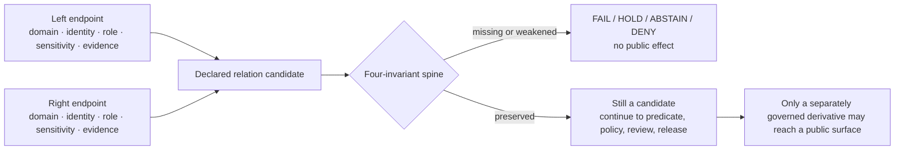

<!-- [KFM_META_BLOCK_V2]
doc_id: kfm://doc/architecture-cross-domain-cross-lane-relations
title: Cross-Lane Relations — The Four Invariants
type: architecture-standard
version: v0.2.0
status: draft; repository-grounded; four-invariant-spine; implementation-partial; seam-policy-held; non-authoritative
owners:
  - "@bartytime4life — verified CODEOWNERS review route; routing is not stewardship, independent review, or approval"
owner_status: "Cross-domain architecture, participating-domain, evidence, sensitivity, policy, release, correction, and migration stewards remain NEEDS VERIFICATION"
created: 2026-05-24
updated: 2026-08-19
policy_label: public
truth_posture: cite-or-abstain
owning_root: docs/
responsibility_root: docs/
current_path: docs/architecture/cross-domain/cross-lane-relations.md
responsibility: "Explain the durable ownership, source-role, sensitivity, and EvidenceBundle invariants for cross-domain relation candidates; reconcile those invariants with the current seam-register projection, fixture-first join assessment, inactive policy boundary, correction obligations, and public-use holds without creating relationship truth, policy, review, release, or publication authority."
authority_class: explanatory cross-domain architecture standard
authority_limit: "This page explains current repository evidence and intended anti-collapse boundaries. It does not define endpoint or relation meaning, settle contract/schema placement, activate join policy, resolve EvidenceRefs, approve a seam, authorize a lifecycle write, release a derivative, or publish a composed claim."
canonical_relationship: "CONFIRMED existing architecture companion under the accepted docs/ responsibility root; it is not the semantic-contract, schema, policy, validator, register, proof, release, or runtime authority."
supersedes:
  - "v0.1 at the same path"
superseded_by: []
evidence_snapshot:
  repository: bartytime4life/Kansas-Frontier-Matrix
  base_ref: main
  base_commit: 7293f40cc4f2bc7cc48f1956218fd6c15536f787
  target_prior_blob: 15ca8eb8c7790d2962b710097196ed9b1eea0f79
  parent_readme_blob: 3353a0a0ab5fe3f8f5fdea937b8eecfa34b81032
  directory_rules_blob: fd49a0b83e55cef52c1124281f093e263526898d
  adr_0029_blob: a4de0d7a96b78da59cfc499d1025e1508afd8dd9
  codeowners_blob: dd2a84aa514d8ecd9208bc347f90f9a2ed37dd61
  seam_register_blob: dc87ea9c2ab11cc10e51cf4e8284c030e7c9ab29
  seam_register_contract_blob: e03e6b18b0b3b287393728de2d096b1875502445
  seam_register_schema_blob: 835a78d7fa538bccc642741343e58173a58bab82
  seam_register_validator_blob: 94693fced0628eae6b363e5238d26a93d2cf39e9
  seam_register_tests_blob: 9be5f155a09fc2bf40432630c5ae2dfbea248ab7
  seam_register_workflow_blob: 628e86a2290b2f43d49af36278c3d291a0cd2e50
  join_policy_architecture_blob: 6769d5f7eed76ebc8a16b0b3a054751afff763ee
  join_assessment_contract_blob: 2d78246d66d64d69413686e460321635adfc6170
  join_assessment_schema_blob: 7fd77721e82bade0a9775fdff6a42df420ea9c71
  join_candidate_helper_blob: ffaac998f1295c6661a8de1d1dd4d076c5835e47
  join_assessment_fixture_blob: 176a869a2d9857c7fcc225682369319078cf2bb3
  join_assessment_tests_blob: 48585d4ad064d8a48fc9d270ca3beafa198b63a6
  join_assessment_workflow_blob: 22170cf546e16dd93303400a370509477a20a7f2
  join_policy_readme_blob: 98b0a4e55007786039690a54be8f19b1bb0d2aec
  policy_gate_register_blob: 10e66eb9d587797a3f12e2aaac00fb4e60ec7fa2
  policy_decision_schema_blob: 1472d26a42c73f17545b4464a275412ffa1d098e
inspection_boundary: >
  Current-session GitHub reads covered the complete prior target, the current cross-domain parent README,
  accepted ADR-0029 and adopted Directory Rules bytes, CODEOWNERS, the Cross-Domain Seam Register
  instance/contract/schema/validator/tests/workflow, the fixture-first CrossLaneJoinAssessment
  contract/schema/helper/fixtures/tests/workflow, the repository-grounded cross-lane join-policy page,
  the inactive policy/joins boundary, the empty proposed policy-gate register, the current PolicyDecision
  schema, direct-child inventory, and open-pull-request overlap. No live source, real geometry engine,
  accepted join-policy evaluator, authenticated EvidenceRef resolver, domain steward review, release packet,
  public API consumer, correction cascade, cache invalidation, deployment, or production join was exercised.
related:
  - README.md
  - source-role-anti-collapse.md
  - shared-kernel.md
  - trust-membrane.md
  - multi-domain-placement.md
  - ../cross-lane-join-policy.md
  - ../../doctrine/directory-rules.md
  - ../../adr/ADR-0029-adopt-directory-governance-standard-v2.md
  - ../../../control_plane/cross_domain_seam_register.yaml
  - ../../../contracts/governance/cross_domain_seam_register.md
  - ../../../contracts/joins/cross_lane_join_assessment.md
  - ../../../schemas/contracts/v1/joins/cross_lane_join_assessment.schema.json
  - ../../../tools/joins/join_candidates.py
  - ../../../policy/joins/README.md
  - ../../../control_plane/policy_gate_register.yaml
tags: [kfm, architecture, cross-domain, cross-lane, context-map, relation-candidate, ownership, source-role, sensitivity, evidence-bundle, policy-hold, release-hold, correction]
notes:
  - "v0.2.0 is a same-path, documentation-only reconciliation against current repository evidence."
  - "The four anti-collapse invariants remain the durable spine, but current implementation proves only a projection validator and a bounded synthetic candidate assessment—not generic join-policy enforcement or public relation truth."
  - "All five current seam-register entries remain HOLD_UNRESOLVED, prohibit public joins, and carry no seam-contract path."
  - "The current CrossLaneJoinAssessment uses profile-local uppercase source-role and sensitivity vocabularies; historical T0-T3 and lowercase examples are retained only as lineage, not represented as current machine authority."
  - "No contract, schema, policy, fixture, test, workflow, helper, register, domain record, release object, route, deployment, promotion, or publication behavior changes."
[/KFM_META_BLOCK_V2] -->

<a id="top"></a>

# Cross-Lane Relations — The Four Invariants

> **Operating rule.** A relation candidate spanning independently governed KFM domain lanes must preserve endpoint ownership, endpoint source role, the strictest applicable sensitivity, and separately resolvable EvidenceBundle support. Preserving those four invariants is necessary, but it is not sufficient to establish relationship truth, policy permission, accountable review, release approval, or public use.

[](#status-and-evidence-boundary)
[](#2-the-four-invariants)
[](#7-where-the-invariants-execute)
[](#7-where-the-invariants-execute)
[](#7-where-the-invariants-execute)
[](#status-and-evidence-boundary)

> [!IMPORTANT]
> **This page is explanatory architecture, not an active join policy.** Accepted ADR-0029 establishes the existing `docs/architecture/cross-domain/` placement model. The machine seam register is still a proposed, partial, projection-only context map; every one of its five entries is held. The fixture-first candidate helper may emit a reviewable candidate report, but no current repository evidence makes that result relation truth, a `PolicyDecision`, review approval, release approval, or public authority.

> [!CAUTION]
> **Do not collapse “four invariants pass” into “join allowed.”** Endpoint validity, relation semantics, predicate match, evidence closure, policy admissibility, reviewer authority, release state, correction readiness, and public fitness are distinct claims. The current implementation proves only the bounded checks encoded by its synthetic profile.

> [!WARNING]
> **The prior page overstated current enforcement.** The `tools/validators/cross-lane/` path is a compatibility bridge, the generic `cross-domain-joins/` lane is documentation-only, `policy/joins/` has no active evaluator or bundle, and the policy-gate register has no entries. Current executable evidence lives in the seam-register validator and the fixture-only `tools/joins/join_candidates.py` assessment.

**Quick navigation:** [Status](#status-and-evidence-boundary) · [Scope](#1-scope) · [Four invariants](#2-the-four-invariants) · [Ownership](#3-invariant-1--ownership-preserved) · [Source role](#4-invariant-2--source-role-preserved) · [Sensitivity](#5-invariant-3--sensitivity-preserved) · [Evidence](#6-invariant-4--evidencebundle-support) · [Execution](#7-where-the-invariants-execute) · [Worked seam](#8-worked-example--hydrology--hazards) · [Anti-patterns](#9-anti-patterns) · [Open decisions](#10-open-questions-and-adr-triggers) · [Related](#11-related-docs) · [Appendix](#12-appendix)

---

<a id="status-and-evidence-boundary"></a>

## Status and evidence boundary

| Surface | Verified state at `main@7293f40cc4f2bc7cc48f1956218fd6c15536f787` | Safe conclusion |
|---|---|---|
| This page | Existing v0.1 architecture page, prior blob `15ca8eb8c7790d2962b710097196ed9b1eea0f79`. | Same-path modernization; no new authority home is created. |
| Parent cross-domain lane | Repository-grounded README records nine direct files and a proposed seam-register projection. | This page is one explanatory companion inside an established docs lane. |
| Directory governance | ADR-0029 is accepted and adopts the exact bytes at `docs/doctrine/directory-rules.md`. | Existing same-path placement is confirmed; the document still has no contract, policy, or release authority. |
| Cross-Domain Seam Register | `PROPOSED`, partial, projection-only; five entries, all `HOLD_UNRESOLVED`, `public_join_allowed: false`, and `seam_contract_path: null`. | The register identifies risk and ownership boundaries; it activates no relation. |
| Seam-register validator | Executable validator, focused tests, closed schema, and read-only workflow exist. | It validates the fail-closed projection and repository bindings, not relation truth or join policy. |
| CrossLaneJoinAssessment | Proposed fixture-first contract, closed schema, deterministic helper, 19 synthetic cases, ten focused tests, and a read-only workflow. | Bounded candidate assessment exists; `ALLOW` means only `JOIN_CANDIDATE`. |
| Exact-key mechanic | Parameterized one-row-per-side in-memory SQLite. | Proves deterministic synthetic key comparison; no external database or lifecycle write. |
| Spatial-temporal mechanic | Synthetic cell-reference equality plus timezone-aware interval overlap/tolerance. | Not a geometry engine and not evidence of a real-world spatial relation. |
| Generic validator lanes | `cross-lane/` is a compatibility bridge; `cross-domain-joins/` is README-only at its inspected boundary. | Do not claim a generic executable validator from those paths. |
| Join-policy source | `policy/joins/` is documented but inactive: no Rego module, accepted bundle, selector, evaluator, or decision emitter. | No generic join-policy enforcement is established. |
| Policy-gate register | `PROPOSED`; `entries: []`. | No active generic join gate is registered. |
| PolicyDecision profile | Finite outcomes exist, but `policy_family` excludes `joins`. | A join-specific `PolicyDecision` cannot be inferred from current shape. |
| Governed public path | No complete generic join-to-review-to-release-to-public-consumer flow was established. | Public use remains held and `NEEDS VERIFICATION`. |

### Truth posture

- **CONFIRMED:** the exact files, hashes, schema fields, helper behavior, fixture counts, test assertions, workflow commands, register defaults, five held seams, and inactive policy surfaces inspected at the pinned snapshot.
- **PROPOSED:** any future accepted relation profile, join-policy bundle, seam activation, public derivative, relation-specific uncertainty composition, or stable public vocabulary beyond the current profiles.
- **UNKNOWN:** production consumers, deployed join behavior, real-source geometry and temporal behavior, complete seam coverage, correction propagation, cache invalidation, and rollback execution.
- **NEEDS VERIFICATION:** accountable stewards, pair-specific contract acceptance, authenticated EvidenceRef-to-EvidenceBundle resolution, policy evaluator binding, independent review, release integration, and exact-current-head hosted conclusions for this documentation change.
- **CONFLICTED:** `joins/`, `relations/`, `crosswalks/`, `cross_lane`, and `cross_domain` naming and placement across current repository surfaces.
- **HOLD:** every registered seam, generic join-policy activation, and every public join or derivative not separately governed.

### State separation

| State or result | What it proves | What it does not prove |
|---|---|---|
| Seam-register `PASS` | The proposed hold projection conforms to its bounded schema and validator rules. | An active seam, public join, relationship truth, or accepted policy. |
| Seam status `HOLD_UNRESOLVED` | Required decision or contract evidence is absent. | `DENY`, `ABSTAIN`, or permanent rejection of all future variants. |
| Helper `ALLOW / JOIN_CANDIDATE` | Declared synthetic predicate matched and generic fixture checks did not fail. | `OPEN`, `ANSWER`, policy allow, review approval, release, or publication. |
| Helper `ABSTAIN` | The bounded candidate helper cannot safely emit an unrestricted candidate. | A canonical runtime response or policy decision. |
| Helper `DENY` | The fixture profile blocks candidate emission for one bounded sensitivity/privacy condition. | A complete project-wide legal, rights, consent, or release determination. |
| Workflow success | The workflow's declared commands passed at the tested head. | Required-check enforcement, complete governance, production safety, or publication readiness. |

[Back to top](#top)

---

<a id="1-scope"></a>

## 1. Scope

This page defines the durable anti-collapse invariants for a **declared relationship candidate** between records owned by two or more KFM domain lanes. Examples include:

- Agriculture × Soil suitability context;
- Archaeology × Roads/Rail/Trade historic-corridor context;
- Atmosphere × Hazards condition/advisory context;
- Fauna × Hydrology aquatic-occurrence context;
- Hazards × Settlements/Infrastructure exposure context;
- other binary or n-ary relationships that receive a reviewed profile in the future.

It applies when a query, crosswalk, spatial or temporal comparison, relation contract, validator, graph projection, API payload, map layer, export, Focus Mode context, AI prompt assembly, release candidate, correction, or rollback depends on multiple independently governed domains.

### 1.1 In scope

- preserving each endpoint's domain ownership and identity;
- preserving source roles without laundering or upgrading them;
- applying the strictest endpoint sensitivity plus composition risk;
- keeping endpoint evidence and independent relationship support separately resolvable;
- preserving time, space, scale, precision, cardinality, uncertainty, rights, consent, lifecycle, review, release, correction, and public-use boundaries around the four-invariant spine;
- distinguishing a candidate assessment from a governed derivative;
- mapping current repository evidence to the intended architecture without claiming unimplemented enforcement.

### 1.2 Out of scope

This page does not:

- define either endpoint's domain semantics or canonical identity;
- define a relationship predicate or pair-specific contract;
- choose between `contracts/joins/`, `contracts/crosswalks/`, or another accepted semantic home;
- choose between `schemas/contracts/v1/joins/`, `relations/`, or domain-specific machine profiles;
- activate `policy/joins/`, accept ADR-S-14, or create a join policy family;
- resolve an EvidenceRef, build an EvidenceBundle, authenticate an actor, or verify review authority;
- write RAW, WORK, QUARANTINE, PROCESSED, CATALOG, TRIPLET, or PUBLISHED state;
- release, deploy, promote, publish, or authorize public use;
- certify the correctness of a real-world relation from a map overlay, matching key, shared geometry, name similarity, graph edge, or model output.

> [!TIP]
> **When this page binds.** Use it before a cross-domain relation can be treated as more than a local candidate. Pair-specific rules may strengthen these invariants; they must not weaken them.

[Back to top](#top)

---

<a id="2-the-four-invariants"></a>

## 2. The four invariants

The original four-part model remains useful, but each invariant needs a repository-grounded interpretation.

| # | Invariant | Current required posture | Current bounded implementation signal | Failure posture |
|---|---|---|---|---|
| **1** | **Ownership preserved** | Every endpoint retains its owning domain, object reference, and correction authority. No participant may modify another context. | Seam-register entries allocate owned concepts and require `may_modify_other_context: false`; candidate reports keep left and right endpoints separate. | Hold or fail the seam/candidate; never copy or rebind authority. |
| **2** | **Source role preserved** | Every endpoint retains its admitted source role; the derivative cannot upgrade, average, or collapse roles. | Seam defaults require `PRESERVE`; the fixture profile keeps left/right roles and emits only `CANDIDATE_RELATION`. | Abstain or route to pair review when roles conflict; never infer a stronger role. |
| **3** | **Sensitivity preserved** | Effective posture is at least the strictest input and may become stricter because the combination enables a protected inference. | Seam defaults require `MOST_RESTRICTIVE`; the helper computes the strictest profile-local sensitivity and denies/abstains on bounded risk cases. | Generalize, withhold, quarantine, abstain, or deny according to the accepted policy—never downgrade by aggregation. |
| **4** | **EvidenceBundle support** | Each endpoint and the relationship assertion need separately resolvable support appropriate to the requested use. | Seam defaults require one EvidenceBundle per participant; the fixture helper checks only presence of endpoint `evidence_ref` values and creates no bundle. | Hold or abstain until resolution and relationship support close; presence is not closure. |

> [!CAUTION]
> **All four are necessary and none is sufficient.** A composition preserving ownership, role, sensitivity, and evidence references can still be invalid because its predicate, identity, temporal scope, geometry, cardinality, uncertainty, rights, consent, policy, review, release, or correction behavior is unresolved.


```mermaid
flowchart LR
  L["Left endpoint\ndomain · identity · role · sensitivity · evidence"]
  R["Right endpoint\ndomain · identity · role · sensitivity · evidence"]
  L --> C["Declared relation candidate"]
  R --> C
  C --> I{"Four-invariant spine"}
  I -->|"missing or weakened"| N["FAIL / HOLD / ABSTAIN / DENY\nno public effect"]
  I -->|"preserved"| M["Still a candidate\ncontinue to predicate, policy, review, release"]
  M --> P["Only a separately governed derivative may reach a public surface"]
```

### 2.1 Five claims that must remain separate

| Claim | Owning evidence or decision | Current status for generic joins |
|---|---|---|
| Endpoint A is valid | Domain-owned contract, identity, source, evidence, validation, and correction lineage | Pair-dependent; not established by this page. |
| Endpoint B is valid | Domain-owned contract, identity, source, evidence, validation, and correction lineage | Pair-dependent; not established by this page. |
| The relation is meaningful and supported | Accepted relation contract plus independent relation support | `HOLD / NEEDS VERIFICATION`. |
| The operation is admissible | Accepted policy source, evaluator, context, and PolicyDecision | Inactive / unbound for generic joins. |
| The derivative is approved for a named public use | Review, release manifest, correction path, rollback target, and governed consumer | Not proven complete. |

[Back to top](#top)

---

<a id="3-invariant-1--ownership-preserved"></a>

## 3. Invariant (1) — Ownership preserved

A cross-lane relation references domain-owned endpoints; it does not transfer, merge, or duplicate their authority. Each domain remains the bounded context in which its own model and terms apply.

### 3.1 Current seam-register expression

Each registered seam declares two participants and one authority allocation per participant. The schema requires:

```text
participants: exactly two unique registered domain IDs
authority_allocations: exactly two entries
allocation.context_id: one participant
allocation.owns: one or more bounded concept identifiers
allocation.may_modify_other_context: false
```

The semantic validator also requires canonical ordering, complete allocation coverage, and no cross-context mutation overclaim.

### 3.2 Relation and endpoint identity

A future relation instance should reference rather than copy endpoints. At minimum, a governed profile needs:

- endpoint domain and object type;
- stable object reference and digest/version where required;
- relation direction or canonical ordering;
- accepted relation profile identity and hash;
- participant-specific correction and withdrawal dependencies;
- no mutation right over either endpoint.

The current `CrossLaneJoinAssessment` keeps two endpoint objects with explicit `LEFT` and `RIGHT` identities. It does not create a canonical graph edge, rewrite either endpoint, or gain identity authority. Its deterministic `candidate_id` and `assessment_id` identify the report inputs; they do not prove the relationship.

### 3.3 DDD context-map interpretation

The relevant Domain-Driven Design posture is a **Context Map** with explicit bounded contexts and a proposed Published Language or Open-host Service boundary—not a Shared Kernel that silently merges domain models. Each domain may expose a stable interface another domain can cite. The consumer does not become the owner and does not reinterpret the producer's internal model as its own.

> [!IMPORTANT]
> **Do not “pick the nearest domain” for a genuinely shared artifact.** Accepted Directory Rules route each artifact by the responsibility that owns it: architecture under `docs/`, semantics under `contracts/`, shape under `schemas/`, policy under `policy/`, validation under `tools/` and `tests/`, lifecycle objects under `data/`, and release/correction/rollback under `release/`. Cross-domain is a scope, not a new authority root.

### 3.4 Ownership failures

| Failure | Why it fails | Required posture |
|---|---|---|
| One domain copies another domain's record and edits it locally | Creates a second truth and breaks correction lineage. | Reference the owner; project only reviewed public-safe fields. |
| Relation helper assigns canonical endpoint identity | Candidate computation gains authority it does not own. | Keep identity authority false; consume accepted identity results. |
| Shared relation stored as an unreviewed domain-local fact | Other participants lose review and correction visibility. | Use the accepted responsibility-root profile and joint review routing. |
| One participant may modify the other | Violates the current seam-register invariant. | `may_modify_other_context: false`. |
| Correction to one endpoint leaves relation derivative current | Public state becomes stale or misleading. | Invalidate dependency, re-evaluate, correct, withdraw, or roll back. |

[Back to top](#top)

---

<a id="4-invariant-2--source-role-preserved"></a>

## 4. Invariant (2) — Source role preserved

Source role describes what kind of support an endpoint contributes. A relation never upgrades that contribution by proximity, matching, repetition, aggregation, or generated interpretation.

### 4.1 Current profile-local vocabulary

The current `CrossLaneJoinAssessment` schema allows exactly seven endpoint roles:

| Machine literal | Bounded meaning in the current profile | Cross-lane guardrail |
|---|---|---|
| `OBSERVED` | Direct measurement, reading, or first-hand evidentiary record under stated support. | Preserve method, time, scale, and uncertainty; association does not create a new observation. |
| `REGULATORY` | Administrative or legal designation with force in its own context. | Do not present as a measurement or observed event. |
| `MODELED` | Derived output from declared inputs, assumptions, parameters, or fitted methods. | Preserve model identity and bounds; never relabel as observed. |
| `AGGREGATE` | Summary over a unit, interval, or population with reduced record-level fidelity. | Do not infer a person, parcel, point, or single event. |
| `ADMINISTRATIVE` | Compiled registration, accounting, documentary, or management record. | Do not infer observation, legal title, residence, causation, or physical condition without support. |
| `CANDIDATE` | Unresolved record requiring evidence, validation, or review. | Never expose as released truth. |
| `SYNTHETIC` | Fixture, simulation, scenario, reconstruction, or generated representation. | Carry the reality boundary and never present as observed fact. |

These literals are **CONFIRMED only for this fixture-first profile**. They are not proof that one global KFM source-role enum has been accepted for every contract, domain, policy bundle, API, or release.

### 4.2 Current candidate output

The helper preserves both roles:

```json
{
  "left": "<LEFT_ROLE>",
  "right": "<RIGHT_ROLE>",
  "output_role": "CANDIDATE_RELATION"
}
```

It never emits an observed, regulatory, modeled, aggregate, administrative, or synthetic relationship. The output is always a candidate report.

The current generic helper abstains for mixed roles when at least one side is `MODELED`, `AGGREGATE`, or `CANDIDATE`. That is a bounded fixture rule, not a complete global compatibility matrix. Pair-specific contracts and policy may be stricter and must not silently weaken it.

### 4.3 Historical vocabulary note

The v0.1 page used lowercase examples such as `observed`, `regulatory`, and `modeled`. Treat those as human-readable lineage. Machine-facing documentation for the current fixture profile should use the exact uppercase literals above. Do not silently normalize another contract's vocabulary into this one.

### 4.4 Role-preservation examples

| Endpoints | Safe interpretation | Unsafe collapse |
|---|---|---|
| `REGULATORY × OBSERVED` | A designation and an event or measurement are related under a declared profile. | “The regulation is the event” or “the event proves the designation.” |
| `MODELED × OBSERVED` | A model may be compared with an observation after declared validation and policy review. | Model output relabeled as observation. |
| `AGGREGATE × OBSERVED` | An aggregate may contextualize an observation at compatible scale. | Aggregate value assigned to an individual record or point. |
| `ADMINISTRATIVE × OBSERVED` | Documentary context may be cited alongside physical evidence. | Administrative record treated as direct physical observation. |
| `SYNTHETIC × any` | A scenario, fixture, or reconstruction remains visibly synthetic. | Synthetic representation treated as historical or physical observation. |
| `CANDIDATE × any` | Relation remains candidate and review-bound. | Candidate promoted by association. |

> [!CAUTION]
> **A relation does not synthesize a stronger source role.** Two observations linked by a predicate remain two observations and a separately supported relation. Their association is not a third observed fact merely because the helper matched them.

[Back to top](#top)

---

<a id="5-invariant-3--sensitivity-preserved"></a>

## 5. Invariant (3) — Sensitivity preserved

Sensitivity is monotonic across composition, but “take the maximum input” is only a floor. A combination can expose a protected inference that neither endpoint exposes alone, so the derivative may require a stricter posture than either endpoint.

### 5.1 Current profile-local vocabulary

The fixture-first assessment uses:

```text
PUBLIC_SAFE < INTERNAL < RESTRICTED < PROHIBITED
```

The helper computes the strictest endpoint value. Within its bounded rules:

- living-person joins produce `DENY / LIVING_PERSON_JOIN_DENIED`;
- exact `RESTRICTED` or `PROHIBITED` geometry produces `DENY / GEOMETRY_PRECISION_BLOCKED`;
- `PROHIBITED` effective sensitivity denies;
- generalized `RESTRICTED` context produces `ABSTAIN / SENSITIVITY_REVIEW_REQUIRED`;
- no candidate outcome authorizes public use.

The seam register independently fixes `sensitivity_rule: MOST_RESTRICTIVE` and `public_join_allowed: false` for all five entries.

### 5.2 Composition-risk formula

A future governed derivative needs at least:

```text
effective sensitivity
  = strictest endpoint posture
  + relation-specific composition risk
  + requested audience and surface policy
```

The plus signs mean conservative composition, not numeric addition. A policy evaluator must account for linkage attacks, exact geometry, living-person implications, cultural or sovereign restrictions, rare-species geoprivacy, private land or title context, infrastructure exposure, and harmful temporal precision.

### 5.3 Historical tier note

The prior page presented `T0` through `T3` as though they were the current machine scale. Current repository evidence inspected here does not establish those literals as the machine vocabulary for the fixture assessment or seam register. Treat the tier model as proposal/doctrine lineage until an accepted shared sensitivity contract and policy bind it. Do not translate `PUBLIC_SAFE`, `INTERNAL`, `RESTRICTED`, or `PROHIBITED` into T-levels by assumption.

### 5.4 Aggregation, generalization, suppression, and delay

These transforms may reduce exposure, but they do not automatically lower sensitivity or authorize release. A public-safe transform needs:

- a declared transform profile and reproducible parameters;
- source and relationship evidence appropriate to the derivative;
- policy and sensitivity evaluation for the exact audience and surface;
- a transform or redaction receipt where required;
- accountable review;
- release, correction, withdrawal, and rollback support.

> [!IMPORTANT]
> **Aggregation is not a sensitivity laundromat.** County totals, generalized HUCs, centroided sites, delayed timestamps, or suppressed fields remain withheld until the derivative itself passes a governed public-safety assessment.

### 5.5 Sensitivity failures

| Failure | Example | Posture |
|---|---|---|
| Minimum rather than maximum inherited | `PUBLIC_SAFE × RESTRICTED` rendered as public | Deny or hold. |
| Composition risk ignored | Public reach geometry joined with sensitive occurrence evidence | Generalize, withhold, or deny until geoprivacy review. |
| Exact protected geometry survives | Restricted asset/site endpoint remains exact in derivative | Deny candidate emission in current profile. |
| Living-person relation treated as ordinary | Administrative person record joined to parcel or event context | Deny under current fixture rule; require accepted consent/privacy policy for any future bounded use. |
| Aggregate projected to an individual | County-level statistic attached to a person, parcel, or point | Deny inference; require independent support. |

[Back to top](#top)

---

<a id="6-invariant-4--evidencebundle-support"></a>

## 6. Invariant (4) — `EvidenceBundle` support

A consequential relation claim needs more than evidence-bearing endpoints. It needs separately resolvable endpoint support **and** evidence or reviewed authority for the relation assertion itself.

### 6.1 Three evidence questions

| Question | Required support | Current generic status |
|---|---|---|
| Is the left endpoint supported? | Left EvidenceRef resolves to the correct EvidenceBundle under current rights, sensitivity, freshness, and release state. | The fixture helper checks only non-null `evidence_ref`; it does not resolve a bundle. |
| Is the right endpoint supported? | Right EvidenceRef resolves independently under the same trust conditions. | Same limitation. |
| Is the relation supported? | Accepted relation method, profile, crosswalk, observation, spatial/temporal predicate, or reviewed assertion with its own support and uncertainty. | Not represented as independent relation evidence in the current fixture profile. |

A valid left bundle plus a valid right bundle does **not** prove that the endpoints are related.

### 6.2 Register versus helper

The seam-register defaults state:

```text
EACH_PARTICIPANT_EVIDENCE_BUNDLE_REQUIRED
EACH_PARTICIPANT_RELEASE_REQUIRED
```

That is a fail-closed governance projection. The current candidate helper carries one nullable `evidence_ref` per endpoint. Missing refs abstain, but the helper:

- does not authenticate or resolve the refs;
- does not check freshness, correction, withdrawal, or release state;
- does not create an EvidenceBundle;
- does not carry an independent relation-evidence array;
- does not create a proof, PolicyDecision, ReviewRecord, or release object.

### 6.3 Lifecycle posture

| Lifecycle or runtime point | Evidence posture |
|---|---|
| RAW / WORK | Endpoint refs or relation hypotheses may be incomplete; status remains candidate. |
| QUARANTINE | Missing, contradictory, sensitive, stale, rights-unclear, or unresolvable support is held with a reason. |
| PROCESSED | Candidate transforms may be validated, but neither endpoint nor relation is public merely because shape and local checks pass. |
| CATALOG / TRIPLET | Relation projection remains derived and must preserve source, evidence, policy, review, release, and correction references. |
| PUBLISHED | Every consequential endpoint and relation claim requires released, public-safe support and rollback/correction closure. |
| Governed request | Resolver, policy, release, correction, and audience checks are request-time responsibilities where the accepted runtime profile requires them. |

The last row is an architecture requirement, not proof that the current Governed API implements generic relation resolution.

### 6.4 Correction and withdrawal

A relation derivative must become stale, held, corrected, withdrawn, or rebuilt when:

- either endpoint is corrected, superseded, withdrawn, or newly restricted;
- an EvidenceRef no longer resolves or resolves to a different bundle;
- relation evidence is corrected or invalidated;
- the relation profile or crosswalk is superseded;
- release or rights state changes;
- public-safe transform assumptions no longer hold.

> [!TIP]
> **Evidence closure is time-dependent.** Build-time success is not permanent truth. A mature public path must bind cache invalidation and correction propagation to release and dependency changes, but that end-to-end behavior remains `NEEDS VERIFICATION` for generic joins.

[Back to top](#top)

---

<a id="7-where-the-invariants-execute"></a>

## 7. Where the invariants execute

The prior page described one unified OPA-plus-validator enforcement path. Current repository evidence is more fragmented and more limited.

### 7.1 Current execution map

| Surface | Current implementation | What it enforces | Authority limit |
|---|---|---|---|
| Seam-register schema | Closed Draft 2020-12 profile | Projection shape, held status, no-public-join fields, authority allocations, defaults. | Shape validity does not authorize a seam. |
| Seam-register validator | Executable deterministic Python validator | Registered domains, canonical identity/order, no cross-context mutation, fail-closed defaults, doctrine/register bindings, no unexpected seam root. | Validates projection and drift only. |
| Seam-register tests/workflow | Focused deterministic tests and read-only workflow | Validator behavior and repository-bound projection. | Workflow success is not policy or release approval. |
| CrossLaneJoinAssessment schema | Closed Draft 2020-12 profile | Exact fixture object shape, seven roles, four sensitivity literals, finite outcomes, all effects false. | Fixture profile only. |
| Candidate helper | Executable deterministic Python | Parameterized synthetic exact-key match, synthetic cell/time comparison, evidence-ref presence, bounded privacy/sensitivity/role/dependency checks, deterministic identity. | No real geometry, evidence resolution, policy, review, release, or public use. |
| Candidate tests/workflow | 19 synthetic cases, ten focused tests, read-only no-network workflow | Positive/negative fixture paths, tamper checks, no-network/no-write boundary. | Not generic join truth or active policy. |
| `tools/validators/cross-lane/` | README-only compatibility bridge | Navigation to the generic validator boundary. | Must not duplicate implementation. |
| `tools/validators/cross-domain-joins/` | README-only generic boundary at the inspected snapshot | Intended generic rules and routing. | No direct executable, fixtures, tests, workflow, or aggregate registration established there. |
| `policy/joins/` | Documentation-only, proposed-inactive | Intended five-check architecture and pair routing. | No evaluator, bundle, selector, or PolicyDecision emitter. |
| Policy-gate register | Proposed, empty entries list | Nothing active. | No generic join gate is registered. |
| Governed API / map / AI / export | Architecture obligations only in the inspected evidence set | Must consume only governed released derivatives. | Complete generic runtime integration is not proved. |

### 7.2 Current commands

Repository-present focused commands include:

```bash
python tools/validators/directory_governance/validate_cross_domain_seam_register.py

python -m unittest discover \
  --start-directory tests/validators/directory_governance \
  --pattern 'test_validate_cross_domain_seam_register.py' \
  --verbose

python tools/joins/join_candidates.py --fixtures

python -m pytest tests/joins/test_join_candidates.py \
  -q --strict-config --strict-markers
```

These commands are evidence of declared source/test entrypoints. They were not executed locally in this connector-only documentation update, and no result is claimed here for the current PR head until hosted or mounted-checkout evidence exists.

### 7.3 Current finite outcomes

| Producer | Outcomes | Meaning boundary |
|---|---|---|
| Seam-register validator | `PASS`, `FAIL_NEW_DRIFT`, `FAIL_INVARIANT`, `HOLD_UNRESOLVED`, `ERROR_VALIDATOR` | Projection and repository-governance validation only. |
| Candidate helper | `ALLOW`, `ABSTAIN`, `DENY`, `ERROR` | Fixture-only candidate assessment; `ALLOW` is not public permission. |
| Seam entry | `HOLD_UNRESOLVED` | Required decision/contract evidence absent. |
| PolicyDecision schema | `ANSWER`, `ABSTAIN`, `DENY`, `ERROR` | Current general policy object; no `joins` policy family exists. |

Do not translate outcomes across these families without an accepted adapter or contract. In particular:

```text
ALLOW != OPEN != ANSWER != APPROVED != RELEASED != PUBLISHED
HOLD_UNRESOLVED != DENY
validator PASS != relation truth
```

### 7.4 Current held seam projection

| Seam ID | Participants | Protected boundary | Current state |
|---|---|---|---|
| `agriculture--soil--suitability-context` | Agriculture, Soil | Soil context cannot reveal private farm/operator/parcel/yield information or become observed yield. | `HOLD_UNRESOLVED`; public join false. |
| `archaeology--roads-rail-trade--historic-corridor-context` | Archaeology, Roads/Rail/Trade | Corridor context cannot expose provenience, precise cultural locations, or become archaeological evidence. | `HOLD_UNRESOLVED`; public join false. |
| `atmosphere--hazards--condition-advisory-context` | Atmosphere, Hazards | Observation, model, forecast, event, regulation, and advisory roles remain distinct. | `HOLD_UNRESOLVED`; public join false. |
| `fauna--hydrology--aquatic-occurrence-context` | Fauna, Hydrology | Public HUC/reach context cannot disclose precise sensitive occurrence or imply an established population. | `HOLD_UNRESOLVED`; public join false. |
| `hazards--settlements-infrastructure--exposure-context` | Hazards, Settlements/Infrastructure | Exposure context cannot disclose precise critical assets or transfer asset identity authority. | `HOLD_UNRESOLVED`; public join false. |

No seam has an accepted `seam_contract_path` in the current register.

[Back to top](#top)

---

<a id="8-worked-example--hydrology--hazards"></a>

## 8. Worked example — Atmosphere × Hazards held seam

> [!NOTE]
> The explicit anchor retains the v0.1 `#8-worked-example--hydrology--hazards` fragment for inbound-link compatibility. The example now uses one currently registered seam instead of inventing an unregistered public Hydrology × Hazards release scenario.

The seam register contains `atmosphere--hazards--condition-advisory-context`. Its summary allows atmospheric observations and models to be cited by hazard products only while observations, forecasts, models, regulatory context, events, and advisories remain distinct source roles.

### 8.1 Candidate scenario

A reviewer proposes linking:

- an Atmosphere-owned forecast or observation object; and
- a Hazards-owned official advisory or event object.

The desired use is a review-only county context card. No public join is requested or authorized.

### 8.2 Invariant review

| Invariant | Required representation | Current result |
|---|---|---|
| Ownership | Atmosphere retains atmospheric-model, observation, and forecast context. Hazards retains hazard-event identity and official-advisory context. Neither may modify the other. | Register records the allocation; current seam remains held. |
| Source role | Each endpoint carries its own machine role. An advisory is not a measurement, and a modeled forecast is not an observed condition. | Register names both prohibited inferences; generic fixture helper can preserve roles but does not know this pair's complete semantics. |
| Sensitivity | Strictest endpoint posture plus composition risk applies. Public-safe inputs do not automatically clear a public hazard product. | Register prohibits public join; policy and review remain absent. |
| Evidence | Endpoint refs must resolve independently, and the advisory/condition relation needs its own support and profile. | Current seam register requires participant bundles; generic helper checks only ref presence. Closure remains unproved. |

### 8.3 Finite result

The strongest current result is:

```text
HOLD_UNRESOLVED
public_join_allowed: false
seam_contract_path: null
```

A synthetic helper could produce `ALLOW / JOIN_CANDIDATE` for matching fixture values, but that would only route a candidate to pair-specific validation and review. It would not change the held seam state.

### 8.4 What would be required to advance

At minimum:

1. a reviewed pair-specific semantic relation contract;
2. an accepted machine profile and deterministic identity rule;
3. independent endpoint and relation evidence closure;
4. accepted source-role and temporal compatibility rules;
5. active sensitivity/rights/consent policy with a bound evaluator;
6. accountable participating-domain and independent review;
7. release, correction, withdrawal, and rollback behavior for the exact derivative;
8. governed consumer tests proving advisory, forecast, model, event, and observation labels cannot collapse.

> [!IMPORTANT]
> **The map must not turn co-display into causation or equivalence.** Even after a future release, the UI would need separate endpoint labels, relation-method disclosure, temporal support, uncertainty, evidence access, and correction state.

[Back to top](#top)

---

<a id="9-anti-patterns"></a>

## 9. Anti-patterns

| Anti-pattern | Why it is unsafe | Current mitigation or hold |
|---|---|---|
| Store the relation as a fact owned by one participant | Transfers authority and breaks correction routing. | Seam allocations and no-cross-context-mutation rule. |
| Treat valid endpoints as proof of the relation | Endpoint evidence does not support the predicate. | Require independent relation profile/support; currently held. |
| Treat a matching key as identity or causation | Keys can be reused, stale, ambiguous, or semantically different. | Candidate only; pair-specific validation required. |
| Treat spatial overlap or proximity as identity | CRS, scale, tolerance, uncertainty, and semantic boundaries matter. | Current spatial-temporal helper is explicitly synthetic and not a geometry engine. |
| Collapse source roles into one output role | Launders modeled, aggregate, regulatory, administrative, candidate, or synthetic support. | Keep per-endpoint roles; output `CANDIDATE_RELATION`. |
| Compute sensitivity as the least restrictive input | Exposes protected endpoint or composition inference. | Strictest-input floor plus composition-risk review. |
| Use aggregation or generalization as automatic permission | Transform success does not clear policy or release. | Require governed transform, receipt, policy, review, and release. |
| Check only that `evidence_ref` is non-null | Presence is not authenticated resolution, freshness, consistency, or release closure. | Resolver and bundle checks remain future held dependencies. |
| Treat helper `ALLOW` as policy `ANSWER` | Collapses candidate, policy, review, and release states. | All helper effects are schema-fixed false. |
| Treat seam-register `PASS` as seam activation | Projection validity is not an accepted relation. | Every entry remains `HOLD_UNRESOLVED`. |
| Claim OPA/Conftest enforcement from documentation | No active local join evaluator or bundle was established. | Policy lane remains proposed-inactive. |
| Put executable logic under `tools/validators/cross-lane/` | Creates parallel authority beside the current compatibility bridge. | Route generic mechanics through the reviewed canonical lane/migration decision. |
| Publish a joint map without per-side labels | Visual co-display can imply equivalence or causation. | Governed UI obligations remain held until contracts/tests exist. |
| Ignore correction dependencies | Withdrawn or changed endpoint leaves stale derivative public. | Dependency invalidation, correction, withdrawal, and rollback required before graduation. |

[Back to top](#top)

---

<a id="10-open-questions-and-adr-triggers"></a>

## 10. Open questions and ADR triggers

| ID | Open item | Current status | Decision or evidence required |
|---|---|---|---|
| `CLR-01` | Is ADR-S-14 the intended generic cross-domain join-policy decision, and what exact scope would it accept? | `HOLD / NEEDS VERIFICATION` | Reviewed ADR disposition; no implied acceptance from filenames. |
| `CLR-02` | Which semantic home governs generic relations: `contracts/joins/`, `contracts/crosswalks/`, or another accepted profile? | `CONFLICTED` | Contract-authority decision and migration plan. |
| `CLR-03` | Which machine home governs generic relation shapes: `schemas/contracts/v1/joins/`, `relations/`, or pair/domain-specific profiles? | `CONFLICTED` | Schema-authority decision with compatibility tests. |
| `CLR-04` | Does the seven-role fixture vocabulary become a shared Published Language, or remain profile-local? | `PROPOSED / NEEDS VERIFICATION` | Accepted source-role contract, migration, and domain crosswalks. |
| `CLR-05` | Which sensitivity vocabulary is canonical, and how does composition risk exceed the strictest input? | `PROPOSED / NEEDS VERIFICATION` | Accepted sensitivity contract, policy, fixtures, and steward review. |
| `CLR-06` | How is independent relation evidence represented and resolved separately from endpoint evidence? | `HOLD` | Relation-evidence contract, resolver, negative fixtures, and proof binding. |
| `CLR-07` | What profile defines temporal, spatial, scale, precision, cardinality, and uncertainty compatibility? | `PROPOSED` | Pair/generic relation profile plus deterministic tests. |
| `CLR-08` | Which validator lane is canonical after resolving `cross-lane`, `cross-domain-joins`, `joins`, and pair-lane overlap? | `CONFLICTED` | Directory-governance migration or ADR; no duplicate executable authority. |
| `CLR-09` | How does an accepted join policy map into the current `PolicyDecision.policy_family` enum, which excludes `joins`? | `HOLD` | Contract/schema evolution or approved adapter; compatibility and negative tests. |
| `CLR-10` | What reviewer identities and separation-of-duties rules authorize pair-specific relation review and release? | `UNKNOWN / NEEDS VERIFICATION` | Named, verified role assignments and review records. |
| `CLR-11` | What exact correction, cache invalidation, withdrawal, and rollback cascade applies to released relations? | `PROPOSED` | Dependency graph, release contract, drill, and observable receipts. |
| `CLR-12` | Which governed API, map, search, export, graph, Focus Mode, and AI consumers may expose a released relation and under what obligations? | `HOLD` | Consumer contracts, deny/abstain tests, evidence drawer behavior, release proof, and public-safety review. |

### ADR triggers

A new or amended ADR is required when work would:

- accept or change the generic join-policy model;
- choose or migrate canonical contract, schema, validator, or policy homes;
- adopt a shared source-role or sensitivity vocabulary;
- authorize a new public join path or lifecycle effect;
- change seam activation, mutation authority, publication authority, or release semantics;
- create a parallel authority root or retire a compatibility lane;
- weaken evidence, rights, consent, sensitivity, review, correction, or rollback requirements.

[Back to top](#top)

---

<a id="11-related-docs"></a>

## 11. Related docs

| Reference | Role | Current authority or maturity |
|---|---|---|
| [`README.md`](README.md) | Parent cross-domain architecture index and current seam-register boundary. | Repository-grounded explanatory index. |
| [`../cross-lane-join-policy.md`](../cross-lane-join-policy.md) | Detailed architecture and current fixture-first implementation boundary. | Repository-grounded; implementation partial; policy inactive. |
| [`source-role-anti-collapse.md`](source-role-anti-collapse.md) | Historical source-role doctrine companion. | Draft companion; reconcile exact machine vocabularies before use. |
| [`shared-kernel.md`](shared-kernel.md) | Shared-object doctrine companion, including evidence concepts. | Draft companion; semantic contracts and schemas outrank it. |
| [`trust-membrane.md`](trust-membrane.md) | Public/internal delivery boundary. | Draft architecture companion; does not prove deployed enforcement. |
| [`multi-domain-placement.md`](multi-domain-placement.md) | Historical cross-domain placement guidance. | Proposal-era companion; accepted Directory Rules and current parent README outrank stale OPEN-DR-10 framing. |
| [`../../doctrine/directory-rules.md`](../../doctrine/directory-rules.md) | Exact Directory Rules v2 bytes adopted by ADR-0029. | Accepted through ADR-0029; internal artifact label remains part of pinned bytes. |
| [`../../adr/ADR-0029-adopt-directory-governance-standard-v2.md`](../../adr/ADR-0029-adopt-directory-governance-standard-v2.md) | Placement decision and post-adoption record. | Accepted. |
| [`../../../control_plane/cross_domain_seam_register.yaml`](../../../control_plane/cross_domain_seam_register.yaml) | Machine context-map projection for five high-risk seams. | `PROPOSED`, partial, all held. |
| [`../../../contracts/governance/cross_domain_seam_register.md`](../../../contracts/governance/cross_domain_seam_register.md) | Semantic meaning of the projection. | Draft, proposed, no-join-authority. |
| [`../../../contracts/joins/cross_lane_join_assessment.md`](../../../contracts/joins/cross_lane_join_assessment.md) | Meaning of the synthetic candidate assessment. | Proposed, fixture-first, dry-run, local-only. |
| [`../../../schemas/contracts/v1/joins/cross_lane_join_assessment.schema.json`](../../../schemas/contracts/v1/joins/cross_lane_join_assessment.schema.json) | Closed machine profile for fixture assessments. | Concrete proposed schema. |
| [`../../../tools/joins/join_candidates.py`](../../../tools/joins/join_candidates.py) | Deterministic fixture-only helper and validator. | Executable bounded implementation. |
| [`../../../policy/joins/README.md`](../../../policy/joins/README.md) | Intended join-policy source boundary and pair routing. | Proposed-inactive; no evaluator/bundle. |
| [`../../../control_plane/policy_gate_register.yaml`](../../../control_plane/policy_gate_register.yaml) | Proposed policy-gate projection. | Empty entries; no active join gate. |

[Back to top](#top)

---

<a id="12-appendix"></a>

## 12. Appendix

<details>
<summary><strong>12.1 Four-invariant review card</strong></summary>

```text
Before a cross-domain relation candidate advances, record:

1. OWNERSHIP
   - participating bounded contexts
   - object refs / versions / digests
   - authority allocation
   - correction and withdrawal owners
   - no cross-context mutation

2. SOURCE ROLE
   - exact role vocabulary and profile
   - one role per endpoint
   - no upgrade or collapse
   - output remains candidate until independently governed

3. SENSITIVITY
   - strictest endpoint posture
   - composition/inference risk
   - audience and surface
   - generalization/redaction receipt where needed
   - no public use from candidate helper

4. EVIDENCE
   - endpoint refs resolve separately
   - relationship assertion has independent support
   - freshness, rights, sensitivity, review, and release state
   - correction, withdrawal, and rollback dependencies

Then separately evaluate:
   predicate semantics · identity · time · space · scale · cardinality
   uncertainty · rights · consent · policy · review · release · public fitness
```

</details>

<details>
<summary><strong>12.2 Outcome-family crosswalk</strong></summary>

| Family | Positive-looking state | Safe interpretation |
|---|---|---|
| Seam-register validator | `PASS` | Projection conforms; seams remain held. |
| Seam entry | `HOLD_UNRESOLVED` | No reviewed activation evidence. |
| Candidate helper | `ALLOW / JOIN_CANDIDATE` | Emit a local reviewable candidate report only. |
| PolicyDecision | `ANSWER` | A finite policy outcome in one allowed family; generic join family is not present. |
| Review | Approved ReviewRecord or equivalent | Human/governed approval for declared scope only. |
| Release | Approved manifest/decision with rollback | Exact derivative is released; not every consumer or future version. |
| Publication | Governed public state | Separate from Git merge, workflow success, deployment, or documentation. |

</details>

<details>
<summary><strong>12.3 No-loss ledger from v0.1</strong></summary>

| v0.1 surface | v0.2 treatment |
|---|---|
| Same document ID, path, H1, and top anchor | Preserved. |
| Four-invariant thesis | Preserved and bounded as necessary-not-sufficient. |
| Scope across domain pairs | Preserved; current five registered seams added. |
| Ownership invariant | Preserved; mapped to authority allocations and no-mutation checks. |
| Source-role invariant | Preserved; exact current fixture literals and profile-local status added. |
| Sensitivity invariant | Preserved; strictest-input floor plus composition risk replaces unsupported T-level machine claim. |
| EvidenceBundle invariant | Preserved; endpoint-ref presence separated from authenticated resolution and relation evidence. |
| Execution section | Replaced overclaimed OPA/generic-validator assertions with current schema/validator/helper/policy evidence. |
| Hydrology × Hazards example anchor | Anchor preserved; scenario replaced with registered Atmosphere × Hazards held seam. |
| Anti-patterns | Retained and expanded against current implementation. |
| Open questions | Expanded into twelve decision/evidence items. |
| Related docs and appendix | Preserved, corrected, and enriched with current authority boundaries. |

</details>

<details>
<summary><strong>12.4 Truth-label legend</strong></summary>

- **CONFIRMED** — verified in this update from pinned repository bytes, exact schemas, code, tests, workflows, registers, or accepted decisions.
- **PROPOSED** — design, vocabulary, placement, behavior, or future state not accepted or proved operational.
- **UNKNOWN** — evidence was unavailable or insufficient.
- **NEEDS VERIFICATION** — a concrete repository, runtime, review, or operational check remains.
- **CONFLICTED** — current repository surfaces make incompatible naming, placement, or authority claims.
- **HOLD** — do not advance the named seam, policy, migration, release, or public path until the stated dependency closes.

</details>

---

**Related (mini)** · [`README.md`](README.md) · [`../cross-lane-join-policy.md`](../cross-lane-join-policy.md) · [`source-role-anti-collapse.md`](source-role-anti-collapse.md) · [`shared-kernel.md`](shared-kernel.md) · [`trust-membrane.md`](trust-membrane.md) · [`multi-domain-placement.md`](multi-domain-placement.md)

**Last updated:** 2026-08-19 · **Doc version:** v0.2.0 · **Doc status:** repository-grounded draft · **Path:** existing same-path `docs/architecture/cross-domain/cross-lane-relations.md`

[Back to top](#top)
