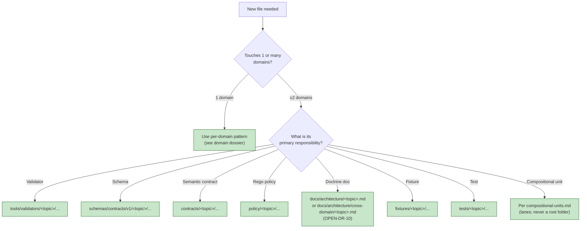

<!-- [KFM_META_BLOCK_V2]
doc_id: kfm://doc/architecture-cross-domain-multi-domain-placement
title: Multi-Domain File Placement
type: standard
version: v0.1
status: draft
owners: <ARCHITECTURE-DOCTRINE-OWNER> · NEEDS VERIFICATION
created: 2026-05-24
updated: 2026-05-24
policy_label: public
related:
  - README.md
  - cross-lane-relations.md
  - compositional-units.md
  - responsibility-layers.md
  - directory-rules.md#12
  - directory-rules.md#multi-domain-and-cross-cutting-files
  - kfm_unified_doctrine_synthesis.md#10
tags: [kfm, architecture, cross-domain, placement, doctrine]
notes:
  - PROPOSED placement; folder vs §12 flat-file pattern is OPEN-DR-10.
  - Canonical authority is directory-rules.md §12 (Domain Placement Law).
[/KFM_META_BLOCK_V2] -->

<a id="top"></a>

# Multi-Domain File Placement

> *Where shared validators, schemas, contracts, policy, fixtures, tests, and doctrine docs go when a file legitimately spans two or more domains. Picking a single domain as the owner is the failure mode the rule prevents.*


-blue)


**Status:** draft · **Owners:** `<ARCHITECTURE-DOCTRINE-OWNER>` *(NEEDS VERIFICATION)* · **Last updated:** 2026-05-24

> [!IMPORTANT]
> **Domain Placement Law *(`directory-rules.md` §12, CONFIRMED)*.** When a file's responsibility legitimately spans two or more domains, place it under the **lowest common responsibility root** that owns the file's responsibility, **without** a domain segment. Picking one of the domains as the owner creates a parallel authority that other domains then have to crosswalk to.

> [!NOTE]
> **Responsibility roots are canonical.** The roots — `contracts/`, `schemas/`, `policy/`, `fixtures/`, `tools/`, `tests/`, `apps/`, `data/`, `release/`, `docs/` — already exist and already own their lifecycle. Cross-domain files use a non-domain segment **inside** one of those roots; they do not create new roots.

---

## Table of contents

1. [Scope](#1-scope)
2. [The placement table](#2-the-placement-table)
3. [Lowest common responsibility root — the rule](#3-lowest-common-responsibility-root--the-rule)
4. [Decision flow for a new cross-domain file](#4-decision-flow-for-a-new-crossdomain-file)
5. [Worked examples](#5-worked-examples)
6. [What "without a domain segment" means in practice](#6-what-without-a-domain-segment-means-in-practice)
7. [Anti-patterns](#7-anti-patterns)
8. [Open questions and ADR triggers](#8-open-questions-and-adr-triggers)
9. [Related docs](#9-related-docs)
10. [Appendix](#10-appendix)

---

## 1. Scope

This doc translates `directory-rules.md` §12 into actionable placement guidance for contributors building cross-domain artifacts: validators, schemas, semantic contracts, Rego policy, fixtures, tests, and doctrine docs.

> [!TIP]
> **When this doc binds.** Any time you are about to create a new file and your work touches more than one domain. If your file lives entirely within a single domain's responsibility, the per-domain placement rules apply *(see the relevant domain dossier)*.

[↑ Back to top](#top)

---

## 2. The placement table

> **Evidence basis:** `directory-rules.md` §12 *(Domain Placement Law — "Multi-domain and cross-cutting files", CONFIRMED)*.

| Cross-domain file kind | Place under | Do **not** place under |
|---|---|---|
| Shared validator | `tools/validators/<topic>/...` | `tools/validators/domains/<picked-one>/...` |
| Cross-domain schema | `schemas/contracts/v1/<topic>/...` | `schemas/contracts/v1/domains/<picked-one>/...` |
| Cross-domain semantic contract | `contracts/<topic>/...` | `contracts/domains/<picked-one>/...` |
| Cross-domain Rego policy | `policy/<topic>/...` | `policy/domains/<picked-one>/...` |
| Cross-domain doctrine *(this folder's purpose)* | `docs/architecture/<topic>.md` or `docs/architecture/cross-domain/<topic>.md` *(pending OPEN-DR-10)* | `docs/domains/<picked-one>/<topic>.md` |
| Cross-domain fixture *(rare; usually domain-owned)* | `fixtures/<topic>/...` | `fixtures/domains/<picked-one>/...` |
| Cross-domain tests | `tests/<topic>/...` | `tests/domains/<picked-one>/...` |
| Cross-cutting compositional unit *(Focus Mode, Frontier Matrix, scene)* | Per `compositional-units.md` — lanes inside canonical roots, never a root folder | `<unit>/` at repo root |

> [!IMPORTANT]
> **Same rule, different roots.** Every responsibility root has the same exception structure: domain-segment for single-domain files, topic-segment for cross-domain files.

[↑ Back to top](#top)

---

## 3. Lowest common responsibility root — the rule

The rule is **lowest common**: find the shallowest responsibility root whose lifecycle owns the file, and place the file inside that root under a non-domain `<topic>` segment.

| Step | Action |
|---|---|
| **1. Identify the file's primary responsibility** | Is it a validator? A schema? A contract? A policy rule? The answer names the root. |
| **2. Confirm the file spans ≥2 domains** | If it touches one domain only, the cross-domain rule does not apply. |
| **3. Choose a stable `<topic>` segment** | Use a name that describes the cross-domain concern, not one of the domain names *(e.g., `vegetation-stress/`, not `agriculture/`)*. |
| **4. Place the file inside `<root>/<topic>/...`** | Mirror the within-domain pattern, swapping the domain segment for the topic segment. |
| **5. Cross-link from the relevant domain dossiers** | Each touched domain's dossier links to the cross-domain artifact; the artifact does not duplicate domain doctrine. |

> [!CAUTION]
> **Reach for the lowest root, not the most convenient one.** If a file is genuinely a *contract*, putting its Rego in `policy/` and its schema in `schemas/` is the right shape — splitting it across roots is the **point** of the rule, not a violation of it.

[↑ Back to top](#top)

---

## 4. Decision flow for a new cross-domain file



[↑ Back to top](#top)

---

## 5. Worked examples

### 5.1 A habitat × fauna × hydrology validator

A validator that checks suitability assertions linking habitat polygons, species occurrences, and hydrology features.

| Step | Choice |
|---|---|
| Spans | Habitat, Fauna, Hydrology *(3 domains)* |
| Responsibility | Validator |
| Topic | `suitability-cross-lane` *(PROPOSED name; reviewer should confirm)* |
| Placement | `tools/validators/suitability-cross-lane/suitability_join.py` |
| Cross-links | Each domain dossier under "F. Cross-lane relations" links here. |
| Not | `tools/validators/domains/habitat/` *(picks one of three)*; `tools/cross-suitability/` *(new root)*. |

### 5.2 A regulatory-vs-observed schema for hydrology × hazards

A schema for relation tuples that pair NFHL regulatory polygons with observed flood-event records.

| Step | Choice |
|---|---|
| Spans | Hydrology, Hazards |
| Responsibility | Schema |
| Topic | `regulatory-vs-observed` |
| Placement | `schemas/contracts/v1/regulatory-vs-observed/flood-event.schema.json` |
| Not | `schemas/contracts/v1/domains/hydrology/` *(picks one)*. |

### 5.3 A cross-domain doctrine doc on source-role anti-collapse

Already done — this folder is the example. Resolves under OPEN-DR-10.

### 5.4 A Focus Mode (compositional unit)

A "Larned Region, Pawnee/Edwards counties, hydrology + agriculture + settlements" Focus Mode.

| Step | Choice |
|---|---|
| Spans | 3 domains × geographic scope × UI shell × release |
| Responsibility | Compositional unit |
| Topic | `larned-region-tri-domain` *(PROPOSED name)* |
| Placement | Per `compositional-units.md` §3 — lanes inside canonical roots; `docs/focus-modes/larned-region-tri-domain/` dossier; cross-root lanes in `contracts/focus-modes/larned-region-tri-domain/`, etc. |
| Not | `focus_modes/larned/` *(root folder)*. |

[↑ Back to top](#top)

---

## 6. What "without a domain segment" means in practice

`directory-rules.md` §12 expects each canonical root to have a `domains/<domain>/` segment for single-domain files. For cross-domain files, the **`domains/` segment is omitted**; the path is `<root>/<topic>/...`.

```text
✅ tools/validators/suitability-cross-lane/...        (cross-domain)
✅ tools/validators/domains/hydrology/...             (single-domain)

❌ tools/validators/domains/hydrology/suitability/... (wrong — multi-domain file under a domain)
❌ tools/validators/cross/hydrology/suitability/...   (wrong — new root segment under tools/validators/)
❌ cross_validators/suitability/...                   (wrong — new root folder)
```

> [!IMPORTANT]
> **The `<topic>` segment is stable, descriptive, and cross-referenced.** It is not a temporary placeholder. Renames are ADR-class because they break links in every domain dossier that references them.

[↑ Back to top](#top)

---

## 7. Anti-patterns

| Anti-pattern | Why it breaks the trust path | Mitigation |
|---|---|---|
| **Picking a domain as the owner of a cross-domain file** | Other domains crosswalk through the picked one; ownership is implicit and wrong. | Place under `<root>/<topic>/...`. |
| **Creating a new root for a cross-domain concern** | Competes with responsibility roots; root-stays-boring violation. | Use existing root; new segment under it. |
| **Renaming `<topic>` without ADR** | Breaks links in every domain dossier that references it. | ADR required per `ai-build-operating-contract.md` §28. |
| **Splitting a cross-domain artifact across roots without cross-linking** | Readers cannot find related pieces. | Each piece links to the others; the doctrine doc *(if present)* indexes them. |
| **Duplicating cross-domain content inside a domain dossier** | Two sources of truth; drift inevitable. | Domain dossier links to the cross-domain artifact; doesn't repeat it. |

[↑ Back to top](#top)

---

## 8. Open questions and ADR triggers

| Open item | Class | Suggested ADR title |
|---|---|---|
| **OPEN-DR-10** — `docs/architecture/cross-domain/` *(folder)* vs `docs/architecture/cross-domain.md` *(flat file)*. | Directory Rules | "Cross-domain architecture lane — folder vs flat file". |
| Naming convention for `<topic>` segments — kebab-case, length cap, vocabulary registry? | Convention | "Cross-domain topic naming". |
| Should every cross-domain `<topic>` segment have a backing doctrine doc, or only when ≥3 domains? | Process | "Doctrine-doc trigger for cross-domain topics". |
| Cross-domain test layout — `tests/<topic>/` only, or also `tests/cross/<topic>/` parallel namespace? | Layout | "Cross-domain test path". |

[↑ Back to top](#top)

---

## 9. Related docs

| Reference | Role | Truth label |
|---|---|---|
| `README.md` *(this folder)* §10 | Landing summary | CONFIRMED doctrine |
| `cross-lane-relations.md` *(sibling)* | The four invariants that cross-domain artifacts implement | CONFIRMED doctrine |
| `compositional-units.md` *(sibling)* | Placement for Focus Modes / Frontier Matrix / scenes | CONFIRMED doctrine |
| `responsibility-layers.md` *(sibling)* | Eight responsibility layers orthogonal to domain placement | CONFIRMED doctrine |
| `directory-rules.md` §12 | Domain Placement Law — canonical | CONFIRMED doctrine |
| `kfm_unified_doctrine_synthesis.md` §10 | Core object families *(every cross-domain artifact uses these)* | CONFIRMED doctrine |
| `ai-build-operating-contract.md` §28 | ADR requirements | CONFIRMED doctrine |

[↑ Back to top](#top)

---

## 10. Appendix

<details>
<summary><strong>10.1 Placement — at-a-glance</strong></summary>

```text
File kind                Place under                                 Not under
───────────────────────  ──────────────────────────────────────────  ─────────────────────────────
validator                tools/validators/<topic>/...                tools/validators/domains/<one>/...
schema                   schemas/contracts/v1/<topic>/...            schemas/contracts/v1/domains/<one>/...
semantic contract        contracts/<topic>/...                       contracts/domains/<one>/...
Rego policy              policy/<topic>/...                          policy/domains/<one>/...
doctrine doc             docs/architecture/<topic>.md  -OR-          docs/domains/<one>/<topic>.md
                         docs/architecture/cross-domain/<topic>.md
                         (OPEN-DR-10)
fixture                  fixtures/<topic>/...                        fixtures/domains/<one>/...
test                     tests/<topic>/...                           tests/domains/<one>/...
compositional unit       lanes inside canonical roots                <unit>/ at repo root
                         (per compositional-units.md)
```

</details>

<details>
<summary><strong>10.2 Truth-label legend</strong></summary>

- **CONFIRMED** — verified this session from attached docs.
- **PROPOSED** — design / placement / inference not yet verified in implementation.
- **INFERRED** — derivable from confirmed evidence but not directly stated.
- **NEEDS VERIFICATION** — checkable, but not yet checked strongly enough to act as fact.

</details>

---

**Related (mini)** · [`README.md`](README.md) · [`cross-lane-relations.md`](cross-lane-relations.md) · [`compositional-units.md`](compositional-units.md) · [`responsibility-layers.md`](responsibility-layers.md) · [`directory-rules.md` §12](../../../directory-rules.md)

**Last updated:** 2026-05-24 · **Doc version:** v0.1 · **Doc status:** draft · **Path status:** PROPOSED *(OPEN-DR-10)*

[↑ Back to top](#top)
