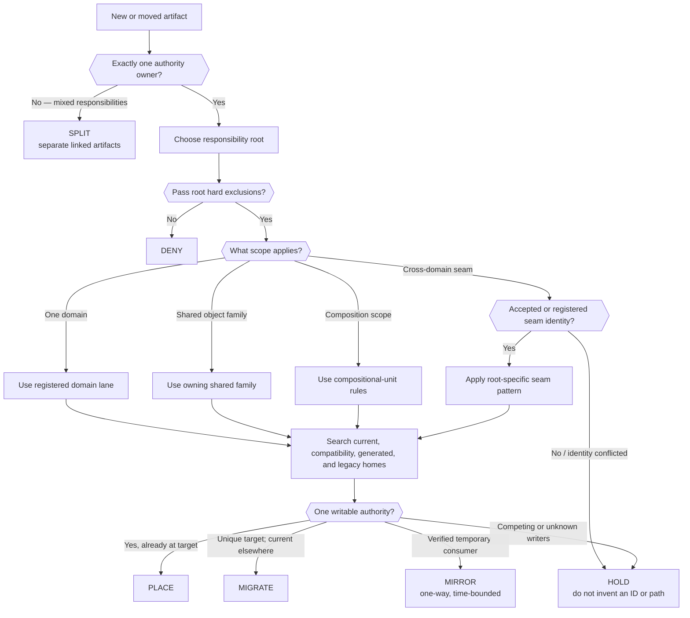

<!-- [KFM_META_BLOCK_V2]
doc_id: kfm://doc/architecture-cross-domain-multi-domain-placement
title: Multi-Domain File Placement
type: architecture; placement reference; cross-domain seam guidance
version: v0.2.0
prior_version: v0.1
status: draft; repository-grounded; explanatory; accepted-placement-aware; non-authoritative; non-publisher
owners:
  - "@bartytime4life - verified CODEOWNERS review route; routing is not stewardship, independent review, or approval"
owner_status: "Architecture, directory-governance, affected-root, seam, identity, compatibility, migration, evidence, policy, release, and independent-review stewardship remain NEEDS VERIFICATION"
created: 2026-05-24
updated: 2026-08-20
policy_label: public; architecture; cross-domain; placement; cite-or-abstain; non-release; non-publication
truth_posture: cite-or-abstain
owning_root: docs/
responsibility_root: docs/
responsibility: "Explain how cross-domain artifacts are classified, split, and routed through accepted KFM responsibility roots without becoming contract, schema, policy, registry, migration, release, or publication authority."
current_path: docs/architecture/cross-domain/multi-domain-placement.md
canonical_relationship: "same-path architecture reference; no sibling authority or new root created"
evidence_snapshot:
  repository: bartytime4life/Kansas-Frontier-Matrix
  visibility: public
  base_ref: main
  base_commit: 3eb81c41f425d2fbe2c16a46fe0444b1a9173691
  target_prior_blob: 12ba496e89b1a2bb5e1009080e4d611c7fb369d0
  directory_rules_v2_blob: fd49a0b83e55cef52c1124281f093e263526898d
  directory_rules_v2_sha256: sha256:44f7e94344cb42b630008eb0bc03a13fcb97dbdfba6f3e56579693a272571e6e
  adr_0029_blob: a4de0d7a96b78da59cfc499d1025e1508afd8dd9
  root_registry_blob: 024f668b5f0a9239bafa4f8b09e2afd86300ff8c
  domain_lane_register_blob: 1bfc6f91cfa713a5e3d51ece011b63b46310734f
  cross_domain_seam_register_blob: dc87ea9c2ab11cc10e51cf4e8284c030e7c9ab29
  codeowners_blob: dd2a84aa514d8ecd9208bc347f90f9a2ed37dd61
inspection_boundary: >-
  Current-session GitHub reads covered the complete prior target, accepted ADR-0029,
  adopted Directory Rules v2, Root Registry, Cross-Domain Seam Register, CODEOWNERS,
  the cross-domain architecture index and modernized sibling pages, current cross-domain
  contract/validator/test directories, representative pair-profile contracts, the generic
  cross-domain-join validator boundary, the cross-lane pipeline compatibility boundary,
  generated-receipt schema/validator, open pull requests for the exact target, and current
  main. No deployed API, live source, production join, policy evaluator, public client,
  release packet, correction cascade, cache invalidation, or rollback execution was exercised.
related:
  - README.md
  - cross-lane-relations.md
  - compositional-units.md
  - responsibility-layers.md
  - source-role-anti-collapse.md
  - trust-membrane.md
  - ../../doctrine/directory-rules.md
  - ../../adr/ADR-0029-adopt-directory-governance-standard-v2.md
  - ../../../control_plane/root_registry.yaml
  - ../../../control_plane/domain_lane_register.yaml
  - ../../../control_plane/cross_domain_seam_register.yaml
  - ../../../contracts/cross_domain/README.md
  - ../../../tests/cross_domain/README.md
tags: [kfm, architecture, cross-domain, placement, responsibility-root, seam-id, migration, compatibility, governance]
notes:
  - "v0.2.0 is a same-path repository-grounded modernization. It changes documentation and its required generated authoring receipt only."
  - "Accepted ADR-0029 adopts the exact Directory Rules v2 bytes at docs/doctrine/directory-rules.md; the pinned artifact's internal PROPOSED_FOR_ADOPTION label remains part of those accepted bytes."
  - "Directory Rules v2 section 12.5 resolves the former OPEN-DR-10 folder-versus-flat question for shared cross-domain architecture explanations."
  - "Current cross-domain implementation naming remains mixed across cross_domain, cross_lane, joins, crosswalks, and hyphenated documentation paths. Presence is evidence, not automatic canon or migration authority."
  - "No seam is activated, no join is authorized, and no source, lifecycle, policy, release, deployment, publication, or repository-setting state is changed."
[/KFM_META_BLOCK_V2] -->

<a id="top"></a>

# Multi-Domain File Placement

How to route a genuinely cross-domain artifact by **one authority owner**, the
**responsibility root** that owns it, and—only when applicable—a registered
**cross-domain seam identity**.

[](#status-and-evidence-boundary)
[](../../adr/ADR-0029-adopt-directory-governance-standard-v2.md)
[](#3-lowest-common-responsibility-root--the-rule)
[](#current-seam-register-boundary)
[](#truth-posture)
[](#authority-boundary)

> [!IMPORTANT]
> **Placement follows authority, not topic overlap.** First identify the one
> responsibility allowed to define or mutate an artifact. Then choose the root
> that owns that responsibility. Add domain, source, geography, object-family,
> or seam scope only after the root is fixed. If one proposed file contains
> independently editable authorities, the correct result is `SPLIT`, not a
> convenient shared folder.

> [!CAUTION]
> **A correct path does not grant truth or permission.** A path, seam-register
> entry, schema-valid payload, validator pass, workflow success, receipt, pull
> request, or merge does not activate a source, establish a relationship,
> resolve evidence, approve policy, complete review, release a carrier, or
> publish a KFM claim.

## Navigation

| Read | Use it for |
|---|---|
| [Status and evidence boundary](#status-and-evidence-boundary) | Current authority, repository evidence, and limitations. |
| [1. Scope](#1-scope) | Decide whether this placement reference applies. |
| [2. Placement table](#2-the-placement-table) | Route each artifact family to the responsibility that owns it. |
| [3. Placement rule](#3-lowest-common-responsibility-root--the-rule) | Apply the responsibility signature and finite outcomes. |
| [4. Decision flow](#4-decision-flow-for-a-new-crossdomain-file) | Use the root-first, scope-second placement sequence. |
| [5. Worked examples](#5-worked-examples) | See `PLACE`, `SPLIT`, and `HOLD` on current repository patterns. |
| [6. Domain-segment meaning](#6-what-without-a-domain-segment-means-in-practice) | Distinguish a seam lane from an arbitrarily selected domain. |
| [7. Anti-patterns](#7-anti-patterns) | Avoid parallel authority and unsafe migration. |
| [8. Decisions](#8-open-questions-and-adr-triggers) | See the closed historical question and remaining governance work. |
| [9. Related docs](#9-related-docs) | Follow owning doctrine, registers, and sibling boundaries. |
| [10. Appendix](#10-appendix) | Use the quick reference, reviewer checklist, and history. |

---

<a id="status-and-evidence-boundary"></a>

## Status and evidence boundary

This page is a repository-grounded architecture explanation. It is not Directory
Rules, an ADR, a semantic contract, a machine schema, a policy rule, a path
registry, a migration record, a review record, or release authority.

| Surface | Verified state at `main@3eb81c41f425d2fbe2c16a46fe0444b1a9173691` | Safe interpretation |
|---|---|---|
| This page | Existing same-path v0.1 file; prior blob `12ba496e89b1a2bb5e1009080e4d611c7fb369d0` | Same-path modernization under `docs/`; no structural migration. |
| Directory Rules authority | [ADR-0029](../../adr/ADR-0029-adopt-directory-governance-standard-v2.md) is accepted and adopts the exact bytes at [`docs/doctrine/directory-rules.md`](../../doctrine/directory-rules.md) | Section 12.5 controls cross-domain placement examples; the doctrine file's embedded proposal label does not undo the accepted decision. |
| Root projection | [`root_registry.yaml`](../../../control_plane/root_registry.yaml) is `ACTIVE` but explicitly `machine_projection_only` | Supports validation and navigation; cannot independently create or amend authority. |
| Domain projection | [`domain_lane_register.yaml`](../../../control_plane/domain_lane_register.yaml) exists as a machine projection | Domain registration and aliases remain separate from this page. |
| Seam projection | [`cross_domain_seam_register.yaml`](../../../control_plane/cross_domain_seam_register.yaml) is `PROPOSED`, partial, and review/navigation-only | Every registered seam remains held; register presence is not join or publication authority. |
| Current semantic lanes | [`contracts/cross_domain/`](../../../contracts/cross_domain/README.md) contains a README, `knowledge_character.md`, and bounded pair-profile directories | Presence proves tracked implementation surfaces, not accepted global seam identity or public readiness. |
| Current validator lanes | `tools/validators/cross_domain/` contains bounded pair-profile validators; `tools/validators/cross-domain-joins/` and `tools/validators/cross-lane/` remain separate documented boundaries | Naming and responsibility convergence remain incomplete; no opportunistic rename is authorized. |
| Current tests | [`tests/cross_domain/`](../../../tests/cross_domain/README.md) contains pair-profile directories and other cross-domain tests | Test presence proves only declared assertions at the exact executed revision. |
| Current pipeline compatibility | [`pipelines/cross_lane/`](../../../pipelines/cross_lane/README.md) is documented as placement-conflicted and bounded | It is not proof of a canonical generic seam framework. |
| Review routing | [`.github/CODEOWNERS`](../../../.github/CODEOWNERS) routes repository review to `@bartytime4life` | Routing is not accepted stewardship, independent review, policy approval, or release authority. |
| Exact-target overlap | No open pull request for `multi-domain-placement.md` was found before authoring | Does not rule out unpushed work or external consumers. |

<a id="truth-posture"></a>

### Truth posture

- **CONFIRMED:** current tracked paths and blobs inspected for this revision,
  accepted ADR-0029, the adopted Directory Rules bytes, current machine
  projection statuses, the five held seam entries, and the bounded pair-profile
  directories named here.
- **PROPOSED:** future canonical seam profiles, path aliases, complete seam
  inventory, exact schema/policy/fixture family placement, and any migration not
  already accepted and executed.
- **UNKNOWN:** deployed join behavior, production consumers, public release
  state, external path consumers, correction propagation, and rollback
  execution.
- **NEEDS VERIFICATION:** accountable stewards, accepted seam identities,
  complete producer/consumer inventories, alias mappings, required-check
  coupling, and the exact governance needed for each future migration.
- **CONFLICTED:** current naming and placement across `cross_domain`,
  `cross_lane`, `joins`, `crosswalks`, and hyphenated human-document paths.
- **HOLD:** any new public join, any migration without consumer closure, and any
  path whose authority owner or registered identity is unresolved.

<a id="authority-boundary"></a>

### Authority boundary

| This page may | This page may not |
|---|---|
| Explain the accepted placement protocol | Amend Directory Rules or accept an ADR |
| Classify an artifact's primary responsibility | Define contract, schema, policy, or register fields |
| Distinguish current implementation from canonical authority | Declare a current path canonical merely because it exists |
| Recommend `PLACE`, `SPLIT`, `MIGRATE`, `MIRROR`, `HOLD`, or `DENY` | Execute a migration or create an alias |
| Expose conflicts, prerequisites, validation, and rollback | Activate a seam, source, policy gate, public route, release, or publication |

[Back to top](#top)

---

<a id="1-scope"></a>

## 1. Scope

Use this reference when one proposed artifact, relation profile, composition, or
implementation surface touches two or more independently governed KFM domain
contexts and its placement is not already settled by a more specific accepted
contract, root README, ADR, or migration record.

A file is not automatically cross-domain merely because several domains consume
it. Classify the actual responsibility first.

| Situation | Classification | Placement consequence |
|---|---|---|
| One domain owns the meaning; several domains consume a released result | Single-domain artifact with cross-domain consumers | Keep the artifact in the owning domain lane and reference it; do not create a shared copy. |
| A shared object family such as `EvidenceRef` applies everywhere | Shared kernel/object-family authority | Define once under its owning contract/schema/policy roots; domain projections reference it. |
| A relation itself spans two or more bounded contexts | Cross-domain seam | Use a registered seam identity after the responsibility root is fixed. |
| Focus Mode, Frontier Matrix, or Planetary/3D composes several outputs | Cross-cutting compositional unit | Follow [compositional-units.md](compositional-units.md); it is not a domain or repository root. |
| One source feeds several domains | Source-first capture and connector | Keep source identity/capture source-first; downstream domain projections reference it. |
| One requested file contains contract meaning, schema shape, policy, and executable code | Mixed authority packet | Return `SPLIT`; create linked artifacts under their owning roots. |
| A reusable library serves several apps or domains | Shared implementation | Route by execution role to `packages/`, not to a cross-domain doctrine lane. |

> [!TIP]
> Ask: **who is allowed to change the meaning of this artifact?** That answer
> should be singular. If the answer is two independent authorities, split the
> artifact before choosing any path.

### Non-effects

This reference does not:

- register a domain, source, geography, scope, seam, alias, object family, or
  owner;
- create a generic cross-domain store, service, policy, pipeline, or relation
  graph;
- authorize a join because two objects share a key, name, geometry, time range,
  or plausible narrative;
- treat a candidate, test, map, graph edge, tile, index, scene, dashboard, or AI
  answer as sovereign truth;
- change lifecycle state from `RAW -> WORK / QUARANTINE -> PROCESSED ->
  CATALOG / TRIPLETS -> PUBLISHED`;
- make a public client eligible to read canonical or internal stores.

[Back to top](#top)

---

<a id="2-the-placement-table"></a>

## 2. The placement table

Accepted Directory Rules v2 section 12.5 gives four explicit cross-domain seam
examples. These are the controlling placement patterns for the responsibilities
they name.

### 2.1 Accepted section 12.5 seam routes

| Artifact responsibility | Accepted placement model | Boundary |
|---|---|---|
| Shared human architecture explanation | `docs/architecture/cross-domain/<seam_id>.md` | Explains the seam; does not define contract fields or authorize use. |
| Cross-domain semantic contract | `contracts/cross_domain/<seam_id>/` | Defines meaning; does not validate shape, decide policy, or release a result. |
| Cross-domain executable test | `tests/cross_domain/<seam_id>/` | Proves declared assertions only. |
| Shared repository validator | `tools/validators/cross_domain/<seam_id>/` | Checks a bounded profile; cannot establish relation truth, review, release, or publication. |

The current lane-level files—this page, the directory README, and sibling
standards—remain at their existing documentation paths. A per-seam explanation
uses the `<seam_id>.md` pattern after the seam identity is accepted or otherwise
governed for that use.

### 2.2 Other responsibility roots

Section 12.5 does not collapse every object family into the four paths above.
Other artifacts still follow their own root contracts.

| Artifact responsibility | Owning root and routing rule | What remains to verify |
|---|---|---|
| Machine-checkable shape | `schemas/`; default shared profile under `schemas/contracts/v1/<owning_family>/...` | Exact seam/family segment, version, references, and compatibility profile. |
| Normative allow/deny/hold/restrict/abstain rule | `policy/`; organize by the policy family that owns the decision | Whether a cross-domain policy family is accepted, active, and bound to a decision emitter. |
| Reusable synthetic fixture | `fixtures/`; use the accepted contract/test family | Exact family path, public-safe synthetic posture, and expected-output authority. |
| Pipeline implementation | `pipelines/`; stage-first under `pipelines/<stage>/...` | Whether a shared lane is accepted; current `pipelines/cross_lane/` remains conflicted. |
| Declarative run graph | `pipeline_specs/` | The accepted run identity, producer/consumer contract, and lifecycle effects. |
| Reusable implementation | `packages/` | Public interface, dependency direction, and whether the logic is truly reusable. |
| Deployable service or user surface | `apps/` | Governed ingress, trust membrane, authentication, policy, and release dependencies. |
| Data or relation instance | The owning `data/` lifecycle, projection, registry, receipt, or proof lane | Lifecycle state, mutability, rights, sensitivity, and whether a graph projection is warranted. |
| Release, correction, withdrawal, or rollback decision | `release/<object_family>/...` | Accepted object family, review authority, published carrier, and rollback target. |
| Migration or alias mapping | `migrations/` plus the applicable governance projection/record | Producer/consumer inventory, one-writer rule, cutover, deprecation, and rollback. |

> [!IMPORTANT]
> **Root-first does not mean “put everything under `cross_domain/`.”** The
> cross-domain segment is appropriate only where the accepted root profile says
> it is. A schema remains a schema, a policy remains policy, a pipeline remains a
> pipeline, and a release decision remains a release decision.

### 2.3 Current repository topology is evidence, not automatic canon

| Current surface | Bounded current role | Placement posture |
|---|---|---|
| `contracts/cross_domain/` | Tracked cross-domain semantic profiles and README | Consistent with the accepted contract route; exact IDs and complete inventory still require governance. |
| `tools/validators/cross_domain/` | Bounded pair-profile validators | Consistent with the accepted validator route for those tracked profiles. |
| `tests/cross_domain/` | Pair-profile and other cross-domain tests | Consistent with the accepted test route, but current contents do not prove complete seam coverage. |
| `schemas/contracts/v1/joins/` and `schemas/contracts/v1/relations/` | Existing machine-shape families | Overlapping family authority remains a compatibility/decision issue. |
| `tools/validators/cross-domain-joins/` | README-defined generic boundary | Hyphenated compatibility/documentation surface; direct executable remains unestablished there. |
| `tools/validators/cross-lane/` | Compatibility bridge | Must not become a second writer for validator logic. |
| `pipelines/cross_lane/` | Bounded compatibility and child-admission documentation | Not established as the canonical generic shared pipeline lane. |
| `contracts/crosswalks/` | Existing semantic family | Crosswalk meaning may be distinct from a seam relation; do not merge by name alone. |

[Back to top](#top)

---

<a id="3-lowest-common-responsibility-root--the-rule"></a>

## 3. Lowest common responsibility root — the rule

The former phrase **lowest common responsibility root** remains useful only when
read precisely:

> Choose the **one responsibility root** whose authority includes the artifact
> after hard exclusions. It is not the shallowest directory shared by every
> participant, and it is not permission to co-locate several object families.

If the artifact carries more than one independently mutable authority, return
`SPLIT`. If a unique target exists but the current file lives elsewhere, return
`MIGRATE`. If authority, identity, or compatibility remains unresolved, return
`HOLD`.

### 3.1 Responsibility signature

Before proposing a path, record:

| Axis | Required question |
|---|---|
| `artifact_kind` | Human document, semantic contract, schema, policy, executable code, test, fixture, data instance, release decision, migration, or generated output? |
| `authority_owner` | Which responsibility may define or mutate it? Exactly one is required. |
| `lifecycle_stage` | Not applicable, pre-RAW, RAW, WORK, QUARANTINE, PROCESSED, CATALOG, TRIPLETS, PUBLISHED, receipt, proof, or registry? |
| `execution_role` | None, deployable, reusable library, connector, pipeline, spec, validator/tool, thin script, runtime adapter, or infrastructure? |
| `scope_kind` | Global, domain, source, geography/composition scope, cross-domain seam, or object family? |
| `scope_id` | Which registered or accepted identifier applies? |
| `exposure` | Public, semi-public, internal, steward-only, or restricted? |
| `mutability` | Immutable, append-only, versioned replacement, generated, or ephemeral? |
| `retention` | Durable, release-bound, audit-bound, cacheable, or disposable? |
| `physical_storage` | Git, database, object storage, package registry, CI artifact, or external system? |

### 3.2 Deterministic placement sequence

1. **Classify one authority owner.**
2. **Select the candidate responsibility root.**
3. **Apply hard exclusions** for artifact kind, lifecycle, execution role,
   exposure, mutability, and retention.
4. **Classify executable role** if code is involved.
5. **Classify lifecycle/accountability state** if an instance is involved.
6. **Add scope only after the root is fixed.**
7. **Use a registered or accepted identity** for a domain, source, geography,
   object family, or cross-domain seam.
8. **Search canonical, compatibility, generated, and legacy homes.**
9. **Check dependency direction and writers.**
10. **Emit one finite placement outcome** with evidence, validation, and
    rollback.

### 3.3 Finite outcomes

| Outcome | Meaning | Required action |
|---|---|---|
| `PLACE` | Exactly one existing or accepted target satisfies every hard rule | Create or update there. |
| `SPLIT` | The proposal combines more than one authority owner | Separate linked artifacts by responsibility root. |
| `MIGRATE` | A unique canonical target is known but the artifact is elsewhere | Freeze competing writes and execute a reviewed migration plan. |
| `MIRROR` | A verified consumer temporarily requires a derived compatibility copy | Generate one-way from canonical; prohibit direct edits; set exit criteria. |
| `HOLD` | Ownership, identity, sensitivity, target, consumer, or authority evidence is unresolved | Do not create a new writable home; open verification or decision work. |
| `DENY` | The path violates an invariant, exposes protected state, or creates parallel authority | Reject the placement. |

> [!NOTE]
> A `HOLD` is a valid fail-closed result. “Probably here” is not.

[Back to top](#top)

---

<a id="4-decision-flow-for-a-new-crossdomain-file"></a>
<a id="4-decision-flow-for-a-new-cross-domain-file"></a>

## 4. Decision flow for a new cross-domain file


```mermaid
flowchart TB
    START["New or moved artifact"] --> OWNER{{"Exactly one authority owner?"}}
    OWNER -->|"No — mixed responsibilities"| SPLIT["SPLIT<br/>separate linked artifacts"]
    OWNER -->|"Yes"| ROOT["Choose responsibility root"]
    ROOT --> EXCLUDE{{"Pass root hard exclusions?"}}
    EXCLUDE -->|"No"| DENY["DENY"]
    EXCLUDE -->|"Yes"| SCOPE{{"What scope applies?"}}
    SCOPE -->|"One domain"| DOMAIN["Use registered domain lane"]
    SCOPE -->|"Shared object family"| FAMILY["Use owning shared family"]
    SCOPE -->|"Cross-domain seam"| SEAM{{"Accepted or registered seam identity?"}}
    SCOPE -->|"Composition scope"| COMPOSE["Use compositional-unit rules"]
    SEAM -->|"No / identity conflicted"| HOLD["HOLD<br/>do not invent an ID or path"]
    SEAM -->|"Yes"| TARGET["Apply root-specific seam pattern"]
    DOMAIN --> SEARCH["Search current, compatibility, generated, and legacy homes"]
    FAMILY --> SEARCH
    COMPOSE --> SEARCH
    TARGET --> SEARCH
    SEARCH --> CURRENT{{"One writable authority?"}}
    CURRENT -->|"Yes, already at target"| PLACE["PLACE"]
    CURRENT -->|"Unique target; current elsewhere"| MIGRATE["MIGRATE"]
    CURRENT -->|"Verified temporary consumer"| MIRROR["MIRROR<br/>one-way, time-bounded"]
    CURRENT -->|"Competing or unknown writers"| HOLD
```

### 4.1 Required decision record

For material structural work, record at least:

- artifact and scope identity;
- authority owner and candidate root;
- applicable Directory Rules IDs and accepted ADRs;
- current path, target path, aliases, producers, consumers, and writers;
- finite placement outcome and reason;
- compatibility, sensitivity, security, and public-boundary effects;
- validation plan and negative tests;
- correction, rollback, deprecation, and exit criteria.

[Back to top](#top)

---

<a id="5-worked-examples"></a>

## 5. Worked examples

These examples separate current repository evidence from future placement
authority.

### 5.1 Updating this architecture page — `PLACE`

| Axis | Result |
|---|---|
| Artifact kind | Human architecture explanation |
| Authority owner | Cross-domain placement explanation |
| Root | `docs/` |
| Existing path | `docs/architecture/cross-domain/multi-domain-placement.md` |
| Structural change | None |
| Outcome | `PLACE` — update in place |
| Non-effects | No contract, schema, policy, registry, migration, join, release, or publication authority |

### 5.2 Fauna–Habitat fixture-first profile — linked roots, bounded meaning

Current repository evidence includes:

```text
contracts/cross_domain/fauna_habitat/public_safe_assignment_profile.md
tools/validators/cross_domain/fauna_habitat/
tests/cross_domain/fauna_habitat/
fixtures/contracts/v1/joins/fauna_habitat_public_safe_assignment/
```

The semantic profile is explicitly proposed, synthetic, no-network, and
non-authoritative. Its helper-level `ALLOW` means only a reviewable candidate.
The linked files demonstrate responsibility splitting: meaning, validation,
tests, and fixtures do not become one co-located artifact or a public join.

**Placement lesson:** current paths may satisfy their bounded profile while the
global seam identity, policy, evidence resolution, review, release, and public
use remain separately held.

### 5.3 Agriculture–Soil identity mismatch — `HOLD`

<a id="current-seam-register-boundary"></a>

The current seam projection registers:

```text
agriculture--soil--suitability-context
```

Current pair-profile directories use:

```text
contracts/cross_domain/soil_agriculture/
tools/validators/cross_domain/soil_agriculture/
tests/cross_domain/soil_agriculture/
```

These names are plausibly related but are **not silently equivalent**. The
register entry is `HOLD_UNRESOLVED`, sets `public_join_allowed: false`, and has
no seam contract path.

**Placement result:** `HOLD` any automatic rename, alias, activation, or claim
that the pair profile closes the registered seam. A reviewed identity mapping,
contract association, producer/consumer inventory, and rollback plan are needed
first.

### 5.4 One “cross-domain specification” containing meaning, shape, policy, and code — `SPLIT`

Suppose a proposed file includes:

- relation meaning;
- JSON Schema;
- allow/deny rules;
- synthetic examples;
- executable validation;
- tests.

That proposal has several authority owners.

| Responsibility | Owning surface |
|---|---|
| Meaning | `contracts/cross_domain/<seam_id>/` |
| Machine shape | Accepted family under `schemas/` |
| Policy | Accepted family under `policy/` |
| Synthetic fixtures | Accepted family under `fixtures/` |
| Shared seam validator | `tools/validators/cross_domain/<seam_id>/` |
| Seam tests | `tests/cross_domain/<seam_id>/` |
| Human architecture explanation | `docs/architecture/cross-domain/<seam_id>.md` when needed |

Use stable IDs and references to connect the artifacts. Do not duplicate fields
or rules in every file.

### 5.5 Existing compatibility-looking paths — `HOLD` or `MIGRATE`, never opportunistic rename

Examples include:

- `tools/validators/cross-domain-joins/`;
- `tools/validators/cross-lane/`;
- `pipelines/cross_lane/`;
- overlapping `schemas/contracts/v1/joins/` and `relations/`;
- `contracts/crosswalks/`.

A current path may have distinct bounded meaning, active consumers, historical
identifiers, or only documentation. Before migration:

1. classify every artifact by authority;
2. inventory producers, consumers, imports, workflows, docs, receipts, and
   generated outputs;
3. identify the accepted target and alias grammar;
4. prove one writable authority;
5. add compatibility only for verified consumers;
6. validate exact-negative cases and rollback.

Without that evidence, the result is `HOLD`.

### 5.6 Focus Mode or another compositional unit — route by each owned artifact

A composition spanning geography, time, UI, evidence, and several domains is not
a new domain and not a `cross_domain/` root. Follow
[compositional-units.md](compositional-units.md): keep each contract, schema,
policy, app component, fixture, release record, and published carrier in the
root that owns it. The composition identity links those artifacts without
absorbing their authority.

[Back to top](#top)

---

<a id="6-what-without-a-domain-segment-means-in-practice"></a>

## 6. What “without a domain segment” means in practice

The durable rule is **do not choose an arbitrary participating domain merely to
obtain a path**. Under accepted Directory Rules section 12.5, a cross-domain seam
uses an explicit cross-domain lane for the responsibilities named there:

```text
docs/architecture/cross-domain/<seam_id>.md
contracts/cross_domain/<seam_id>/
tools/validators/cross_domain/<seam_id>/
tests/cross_domain/<seam_id>/
```

That is different from placing shared work under one participant:

```text
DENY: contracts/domains/fauna/<shared-relation>/
DENY: tools/validators/domains/habitat/<shared-relation>/
DENY: tests/domains/soil/<shared-relation>/
DENY: docs/domains/agriculture/<shared-seam>.md
```

It also does not create a repository root:

```text
DENY: cross_domain/
DENY: cross_lane/
DENY: shared_domains/
```

### 6.1 Identity grammar remains separate from directory spelling

The current machine seam register uses descriptive double-hyphen IDs, while
tracked pair-profile directories use snake-case pair names. A path slug, contract
profile ID, register seam ID, and language identifier may differ only when an
accepted mapping or compatibility record makes the relationship explicit.

Do not infer that:

```text
soil_agriculture
```

is automatically the canonical path form of:

```text
agriculture--soil--suitability-context
```

The direction, relation class, and scope are different information.

### 6.2 Stable identity and rename discipline

A rename does not always require the same authority class.

| Change | Minimum governance posture |
|---|---|
| Typo or link repair with no changed meaning | Routine review |
| Naming refinement inside one existing root | Root-owner review unless identity or compatibility changes |
| New alias for a verified consumer | Migration record and root-owner review |
| Seam identity change or authority-owner change | Accepted decision appropriate to the identity/authority impact |
| Root rename, split, merge, promotion, or retirement | Accepted ADR and migration plan |
| Physical deletion | Zero-writer, zero-consumer, link/fragment closure, deprecation, and rollback evidence |

A blanket “all topic renames are ADR-class” is too coarse. The actual trigger
depends on authority, identity, compatibility, and consumer impact.

[Back to top](#top)

---

<a id="7-anti-patterns"></a>

## 7. Anti-patterns

| Anti-pattern | Why it fails | Required response |
|---|---|---|
| Pick the most visible or convenient domain as owner | Creates false authority and asymmetric dependencies | Route by the artifact's one authority owner or `SPLIT`. |
| Put contract, schema, policy, validator, fixture, and test in one shared folder | Collapses distinct object families and writers | Split by responsibility root and connect with stable references. |
| Create a new repository root for a seam or composition | Makes topic overlap an authority boundary | `DENY`; use existing roots. |
| Treat a current path as canonical because it exists | Implementation drift becomes precedent | Compare against accepted doctrine, ADRs, root contracts, and consumers. |
| Treat a seam-register entry as activation | A projection becomes operational authority | Keep held until accepted contracts, policy, evidence, review, release, and rollback support exist. |
| Use proximity, shared keys, or model prose as relationship evidence | Plausibility substitutes for support | Resolve endpoint and relation evidence or fail closed. |
| Rename `cross_lane`, `cross_domain`, `joins`, `relations`, or `crosswalks` in bulk | Distinct meanings and consumers may be destroyed | Inventory, classify, migrate selectively, preserve aliases only where verified. |
| Let two paths remain independently writable during migration | Creates parallel authority and divergent behavior | Freeze the old writer; use one-way compatibility; set exit criteria. |
| Create empty matching lanes in every root | Symmetry scaffolding creates unused authority surfaces | Create only lanes with an owned artifact, consumer, or validation need. |
| Duplicate shared doctrine inside each domain dossier | Multiple human authorities drift | Keep the shared explanation once; domain docs link and state only domain-owned boundaries. |
| Treat schema or validator success as truth, permission, or release | Shape/check result outruns evidence and governance | Preserve separate evidence, policy, review, and release claims. |
| Let public clients read candidate or internal state | Bypasses the trust membrane | Serve only governed API responses or release-approved public-safe carriers. |

[Back to top](#top)

---

<a id="8-open-questions-and-adr-triggers"></a>

## 8. Open questions and ADR triggers

<a id="open-dr-10"></a>

### 8.1 Historical OPEN-DR-10 — resolved for this lane

The v0.1 question about:

```text
docs/architecture/cross-domain/     versus
docs/architecture/cross-domain.md
```

is no longer open for shared cross-domain architecture explanations. Accepted
ADR-0029 adopts Directory Rules v2, whose section 12.5 routes them to:

```text
docs/architecture/cross-domain/<seam_id>.md
```

This page remains at its existing folder path. The historical anchor is retained
for inbound links; no new ADR is proposed here.

### 8.2 Remaining decisions and verification

| Item | Current state | What would close it |
|---|---|---|
| Register seam ID ↔ path slug mapping | `CONFLICTED / NEEDS VERIFICATION` | Accepted identity/alias grammar and machine validation. |
| Whether current pair profiles must be entered in the seam register | `NEEDS VERIFICATION` | Governance decision defining register coverage and graduation rules. |
| Canonical schema family for joins/relations/crosswalks | `CONFLICTED` | Contract/schema authority decision plus consumer migration. |
| Policy family and outward decision binding for generic joins | `HOLD` | Accepted policy profile, evaluator, finite decisions, tests, and runtime/release binding. |
| `cross_lane` and hyphenated compatibility paths | `HOLD / MIGRATION CANDIDATE` | Recursive inventory, accepted targets, aliases, one-writer cutover, and rollback. |
| Complete cross-domain seam coverage | `UNKNOWN` | Maintained registry with owners, participants, prohibited inferences, contracts, and review status. |
| Accountable cross-domain and affected-root stewards | `NEEDS VERIFICATION` | Verified stewardship assignments; CODEOWNERS alone is insufficient. |
| External consumers of paths and fragments | `UNKNOWN` | Consumer inventory beyond repository search. |
| Public correction and rollback propagation | `UNKNOWN` | Measured end-to-end correction, cache, search, map, API, and AI invalidation drills. |

### 8.3 ADR and migration triggers

Use the adopted Directory Rules amendment classes rather than a blanket trigger:

- **Accepted ADR required:** new canonical/conditional/compatibility root; root
  rename, merge, split, retirement, or promotion; lifecycle/release authority
  change; object-family authority-owner change.
- **Migration record and root-owner review:** verified path alias, relocation
  inside accepted authority, or compatibility cutover that does not change the
  root's authority.
- **Root README decision:** naming convention inside one root when identity and
  compatibility do not change.
- **Separate architecture/policy decision:** activation of a generic
  cross-domain relation family, source-role profile, public join, or release
  path.
- **Independent trust review:** changes that affect sensitive location,
  living-person, genomic, archaeology, cultural/sovereignty, private-land,
  well, critical-infrastructure, or other high-consequence exposure.

[Back to top](#top)

---

<a id="9-related-docs"></a>

## 9. Related docs

| Reference | Owns or explains | Boundary |
|---|---|---|
| [Cross-Domain Architecture README](README.md) | Lane index, current topology, and held seam landscape | Navigation and explanation only. |
| [Cross-Lane Relations](cross-lane-relations.md) | Ownership, source-role, sensitivity, and evidence invariants | Candidate relation is not truth or release. |
| [Compositional Units](compositional-units.md) | Focus Mode, Frontier Matrix, and Planetary/3D composition | Composition is not a domain or authority root. |
| [Responsibility Layers](responsibility-layers.md) | Evidence-to-operations responsibility separation | Layers do not merge object-family authority. |
| [Source-Role Anti-Collapse](source-role-anti-collapse.md) | Source-role distinctions across relations and derivatives | Role vocabulary acceptance remains separately governed. |
| [Trust Membrane](trust-membrane.md) | Internal/candidate versus ordinary public boundary | Documentation cannot authorize public exposure. |
| [Directory Rules v2](../../doctrine/directory-rules.md) | Accepted placement doctrine | Sole writable human Directory Rules authority under ADR-0029. |
| [ADR-0029](../../adr/ADR-0029-adopt-directory-governance-standard-v2.md) | Adoption and bounded migration decision | Does not authorize every later path migration. |
| [Root Registry](../../../control_plane/root_registry.yaml) | Machine projection of root classes | Projection, not independent authority. |
| [Cross-Domain Seam Register](../../../control_plane/cross_domain_seam_register.yaml) | Proposed held context-map projection | Does not activate joins or publication. |
| [Cross-Domain Semantic Contracts README](../../../contracts/cross_domain/README.md) | Current semantic-lane boundary | Current README and inventory maturity are bounded. |
| [Cross-Domain Tests README](../../../tests/cross_domain/README.md) | Current test-lane boundary | A filename or test pass is not relationship truth. |

[Back to top](#top)

---

<a id="10-appendix"></a>

## 10. Appendix

<details>
<summary><strong>10.1 Placement at a glance</strong></summary>

```text
1. Classify one authority owner.
2. Choose the responsibility root.
3. Apply hard exclusions.
4. Add registered scope only after the root is fixed.
5. Search current, compatibility, generated, and legacy homes.
6. Check dependency direction and writers.
7. Emit PLACE, SPLIT, MIGRATE, MIRROR, HOLD, or DENY.
8. Record validation, correction, rollback, and exit criteria.
```

Accepted section 12.5 seam routes:

```text
architecture  -> docs/architecture/cross-domain/<seam_id>.md
contract      -> contracts/cross_domain/<seam_id>/
validator     -> tools/validators/cross_domain/<seam_id>/
test          -> tests/cross_domain/<seam_id>/
```

Everything else follows its own responsibility-root contract.

</details>

<details>
<summary><strong>10.2 Reviewer checklist</strong></summary>

- [ ] The artifact kind and one authority owner are explicit.
- [ ] Mixed authorities were split before path selection.
- [ ] Accepted Directory Rules, ADRs, root READMEs, and current repository
      evidence were reconciled.
- [ ] The root was chosen before adding domain, source, geography, family, or
      seam scope.
- [ ] The scope ID is registered or its decision status is explicit.
- [ ] Existing canonical, compatibility, generated, and legacy paths were
      searched.
- [ ] Producers, consumers, writers, imports, workflows, receipts, and docs are
      inventoried for any migration.
- [ ] No source role, evidence, rights, sensitivity, policy, review, release, or
      correction state is upgraded by placement.
- [ ] Public clients remain behind governed interfaces or released public-safe
      carriers.
- [ ] Validation includes exact-negative and fail-closed cases.
- [ ] Rollback restores one writable authority and preserves audit history.
- [ ] Human review and required-check status are reported separately from
      authoring completion.

</details>

<details>
<summary><strong>10.3 Truth-label legend</strong></summary>

- **CONFIRMED** — verified from current-session repository evidence, supplied
  source, test, log, or generated artifact.
- **PROPOSED** — design or decision not yet adopted or implemented.
- **UNKNOWN** — evidence is insufficient.
- **NEEDS VERIFICATION** — a concrete check can resolve the question.
- **CONFLICTED** — admissible sources or writable homes claim incompatible
  authority.
- **HOLD** — fail-closed work state; not one of the core four truth labels.

</details>

<details>
<summary><strong>10.4 Change history</strong></summary>

| Version | Date | Change |
|---|---|---|
| `v0.1` | 2026-05-24 | Initial lowest-common-root placement draft with OPEN-DR-10 and generic topic paths. |
| `v0.2.0` | 2026-08-20 | Reconciled the page with accepted ADR-0029 and Directory Rules v2 §12.5; added the one-owner/SPLIT rule, finite placement outcomes, current mixed-topology evidence, seam-ID boundary, migration discipline, resolved OPEN-DR-10, and explicit non-effects. |

</details>

---

**Related:** [README](README.md) ·
[Cross-Lane Relations](cross-lane-relations.md) ·
[Compositional Units](compositional-units.md) ·
[Responsibility Layers](responsibility-layers.md) ·
[Directory Rules v2](../../doctrine/directory-rules.md) ·
[ADR-0029](../../adr/ADR-0029-adopt-directory-governance-standard-v2.md)

**Last updated:** 2026-08-20 · **Document version:** `v0.2.0` ·
**Document status:** draft / repository-grounded · **Publication authority:** none

[Back to top](#top)
