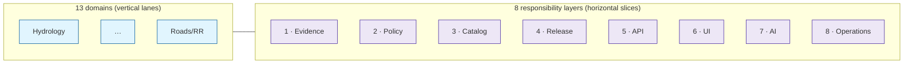

<!-- [KFM_META_BLOCK_V2]
doc_id: kfm://doc/architecture-cross-domain-responsibility-layers
title: Responsibility Layers — Eight Layers Orthogonal to Domains
type: standard
version: v0.1
status: draft
owners: <ARCHITECTURE-DOCTRINE-OWNER> · NEEDS VERIFICATION
created: 2026-05-24
updated: 2026-05-24
policy_label: public
related:
  - README.md
  - shared-kernel.md
  - multi-domain-placement.md
  - compositional-units.md
  - trust-membrane.md
  - directory-rules.md#12
  - kfm_unified_doctrine_synthesis.md#10
  - connected-dots-architecture-brief.md
tags: [kfm, architecture, cross-domain, responsibility-layers, doctrine]
notes:
  - PROPOSED placement; folder vs §12 flat-file pattern is OPEN-DR-10.
  - Layering is KFM-P9-PROG-0001 PROPOSED — labeled accordingly.
[/KFM_META_BLOCK_V2] -->

<a id="top"></a>

# Responsibility Layers

> *The eight responsibility layers — evidence · policy · catalog · release · API · UI · AI · operations — are orthogonal to the thirteen domains. Every domain participates in every layer; every layer is shaped by the shared kernel.*


+PROPOSED%20layering-blue)


**Status:** draft · **Owners:** `<ARCHITECTURE-DOCTRINE-OWNER>` *(NEEDS VERIFICATION)* · **Last updated:** 2026-05-24

> [!IMPORTANT]
> **The KFM responsibility layering is PROPOSED *(KFM-P9-PROG-0001 PROPOSED)* but is grounded in CONFIRMED doctrine.** The kernel objects, the membrane, the gates, and the responsibility roots are all CONFIRMED; the **layer model** that names eight orthogonal cross-cutting concerns is the proposed framing of them. Adopt it for orientation; don't cite it as canonical until the ADR lands.

> [!NOTE]
> **Layers are not folders.** None of the eight layers becomes a root folder. Each layer is implemented through the existing responsibility roots *(`contracts/`, `schemas/`, `policy/`, `tools/`, `apps/`, `release/`, `docs/`, etc.)*. The layer names are an analysis lens, not a placement directive.

---

## Table of contents

1. [Scope](#1-scope)
2. [The eight layers — at-a-glance](#2-the-eight-layers--at-a-glance)
3. [Layer 1 — Evidence](#3-layer-1--evidence)
4. [Layer 2 — Policy](#4-layer-2--policy)
5. [Layer 3 — Catalog](#5-layer-3--catalog)
6. [Layer 4 — Release](#6-layer-4--release)
7. [Layer 5 — API](#7-layer-5--api)
8. [Layer 6 — UI](#8-layer-6--ui)
9. [Layer 7 — AI](#9-layer-7--ai)
10. [Layer 8 — Operations](#10-layer-8--operations)
11. [Domains × layers matrix](#11-domains--layers-matrix)
12. [Anti-patterns](#12-anti-patterns)
13. [Open questions and ADR triggers](#13-open-questions-and-adr-triggers)
14. [Related docs](#14-related-docs)
15. [Appendix](#15-appendix)

---

## 1. Scope

This doc names the eight cross-cutting layers that every KFM domain participates in. It is a **reading lens** for understanding how the doctrine, the kernel, the membrane, and the responsibility roots fit together — and a **completeness check** when a new domain or compositional unit is added.

> [!TIP]
> **When this doc binds.** Any time you are reviewing whether a domain dossier or a cross-domain artifact is complete — does it speak to each of the eight layers? Any time you are tempted to invent a ninth.

[↑ Back to top](#top)

---

## 2. The eight layers — at-a-glance

> **Evidence basis:** Each layer is rooted in CONFIRMED doctrine *(kernel objects in `kfm_unified_doctrine_synthesis.md` §10; gates in §8; envelope in §11; responsibility roots in `directory-rules.md`)*. The **layering itself** is `KFM-P9-PROG-0001` PROPOSED.

| # | Layer | Concern | Primary kernel objects | Responsibility roots involved |
|---|---|---|---|---|
| **1** | **Evidence** | Admission, provenance, support, closure | `SourceDescriptor`, `EvidenceRef`, `EvidenceBundle` | `contracts/`, `schemas/`, `data/`, `tools/`, `fixtures/` |
| **2** | **Policy** | Decisions, sensitivity, role-preservation, fail-closed posture | `PolicyDecision`, `DecisionEnvelope` | `policy/`, `contracts/`, `schemas/` |
| **3** | **Catalog** | Identity, indexing, content addressability, lookup | `SourceDescriptor`, internal indexes *(not exposed)* | `data/`, `schemas/`, `tools/` |
| **4** | **Release** | Promotion, manifests, rollback, change discipline | `ReleaseManifest`, `RollbackCard` | `release/`, `data/`, `contracts/` |
| **5** | **API** | Governed outbound contract, request/response envelopes | `DecisionEnvelope`, `EvidenceBundle` | `apps/`, `contracts/`, `schemas/`, `policy/` |
| **6** | **UI** | Reader-facing surfaces, badges, banners, Focus Modes | `MapContextEnvelope`, `DecisionEnvelope` | `apps/`, `packages/`, `contracts/` |
| **7** | **AI** | Cite-or-abstain answers, receipts, authority | `AIReceipt`, `ReceiptAuthority`, `EvidenceBundle` | `contracts/`, `policy/`, `apps/`, `schemas/` |
| **8** | **Operations** | Build, deploy, observe, runbooks, incident posture | All runtime kernel objects via telemetry | `tools/`, `release/`, `docs/`, `ops/` *(if present)* |



[↑ Back to top](#top)

---

## 3. Layer 1 — Evidence

Admission, provenance, support, closure. The layer that makes cite-or-abstain possible.

| Aspect | Concrete shape |
|---|---|
| Owns | `SourceDescriptor`, `EvidenceRef`, `EvidenceBundle` |
| Gates | A *(source admission)*, B *(provenance)*, E *(evidence closure)* |
| Per-domain shape | Domain dossier "B. Source classes", "C. Evidence and support" |
| Cross-domain shape | `cross-lane-relations.md` invariant (4); `shared-kernel.md` §4 |
| Failure posture | Cite-or-abstain; `ABSTAIN` envelope on unresolved bundle |

[↑ Back to top](#top)

---

## 4. Layer 2 — Policy

Decisions, sensitivity, role-preservation, fail-closed posture.

| Aspect | Concrete shape |
|---|---|
| Owns | `PolicyDecision`, `DecisionEnvelope` |
| Gates | C *(sensitivity)*, F *(review)* |
| Per-domain shape | Domain dossier "D. Sensitivity posture", "G. Policy" |
| Cross-domain shape | `trust-membrane.md`; `cross-lane-relations.md` invariant (3) |
| Failure posture | Fail-closed for the five posture classes *(archaeology exact-location, living-person ids, DNA, parcel title, critical-infrastructure exact-location)* |

[↑ Back to top](#top)

---

## 5. Layer 3 — Catalog

Identity, indexing, content addressability, lookup. The layer that makes records findable.

| Aspect | Concrete shape |
|---|---|
| Owns | `SourceDescriptor` identities; internal indexes; vector / search stores |
| Posture | **Internal only.** Indexes are inside the trust membrane; only `PUBLISHED` artifacts cross out. |
| Per-domain shape | Domain dossier "A. Identity model" |
| Cross-domain shape | Kernel `SourceDescriptor`; cross-domain join indexes live under `data/` per `multi-domain-placement.md` |
| Failure posture | Catalog drift surfaces as stale resolution; runtime closure check catches it |

> [!CAUTION]
> **Catalog leaks are membrane breaches.** Internal index ids and embedding hashes do not appear in error envelopes; reason classes only.

[↑ Back to top](#top)

---

## 6. Layer 4 — Release

Promotion, manifests, rollback, change discipline. The layer that controls what is `PUBLISHED`.

| Aspect | Concrete shape |
|---|---|
| Owns | `ReleaseManifest`, `RollbackCard` |
| Gates | G *(release)* |
| Per-domain shape | Domain dossier "H. Release discipline" |
| Cross-domain shape | `docs/architecture/release-discipline.md`; `trust-membrane.md` §6 |
| Failure posture | Immutable manifests; pre-staged rollback target; release fails closed |

[↑ Back to top](#top)

---

## 7. Layer 5 — API

Governed outbound contract; request / response envelopes; cite-or-abstain.

| Aspect | Concrete shape |
|---|---|
| Owns | Governed API responses; `DecisionEnvelope` |
| Gates | Membrane check; sensitivity check at request time |
| Per-domain shape | Domain dossier "E. API contracts" |
| Cross-domain shape | `docs/architecture/governed-api.md`; `shared-kernel.md` §5 |
| Failure posture | `ANSWER` / `ABSTAIN` / `DENY` / `ERROR`; no raw payload at boundary |

[↑ Back to top](#top)

---

## 8. Layer 6 — UI

Reader-facing surfaces; badges, banners, Focus Modes, narrative.

| Aspect | Concrete shape |
|---|---|
| Owns | UI shells; map renderer; Focus Mode runtime; narrative panels |
| Envelopes | `MapContextEnvelope`, `DecisionEnvelope` |
| Per-domain shape | Domain dossier "I. UI surfaces" |
| Cross-domain shape | `compositional-units.md`; `docs/architecture/map-shell.md` *(if applicable)* |
| Failure posture | Envelope-aware components; never render `WORK` / `QUARANTINE` content; Reality Boundary badge on synthetic |

[↑ Back to top](#top)

---

## 9. Layer 7 — AI

Cite-or-abstain answers; receipts; authority; representation.

| Aspect | Concrete shape |
|---|---|
| Owns | Governed AI surface answers; `AIReceipt`, `ReceiptAuthority`, `RepresentationReceipt` |
| Posture | Cite-or-abstain; every answer emits a receipt; receipt resolves an authority |
| Per-domain shape | Domain dossier "J. AI surfaces" |
| Cross-domain shape | `docs/architecture/governed-ai.md`; `shared-kernel.md` §6 |
| Failure posture | `ABSTAIN` envelope on missing receipt, missing authority, or unresolved bundle |

[↑ Back to top](#top)

---

## 10. Layer 8 — Operations

Build, deploy, observe, runbooks, incident posture.

| Aspect | Concrete shape |
|---|---|
| Owns | CI/CD; deployment topology; observability; runbooks; incident response |
| Per-domain shape | Domain dossier "K. Operations" |
| Cross-domain shape | `docs/architecture/deployment-topology.md`; `directory-rules.md` operational sections |
| Failure posture | Operations alerts on `ERROR` envelopes; rollback executes against the pre-staged `RollbackCard` |

[↑ Back to top](#top)

---

## 11. Domains × layers matrix

> **Every domain participates in every layer.** Use this matrix to check completeness of a domain dossier or a cross-domain artifact.

| Domain ↓ / Layer → | 1·Evidence | 2·Policy | 3·Catalog | 4·Release | 5·API | 6·UI | 7·AI | 8·Operations |
|---|---|---|---|---|---|---|---|---|
| Hydrology | ✓ | ✓ | ✓ | ✓ | ✓ | ✓ | ✓ | ✓ |
| Soil | ✓ | ✓ | ✓ | ✓ | ✓ | ✓ | ✓ | ✓ |
| Atmosphere / Air | ✓ | ✓ | ✓ | ✓ | ✓ | ✓ | ✓ | ✓ |
| Geology | ✓ | ✓ | ✓ | ✓ | ✓ | ✓ | ✓ | ✓ |
| Fauna | ✓ | ✓ (fail-closed) | ✓ | ✓ | ✓ | ✓ | ✓ | ✓ |
| Flora | ✓ | ✓ | ✓ | ✓ | ✓ | ✓ | ✓ | ✓ |
| Habitat | ✓ | ✓ | ✓ | ✓ | ✓ | ✓ | ✓ | ✓ |
| Archaeology | ✓ | ✓ (fail-closed) | ✓ | ✓ | ✓ | ✓ | ✓ | ✓ |
| Settlements / Infrastructure | ✓ | ✓ (CI carve-outs) | ✓ | ✓ | ✓ | ✓ | ✓ | ✓ |
| Hazards | ✓ | ✓ | ✓ | ✓ | ✓ | ✓ | ✓ (ABSTAIN posture) | ✓ |
| Agriculture | ✓ | ✓ | ✓ | ✓ | ✓ | ✓ | ✓ | ✓ |
| People / DNA / Land / Genealogy | ✓ | ✓ (fail-closed) | ✓ | ✓ | ✓ | ✓ | ✓ | ✓ |
| Roads / Railroads | ✓ | ✓ | ✓ | ✓ | ✓ | ✓ | ✓ | ✓ |

> [!IMPORTANT]
> **Missing cells are a doctrine gap.** If a domain dossier does not speak to a layer, either the layer doesn't apply *(rare — almost always there is something to say)* or the dossier is incomplete.

[↑ Back to top](#top)

---

## 12. Anti-patterns

| Anti-pattern | Why it breaks the trust path | Mitigation |
|---|---|---|
| **Layer named as a root folder** *(`evidence/`, `policy/` at top is fine because those are responsibility roots; `ai/` or `api/` at top is drift)* | Confuses analysis lens with placement | Layers map to existing roots; never invent a new root from a layer name. |
| **Domain dossier silent on a layer** | Incomplete; cross-lane reasoning breaks down | Each domain dossier carries a per-layer section *(A–K in the dossier template)*. |
| **A ninth layer invented ad-hoc** | Fragments the analysis lens | ADR required to add or split a layer. |
| **AI layer used to bypass Evidence layer** *(e.g., "AI summarized the data, so we don't need the bundle")* | Cite-or-abstain rule broken | `AIReceipt` MUST cite the bundle; missing bundle → `ABSTAIN`. |
| **Operations layer holding undocumented escape hatches** *(e.g., admin overrides not in runbooks)* | Membrane breach risk | Operations actions are auditable; escape hatches are runbook entries with authorization. |

[↑ Back to top](#top)

---

## 13. Open questions and ADR triggers

| Open item | Class | Suggested ADR title |
|---|---|---|
| **KFM-P9-PROG-0001** — Adopt eight-layer framing as canonical, or treat it as informal analysis lens? | Doctrine | "Adopt responsibility-layer framing". |
| Should **Catalog** and **Release** be merged into a single "Lifecycle" layer? | Doctrine | "Catalog + Release layer fusion". |
| Should **AI** be a sub-layer of **API** *(since AI surfaces are governed APIs)* or stay distinct? | Doctrine | "AI as sub-layer of API". |
| Per-layer "audit checklist" — single doc or distributed across layer docs? | Process | "Layer audit checklist home". |

[↑ Back to top](#top)

---

## 14. Related docs

| Reference | Role | Truth label |
|---|---|---|
| `README.md` *(this folder)* | Landing | CONFIRMED doctrine |
| `shared-kernel.md` *(sibling)* | Kernel objects shape each layer | CONFIRMED doctrine |
| `multi-domain-placement.md` *(sibling)* | Where artifacts go regardless of layer | CONFIRMED doctrine |
| `compositional-units.md` *(sibling)* | Compositional units cut across all eight layers | CONFIRMED doctrine |
| `trust-membrane.md` *(sibling)* | Membrane runs through layers 4–7 | CONFIRMED doctrine |
| `directory-rules.md` §12 | Responsibility roots that implement the layers | CONFIRMED doctrine |
| `kfm_unified_doctrine_synthesis.md` §10 | Core object families | CONFIRMED doctrine |
| `kfm_unified_doctrine_synthesis.md` §8 | Promotion gates *(layered)* | CONFIRMED doctrine |
| `connected-dots-architecture-brief.md` | Architecture brief that complements layering | CONFIRMED doctrine |
| `docs/architecture/governed-api.md` | Layer 5 home | CONFIRMED doctrine |
| `docs/architecture/governed-ai.md` | Layer 7 home | CONFIRMED doctrine |
| `docs/architecture/deployment-topology.md` | Layer 8 home | CONFIRMED doctrine |
| `docs/architecture/release-discipline.md` | Layer 4 home | CONFIRMED scaffold |

[↑ Back to top](#top)

---

## 15. Appendix

<details>
<summary><strong>15.1 Layers — at-a-glance</strong></summary>

```text
1 · Evidence    — admission, provenance, support, closure
2 · Policy      — decisions, sensitivity, role-preservation, fail-closed
3 · Catalog     — identity, indexing, content-addressability (internal)
4 · Release     — promotion, manifests, rollback, change discipline
5 · API         — governed outbound contract, envelopes, cite-or-abstain
6 · UI          — reader surfaces, badges, banners, Focus Modes
7 · AI          — cite-or-abstain answers, receipts, authority
8 · Operations  — build, deploy, observe, runbooks, incident posture
```

Each layer maps to existing responsibility roots; **no layer becomes a new root**.

</details>

<details>
<summary><strong>15.2 Truth-label legend</strong></summary>

- **CONFIRMED** — verified this session from attached docs.
- **PROPOSED** — design / placement / inference not yet verified in implementation. The eight-layer framing itself is PROPOSED *(KFM-P9-PROG-0001)*.
- **INFERRED** — derivable from confirmed evidence but not directly stated.
- **NEEDS VERIFICATION** — checkable, but not yet checked strongly enough to act as fact.

</details>

---

**Related (mini)** · [`README.md`](README.md) · [`shared-kernel.md`](shared-kernel.md) · [`multi-domain-placement.md`](multi-domain-placement.md) · [`compositional-units.md`](compositional-units.md) · [`trust-membrane.md`](trust-membrane.md)

**Last updated:** 2026-05-24 · **Doc version:** v0.1 · **Doc status:** draft · **Path status:** PROPOSED *(OPEN-DR-10)*

[↑ Back to top](#top)
