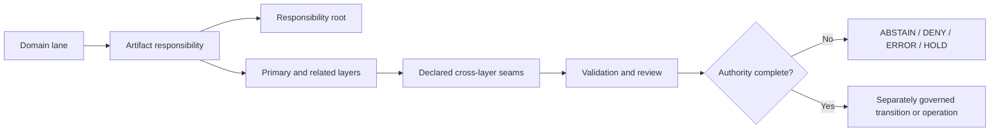

<!-- [KFM_META_BLOCK_V2]
doc_id: kfm://doc/architecture-cross-domain-responsibility-layers
title: Responsibility Layers — Cross-Domain Large-Scale Structure
type: architecture-standard
version: v0.3.0
prior_version: v0.1
status: draft; repository-grounded architecture reference; proposed eight-layer lens; bounded assessment proof; non-authoritative
owners:
  - "@bartytime4life — verified CODEOWNERS review route; routing is not stewardship, independent review, approval, or release authority"
  - "NEEDS VERIFICATION — architecture, governance, evidence, policy, catalog, release, API, UI, AI, operations, contract, schema, validation, security, correction, and rollback stewards"
created: 2026-05-24
updated: 2026-08-20
policy_label: public; architecture; cross-domain; responsibility-layers; cite-or-abstain; non-release; non-publication
owning_root: docs/
responsibility_root: docs/
responsibility: Explain the proposed eight-layer responsibility lens, its current bounded impact-assessment packet, its relationship to domains and responsibility roots, and the controls required before operational reliance.
canonical_relationship: Same-path explanatory architecture reference; no sibling, contract, schema, policy, register, root, or release authority is created.
truth_posture: >-
  CONFIRMED current repository paths, accepted Directory Rules placement authority,
  proposed root and domain projections, the inactive responsibility-layer impact
  assessment contract/schema/fixtures/validator/tests/workflow, and one prior exact-head
  successful focused workflow / PROPOSED the eight-layer model as a canonical KFM
  large-scale structure and any universal per-domain coverage requirement / UNKNOWN
  deployed use, current production assessments, public consumers, correction propagation,
  and rollback execution / NEEDS VERIFICATION model adoption, accountable stewardship,
  root-enum convergence, focused workflow coverage for this page, human review, and
  exact-head validation of this revision.
evidence_snapshot:
  repository: bartytime4life/Kansas-Frontier-Matrix
  visibility: public
  base_ref: main
  base_commit: 9cebd52e986d343ccb0e1ae4423bd689124d0801
  target_prior_blob: bbb5605a84c0b9a639df7c20a2b5ab28850663e3
  parent_readme_blob: 3353a0a0ab5fe3f8f5fdea937b8eecfa34b81032
  codeowners_blob: dd2a84aa514d8ecd9208bc347f90f9a2ed37dd61
  directory_rules_v2_blob: fd49a0b83e55cef52c1124281f093e263526898d
  adr_0029_blob: a4de0d7a96b78da59cfc499d1025e1508afd8dd9
  root_registry_blob: 024f668b5f0a9239bafa4f8b09e2afd86300ff8c
  domain_lane_register_blob: 1bfc6f91cfa713a5e3d51ece011b63b46310734f
  impact_contract_blob: 5e2000c77a845493ef3272b0d75fbe3495cb73a4
  impact_schema_blob: c2a3e9a9570174ead9451d25c43c9196da4243a2
  impact_fixture_blob: af00be1cdc5eb4651138c4398818488ec4022a94
  impact_validator_blob: 83ad18e16655f123b8b6678032075594c79e6488
  impact_test_blob: 9295abcf5122232ad0982f51fbc81f7e4704b1af
  impact_workflow_blob: fb0c07542f2d07d89536ac410be48ab38bee75b9
  impact_source_map_blob: 43faa1bd6078ef454942c81706d48362fed5a1d7
  impact_generated_receipt_blob: cc6fbcaf4745b9c06d4147438e0cfb4472a3e05b
  prior_focused_workflow_run: 31538415902
  prior_focused_workflow_head: 233e4d3806a81625cc5502fc2147668b6ba42099
  prior_focused_workflow_result: success
inspection_boundary: >-
  Current-session GitHub reads covered the complete prior target, the current
  cross-domain directory and parent README, accepted ADR-0029, adopted Directory
  Rules v2, Root Registry, Domain Lane Register, the complete semantic contract and
  closed schema for ResponsibilityLayerImpactAssessmentCandidate, the validator,
  focused tests, workflow, source map, generated receipt, merged PR #2580, and its
  prior exact-head workflow inventory. No production assessment instance, policy
  evaluator, deployed API, public client, live model, catalog service, release packet,
  correction cascade, cache invalidation, incident exercise, or rollback execution was
  exercised.
related:
  - ./README.md
  - ./shared-kernel.md
  - ./multi-domain-placement.md
  - ./compositional-units.md
  - ./cross-lane-relations.md
  - ./source-role-anti-collapse.md
  - ./trust-membrane.md
  - ../../doctrine/directory-rules.md
  - ../../adr/ADR-0029-adopt-directory-governance-standard-v2.md
  - ../../../control_plane/root_registry.yaml
  - ../../../control_plane/domain_lane_register.yaml
  - ../../../contracts/governance/responsibility_layer_impact_assessment.md
  - ../../../schemas/contracts/v1/governance/responsibility_layer_impact_assessment.schema.json
  - ../../../fixtures/contracts/v1/governance/responsibility_layer_impact_assessment/cases.json
  - ../../../tools/validators/governance/validate_responsibility_layer_impact_assessment.py
  - ../../../tests/validators/governance/test_validate_responsibility_layer_impact_assessment.py
  - ../../../.github/workflows/responsibility-layer-impact-assessment.yml
  - ../../intake/exploratory/pass-18-responsibility-layer-impact-assessment-source-map.md
  - ../../../data/receipts/generated/genrec-pass18-responsibility-layer-impact-assessment-20260811.json
tags: [kfm, architecture, cross-domain, responsibility-layers, domain-driven-design, evidence, policy, catalog, release, api, ui, ai, operations, impact-assessment]
notes:
  - "v0.3.0 replaces proposal-era repository assumptions with current pinned evidence while preserving the same path, doc_id, H1, top anchor, eight layer names, and fifteen numbered section headings."
  - "The Responsibility Layers pattern is used as conceptual reference language; the exact KFM eight-layer vocabulary remains proposed until an accepted decision adopts it."
  - "The current machine assessment is fixture-only and non-authoritative. PASS proves local declaration coherence, not placement, ownership, policy, review, release, deployment, publication, or public-use authority."
  - "The current assessment schema permits an ops/ owning-root label, while the current Root Registry does not register ops/ as a canonical root. This revision records that drift and does not repair it by prose."
  - "No doctrine, ADR, root, domain, contract, schema, policy, fixture, validator, test, workflow, runtime, source, lifecycle, release, deployment, publication, or repository setting is changed."
[/KFM_META_BLOCK_V2] -->

<a id="top"></a>

# Responsibility Layers

The proposed KFM responsibility-layer model names eight cross-cutting concerns:
**Evidence, Policy, Catalog, Release, API, UI, AI, and Operations**. It is a
large-scale architecture lens for asking who owns a concern, which authority
objects apply, and where a change crosses a review seam. It is not a directory
tree, lifecycle sequence, domain registry, runtime pipeline, or publication
decision.

[](#status-and-evidence-boundary)
[](#status-and-evidence-boundary)
[](#model-status)
[](#machine-checkable-impact-assessment)
[](./README.md#truth-posture)
[](#authority-boundary)

> [!IMPORTANT]
> **Responsibility layers organize questions; responsibility roots own
> artifacts.** A layer label cannot create a root, place a file, assign a
> steward, settle a bounded-context boundary, execute policy, or authorize a
> lifecycle transition.

> [!CAUTION]
> **A complete-looking matrix is not implementation proof.** The repository has
> a bounded synthetic assessment packet for the eight names, but the layer model
> itself remains proposed and the packet is inactive, fixture-only, and
> non-authoritative.

> [!WARNING]
> **Public-surface work is not closed by UI, API, or AI alone.** The current
> validator requires any declared `API`, `UI`, or `AI` impact to include
> `EVIDENCE`, `POLICY`, and `RELEASE`. That is a fixture-profile invariant, not
> proof that a real policy decision, evidence closure, or release exists.

## Table of contents

1. [Scope](#1-scope)
2. [The eight layers — at-a-glance](#2-the-eight-layers--at-a-glance)
3. [Layer 1 — Evidence](#3-layer-1--evidence)
4. [Layer 2 — Policy](#4-layer-2--policy)
5. [Layer 3 — Catalog](#5-layer-3--catalog)
6. [Layer 4 — Release](#6-layer-4--release)
7. [Layer 5 — API](#7-layer-5--api)
8. [Layer 6 — UI](#8-layer-6--ui)
9. [Layer 7 — AI](#9-layer-7--ai)
10. [Layer 8 — Operations](#10-layer-8--operations)
11. [Domains × layers matrix](#11-domains--layers-matrix)
12. [Anti-patterns](#12-anti-patterns)
13. [Open questions and ADR triggers](#13-open-questions-and-adr-triggers)
14. [Related docs](#14-related-docs)
15. [Appendix](#15-appendix)

---

## Status and evidence boundary

<a id="model-status"></a>

| Question | Current evidence-backed answer |
|---|---|
| Is this an existing tracked architecture page? | **CONFIRMED.** The same path exists at the inspected main commit. |
| Is the path still provisional under `OPEN-DR-10`? | **No current basis.** Accepted [ADR-0029](../../adr/ADR-0029-adopt-directory-governance-standard-v2.md) adopts [Directory Rules v2](../../doctrine/directory-rules.md), whose cross-domain placement model supports this established human architecture lane. |
| Is the eight-layer model adopted KFM doctrine? | **No accepted decision was verified.** The source lineage and this page treat it as a useful `PROPOSED` large-scale-structure lens. |
| Are the eight names represented in machine-checkable repository artifacts? | **CONFIRMED, bounded.** A proposed inactive contract, closed schema, synthetic fixtures, deterministic validator, focused tests, and read-only workflow exist. |
| Does the packet make the model canonical? | **No.** Its contract explicitly binds the draft model by reference and denies model-adoption, placement, ownership, policy, review, runtime, data-mutation, release, deployment, and publication authority. |
| Has the focused workflow ever succeeded? | **CONFIRMED for one prior exact head only.** Run `31538415902` succeeded at `233e4d3806a81625cc5502fc2147668b6ba42099`. That result is not current-head validation for this documentation revision. |
| Are all 13 domain lanes implemented across all eight layers? | **UNKNOWN.** The current proposed Domain Lane Register lists 13 lanes; neither the register nor a checkmark matrix proves layer-by-layer implementation. |
| Does this page change public or lifecycle state? | **No.** It is explanatory architecture and has no release, deployment, promotion, publication, or public-use effect. |

### Directory Rules basis

The owning root is `docs/` because this artifact explains architecture to
humans. Its responsibility signature is:

| Axis | Value |
|---|---|
| Artifact kind | Human architecture standard |
| Primary responsibility | Explain a cross-domain large-scale-structure lens and its evidence limits |
| Scope | Cross-domain |
| Execution role | None |
| Lifecycle stage | None; this is not a data instance |
| Exposure | Public repository documentation |
| Mutability | Versioned through review |
| Retention | Durable |
| Placement result | `PLACE` at the existing same path |
| Structural change | None |

<a id="authority-boundary"></a>

### Authority boundary

| Owning surface | Authority | This page may do |
|---|---|---|
| `docs/doctrine/` and accepted ADRs | Governing invariants and accepted decisions | Explain and link; never silently amend or accept |
| `control_plane/` | Machine projections of adopted or proposed governance | Report projection state; never turn projection into authority |
| `contracts/` | Semantic meaning | Summarize the impact-assessment contract; never redefine it |
| `schemas/` | Machine shape | Report the current enum and closed profile; never add fields by prose |
| `policy/` | Allow, deny, hold, restrict, and abstain rules | State required closure; never claim evaluation occurred |
| `data/` | Lifecycle, catalog, registry, receipt, proof, and released-carrier instances | Describe object-family separation; never mutate or promote |
| `release/` | Release, correction, withdrawal, rollback, promotion, and signature decisions | State prerequisites; never authorize a transition |
| implementation roots | Executable behavior | Cite bounded implementation and tests; never infer deployment |
| this page | Human explanation | Preserve distinctions, limits, validation, and rollback guidance |

### Conceptual basis

The Domain-Driven Design **Responsibility Layers** pattern asks designers to
look for natural large-scale strata based on conceptual dependencies and
different sources or rates of change, then make those responsibilities tell a
coherent high-level story. KFM adapts that pattern as an eight-question review
lens.

That reference does **not** establish these exact eight labels, their order, or
their canonical status. KFM's model must still be reconciled with accepted
Directory Rules, current bounded contexts, semantic contracts, machine
projections, tests, and review authority.

[Back to top](#top)

---

## 1. Scope

This page applies when maintainers need to understand how a domain, seam,
compositional unit, contract packet, public surface, or release-related change
touches cross-cutting responsibilities.

It helps answer:

- which responsibility is primary for each artifact;
- which other layers are directly or indirectly affected;
- which evidence, policy, release, validation, review, and rollback seams must
  be explicit;
- which repository root owns each artifact;
- where an unresolved dependency requires `ABSTAIN`, `DENY`, `ERROR`, or a
  governance `HOLD`.

This page does **not**:

- register or remove a domain;
- create a ninth layer or accept the current eight;
- prescribe a strict runtime call order;
- replace the lifecycle
  `RAW → WORK / QUARANTINE → PROCESSED → CATALOG / TRIPLET → PUBLISHED`;
- place files by layer name;
- define contract, schema, policy, receipt, proof, catalog, or release fields;
- authorize a join, public answer, deployment, or publication.

> [!TIP]
> Use the layer lens after identifying the artifact's one owning responsibility.
> When two authorities need independent control over one artifact, split the
> artifact or define an explicit governed seam; do not solve the conflict with a
> broader folder name.

[Back to top](#top)

---

## 2. The eight layers — at-a-glance

The order below is a stable presentation order for this page. It is not a claim
that every request flows through a linear eight-stage pipeline.

| # | Layer | Governing question | Typical authority-bearing objects or records | Current owning roots involved |
|---:|---|---|---|---|
| 1 | **Evidence** | What support exists, what scope does it cover, and can references resolve? | `SourceDescriptor`, `EvidenceRef`, `EvidenceBundle`, verification and citation records | `contracts/`, `schemas/`, `data/`, `packages/`, `tools/`, `fixtures/`, `tests/` |
| 2 | **Policy** | Is the operation allowed, restricted, held, denied, or obligated? | Policy rules, `PolicyDecision`, obligations, sensitivity and access posture | `policy/`, `contracts/`, `schemas/`, `packages/`, `tests/` |
| 3 | **Catalog** | How is a governed object identified and discovered without becoming truth by indexing? | Catalog records, registry records, source identities, discovery projections | `data/`, `control_plane/`, `contracts/`, `schemas/`, `tools/` |
| 4 | **Release** | Which reviewed state transition makes a public-safe artifact available, and how is it corrected or rolled back? | Promotion and release decisions, manifests, correction and withdrawal records, rollback targets | `release/`, `data/`, `contracts/`, `schemas/`, `tools/`, `tests/` |
| 5 | **API** | Which finite governed interface may a consumer call? | Request contracts, `RuntimeResponseEnvelope`, evidence projections, safe reason codes | `apps/`, `contracts/`, `schemas/`, `packages/`, `policy/`, `tests/` |
| 6 | **UI** | How are finite outcomes, evidence, trust state, limitations, and correction state rendered? | Evidence Drawer and trust projections, map/view context, released layer/style manifests | `apps/`, `packages/`, `contracts/`, `schemas/`, `styles/`, `tests/` |
| 7 | **AI** | How may a model interpret admitted evidence without acquiring truth or release authority? | Adapter requests/candidates, `AIReceipt`, citation-validation references, finite response envelopes | `runtime/`, `apps/`, `packages/`, `contracts/`, `schemas/`, `policy/`, `tests/` |
| 8 | **Operations** | How is the system built, configured, deployed, observed, recovered, and investigated? | Workflows, runbooks, configuration, deployment and telemetry records, incident and rollback evidence | `.github/`, `infra/`, `runtime/`, `configs/`, `tools/`, `docs/`, `release/` |

### Separate axes

| Axis | What it classifies | Why it must remain separate from layers |
|---|---|---|
| Responsibility root | Where an artifact belongs by owning responsibility | A layer may touch several roots; no layer becomes a root |
| Domain lane | Which bounded domain owns subject meaning | Every domain can participate in several layers without merging domains |
| Lifecycle stage | Where a data instance sits from intake through publication | Evidence, catalog, release, and operations responsibilities can act at multiple stages |
| Compositional scope | How released material is combined for a place, analysis, or representation | Scope does not own domain truth or layer authority |
| Source role | Whether support is observed, modeled, regulatory, contextual, synthetic, or another accepted role | A layer label must not collapse source semantics |
| Exposure class | Internal, restricted, staged, public-safe, or public | Exposure is policy and release dependent, not inferred from a layer |


```mermaid
flowchart LR
    D[Domain lane] --> A[Artifact responsibility]
    A --> R[Responsibility root]
    A --> L[Primary and related layers]
    L --> S[Declared cross-layer seams]
    S --> V[Validation and review]
    V --> G{Authority complete?}
    G -- No --> H[ABSTAIN / DENY / ERROR / HOLD]
    G -- Yes --> P[Separately governed transition or operation]
```

[Back to top](#top)

---

## 3. Layer 1 — Evidence

**Core question:** What supports the proposed claim or operation, and what are
the limits of that support?

| Concern | Current architecture posture |
|---|---|
| Primary responsibilities | Source identity and role, provenance, reference resolution, bundle closure, citation support, verification state, temporal and geographic scope |
| Typical objects | `SourceDescriptor`, `EvidenceRef`, `EvidenceBundle`, citation and verification records |
| Does not own | Policy permission, review approval, release state, UI copy, model confidence, or publication |
| Safe negative state | Consequential output abstains or errors when support cannot be resolved; policy may additionally deny exposure |
| Change-impact expectation | A public-surface declaration includes evidence coverage and at least one validation reference for the Evidence layer |

A map, index, model, summary, test, or receipt can point to evidence but cannot
substitute for it. Generated language remains an interpretive derivative.

[Back to top](#top)

---

## 4. Layer 2 — Policy

**Core question:** Is the requested operation admissible for this actor,
purpose, scope, source role, rights posture, sensitivity, and release state?

| Concern | Current architecture posture |
|---|---|
| Primary responsibilities | Allow, deny, hold, restrict, abstain, obligations, role and purpose checks, rights and sensitivity handling |
| Typical objects | Policy source, `PolicyDecision`, obligations and safe reason references |
| Does not own | Evidence truth, reviewer identity, source admission by itself, release approval, or public rendering |
| Safe negative state | Unknown, malformed, unavailable, or unauthorized policy context fails closed |
| Change-impact expectation | A declared Policy-layer impact carries an opaque decision reference; the assessment does not resolve or authenticate it |

The current runtime policy surface is not inferred from this page. A rule file,
documentation statement, or absent denial is not permission.

[Back to top](#top)

---

## 5. Layer 3 — Catalog

**Core question:** How can a governed object be found, indexed, and related
without treating discovery metadata as the object or its evidence?

| Concern | Current architecture posture |
|---|---|
| Primary responsibilities | Stable identities, registries, catalogs, indexes, discovery projections, content and lineage references |
| Typical objects | Registry entries, catalog records, source and artifact identities, graph or search projections |
| Does not own | Evidence closure, source-role authority, policy decisions, release decisions, or public truth |
| Safe negative state | Missing or stale discovery state remains unresolved; consumers do not infer an object or claim from an index miss or hit |
| Change-impact expectation | Catalog impact is declared separately from Evidence and Release when identity or discovery surfaces change |

Catalog data is not categorically internal or public. Exposure depends on the
specific object family, policy, release state, and public-safe projection.
Canonical or lifecycle-internal indexes remain behind governed interfaces.

[Back to top](#top)

---

## 6. Layer 4 — Release

**Core question:** What reviewed, reversible state transition permits a
public-safe carrier or operation to become available?

| Concern | Current architecture posture |
|---|---|
| Primary responsibilities | Promotion and release decisions, manifests, integrity, signatures, correction, withdrawal, supersession, rollback targets |
| Typical objects | `ReleaseManifest`, promotion records, correction or withdrawal notices, rollback cards or equivalent accepted records |
| Does not own | Evidence creation, policy authorship, model generation, UI state, or deployment merely because files exist |
| Safe negative state | Missing evidence, policy, review, integrity, correction, or rollback closure holds or denies release |
| Change-impact expectation | A declared Release-layer impact carries an opaque rollback reference; the assessment does not execute it |

A commit, pull request, green workflow, generated receipt, deployment, or file
copy is not a lifecycle promotion or KFM publication event.

[Back to top](#top)

---

## 7. Layer 5 — API

**Core question:** Which bounded request and finite response contract may cross
the dynamic trust membrane?

| Concern | Current architecture posture |
|---|---|
| Primary responsibilities | Request normalization, authenticated scope, governed orchestration, finite responses, safe diagnostics |
| Typical objects | Request contracts, `RuntimeResponseEnvelope`, evidence projections, safe reason codes |
| Does not own | Canonical/internal stores, source admission, model truth, policy authorship, or release approval |
| Safe negative state | `ANSWER`, `ABSTAIN`, `DENY`, or `ERROR` remains explicit; unknown response shape fails closed |
| Change-impact expectation | API impact requires declared Evidence, Policy, and Release coverage in the current fixture profile |

Ordinary clients use governed interfaces or already released public-safe
artifacts. A route name or passing schema test does not prove authenticated,
authorized, deployed, or publicly released behavior.

[Back to top](#top)

---

## 8. Layer 6 — UI

**Core question:** How does a user see a bounded outcome, its evidence,
limitations, time, precision, policy posture, release state, and correction
lineage?

| Concern | Current architecture posture |
|---|---|
| Primary responsibilities | Map and reader surfaces, finite-state rendering, Evidence Drawer, trust-visible notices, accessibility, safe interaction |
| Typical objects | Public-safe projections, map/view context, released layer and style manifests, evidence references |
| Does not own | Truth, policy, source role, release, sensitive-detail clearance, or model execution |
| Safe negative state | UI renders explicit safe negative states and does not infer or reconstruct hidden payloads |
| Change-impact expectation | UI impact requires declared Evidence, Policy, and Release coverage in the current fixture profile |

MapLibre, tiles, styles, popups, screenshots, exports, dashboards, and scenes
remain downstream carriers. Requested zoom or visual precision cannot upgrade
the evidence-supported or policy-permitted precision.

[Back to top](#top)

---

## 9. Layer 7 — AI

**Core question:** How may a provider-neutral model produce an untrusted
candidate over admitted context while remaining subordinate to KFM authority?

| Concern | Current architecture posture |
|---|---|
| Primary responsibilities | Bounded adapter invocation, structured candidates, citation validation, finite outcome support, AI accountability |
| Typical objects | Adapter request/candidate, `AIReceipt`, citation-validation reference, `RuntimeResponseEnvelope` |
| Does not own | Evidence resolution, policy, source admission, final outcome authority, review, release, correction, or publication |
| Safe negative state | Missing support, policy, citation, receipt, or safe-output closure yields abstention, denial, or error; no raw model stream crosses the public boundary |
| Change-impact expectation | AI impact requires declared Evidence, Policy, and Release coverage in the current fixture profile |

A receipt records bounded model participation. It does not make generated
language true or authenticate the evidence, policy, review, or release records
it references.

[Back to top](#top)

---

## 10. Layer 8 — Operations

**Core question:** How is the system built, configured, deployed, observed,
recovered, and investigated without creating an administrative bypass?

| Concern | Current architecture posture |
|---|---|
| Primary responsibilities | CI, configuration, deployment, network exposure, runtime adapters, observability, runbooks, incidents, recovery and rollback execution |
| Current roots | `.github/`, `infra/`, `runtime/`, `configs/`, `tools/`, `docs/`, and `release/` according to the artifact's actual responsibility |
| Does not own | An independent `ops/` authority, evidence truth, policy permission, review approval, release approval, or publication |
| Safe negative state | Operational failure surfaces safe `ERROR` or held state; it never falls through to an answer, release, or exposure |
| Change-impact expectation | Operations changes declare validation and cross-layer seams; a single-layer synthetic operations case can pass only as local assessment coherence |

### Current root-enum drift

The current impact-assessment schema allows `ops/` as an `owning_root` value.
The current [Root Registry](../../../control_plane/root_registry.yaml) does not
register `ops/` as a canonical, compatibility, conditional, deprecated, retired,
or platform root.

This is **NEEDS VERIFICATION / drift**, not authority to create or use `ops/`.
A real assessment must consult current Directory Rules, the Root Registry, and
actual path evidence. This documentation revision does not change the schema,
validator, registry, or any path.

[Back to top](#top)

---

## 11. Domains × layers matrix

The current proposed [Domain Lane Register](../../../control_plane/domain_lane_register.yaml)
lists 13 lanes. The matrix below is a **review expectation**, not a maturity or
implementation claim.

| Proposed domain lane | Evidence | Policy | Catalog | Release | API | UI | AI | Operations |
|---|:---:|:---:|:---:|:---:|:---:|:---:|:---:|:---:|
| Agriculture | review | review | review | review | review | review | review | review |
| Archaeology | review | review | review | review | review | review | review | review |
| Atmosphere | review | review | review | review | review | review | review | review |
| Fauna | review | review | review | review | review | review | review | review |
| Flora | review | review | review | review | review | review | review | review |
| Geology | review | review | review | review | review | review | review | review |
| Habitat | review | review | review | review | review | review | review | review |
| Hazards | review | review | review | review | review | review | review | review |
| Hydrology | review | review | review | review | review | review | review | review |
| People, DNA & Land | review | review | review | review | review | review | review | review |
| Roads, Rail & Trade | review | review | review | review | review | review | review | review |
| Settlements & Infrastructure | review | review | review | review | review | review | review | review |
| Soil | review | review | review | review | review | review | review | review |

`review` means: state the layer's relevance, owning artifacts, authoritative
references, negative behavior, validation, and unresolved work—or explicitly
justify why the layer is not applicable. It does not mean the layer is
implemented, accepted, released, or public.

Higher-risk subjects still require their own qualified rights, sovereignty,
privacy, cultural, ecological, safety, security, and release decisions. A row in
this table cannot assign those authorities.

<a id="machine-checkable-impact-assessment"></a>

### Machine-checkable impact assessment

The repository contains an inactive
[`ResponsibilityLayerImpactAssessmentCandidate`](../../../contracts/governance/responsibility_layer_impact_assessment.md)
packet.

| Surface | Current bounded behavior | Non-effect |
|---|---|---|
| Contract | Defines one synthetic change-impact declaration | Does not adopt the layer model or approve a change |
| Schema | Closes layer, root, artifact, seam, review, limitation, and authority-claim fields | Does not prove refs or roots are currently authoritative |
| Fixtures | Exercise 23 exact finite cases | Synthetic cases are not production assessments |
| Validator | Checks path/root prefix, layer coverage, public-surface closure, seam connectivity, review state, UTC time, and deterministic identity | Does not resolve refs, execute policy, read stores, or mutate state |
| Tests | Cover `PASS`, `ABSTAIN`, `DENY`, `ERROR`, no-network replay, parser safety, public closure, and bypass negatives | Do not prove end-to-end governance or deployment |
| Workflow | Runs focused checks read-only with `KFM_NO_NETWORK=1` | Is not a required-check or release decision merely because it exists |
| Generated receipt | Binds the authored packet bytes with human review pending | Is not proof, approval, release, or publication authority |

### Current finite outcomes

| Outcome | Meaning in this fixture profile |
|---|---|
| `PASS` | Declared artifact, root, layer, seam, reference, review, time, and identity fields are locally coherent |
| `ABSTAIN` | A seam or review state is unresolved |
| `DENY` | Placement, coverage, public closure, seam graph, decision, validation, rollback, review, or identity declarations contradict the profile |
| `ERROR` | The candidate cannot be safely parsed or evaluated under the closed schema |

### Change-impact review sequence

1. Inventory every changed artifact and its current responsibility root.
2. Declare one primary layer and any related layers for each artifact.
3. Add one impact row for every declared layer.
4. For public-surface impact, include Evidence, Policy, and Release coverage.
5. Declare cross-layer seams and keep unresolved seams explicit.
6. Attach opaque validation, policy-decision, review, and rollback references
   where the profile requires them.
7. Run the closed schema, fixture validator, and focused tests.
8. Interpret the finite result only within its local assessment scope.
9. Perform actual contract, policy, review, release, deployment, and publication
   decisions through their owning processes.

### Focused workflow coverage limit

The focused workflow's current path filters cover its contract, schema,
fixtures, validator, tests, source map, workflow, receipt, and `pyproject.toml`.
They do **not** include this architecture page. Therefore this documentation
change must not claim a fresh focused-workflow result unless the workflow is
separately dispatched and tied to the exact revision.

General documentation checks may run through their own path scopes. Their
results remain separate from the impact-assessment packet's proof.

[Back to top](#top)

---

## 12. Anti-patterns

| Anti-pattern | Why it fails | Required correction |
|---|---|---|
| Treating the eight-layer lens as accepted because a contract/schema exists | Machine shape does not adopt architecture | Keep `PROPOSED`; require an accepted decision for canonical status |
| Creating a root from a layer name | Confuses analysis with placement authority | Route artifacts by the owning responsibility root |
| Treating layers as lifecycle phases | Collapses data state with cross-cutting responsibility | Keep lifecycle and layer axes separate |
| Treating layers as bounded domains | Transfers subject-matter ownership to a cross-cutting concern | Preserve domain ownership and explicit seams |
| Marking every matrix cell with a checkmark and calling it implemented | Converts a completeness prompt into a maturity claim | Record evidence and gaps per lane and layer |
| Declaring API, UI, or AI impact without Evidence, Policy, and Release | Omits the public trust chain | Fail closed under the current assessment profile |
| Treating a validator `PASS` as approval | Local coherence is not authenticated authority | Resolve and review each referenced decision separately |
| Letting Catalog replace Evidence | Discovery and indexing do not support a claim by themselves | Resolve EvidenceRef to admissible support |
| Letting Operations bypass policy or release during an incident | Administrative convenience becomes a public-trust bypass | Use bounded, logged runbooks and separately governed emergency authority |
| Using `ops/` because the assessment schema lists it | A schema enum is not Root Registry or Directory Rules authority | Treat as drift until the owning authorities converge |
| Merging Catalog and Release silently | Catalog records, release decisions, and published carriers are distinct families | Change only through an accepted, dependency-closed decision |
| Making AI a shortcut around API or evidence | Provider output becomes an uncontrolled public surface | Keep model invocation behind governed orchestration and finite envelopes |

[Back to top](#top)

---

## 13. Open questions and ADR triggers

| Open item | Current status | Closure evidence |
|---|---|---|
| Adopt the exact eight-layer vocabulary as canonical large-scale structure | `PROPOSED` | Accepted ADR or explicitly adopted doctrine with compatibility treatment |
| Merge, split, rename, or reorder layers | `PROPOSED / ADR-class if canonicalized` | Conceptual-dependency analysis, affected contract/schema crosswalk, migration and rollback |
| Treat AI as a distinct layer or a specialized API/runtime responsibility | `PROPOSED` | Accepted architecture decision preserving receipt, citation, and provider boundaries |
| Treat Catalog and Release as distinct layers | Current page keeps them distinct | Accepted decision required before fusion; object-family and lifecycle consequences documented |
| Require every domain dossier to carry explicit layer coverage | `PROPOSED` | Approved documentation profile plus validator and migration plan |
| Reconcile `ops/` in the assessment schema with the current Root Registry | `NEEDS VERIFICATION` | Root decision or schema correction with fixtures, tests, compatibility, and rollback |
| Include this page in the focused workflow's path filters | `PROPOSED` | Threat preflight, stable check-name decision, and reviewed workflow change |
| Bind real assessments to Root Registry and reference-resolution services | `PROPOSED / HOLD` | Accepted input/result contract, authoritative snapshots, negative tests, and consumer |
| Name accountable layer and cross-layer reviewers | `NEEDS VERIFICATION` | Verified identities and responsibility assignments; CODEOWNERS alone is insufficient |
| Define correction and supersession of prior assessments | `UNKNOWN / HOLD` | Accepted lineage contract, durable store, replay and correction tests |
| Define which change classes require the assessment | `PROPOSED` | Governance decision tied to PR/release workflows without making the profile bureaucratic or bypassable |

An architecture-page edit does not resolve any item in this table.

[Back to top](#top)

---

## 14. Related docs

### Cross-domain architecture

- [Cross-Domain Architecture README](./README.md)
- [Shared Kernel](./shared-kernel.md)
- [Multi-Domain File Placement](./multi-domain-placement.md)
- [Cross-Cutting Compositional Units](./compositional-units.md)
- [Cross-Lane Relations](./cross-lane-relations.md)
- [Source-Role Anti-Collapse](./source-role-anti-collapse.md)
- [Trust Membrane](./trust-membrane.md)

### Placement and projections

- [ADR-0029 — Adopt Directory Governance Standard v2](../../adr/ADR-0029-adopt-directory-governance-standard-v2.md)
- [Directory Rules v2](../../doctrine/directory-rules.md)
- [Root Registry](../../../control_plane/root_registry.yaml)
- [Domain Lane Register](../../../control_plane/domain_lane_register.yaml)

### Bounded assessment packet

- [ResponsibilityLayerImpactAssessment contract](../../../contracts/governance/responsibility_layer_impact_assessment.md)
- [Machine schema](../../../schemas/contracts/v1/governance/responsibility_layer_impact_assessment.schema.json)
- [Synthetic cases](../../../fixtures/contracts/v1/governance/responsibility_layer_impact_assessment/cases.json)
- [Validator](../../../tools/validators/governance/validate_responsibility_layer_impact_assessment.py)
- [Focused tests](../../../tests/validators/governance/test_validate_responsibility_layer_impact_assessment.py)
- [Read-only workflow](../../../.github/workflows/responsibility-layer-impact-assessment.yml)
- [Pass 18 source map](../../intake/exploratory/pass-18-responsibility-layer-impact-assessment-source-map.md)
- [Generated packet receipt](../../../data/receipts/generated/genrec-pass18-responsibility-layer-impact-assessment-20260811.json)

[Back to top](#top)

---

## 15. Appendix

### 15.1 Layers — at-a-glance

```text
Evidence   — support, provenance, resolution, citation, verification
Policy     — admissibility, rights, sensitivity, obligations, denial
Catalog    — identity, registry, discovery, indexing, relation projections
Release    — promotion, integrity, manifests, correction, withdrawal, rollback
API        — governed request/response membrane and finite outcomes
UI         — trust-visible rendering, map/view context, accessibility
AI         — bounded model interpretation, citations, receipts, finite candidates
Operations — build, config, deploy, observe, incident, recover
```

No entry creates a root, domain, lifecycle stage, or authority object.

### 15.2 Validation commands

The repository-owned bounded packet currently documents:

```bash
python -m unittest \
  tests.validators.governance.test_validate_responsibility_layer_impact_assessment \
  -v

python \
  tools/validators/governance/validate_responsibility_layer_impact_assessment.py \
  --fixtures
```

For a documentation change, run the repository's current Markdown metadata,
link, document-graph, stale-document, and changed-receipt checks as applicable.
Exact command names and effective required-check coupling must be verified from
the current checkout and hosted run.

### 15.3 Evidence ledger

| Evidence | Supports | Does not prove |
|---|---|---|
| `main@9cebd52e986d343ccb0e1ae4423bd689124d0801` | Exact repository snapshot used for this revision | Runtime, release, deployment, or publication behavior |
| Accepted ADR-0029 and adopted Directory Rules v2 | Same-path placement and responsibility-root authority | Layer-model adoption |
| Root Registry | Current machine projection of root classes and responsibilities | Independent authority, complete runtime conformance, or `ops/` admission |
| Domain Lane Register | Proposed 13-lane projection and cross-cutting exclusions | Domain acceptance or layer implementation |
| Contract and schema | Current closed fixture-only assessment meaning and shape | Reference authenticity or architectural adoption |
| Validator, fixtures, and tests | Encoded local finite semantics and negative cases | Production change review or end-to-end governance |
| Workflow run `31538415902` at `233e4d3…` | Prior exact-head success for the assessment packet | Current-main or this-revision validation |
| Generated receipt | Packet authorship and byte-binding claims | Human approval, proof, policy, release, or publication |
| Domain-Driven Design reference | General Responsibility Layers pattern and large-scale-structure rationale | The exact KFM eight-layer vocabulary or implementation |

### 15.4 No-loss modernization ledger

| Prior material | Disposition |
|---|---|
| Stable path, `doc_id`, H1, `#top`, eight names, and fifteen numbered section headings | **KEEP** |
| Responsibility-layer framing and “layers are not folders” rule | **KEEP / CLARIFY** |
| Proposal status | **KEEP**, now grounded in current decision evidence |
| Folder/path warning and `OPEN-DR-10` footer | **REPAIR** — stale after accepted ADR-0029 |
| `ops/` as an assumed implementation root | **REPAIR** — current Root Registry does not admit it |
| Blanket all-domain checkmarks | **REPAIR** — changed to review expectations, not maturity claims |
| Universal gate-letter mappings | **REMOVE / NARROW** — current accepted global binding was not established for this page |
| Stale flat governed-API/governed-AI/deployment/release links | **REPAIR** — replaced by current verified packet and sibling links |
| Impact-assessment contract/schema/validator/test/workflow evidence | **ENRICH** |
| Root/domain projection status, prior exact-head proof, workflow coverage gap, and root-enum drift | **ENRICH** |
| Architecture, policy, review, release, deployment, and publication overclaims | **REMOVE WITH EVIDENCE** |

### 15.5 Change discipline and rollback

Material changes require dependency-closed treatment:

| Change | Required companion work |
|---|---|
| Adopt, rename, split, merge, or reorder layers | ADR/doctrine, compatibility crosswalk, affected contracts/schemas/fixtures/tests/docs, migration and rollback |
| Change the layer enum | Contract/schema versioning, fixture migration, validator/tests, consumers, receipts |
| Change owning-root enum or root binding | Root Registry and Directory Rules reconciliation; never schema-only |
| Make the assessment operational | Accepted consumer, authoritative reference resolution, policy/review integration, durable storage, correction, rollback, and security review |
| Make workflow enforcement required | Threat preflight, stable check identity, branch/ruleset evidence, failure and disable path |

For this documentation slice:

- before merge, close the draft pull request and abandon the feature branch;
- after an authorized merge, revert the documentation and paired generated
  authoring-receipt commits through normal reviewed history;
- no contract, schema, policy, source, data, runtime, release, deployment, or
  public state requires restoration.

### 15.6 Truth-label legend

- **CONFIRMED** — verified from current repository evidence, accepted decisions,
  tests, workflow results, or supplied source evidence.
- **PROPOSED** — design, model, path use, integration, or decision not accepted
  or not verified as current operation.
- **UNKNOWN** — evidence is insufficient to make a stronger statement.
- **NEEDS VERIFICATION** — a concrete check, assignment, or decision remains.
- **HOLD** — a governance or release transition must not proceed until named
  closure exists; it is not a fifth public runtime outcome.

---

**Last updated:** 2026-08-20 · **Doc version:** v0.3.0 · **Status:** repository-grounded draft · **Runtime/publication effect:** none

[Back to top](#top)
