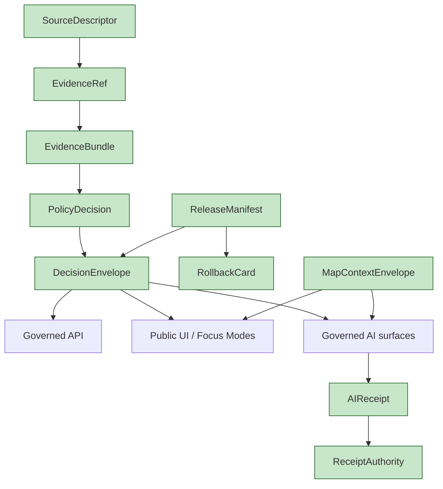

<!-- [KFM_META_BLOCK_V2]
doc_id: kfm://doc/architecture-cross-domain-shared-kernel
title: Shared Kernel — Cross-Domain Objects
type: standard
version: v0.1
status: draft
owners: <ARCHITECTURE-DOCTRINE-OWNER> · NEEDS VERIFICATION
created: 2026-05-24
updated: 2026-05-24
policy_label: public
related:
  - README.md
  - source-role-anti-collapse.md
  - cross-lane-relations.md
  - trust-membrane.md
  - responsibility-layers.md
  - kfm_unified_doctrine_synthesis.md#10
  - kfm_unified_doctrine_synthesis.md#11
  - connected-dots-architecture-brief.md
  - DomainDriven_Design_Reference.pdf
tags: [kfm, architecture, cross-domain, shared-kernel, evidence, doctrine]
notes:
  - PROPOSED placement; folder vs §12 flat-file pattern is OPEN-DR-10.
  - Kernel object renames are ADR-class per ai-build-operating-contract.md §28.
[/KFM_META_BLOCK_V2] -->

<a id="top"></a>

# Shared Kernel — Cross-Domain Objects

> *The small set of objects every KFM domain uses to compose without merging: `SourceDescriptor`, `EvidenceRef`, `EvidenceBundle`, `PolicyDecision`, `DecisionEnvelope`, `AIReceipt`, `ReceiptAuthority`, `ReleaseManifest`, `RollbackCard`, `MapContextEnvelope`.*


-blue)


**Status:** draft · **Owners:** `<ARCHITECTURE-DOCTRINE-OWNER>` *(NEEDS VERIFICATION)* · **Last updated:** 2026-05-24

> [!IMPORTANT]
> **DDD warns: Shared Kernels work only between closely coordinated teams.** KFM's "team" is **the doctrine itself**. The objects below are the kernel that lets all thirteen domains compose without each domain reinventing identity, evidence, policy, or release. **Renaming any kernel object is ADR-class** *(`ai-build-operating-contract.md` §28)*.

> [!NOTE]
> **This doc is the catalog and the contract surface.** Per-object schemas live under `schemas/contracts/v1/...`; per-object semantic contracts under `contracts/...`; per-object policy under `policy/...`. This doc tells implementers which object family to reach for and what each one guarantees across domains.

---

## Table of contents

1. [Scope](#1-scope)
2. [Kernel object catalog](#2-kernel-object-catalog)
3. [`SourceDescriptor`](#3-sourcedescriptor)
4. [`EvidenceRef` and `EvidenceBundle`](#4-evidenceref-and-evidencebundle)
5. [`PolicyDecision` and `DecisionEnvelope`](#5-policydecision-and-decisionenvelope)
6. [`AIReceipt` and `ReceiptAuthority`](#6-aireceipt-and-receiptauthority)
7. [`ReleaseManifest` and `RollbackCard`](#7-releasemanifest-and-rollbackcard)
8. [`MapContextEnvelope`](#8-mapcontextenvelope)
9. [Cross-object dependency graph](#9-cross-object-dependency-graph)
10. [Anti-patterns](#10-anti-patterns)
11. [Open questions and ADR triggers](#11-open-questions-and-adr-triggers)
12. [Related docs](#12-related-docs)
13. [Appendix](#13-appendix)

---

## 1. Scope

This doc enumerates the kernel object families and tells implementers where each one lives, what it guarantees, and how it composes with the others. It does **not** define field-level schemas *(those are in `schemas/contracts/v1/`)*; it does **not** define runtime Rego *(that is in `policy/`)*.

> [!TIP]
> **When this doc binds.** Any time a domain introduces a new record, a new join, a new API response shape, a new AI surface, or a new release flow. Reaching for an existing kernel object before defining a new one is the doctrine default.

[↑ Back to top](#top)

---

## 2. Kernel object catalog

> **Evidence basis:** `kfm_unified_doctrine_synthesis.md` §10 *(core object families, CONFIRMED)*; `kfm_unified_doctrine_synthesis.md` §11 *(finite outcome envelope, CONFIRMED)*; `connected-dots-architecture-brief.md` §6.

| Object | Cross-domain role | Canonical schema home *(PROPOSED)* | First-proof expectation |
|---|---|---|---|
| **`SourceDescriptor`** | Identity, source role, authority class, rights, sensitivity precheck. Every source from every domain admits through one schema. | `schemas/contracts/v1/sources/source-descriptor.schema.json` | A public-safe source is admitted only with role and rights known or explicitly held. |
| **`EvidenceRef`** | Stable pointer to an evidence object that supports a claim. | `schemas/contracts/v1/evidence/evidence-ref.schema.json` | Every consequential claim emits at least one. |
| **`EvidenceBundle`** | Resolved support object: pointers + the referenced records, internally consistent. | `schemas/contracts/v1/evidence/evidence-bundle.schema.json` | Resolves on every public surface; cite-or-abstain otherwise. |
| **`PolicyDecision`** | `ALLOW` / `DENY` / `RESTRICT` / `HOLD` / `ABSTAIN` with reasons and obligations. | `schemas/contracts/v1/policy/policy-decision.schema.json` | Visible on every governed action. |
| **`DecisionEnvelope`** / **`RuntimeResponseEnvelope`** | Finite output `ANSWER` / `ABSTAIN` / `DENY` / `ERROR` *(synthesis §11)*. | `schemas/contracts/v1/runtime/decision-envelope.schema.json` | No raw fluent answer reaches UI without envelope validation. |
| **`AIReceipt`** | Per-AI-surface-answer receipt: context + provider/model profile + hashes + policy decisions. | `schemas/contracts/v1/ai/ai-receipt.schema.json` | One per AI surface answer. |
| **`ReceiptAuthority`** | The authority binding that signs/attests a receipt *(model registry, release manifest, run record)*. | `schemas/contracts/v1/receipts/receipt-authority.schema.json` *(PROPOSED)* | Every `AIReceipt` and `RepresentationReceipt` resolves an authority. |
| **`ReleaseManifest`** | Authoritative record of what is `PUBLISHED`; same schema across domains. | `schemas/contracts/v1/release/release-manifest.schema.json` | No `PUBLISHED` state without an applicable manifest. |
| **`RollbackCard`** | Rollback target that preserves history while repointing current release state. | `schemas/contracts/v1/release/rollback-card.schema.json` | Every release has a rollback target. |
| **`MapContextEnvelope`** | Bounded context that the Focus Mode runtime sees of the map *(across all domains)*. | `schemas/contracts/v1/runtime/map-context-envelope.schema.json` | Focus Mode runtime accepts the envelope only after admission. |

> [!CAUTION]
> **Object renames are ADR-class.** A rename ripples across every domain dossier, every contract, every schema, every validator, every UI surface, and every release manifest. Open an ADR before introducing or retiring an object family.

[↑ Back to top](#top)

---

## 3. `SourceDescriptor`

The identity object every connector emits for every source it admits. It is the entry point of the lifecycle.

| Aspect | Guarantee |
|---|---|
| Source identity | Stable id + content/spec hash. |
| Source role | One of seven canonical classes *(`source-role-anti-collapse.md`)*. |
| Authority class | The publishing/regulating/administrating body or instrument. |
| Rights | License, attribution requirements, redistribution constraints. |
| Sensitivity precheck | Initial tier `T0`/`T1`/`T2`/`T3`; refined at Gate C. |
| Provenance | Acquisition timestamp, retrieval method, original URL/path if applicable. |

> [!IMPORTANT]
> **No source admits without a `SourceDescriptor`.** Gate A rejects any candidate ingest lacking the required fields.

[↑ Back to top](#top)

---

## 4. `EvidenceRef` and `EvidenceBundle`

The pair that backs every consequential claim.

| Object | Purpose | Lifecycle expectation |
|---|---|---|
| **`EvidenceRef`** | Stable pointer to an evidence record *(record id + source descriptor reference + optional offsets / quotes / fields)*. | Created at claim emission; never edited to point elsewhere — superseded by a new ref. |
| **`EvidenceBundle`** | Resolved set of records the refs point to, plus the refs themselves, plus consistency metadata *(spec hashes, role distribution, sensitivity)*. | Resolved on demand at every public surface; build-time pre-resolution is an optimization, not a substitute. |

| Property | Cross-domain rule |
|---|---|
| Multiple refs per claim | Permitted; bundle resolves all. |
| Mixed-role bundles | Permitted; bundle reports the distribution; UI MUST disclose mix. |
| Unresolved ref at `PUBLISHED` | Gate E denies; runtime returns `ABSTAIN` envelope. |
| Bundle with fail-closed member | Bundle takes fail-closed posture. |

> [!TIP]
> **Cite-or-abstain.** Every consequential claim on a public surface either cites a resolvable bundle or returns an `ABSTAIN` envelope. There is no third option.

[↑ Back to top](#top)

---

## 5. `PolicyDecision` and `DecisionEnvelope`

The pair that turns evaluation into a visible outcome.

| Object | Purpose |
|---|---|
| **`PolicyDecision`** | The Rego/OPA-style verdict: `ALLOW` / `DENY` / `RESTRICT` / `HOLD` / `ABSTAIN`, plus reasons and obligations. |
| **`DecisionEnvelope`** / **`RuntimeResponseEnvelope`** | The runtime container that wraps the decision and (when allowed) the answer payload. Finite outcomes: `ANSWER`, `ABSTAIN`, `DENY`, `ERROR`. |

| Cross-domain rule | Concrete shape |
|---|---|
| All governed APIs return an envelope | Bare payloads are forbidden at the public boundary. |
| The envelope carries the decision + the bundle ref | Reader can audit. |
| AI surfaces emit envelope + `AIReceipt` | Cite-or-abstain enforced. |
| `HOLD` is steward-visible only | Public surface translates `HOLD` to `ABSTAIN` with a reason class. |

[↑ Back to top](#top)

---

## 6. `AIReceipt` and `ReceiptAuthority`

The pair that makes AI surfaces auditable.

| Object | Purpose |
|---|---|
| **`AIReceipt`** | One per AI surface answer. Carries the bundle ref, model identity + version, prompt + context hash, policy decisions invoked, and the envelope that resulted. |
| **`ReceiptAuthority`** | The binding that attests the receipt: which model registry entry, which release manifest, which run record, which signing posture. Multiple receipt classes *(`AIReceipt`, `RepresentationReceipt`, `RunReceipt`)* share the authority object family. |

| Cross-domain rule | Concrete shape |
|---|---|
| Every AI surface answer emits an `AIReceipt` | Reader can audit which model said what about which bundle. |
| `ReceiptAuthority` resolvable at request time | Stale authority → `ABSTAIN`. |
| Receipt content addressable | Hash-stable; archived with the release. |
| Synthetic content carries `RepresentationReceipt` | In addition to `AIReceipt` for AI-generated synthetic content. |

> [!IMPORTANT]
> **A receipt without an authority is not a receipt.** It is a claim about a claim. The authority binding is what makes the receipt accountable.

[↑ Back to top](#top)

---

## 7. `ReleaseManifest` and `RollbackCard`

The pair that controls what is `PUBLISHED`.

| Object | Purpose |
|---|---|
| **`ReleaseManifest`** | The authoritative record of what artifacts are `PUBLISHED` under a given release identifier. Carries content/spec hashes, source-role distribution, sensitivity posture, evidence-closure receipts, and dependency manifests. |
| **`RollbackCard`** | The pre-staged rollback target for the release: the prior manifest + the criteria that trigger rollback + the operational steps. |

| Cross-domain rule | Concrete shape |
|---|---|
| No `PUBLISHED` artifact without a manifest entry | Gate G denies otherwise. |
| Manifests are immutable; corrections are new manifests | Edits are forbidden. |
| Every release has a rollback target | No release ships without a `RollbackCard`. |
| Manifest archived with receipts | Re-derivable audit trail. |

[↑ Back to top](#top)

---

## 8. `MapContextEnvelope`

The kernel object the Focus Mode runtime sees of the map across all domains.

| Aspect | Guarantee |
|---|---|
| Active extent | Bounding box + projection. |
| Active layers | Set of layer ids + their release manifests. |
| Active time | Time window if temporal. |
| User context posture | Public / steward / fail-closed. |
| Policy precheck | Envelope rejected at admission if posture inconsistent with layer set. |

> [!TIP]
> **Why this object is in the kernel.** Focus Mode composes across domains and the kernel; the runtime needs **one** envelope shape regardless of which domains are active. Single-domain map runtimes also benefit from the same envelope.

[↑ Back to top](#top)

---

## 9. Cross-object dependency graph



[↑ Back to top](#top)

---

## 10. Anti-patterns

| Anti-pattern | Mitigation |
|---|---|
| **Domain-local copies of kernel objects** *(e.g., `HydrologyEvidenceBundle` with a custom shape)* | Use the kernel object; extend via documented extension fields, not by forking. |
| **Bare API response without `DecisionEnvelope`** | Governed-API contract requires envelope; OPA denies otherwise. |
| **AI surface answer without `AIReceipt`** | Cite-or-abstain rule; `ABSTAIN` envelope is the fallback. |
| **Edit to a release manifest in place** | Manifests are immutable; correction is a new manifest with a rollback path. |
| **Receipt without resolvable authority** | Stale authority → `ABSTAIN`; never serve. |
| **Kernel object renamed without ADR** | ADR required before merge. |

[↑ Back to top](#top)

---

## 11. Open questions and ADR triggers

| Open item | Class | Suggested ADR title |
|---|---|---|
| Receipt schema layout — `schemas/contracts/v1/receipts/` vs `schemas/contracts/v1/<domain>/receipts/`? | Schema home | ADR-S-03 *(Atlas §24.12)*. |
| Should `Reality Boundary Note` become its own kernel object across all domains, or stay scoped to Planetary/3D? | Object family | "Reality Boundary as cross-domain kernel object". |
| `ReceiptAuthority` — single family or split by receipt class? | Object family | "ReceiptAuthority unification vs split". |
| `MapContextEnvelope` — extend to non-map runtimes *(timeline, narrative)* or keep map-only? | Object family | "ContextEnvelope generalization". |

[↑ Back to top](#top)

---

## 12. Related docs

| Reference | Role | Truth label |
|---|---|---|
| `README.md` *(this folder)* §8 | Landing summary of the kernel | CONFIRMED doctrine |
| `source-role-anti-collapse.md` *(sibling)* | `SourceDescriptor.source_role` rules | CONFIRMED doctrine |
| `cross-lane-relations.md` *(sibling)* | `EvidenceBundle` support invariant | CONFIRMED doctrine |
| `trust-membrane.md` *(sibling)* | `DecisionEnvelope` is how the membrane is enforced | CONFIRMED doctrine |
| `responsibility-layers.md` *(sibling)* | Kernel objects are orthogonal to the eight responsibility layers | CONFIRMED doctrine |
| `kfm_unified_doctrine_synthesis.md` §10 | Core object families | CONFIRMED doctrine |
| `kfm_unified_doctrine_synthesis.md` §11 | Finite outcome envelope | CONFIRMED doctrine |
| `connected-dots-architecture-brief.md` §6 | Architecture brief on shared kernel | CONFIRMED doctrine |
| `DomainDriven_Design_Reference.pdf` | External grounding for Shared Kernel pattern | EXTERNAL — reference only |
| `ai-build-operating-contract.md` §28 | ADR requirements for kernel changes | CONFIRMED doctrine |

[↑ Back to top](#top)

---

## 13. Appendix

<details>
<summary><strong>13.1 Kernel object map — at-a-glance</strong></summary>

```text
ADMISSION         → SourceDescriptor
EVIDENCE          → EvidenceRef + EvidenceBundle
POLICY            → PolicyDecision + DecisionEnvelope
AI SURFACES       → AIReceipt + ReceiptAuthority
RELEASE           → ReleaseManifest + RollbackCard
RUNTIME / MAP     → MapContextEnvelope
```

</details>

<details>
<summary><strong>13.2 Truth-label legend</strong></summary>

- **CONFIRMED** — verified this session from attached docs.
- **PROPOSED** — design / placement / inference not yet verified in implementation.
- **INFERRED** — derivable from confirmed evidence but not directly stated.
- **NEEDS VERIFICATION** — checkable, but not yet checked strongly enough to act as fact.

</details>

---

**Related (mini)** · [`README.md`](README.md) · [`source-role-anti-collapse.md`](source-role-anti-collapse.md) · [`cross-lane-relations.md`](cross-lane-relations.md) · [`trust-membrane.md`](trust-membrane.md) · [`responsibility-layers.md`](responsibility-layers.md)

**Last updated:** 2026-05-24 · **Doc version:** v0.1 · **Doc status:** draft · **Path status:** PROPOSED *(OPEN-DR-10)*

[↑ Back to top](#top)
