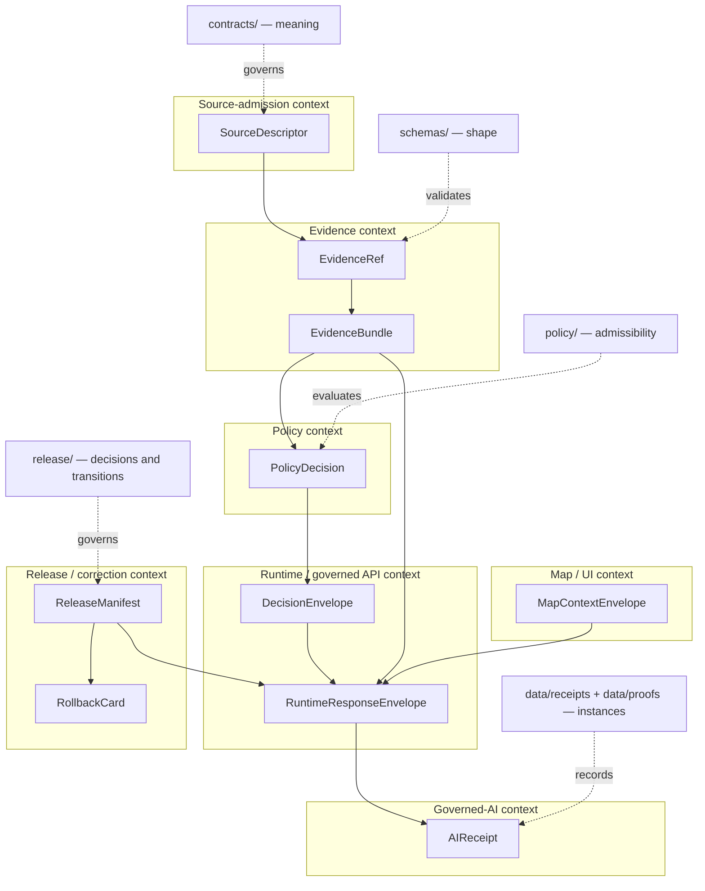

<!-- [KFM_META_BLOCK_V2]
doc_id: kfm://doc/architecture-cross-domain-shared-kernel
title: Shared Kernel — Cross-Domain Objects
type: architecture-standard
version: v0.3.0
prior_version: v0.1
status: draft; repository-grounded; DDD-reference-aligned; candidate-membership; non-authoritative
owners:
  - "@bartytime4life — verified CODEOWNERS review route; routing is not stewardship, independent review, approval, or release authority"
  - "NEEDS VERIFICATION — architecture, bounded-context, domain, contract, schema, policy, evidence, runtime, UI, AI, release, correction, compatibility, and validation stewards"
created: 2026-05-24
updated: 2026-08-20
policy_label: public; architecture; cross-domain; shared-kernel; context-map; evidence-first; non-release; non-publication
owning_root: docs/
responsibility_root: docs/
responsibility: Explain the DDD Shared Kernel relationship, assess current KFM cross-domain object-family candidates against repository evidence, and define admission, change, validation, correction, and rollback boundaries without becoming semantic, schema, policy, registry, runtime, release, or publication authority.
canonical_relationship: Same-path explanatory architecture reference; no object family, shared-kernel membership, contract, schema, policy, register, root, release, or publication authority is created.
truth_posture: >-
  CONFIRMED current repository paths, accepted Directory Rules placement authority,
  the fixture-only DomainContextMapAssessmentCandidate profile, and the inspected
  contract/schema/validator maturity of named object families / PROPOSED every
  Shared Kernel membership classification and the admission protocol in this page /
  UNKNOWN adopted Shared Kernel membership, deployed cross-domain composition,
  public-client use, correction propagation, and rollback execution / NEEDS
  VERIFICATION accountable participating contexts, joint ownership, compatibility
  policy, continuous-integration coverage, human review, and exact-head hosted checks.
evidence_snapshot:
  repository: bartytime4life/Kansas-Frontier-Matrix
  visibility: public
  base_ref: main
  base_commit: dcd405579dd0b135435102e075be83d28f2bdf63
  target_prior_blob: 4b6e37b446c7f63bee02a966c8c0a0c8d9d05a37
  codeowners_blob: dd2a84aa514d8ecd9208bc347f90f9a2ed37dd61
  directory_rules_blob: fd49a0b83e55cef52c1124281f093e263526898d
  adr_0029_blob: a4de0d7a96b78da59cfc499d1025e1508afd8dd9
  cross_domain_readme_blob: 3353a0a0ab5fe3f8f5fdea937b8eecfa34b81032
  domain_context_map_contract_blob: baba984fbab331550f14a49f0713866d5178072f
  domain_context_map_schema_blob: f91db6efd377b6440d4061bae7b9dc9e359d7151
  object_family_register_blob: 8673b21ea49cb4a2852595208efdb206ed040690
  source_descriptor_contract_blob: b57ae5ccc042c1423b75c168438800384c9b6713
  evidence_ref_contract_blob: afd3a964435445edbb694b5edf16e2b6ddd49a92
  policy_decision_contract_blob: ebfe97f98263e6309db6d2772cb2c5e548819650
  runtime_policy_compat_blob: 810433540004e4e7f407a64ea75685d9fcb61860
  decision_envelope_contract_blob: b5120a208910f5e2907874b03af1fc8c7f43363d
  runtime_response_contract_blob: 5060aaaa30fea37b6eeea6e1428b9effa6a163bd
  ai_receipt_contract_blob: f4d8183dbed38f83144f6d9dbde30ae02a01edb8
  rollback_card_contract_blob: c6d3c35c56b064e04c3a2532f4709d938d7b0c1a
  map_context_contract_blob: c6367306f14f9da56b3e3cbe7fad9d5545a0cdbf
  ddd_reference_sha256: sha256:4406daa99ff0e3d58757d62d40358c9fd745f95137e99f14602659d0c3f54e55
inspection_boundary: >-
  Current-session GitHub reads covered the complete prior target, the cross-domain
  index, accepted ADR-0029 and adopted Directory Rules bytes, CODEOWNERS, the
  fixture-only DomainContextMapAssessmentCandidate contract/schema, the partial
  Object Family Register, and the named source, evidence, policy, runtime, AI,
  release, rollback, and map-context contracts. Repository search also checked for
  ReceiptAuthority and found no matching repository surface. The attached
  Domain-Driven Design Reference supplied the Shared Kernel pattern definition.
  No domain team agreement, accepted Shared Kernel membership decision, deployed
  API, live policy evaluator, authoritative evidence service, public client,
  AIReceipt store, production release packet, correction cascade, cache
  invalidation, or rollback execution was exercised.
related:
  - ./README.md
  - ./source-role-anti-collapse.md
  - ./cross-lane-relations.md
  - ./trust-membrane.md
  - ./responsibility-layers.md
  - ./multi-domain-placement.md
  - ../../doctrine/directory-rules.md
  - ../../adr/ADR-0029-adopt-directory-governance-standard-v2.md
  - ../../../control_plane/domain_lane_register.yaml
  - ../../../control_plane/cross_domain_seam_register.yaml
  - ../../../control_plane/object_family_register.yaml
  - ../../../contracts/governance/domain_context_map_assessment.md
  - ../../../schemas/contracts/v1/governance/domain_context_map_assessment.schema.json
  - ../../../contracts/OBJECT_MAP.md
  - ../../../contracts/source/source_descriptor.md
  - ../../../contracts/evidence/evidence_ref.md
  - ../../../contracts/evidence/evidence_bundle.md
  - ../../../contracts/policy/policy_decision.md
  - ../../../contracts/runtime/decision_envelope.md
  - ../../../contracts/runtime/runtime_response_envelope.md
  - ../../../contracts/runtime/ai_receipt.md
  - ../../../contracts/release/release_manifest.md
  - ../../../contracts/release/rollback_card.md
  - ../../../contracts/ui/map_context_envelope.md
tags: [kfm, architecture, cross-domain, shared-kernel, bounded-context, context-map, published-language, compatibility, evidence, policy, runtime, release, correction]
notes:
  - "v0.3.0 replaces a proposal-era universal object list with a repository-grounded DDD relationship assessment while preserving the same path, doc_id, H1, top anchor, and thirteen numbered H2 headings."
  - "The DDD Shared Kernel pattern requires an explicitly bounded, deliberately small shared subset plus coordinated change and continuous integration; broad reuse or documentation mention alone is insufficient."
  - "The current DomainContextMapAssessmentCandidate may label a synthetic proposal SHARED_KERNEL, but all authority flags remain false, public_join_allowed remains false, and assessment_state remains REVIEW_REQUIRED."
  - "ReceiptAuthority is not presented as a current KFM object family because current repository search found no matching contract, schema, register entry, validator, or implementation surface."
  - "No doctrine, ADR, register, contract, schema, policy, fixture, validator, test, workflow, runtime, source, lifecycle, release, deployment, publication, or repository setting is changed."
[/KFM_META_BLOCK_V2] -->

<a id="top"></a>

# Shared Kernel — Cross-Domain Objects

KFM uses **Shared Kernel** as a Domain-Driven Design context-map relationship, not as a synonym for every object used in more than one domain. A Shared Kernel is an explicitly bounded, deliberately small subset of model and implementation that named participants agree to co-maintain under coordinated change and continuous integration. Until KFM accepts that relationship for specific participants and members, the object families below remain **cross-domain contract candidates**, not an adopted universal kernel.

[](#status-and-evidence-boundary)
[](#directory-rules-basis)
[](#shared-kernel-pattern-boundary)
[](#current-bounded-proof)
[](#membership-posture)
[](#authority-boundary)

> [!IMPORTANT]
> **Shared Kernel is a relationship and change commitment.** Reusing the same JSON field name, importing a package, linking to a contract, or consuming a governed API does not by itself make two bounded contexts joint owners of one model.

> [!CAUTION]
> **No adopted KFM Shared Kernel membership was verified.** The repository contains substantial draft/proposed contract-schema packets and a fixture-only context-map assessment that permits `SHARED_KERNEL` as a proposal label. Neither establishes accepted members, participating teams, shared mutation rights, public joins, runtime composition, or release authority.

> [!WARNING]
> **This page is explanatory architecture, not the kernel.** Semantic meaning belongs in `contracts/`; machine shape in `schemas/`; admissibility in `policy/`; implementation in owning `apps/`, `packages/`, and `runtime/` lanes; instances in governed data/accountability roots; and release, correction, withdrawal, and rollback in their owning families.

## Table of contents

1. [Scope](#1-scope)
2. [Kernel object catalog](#2-kernel-object-catalog)
3. [`SourceDescriptor`](#3-sourcedescriptor)
4. [`EvidenceRef` and `EvidenceBundle`](#4-evidenceref-and-evidencebundle)
5. [`PolicyDecision` and `DecisionEnvelope`](#5-policydecision-and-decisionenvelope)
6. [`AIReceipt` and `ReceiptAuthority`](#6-aireceipt-and-receiptauthority)
7. [`ReleaseManifest` and `RollbackCard`](#7-releasemanifest-and-rollbackcard)
8. [`MapContextEnvelope`](#8-mapcontextenvelope)
9. [Cross-object dependency graph](#9-cross-object-dependency-graph)
10. [Anti-patterns](#10-anti-patterns)
11. [Open questions and ADR triggers](#11-open-questions-and-adr-triggers)
12. [Related docs](#12-related-docs)
13. [Appendix](#13-appendix)

---

## Status and evidence boundary

| Question | Current evidence-backed answer |
|---|---|
| Is this an existing tracked architecture page? | **CONFIRMED.** The same path and document identity exist at the inspected `main` commit. |
| Is the path still provisional under `OPEN-DR-10`? | **No current basis.** Accepted [ADR-0029](../../adr/ADR-0029-adopt-directory-governance-standard-v2.md) adopts [Directory Rules v2](../../doctrine/directory-rules.md); an established human cross-domain architecture explanation belongs here. |
| Has KFM adopted a Shared Kernel relationship? | **UNKNOWN / not verified.** No accepted membership decision, named participant agreement, or authoritative membership register was found. |
| Is `SHARED_KERNEL` represented in machine-checkable repository artifacts? | **CONFIRMED, bounded.** The fixture-only `DomainContextMapAssessmentCandidate` schema permits the label but fixes all authority claims to false, requires `REVIEW_REQUIRED`, and prohibits public joins. |
| Are the object families in this page implemented? | **Mixed.** Several have contracts, schemas, fixtures, validators, tests, or candidate builders. Their semantic profiles remain draft/proposed, and end-to-end composition is not established by those files alone. |
| Is the partial Object Family Register authoritative or complete? | **No.** It declares `PROPOSED`, `navigational_index_only`, and `partial`, and currently covers six runtime families only. |
| Does `ReceiptAuthority` exist as a verified repository family? | **No matching repository surface was found.** Treat the term as unsupported/UNKNOWN, not as current architecture. |
| Does this revision change runtime or public state? | **No.** Documentation and generated authoring provenance only. |

<a id="directory-rules-basis"></a>

### Directory Rules basis

The owning root is `docs/` because this artifact explains architecture to humans. Its responsibility signature is:

| Axis | Value |
|---|---|
| Artifact kind | Human architecture standard |
| Authority owner | Cross-domain architecture explanation |
| Lifecycle stage | Not applicable; this is not a data instance |
| Execution role | None |
| Scope | Cross-domain context-map relationship |
| Exposure | Public repository documentation |
| Mutability | Versioned through review |
| Retention | Durable |
| Placement result | `PLACE` at the existing same path |
| Structural effect | None |

<a id="authority-boundary"></a>

### Authority boundary

| Surface | Owns | This page may do |
|---|---|---|
| `docs/doctrine/` and accepted ADRs | Governing invariants and accepted decisions | Explain and link; never silently amend or accept. |
| `control_plane/` | Machine-readable projections and indexes | Report current projection state; never convert projection into authority. |
| `contracts/` | Semantic meaning and compatibility promises | Summarize verified contract posture; never redefine fields. |
| `schemas/` | Machine shape | Point to schema evidence; never claim a schema pass adopts a model. |
| `policy/` | Allow, deny, restrict, abstain, rights, sensitivity, and obligations | State closure requirements; never execute or invent policy. |
| implementation roots | Executable behavior and shared code | Cite bounded implementation evidence; never infer deployment. |
| `data/` accountability families | Lifecycle instances, registries, receipts, proofs, catalogs, and published carriers | Keep object families separate; never mutate state from prose. |
| `release/` and release contracts | Promotion, release, correction, withdrawal, rollback, and signatures | State prerequisites; never authorize a transition. |
| this page | Human relationship explanation | Define candidate-admission questions, evidence limits, validation, and rollback guidance. |

<a id="current-bounded-proof"></a>

### Current bounded proof

The repository has a fixture-only [Domain Context Map Assessment Candidate](../../../contracts/governance/domain_context_map_assessment.md) and paired [schema](../../../schemas/contracts/v1/governance/domain_context_map_assessment.schema.json). For a proposed `SHARED_KERNEL` mapping, that packet preserves these controls:

- every participating lane retains its own EvidenceBundle support;
- source roles remain distinct;
- the most restrictive sensitivity and policy posture controls;
- every participant requires its own released state before public composition;
- shared mutation, lifecycle writes, register writes, joins, release, publication, and public use remain false; and
- a local `PASS` remains `REVIEW_REQUIRED` rather than adoption.

That is proof of a bounded candidate grammar, not proof of a Shared Kernel in use.

[Back to top](#top)

---

## 1. Scope

This page answers four questions:

1. what the DDD Shared Kernel pattern means for KFM;
2. which current repository object families are plausible candidates or adjacent published-language surfaces;
3. what evidence is required before a candidate becomes an accepted shared subset; and
4. how change, compatibility, validation, correction, and rollback must work after admission.

The lifecycle remains:

```text
RAW -> WORK / QUARANTINE -> PROCESSED -> CATALOG / TRIPLET -> PUBLISHED
```

Shared Kernel membership cannot move an object through that lifecycle, bypass quarantine, or convert a shared model into released public state.

It does **not**:

- declare a universal kernel;
- make all domains joint owners of named objects;
- register, accept, rename, or retire an object family;
- define field-level contract or schema content;
- authorize shared database writes, joins, imports, source activation, runtime behavior, release, or publication;
- require every domain to emit every candidate object;
- replace the cross-domain seam register, object-family register, contract object map, or accepted ADR process.

<a id="shared-kernel-pattern-boundary"></a>

### Shared Kernel pattern boundary

The supplied DDD reference describes Shared Kernel as an intimate interdependency: named participants explicitly bound a small shared portion of their model and associated implementation, consult one another before changing it, and continuously integrate it so their languages do not drift.

KFM therefore distinguishes relationship patterns before admitting a kernel:

| Need | Preferred relationship posture | Why |
|---|---|---|
| Two contexts truly co-own a small semantic and implementation subset | **Shared Kernel candidate** | Joint change and CI may be cheaper than translation, but coupling is explicit. |
| One context publishes stable contracts consumed by others | **Published Language / Open Host Service candidate** | Consumers depend on a governed interface without becoming co-owners. |
| A consumer must translate another context's model | **Anticorruption Layer candidate** | Translation preserves both models and limits upstream leakage. |
| Contexts can evolve independently without meaningful integration | **Separate Ways candidate** | Avoids artificial coupling and universal object bags. |
| Relationship or ownership evidence is incomplete | **UNRESOLVED / HOLD** | Do not infer a Shared Kernel because reuse appears convenient. |

> [!TIP]
> Most current KFM trust objects are better described as **published semantic families** until an accepted decision proves joint ownership, shared implementation, compatibility, and CI obligations.

### Membership admission test

A candidate enters an accepted Shared Kernel only when all answers below are evidence-backed:

1. **Participants:** Which registered bounded contexts and accountable stewards share it?
2. **Boundary:** What exact semantic fields, code, database design, or package surface is inside—and what is outside?
3. **Necessity:** Why is joint ownership safer or simpler than Published Language plus translation?
4. **Authority:** Which one semantic contract is writable, and which files are schemas, policy, code, fixtures, or projections?
5. **Change control:** Who must be consulted, what compatibility class applies, and which changes require an ADR?
6. **Integration:** Which deterministic tests run across every participant before merge?
7. **Release:** How do participant release states, evidence, rights, sensitivity, and correction posture combine without collapse?
8. **Rollback:** How can one participant or kernel version be reverted without rewriting shared history or corrupting another context?

If any required answer is missing, membership remains **HOLD**.

[Back to top](#top)

---

## 2. Kernel object catalog

<a id="membership-posture"></a>

The historical title “kernel object catalog” is preserved for navigation. The table below is an **architecture assessment**, not a canonical membership registry.

| Family | Verified repository packet | Current DDD relationship assessment | Membership posture |
|---|---|---|---|
| `SourceDescriptor` | Draft/proposed contract and paired schemas; singular/plural schema-path drift remains visible. | Source-admission **Published Language** is the safer default; joint domain ownership is not established. | **PROPOSED candidate; HOLD** |
| `EvidenceRef` | Draft/proposed contract, paired schema, fixtures, dedicated validator, and focused polarity tests are described in current repository evidence. | Strong cross-domain published pointer candidate; not evidence closure. | **PROPOSED candidate; HOLD** |
| `EvidenceBundle` | Draft/proposed contract and paired schema; claim-scope closure semantics are explicit. | Strong cross-domain evidence language; a Shared Kernel requires participant/implementation ownership evidence. | **PROPOSED candidate; HOLD** |
| `PolicyDecision` | Draft/proposed canonical policy contract and paired schema; runtime compatibility pointer is explicitly non-canonical. | Policy context should publish the decision language; domains need not co-own policy semantics. | **Published-language candidate; HOLD** |
| `DecisionEnvelope` | Draft/proposed runtime contract and paired schema. | Runtime transport language, distinct from policy evaluation and public response. | **Published-language candidate; HOLD** |
| `RuntimeResponseEnvelope` | Draft/proposed contract/schema plus finite-outcome candidate builders and bounded tests. | Governed client boundary, not a universal domain model. | **Runtime-boundary candidate; HOLD** |
| `AIReceipt` | Draft/proposed contract/schema and validator surface; runtime persistence/emission remains unverified. | Context-specific accountability object only when AI participates. | **Context-specific candidate; HOLD** |
| `ReceiptAuthority` | No matching contract, schema, registry entry, validator, or implementation surface found in current repository search. | Unsupported term; do not use as current architecture. | **UNKNOWN / not admitted** |
| `ReleaseManifest` | Draft/proposed dual-profile contract/schema; strict profile is fixture-only and non-authoritative. | Release context publishes a verifiable release language; domains do not co-own release authority. | **Release-language candidate; HOLD** |
| `RollbackCard` | Draft/proposed closed fixture-first contract/schema/validator/test packet; explicitly non-executing. | Release/recovery language; not a universal domain model or executed rollback. | **Release-language candidate; HOLD** |
| `MapContextEnvelope` | Proposed, inactive renderer-neutral contract/schema/validator/test packet. | UI/map context projection, not a universal shared model. | **Context-specific candidate; HOLD** |

### What the table does not mean

- A contract and schema do not prove adoption.
- A validator pass does not prove semantic correctness or release readiness.
- Broad reuse does not prove joint ownership.
- A candidate may be consumed through a governed API without becoming a Shared Kernel member.
- An omitted family is not rejected; it simply was not admitted by this documentation revision.
- Adding or removing a row does not change the underlying object family.

### Minimum membership record

Before any row is labeled accepted, KFM needs an authoritative decision or register entry recording at least:

```text
family_id
participating_contexts
explicit_boundary
semantic_contract_ref
schema_profile_refs
shared_implementation_refs
compatibility_policy
required_cross-context_tests
change_approvers_or_review_roles
correction_and_supersession_rules
rollback_target
adoption_decision_ref
```

This page does not create that record.

[Back to top](#top)

---

## 3. `SourceDescriptor`

[`SourceDescriptor`](../../../contracts/source/source_descriptor.md) records how KFM may treat a source before source material shapes evidence, catalog, map, graph, API, release, or AI outputs. It is source-admission metadata, not source truth.

### Current repository posture

- **CONFIRMED:** the lowercase semantic contract exists under `contracts/source/`.
- **CONFIRMED:** paired singular and plural schema lanes exist and the contract itself records canonical/legacy path tension.
- **PROPOSED:** the schema profile and richer source-admission semantics remain draft.
- **NEEDS VERIFICATION:** path convergence, complete validator/fixture coverage, registry instances, policy execution, source activation, and all consumers.

### Cross-domain rule

Every participating context may reference one admitted `SourceDescriptor`, but reference does not make the context a co-owner. The source context owns admission semantics; domain lanes preserve the admitted source role, authority rank, rights, sensitivity, cadence, access, citation, and release limitations.

A Shared Kernel decision would be justified only if named contexts truly maintain the same descriptor model and implementation together. Otherwise use the source contract as a Published Language through governed interfaces.

### Non-collapse invariants

- A descriptor cannot make claims true.
- `source_role` cannot be upgraded by a downstream join, map, model, or AI answer.
- Unknown rights, sensitivity, or access posture fails closed.
- Descriptor release state is not artifact release approval.
- Source registry records, evidence, policy decisions, receipts, and ReleaseManifests remain separate.

[Back to top](#top)

---

## 4. `EvidenceRef` and `EvidenceBundle`

[`EvidenceRef`](../../../contracts/evidence/evidence_ref.md) and [`EvidenceBundle`](../../../contracts/evidence/evidence_bundle.md) are deliberately different:

| Object | Role | It does not prove |
|---|---|---|
| `EvidenceRef` | Small governed pointer to a measurement, record, dataset, or artifact. | Resolution, claim closure, rights, sensitivity, policy, review, or release. |
| `EvidenceBundle` | Claim-scope closure package binding refs, source records, citations, rights, sensitivity, transforms, checksums, and spec identity. | Policy permission, review approval, release, publication, or fitness for every use. |

### Cross-domain closure

For a composite claim spanning multiple domain contexts:

1. each participant retains its own evidence support;
2. the relation itself needs evidence when it asserts more than co-location or navigation;
3. source-role, spatial, temporal, uncertainty, rights, sensitivity, and correction semantics stay explicit;
4. the most restrictive policy/sensitivity posture controls public composition;
5. unresolved, corrected, superseded, revoked, or withdrawn support fails closed; and
6. public clients receive governed projections, never direct proof-store access.

The current fixture-only context-map assessment encodes the minimum `EACH_PARTICIPANT_EVIDENCE_BUNDLE_REQUIRED` rule. It does not resolve those bundles or authorize a public join.

### Shared Kernel assessment

The pair is a plausible shared semantic subset because many contexts need the same pointer/closure distinction. Adoption still requires explicit participants, a version/compatibility policy, shared implementation ownership, cross-context fixtures, and correction propagation tests. Until then, treat the contracts as published evidence language.

[Back to top](#top)

---

## 5. `PolicyDecision` and `DecisionEnvelope`

KFM currently has three related but non-interchangeable surfaces:

| Surface | Current semantic owner | Purpose |
|---|---|---|
| [`PolicyDecision`](../../../contracts/policy/policy_decision.md) | Policy contract lane | Records one finite policy evaluation event, reasons, obligations, policy family, and time. |
| [`DecisionEnvelope`](../../../contracts/runtime/decision_envelope.md) | Runtime contract lane | Carries finite runtime decision posture to downstream orchestration. |
| [`RuntimeResponseEnvelope`](../../../contracts/runtime/runtime_response_envelope.md) | Runtime/API contract lane | Carries the client-facing finite outcome, EvidenceRefs, policy/freshness/correction state, and answer-only precision disclosure. |

[`contracts/runtime/policy_decision.md`](../../../contracts/runtime/policy_decision.md) is a compatibility pointer to the canonical policy contract; it is not a second PolicyDecision authority.

### Outcome boundary

The current paired policy/runtime schemas use the finite client-facing outcomes:

```text
ANSWER | ABSTAIN | DENY | ERROR
```

Do not collapse these with engine-native or governance vocabularies such as `ALLOW`, `RESTRICT`, `HOLD`, `PASS`, or `RESOLVED`. Every mapping needs an accepted semantic profile and fail-closed tests.

### Shared Kernel assessment

These objects are better treated as Published Languages owned by policy/runtime contexts unless KFM explicitly chooses joint ownership. Domain lanes should consume the decision/envelope contracts without redefining policy outcomes, safe reason codes, obligations, evidence closure, or release state.

### Required separation

- `PolicyDecision` does not publish.
- `DecisionEnvelope` does not execute policy.
- `RuntimeResponseEnvelope` does not resolve evidence by itself.
- `ANSWER` does not bypass rights, sensitivity, review, release, correction, or rollback.
- `ERROR` never falls back to an unsafe answer.

[Back to top](#top)

---

## 6. `AIReceipt` and `ReceiptAuthority`

[`AIReceipt`](../../../contracts/runtime/ai_receipt.md) records accountable AI participation: adapter/model reference, input/output digests, policy-decision reference, citation-validation reference, and finite outcome. It does not make generated language true or publishable.

### AIReceipt posture

- It is relevant only when AI participates in a governed runtime operation.
- It remains separate from EvidenceBundle, PolicyDecision, RuntimeResponseEnvelope, ReviewRecord, proof, and release records.
- It should contain digests and safe references, not raw prompts, credentials, sensitive payloads, private model internals, or chain-of-thought.
- Runtime emission, durable storage, access control, retention, correction linkage, and public projection remain **NEEDS VERIFICATION**.
- Repository-authoring `GENERATED_RECEIPT` records AI-assisted artifact authorship and is a different object family from runtime `AIReceipt`.

### `ReceiptAuthority` status

Current repository search found no verified `ReceiptAuthority` contract, schema, register entry, validator, test, or implementation surface. Therefore:

- this page does not assert that `ReceiptAuthority` exists;
- new docs and code must not depend on it as current architecture;
- existing receipt fields and resolvable policy/review/release/signature references remain the evidence-backed path; and
- introducing a distinct authority-binding family requires semantic justification, Directory Rules placement, compatibility analysis, schema/policy/test closure, and an accepted decision if it changes object-family authority.

### Shared Kernel assessment

`AIReceipt` is a context-specific published accountability language, not a universal domain kernel member. A future shared receipt abstraction must preserve the difference among `AIReceipt`, `RunReceipt`, `GENERATED_RECEIPT`, validation receipts, transform receipts, proof artifacts, and release records.

[Back to top](#top)

---

## 7. `ReleaseManifest` and `RollbackCard`

[`ReleaseManifest`](../../../contracts/release/release_manifest.md) binds a release candidate or released artifact set to identity, digests, evidence, policy, review, rights, sensitivity, attestations, correction lineage, and rollback support. [`RollbackCard`](../../../contracts/release/rollback_card.md) records a proposed recovery disposition and target. Neither object executes its own state transition.

### Current repository posture

| Family | Bounded proof | Limit |
|---|---|---|
| `ReleaseManifest` | A draft dual-profile schema preserves permissive legacy compatibility and adds a closed fixture-only strict candidate with a validator and tests. | The strict candidate remains inactive and cannot prove reference resolution, signatures, policy, authenticated review, persistence, publication, or public use. |
| `RollbackCard` | A closed fixture-first schema, validator, tests, workflow, and finite candidate dispositions exist. | Governance flags remain false; no rollback, cache invalidation, alias mutation, correction, withdrawal, or public-state mutation is executed. |

### Release-context rule

Release and recovery are their own authority boundary. Domain contexts may reference the release language, but they do not co-own release approval merely because they produce artifacts.

A mature flow keeps these families distinct:

```text
EvidenceBundle
  + PolicyDecision
  + ReviewRecord
  + validation / proof / receipt support
  -> PromotionDecision
  -> ReleaseManifest
  -> governed public state
  -> CorrectionNotice / WithdrawalNotice / RollbackCard as needed
```

### Shared Kernel assessment

These are cross-domain Published Languages owned by release/correction contexts unless an accepted decision proves a smaller jointly maintained subset. Any shared implementation must preserve immutable history, deterministic identity, correction propagation, cache invalidation, and a tested rollback target.

[Back to top](#top)

---

## 8. `MapContextEnvelope`

[`MapContextEnvelope`](../../../contracts/ui/map_context_envelope.md) is a renderer-neutral request-context projection from the map shell to governed API, Evidence Drawer, or Focus Mode admission. It carries released layer identity, selected feature identity, time/area scope, EvidenceRefs, and bounded filters.

### Current repository posture

- **CONFIRMED:** contract, schema, validator, tests, and synthetic fixtures are represented in the repository.
- **PROPOSED / inactive:** the profile is no-network and explicitly non-authoritative.
- **NEEDS VERIFICATION:** real Explorer assembly, transport, governed API admission, evidence resolution, policy, release lookup, and client behavior.

### Boundary

The envelope accepts stable KFM identifiers, not MapLibre implementation objects or raw rendered feature blobs. It must not carry direct canonical-store values, hidden feature properties, style internals, raw proof-store content, or model output.

Downstream services independently resolve current EvidenceBundles, policy, review, release, correction, and rollback state. A valid context envelope does not make a selected feature true or safe to answer about.

### Shared Kernel assessment

`MapContextEnvelope` is a UI/map-context published language, not a universal cross-domain model. It becomes a Shared Kernel candidate only if multiple bounded contexts jointly maintain the same semantic and implementation subset rather than consuming it through the governed UI/API boundary.

[Back to top](#top)

---

## 9. Cross-object dependency graph

> [!NOTE]
> This diagram is an **illustrative dependency and authority map**, not a verified runtime call graph. Each arrow means “may reference or depend on under an accepted profile,” not “is currently composed or deployed.”


```mermaid
flowchart TB
  subgraph SOURCE["Source-admission context"]
    SD["SourceDescriptor"]
  end

  subgraph EVIDENCE["Evidence context"]
    ER["EvidenceRef"]
    EB["EvidenceBundle"]
    ER --> EB
  end

  subgraph POLICY["Policy context"]
    PD["PolicyDecision"]
  end

  subgraph RUNTIME["Runtime / governed API context"]
    DE["DecisionEnvelope"]
    RRE["RuntimeResponseEnvelope"]
    DE --> RRE
  end

  subgraph AI["Governed-AI context"]
    AR["AIReceipt"]
  end

  subgraph UI["Map / UI context"]
    MCE["MapContextEnvelope"]
  end

  subgraph RELEASE["Release / correction context"]
    RM["ReleaseManifest"]
    RC["RollbackCard"]
    RM --> RC
  end

  SD --> ER
  EB --> PD
  PD --> DE
  EB --> RRE
  RM --> RRE
  MCE --> RRE
  RRE --> AR

  CONTRACTS["contracts/ — meaning"] -. governs .-> SD
  SCHEMAS["schemas/ — shape"] -. validates .-> ER
  POLICIES["policy/ — admissibility"] -. evaluates .-> PD
  ACCOUNTABILITY["data/receipts + data/proofs — instances"] -. records .-> AR
  RELEASE_ROOT["release/ — decisions and transitions"] -. governs .-> RM
```

### Dependency law

- Domain contexts depend on shared/published semantic contracts; contracts do not depend on domain implementations.
- Schemas project contract shape; they do not own meaning.
- Policy may consume evidence and context; it does not rewrite evidence.
- Runtime envelopes project governed results; they do not become canonical stores.
- Release manifests bind released artifacts; they do not replace evidence or policy.
- AI and map contexts remain downstream carriers and interpreters.

[Back to top](#top)

---

## 10. Anti-patterns

| Anti-pattern | Why it fails | Required correction |
|---|---|---|
| Calling every widely used object a Shared Kernel member | Confuses reuse with joint ownership and hides coupling. | Run the membership admission test; prefer Published Language or ACL where appropriate. |
| Treating this page as the object catalog or contract surface | Makes docs a parallel semantic authority. | Keep meaning in contracts and machine projections explicitly non-authoritative unless accepted. |
| Requiring every domain to emit every candidate family | Turns cross-domain architecture into a universal object bag. | Require only operation-relevant contracts through explicit interfaces. |
| Creating `HydrologyEvidenceBundle`, `GeologyPolicyDecision`, or similar forks | Fragments shared semantics and blocks cross-context compatibility. | Extend through accepted profiles or translation, not silent copies. |
| Inventing `ReceiptAuthority` because older prose named it | Converts a source-memory term into repo fact. | Keep UNKNOWN; introduce only through dependency-closed design and review. |
| Treating schema validity as model adoption | Shape conformance does not prove ownership, policy, evidence, release, or runtime use. | Preserve truth labels and require the accepted membership record. |
| Collapsing `PolicyDecision`, `DecisionEnvelope`, and `RuntimeResponseEnvelope` | Loses evaluator, transport, and client-boundary distinctions. | Keep separate contracts and explicit mappings. |
| Collapsing receipts, proofs, reviews, and release manifests | Turns process memory into authority. | Preserve distinct object families and resolvable references. |
| Sharing a database table without a shared semantic/change contract | Creates hidden mutual mutation and deployment coupling. | Deny or split; define one owner or an explicit Shared Kernel decision. |
| Editing release or rollback objects in place | Destroys lineage and makes correction uninspectable. | Issue new immutable records with supersession and rollback links. |
| Passing raw renderer/model/store objects across contexts | Leaks implementation and protected data through the trust membrane. | Use bounded, renderer/provider-neutral governed envelopes. |
| Letting one participant change the kernel without consultation or cross-context tests | Violates the defining Shared Kernel commitment. | Block merge until compatibility and participant CI pass. |

[Back to top](#top)

---

## 11. Open questions and ADR triggers

| Open item | Current state | Closure evidence / trigger |
|---|---|---|
| Accepted Shared Kernel relationship | **UNKNOWN / HOLD** | Accepted context-map decision naming participants, boundary, ownership, and non-effects. |
| Membership registry | **Absent or not verified** | One authoritative, machine-checkable membership projection tied to accepted decisions; this page remains explanatory. |
| Participant stewardship | **NEEDS VERIFICATION** | Verified accountable roles/identities and consultation rules. |
| Shared implementation boundary | **UNKNOWN** | Exact package/code/database subset and dependency direction. |
| Compatibility and versioning | **NEEDS VERIFICATION** | SemVer/change classes, deprecation window, migration fixtures, and consumer support policy. |
| Cross-context CI | **NEEDS VERIFICATION** | Deterministic tests covering every participating context and exact negative cases. |
| SourceDescriptor schema-path convergence | **CONFLICTED / NEEDS VERIFICATION** | Accepted canonical path, compatibility migration, consumer closure, and rollback. |
| PolicyDecision ↔ runtime envelope mapping | **PROPOSED / NEEDS VERIFICATION** | Accepted mapping from policy-engine results to policy/runtime/client outcomes with fail-closed tests. |
| `ReceiptAuthority` | **UNKNOWN / unsupported** | Semantic need, owning root, contract/schema/policy/test packet, compatibility analysis, and decision if authority changes. |
| ReleaseManifest profile | **Dual-profile / fixture-only strict candidate** | Production contract decision, reference/signature verification, policy/review integration, and release drill. |
| `MapContextEnvelope` membership | **Context-specific candidate** | Evidence that multiple contexts jointly own it rather than consume a published UI contract. |
| Correction propagation | **UNKNOWN** | Replay and invalidation tests across EvidenceBundles, envelopes, receipts, caches, maps, exports, and AI responses. |
| Rollback execution | **UNKNOWN** | Reviewed rehearsal with immutable records, public-state verification, and restoration evidence. |

### ADR triggers

Open or amend an ADR when work would:

- add, remove, rename, split, or merge a Shared Kernel member;
- change which contexts jointly own a member;
- move semantic authority between responsibility roots;
- permit shared mutation or a public cross-domain join;
- make a breaking field or identity change across participants;
- replace Published Language/ACL with Shared Kernel coupling or the reverse;
- introduce a new universal receipt, policy, evidence, release, or context family;
- change correction, supersession, or rollback guarantees.

A routine documentation clarification that preserves current meaning, paths, and authority does not by itself require an ADR.

[Back to top](#top)

---

## 12. Related docs

### Cross-domain architecture

- [Cross-Domain Architecture index](./README.md)
- [Source-role anti-collapse](./source-role-anti-collapse.md)
- [Cross-lane relations](./cross-lane-relations.md)
- [Trust membrane](./trust-membrane.md)
- [Responsibility layers](./responsibility-layers.md)
- [Multi-domain placement](./multi-domain-placement.md)

### Placement and machine projections

- [Directory Rules v2](../../doctrine/directory-rules.md)
- [ADR-0029 — Adopt Directory Governance Standard v2](../../adr/ADR-0029-adopt-directory-governance-standard-v2.md)
- [Domain Lane Register](../../../control_plane/domain_lane_register.yaml)
- [Cross-Domain Seam Register](../../../control_plane/cross_domain_seam_register.yaml)
- [Partial Object Family Register](../../../control_plane/object_family_register.yaml)
- [Contract Object Map](../../../contracts/OBJECT_MAP.md)

### Context-map proof packet

- [Domain Context Map Assessment contract](../../../contracts/governance/domain_context_map_assessment.md)
- [Domain Context Map Assessment schema](../../../schemas/contracts/v1/governance/domain_context_map_assessment.schema.json)
- [Synthetic cases](../../../fixtures/contracts/v1/governance/domain_context_map_assessment/cases.json)
- [Validator](../../../tools/validators/governance/validate_domain_context_map_assessment.py)
- [Focused tests](../../../tests/validators/governance/test_validate_domain_context_map_assessment.py)
- [Read-only workflow](../../../.github/workflows/domain-context-map-assessment.yml)

### Candidate object contracts

- [`SourceDescriptor`](../../../contracts/source/source_descriptor.md)
- [`EvidenceRef`](../../../contracts/evidence/evidence_ref.md)
- [`EvidenceBundle`](../../../contracts/evidence/evidence_bundle.md)
- [`PolicyDecision`](../../../contracts/policy/policy_decision.md)
- [`DecisionEnvelope`](../../../contracts/runtime/decision_envelope.md)
- [`RuntimeResponseEnvelope`](../../../contracts/runtime/runtime_response_envelope.md)
- [`AIReceipt`](../../../contracts/runtime/ai_receipt.md)
- [`ReleaseManifest`](../../../contracts/release/release_manifest.md)
- [`RollbackCard`](../../../contracts/release/rollback_card.md)
- [`MapContextEnvelope`](../../../contracts/ui/map_context_envelope.md)

### External reference basis

The attached *Domain-Driven Design Reference* by Eric Evans is the reference-language source for Bounded Context, Context Map, Shared Kernel, Published Language, Open Host Service, Anticorruption Layer, and Separate Ways. It is reference material, not KFM architecture authority or implementation proof.

[Back to top](#top)

---

## 13. Appendix

<details>
<summary><strong>13.1 Shared Kernel admission checklist</strong></summary>

- [ ] The exact participating bounded contexts are registered and named.
- [ ] A current context-map assessment does not remain `UNRESOLVED`.
- [ ] The shared semantic and implementation boundary is deliberately small.
- [ ] One canonical semantic contract and companion schema profile are identified.
- [ ] Joint ownership and consultation rules are accepted.
- [ ] Shared mutation is explicit; otherwise it remains denied.
- [ ] Dependency direction and escape/translation boundaries are documented.
- [ ] Compatibility, deprecation, and migration rules are testable.
- [ ] Every participant runs deterministic positive and exact-negative integration tests.
- [ ] Evidence, source roles, policy, sensitivity, release, and correction remain non-collapsed.
- [ ] Public clients use governed interfaces or released public-safe carriers.
- [ ] Correction propagation and rollback have been rehearsed.
- [ ] An accepted decision and machine projection bind the membership.

</details>

<details>
<summary><strong>13.2 Truth and work-state legend</strong></summary>

| Label | Meaning here |
|---|---|
| `CONFIRMED` | Verified in this revision from pinned repository evidence or the supplied DDD reference. |
| `PROPOSED` | Candidate relationship, membership, design, or future implementation. |
| `UNKNOWN` | Evidence does not establish the answer. |
| `NEEDS VERIFICATION` | A concrete check can settle the question but has not yet done so. |
| `CONFLICTED` | Current repository surfaces claim incompatible paths, names, or semantics. |
| `HOLD` | Fail-closed work state: do not adopt membership or public composition yet. |

`HOLD` and `CONFLICTED` refine work/evidence posture; they do not replace the core four truth labels or create runtime outcomes.

</details>

<details>
<summary><strong>13.3 Evidence ledger</strong></summary>

| Evidence | Verified use | Limitation |
|---|---|---|
| `main@dcd405579dd0b135435102e075be83d28f2bdf63` | Exact repository baseline for this revision. | Commit proves bytes, not deployed behavior. |
| Accepted ADR-0029 and Directory Rules v2 | Same-path placement and authority split. | Do not infer object-family adoption. |
| Prior target blob `4b6e37b...` | Current-page identity and stale-claim inventory. | Superseded only if this revision merges. |
| DomainContextMapAssessmentCandidate contract/schema | `SHARED_KERNEL` proposal vocabulary and fixed non-authority controls. | Fixture-only; no relationship is adopted. |
| Partial Object Family Register | Six current runtime-family navigation entries and explicit non-effects. | Partial, proposed, and non-authoritative. |
| Named contract/schema packets | Current candidate semantics and bounded validation surfaces. | Most profiles remain draft/proposed; composition is unverified. |
| CODEOWNERS | Review routing to `@bartytime4life`. | Not stewardship, independent review, or approval. |
| Attached DDD reference | Shared Kernel definition and relationship distinctions. | External reference language, not KFM authority. |

</details>

<details>
<summary><strong>13.4 Validation and rollback</strong></summary>

For documentation changes to this page:

- preserve `doc_id`, H1, `top` anchor, and the thirteen numbered H2 headings unless a reviewed migration proves all consumers are closed;
- validate metadata, Markdown structure, anchors, tables, Mermaid fences, relative links, and generated authoring-receipt integrity;
- verify that candidate classifications match current contracts and machine projections;
- keep human review pending until a reviewer acts.

Rollback before merge: close the draft pull request and abandon the feature branch. After an authorized merge: transparently revert the documentation and generated authoring-receipt commits or deliver a bounded forward correction. Do not rewrite shared history, remove contracts, mutate registers, or create a second writable Shared Kernel authority.

</details>

---

**Related (mini)** · [`README.md`](README.md) · [`source-role-anti-collapse.md`](source-role-anti-collapse.md) · [`cross-lane-relations.md`](cross-lane-relations.md) · [`trust-membrane.md`](trust-membrane.md) · [`responsibility-layers.md`](responsibility-layers.md)

**Last updated:** 2026-08-20 · **Doc version:** v0.3.0 · **Status:** repository-grounded draft · **Shared Kernel membership:** HOLD · **Runtime/publication effect:** none

[Back to top](#top)
