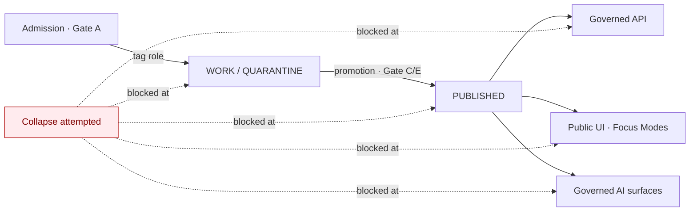

<!-- [KFM_META_BLOCK_V2]
doc_id: kfm://doc/architecture-cross-domain-source-role-anti-collapse
title: Source-Role Anti-Collapse
type: standard
version: v0.1
status: draft
owners: <ARCHITECTURE-DOCTRINE-OWNER> · NEEDS VERIFICATION
created: 2026-05-24
updated: 2026-05-24
policy_label: public
related:
  - README.md
  - cross-lane-relations.md
  - shared-kernel.md
  - trust-membrane.md
  - directory-rules.md#12
  - kfm_unified_doctrine_synthesis.md#17
  - Kansas_Frontier_Matrix_-_Domains_v1_1___Pass_23_32_Consolidated_Atlas.md#241
tags: [kfm, architecture, cross-domain, source-role, anti-collapse, doctrine]
notes:
  - PROPOSED placement; folder vs §12 flat-file pattern is OPEN-DR-10.
  - Canonical authority is Atlas §24.1 (Master Source-Role Anti-Collapse Register).
[/KFM_META_BLOCK_V2] -->

# Source-Role Anti-Collapse

> *The seven source-role classes, the DENY conditions that prevent role collapse, and the guardrails that fail closed when collapse is attempted.*

-blue)

**Status:** draft · **Owners:** `<ARCHITECTURE-DOCTRINE-OWNER>` *(NEEDS VERIFICATION)* · **Last updated:** 2026-05-24

> [!IMPORTANT]
> **Source role is a first-class identity attribute.** It is fixed at admission *(Gate A — Source admission)* and preserved through every promotion. An observed reading is not interchangeable with a modeled estimate; a regulatory determination is not interchangeable with an administrative compilation; an aggregate publication is not interchangeable with candidate evidence; synthetic content is never the same thing as observed reality. **The lifecycle, the governed API, and the AI surfaces all fail closed when these roles are conflated.**

> [!NOTE]
> **This doc is doctrine, not implementation.** The canonical implementation surface is Atlas §24.1 (Master Source-Role Anti-Collapse Register), the `SourceDescriptor` schema in `schemas/contracts/v1/sources/`, the source-role OPA rules in `policy/sources/`, and the per-domain anti-collapse tables in each domain dossier.

---

## Table of contents

1. [Scope](#1-scope)
2. [The seven canonical source-role classes](#2-the-seven-canonical-source-role-classes)
3. [DENY conditions — the collapse failure modes](#3-deny-conditions--the-collapse-failure-modes)
4. [Guardrails — where the rules execute](#4-guardrails--where-the-rules-execute)
5. [Promotion does not upgrade source role](#5-promotion-does-not-upgrade-source-role)
6. [Cross-domain role-collision matrix](#6-cross-domain-rolecollision-matrix)
7. [Anti-patterns](#7-anti-patterns)
8. [Open questions and ADR triggers](#8-open-questions-and-adr-triggers)
9. [Related docs](#9-related-docs)
10. [Appendix — glossary](#10-appendix--glossary)

---

## 1. Scope

This doc governs how every domain in KFM **tags, preserves, and validates** the source-role attribute on every record. It is **not** a list of source classes per domain *(those live in each domain dossier under "B. Source classes")*; it is the **cross-domain rule set** that all of those tables must conform to.

> [!TIP]
> **When this doc binds.** Any time a record carries a `source_role` field, any time an admission gate decides whether a source is acceptable, any time a promotion gate checks role-preservation, and any time a governed API or AI surface returns a record-typed answer.

[↑ Back to top](#top)

---

## 2. The seven canonical source-role classes

> **Evidence basis:** `Kansas_Frontier_Matrix_-_Domains_v1_1___Pass_23_32_Consolidated_Atlas.md` §24.1 *(Master Source-Role Anti-Collapse Register, CONFIRMED)*; `kfm_unified_doctrine_synthesis.md` §17 *(cross-lane relations and source-role anti-collapse, CONFIRMED)*.

| Role | Definition | Typical example | Allowed downstream role |
|---|---|---|---|
| **Observed** | Direct reading, measurement, or first-hand evidentiary record tied to a place and time. | Stream-gauge stage; soil pedon; air-quality sample; ground archaeological observation. | May feed modeled or aggregate products; **never** relabeled "regulatory" or "administrative". |
| **Regulatory** | Authoritative determination by a regulatory or governing body with legal/administrative force. | NFHL flood-zone designation; non-attainment ruling; designated critical habitat unit; protected-species listing. | Cite as regulatory context; **never** an "observed" event or "modeled" estimate. |
| **Modeled** | Derived product from inputs, assumptions, or fitted parameters; uncertainty and input provenance preserved. | Hydrograph reconstruction; smoke trajectory; suitability raster; population estimation surface; AOD raster. | Cite with model identity, run receipt, bounds; **never** an observation. |
| **Aggregate** | Published summary, total, or average over a unit *(county, year, watershed)*; irreversible loss of individual-record fidelity. | USDA crop county totals; Census tract aggregates; decadal climate normal. | Cite with aggregation receipt; **never** a per-place record. |
| **Administrative** | Compiled record produced by an agency for administration, registration, or accounting — not necessarily observation or regulation. | Land office tract book; deed index; county incorporation record; transport facility roster. | Cite as administrative context; **never** collapsed with observation or regulation. |
| **Candidate** | Proposed record awaiting validation, evidence resolution, deduplication, or steward review; not yet authoritative. | Quarantined connector output; unresolved person assertion; duplicate site candidate. | May be cited as candidate evidence in `WORK`/`QUARANTINE`; **must not** appear in `PUBLISHED` without promotion. |
| **Synthetic** | Content generated by simulation, reconstruction, AI, or interpolation with no underlying first-hand observation. | Synthetic terrain surface; reconstructed historical scene; AI-drafted summary of an `EvidenceBundle`. | Carries `Reality Boundary Note` + `Representation Receipt`; **never** presented as observed reality. |

> [!CAUTION]
> **The seven classes are exhaustive at the doctrine layer.** New classes require ADR-S-04 *(PROPOSED — Atlas §24.12)*. Domain-specific refinements live inside a class *(e.g., "remotely sensed observation" is still **Observed**; "agency-administered designation" is still **Regulatory**)* — not as a new top-level role.

[↑ Back to top](#top)

---

## 3. DENY conditions — the collapse failure modes

> **Evidence basis:** Atlas §24.1.2 *(collapse anti-patterns)*; per-domain "F. Cross-lane relations" tables; `kfm_unified_doctrine_synthesis.md` §17. **CONFIRMED.**

A *collapse* is any path through admission, processing, promotion, API, or UI that conflates two distinct source roles. KFM denies the following at the gates and surfaces named.

| Collapse pattern | Domains most at risk | Denied outcome | Required guardrail |
|---|---|---|---|
| **Modeled product labeled or queried as observed** | Air; Hydrology; Habitat; Agriculture; 3D | `DENY` at publication; `ABSTAIN` at AI surface | Run receipt + uncertainty surface + role-preserving DTO field |
| **Regulatory zone labeled as an observed flood / event** | Hydrology; Hazards; Air | `DENY` publication of regulatory layer as event evidence | Separate regulatory-layer and observed-event lanes; UI banner |
| **Aggregate cited as a per-place truth** | Agriculture; People; Geology; Air | `DENY` join from aggregate cell to single record; `ABSTAIN` at AI | Aggregation receipt; geometry-scope guard; matrix-cell semantics |
| **Administrative compilation cited as observation** | People/Land; Settlements; Roads | `DENY` publication of compilation as observed event timeline | Source-role tag preserved; named `LifeEvent` / `AdminEvent` types |
| **Candidate record exposed on a public surface** | All | `DENY` at trust membrane; route to `QUARANTINE` | Promotion gate; no `PUBLISHED` edge to `WORK`/`QUARANTINE` |
| **Synthetic content presented as observed reality** | Planetary/3D; AI; Archaeology; Habitat | `DENY` publication; `HOLD` for steward review; `ABSTAIN` at AI | `Reality Boundary Note`; `Representation Receipt`; UI badge |
| **AI text treated as evidence** | All Focus Mode surfaces | `DENY` publication; `ABSTAIN` at Focus Mode; `AIReceipt` mandatory | Cite-or-abstain rule; `AIReceipt`; release state required |

[↑ Back to top](#top)

---

## 4. Guardrails — where the rules execute

> **Evidence basis:** `kfm_unified_doctrine_synthesis.md` §8 *(promotion gates A–G)*; `directory-rules.md` §6.5 *(policy home)*, §7.5 *(validators home)*. **CONFIRMED.**

| Guardrail | Where it lives | What it does |
|---|---|---|
| **`SourceDescriptor.source_role` (required, enumerated)** | `schemas/contracts/v1/sources/source-descriptor.schema.json` | Schema-level rejection of any source admitted without a role from the canonical seven. |
| **Source-role OPA bundle** | `policy/sources/source-role.rego` | Denies promotion that drops, rewrites, or upgrades a role; denies join/publish that conflates roles. |
| **Cross-lane validator** | `tools/validators/cross-lane/source-role-preservation.py` *(PROPOSED)* | Fails closed when a join's output drops or collapses either side's source role. |
| **AI surface contract** | `contracts/runtime/ai-receipt/` | `AIReceipt` MUST cite source role of every evidence pointer; mismatch produces `ABSTAIN`. |
| **UI badge contract** | `contracts/ui/source-role-badge/` *(PROPOSED)* | Every record-typed surface displays its source-role badge; synthetic content also carries Reality Boundary Note. |
| **Release-manifest field** | `schemas/contracts/v1/release/release-manifest.schema.json` | Manifest entries carry the source-role distribution of the published bundle; mixed-role bundles are explicit. |

> [!IMPORTANT]
> **No single guardrail is sufficient.** Schema enforces shape; OPA enforces rule; validator enforces composition; AI/UI surfaces enforce reader-facing honesty; manifest enforces archival truth. All five layers must agree.

[↑ Back to top](#top)

---

## 5. Promotion does not upgrade source role

> **Evidence basis:** `kfm_unified_doctrine_synthesis.md` §17 *(role-preservation through promotion, CONFIRMED)*.

Promotion is a **state transition** *(`RAW` → `WORK` → `PROCESSED` → `PUBLISHED`)*, not a **role transition**. The role assigned at admission carries through to publication.

| Misconception | Reality |
|---|---|
| "Once it's published, it's authoritative — so it's effectively *observed*." | Publication state is orthogonal to role. A published modeled product is still **modeled**. |
| "Once a steward reviews it, the candidate becomes observed." | Steward review can promote `candidate` to a non-candidate role **only if** independent evidence supports the target role. The new role must be argued, not inferred. |
| "Aggregating a stack of observations turns the result into observed data." | Aggregation produces **aggregate**, not **observed**. The per-place observations remain observed; the aggregate is a new record with role `aggregate`. |
| "If we cite the source, we can re-label freely." | Citation is necessary but not sufficient. Re-labeling requires an explicit role-transition with its own evidence and review. |

> [!CAUTION]
> **Role rewrite is a doctrine event.** If a steward determines that an admitted source was tagged with the wrong role, the correction is logged with an `AdminEvent` *(or domain-equivalent record)* and a re-promotion runs through the gates — not a silent metadata edit.

[↑ Back to top](#top)

---

## 6. Cross-domain role-collision matrix

> **Evidence basis:** Per-domain "F. Cross-lane relations" tables across Atlas Parts 1 and 2; consolidated here as an at-a-glance matrix. **INFERRED from CONFIRMED per-domain doctrine.**

The matrix shows the most common cross-domain role collisions reviewers should watch for. Each cell names the collision and the gate that denies it.

| Left × Right | Common collision | Denying gate |
|---|---|---|
| Hydrology × Hazards | Regulatory floodplain joined to observed flood-event timeline as if equivalent | Gate C (sensitivity); Gate E (evidence) |
| Air × Hazards | Modeled AOD raster overlaid on regulatory non-attainment polygon as a single layer | Gate C; UI banner |
| Agriculture × People | County crop aggregate joined to producer-level identity record | Gate C; OPA per-place guard |
| People/Land × Settlements | Land-office administrative compilation cited as observed parcel history | Gate E |
| Archaeology × Planetary/3D | Reconstructed scene rendered alongside observed photograph without Reality Boundary badge | Gate G (release); UI badge |
| Fauna × Habitat | Habitat suitability (modeled) joined to species occurrence (observed) with role label lost | Gate C; cross-lane validator |
| AI text × Any | AI-drafted summary cited as evidence in a UI surface | Gate G; `AIReceipt` ABSTAIN |

[↑ Back to top](#top)

---

## 7. Anti-patterns

| Anti-pattern | Why it breaks the trust path | Mitigation |
|---|---|---|
| **`source_role` dropped from DTO at API boundary** | Reader loses the only signal that says "this is modeled, not observed". | API contract requires `source_role`; OPA denies envelopes missing it. |
| **Role inferred at read time from collection name** *(e.g., "everything in `gauges/` is observed")* | Collection layout drifts; readers downstream make decisions on wrong assumption. | Role lives on the record, not on the path. |
| **Per-domain custom roles outside the seven** *(e.g., "semi-observed", "modeled-but-trusted")* | Vocabulary fragments; cross-lane validators can't reason about it. | If a new role is genuinely needed, raise ADR-S-04. |
| **Quiet upgrade during ETL** *(e.g., "smoothed" observations relabeled as observed)* | Loss of model receipt; role-preservation invariant breaks. | Smoothing is a modeling step; result is **modeled** with run receipt. |
| **Synthetic-as-decoration without badge** *(e.g., reconstructed terrain shown without Reality Boundary Note)* | Reader treats reconstruction as observed reality. | UI badge contract; `Representation Receipt` mandatory. |
| **AI summary inlined into evidence list** | Cite-or-abstain rule broken; `AIReceipt` not attached. | Governed AI surface returns `ABSTAIN` envelope when AI content lacks `AIReceipt`. |

[↑ Back to top](#top)

---

## 8. Open questions and ADR triggers

| Open item | Class | Suggested ADR title *(PROPOSED)* |
|---|---|---|
| **ADR-S-04** — Freeze the seven-class vocabulary or allow extension via amendment? | Vocabulary | "Source-role vocabulary stability and extension procedure". |
| Should `synthetic` be split into `synthetic-reconstruction` and `synthetic-ai-generated` for clearer UI badging? | Sub-vocabulary | "Synthetic role sub-typing". |
| Should `candidate` carry an explicit *intended target role* field, so the promotion gate can validate the proposed transition? | Schema | "Candidate intended-target-role field". |
| Cross-lane validator implementation language and home — `tools/validators/cross-lane/` Python vs Rego-only? | Tooling | "Cross-lane validator implementation surface". |

[↑ Back to top](#top)

---

## 9. Related docs

| Reference | Role | Truth label |
|---|---|---|
| `README.md` *(this folder)* §6 | Landing summary of the seven roles | CONFIRMED doctrine |
| `cross-lane-relations.md` *(sibling)* | How role preservation interacts with the four invariants | CONFIRMED doctrine |
| `shared-kernel.md` *(sibling)* | `SourceDescriptor` is the kernel object that carries role | CONFIRMED doctrine |
| `trust-membrane.md` *(sibling)* | Role check at the public-vs-internal boundary | CONFIRMED doctrine |
| `Kansas_Frontier_Matrix_-_Domains_v1_1___Pass_23_32_Consolidated_Atlas.md` §24.1 | Master Source-Role Anti-Collapse Register | CONFIRMED doctrine |
| `kfm_unified_doctrine_synthesis.md` §17 | Role preservation through promotion | CONFIRMED doctrine |
| `kfm_unified_doctrine_synthesis.md` §8 | Promotion gates A–G | CONFIRMED doctrine |
| `directory-rules.md` §6.5, §7.5 | Policy and validator homes | CONFIRMED doctrine |
| `ai-build-operating-contract.md` §28 | ADR requirements for vocabulary changes | CONFIRMED doctrine |

[↑ Back to top](#top)

---

## 10. Appendix — glossary

<strong>10.1 Vocabulary cheatsheet</strong>

| Term | Definition |
|---|---|
| **Source role** | First-class identity attribute fixed at admission and preserved through promotion. One of seven canonical classes. |
| **Collapse** | Any pathway that conflates two distinct source roles in admission, processing, promotion, API, UI, or AI surfaces. |
| **Role-preservation invariant** | Invariant (2) of the four cross-lane invariants *(see `cross-lane-relations.md`)*. |
| **Reality Boundary Note** | Marker that distinguishes synthetic / reconstructed / simulated content from observed reality. |
| **Representation Receipt** | Receipt that records how synthetic content was generated, with model/run identity and inputs. |
| **AIReceipt** | Per-AI-surface-answer receipt that carries context, model profile, hashes, and policy decisions. |

<strong>10.2 Truth-label legend</strong>

- **CONFIRMED** — verified this session from attached docs.
- **PROPOSED** — design / placement / inference not yet verified in implementation.
- **INFERRED** — derivable from confirmed evidence but not directly stated.
- **NEEDS VERIFICATION** — checkable, but not yet checked strongly enough to act as fact.

---

**Related (mini)** · [`README.md`](README.md) · [`cross-lane-relations.md`](cross-lane-relations.md) · [`shared-kernel.md`](shared-kernel.md) · [`trust-membrane.md`](trust-membrane.md) · [Atlas §24.1](../../../Kansas_Frontier_Matrix_-_Domains_v1_1___Pass_23_32_Consolidated_Atlas.md) · [synthesis §17](../../../kfm_unified_doctrine_synthesis.md)

**Last updated:** 2026-05-24 · **Doc version:** v0.1 · **Doc status:** draft · **Path status:** PROPOSED *(OPEN-DR-10)*

[↑ Back to top](#top)
