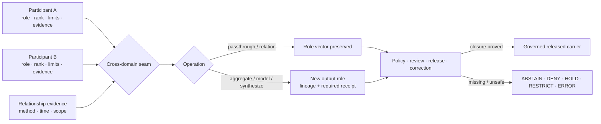

<!-- [KFM_META_BLOCK_V2]
doc_id: kfm://doc/architecture-cross-domain-source-role-anti-collapse
title: Cross-Domain Source-Role Anti-Collapse
type: architecture
version: v0.2.0
status: draft; repository-grounded; seam-companion; profile-convergence-hold; non-authoritative
owners:
  - "@bartytime4life - verified CODEOWNERS review route; routing is not stewardship, independent review, or approval"
owner_status: "Source, participating-domain, evidence, policy, sensitivity, validation, review, release, correction, and public-surface stewards remain NEEDS VERIFICATION"
created: 2026-05-24
updated: 2026-08-20
policy_label: public
truth_posture: cite-or-abstain
owning_root: docs/
responsibility_root: docs/
responsibility: Explain how source-role anti-collapse applies when independently governed domain lanes are joined, aggregated, modeled, synthesized, mapped, exported, graphed, embedded, or interpreted, while delegating vocabulary, semantic, schema, policy, registry, validation, review, release, correction, and runtime authority to their owning surfaces.
current_path: docs/architecture/cross-domain/source-role-anti-collapse.md
base_commit: 16a0c42f37f9e11d72d94682ab967e35c765d573
prior_blob: b8509017b0175fdd01da3fc47db9acca10ee0bc9
directory_governance: "Accepted ADR-0029 adopts docs/doctrine/directory-rules.md; section 12.5 confirms this shared-architecture lane and routes implementation artifacts to their own responsibility roots."
related:
  - README.md
  - cross-lane-relations.md
  - shared-kernel.md
  - trust-membrane.md
  - multi-domain-placement.md
  - ../source-role-anti-collapse.md
  - ../document-convergence-plan.md
  - ../../sources/source-roles.md
  - ../../doctrine/directory-rules.md
  - ../../adr/ADR-0029-adopt-directory-governance-standard-v2.md
  - ../../../contracts/source/source_descriptor.md
  - ../../../contracts/source/source_role_use_request.md
  - ../../../contracts/source/source_role_transition_assessment.md
  - ../../../schemas/contracts/v1/source/source_descriptor.schema.json
  - ../../../schemas/contracts/v1/sources/source_descriptor.schema.json
  - ../../../schemas/contracts/v1/source/source_role_use_request.schema.json
  - ../../../schemas/contracts/v1/source/source_role_transition_assessment.schema.json
  - ../../../tools/validators/source_role/validate_source_role.py
  - ../../../tools/validators/source_role/validate_source_role_transition_assessment.py
  - ../../../tests/validators/test_validate_source_role.py
  - ../../../tests/source/test_source_role_transition_assessment.py
  - ../../../.github/workflows/source-role-anti-collapse.yml
  - ../../../.github/workflows/source-role-transition-assessment.yml
tags: [kfm, architecture, cross-domain, source-role, anti-collapse, bounded-context, join, derivation, evidence, sensitivity, trust-membrane, correction, rollback]
notes:
  - "v0.2.0 replaces proposal-era path and enforcement claims with current repository evidence."
  - "This page is narrowed to the cross-domain seam responsibility; the universal responsibility and enforcement map remains at docs/architecture/source-role-anti-collapse.md."
  - "The seven-class uppercase transition vocabulary is retained as an implemented fixture profile, not represented as the sole current SourceDescriptor vocabulary."
  - "No vocabulary, contract, schema, policy, registry record, validator, fixture, test, workflow, source, release, correction, runtime, or public surface is changed by this page."
[/KFM_META_BLOCK_V2] -->

<a id="top"></a>

# Cross-Domain Source-Role Anti-Collapse

> **Operating rule.** A cross-domain seam must preserve every participant's admitted source posture. A join, lifecycle promotion, map layer, graph edge, export, Focus Mode response, embedding, or AI explanation may not silently strengthen a source role, authority rank, claim scope, evidence state, review state, release state, or public-use permission. When a transformation creates an aggregate, model, or synthetic representation, it must declare a new derived role, retain the input-role lineage, and bind the required process support.

[](#status-and-evidence-boundary)
[](#directory-rules-basis)
[](#current-vocabulary-surfaces)
[](#11-per-surface-enforcement)
[](#authority-boundary)

> [!IMPORTANT]
> **This page is a seam companion, not the universal source-role authority.** The repository-grounded universal responsibility and enforcement map lives at [`docs/architecture/source-role-anti-collapse.md`](../source-role-anti-collapse.md). Human taxonomy guidance lives under [`docs/sources/`](../../sources/source-roles.md); semantic meaning under [`contracts/source/`](../../../contracts/source/); machine shape under [`schemas/contracts/v1/source/`](../../../schemas/contracts/v1/source/); admissibility under [`policy/`](../../../policy/); validation under [`tools/validators/`](../../../tools/validators/); and release, correction, withdrawal, and rollback under [`release/`](../../../release/). This page explains how those responsibilities compose at a cross-domain seam.

> [!CAUTION]
> **The repository does not have one proved global source-role enum.** Current evidence exposes a 16-value `SourceDescriptor.source_role` vocabulary, a separate seven-class uppercase transition-assessment vocabulary, and a broader human-readable source-role reference. They overlap, but no accepted global crosswalk or migration was established. Do not coerce one profile into another by string matching.

> [!WARNING]
> **Presentation can perform a collapse even when stored records are correct.** A legend, popup, tooltip, graph edge label, export caption, search snippet, Focus Mode answer, or AI summary can imply that a model is an observation, an aggregate is a per-place fact, a candidate is verified, or contextual material is primary authority. Cross-domain public and interpretive surfaces therefore remain on `HOLD` until their role-preservation and correction behavior are proved.

**Quick navigation:** [Status](#status-and-evidence-boundary) · [Scope](#1-scope) · [Vocabulary](#2-the-seven-canonical-source-role-classes) · [Failures](#3-deny-conditions--the-collapse-failure-modes) · [Guardrails](#4-guardrails--where-the-rules-execute) · [Promotion](#5-promotion-does-not-upgrade-source-role) · [Collisions](#6-cross-domain-role-collision-matrix) · [Anti-patterns](#7-anti-patterns) · [Open work](#8-open-questions-and-adr-triggers) · [References](#9-related-docs) · [Glossary](#10-appendix--glossary)

---

<a id="status-and-evidence-boundary"></a>

## Status and evidence boundary

This revision replaces the May 2026 proposal posture with a commit-pinned current-repository boundary. The target remains explanatory architecture. It does not become vocabulary, contract, schema, policy, registry, validator, review, release, correction, or runtime authority merely because it is detailed.

| Surface | Confirmed repository state at `main@16a0c42f37f9e11d72d94682ab967e35c765d573` | Safe interpretation |
|---|---|---|
| This page | Existing file; prior blob `b8509017b0175fdd01da3fc47db9acca10ee0bc9`. | Same-path modernization; no move, rename, or new authority home. |
| Directory governance | Accepted [`ADR-0029`](../../adr/ADR-0029-adopt-directory-governance-standard-v2.md) adopts [`Directory Rules v2`](../../doctrine/directory-rules.md). | This shared-architecture page receives `PLACE`; other artifacts remain in their responsibility roots. |
| Cross-domain index | [`README.md`](README.md) identifies source-role preservation as one of the lane's core anti-collapse constraints and marks the shared vocabulary as unaccepted. | This page narrows to seam composition rather than duplicating a universal taxonomy. |
| Universal architecture map | [`../source-role-anti-collapse.md`](../source-role-anti-collapse.md) is repository-grounded and records the current responsibility and enforcement map. | Universal architecture should not be redefined here. |
| Human source-role reference | [`docs/sources/source-roles.md`](../../sources/source-roles.md) describes a broader human taxonomy. | It is useful guidance, but its families do not automatically equal machine enum values. |
| Rich descriptor schema | [`source_descriptor.schema.json`](../../../schemas/contracts/v1/source/source_descriptor.schema.json) is a proposed Draft 2020-12 implementation shape with 16 source-role values, separate authority-rank values, claim-role limits, rights, sensitivity, review, release, and lifecycle fields. | Shape is current repository evidence; status remains proposed and does not assign roles or approve use. |
| Schema path seam | The singular implementation schema says the plural path is canonical; the plural file is a proposed compatibility alias back to the singular shape. | **CONFLICTED metadata / compatibility posture**; do not create another schema or choose a winner here. |
| Downstream-use profile | `SourceRoleUseRequest` has a proposed-inactive, deterministic, no-network profile with six outcomes, 14 synthetic cases, focused tests, a compatibility shim, and a read-only workflow. | Proves bounded compatibility checks only. |
| Transition profile | `SourceRoleTransitionAssessment` has a separate proposed, fixture-first profile for passthrough, generalization, lifecycle promotion, aggregation, modeling, and synthesis. | Proves declared transformation checks only; its seven-role vocabulary is profile-local. |
| Cross-lane candidate profile | [`Cross-Lane Relations`](cross-lane-relations.md) records a bounded candidate-assessment slice and inactive generic join policy. | Candidate computation is not relationship truth, policy permission, release, or publication. |
| Source policy | [`policy/source/`](../../../policy/source/README.md) is documented, but its descriptor prerequisite module remains a non-enforcing stub and no accepted source-role policy bundle is established. | Architecture requirements are not operational policy proof. |
| Release Rego | [`release/source_role_anti_collapse.rego`](../../../release/source_role_anti_collapse.rego) is a four-line proposed default-deny scaffold. | Not an active policy bundle or release decision. |
| Public/runtime integration | No deployed API, map, graph, export, embedding, Focus Mode, or AI source-role enforcement was established by this evidence slice. | **UNKNOWN / NEEDS VERIFICATION**; public seam remains `HOLD`. |

### Truth posture

- **CONFIRMED:** path and prior blob, accepted placement authority, current contracts and schemas, current validator code, 14-case downstream-use profile, transition profile, focused tests, path-scoped workflows, and current policy/release scaffold posture.
- **PROPOSED:** a single accepted vocabulary, cross-profile mappings, generic cross-domain policy, active seam packets, consumer integration, correction propagation, and production release behavior.
- **CONFLICTED:** singular/plural SourceDescriptor schema metadata and the relationship among the current vocabulary surfaces.
- **UNKNOWN:** live source activation, deployed consumers, complete EvidenceRef resolution, authenticated review, public-role disclosure, cache invalidation, correction propagation, and rollback execution.
- **NEEDS VERIFICATION:** accountable stewards, accepted vocabulary/crosswalk, active policy evaluator, seam-specific contracts, exact-current-head workflow significance, and consumer closure.
- **HOLD:** any public cross-domain use that depends on unproved role mapping, policy, evidence, review, release, correction, or rollback behavior.

[Back to top](#top)

---

<a id="directory-rules-basis"></a>

### Directory Rules basis

Accepted Directory Rules §12.5 routes a human cross-domain architecture explanation to this lane while keeping each implementation responsibility separate.

| Responsibility | Owning surface | This page may do |
|---|---|---|
| Universal source-role architecture | [`docs/architecture/source-role-anti-collapse.md`](../source-role-anti-collapse.md) | Link and apply it to seams; do not create a second universal rule. |
| Human taxonomy and source-governance guidance | [`docs/sources/`](../../sources/source-roles.md) | Cite and compare; do not claim machine authority. |
| SourceDescriptor and source-use meaning | [`contracts/source/`](../../../contracts/source/) | Explain current boundaries; do not redefine fields. |
| Machine shape | [`schemas/contracts/v1/source/`](../../../schemas/contracts/v1/source/) plus the declared plural alias | Report exact shapes and conflicts; do not choose canonicality by prose. |
| Admissibility | [`policy/`](../../../policy/) and governed decision records | State requirements; never infer an allow result. |
| Source registry records | [`data/registry/sources/`](../../../data/registry/sources/) | Reference source identity; do not create or mutate registry records. |
| Validation | [`tools/validators/source_role/`](../../../tools/validators/source_role/) | Describe current deterministic checks and limits. |
| Synthetic proof | [`fixtures/`](../../../fixtures/), [`tests/`](../../../tests/), and read-only workflows | Cite exact assertions; do not treat green checks as public authority. |
| Cross-lane relation candidates | Accepted seam contracts plus [`tools/joins/`](../../../tools/joins/) and owned validators | Preserve role vectors and prohibited inferences; candidate output remains non-authoritative. |
| Release, correction, withdrawal, rollback | [`release/`](../../../release/) and applicable accountability lanes | Require closure; never substitute documentation or validator success. |
| API, map, graph, export, search, embedding, Focus Mode, AI | Governed released-carrier surfaces | Define disclosure and fail-closed requirements; do not claim deployed enforcement without evidence. |

<a id="authority-boundary"></a>

> [!IMPORTANT]
> **Endpoint validity, relation validity, source-role compatibility, policy admissibility, authenticated review, and release are separate claims.** A seam is usable only when every applicable claim closes independently.

[Back to top](#top)

---

## 1. Scope

This page governs the **composition problem**: what happens to source posture when two or more bounded domain contexts participate in one relation, aggregate, model, synthetic representation, map layer, graph edge, export, or interpretation.

It answers six questions:

1. Which source posture belongs to each participating endpoint?
2. Which evidence supports each endpoint and which evidence supports the relationship itself?
3. Does the composition preserve every participant's role, authority rank, claim limits, rights, sensitivity, review, release, and correction state?
4. Does the operation create a new derived artifact that needs a declared output role, lineage, and process receipt?
5. Which finite outcome applies when a role, mapping, reference, policy, review, or release dependency is missing or unsafe?
6. How must downstream carriers disclose the result without implying stronger authority?

### 1.1 In scope

- source-role vectors for multi-participant relations;
- exact current SourceDescriptor role/rank/claim fields;
- the seven-class transition profile as a bounded transformation vocabulary;
- role-preserving and role-creating transformations;
- relation evidence separate from endpoint evidence;
- role disclosure in API, map, graph, export, embedding, Focus Mode, and AI surfaces;
- fail-closed outcomes, correction invalidation, and rollback expectations;
- current repository proof and current operational holds.

### 1.2 Out of scope

This page does **not**:

- accept, merge, rename, extend, or retire a source-role vocabulary;
- assign a role, rank, claim permission, rights state, sensitivity state, review state, or release state;
- define a universal crosswalk between human, SourceDescriptor, transition, and domain-specific vocabularies;
- authenticate any EvidenceRef, PolicyDecision, ReviewRecord, ReleaseManifest, correction, or rollback reference;
- activate a source, connector, policy bundle, evaluator, seam, route, map layer, model, or public client;
- create relation truth from proximity, overlap, matching keys, co-occurrence, schema validity, workflow success, or generated language;
- lower protection because an output is aggregated, generalized, tiled, summarized, or visually simplified;
- release, deploy, promote, publish, or change repository settings.

### 1.3 The seam packet

A reviewable cross-domain seam should retain three separable packets:

| Packet | Minimum posture | Why it stays separate |
|---|---|---|
| **Participant packet** | Domain owner, object identity, `source_id`, descriptor version, source role, authority rank, allowed/prohibited claim roles, spatial/temporal scope, rights, sensitivity, evidence, review, release, correction state. | Each domain remains authoritative for its own endpoint. |
| **Relationship packet** | Relation identity and semantics, relation evidence, method, spatial/temporal validity, prohibited inferences, sensitivity effect, policy/review posture, correction dependencies. | Endpoint truth does not prove the relationship. |
| **Derived-output packet** | Operation, output identity, output role, input-role lineage, required transform/model/aggregation/representation receipts, public-safe transform, release/correction/rollback references. | A new derived artifact is not merely one input copied forward. |

The seam carries a **role vector**, not one winner-takes-all scalar. A public carrier may present a concise label, but it must preserve the complete role distribution and derivation path in the governed payload or resolvable evidence surface.


```mermaid
flowchart LR
    A["Participant A<br/>role · rank · limits · evidence"] --> S{"Cross-domain seam"}
    B["Participant B<br/>role · rank · limits · evidence"] --> S
    R["Relationship evidence<br/>method · time · scope"] --> S
    S --> O{"Operation"}
    O -->|passthrough / relation| V["Role vector preserved"]
    O -->|aggregate / model / synthesize| D["New output role<br/>lineage + required receipt"]
    V --> G["Policy · review · release · correction"]
    D --> G
    G -->|closure proved| P["Governed released carrier"]
    G -->|missing / unsafe| F["ABSTAIN · DENY · HOLD · RESTRICT · ERROR"]
```

The path through `P` is architectural. Current evidence does not prove a generic deployed path.

[Back to top](#top)

---

## 2. The seven canonical source-role classes

This legacy heading and generated anchor are retained for compatibility. The material correction is important:

> **The seven classes are canonical only inside the current `SourceRoleTransitionAssessment` fixture profile and in Atlas lineage. They are not proved as the sole current `SourceDescriptor` vocabulary.**

<a id="current-vocabulary-surfaces"></a>

### 2.1 Current vocabulary surfaces

| Surface | Current values or families | Authority and limit |
|---|---|---|
| Rich `SourceDescriptor.source_role` | 16 lowercase values, including `authoritative_for_claim`, `regulatory_context`, `observation`, `aggregator`, `model_context`, `candidate_signal`, `derived_public_product`, and `fixture_only`. | Proposed implementation schema; paired with separate `authority_rank` and `claim_role` vocabularies. |
| `SourceRoleTransitionAssessment` | `OBSERVED`, `REGULATORY`, `MODELED`, `AGGREGATE`, `ADMINISTRATIVE`, `CANDIDATE`, `SYNTHETIC`. | Proposed fixture-first transition profile; deliberately coarse operation/output vocabulary. |
| Human source-role reference | Primary, corroborating, context, regulatory, legal, administrative, observation, monitoring, operational notice, scientific interpretation, model product, remote sensing, aggregator, community observation, historical, generated derivative, restricted, unknown/unclassified, and related families. | Human governance guidance; useful for review and source mapping, not a machine enum by itself. |
| Domain-specific matrices and policy files | Domain-native roles, subtypes, claim limits, sensitivity, and source authority. | Bounded-context semantics; may be stricter and must not be flattened silently. |

### 2.2 Seven-class transition meanings

| Transition role | Bounded meaning | Cross-domain preservation rule |
|---|---|---|
| `OBSERVED` | Direct measurement or first-hand evidentiary record. | A join must retain observation time, method, sensor/observer, uncertainty, and source identity; it may not turn a related model or zone into another observation. |
| `REGULATORY` | Governing or legal determination with formal scope. | Preserve jurisdiction, effective time, instrument, and legal scope; do not present the designation as measured physical state. |
| `MODELED` | Derived estimate or classification with assumptions and run identity. | Preserve model/run identity, inputs, uncertainty, validation, and fitness-for-use; never label as direct measurement. |
| `AGGREGATE` | Summary over a declared unit, population, or interval. | Preserve aggregation unit and lost granularity; deny per-person, per-parcel, per-asset, or exact-place inference not supported by inputs. |
| `ADMINISTRATIVE` | Record compiled for administration, registration, accounting, or inventory. | Preserve administrative purpose and limits; do not upgrade it to legal title or physical observation. |
| `CANDIDATE` | Unresolved or unpromoted record under validation or review. | Keep internal, steward-gated, WORK, or QUARANTINE posture until the owning admission/correction process resolves it. |
| `SYNTHETIC` | Simulated, reconstructed, interpolated, or generated representation. | Require representation support and a visible reality boundary; never present as observed reality. |

### 2.3 No implicit crosswalk

A crosswalk from the 16-value descriptor enum to the seven transition classes is not a string-normalization task. For example:

- `remote_sensing_observation` may map to an observed transition role only for a declared detection or measurement claim with its method and quality posture intact;
- `derived_public_product` does not identify whether the derivative is aggregate, modeled, synthetic, generalized, or merely reformatted;
- `regulatory_context` and `legal_context` differ in the rich descriptor, while the transition profile has only `REGULATORY`;
- `candidate_signal`, `fixture_only`, and weak-confidence profiles have distinct public-use consequences that a coarse `CANDIDATE` label cannot fully express;
- human `scientific interpretation`, `monitoring reference`, and `operational notice` carry distinctions not encoded by the seven transition values.

Until a reviewed mapping contract, negative fixtures, migration plan, and domain-owner review exist, unresolved mappings return `HOLD`, `ABSTAIN`, `DENY`, or `ERROR` according to the owning operation. They never default to the stronger-looking role.

[Back to top](#top)

---

## 3. DENY conditions — the collapse failure modes

A collapse is any path through admission, transformation, joining, promotion, release, delivery, or interpretation that erases or strengthens source posture. The table separates a definite denial from conditions that should hold, restrict, abstain, or error.

| Collapse pattern | Cross-domain example | Required finite response |
|---|---|---|
| AI, free text, collection name, publisher reputation, or file path assigns a role | An AI labels an unclassified source `observation` because it appears on an agency website. | `DENY` (`SOURCE_ROLE_AI_INFERRED_DENIED` or unsupported role origin). |
| Propagated role or authority rank differs silently from the admitted descriptor | A contextual source is emitted as authoritative after a join. | `DENY`; explicit correction/supersession with lineage remains `HOLD`, not mutation. |
| Requested claim is outside `allowed_claim_roles` or inside `prohibited_claim_roles` | A regulatory polygon is used to claim an observed event. | `DENY` (`CLAIM_ROLE_INCOMPATIBLE`). |
| Participant roles collapse into one label without retaining lineage | Modeled habitat suitability and observed occurrence become one unlabeled “species presence” edge. | `DENY` or `HOLD`; retain both participant roles and relation semantics. |
| Aggregate is narrowed beyond its support | County totals are attributed to a person, farm, parcel, asset, or exact site. | `DENY` unsupported inference; preserve aggregate unit. |
| Lifecycle promotion upgrades authority | A candidate becomes “observed” merely because a steward reviewed or published it. | `DENY`; promotion changes lifecycle/review/release state, not evidentiary role. |
| Derived operation declares the wrong output role | `MODEL` emits `OBSERVED`, or `SYNTHESIZE` emits `MODELED` without the required boundary support. | `DENY` in the transition assessment. |
| Required process support is missing | Aggregate lacks aggregation receipt; model lacks model-run receipt; synthetic output lacks representation receipt or reality-boundary note. | `HOLD`; do not fabricate or downgrade the obligation. |
| Candidate input enters authority-producing operation unresolved | Candidate is aggregated, modeled, synthesized, or lifecycle-promoted as if closed. | `HOLD` (`CANDIDATE_INPUT_REQUIRES_RESOLUTION`). |
| Public surface lacks rights, public-safe sensitivity, review, release, evidence, policy, correction, or rollback support | A map exposes a role-compatible source whose rights are unknown. | `DENY` for public leakage or `HOLD` for missing review/release support. |
| Weak or contextual source is asked to support a primary claim | Context-only source supports identity, legal status, occurrence, or observation alone. | `ABSTAIN`; seek stronger evidence rather than upgrade the source. |
| Input, schema, deterministic identity, ordering, time, or internal validation is malformed | Role vector or lineage cannot be evaluated deterministically. | `ERROR`; never convert tool failure into allow. |

### 3.1 Role vector failures

For a multi-participant seam, reject or hold when:

- any participant's source id, descriptor version, role, authority rank, claim limits, or evidence is missing;
- the relation output carries fewer distinct input roles than the operation and lineage require;
- relation evidence is absent even though endpoint evidence exists;
- the most restrictive rights or sensitivity posture is silently lowered;
- the seam's prohibited-inference set is missing or violated;
- a participant's correction, withdrawal, or supersession has not propagated to the relation candidate;
- the carrier exposes a concise label without a resolvable full role vector and derivation record.

[Back to top](#top)

---

## 4. Guardrails — where the rules execute

No single guardrail proves end-to-end enforcement. Shape, semantics, compatibility, policy, review, release, and presentation remain separate responsibilities.

### 4.1 Current executable slices

| Guardrail | Current repository evidence | What it proves | What it does not prove |
|---|---|---|---|
| SourceDescriptor schema | Rich closed schema with role, rank, claim limits, rights, sensitivity, review, release, lifecycle, and source-head fields. | Machine shape and enum membership for declared descriptors. | Correct role assignment, rights truth, evidence closure, policy approval, source activation, or release. |
| `SourceRoleUseRequest` contract/schema | Closed request packet containing one descriptor snapshot, propagated role/rank, requested claims, consumer surface, exposure, support refs, role-change posture, permissions, and non-effects. | Meaning and shape of one bounded downstream-use assessment. | Reference authentication, relation truth, or public permission. |
| Source-role use validator | Bounded JSON I/O, active-schema vocabulary loading, deterministic identity, role/rank preservation, claim compatibility, rights/sensitivity/review/release checks, and finite outcomes. | Deterministic evaluation of the declared packet. | Live source access, policy evaluation, EvidenceBundle resolution, or deployed consumer enforcement. |
| Downstream-use fixtures/tests | 14 exact synthetic cases, six representative outcomes, deterministic CLI/shim output, no-network proof, and denial exit-code proof. | Fixture polarity and encoded validator behavior. | Completeness for every domain, seam, or production payload. |
| `SourceRoleTransitionAssessment` contract/schema | Declared operations, input/output roles, lineage roles, receipt refs, governance non-effects, and four outcomes. | Shape of one fixture-first transformation assessment. | A global mapping to SourceDescriptor or real production transformations. |
| Transition validator/tests | Enforces operation/output-role rules, candidate-input hold, lineage equality, required receipts, reason codes, time, and spec hash against synthetic fixtures. | Deterministic local transition checks. | Runtime orchestration, receipt authenticity, lifecycle mutation, release, or publication. |
| Source-role workflows | Read-only, no-network tests and receipt validation for their path-filtered implementation slices. | Hosted execution when those paths trigger and the exact run succeeds. | This page's correctness, required-check significance, generic seam enforcement, or current production state. |
| Cross-lane candidate profile | Deterministic candidate assessment plus separate seam-register projection validation. | Bounded synthetic relation-candidate behavior and fail-closed register posture. | Generic relationship truth, active join policy, or public relation release. |

### 4.2 Exact downstream-use outcomes

| Outcome | Exit code | Bounded meaning |
|---|---:|---|
| `PASS` | `0` | Declared role/rank are preserved, claims fit admitted limits, and declared exposure has the required reference presence. |
| `ERROR` | `2` | Input, schema, ordering, deterministic identity, or internal validation is malformed or contradictory. |
| `HOLD` | `3` | Well-formed request awaits governed role correction, evidence, policy/review, release, correction, or rollback support. |
| `RESTRICT` | `4` | Compatible only in internal or steward-gated context because rights or sensitivity remain restrictive. |
| `ABSTAIN` | `5` | Source posture is too weak or uncertain for the requested primary claim. |
| `DENY` | `6` | AI-inferred role, silent role/rank collapse, incompatible claim use, overclaim, denied rights, or public leakage is present. |

Precedence is `ERROR > DENY > HOLD > RESTRICT > ABSTAIN > PASS`.

### 4.3 Exact transition operations

| Operation | Required output posture | Required support |
|---|---|---|
| `PASSTHROUGH` | Same single input transition role. | Input EvidenceBundle reference retained. |
| `GENERALIZE` | Same single input transition role; precision may narrow, authority may not increase. | Generalization/transform lineage appropriate to the owning profile. |
| `PROMOTE_LIFECYCLE` | Same role; candidate input remains `HOLD` until resolved. | Promotion cannot manufacture authority. |
| `AGGREGATE` | `AGGREGATE`; preserve distinct input-role lineage. | `aggregation_receipt_ref`; candidate input holds. |
| `MODEL` | `MODELED`; preserve distinct input-role lineage. | `model_run_receipt_ref`; candidate input holds. |
| `SYNTHESIZE` | `SYNTHETIC`; preserve distinct input-role lineage. | `representation_receipt_ref` and `reality_boundary_note_ref`; candidate input holds. |

> [!CAUTION]
> **An explicit derivation is not a silent role upgrade.** The output may have a new role only when the operation semantics require it, every input role remains in lineage, the required process support is present, and downstream consumers retain both the derived role and the input-role distribution.

### 4.4 Policy and release boundary

Current repository evidence does not establish an active generic source-role policy bundle:

- `policy/source/descriptor_required_before_ingest.rego` remains a non-enforcing proposal stub;
- the root `release/source_role_anti_collapse.rego` is a proposed default-deny scaffold in a placement-drift surface;
- domain-specific Rego files and source-role matrices vary in maturity and bounded-context vocabulary;
- release-review documentation is guidance, not an authenticated review record or release decision;
- validator outcomes do not authenticate support references or emit `PolicyDecision` / `ReviewRecord` / `ReleaseManifest` objects.

The safe conclusion is **implementation partial, policy inactive, public/release integration unproved**.

[Back to top](#top)

---

## 5. Promotion does not upgrade source role

Promotion is a governed lifecycle transition, not an evidentiary-role transition.

| Misconception | Correct boundary |
|---|---|
| “Published means observed.” | A published model remains modeled; a published aggregate remains aggregate; a published regulatory layer remains regulatory. |
| “Reviewed candidate becomes observed.” | Review may resolve a candidate only through an owning correction/admission record with independent evidence for the target posture. The validator itself never mutates the descriptor. |
| “Aggregating observations keeps the output observed.” | Inputs remain observed; the new output is aggregate and preserves observed lineage. |
| “Generalization weakens the data, so the role no longer matters.” | Generalization narrows precision or exposure; it does not erase role, evidence, rights, or sensitivity lineage. |
| “Joining two authoritative sources creates an authoritative relationship.” | Endpoint authority does not prove relation truth. The relation needs its own semantics, evidence, policy, review, and release closure. |
| “A release manifest can fix a role mismatch.” | Release may bind an approved artifact; it cannot repair invalid semantics. Correct the descriptor/derivation and re-evaluate first. |

### 5.1 Role correction and supersession

When the admitted posture is wrong or no longer valid:

1. preserve the prior descriptor and source-use history;
2. issue a governed correction, supersession, retirement, or withdrawal record under the owning source/domain process;
3. create a new descriptor version or accepted successor rather than silently editing released meaning;
4. re-run source-role use and transition assessments against the new bytes;
5. re-evaluate affected cross-lane relations, aggregates, models, synthetic representations, evidence bundles, policy decisions, reviews, and releases;
6. invalidate or withdraw derived carriers that no longer close;
7. rebuild only from corrected inputs and preserve rollback targets and public correction lineage.

A role-change request with explicit lineage returning `HOLD` is a safe result. It means the validator recognized a governed transition request but did not grant mutation authority.

[Back to top](#top)

---

## 6. Cross-domain role-collision matrix

These are architecture risk examples. They do not claim that the corresponding seam is active, policy-approved, released, or publicly deployed.

| Left × right | Roles that must remain distinct | Unsupported inference to deny | Required disclosure or support |
|---|---|---|---|
| Hydrology × Hazards | Observation, operational notice/model, regulatory flood zone. | Floodplain designation or forecast presented as an observed flood event. | Native role, time/effective date, method/authority, relation evidence, non-life-safety boundary. |
| Atmosphere × Hazards | Station observation, remote-sensing observation, model context, operational advisory. | Modeled smoke or advisory polygon presented as measured concentration at a place. | Sensor/model/advisory identity, valid time, uncertainty, source authority, stale state. |
| Agriculture × Soil | Crop aggregates, remote-sensing/model products, soil observations/interpretations. | County yield assigned to a farm/parcel, or soil suitability presented as observed production. | Aggregation unit, model/interpretation method, input roles, prohibited parcel/operator inference. |
| Fauna × Habitat | Occurrence observation/evidence and modeled habitat suitability. | Suitability or proximity presented as a confirmed species occurrence or established population. | Geoprivacy, occurrence evidence, suitability model receipt, most-restrictive sensitivity. |
| People/Land × Settlements | Legal/administrative/historical sources and settlement records. | Assessor or tract compilation presented as legal title or direct life-event observation. | Jurisdiction, instrument, administrative purpose, temporal scope, living-person/privacy review. |
| Geology × Natural resources | Observation, interpreted geology, model potential, regulatory/administrative permit or production record. | Modeled potential, occurrence, estimate, reserve, permit, and production collapsed into “resource exists.” | Distinct object/role labels, measurement basis, effective time, rights/public-safe location, stewardship. |
| Archaeology × Roads/Rail/Trade | Historic administrative/context routes and observed/interpreted archaeology. | Historic corridor proximity presented as site evidence or exact protected-site location. | Relation evidence, uncertainty, cultural/sovereignty review, generalized geometry, prohibited inference. |
| Archaeology × Planetary/3D | Observed documentation, interpretation, reconstruction/synthetic representation. | Reconstruction shown beside observed imagery without a visible reality boundary. | Representation receipt, reality-boundary note, source/evidence split, public-safe location. |
| Hazards × Settlements/Infrastructure | Hazard observation/model/regulatory context and asset administrative/operational records. | Exposure relation revealing precise critical assets or implying official emergency status. | Most-restrictive sensitivity, generalized public product, not-for-life-safety notice, release review. |
| AI text × any domain | Evidence-bearing source roles and generated derivative/interpretive output. | AI summary inserted as evidence, authority, review, or release proof. | Underlying EvidenceBundle, current receipt profile, finite outcome, explicit generated-language boundary. |

### 6.1 Relation evidence is not endpoint evidence

A valid source on each side does not prove the connecting assertion. Examples:

- an observed occurrence and a released hydrologic unit do not prove an established aquatic population;
- a historic route and an archaeological record do not prove a causal corridor relation;
- a facility location and a hazard zone do not prove measured exposure or operational impact;
- a soil unit and crop aggregate do not prove parcel-level suitability or yield;
- a modeled raster and a regulatory boundary do not prove an observed event.

The relationship needs its own evidence and method appropriate to consequence. When relation support is missing, the correct result is a reviewable candidate, `ABSTAIN`, `DENY`, `HOLD`, or `ERROR`—not a plausible public edge.

[Back to top](#top)

---

## 7. Anti-patterns

| Anti-pattern | Why it breaks the trust path | Required response |
|---|---|---|
| Collapse a role vector to the “strongest” participant | Hides weaker/contextual/model/candidate inputs and overstates the relationship. | Preserve all participant roles and relation role separately. |
| Collapse to the “most restrictive” role and discard the rest | Protection may be safe, but evidentiary meaning and provenance are lost. | Apply most-restrictive policy while retaining the full role vector. |
| Infer role from domain or collection path | Directory layout and consumer expectations are not source authority. | Read the admitted descriptor and exact version. |
| Treat the seven transition classes as the current SourceDescriptor enum | Erases 16-value role/rank/claim distinctions and causes invalid mappings. | Keep profile identity explicit; use reviewed crosswalks only. |
| Treat human taxonomy prose as machine admission | A helpful reference becomes unreviewed schema/policy authority. | Validate against the active accepted/declared machine profile. |
| Quietly relabel transformed data | Model, aggregate, or synthetic derivation loses receipts and lineage. | Declare operation, output role, input roles, and required process support. |
| Treat endpoint release as relation release | One released record authorizes another context or the relation. | Require participant and relation release closure appropriate to the seam. |
| Let a generic validator decide domain semantics | Bounded-context distinctions are flattened into one mechanical rule. | Domain owners define semantics; shared validators enforce only accepted common invariants. |
| Expose concise map/graph labels without drill-down | Reader cannot inspect role distribution, evidence, or derivation. | Provide resolvable Evidence Drawer / metadata payload and visible role cues. |
| Use validator `PASS` as evidence, policy, review, or release approval | Process conformance becomes authority. | Keep validator report non-authoritative and resolve owning records separately. |
| Treat missing policy engine as implicit allow | Operational failure becomes unsafe exposure. | `ERROR`, `HOLD`, `RESTRICT`, `ABSTAIN`, or `DENY` according to the owning boundary. |
| Hide correction effects in caches, search, tiles, exports, embeddings, or AI context | Public and interpretive consumers keep stale or unsafe authority claims. | Propagate invalidation, withdrawal, rebuild, and rollback across every released consumer. |

[Back to top](#top)

---

## 8. Open questions and ADR triggers

| ID | Open question | Current state | Closure evidence |
|---|---|---:|---|
| SR-XD-001 | Which vocabulary is accepted for SourceDescriptor and how do human/domain vocabularies map to it? | **HOLD / CONFLICTED** | Accepted contract/schema, crosswalk, domain mappings, negative fixtures, migration and rollback plan. |
| SR-XD-002 | Is the seven-class transition profile retained as an operation vocabulary, replaced, or versioned as an adapter layer? | **PROPOSED / NEEDS VERIFICATION** | Reviewed decision plus compatibility tests and fixture migration. |
| SR-XD-003 | How are multi-participant role vectors represented in relation contracts and public payloads? | **UNKNOWN** | Accepted seam/relation contract, closed schema, examples, accessibility and UI review. |
| SR-XD-004 | Which generic and pair-specific policy bundles evaluate source-role compatibility? | **HOLD** | Accepted policy source, input contract, evaluator binding, reason/obligation vocabulary, native tests. |
| SR-XD-005 | Which domain source-role matrices are authoritative, current, and compatible with shared profiles? | **NEEDS VERIFICATION** | Inventory, owner review, version/status register, cross-profile tests. |
| SR-XD-006 | How are relation evidence and endpoint evidence linked without collapsing them? | **PROPOSED** | Contract/schema profile, EvidenceRef resolution, exact-negative fixtures, correction behavior. |
| SR-XD-007 | Which API/map/graph/export/embedding/Focus Mode/AI consumers preserve role vectors today? | **UNKNOWN** | Current code, route, payload, browser/runtime tests, deployed evidence. |
| SR-XD-008 | What public badges, labels, alt text, legends, and drill-down payloads are required? | **NEEDS VERIFICATION** | UI/accessibility contract, content design review, negative presentation tests. |
| SR-XD-009 | How do descriptor correction, source withdrawal, evidence revocation, and release rollback invalidate cross-domain derivatives? | **UNKNOWN** | Correction cascade test, cache/search/tile/embedding invalidation, replay and rollback drill. |
| SR-XD-010 | Which path is the long-term SourceDescriptor schema authority: singular implementation or plural alias? | **CONFLICTED** | Directory/contract/schema migration decision, zero-writer inventory, consumer closure, compatibility exit criteria. |
| SR-XD-011 | Are source-role workflows required checks, and what exact-current-head evidence supports reliance? | **NEEDS VERIFICATION** | Ruleset/branch-protection evidence plus exact-head hosted runs. |
| SR-XD-012 | Which accountable stewards can approve role mappings, seam activation, public disclosure, and correction? | **UNKNOWN** | Verified assignments, review separation, escalation, incident and correction duties. |

### ADR-class triggers

A reviewed decision is required when a change:

- accepts, renames, merges, splits, or retires a shared role vocabulary;
- changes the authority owner of source-role semantics, schema, policy, or validation;
- creates a new canonical or compatibility path;
- changes the SourceDescriptor/transition/domain crosswalk or compatibility promise;
- changes what a public API, map, graph, export, Focus Mode, embedding, or AI surface may imply;
- lowers a sensitivity, rights, consent, sovereignty, or review default;
- changes correction, withdrawal, release, or rollback responsibility;
- activates a formerly held generic or pair-specific cross-domain seam.

A documentation-only clarification that preserves current meaning, links current evidence, and changes no authority may proceed through routine review.

[Back to top](#top)

---

## 9. Related docs

| Reference | Current role | Relationship to this page |
|---|---|---|
| [`README.md`](README.md) | Cross-domain architecture index and current held-seam overview. | Parent lane and current source-role summary. |
| [`../source-role-anti-collapse.md`](../source-role-anti-collapse.md) | Universal current responsibility and enforcement map. | Primary architecture reference; this page applies it to cross-domain composition. |
| [`cross-lane-relations.md`](cross-lane-relations.md) | Four-invariant relation boundary and fixture-first candidate implementation. | Adds ownership, sensitivity, and relation-evidence constraints. |
| [`shared-kernel.md`](shared-kernel.md) | Older shared-object catalog. | Useful lineage; several object/path claims remain stale and require separate refresh. |
| [`trust-membrane.md`](trust-membrane.md) | Public/internal boundary explanation. | Ordinary clients must not receive candidate, restricted, or unclosed role posture. |
| [`multi-domain-placement.md`](multi-domain-placement.md) | Placement protocol for shared artifacts. | Prevents convenient lead-domain or parallel authority placement. |
| [`../document-convergence-plan.md`](../document-convergence-plan.md) | Provisional architecture-document convergence ledger. | Directs one universal source-role rule, source-taxonomy routing, and a narrowed seam page. |
| [`../../sources/source-roles.md`](../../sources/source-roles.md) | Human source-governance reference. | Broader review vocabulary; not a machine enum by itself. |
| [`SourceDescriptor` contract](../../../contracts/source/source_descriptor.md) | Proposed semantic meaning paired to the rich descriptor schema. | Owns descriptor meaning; this page does not redefine it. |
| [`SourceRoleUseRequest`](../../../contracts/source/source_role_use_request.md) | Proposed-inactive downstream-use assessment contract. | Supplies the six-outcome compatibility profile. |
| [`SourceRoleTransitionAssessment`](../../../contracts/source/source_role_transition_assessment.md) | Proposed fixture-first transformation contract. | Supplies the seven-class operation/output profile. |
| [`source-role anti-collapse workflow`](../../../.github/workflows/source-role-anti-collapse.yml) | Read-only path-scoped downstream-use CI. | Does not path-filter this page or prove generic cross-domain enforcement. |
| [`source-role transition workflow`](../../../.github/workflows/source-role-transition-assessment.yml) | Read-only path-scoped transformation CI. | Does not path-filter this page or prove deployed transformations. |
| [`policy/source/`](../../../policy/source/README.md) | Source-policy boundary documentation and current stubs. | Confirms active source-role policy remains unproved. |
| [`release/source_role_anti_collapse.rego`](../../../release/source_role_anti_collapse.rego) | Proposed default-deny scaffold. | Presence and default deny are not active release policy. |

[Back to top](#top)

---

## 10. Appendix — glossary

### 10.1 Vocabulary cheatsheet

| Term | Meaning in this page |
|---|---|
| **Source posture** | The combined source role, authority rank, allowed/prohibited claim roles, rights, sensitivity, confidence, review, release, lifecycle, evidence, correction, and public-use limits attached to a source. |
| **Source-role anti-collapse** | The invariant that no downstream process or presentation may silently strengthen or erase source posture. |
| **Role vector** | The ordered or otherwise deterministic set of participant roles retained by a cross-domain relation or derived output; not one merged winner label. |
| **Relationship evidence** | Evidence that supports the connecting assertion itself, separate from evidence for either endpoint. |
| **Derived role** | A declared output role produced by an accepted operation such as aggregation, modeling, or synthesis; it must retain input-role lineage and required process support. |
| **Role laundering** | Silent transformation of a weaker, contextual, modeled, aggregate, candidate, fixture, or synthetic posture into a stronger-looking claim. |
| **Profile-local vocabulary** | A role enum valid within one contract/schema profile, not automatically global. |
| **Compatibility assessment** | A deterministic check that a declared downstream use preserves admitted limits. It is not evidence, policy, review, release, or public permission. |
| **Reality boundary** | Visible distinction between observed evidence and simulated, reconstructed, interpolated, or generated representation. |
| **Carrier** | Map, tile, graph, export, search result, screenshot, embedding, dashboard, scene, or AI text that conveys released knowledge but does not create truth. |

### 10.2 Finite outcome crosswalk

| Boundary | Finite outcomes | Do not conflate with |
|---|---|---|
| Source-role downstream-use assessment | `PASS`, `ERROR`, `HOLD`, `RESTRICT`, `ABSTAIN`, `DENY` | Runtime answer, policy decision, review, release, or publication. |
| Source-role transition assessment | `PASS`, `DENY`, `HOLD`, `ERROR` | Lifecycle mutation, receipt authenticity, or release. |
| Cross-lane join candidate assessment | Profile-specific candidate outcomes documented by its owning contract/tool | Relationship truth or public join permission. |
| Governed runtime response | `ANSWER`, `ABSTAIN`, `DENY`, `ERROR` where the active runtime envelope applies | Internal validator or policy-native vocabulary. |
| Directory placement | `PLACE`, `SPLIT`, `MIGRATE`, `MIRROR`, `HOLD`, `DENY` | Source, relation, policy, or runtime outcomes. |

### 10.3 Review checklist

Before approving a cross-domain source-role change, confirm:

- [ ] every participant retains stable domain and source identity;
- [ ] the exact descriptor version and role/rank/claim limits are named;
- [ ] profile-local vocabularies are not presented as one global enum;
- [ ] the relationship has support separate from endpoint evidence;
- [ ] any new aggregate/model/synthetic role is operation-derived and receipted;
- [ ] input-role lineage is complete and deterministic;
- [ ] rights, sensitivity, consent, sovereignty, review, and release use the strictest applicable posture;
- [ ] public carriers expose a resolvable role vector and derivation, not just a simplified label;
- [ ] missing dependencies fail closed with the owning finite outcome;
- [ ] corrections, withdrawals, invalidation, rebuild, and rollback propagate to every consumer;
- [ ] tests prove exact negative paths, not only schema-valid success;
- [ ] no document, validator, workflow, receipt, PR, merge, or renderer is represented as source or publication authority.

### 10.4 Validation commands for the current bounded profiles

```bash
PYTHONDONTWRITEBYTECODE=1 KFM_NO_NETWORK=1 \
  python -m pytest -q tests/validators/test_validate_source_role.py

PYTHONDONTWRITEBYTECODE=1 KFM_NO_NETWORK=1 \
  python tools/validators/source_role/validate_source_role.py --fixtures

PYTHONDONTWRITEBYTECODE=1 KFM_NO_NETWORK=1 \
  python tools/validators/source_role/validate_source_role_transition_assessment.py --fixtures

PYTHONDONTWRITEBYTECODE=1 KFM_NO_NETWORK=1 \
  python -m pytest -q --strict-config --strict-markers \
  tests/source/test_source_role_transition_assessment.py
```

These commands validate the current fixture-first profiles only. They do not prove this page, policy acceptance, reference authenticity, deployed consumers, release, or publication.

---

## Change and rollback

This same-path revision changes architecture documentation and its generated authoring provenance only. It changes no source-role value, vocabulary, contract, schema, policy, registry record, fixture, validator, test, workflow, source, lifecycle state, release, correction, runtime, deployment, or repository setting.

Before merge, rollback is to close the draft pull request and abandon the task branch. After any separately authorized merge, transparently revert the merge commit or deliver a bounded forward correction. Do not rewrite shared history, delete lineage, or create a second writable source-role authority.

---

**Related (mini):** [`Cross-Domain Architecture`](README.md) · [`Universal Source-Role Map`](../source-role-anti-collapse.md) · [`Cross-Lane Relations`](cross-lane-relations.md) · [`Source Roles`](../../sources/source-roles.md) · [`SourceDescriptor`](../../../contracts/source/source_descriptor.md)

**Last updated:** 2026-08-20 · **Doc version:** v0.2.0 · **Status:** repository-grounded draft · **Public/release effect:** none

[Back to top](#top)
