<!-- [KFM_META_BLOCK_V2]
doc_id: kfm://doc/architecture-cross-domain-trust-membrane
title: Trust Membrane — Public vs Internal Boundary
type: standard
version: v0.1
status: draft
owners: <ARCHITECTURE-DOCTRINE-OWNER> · NEEDS VERIFICATION
created: 2026-05-24
updated: 2026-05-24
policy_label: public
related:
  - README.md
  - source-role-anti-collapse.md
  - cross-lane-relations.md
  - shared-kernel.md
  - compositional-units.md
  - kfm_unified_doctrine_synthesis.md#7
  - kfm_unified_doctrine_synthesis.md#8
  - kfm_unified_doctrine_synthesis.md#11
  - Kansas_Frontier_Matrix_-_Domains_v1_1___Pass_23_32_Consolidated_Atlas.md#24
tags: [kfm, architecture, cross-domain, trust-membrane, publication, doctrine]
notes:
  - PROPOSED placement; folder vs §12 flat-file pattern is OPEN-DR-10.
  - The doctrine boundary that keeps the inside from leaking outside.
[/KFM_META_BLOCK_V2] -->

<a id="top"></a>

# Trust Membrane — Public vs Internal Boundary

> *The membrane between `PUBLISHED` truth (governed APIs, public UI, public AI surfaces) and everything inside it (`RAW`, `WORK`, `QUARANTINE`, internal stores). The rules that govern every crossing.*


-blue)


**Status:** draft · **Owners:** `<ARCHITECTURE-DOCTRINE-OWNER>` *(NEEDS VERIFICATION)* · **Last updated:** 2026-05-24

> [!IMPORTANT]
> **The trust membrane is the doctrine boundary that prevents raw, unreviewed, restricted, or generated state from becoming public truth.** Inside the membrane: `RAW`, `WORK`, `PROCESSED`, `QUARANTINE`, steward tools, internal indexes. Outside: `PUBLISHED` data, governed APIs, public UI surfaces, governed AI surfaces. Every crossing **must** be a governed promotion through the gates *(`kfm_unified_doctrine_synthesis.md` §§7–8)*.

> [!CAUTION]
> **Posture is fail-closed.** If a question cannot be answered with cite-or-abstain truthfulness, the public surface returns `ABSTAIN` or `DENY` — never a fabricated answer, never a leaked internal record.

---

## Table of contents

1. [Scope](#1-scope)
2. [What the membrane separates](#2-what-the-membrane-separates)
3. [Crossings — the only legal paths](#3-crossings--the-only-legal-paths)
4. [Promotion gates summary](#4-promotion-gates-summary)
5. [The five fail-closed domains](#5-the-five-failclosed-domains)
6. [Outbound runtime contract](#6-outbound-runtime-contract)
7. [Inbound contract](#7-inbound-contract)
8. [Anti-patterns](#8-anti-patterns)
9. [Open questions and ADR triggers](#9-open-questions-and-adr-triggers)
10. [Related docs](#10-related-docs)
11. [Appendix](#11-appendix)

---

## 1. Scope

This doc governs **every interface** between the internal lifecycle *(admission → processing → review → release)* and the external world *(governed APIs, public UI, governed AI surfaces, downstream publication)*. It is not specific to one domain; it applies uniformly.

> [!TIP]
> **When this doc binds.** Any time a record, payload, summary, image, or AI text leaves the inside of KFM for an external surface. Internal moves *(connector → WORK staging, WORK → PROCESSED indexing)* are out of scope; only crossings of the membrane are governed here.

[↑ Back to top](#top)

---

## 2. What the membrane separates

> **Evidence basis:** `kfm_unified_doctrine_synthesis.md` §7 *(promotion as a governed state transition, CONFIRMED)*; §11 *(finite outcome envelope, CONFIRMED)*.

```mermaid
flowchart LR
  subgraph IN["INSIDE the membrane"]
    direction TB
    RAW["RAW (admission)"]
    WORK["WORK / QUARANTINE"]
    PROC["PROCESSED"]
    REV["Steward review"]
    IDX["Internal indexes"]
  end
  subgraph OUT["OUTSIDE the membrane"]
    direction TB
    PUB["PUBLISHED artifacts"]
    API["Governed APIs"]
    UI["Public UI / Focus Modes"]
    AI["Governed AI surfaces"]
  end
  IN -. promotion gates A–G .-> OUT
  classDef inside fill:#fff4e0,stroke:#d97706,color:#7c2d12;
  classDef outside fill:#c8e6c9,stroke:#1b5e20;
  class RAW,WORK,PROC,REV,IDX inside;
  class PUB,API,UI,AI outside;
```



| Inside | Outside |
|---|---|
| `RAW`: connector landings, untouched ingest | Governed APIs *(see `docs/architecture/governed-api.md`)* |
| `WORK`: processed but not validated | Public UI surfaces *(map shell, Focus Modes, narrative)* |
| `QUARANTINE`: failed validation, awaiting steward | Governed AI surfaces *(every answer carries `AIReceipt`)* |
| `PROCESSED`: validated, not yet published | Downstream publication *(release manifests, scenes)* |
| Steward tools, dashboards, audit logs | Public release manifests *(machine-readable index of what is `PUBLISHED`)* |
| Internal indexes, vector stores, embedding caches | — |

[↑ Back to top](#top)

---

## 3. Crossings — the only legal paths

> **Evidence basis:** `kfm_unified_doctrine_synthesis.md` §8 *(promotion gates A–G, CONFIRMED)*.

Crossing the membrane is governed by **promotion** *(internal state advances through Gates A–G)* and by **publication contracts** *(the envelopes used by the outbound surfaces)*. There is no other path.

| Legal crossing | Conditions |
|---|---|
| **Promotion to `PUBLISHED`** | All applicable gates pass: A (admission), B (provenance), C (sensitivity), D (validation), E (evidence closure), F (review), G (release). |
| **Governed API response** | Wrapped in `DecisionEnvelope`; references a resolvable `EvidenceBundle`; sensitivity-checked at request time. |
| **Public UI render** | Reads from `PUBLISHED` only; never from `WORK` / `QUARANTINE` / `RAW`. |
| **Governed AI surface answer** | Cite-or-abstain; emits `AIReceipt`; `ABSTAIN` envelope when bundle is unresolvable. |
| **Release manifest publication** | Authoritative inventory of what is `PUBLISHED`; immutable; carries rollback target. |

| Illegal crossing | Outcome |
|---|---|
| Public read of `WORK` / `QUARANTINE` / `RAW` | `DENY` at API; route to error class. |
| AI surface generating an answer without `AIReceipt` | `ABSTAIN` envelope. |
| UI rendering from internal index without manifest reference | Build rejected; surface refuses to render. |
| Promotion bypass *(skipping a gate)* | OPA bundle denies; release fails closed. |

[↑ Back to top](#top)

---

## 4. Promotion gates summary

> **Evidence basis:** `kfm_unified_doctrine_synthesis.md` §8 *(CONFIRMED)*. The full text of each gate lives in synthesis §8; this section is the cross-domain summary.

| Gate | Question | DENY conditions |
|---|---|---|
| **A — Source admission** | Did the source admit through `SourceDescriptor` with role and rights known? | Unknown role, unknown rights, ambiguous identity. |
| **B — Provenance** | Is acquisition timestamped and traceable to a canonical source? | No retrieval record; ambiguous lineage. |
| **C — Sensitivity** | Is the record's sensitivity posture correct under the four invariants? | Joint sensitivity downgraded; fail-closed member exposed. |
| **D — Validation** | Does the record satisfy its schema and domain validators? | Schema fail; validator fail; integrity mismatch. |
| **E — Evidence closure** | Does every consequential claim resolve to an `EvidenceBundle`? | Unresolved refs; bundle inconsistency. |
| **F — Review** | Has steward review been applied where required? | Steward queue not cleared for fail-closed classes. |
| **G — Release** | Is the manifest entry present with a rollback target? | No manifest; no rollback; receipt authority unresolvable. |

> [!IMPORTANT]
> **Skipping a gate is a doctrine violation.** Gates exist because each prevents a distinct failure mode. Bypassing one to ship faster guarantees that the failure mode it covers will surface in production.

[↑ Back to top](#top)

---

## 5. The five fail-closed domains

> **Evidence basis:** `Kansas_Frontier_Matrix_-_Domains_v1_1___Pass_23_32_Consolidated_Atlas.md` Ch. 24 *(per-domain sensitivity posture, CONFIRMED)*.

Five posture classes are **fail-closed by doctrine** — the membrane denies exposure at any scale unless an explicit carve-out applies.

| Posture class | Why fail-closed |
|---|---|
| **Archaeology — exact location** | Looting risk; tribal sovereignty; site integrity. |
| **Living-person identifiers** | Privacy; consent; downstream re-identification risk. |
| **DNA records** | Genetic privacy; familial implications. |
| **Parcel title / property identity** | Legal liability; identity-theft surface. |
| **Critical-infrastructure exact location** | Operational security; targeted-attack surface. |

> [!CAUTION]
> **Aggregation does not lower sensitivity.** A county aggregate that includes a fail-closed class is still subject to the fail-closed posture unless an aggregation rule explicitly publishable result *(k-anonymity, suppression, region rounding)*.

[↑ Back to top](#top)

---

## 6. Outbound runtime contract

> **Evidence basis:** `kfm_unified_doctrine_synthesis.md` §11 *(finite outcome envelope, CONFIRMED)*.

Every outbound surface returns one of four envelopes — and only one of four:

| Envelope | Meaning |
|---|---|
| **`ANSWER`** | A cite-or-abstain answer with a resolvable bundle ref. |
| **`ABSTAIN`** | Question is in scope but support is insufficient. Reason class included; no fabricated content. |
| **`DENY`** | Question or content violates policy or sensitivity. Reason class included; no leak. |
| **`ERROR`** | Surface failed before producing a verdict. Operations alerted; no partial leak. |

> [!IMPORTANT]
> **No raw fluent answer reaches the public.** Every governed API and AI surface validates the envelope and routes accordingly. UI surfaces render envelope-aware components.

[↑ Back to top](#top)

---

## 7. Inbound contract

The membrane also governs **what comes in**. Connectors, uploads, and external integrations are admitted through `SourceDescriptor` and routed to `RAW`/`WORK`/`QUARANTINE` based on validation outcomes.

| Inbound flow | Membrane rule |
|---|---|
| Connector ingest | `SourceDescriptor` required; routed to `RAW`. |
| User-contributed content *(if/when permitted)* | Routed to `QUARANTINE` by default; steward review required before any promotion. |
| External API pulls *(USGS, NOAA, FEMA, USDA, etc.)* | Admission with provenance receipt; routed to `RAW`. |
| Steward edits | Audited; never bypass gates. |

> [!TIP]
> **Inbound and outbound are both governed.** The membrane is symmetric in posture; the asymmetry is that what comes in does **not** become public until it promotes through the gates.

[↑ Back to top](#top)

---

## 8. Anti-patterns

| Anti-pattern | Why it breaks the trust path | Mitigation |
|---|---|---|
| **Public read path that bypasses `PUBLISHED`** *(e.g., admin URL exposed publicly)* | Surface leaks `WORK` / `QUARANTINE` content. | Network and auth boundary; OPA denies at API layer. |
| **AI surface answers without `AIReceipt`** | Cite-or-abstain rule broken. | Governed AI contract returns `ABSTAIN` envelope. |
| **Mutable release manifest** | Audit trail lost; rollback breaks. | Manifests immutable; corrections are new manifests. |
| **Aggregation used as a sensitivity laundromat** | Fail-closed member leaks through aggregate. | Aggregation rules apply k-anonymity / suppression / rounding. |
| **Steward bypass to "fix" a public bug** | Gate-skipping becomes a precedent; trust path erodes. | Hotfix path runs through expedited gates, not around them. |
| **Internal index hashes leak in API errors** | Information disclosure; lifecycle introspection. | Error envelopes carry reason class only, never internal ids. |

[↑ Back to top](#top)

---

## 9. Open questions and ADR triggers

| Open item | Class | Suggested ADR title |
|---|---|---|
| Should `HOLD` appear as a distinct outbound envelope, or stay folded into `ABSTAIN` with a reason class? | Vocabulary | "HOLD as outbound envelope". |
| Hot-fix path under the membrane — formalize expedited Gate F/G route or keep ad-hoc? | Process | "Expedited promotion route". |
| Public release manifest visibility — separate file/index vs in-band with releases? | Publication | "Public release-manifest surface". |
| Should connector quarantine carry a per-source TTL with automatic re-admission attempt? | Lifecycle | "Quarantine TTL policy". |

[↑ Back to top](#top)

---

## 10. Related docs

| Reference | Role | Truth label |
|---|---|---|
| `README.md` *(this folder)* | Landing | CONFIRMED doctrine |
| `source-role-anti-collapse.md` *(sibling)* | Role preservation across the membrane | CONFIRMED doctrine |
| `cross-lane-relations.md` *(sibling)* | The four invariants the membrane enforces | CONFIRMED doctrine |
| `shared-kernel.md` *(sibling)* | `DecisionEnvelope`, `AIReceipt`, `ReleaseManifest` definitions | CONFIRMED doctrine |
| `compositional-units.md` *(sibling)* | Focus Modes and Planetary/3D as cross-membrane surfaces | CONFIRMED doctrine |
| `kfm_unified_doctrine_synthesis.md` §7 | Promotion as a governed state transition | CONFIRMED doctrine |
| `kfm_unified_doctrine_synthesis.md` §8 | Promotion gates A–G | CONFIRMED doctrine |
| `kfm_unified_doctrine_synthesis.md` §11 | Finite outcome envelope | CONFIRMED doctrine |
| `Kansas_Frontier_Matrix_-_Domains_v1_1___Pass_23_32_Consolidated_Atlas.md` Ch. 24 | Per-domain sensitivity posture | CONFIRMED doctrine |
| `docs/architecture/governed-api.md` | Outbound governed-API contract | CONFIRMED doctrine |
| `docs/architecture/release-discipline.md` | Release manifests and rollback | CONFIRMED scaffold |

[↑ Back to top](#top)

---

## 11. Appendix

<details>
<summary><strong>11.1 Membrane — at-a-glance</strong></summary>

```text
INSIDE  ────────────────────────  membrane  ────────────────────────  OUTSIDE
  RAW                                                                  PUBLISHED
  WORK                              Gates A–G                          Governed APIs
  QUARANTINE        →                                       →          Public UI
  PROCESSED                       (no other path)                      Governed AI
  Steward tools                                                        Release manifests
  Internal indexes
```

</details>

<details>
<summary><strong>11.2 Finite outcome envelope — at-a-glance</strong></summary>

```text
ANSWER   — cite-or-abstain answer with a resolvable bundle ref
ABSTAIN  — insufficient support; reason class included; no fabrication
DENY     — policy/sensitivity violation; reason class included; no leak
ERROR    — surface failed before verdict; operations alerted; no partial leak
```

</details>

<details>
<summary><strong>11.3 Truth-label legend</strong></summary>

- **CONFIRMED** — verified this session from attached docs.
- **PROPOSED** — design / placement / inference not yet verified in implementation.
- **INFERRED** — derivable from confirmed evidence but not directly stated.
- **NEEDS VERIFICATION** — checkable, but not yet checked strongly enough to act as fact.

</details>

---

**Related (mini)** · [`README.md`](README.md) · [`source-role-anti-collapse.md`](source-role-anti-collapse.md) · [`cross-lane-relations.md`](cross-lane-relations.md) · [`shared-kernel.md`](shared-kernel.md) · [`compositional-units.md`](compositional-units.md) · [synthesis §§7,8,11](../../../kfm_unified_doctrine_synthesis.md)

**Last updated:** 2026-05-24 · **Doc version:** v0.1 · **Doc status:** draft · **Path status:** PROPOSED *(OPEN-DR-10)*

[↑ Back to top](#top)
