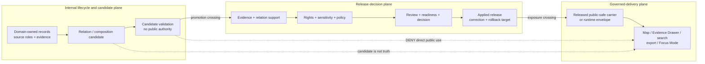

<!-- [KFM_META_BLOCK_V2]
doc_id: kfm://doc/architecture-cross-domain-trust-membrane
title: Trust Membrane — Public vs Internal Boundary
type: architecture-reference
version: v0.2.0
status: draft; repository-grounded; cross-domain-specialization; all-registered-seams-held; bounded-negative-envelope-proof; public-join-hold; non-authoritative; non-publisher
owners:
  - "@bartytime4life — verified CODEOWNERS review route; routing is not stewardship, independent review, approval, release authority, or publication authority"
  - "NEEDS VERIFICATION — cross-domain architecture, participating-domain, evidence, policy, sensitivity, review, release, Governed API, public-client, correction, rollback, and security stewards"
created: 2026-05-24
updated: 2026-08-20
policy_label: public; architecture; cross-domain; trust-membrane; public-use; fail-closed; cite-or-abstain; non-release; non-publication
truth_posture: >-
  CONFIRMED current repository paths, accepted Directory Rules placement,
  five held cross-domain seam projections, bounded join-candidate assessment,
  schema-backed Governed API ABSTAIN and ERROR behavior, internal
  evidence-resolution candidate checks, fixture-only Explorer projection parsing,
  and mixed-maturity release readiness / PROPOSED complete cross-domain
  promotion and exposure composition / UNKNOWN deployed enforcement,
  authoritative evidence and policy services, authenticated review, public static
  delivery, production release application, correction propagation, and rollback
  execution / NEEDS VERIFICATION accountable stewardship, accepted seam
  contracts, outcome mappings, required-check coupling, and the first governed
  cross-domain public response.
owning_root: docs/
responsibility_root: docs/
current_path: docs/architecture/cross-domain/trust-membrane.md
responsibility: >-
  Explain the cross-domain specialization of KFM's trust membrane: what must
  remain internal, what additional closure a multi-domain relation or composition
  needs before ordinary public use, how the current bounded repository proofs fit
  together, and which fail-closed outcomes apply when evidence, policy, release,
  correction, or rollback support is incomplete.
canonical_relationship: >-
  This page is a cross-domain architecture specialization indexed by
  docs/architecture/cross-domain/README.md. It does not replace the doctrine
  articulation at docs/doctrine/trust-membrane.md or the whole-system architecture
  maps at docs/architecture/trust-membrane.md and
  docs/architecture/TRUST_MEMBRANE.md, and it does not resolve their separate
  convergence or case-collision holds.
evidence_snapshot:
  repository: bartytime4life/Kansas-Frontier-Matrix
  base_ref: main
  base_commit: f3595b0ffc819072d5662e6bbf242996f4403fa5
  target_prior_blob: 968ee79eef37138148eab9fe505e9491dbe8ccd4
  parent_readme_blob: 3353a0a0ab5fe3f8f5fdea937b8eecfa34b81032
  directory_rules_blob: fd49a0b83e55cef52c1124281f093e263526898d
  adr_0029_blob: a4de0d7a96b78da59cfc499d1025e1508afd8dd9
  cross_domain_seam_register_blob: dc87ea9c2ab11cc10e51cf4e8284c030e7c9ab29
  cross_lane_relations_blob: 15b7fe05fee251490d1a5db77844cc44b48288bd
  cross_lane_join_contract_blob: 2d78246d66d64d69413686e460321635adfc6170
  governed_api_architecture_blob: dc4dfb2e420f28bbd39b61ef578af4de84d1b04c
  governed_api_main_blob: 4eb335c7c0b27f62c7419c478542e8fe40e1ff38
  governed_api_registry_blob: 3418168d0b267160d6ad6dd87f289e880ef4a024
  governed_api_stub_blob: 371e60d9f96c78e31c8a1e6109d19dee5da4213b
  governed_api_route_test_blob: 2be20f5d93c03da7677c34b11a31875a00b2ed28
  governed_api_boundary_test_blob: 4035e537e6c52194928df5ab8ceb41a35f5f30ca
  runtime_response_schema_blob: 8b86e7db8b18b65a56a4e639dfc54e1b2db93155
  evidence_resolver_readme_blob: d64f112e9fe6538178c74dd31cc751235781c7f3
  explorer_governed_client_blob: 21f6e4d1225ab0427ecb689d6782f4b56fc25ea2
  release_readme_blob: 60b6a656f8f2b765616bba7223f51c25863c7172
  promotion_gates_blob: a3126726a625b5a15712b1c3cc7dc2a317192dd9
  release_state_machine_blob: a5bc6d9cf5497315f63d33012363a1133214867e
inspection_boundary: >-
  Current-session GitHub reads covered the complete prior target, its parent
  cross-domain index, accepted ADR-0029, adopted Directory Rules v2, the current
  Cross-Domain Seam Register, the repository-grounded cross-lane relation
  companion, the bounded CrossLaneJoinAssessment contract, the Governed API
  architecture boundary and executable WSGI scaffold, its exact route registry,
  ABSTAIN and ERROR builders and tests, the current RuntimeResponseEnvelope
  schema, the internal evidence-resolver boundary, the fixture-only Explorer
  governed projection parser, release-root guidance, and current promotion and
  release-state architecture. No live source, authenticated identity provider,
  policy evaluator, authoritative evidence registry, released cross-domain
  carrier, deployed API, browser transport, model provider, public request,
  correction cascade, cache invalidation, or operational rollback was exercised.
related:
  - ./README.md
  - ./source-role-anti-collapse.md
  - ./cross-lane-relations.md
  - ./shared-kernel.md
  - ./compositional-units.md
  - ./multi-domain-placement.md
  - ./responsibility-layers.md
  - ../trust-membrane.md
  - ../TRUST_MEMBRANE.md
  - ../governed-api/README.md
  - ../publication/promotion-gates.md
  - ../publication/release-state-machine.md
  - ../../doctrine/trust-membrane.md
  - ../../doctrine/lifecycle-law.md
  - ../../doctrine/directory-rules.md
  - ../../adr/ADR-0004-apps-governed-api-is-the-trust-membrane.md
  - ../../adr/ADR-0029-adopt-directory-governance-standard-v2.md
  - ../../../control_plane/cross_domain_seam_register.yaml
  - ../../../contracts/joins/cross_lane_join_assessment.md
  - ../../../schemas/contracts/v1/runtime/runtime_response_envelope.schema.json
  - ../../../packages/evidence-resolver/README.md
  - ../../../apps/explorer-web/src/adapters/GovernedClient.ts
  - ../../../release/README.md
tags: [kfm, architecture, cross-domain, trust-membrane, bounded-context, evidence, policy, sensitivity, release, governed-api, finite-outcomes, correction, rollback]
notes:
  - "v0.2.0 replaces a proposal-era public/internal memo with a current repository-grounded cross-domain specialization."
  - "The legacy title, doc_id, path, created date, top anchor, title anchor, and numbered section anchors are preserved."
  - "The legacy lifecycle-wide A–G labels are retained only as a compatibility crosswalk; the current executable A–G profile has different exact gate names and means final promotion readiness only."
  - "All five current machine-registered seams remain HOLD_UNRESOLVED, public_join_allowed false, and without a seam contract path."
  - "This revision changes documentation and its required generated authoring receipt only; it activates no source, seam, policy, route, release, deployment, publication, or repository setting."
[/KFM_META_BLOCK_V2] -->

<a id="top"></a>
<a id="trust-membrane--public-vs-internal-boundary"></a>

# Trust Membrane — Public vs Internal Boundary

> **Operating rule.** A cross-domain candidate may reach ordinary public use only after each participating context remains independently warranted, the relationship itself has admissible support, the most restrictive applicable rights and sensitivity posture is preserved, and a separate governed release and exposure path succeeds. A join, map, model, receipt, workflow, or fluent explanation cannot create that authority.

[](#status-and-evidence-boundary)
[](#directory-rules-basis)
[](#current-registered-seams)
[](#current-dynamic-boundary)
[](#6-outbound-runtime-contract)
[](#authority-boundary)

> [!IMPORTANT]
> **This page is a cross-domain specialization, not the whole Trust Membrane and not its authority source.** It explains what extra closure is required when independently governed domain records, evidence, policies, releases, or representations are composed. Doctrine, accepted ADRs, contracts, schemas, policy, code, tests, evidence, review records, release records, correction records, rollback records, and observed runtime behavior retain their own authority.

> [!CAUTION]
> **Current repository evidence proves bounded refusal behavior, not a complete public trust path.** All five machine-registered cross-domain seams remain held. The current Governed API emits schema-backed `ABSTAIN` and `ERROR` envelopes; the evidence resolver is internal and non-authoritative; the Explorer adapter is fixture-only; and operational release application remains held. No current cross-domain `ANSWER` is established.

> [!WARNING]
> **Do not interpret internal outcome vocabulary as public authority.** `ALLOW` from the fixture-first join helper means only “emit a reviewable `JOIN_CANDIDATE`.” Resolver `RESOLVED`, promotion-gate `PASS`, readiness `APPROVE_READY`, a schema-valid manifest, a green workflow, a merge, or an `AIReceipt` does not mean `ANSWER`, `PUBLISHED`, or public use.

## Current bounded result

| Field | Repository-grounded result |
|---|---|
| **Evidence snapshot** | `main@f3595b0ffc819072d5662e6bbf242996f4403fa5` |
| **Document role** | Human-readable cross-domain public-use boundary under `docs/architecture/cross-domain/`; explanatory only |
| **Directory authority** | Accepted [`ADR-0029`](../../adr/ADR-0029-adopt-directory-governance-standard-v2.md) and adopted [Directory Rules v2](../../doctrine/directory-rules.md) |
| **Registered cross-domain seams** | Five; every entry is `HOLD_UNRESOLVED`, has `public_join_allowed: false`, and has no seam contract path |
| **Executable relation proof** | One deterministic, no-network, synthetic candidate-assessment profile; non-authoritative and non-publishing |
| **Current dynamic API proof** | Three GET scaffolds return `ABSTAIN / NOT_IMPLEMENTED`; unknown routes and unsupported methods return safe `ERROR` envelopes |
| **Current authoritative evidence lookup** | Not established; the package implementation checks a caller-supplied candidate only |
| **Current browser integration** | Fixture-only public-safe projection parser; no live transport or lifecycle-store access |
| **Current production release application** | `HOLD`; fixture-first readiness is not an applied transition |
| **Current cross-domain public `ANSWER`** | None proved |
| **Release or publication effect of this page** | None |

**Quick navigation:** [Status](#status-and-evidence-boundary) · [Scope](#1-scope) · [Boundary](#2-what-the-membrane-separates) · [Crossings](#3-crossings--the-only-legal-paths) · [Gates](#4-promotion-gates-summary) · [Fail-closed risks](#5-the-five-failclosed-domains) · [Outbound](#6-outbound-runtime-contract) · [Inbound](#7-inbound-contract) · [Anti-patterns](#8-anti-patterns) · [Validation](#validation-and-acceptance) · [Open work](#9-open-questions-and-adr-triggers) · [Related](#10-related-docs) · [Appendix](#11-appendix)

---

<a id="status-and-evidence-boundary"></a>

## Status and evidence boundary

The previous edition correctly centered a fail-closed public/internal boundary, but it was written before the repository's current cross-domain seam projection, candidate-assessment slice, Governed API negative-envelope proof, evidence-resolver candidate package, fixture-only Explorer parser, and current release-readiness documentation. It also presented proposal-era paths and a legacy A–G vocabulary as though they formed one implemented crossing.

This revision preserves the durable principle and narrows every implementation claim to what current bytes support.

| Surface | Confirmed state at the evidence snapshot | Safe interpretation |
|---|---|---|
| This page | Existing file; prior blob `968ee79eef37138148eab9fe505e9491dbe8ccd4` | Same-path modernization; no new authority home or migration |
| Parent lane | [`README.md`](README.md) indexes this page as the public-versus-internal cross-domain boundary | The page has a bounded sibling role, not canonical whole-system ownership |
| Directory governance | [`ADR-0029`](../../adr/ADR-0029-adopt-directory-governance-standard-v2.md) is accepted and pins [`docs/doctrine/directory-rules.md`](../../doctrine/directory-rules.md) | The old `OPEN-DR-10` placement hold is stale for this existing path |
| Cross-domain projection | [`cross_domain_seam_register.yaml`](../../../control_plane/cross_domain_seam_register.yaml) is `PROPOSED`, partial, navigation/review only, and fail-closed | Registration does not authorize a join, write, release, or public claim |
| Relation architecture | [`cross-lane-relations.md`](cross-lane-relations.md) preserves ownership, source role, sensitivity, and evidence support | Invariants are explanatory constraints, not universal enforcement proof |
| Candidate assessment | [`CrossLaneJoinAssessment`](../../../contracts/joins/cross_lane_join_assessment.md) has a closed fixture profile, deterministic helper, synthetic cases, focused tests, and a read-only workflow | `ALLOW` creates only an internal review candidate |
| Governed API | The route registry contains `/bootstrap`, `/layers`, and `/evidence`; all return `ABSTAIN / NOT_IMPLEMENTED` | Bounded negative-envelope behavior exists; no substantive `ANSWER` path exists |
| Runtime envelope | The current schema is closed and finite: `ANSWER`, `ABSTAIN`, `DENY`, `ERROR` | Shape does not authenticate evidence, policy, release, or public safety |
| Evidence resolver | [`packages/evidence-resolver/`](../../../packages/evidence-resolver/README.md) implements an internal `v1alpha1` candidate check with `authoritative: false` | `RESOLVED` is not evidence truth, policy permission, release, or `ANSWER` |
| Explorer projection | [`GovernedClient.ts`](../../../apps/explorer-web/src/adapters/GovernedClient.ts) parses one fixture-only public-safe Evidence Drawer profile and performs no network access | Client refusal/parsing proof exists; live API integration is absent |
| Release governance | [`release/`](../../../release/README.md) is the canonical append-only release-decision plane with mixed fixture-first maturity | Operational release, correction propagation, and rollback execution remain held or unknown |

### Truth posture

- **CONFIRMED:** the current paths, blobs, accepted Directory Rules decision, five held seams, bounded candidate assessment, exact API routes, negative-envelope behavior, closed runtime response shape, non-authoritative resolver boundary, fixture-only client parser, and release-application hold described here.
- **PROPOSED:** a complete cross-domain exposure profile, accepted relation-evidence contract, public outcome mapping, authenticated policy/review/release composition, and operational static or dynamic delivery.
- **UNKNOWN:** deployed enforcement, real cross-domain data, authoritative evidence lookup, production policy execution, public cache behavior, correction propagation, and rollback recovery.
- **NEEDS VERIFICATION:** accountable stewards, accepted seam-specific contracts, policy bundle and evaluator binding, reviewer independence, signer trust, consumer closure, required-check significance, and the first governed cross-domain release.
- **HOLD:** every current registered seam, every public cross-domain join, and any substantive cross-domain `ANSWER`.

<a id="directory-rules-basis"></a>

### Directory Rules basis

Accepted Directory Rules §12.5 routes artifacts by primary responsibility:

```text
shared architecture explanation -> docs/architecture/cross-domain/<seam_id>.md
cross-domain semantic contract  -> contracts/cross_domain/<seam_id>/
cross-domain test               -> tests/cross_domain/<seam_id>/
shared validator                -> tools/validators/cross_domain/<seam_id>/
```

The target therefore receives `PLACE` at its existing path. This page may explain a cross-domain crossing but must not become the semantic contract, machine schema, policy source, seam register, validator, release decision, or public payload home.

<a id="authority-boundary"></a>

### Authority boundary and document relationships

| Surface | Current role | Boundary |
|---|---|---|
| [`docs/doctrine/trust-membrane.md`](../../doctrine/trust-membrane.md) | Draft trust-language articulation of the KFM-wide boundary | Doctrine presence is not runtime proof |
| [`docs/architecture/trust-membrane.md`](../trust-membrane.md) | Whole-system explanatory crossing model | Does not settle its case-colliding sibling or create authority |
| [`docs/architecture/TRUST_MEMBRANE.md`](../TRUST_MEMBRANE.md) | Current whole-system architecture and enforcement map | Case-collision convergence remains separate held work |
| This page | Cross-domain specialization for relation and composition exposure | Must defer to owning doctrine, decisions, contracts, policy, release, and implementation |
| [`docs/architecture/governed-api/README.md`](../governed-api/README.md) | Governed API boundary and current negative-envelope map | The app is partial; [`ADR-0004`](../../adr/ADR-0004-apps-governed-api-is-the-trust-membrane.md) remains effectively proposed |
| [`docs/architecture/publication/`](../publication/README.md) | Readiness, release-state, correction, and rollback explanations | Documentation cannot apply a transition |

This update neither selects a canonical whole-system trust-membrane document nor changes the status of any overlapping page.

[Back to top](#top)

---

<a id="1-scope"></a>

## 1. Scope

This page applies when KFM evaluates whether a relation, comparative cell, indicator, summary, map feature, graph edge, export, scene, or AI explanation that combines two or more independently governed contexts may be exposed to an ordinary client.

It answers:

1. What remains on the internal or candidate side?
2. Which additional warranties are required for a cross-domain result?
3. Which current repository components provide bounded proof?
4. Which finite failure state applies when any dependency is absent, stale, conflicted, restricted, unreleased, corrected, withdrawn, or unavailable?
5. Which correction and rollback effects must propagate after public use?

This page does **not**:

- define a domain object or relation taxonomy;
- accept a seam contract, schema, policy family, reason-code registry, or release-state vocabulary;
- activate a source, connector, policy evaluator, API route, model provider, or public client;
- resolve an `EvidenceRef` to an authoritative `EvidenceBundle`;
- authenticate evidence, policy, review, signing, release, or rollback authority;
- create or mutate RAW, WORK, QUARANTINE, PROCESSED, CATALOG, TRIPLET, PUBLISHED, correction, withdrawal, or rollback state;
- lower rights, consent, sovereignty, cultural, ecological, privacy, genomic, private-land, well, or infrastructure protections;
- authorize release, deployment, promotion, publication, or repository-setting changes.

### Non-effects

A documentation edit, receipt, commit, workflow, pull request, merge, schema-valid fixture, candidate `ALLOW`, resolver `RESOLVED`, readiness `PASS`, or GitHub release is not a KFM publication transition.

[Back to top](#top)

---

<a id="2-what-the-membrane-separates"></a>

## 2. What the membrane separates

The cross-domain membrane separates a **candidate composition** from an **ordinary-client representation**. It is not merely a line between folders, nor is it one API endpoint.

### 2.1 Two sides

#### Internal and candidate side

```text
source edge / pre-RAW
  -> RAW
  -> WORK or QUARANTINE
  -> PROCESSED
  -> CATALOG / TRIPLET candidate
  -> cross-domain relation or composition candidate
```

This side may contain legitimate work, individually released participants used in a new unreleased relation, exact or restricted values, unresolved support, inactive policy declarations, model output, provisional graph edges, and generated representations. Repository location alone grants no public authority.

#### Governed public-use side

```text
reviewed relation/composition packet
  -> applied release decision
  -> released public-safe carrier or governed runtime response
  -> ordinary client rendering with evidence, obligations, precision, and correction state
```

This side remains bounded by audience, purpose, time, precision, release, and correction state. It is not permanent or universal truth.

### 2.2 Three planes and two crossings


```mermaid
flowchart LR
  subgraph I["Internal lifecycle and candidate plane"]
    A["Domain-owned records<br/>source roles + evidence"] --> B["Relation / composition candidate"]
    B --> C["Candidate validation<br/>no public authority"]
  end

  subgraph R["Release-decision plane"]
    D["Evidence + relation support"] --> E["Rights + sensitivity + policy"]
    E --> F["Review + readiness + decision"]
    F --> G["Applied release<br/>correction + rollback target"]
  end

  subgraph P["Governed-delivery plane"]
    H["Released public-safe carrier<br/>or runtime envelope"] --> J["Map / Evidence Drawer / search<br/>export / Focus Mode"]
  end

  C -->|"promotion crossing"| D
  G -->|"exposure crossing"| H

  C -. "DENY direct public use" .-> J
  B -. "candidate is not truth" .-> J
```

The two crossings are distinct:

1. **Promotion crossing** — a candidate becomes governed release state through evidence, policy, review, decision, and applied transition.
2. **Exposure crossing** — an already released public-safe carrier or a request-time governed result is delivered to an ordinary client under current audience, purpose, precision, freshness, and correction constraints.

A release decision is not itself a payload. A public-safe payload is not itself a release decision. A runtime response cannot retroactively release its inputs.

### 2.3 Cross-domain strengthening rule

A cross-domain result may be no stronger than:

- every participating endpoint;
- the evidence for the relationship itself;
- the most restrictive applicable source-role, rights, consent, sovereignty, sensitivity, access, review, freshness, correction, and release state;
- the least precise public-safe representation actually warranted; and
- the current ability to correct, withdraw, invalidate, and roll back all downstream carriers.

Individually released participants do not automatically release a new relation. Proximity, shared keys, temporal overlap, schema validity, and model plausibility are candidate signals, not relationship truth.

[Back to top](#top)

---

<a id="3-crossings--the-only-legal-paths"></a>

## 3. Crossings — the only legal paths

There is no single current executable “cross the membrane” command. The legal path is a composition of separately owned controls.

### 3.1 Current crossing map

| Stage | Required meaning | Current repository result |
|---|---|---|
| Domain endpoint preparation | Each context preserves identity, source role, evidence, sensitivity, policy, review, and release state | Participating-domain maturity varies; complete closure is not proved here |
| Cross-domain candidate assessment | Evaluate a bounded relationship without mutation or publication | **CONFIRMED bounded:** synthetic `CrossLaneJoinAssessment`; `ALLOW` emits only a `JOIN_CANDIDATE` |
| Seam governance | Register participants, owned concepts, prohibited inferences, and fail-closed defaults | **CONFIRMED projection / HOLD:** all five entries remain unresolved and non-public |
| Promotion readiness | Check declared final candidate closure | **CONFIRMED bounded:** current A–G validator; `PASS` means `APPROVE_READY` only |
| Release decision and application | Authenticate actors, evidence, policy, review, bytes, before/after state, carrier binding, correction, and rollback | **HOLD / UNKNOWN:** no production application path is established |
| Governed dynamic delivery | Return a finite runtime envelope from the Governed API | **CONFIRMED negative slice:** three ABSTAIN routes plus safe 404/405 ERROR behavior |
| Governed static delivery | Serve release-approved public-safe carriers with current manifest and correction state | **NEEDS VERIFICATION:** no public origin, cache, or parity proof was exercised |
| Public client rendering | Render only governed results and preserve evidence/trust state | **CONFIRMED fixture-only parser; live transport absent** |
| Governed AI interpretation | Interpret released evidence through a finite response and accountable execution | **HOLD:** no live Focus/model route or provider transaction is proved |

<a id="current-dynamic-boundary"></a>

### 3.2 Current dynamic boundary

The executable [`registry.py`](../../../apps/governed-api/src/governed_api/routes/registry.py) contains exactly:

```text
/bootstrap
/layers
/evidence
```

Each registered GET route currently returns `ABSTAIN / NOT_IMPLEMENTED`. Unknown routes return `404`, and unsupported methods on registered routes return `405`; both use a safe `ERROR / SAFE_RUNTIME_ERROR` envelope. Focused tests assert the exact route set, schema-backed required fields, no precision disclosure on negative outcomes, selected forbidden renderer/model imports, and no direct internal-store path literals.

That proves a useful fail-closed scaffold. It does not prove caller identity, authorization, authoritative evidence lookup, policy execution, relation support, applied release state, substantive answer composition, deployment, or public operation.

<a id="cross-domain-public-use-closure"></a>

### 3.3 Minimum public-use closure

Before a cross-domain `ANSWER` or released public carrier, a reviewed implementation must establish at least:

1. stable identities for every participant and the relation or composition;
2. accepted semantic and machine profiles for the specific seam;
3. independently resolvable support for each consequential participant claim;
4. independently resolvable support for the relationship itself;
5. preserved source roles and explicit derivation lineage;
6. coherent spatial and temporal scopes;
7. current rights, consent, sovereignty, sensitivity, purpose, audience, and access decisions;
8. the most restrictive public-safe precision and transformation receipts;
9. authenticated review appropriate to consequence and required independence;
10. a separately authorized and actually applied release transition;
11. a public-safe carrier or finite runtime envelope bound to current release and correction state;
12. a correction, withdrawal, invalidation, notice, and rollback path tested for every downstream consumer.

Missing relation evidence cannot be repaired by stronger endpoint evidence. Missing release for one participant cannot be repaired by release of another.

<a id="current-registered-seams"></a>

### 3.4 Current registered seams

| Seam | Participants | Public-use blocker | Current state |
|---|---|---|---|
| `agriculture--soil--suitability-context` | Agriculture · Soil | Soil properties cannot become observed crop yield or a private farm/operator/parcel join | `HOLD_UNRESOLVED` |
| `archaeology--roads-rail-trade--historic-corridor-context` | Archaeology · Roads/Rail/Trade | Corridor proximity cannot become archaeological site identity, location, or evidence | `HOLD_UNRESOLVED` |
| `atmosphere--hazards--condition-advisory-context` | Atmosphere · Hazards | Advisories cannot become measurements; models or forecasts cannot become observations | `HOLD_UNRESOLVED` |
| `fauna--hydrology--aquatic-occurrence-context` | Fauna · Hydrology | A hydrologic unit cannot disclose a precise sensitive occurrence or prove an established population | `HOLD_UNRESOLVED` |
| `hazards--settlements-infrastructure--exposure-context` | Hazards · Settlements/Infrastructure | Exposure summaries cannot reveal precise critical assets or transfer asset identity authority | `HOLD_UNRESOLVED` |

For every entry, `public_join_allowed` is false and `seam_contract_path` is null.

### 3.5 Illegal shortcuts and finite disposition

| Shortcut | Required disposition |
|---|---|
| Ordinary client reads RAW, WORK, QUARANTINE, unresolved evidence, or an internal candidate | `DENY` or safe `ERROR`; no partial payload |
| Candidate helper returns `ALLOW`, and a caller treats it as public truth | Reject the mapping; keep the report internal |
| Evidence resolver returns `RESOLVED`, and a caller treats it as `ANSWER` | Reject; authoritative evidence, policy, review, and release remain absent |
| One participant is released, so the relation is exposed | `ABSTAIN` or `DENY` until every participant and the relation close |
| Styling, aggregation, or generalization is used to infer permission | `DENY` unless accepted policy and a recorded transform authorize the result |
| A gate, workflow, receipt, pull request, or merge is treated as release | Preserve prior state; require the separately governed transition |
| A correction is silently edited into a current public payload | Withdraw or supersede through append-only correction and release processes |

[Back to top](#top)

---

<a id="4-promotion-gates-summary"></a>

## 4. Promotion gates summary

The prior edition used A–G for lifecycle-wide source admission, provenance, sensitivity, validation, evidence closure, review, and release. Those controls remain relevant, but they are **not** the exact current executable A–G gate names.

> [!CAUTION]
> **Use the exact gate name and profile, never a letter alone.** Repository history overloads A–G. [`promotion-gates.md`](../publication/promotion-gates.md) is the current compatibility-preserving explanation, and [`release-state-machine.md`](../publication/release-state-machine.md) separates lifecycle stage, readiness, decision, transition application, and public-serving state.

### 4.1 Legacy lifecycle-wide crosswalk

| Legacy letter/title | Current disposition |
|---|---|
| A — source admission | Still a lifecycle-wide source control; not current executable Gate A |
| B — provenance | Still cross-cutting evidence; current executable Gate B is narrower declared digest agreement |
| C — sensitivity | Still a distributed policy obligation; current executable Gate C is geometry and CRS |
| D — validation | Still lifecycle-wide; current executable Gate D is temporal semantics |
| E — evidence closure | Still required; current executable Gate E is rights and sensitivity |
| F — review | Still required where applicable; current executable Gate F is proof and catalog support |
| G — release | Still a separate decision/application concern; current executable Gate G checks review and rollback declarations |

### 4.2 Current bounded final-readiness A–G

| Gate | Exact executable name | Bounded question | A local `PASS` does **not** prove |
|:---:|---|---|---|
| A | `identity_and_closure` | Are profile, candidate, spec, lifecycle, and minimal manifest declarations complete? | Source admission, object existence, accepted contracts, or release |
| B | `asset_integrity` | Do declared specification hashes and artifact-digest sets agree? | Actual bytes, canonicalization, producer authority, immutability, or signer trust |
| C | `geometry_and_crs` | Is declared geometry deterministic and locally valid under the bounded profile? | Domain fitness, authoritative geometry, or public-safe precision |
| D | `temporal_semantics` | Are declared timestamps and ordering internally valid? | Source freshness policy, bitemporal authority, or trusted current time |
| E | `rights_and_sensitivity` | Is the supplied policy declaration locally admissible? | Execution of accepted rights, consent, sovereignty, sensitivity, or access policy |
| F | `proof_and_catalog_support` | Are required evidence, receipt, attestation, and catalog references declared? | Reference resolution, EvidenceBundle truth, signer trust, or catalog integrity |
| G | `review_and_rollback` | Are fixture-only review, binding, correction, and rollback declarations internally safe? | Authenticated identity, reviewer qualification, independence, usable rollback, or correction propagation |

Gate outcomes are `PASS`, `ABSTAIN`, `DENY`, or `ERROR`; aggregate precedence is `ERROR > DENY > ABSTAIN > PASS`. Overall `PASS` maps only to `APPROVE_READY`. It does not emit a decision, apply lifecycle state, release a carrier, deploy a service, or publish.

### 4.3 Re-evaluation rule

Readiness and exposure must be re-evaluated when any material dependency changes, including:

- source role, rights, consent, sovereignty, or sensitivity;
- participant evidence or relation evidence;
- spatial or temporal scope;
- public precision or transformation;
- policy bundle or obligation;
- review state;
- release, correction, withdrawal, supersession, or rollback state;
- schema, contract, validator, renderer, API, or public-client profile.

A prior pass does not survive a material change by default.

[Back to top](#top)

---

<a id="5-the-five-failclosed-domains"></a>
<a id="5-the-five-fail-closed-domains"></a>

## 5. Fail-closed cross-domain risk classes

The previous heading described “five fail-closed domains.” Current KFM doctrine and repository evidence support a broader and more accurate rule: **fail closed by risk and consequence, not by a permanently fixed domain count**. A single domain may carry several risk classes, and composition may create a new risk even when each input is individually public.

| Risk class | Cross-domain failure mode | Default posture |
|---|---|---|
| Unknown identity, source role, rights, terms, consent, or authority | A join upgrades an unclassified source or unsupported use | `HOLD`, `ABSTAIN`, or `DENY`; do not guess |
| Archaeological, cultural, tribal, sacred, or sovereignty-sensitive material | Context reveals a site, association, or knowledge relationship | Withhold, generalize, stage access, or deny pending qualified review |
| Living-person, genealogical, genomic, familial, or re-identifiable data | Composition creates identity or relationship disclosure | Deny ordinary public use unless accepted consent, purpose, and privacy controls prove otherwise |
| Rare-species, ecological, habitat, or restoration-sensitive locations | Public context narrows a protected occurrence or vulnerability | Generalize, delay, stage access, or deny exact precision |
| Critical infrastructure, operational security, emergency, or harmful asset precision | Exposure summary reveals a target, dependency, or exact asset | Most restrictive precision; usually generalize or deny |
| Parcel, title, private land, private well, farm/operator, or confidential administrative detail | Shared keys or spatial overlap re-identify a person, holding, or legal interest | Restrict or deny; aggregation alone is not permission |
| Harmful precision or mosaic/re-identification risk | Multiple public inputs combine into a sensitive exact inference | Evaluate composition risk; apply the most restrictive result and recorded transform |
| Stale, corrected, superseded, withdrawn, revoked, conflicted, or unreleased support | Old or negative state is reused as current warrant | No `ANSWER`; expose safe history only where policy permits |
| Unsupported relation or prohibited inference | Endpoint facts are used to imply relationship truth | Keep candidate internal; `ABSTAIN` or `DENY` public use |
| Unavailable policy, evidence, release, correction, or rollback dependency | System cannot prove the crossing | Safe `ERROR`, `ABSTAIN`, or `DENY`; never fallback to allow |

### 5.1 Most-restrictive composition

The current seam register defaults to:

```text
interaction: CITE_ONLY
evidence: EACH_PARTICIPANT_EVIDENCE_BUNDLE_REQUIRED
source role: PRESERVE
sensitivity: MOST_RESTRICTIVE
policy: MOST_RESTRICTIVE
release: EACH_PARTICIPANT_RELEASE_REQUIRED
mutation authority: false
publication authority: false
```

A relation may introduce additional restrictions but may not silently lower a participant's protection.

### 5.2 Aggregation and generalization

Aggregation, rounding, tiling, styling, redaction, and generalization are **transforms**, not permissions. A public-safe transform needs:

- an accepted purpose and audience;
- a policy decision that authorizes the transformation and resulting precision;
- a reproducible method and transform receipt;
- residual-risk review, including mosaic effects with other public layers;
- release binding and a correction/rollback path.

A county summary can still disclose a protected fact when the group is small, the attributes are unique, or another released layer supplies the missing key. “Aggregated” must never be treated as synonymous with “safe.”

[Back to top](#top)

---

<a id="6-outbound-runtime-contract"></a>

## 6. Outbound runtime contract

Every ordinary dynamic response must use a finite governed outcome. The current proposed [`RuntimeResponseEnvelope`](../../../schemas/contracts/v1/runtime/runtime_response_envelope.schema.json) has ten unconditional fields:

```text
id
spec_hash
version
issued_at
outcome
reason_code
evidence_refs
policy_state
freshness
correction_state
```

Its finite outcomes are:

| Outcome | Public meaning |
|---|---|
| `ANSWER` | The orchestrator has sufficient admissible support for the exact scope and discloses the precision actually used |
| `ABSTAIN` | The operation is in scope, but evidence, freshness, relation support, release, or another non-policy dependency is insufficient |
| `DENY` | Policy, rights, sensitivity, audience, purpose, or prohibited-inference rules block exposure |
| `ERROR` | A required system dependency failed before a safe substantive result could be produced |

### 6.1 Structural obligations

- `ANSWER` requires at least one `evidence_ref` and `precision_actually_used`.
- Non-`ANSWER` outcomes must not carry `precision_actually_used`.
- The schema is closed; prose must not invent extra cross-domain, AI, review, or release fields.
- The schema validates shape. It does not authenticate refs, evaluate policy, prove freshness, establish release, or make a claim true.
- The current envelope has no `AIReceipt` member and no general answer-payload member. The previous page's claim that every response carries an AIReceipt is therefore not a current envelope guarantee.

### 6.2 Internal vocabularies are not public outcomes

| Internal or readiness result | What it means | What it must not become automatically |
|---|---|---|
| Join helper `ALLOW / JOIN_CANDIDATE` | Local candidate emission is permitted | `ANSWER`, relationship truth, policy approval, or release |
| Join helper `ABSTAIN / DENY / ERROR` | Candidate is not safely emitted under the fixture profile | A public envelope without an accepted mapping and orchestrator |
| Evidence resolver `RESOLVED` | Caller-supplied candidate passed the internal alpha checks | Evidence truth, policy permission, review, release, or `ANSWER` |
| Promotion gate `PASS` | One readiness gate passed | Approval or lifecycle mutation |
| Overall `APPROVE_READY` | Packet may proceed to separately governed decision handling | `APPROVE`, `PUBLISHED`, or public serving |
| Schema-valid `ReleaseManifest` candidate | Candidate shape is locally valid | An authenticated, applied release |
| Runtime `ANSWER` | Public finite outcome after all owning checks | Permanent or universal truth |

### 6.3 Cross-domain `ANSWER` obligations

A cross-domain orchestrator must not emit `ANSWER` merely because the envelope shape permits it. It must also prove, through owning objects and services rather than ad hoc envelope fields:

- every participant's current release and evidence support;
- relationship-level evidence;
- source-role preservation;
- most-restrictive rights, sensitivity, policy, and audience obligations;
- public-safe spatial, temporal, and attribute precision;
- correction, withdrawal, and supersession state;
- a current release binding;
- no prohibited inference;
- safe client projection and downstream correction behavior.

The exact reference profile for those objects remains **PROPOSED / NEEDS VERIFICATION**.

### 6.4 Current browser boundary

The Explorer [`GovernedClient.ts`](../../../apps/explorer-web/src/adapters/GovernedClient.ts) validates a separate, deliberately small, fixture-only Evidence Drawer projection. It rejects malformed profiles, preserves finite outcomes, renders negative and correction history, and performs no network or lifecycle-store access.

That parser is useful bounded proof. It is not the canonical runtime envelope, not a live Governed API client, not evidence authentication, and not deployed public behavior.

### 6.5 Information-disclosure rule

Public errors, denials, logs, receipts, and telemetry must not expose:

- RAW/WORK/QUARANTINE paths or object locators;
- exact restricted geometry or suppressed values;
- protected source or reviewer identities;
- credentials, tokens, system prompts, model context, or private reasoning;
- internal registry, cache, graph, vector-index, or lifecycle identifiers not approved for the audience;
- policy details that would reveal protected facts.

Use bounded public reason classes and retain sensitive diagnostics in appropriately controlled operational records.

[Back to top](#top)

---

<a id="7-inbound-contract"></a>

## 7. Inbound contract

The membrane also constrains what can enter a cross-domain candidate. Admission does not make the material public; it only makes the candidate reviewable.

### 7.1 Minimum candidate context

A reviewable cross-domain candidate should declare, through accepted owning profiles:

- stable seam or composition identity;
- participant context IDs and owned object identities;
- endpoint source roles;
- endpoint evidence refs and relation evidence refs;
- spatial scope, temporal scope, and requested join tolerance;
- rights, consent, sensitivity, audience, purpose, and public-precision context;
- prohibited inferences;
- dependency, freshness, correction, and release snapshots;
- intended output role, which must remain a candidate or derived relation until released.

Missing or ambiguous values fail closed; the implementation must not infer authority from path, name, proximity, or display context.

### 7.2 Current bounded candidate assessment

The current [`CrossLaneJoinAssessment`](../../../contracts/joins/cross_lane_join_assessment.md) is fixture-first, dry-run, local-only, and non-authoritative. It supports synthetic exact-key and spatial-temporal candidate checks and returns:

| Outcome | Bounded meaning |
|---|---|
| `ALLOW` | Emit a reviewable `JOIN_CANDIDATE`; pair-specific validation and all later governance remain required |
| `ABSTAIN` | Evidence, source role, sensitivity, predicate, or dependency context is insufficient for unrestricted candidate emission |
| `DENY` | A bounded living-person or exact-geometry rule blocks candidate emission |
| `ERROR` | A declared dependency failed; no candidate assertion is made |

Its effects are fixed to false for lifecycle writes, evidence creation, policy decisions, review decisions, release decisions, publication, and public use.

### 7.3 Other inbound flows

| Inbound flow | Required posture |
|---|---|
| Connector or official API response | Admit through source-owned controls and `SourceDescriptor`; route to RAW or QUARANTINE; never directly to a public seam |
| User-contributed or steward-uploaded material | Quarantine by default until identity, rights, sensitivity, evidence, and review are resolved |
| Model, search, graph, or vector-index suggestion | Treat as candidate context only; never as evidence or relationship truth |
| Tool response | Treat as untrusted data; validate scope, identity, shape, policy, and evidence before reuse |
| Correction request | Accept through a governed interface; do not mutate prior public history in place |
| Existing released participant | May be cited as context; does not independently release the new relation |

### 7.4 Write and mutation boundary

The current Cross-Domain Seam Register explicitly grants no mutation or publication authority. A cross-domain candidate may not modify a participating domain record, create evidence, change sensitivity, apply a policy decision, write release state, or publish a carrier merely because it spans domains.

[Back to top](#top)

---

<a id="8-anti-patterns"></a>

## 8. Anti-patterns

| Anti-pattern | Why it breaks the membrane | Required correction |
|---|---|---|
| Direct public read from RAW, WORK, QUARANTINE, internal evidence stores, graph stores, vector indexes, or model runtimes | Bypasses evidence, policy, release, and correction controls | Use a governed interface or released public-safe carrier |
| Treating `JOIN_CANDIDATE` as relationship truth | Candidate validation does not prove semantics, support, policy, review, or release | Keep internal; require seam-specific closure |
| Using one participant's EvidenceBundle for the whole relation | Endpoint evidence does not prove the relation or the other endpoint | Resolve each participant and relation support separately |
| Selecting an arbitrary lead domain | Transfers ownership by convenience | Preserve bounded contexts and assign the seam separately |
| Relabeling modeled, advisory, aggregate, administrative, candidate, or synthetic material as observation | Changes what the source can prove | Preserve native roles and derivation lineage |
| Sensitivity laundering through join, aggregate, style, tile, map, graph, AI summary, or export | Composition can reveal more than any input alone | Apply most-restrictive policy and residual-risk review |
| Using a legacy A–G letter without the exact profile and name | Historical vocabularies conflict | Name the exact current gate or say “lifecycle-wide control” |
| Assuming every runtime response carries `AIReceipt` | Current RuntimeResponseEnvelope has no such field | Use an accepted separate linkage profile when one exists |
| Treating the fixture-only Explorer parser as live API integration | No network or authoritative service is invoked | Keep deployment/integration claims on HOLD |
| Storing public payloads in `release/` | Release decisions and public carriers are distinct families | Keep decisions in `release/`; released carriers in the governed published-data lane |
| Treating a workflow, receipt, PR, merge, GitHub release, badge, or documentation statement as KFM release | Repository state is not publication state | Require an applied release transition and public-carrier binding |
| Silent correction of a released relation | Erases lineage and leaves downstream consumers stale | Issue a governed successor, correction/withdrawal records, invalidation, and rollback evidence |
| Leaking internal identifiers or protected reasons in public errors | Turns refusal into information disclosure | Emit bounded public reason classes and controlled internal diagnostics |
| Letting AI or a map infer prohibited relationships from visual proximity | Renderer/model plausibility outruns evidence | Return `ABSTAIN` or `DENY`; require relation evidence |
| Allowing one released participant to “pull” an unreleased participant across the membrane | Release is participant- and relation-specific | Require each participant release plus relation release |

[Back to top](#top)

---

<a id="validation-and-acceptance"></a>

## Validation and acceptance

### Current bounded proof inventory

| Surface | What is proved | What remains outside proof |
|---|---|---|
| Seam Register validator and tests | Projection shape, registered participants, held state, selected repository bindings, and fail-closed defaults | Real relation truth, policy, review, release, or public use |
| CrossLaneJoinAssessment packet | Deterministic synthetic candidate outcomes and non-effects | Real geometry, authoritative evidence, pair-specific policy, release, or deployment |
| Governed API route and boundary tests | Exact three-route manifest, schema-backed negative envelopes, 404/405 behavior, selected forbidden imports and path literals | Identity, authorization, evidence, policy, release, deployment, and `ANSWER` |
| RuntimeResponseEnvelope schema and validator family | Closed finite machine shape and answer-only precision disclosure | Semantic correctness, evidence authenticity, policy, review, release, or truth |
| Evidence resolver package | Deterministic caller-supplied candidate checks with no network and `authoritative: false` | Registry lookup, claim closure, rights/sensitivity, policy, review, release, or public outcome |
| Explorer governed parser | Strict fixture-only projection parsing, finite states, negative/correction history, no network | Live transport, authoritative evidence, release parity, deployed accessibility, or public operation |
| Release readiness surfaces | Fixture-first shape, readiness, rollback-card, and alias-preflight checks | Authenticated decision, applied transition, public carrier, invalidation, correction propagation, or operational rollback |

### Documentation validation for this revision

The implementation change should pass:

- KFM meta-block parsing;
- exactly one H1 and no heading-level jumps;
- balanced fenced blocks;
- unique explicit anchors and resolution of every local fragment;
- existence of every repository-relative link at the pinned base or exact PR head;
- Mermaid source checks;
- no tabs, trailing whitespace, unsafe raw HTML, or missing final newline;
- generated-receipt schema and SHA-256 binding;
- exact changed-path inventory;
- repository-native docs build, link check, metadata checks, document graph, validator suite, and relevant security checks at the PR head.

A green documentation run proves the document renders and references current repository surfaces. It does not prove the architecture is operational.

### Graduation tests for a real cross-domain public path

A future implementation must include exact-negative tests showing that:

1. missing relation evidence prevents `ANSWER`;
2. one unreleased participant prevents public exposure;
3. a corrected, superseded, withdrawn, revoked, or stale participant cannot resolve as current support;
4. source-role mismatch cannot be relabeled by the join;
5. most-restrictive policy and precision win;
6. exact sensitive geometry cannot leak through payload, error, logs, receipts, tiles, exports, or cache keys;
7. unavailable policy, evidence, review, release, or correction services fail closed;
8. internal `ALLOW`, `RESOLVED`, `PASS`, or `APPROVE_READY` cannot be parsed as public `ANSWER`;
9. correction and withdrawal invalidate every governed API, map, graph, search, export, AI, and cache consumer in scope;
10. rollback restores a previously governed safe target without erasing history or reviving withdrawn support;
11. direct client access to canonical/internal stores remains impossible;
12. replay is deterministic for the declared synthetic profile and performs no network or publication write.

[Back to top](#top)

---

<a id="9-open-questions-and-adr-triggers"></a>

## 9. Open questions and ADR triggers

| Open item | Current status | Decision or evidence needed |
|---|---|---|
| Exact canonical relationship among doctrine, lowercase/uppercase whole-system architecture pages, and this specialization | `NEEDS VERIFICATION` | Reviewed document-convergence decision without case-only migration risk |
| Cross-domain seam-register authority and stewardship | `PROPOSED / HOLD` | Accepted decision, named accountable owner, review separation, correction and retirement rules |
| Seam-specific semantic and machine profiles | `HOLD` | Accepted contracts and schemas per seam before public use |
| Relation-evidence profile | `UNKNOWN` | Contract defining how relationship support differs from endpoint support |
| Internal candidate-to-public outcome mapping | `PROPOSED` | Accepted orchestration contract; no direct `ALLOW`/`RESOLVED`/`PASS` mapping |
| Governed API as the dynamic membrane | `ADR-0004 proposed` | Accepted decision plus identity, authorization, evidence, policy, release, and deployment proof |
| Audience, purpose, and public reason-code vocabularies | `PROPOSED / CONFLICTED` | Accepted contracts, policy, client mapping, and disclosure review |
| A–G vocabulary | `CONFLICTED` | Resolve ADR-0018 checkpoint; preserve exact gate names and legacy crosswalk |
| Production release-state and transition-application model | `HOLD` | Accepted profiles, authenticated actors, durable application receipts, public carrier binding |
| Static public delivery | `UNKNOWN` | Approved origin/CDN/object-store boundary, headers, cache invalidation, release parity, and access policy |
| AIReceipt linkage | `NEEDS VERIFICATION` | Accepted separate object/linkage profile; do not add prose-only fields to RuntimeResponseEnvelope |
| Correction, withdrawal, supersession, invalidation, and rollback propagation | `UNKNOWN / HOLD` | End-to-end consumer inventory and measured recovery drill |
| Public-safe cross-domain precision | `NEEDS VERIFICATION` | Per-seam policy, transformation, residual-risk, and mosaic-effect tests |
| First governed cross-domain release | `UNKNOWN` | One fixture-first, low-risk seam with explicit owners, evidence, policy, review, release, correction, and rollback |

### Recommended smallest follow-on slice

**PROPOSED:** implement one deterministic, no-network **cross-domain exposure-decision candidate** over synthetic public-safe inputs. It should consume two participant release/evidence snapshots, separate relation evidence, a most-restrictive policy context, precision declarations, and correction state; then prove that missing relation evidence, one unreleased participant, stale/corrected support, or a stricter sensitivity posture can never produce an `ANSWER` candidate.

The slice must remain internal and non-publishing. It should reuse current object families where accepted, avoid adding ad hoc fields to the closed RuntimeResponseEnvelope, and introduce no live source, public route, provider, release transition, deployment, or publication.

[Back to top](#top)

---

<a id="10-related-docs"></a>

## 10. Related docs

| Reference | Role | Current posture |
|---|---|---|
| [`README.md`](README.md) | Cross-domain lane authority and current inventory | Repository-grounded explanatory index |
| [`source-role-anti-collapse.md`](source-role-anti-collapse.md) | Preserve what each source can prove | Draft architecture; acceptance of one global enum remains open |
| [`cross-lane-relations.md`](cross-lane-relations.md) | Ownership, source role, sensitivity, and evidence invariants | Repository-grounded; bounded candidate proof; policy inactive |
| [`shared-kernel.md`](shared-kernel.md) | Older shared-object vocabulary | Proposal-era draft; verify against current contracts and schemas |
| [`compositional-units.md`](compositional-units.md) | Focus Mode, matrix, and 3D composition boundaries | Repository-grounded explanatory draft |
| [`multi-domain-placement.md`](multi-domain-placement.md) | Responsibility-root path selection | Repository-grounded placement guidance |
| [`responsibility-layers.md`](responsibility-layers.md) | Evidence-to-operations review lens | Repository-grounded; exact eight-layer model remains proposed |
| [`docs/doctrine/trust-membrane.md`](../../doctrine/trust-membrane.md) | KFM-wide trust-language doctrine articulation | Draft doctrine; not runtime proof |
| [`docs/architecture/trust-membrane.md`](../trust-membrane.md) | Whole-system architectural crossing model | Repository-grounded; case-collision migration held |
| [`docs/architecture/TRUST_MEMBRANE.md`](../TRUST_MEMBRANE.md) | Whole-system current architecture and enforcement map | Repository-grounded; overlapping identity remains unresolved |
| [`Governed API architecture`](../governed-api/README.md) | Dynamic boundary, envelopes, threat, and deployment companions | Bounded negative-envelope implementation; composed path held |
| [`Promotion gates`](../publication/promotion-gates.md) | Current bounded A–G profile and legacy crosswalk | Fixture-first, vocabulary-conflicted, non-authoritative |
| [`Release state machine`](../publication/release-state-machine.md) | Lifecycle/readiness/decision/application/public-serving separation | Transition application held |
| [`Cross-Domain Seam Register`](../../../control_plane/cross_domain_seam_register.yaml) | Machine navigational/review projection | Proposed, partial, all entries held |
| [`CrossLaneJoinAssessment`](../../../contracts/joins/cross_lane_join_assessment.md) | Synthetic candidate semantics | Proposed, local-only, non-authoritative |
| [`RuntimeResponseEnvelope schema`](../../../schemas/contracts/v1/runtime/runtime_response_envelope.schema.json) | Finite public response shape | Proposed closed schema with bounded executable negative integration |
| [`Evidence resolver`](../../../packages/evidence-resolver/README.md) | Internal candidate resolution check | `v1alpha1`, no-network, `authoritative: false` |
| [`Explorer GovernedClient`](../../../apps/explorer-web/src/adapters/GovernedClient.ts) | Fixture-only public-safe projection parser | No live transport or lifecycle-store access |
| [`release/`](../../../release/README.md) | Canonical release-decision plane | Mixed fixture-first maturity; operational release held |
| [`data/published/`](../../../data/published/README.md) | Released public-safe carrier lane | Payload/runtime enforcement remains unverified |

[Back to top](#top)

---

<a id="11-appendix"></a>

## 11. Appendix

<details>
<summary><strong>11.1 At-a-glance boundary</strong></summary>

```text
INTERNAL / CANDIDATE
  domain records + evidence
    -> relation/composition candidate
    -> synthetic assessment
    -> seam remains held unless accepted

PROMOTION CROSSING
  participant evidence + relation evidence
    -> rights / sensitivity / policy
    -> authenticated review
    -> readiness
    -> decision
    -> applied release + correction + rollback

EXPOSURE CROSSING
  released public-safe carrier or governed runtime response
    -> map / drawer / search / export / Focus Mode
    -> current evidence, obligations, precision, correction state

NO SHORTCUT:
  candidate ALLOW != resolver RESOLVED != gate PASS != APPROVE_READY
  != applied release != RuntimeResponseEnvelope ANSWER
```

</details>

<details>
<summary><strong>11.2 Finite vocabularies by boundary</strong></summary>

| Boundary | Vocabulary | Authority limit |
|---|---|---|
| Join candidate assessment | `ALLOW / ABSTAIN / DENY / ERROR` | Internal synthetic candidate only |
| Evidence resolver candidate | `RESOLVED / UNRESOLVED / DENIED / ERROR` | Internal, non-authoritative |
| Promotion gate | `PASS / ABSTAIN / DENY / ERROR` | Readiness check only |
| Readiness aggregate | `APPROVE_READY / BLOCKED` | Handoff only |
| Proposed promotion decision | `APPROVE / DENY / ABSTAIN` | Actor authority and application unproved |
| Public runtime | `ANSWER / ABSTAIN / DENY / ERROR` | Finite client response after owning checks |
| Public client negative history | `HELD / DENIED / SUPERSEDED / REVOKED / WITHDRAWN` | Fixture-only projection vocabulary; not a universal release enum |

</details>

<details>
<summary><strong>11.3 Compatibility anchors preserved</strong></summary>

The following v0.1 fragment identities remain available:

```text
#1-scope
#2-what-the-membrane-separates
#3-crossings--the-only-legal-paths
#4-promotion-gates-summary
#5-the-five-failclosed-domains
#6-outbound-runtime-contract
#7-inbound-contract
#8-anti-patterns
#9-open-questions-and-adr-triggers
#10-related-docs
#11-appendix
```

The old title fragment is also retained as `#trust-membrane--public-vs-internal-boundary`.

</details>

<details>
<summary><strong>11.4 Change history</strong></summary>

| Edition | Date | Material change |
|---|---|---|
| `v0.1` | 2026-05-24 | Proposal-era public/internal boundary; legacy lifecycle-wide A–G; unverified implementation claims |
| `v0.2.0` | 2026-08-20 | Same-path repository-grounded rewrite; cross-domain specialization; five held seams; bounded candidate, API, resolver, client, and release evidence; current A–G crosswalk; expanded fail-closed risk classes; explicit validation and rollback |

</details>

### Documentation rollback

Before merge, close the draft pull request or reset the feature branch through normal reviewed Git history. After an authorized merge, revert this document and its generated authoring receipt together. No data migration, source deactivation, policy rollback, route change, cache invalidation, release withdrawal, deployment rollback, or public correction is required because this revision changes explanatory documentation only.

---

> **Final rule.** A cross-domain result crosses the membrane only when every participant remains independently warranted, the relation has its own support, the strictest applicable policy and precision survive composition, and release plus exposure are separately governed and reversible. Otherwise KFM abstains, denies, or errors without leaking internal state.

[Back to top](#top)
