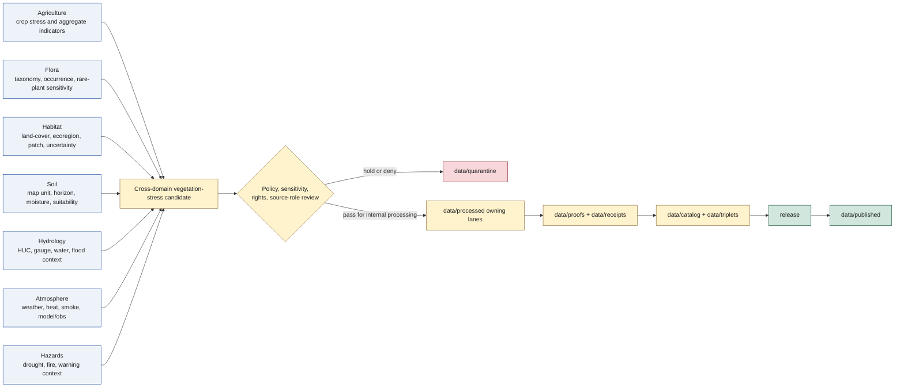

<!-- [KFM_META_BLOCK_V2]
doc_id: kfm://doc/architecture/cross-domain/vegetation-stress
title: Vegetation Stress Cross-Domain Architecture
type: standard
version: v0.1.0
status: draft
owners:
  - <architecture-steward>
  - <agriculture-domain-steward>
  - <flora-domain-steward>
  - <habitat-domain-steward>
  - <soil-domain-steward>
  - <hydrology-domain-steward>
  - <atmosphere-domain-steward>
  - <hazards-domain-steward>
  - <policy-steward>
  - <evidence-steward>
  - <release-steward>
  - <docs-steward>
created: NEEDS VERIFICATION - scaffold existed before 2026-06-29 expansion
updated: 2026-06-29
policy_label: public
truth_posture: cite-or-abstain
responsibility_root: docs/
architecture_lane: cross-domain
topic: vegetation-stress
path_posture: existing-proposed-scaffold-replaced; cross-domain-folder-placement-remains-proposed-by-cross-domain-readme-open-dr-10; directory-rules-prefer-flat-architecture-topic-files; target-path-confirmed-by-existing-file; implementation-maturity-needs-verification
sensitivity_posture: cross-domain-join-sensitive; no-public-truth-by-placement; no-life-safety-alert; no-farm-management-prescription; no-rare-plant-location-release; no-private-field-operator-parcel-join; no-official-drought-or-hazard-authority; source-role-preserving; evidence-aware; policy-aware; release-gated; correction-and-rollback-aware
related:
  - README.md
  - ../README.md
  - ../../doctrine/directory-rules.md
  - ../../doctrine/lifecycle-law.md
  - ../../doctrine/trust-membrane.md
  - ../../domains/agriculture/README.md
  - ../../domains/agriculture/CANONICAL_PATHS.md
  - ../../domains/agriculture/CROSS_LANE.md
  - ../../domains/agriculture/SENSITIVITY.md
  - ../../domains/agriculture/PIPELINE.md
  - ../../../data/README.md
  - ../../../data/work/README.md
  - ../../../data/work/agriculture/README.md
  - ../../../data/work/flora/README.md
  - ../../../data/work/habitat/README.md
  - ../../../data/work/soil/README.md
  - ../../../data/work/hydrology/README.md
  - ../../../data/work/atmosphere/README.md
  - ../../../data/work/hazards/README.md
tags:
  - kfm
  - architecture
  - cross-domain
  - vegetation-stress
  - agriculture
  - flora
  - habitat
  - soil
  - hydrology
  - atmosphere
  - hazards
  - source-role
  - evidence-bundle
  - policy-aware
  - no-public-truth-by-placement
  - cite-or-abstain
notes:
  - "This file replaces a PROPOSED scaffold at `docs/architecture/cross-domain/vegetation-stress.md`."
  - "The cross-domain folder README records a folder-vs-flat-file placement issue against Directory Rules; this file keeps that uncertainty visible instead of treating the folder as fully settled."
  - "Vegetation stress is documented here as a cross-domain architecture pattern, not as a new domain, source of truth, public alert, farm-management prescription, botanical occurrence authority, habitat truth, or release authority."
  - "README/path evidence does not prove schemas, validators, policy bundles, data payloads, receipts, proof closure, public routes, CI checks, or release readiness."
[/KFM_META_BLOCK_V2] -->

<a id="top"></a>

# Vegetation Stress Cross-Domain Architecture

Architecture pattern for vegetation-stress indicators that combine Agriculture, Flora, Habitat, Soil, Hydrology, Atmosphere, and Hazards context without collapsing ownership, source role, sensitivity, evidence, review, or release state.

<p>
  
  
  
  
  
</p>

**Status:** draft / architecture guidance  
**Owners:** `<architecture-steward>`, `<agriculture-domain-steward>`, `<flora-domain-steward>`, `<habitat-domain-steward>`, `<policy-steward>`  
**Path:** `docs/architecture/cross-domain/vegetation-stress.md`  
**Quick links:** [Scope](#scope) · [Path posture](#path-posture) · [Definition](#definition) · [Ownership matrix](#ownership-matrix) · [Lifecycle fit](#lifecycle-fit) · [Signal roles](#signal-roles) · [Architecture flow](#architecture-flow) · [Policy and sensitivity](#policy-and-sensitivity) · [Placement rules](#placement-rules) · [Validation gates](#validation-gates) · [Rollback](#rollback) · [Evidence ledger](#evidence-ledger)

> [!CAUTION]
> A vegetation-stress indicator is not crop truth, species occurrence truth, habitat truth, drought emergency truth, field truth, farm-management advice, pest advisory, legal/regulatory status, life-safety alert, or release authority. It is a cross-domain derived signal that must cite evidence, preserve source role, pass policy and sensitivity review, and resolve to released artifacts before public use.

---

## Scope

This document defines how KFM should compose vegetation-stress indicators across domains.

Vegetation stress often sits at the intersection of:

- Agriculture crop stress indicators and public-safe aggregate products;
- Flora plant taxonomy, occurrence/specimen basis, rare-plant sensitivity, and geoprivacy;
- Habitat land-cover, ecoregion, patch, suitability, corridor, uncertainty, and join-induced sensitivity;
- Soil substrate, map-unit/component/horizon, support-type, and soil-moisture context;
- Hydrology watershed, gauge, water-level, water-quality, flood/regulatory context, and datum/unit/time discipline;
- Atmosphere weather, heat, smoke, aerosol, modeled/observed distinction, freshness, and advisory-boundary discipline;
- Hazards drought, fire, storm, heat, official-warning context, freshness, and not-for-life-safety boundary.

The goal is to support reviewable, evidence-backed cross-domain reasoning while preventing a derived stress surface from becoming sovereign truth.

---

## Path posture

The target file existed as a PROPOSED scaffold that cited `docs/domains/agriculture/CANONICAL_PATHS.md` as its source. This revision keeps that lineage but expands the page into cross-domain architecture guidance.

There is one placement caveat: `docs/architecture/cross-domain/README.md` records a folder-vs-flat-file issue for this lane. Directory Rules show cross-domain doctrine under `docs/architecture/<topic>.md`, while this repository also has `docs/architecture/cross-domain/<topic>.md`. Until that is resolved, treat this path as **CONFIRMED file presence / DRAFT architecture content / PROPOSED folder placement posture**.

---

## Definition

A **vegetation-stress indicator** is a derived, time-aware, spatially scoped signal that suggests plant or crop stress relative to one or more supporting contexts.

It may combine source families and derived products such as remote-sensing classifications, crop observations, habitat or land-cover classes, soil conditions, hydrologic context, weather or smoke context, and hazard context. The indicator must retain the source role of every input.

A vegetation-stress indicator must answer these questions before it can leave internal review:

| Question | Required posture |
|---|---|
| What vegetation is being described? | Crop, plant taxon, habitat class, land-cover class, ecoregion, community, or public-safe aggregate must be explicit. |
| What kind of stress is asserted? | Drought, heat, smoke, pest, flood, phenology anomaly, classification anomaly, modeled anomaly, or reviewer-defined class must be explicit. |
| What is the support type? | Observed, modeled, aggregate, administrative, regulatory, candidate, generated, or interpreted support must not be flattened. |
| What is the spatial unit? | County, HUC, grid, ecoregion, habitat patch, field candidate, survey unit, station buffer, or other unit must be stated. |
| What is the temporal unit? | Observation time, source time, modeled period, valid time, retrieval time, release time, and correction time must not be collapsed. |
| What evidence supports it? | EvidenceRef/EvidenceBundle, source refs, receipts, validation, policy, review, release, correction, and rollback support must be inspectable where material. |

---

## Ownership matrix

Vegetation stress is cross-domain. No single lane owns every part of the claim.

| Concern | Owning lane | Vegetation-stress use |
|---|---|---|
| Crop stress, crop observation, crop rotation, public aggregate agriculture stress | Agriculture | May own Agriculture-specific `DroughtStressIndicator` or `PestStressIndicator` products when source role and aggregation are preserved. |
| Plant taxonomy, occurrence, specimen, rare-plant sensitivity, vegetation-community botanical meaning | Flora | Supplies botanical context; rare or sensitive plant geometry stays deny-by-default unless review permits safe generalization. |
| Habitat, ecoregion, land-cover, patch, corridor, suitability, uncertainty, stewardship-zone context | Habitat | Supplies landscape context and model/uncertainty context; does not own species occurrence truth. |
| Soil map unit, component, horizon, hydrologic group, soil-moisture and soil-suitability support | Soil | Supplies substrate and support-type context; soil evidence cannot be relabeled as crop or habitat truth. |
| Watershed, HUC, hydrofeature, gauge, water observation, flood/regulatory context | Hydrology | Supplies water and watershed context; regulatory flood context remains regulatory, not observed flooding. |
| Weather, heat, smoke, aerosol, air-quality, model and observation context | Atmosphere | Supplies atmospheric drivers and caveats; modeled fields and observations remain distinct. |
| Drought hazard, fire, storm, heat hazard, warning/advisory/watch, official-source hazard context | Hazards | Supplies hazard context; KFM vegetation stress is not an emergency alert or life-safety instruction. |
| Living-person, parcel, operator, title, ownership, private land joins | People/DNA/Land | Restricted by default; private person/parcel/operator joins fail closed. |

---

## Lifecycle fit

Vegetation-stress material follows the KFM lifecycle invariant:

```text
RAW -> WORK / QUARANTINE -> PROCESSED -> CATALOG / TRIPLET -> PUBLISHED
```

The typical vegetation-stress path is:

1. Source signals land in the owning `data/raw/<domain>/` lanes.
2. Candidate joins, normalization, resampling, classification alignment, QA, redaction trials, and crosswalk drafts occur in `data/work/<domain>/` or a cross-domain run lane if approved by ADR/path convention.
3. Unresolved rights, source role, sensitivity, geometry, resolution, temporal, or private-join issues move to `data/quarantine/<domain>/` or the most restrictive applicable hold lane.
4. Validated normalized outputs move to the owning `data/processed/<domain>/` lanes.
5. Cross-domain catalog/triplet projections are built only after evidence, identity, policy, review, receipt, correction, and rollback support are available.
6. Public or semi-public outputs appear only as released public-safe artifacts under `data/published/` and release decisions under `release/`.

---

## Signal roles

Vegetation-stress work must not flatten signal roles.

| Signal role | Allowed use | Must not become |
|---|---|---|
| Observed measurement | Evidence for the measured parameter at its source scale and time. | General truth for all vegetation in an area. |
| Remote-sensing classification or index | Candidate or modeled context with source, resolution, processing, and uncertainty caveats. | Field truth, taxon truth, observed stress, or cause. |
| Modeled output | Scenario, estimate, forecast, hindcast, or derived support with model identity. | Observation, official warning, or release decision. |
| Aggregate statistic | Public-safe or reviewer-safe summary at its aggregation unit. | Field, operator, parcel, rare-plant, or individual occurrence truth. |
| Administrative/regulatory record | Official-source context with its authority role. | Observed biological or physical event by itself. |
| Generated summary | Interpretive surface for review or public explanation after evidence resolution. | Evidence, proof, policy, review, or release authority. |

---

## Architecture flow



> [!NOTE]
> The diagram is a responsibility map. It does not prove that schemas, validators, receipts, policy bundles, release manifests, public routes, or CI gates exist.

---

## Policy and sensitivity

Vegetation-stress joins often increase sensitivity. A low-risk input can become restricted when combined with another lane.

| Risk | Default response |
|---|---|
| Rare plant, protected species, or steward-reviewed Flora geometry | Generalize, redact, restrict, hold, or deny. |
| Habitat or land-cover joined to sensitive occurrence, archaeology, private land, or infrastructure context | Apply the most restrictive relevant policy. |
| Field/operator/parcel/private-yield or farm-management joins | Deny public exposure by default. |
| Life-safety or official warning context | Preserve official-source role; KFM must not become alert authority. |
| Cause attribution without sufficient evidence | Abstain or narrow to bounded correlation/context language. |
| Unclear rights or terms | Hold or quarantine until SourceDescriptor/rights review is complete. |
| Over-precise geometry | Generalize, suppress, aggregate, restrict, or deny. |

Public vegetation-stress outputs should prefer aggregate or generalized units such as county, HUC, coarse grid, ecoregion, or policy-approved public-safe tiles. Field-scale or occurrence-scale outputs require explicit rights, sensitivity, review, receipts, and release support.

---

## Placement rules

This architecture doc is prose only. It does not create implementation homes.

| Artifact | Correct home |
|---|---|
| Cross-domain prose architecture | `docs/architecture/cross-domain/vegetation-stress.md` while the folder pattern remains accepted or transitional. |
| Domain doctrine | `docs/domains/<domain>/` for each owning domain. |
| Object meaning | `contracts/` or `contracts/domains/<domain>/` when verified. |
| Machine-checkable shape | `schemas/` or `schemas/contracts/v1/...` when verified. |
| Policy rules | `policy/` or `policy/domains/<domain>/` when verified. |
| Validators | `tools/validators/` or accepted validator roots. |
| Source captures | `data/raw/<domain>/...`. |
| Working candidates | `data/work/<domain>/...` or approved cross-domain run path. |
| Holds | `data/quarantine/<domain>/...` or the most restrictive governed hold lane. |
| Processed outputs | `data/processed/<domain>/...`. |
| Catalog/triplet projections | `data/catalog/` and `data/triplets/`. |
| Proofs and receipts | `data/proofs/` and `data/receipts/`. |
| Public-safe artifacts | `data/published/` after release gates. |
| Release decisions | `release/`. |

---

## Validation gates

Before a vegetation-stress artifact is treated as publishable or answerable, reviewers should verify:

- [ ] Owning domain is explicit for every input and derived output.
- [ ] Source role is preserved for observed, modeled, aggregate, administrative, regulatory, candidate, and generated material.
- [ ] Spatial unit, resolution, geometry handling, and public-safe generalization are documented.
- [ ] Temporal roles are separated: source time, observation time, modeled period, valid time, retrieval time, release time, correction time.
- [ ] EvidenceRef resolves to EvidenceBundle where consequential claims are made.
- [ ] Rights, terms, attribution, consent, sensitivity, and geoprivacy review are complete or the output remains held/denied.
- [ ] Cross-domain joins do not create private field/operator/parcel, rare-plant, archaeology, infrastructure, or sensitive habitat exposure.
- [ ] Stress language distinguishes observation, modeled anomaly, aggregate indicator, context, possible association, and causal claim.
- [ ] Public outputs use released artifacts and governed interfaces, not direct reads from internal data lanes.
- [ ] Correction, withdrawal, stale-state invalidation, and rollback targets are defined for downstream tiles, reports, stories, graph/vector indexes, Focus Mode answers, and AI summaries.

---

## AI and public surfaces

AI may summarize vegetation-stress context only after evidence retrieval, EvidenceBundle resolution, policy/sensitivity checks, and release-state checks.

Allowed answer posture:

- `ANSWER` only when evidence, policy, review, and release posture support the scope.
- `ABSTAIN` when evidence support is insufficient.
- `DENY` when sensitivity, rights, privacy, life-safety, or release posture blocks disclosure.
- `ERROR` when required evidence or policy systems fail.
- `NARROWED` or `BOUNDED` when a safer aggregate, time window, or generalized geography is available.

Generated text must not cite a vegetation-stress surface as root truth. It must cite the underlying evidence, proof, catalog/release state, and the relevant owning domains.

---

## Rollback

Rollback is required when a vegetation-stress output:

- weakens source-role separation;
- exposes sensitive geometry, rare-plant context, private land/person joins, field/operator detail, or infrastructure risk;
- presents a modeled or aggregate signal as observed truth;
- implies official warning, advisory, regulatory, legal, medical, or farm-management authority;
- publishes without release support;
- loses correction lineage or rollback target;
- allows public clients or AI answers to bypass governed interfaces.

Rollback target: restore the last release-approved public-safe artifact, invalidate downstream derivatives, and preserve the correction/withdrawal record under the appropriate release and data rollback lanes.

---

## Status notes

| Item | Status | Notes |
|---|---:|---|
| Target path presence | CONFIRMED | The file existed as a PROPOSED scaffold before this update. |
| Cross-domain folder posture | CONFLICTED / NEEDS VERIFICATION | The cross-domain README records folder-vs-flat-file divergence from Directory Rules. |
| Agriculture source path basis | CONFIRMED README | The scaffold cited Agriculture Canonical Paths; Agriculture docs confirm stress indicators and cross-lane edges. |
| Data lifecycle basis | CONFIRMED README / doctrine | `data/README.md` and Directory Rules confirm lifecycle and release split. |
| Flora/Habitat/Soil/Hydrology/Atmosphere/Hazards boundaries | CONFIRMED README evidence | Current data WORK READMEs confirm no-public-path, source-role, sensitivity, and domain-boundary posture. |
| Concrete schemas, validators, policy bundles, receipts, proof closure, public routes, CI, release manifests | NEEDS VERIFICATION | No runtime enforcement was proven by this edit. |
| Public release readiness | DENY by default | This architecture doc cannot publish or expose vegetation-stress claims. |

---

## Evidence ledger

| Source | Status | Supports | Limits |
|---|---|---|---|
| Previous target file | CONFIRMED scaffold | Existing path and Agriculture Canonical Paths lineage. | Did not define architecture, ownership, validation, or release boundaries. |
| [`README.md`](README.md) | CONFIRMED README | Cross-domain architecture lane, folder-vs-flat-file caveat, source-role anti-collapse, cross-lane relations, shared-kernel posture. | It labels folder placement as PROPOSED/OPEN-DR-10. |
| [`../README.md`](../README.md) | CONFIRMED README | Architecture folder role as explanatory, not decision/enforcement authority. | Some status text is older and still labels mounted repo evidence as needing verification. |
| [`../../doctrine/directory-rules.md`](../../doctrine/directory-rules.md) | CONFIRMED doctrine | Data lifecycle tree, phase rules, release split, compatibility-root caution. | Does not prove this cross-domain folder is fully settled. |
| [`../../../data/README.md`](../../../data/README.md) | CONFIRMED README | Data lifecycle root, no direct public path, release-gated publication, root guardrails. | Does not prove payload inventory or runtime enforcement. |
| [`../../domains/agriculture/README.md`](../../domains/agriculture/README.md) | CONFIRMED domain README | Agriculture object families, stress indicators, cross-lane relations, sensitivity defaults. | Many implementation details remain PROPOSED in the doc itself. |
| [`../../domains/agriculture/CANONICAL_PATHS.md`](../../domains/agriculture/CANONICAL_PATHS.md) | CONFIRMED path-crosswalk doc | Original scaffold lineage and Agriculture placement discipline. | Path crosswalk does not decide meaning, shape, policy, or release. |
| [`../../domains/agriculture/CROSS_LANE.md`](../../domains/agriculture/CROSS_LANE.md) | CONFIRMED domain cross-lane doc | Agriculture edges with Soil, Hydrology, Atmosphere, Habitat, Fauna, Flora, Geology, Hazards, People/Land, and Frontier Matrix. | Some join keys and validators are PROPOSED/NEEDS VERIFICATION. |
| [`../../domains/agriculture/SENSITIVITY.md`](../../domains/agriculture/SENSITIVITY.md) | CONFIRMED sensitivity doc | Agriculture deny-by-default field/operator/parcel/private joins and aggregate-public posture. | Enforcement remains PROPOSED/NEEDS VERIFICATION. |
| [`../../domains/agriculture/PIPELINE.md`](../../domains/agriculture/PIPELINE.md) | CONFIRMED pipeline doc | Agriculture lifecycle, gates, receipts, watcher/connector non-publisher boundaries. | Pipeline files and CI wiring remain PROPOSED. |
| [`../../../data/work/flora/README.md`](../../../data/work/flora/README.md) | CONFIRMED README | Flora source-role, taxonomic, rare-plant, geoprivacy, and no-public-path boundaries. | Does not prove payloads or validators. |
| [`../../../data/work/habitat/README.md`](../../../data/work/habitat/README.md) | CONFIRMED README | Habitat landscape context, sensitive joins, uncertainty, and no-public-path boundaries. | Does not prove payloads or validators. |
| [`../../../data/work/soil/README.md`](../../../data/work/soil/README.md) | CONFIRMED README | Soil support-type, map-unit/component/horizon, moisture/suitability, and cross-lane boundaries. | Does not prove payloads or validators. |
| [`../../../data/work/hydrology/README.md`](../../../data/work/hydrology/README.md) | CONFIRMED README | Hydrology source-role, datum/unit/time, NFHL regulatory-not-observed, and no-public-path boundaries. | Does not prove payloads or validators. |
| [`../../../data/work/atmosphere/README.md`](../../../data/work/atmosphere/README.md) | CONFIRMED README | Atmosphere source-role, model/observation, freshness, advisory-boundary, and no-public-path posture. | Does not prove payloads or validators. |
| [`../../../data/work/hazards/README.md`](../../../data/work/hazards/README.md) | CONFIRMED README | Hazards not-for-life-safety, freshness, warning/advisory boundary, and no-public-path posture. | Does not prove payloads or validators. |

[Back to top](#top)
