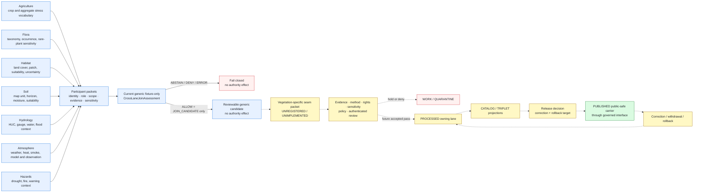

<!-- [KFM_META_BLOCK_V2]
doc_id: kfm://doc/architecture/cross-domain/vegetation-stress
title: Vegetation Stress Cross-Domain Architecture
type: architecture-standard
version: v0.2.0
prior_version: v0.1.0
status: draft; repository-grounded; seam-unregistered; vegetation-specific-execution-unestablished; public-join-hold; non-authoritative
owners:
  - "@bartytime4life — verified CODEOWNERS review route; routing is not stewardship, independent review, approval, or release authority"
owner_status: "Architecture, Agriculture, Flora, Habitat, Soil, Hydrology, Atmosphere, Hazards, source, evidence, sensitivity, policy, validation, review, release, correction, and rollback stewards remain NEEDS VERIFICATION"
created: 2026-06-29
updated: 2026-08-20
policy_label: public; architecture; cross-domain; vegetation-stress; derived-indicator; sensitive-composition; evidence-first; non-release; non-publication
owning_root: docs/
responsibility_root: docs/
responsibility: Explain the vegetation-stress cross-domain seam, reconcile its current repository maturity, and define ownership, source-role, evidence, sensitivity, lifecycle, validation, public-surface, correction, and rollback boundaries without becoming contract, schema, policy, registry, pipeline, runtime, release, or publication authority.
canonical_relationship: Same-path explanatory architecture reference under accepted Directory Rules section 12.5; no seam registration, executable ownership, object-family admission, policy result, join permission, release, or publication authority is created.
truth_posture: >-
  CONFIRMED current repository paths, accepted Directory Rules placement, absence of a
  vegetation-stress entry from the partial Cross-Domain Seam Register, the fixture-only
  CrossLaneJoinAssessment profile, the README-only vegetation-stress pipeline lane, and
  the README-only Atmosphere x Agriculture validator seam / PROPOSED the seam packet,
  candidate vocabulary, validation obligations, placement sequence, and smallest next
  implementation slice / UNKNOWN accepted vegetation-stress participants, executable
  ownership, deployed computation, public-client use, correction propagation, and rollback
  execution / NEEDS VERIFICATION accountable stewards, registered seam identity, semantic
  and schema profiles, policy evaluator, vegetation-specific fixtures and tests, exact-head
  hosted checks, authenticated review, release closure, and consumer behavior.
evidence_snapshot:
  repository: bartytime4life/Kansas-Frontier-Matrix
  visibility: public
  base_ref: main
  base_commit: fe8f47635cec65b56a1cd5a1c6ed288e2d5a8973
  target_prior_blob: e3add7c1f8b431e330a79a714c0c9f1af125c4fe
  codeowners_blob: dd2a84aa514d8ecd9208bc347f90f9a2ed37dd61
  directory_rules_blob: fd49a0b83e55cef52c1124281f093e263526898d
  adr_0029_blob: a4de0d7a96b78da59cfc499d1025e1508afd8dd9
  cross_domain_readme_blob: 3353a0a0ab5fe3f8f5fdea937b8eecfa34b81032
  cross_domain_seam_register_blob: dc87ea9c2ab11cc10e51cf4e8284c030e7c9ab29
  cross_lane_relations_blob: 15b7fe05fee251490d1a5db77844cc44b48288bd
  source_role_anti_collapse_blob: 89da72168d6165c744ebb4970ba45c80940ce746
  join_assessment_contract_blob: 2d78246d66d64d69413686e460321635adfc6170
  join_assessment_schema_blob: 7fd77721e82bade0a9775fdff6a42df420ea9c71
  join_helper_blob: ffaac998f1295c6661a8de1d1dd4d076c5835e47
  join_tests_blob: 48585d4ad064d8a48fc9d270ca3beafa198b63a6
  vegetation_pipeline_readme_blob: 265dce76a9fcad0349a28b0f7f0cf792888614c2
  atmosphere_agriculture_validator_readme_blob: 2a57682c735929767cb300a07549806fa73bb027
  agriculture_contract_index_blob: 27e6b7648d416e0c01da63c339210f9b072a98c5
inspection_boundary: >-
  Current-session GitHub reads covered the complete prior target, accepted ADR-0029 and
  adopted Directory Rules bytes, the cross-domain index, the partial seam register, the
  current source-role and cross-lane architecture companions, the fixture-only generic join
  contract/schema/helper/tests, the vegetation-stress pipeline README, the Atmosphere x
  Agriculture validator README, Agriculture object-family and contract-index documentation,
  CODEOWNERS, open pull requests, and branches matching vegetation. No live source,
  vegetation-specific executable, accepted seam profile, policy evaluator, production data,
  deployed API, MapLibre layer, public client, AI runtime, release packet, correction cascade,
  cache invalidation, or rollback execution was exercised.
related:
  - README.md
  - cross-lane-relations.md
  - source-role-anti-collapse.md
  - shared-kernel.md
  - trust-membrane.md
  - responsibility-layers.md
  - multi-domain-placement.md
  - ../../doctrine/directory-rules.md
  - ../../adr/ADR-0029-adopt-directory-governance-standard-v2.md
  - ../../../control_plane/cross_domain_seam_register.yaml
  - ../../../contracts/joins/cross_lane_join_assessment.md
  - ../../../schemas/contracts/v1/joins/cross_lane_join_assessment.schema.json
  - ../../../tools/joins/join_candidates.py
  - ../../../fixtures/contracts/v1/joins/cross_lane_join_assessment/cases.json
  - ../../../tests/joins/test_join_candidates.py
  - ../../../.github/workflows/cross-lane-join-assessment.yml
  - ../../../pipelines/biodiversity/vegetation_stress/README.md
  - ../../../tools/validators/atmosphere_agriculture/README.md
  - ../../domains/agriculture/OBJECTS.md
  - ../../domains/agriculture/atmosphere-stress.md
  - ../../../contracts/domains/agriculture/README.md
tags: [kfm, architecture, cross-domain, vegetation-stress, agriculture, flora, habitat, soil, hydrology, atmosphere, hazards, source-role, evidence, sensitivity, policy, join-candidate, release, correction, rollback]
notes:
  - "v0.2.0 replaces a proposal-era architecture page with a commit-pinned current-repository boundary while preserving the same path, doc_id, H1, top anchor, and legacy section headings."
  - "Accepted ADR-0029 and Directory Rules v2 section 12.5 settle this architecture path as PLACE; the older OPEN-DR-10 folder-placement caveat is stale."
  - "Vegetation stress is not present in the partial Cross-Domain Seam Register, and no vegetation-specific accepted seam contract, executable, policy profile, fixture packet, test packet, release, or public join is claimed."
  - "The generic CrossLaneJoinAssessment is fixture-only and non-publishing; ALLOW means only a reviewable JOIN_CANDIDATE."
  - "No doctrine, ADR, register, contract, schema, policy, source, fixture, validator, test, workflow, pipeline, runtime, lifecycle state, release, deployment, publication, or repository setting is changed by this page."
[/KFM_META_BLOCK_V2] -->

<a id="top"></a>

# Vegetation Stress Cross-Domain Architecture

Vegetation stress is a **derived cross-domain interpretation problem**, not a sovereign observation class. This page explains how KFM may evaluate a vegetation-stress candidate while preserving the authority of Agriculture, Flora, Habitat, Soil, Hydrology, Atmosphere, and Hazards, and while keeping source role, spatial and temporal support, uncertainty, sensitivity, evidence, review, release, correction, and rollback visible.

[](#status-and-evidence-boundary)
[](#path-posture)
[](#status-and-evidence-boundary)
[](#validation-gates)
[](#policy-and-sensitivity)
[](#signal-roles)

> [!IMPORTANT]
> **A vegetation-stress candidate is not vegetation truth.** A plausible map pattern, remote-sensing index, modeled field, drought class, smoke layer, crop report, soil-moisture value, habitat class, joined geometry, validator pass, or generated explanation does not by itself establish that vegetation is stressed, identify a cause, authorize a management action, or permit public exposure.

> [!CAUTION]
> **The current repository has no registered vegetation-stress seam.** The partial Cross-Domain Seam Register contains five other held seams, all with public joins denied. Vegetation stress therefore has no registered seam ID, accepted participant allocation, seam contract path, or public-join permission in that projection.

> [!WARNING]
> **Composition can create new sensitivity.** Joining public or low-risk inputs may reveal rare plants, sensitive habitat, private fields, operator or parcel context, irrigation or well context, archaeology, cultural knowledge, or infrastructure. The most restrictive applicable posture controls, and the result may require stricter handling than any input alone.

## Table of contents

- [Status and evidence boundary](#status-and-evidence-boundary)
- [Scope](#scope)
- [Path posture](#path-posture)
- [Definition](#definition)
- [Ownership matrix](#ownership-matrix)
- [Lifecycle fit](#lifecycle-fit)
- [Signal roles](#signal-roles)
- [Architecture flow](#architecture-flow)
- [Policy and sensitivity](#policy-and-sensitivity)
- [Placement rules](#placement-rules)
- [Validation gates](#validation-gates)
- [AI and public surfaces](#ai-and-public-surfaces)
- [Smallest sound next implementation slice](#smallest-sound-next-implementation-slice)
- [Anti-patterns](#anti-patterns)
- [Open questions and ADR triggers](#open-questions-and-adr-triggers)
- [Rollback](#rollback)
- [Status notes](#status-notes)
- [Evidence ledger](#evidence-ledger)
- [Change history](#change-history)

---

## Status and evidence boundary

This revision replaces the June 2026 proposal posture with a current, commit-pinned repository boundary. The document remains explanatory architecture. It does not become semantic, schema, policy, registry, pipeline, validation, evidence, review, release, or runtime authority merely because it is detailed.

| Surface | Confirmed state at `main@fe8f47635cec65b56a1cd5a1c6ed288e2d5a8973` | Safe interpretation |
|---|---|---|
| This page | Existing tracked file; prior blob `e3add7c1f8b431e330a79a714c0c9f1af125c4fe`. | Same-path modernization; no move, rename, or new authority home. |
| Directory governance | [ADR-0029](../../adr/ADR-0029-adopt-directory-governance-standard-v2.md) is accepted and adopts [Directory Rules v2](../../doctrine/directory-rules.md). | Section 12.5 places shared architecture explanations in this lane. The older OPEN-DR-10 caveat is stale. |
| Cross-domain index | [`README.md`](README.md) defines this directory as explanatory and non-authoritative. | A page cannot authorize a join, source, policy result, release, or publication. |
| Cross-Domain Seam Register | [`cross_domain_seam_register.yaml`](../../../control_plane/cross_domain_seam_register.yaml) is `PROPOSED`, partial, projection-only, and contains five `HOLD_UNRESOLVED` seams. | Vegetation stress is absent; no registered seam identity or public join is established. |
| Generic join semantics | [`CrossLaneJoinAssessment`](../../../contracts/joins/cross_lane_join_assessment.md) is proposed, fixture-first, local-only, and non-authoritative. | It defines candidate assessment, not vegetation-stress meaning. |
| Generic helper | [`join_candidates.py`](../../../tools/joins/join_candidates.py) performs parameterized in-memory exact-key or synthetic spatial-temporal checks and emits finite local reports. | `ALLOW` means only `JOIN_CANDIDATE`; every authority effect remains false. |
| Generic fixtures and tests | The fixture packet has 19 cases; the focused test file contains ten tests covering schema, determinism, finite outcomes, tamper checks, no-network posture, and non-publishing effects. | Bounded generic candidate proof exists; no vegetation-specific proof follows automatically. |
| Vegetation-stress pipeline lane | [`pipelines/biodiversity/vegetation_stress/README.md`](../../../pipelines/biodiversity/vegetation_stress/README.md) is repository-grounded but README-only in its bounded inspection. | No accepted executable, runner, classifier, spec, dedicated fixture/test lane, workflow, receipt instance, or production run is established there. |
| Atmosphere x Agriculture validator lane | [`tools/validators/atmosphere_agriculture/README.md`](../../../tools/validators/atmosphere_agriculture/README.md) is repository-grounded but README-only in bounded inspection. | The narrow seam has documentation, not proved executable enforcement. |
| Agriculture stress vocabulary | [`OBJECTS.md`](../../domains/agriculture/OBJECTS.md) names `DroughtStressIndicator` and `PestStressIndicator`; the [Agriculture contract index](../../../contracts/domains/agriculture/README.md) marks their object-level contract coverage `NEEDS VERIFICATION`. | Names are domain-reference vocabulary, not confirmed contract/schema/runtime families. |
| Review routing | [`.github/CODEOWNERS`](../../../.github/CODEOWNERS) routes review to `@bartytime4life`. | Routing is not independent stewardship, authenticated domain review, policy approval, or release authority. |
| Public or production behavior | No vegetation-specific deployed API, map layer, public client, AI answer path, release packet, correction cascade, or rollback execution was exercised. | `UNKNOWN / NEEDS VERIFICATION`; public use remains `HOLD` or `DENY` by default. |

### Truth posture

- **CONFIRMED:** current paths and blobs, accepted placement authority, current partial seam-register contents, the generic fixture-only join packet, the README-only vegetation pipeline boundary, and the README-only Atmosphere x Agriculture validator boundary.
- **PROPOSED:** the vegetation-stress seam packet, candidate grammar, validation obligations, future implementation sequence, and any conditional path not already present.
- **UNKNOWN:** actual production computation, active data sources, deployed consumers, policy execution, public map behavior, AI behavior, correction propagation, and rollback execution.
- **NEEDS VERIFICATION:** accountable stewards, a registered seam ID, accepted participants and authority allocation, object contracts and schemas, policy and sensitivity profiles, vegetation-specific fixtures/tests, release integration, and exact-head hosted validation.
- **HOLD:** any public join, public vegetation-stress claim, field-scale output, causal statement, or automated management recommendation.

### Authority boundary

| Responsibility | Owning surface | This page may do |
|---|---|---|
| Governing invariants and accepted decisions | `docs/doctrine/` and accepted ADRs | Explain and link; never silently amend. |
| Machine seam projections | `control_plane/` | Report current projection state; never register or activate a seam from prose. |
| Semantic meaning | `contracts/` | State candidate questions; never define binding fields here. |
| Machine shape | `schemas/` | Identify needed validation classes; never claim prose validates an instance. |
| Admissibility, rights, sensitivity, and obligations | `policy/` plus qualified review | State fail-closed requirements; never invent an allow result. |
| Source identity and permitted use | source contracts and `data/registry/sources/` | Require source closure; never activate or reclassify a source. |
| Candidate computation | accepted `tools/`, `packages/`, or `pipelines/` implementation | Describe the boundary; never select a canonical executable home by assertion. |
| Fixtures, tests, and CI | `fixtures/`, `tests/`, and `.github/workflows/` | Cite exact bounded proof; never infer complete enforcement. |
| Lifecycle and accountability objects | `data/` responsibility families | Explain the flow; never write or promote state. |
| Release, correction, withdrawal, and rollback | `release/` plus applicable receipt/proof lanes | Require closure; never authorize a transition. |
| Public API, MapLibre, export, graph, search, and AI | governed released-carrier surfaces | Define disclosure and fail-closed expectations; never claim deployment without evidence. |
| This page | `docs/` | Explain architecture, current evidence, risks, validation, and reversible next steps. |

[Back to top](#top)

---

## Scope

This document governs the architecture of a **vegetation-stress seam candidate** that may cite or combine independently governed Agriculture, Flora, Habitat, Soil, Hydrology, Atmosphere, and Hazards material.

It answers:

1. what a vegetation-stress candidate may assert and what it must not imply;
2. which bounded context owns each participating fact;
3. how source role and knowledge character survive composition;
4. how spatial support, temporal support, baseline, method, no-data, and uncertainty remain visible;
5. how evidence, rights, sensitivity, policy, review, release, correction, and rollback constrain the result; and
6. what current repository artifacts prove versus what remains unimplemented or undecided.

### In scope

- crop, plant, vegetation-community, habitat, land-cover, and public-safe aggregate subject scopes;
- drought, heat, smoke, flood, hydrologic, soil-moisture, phenology, pest-context, classification, and modeled-anomaly dimensions;
- observed, remote-sensing-derived, modeled, forecast, aggregate, administrative, regulatory, candidate, and generated inputs;
- binary and n-ary candidate relations;
- spatial and temporal fitness, baseline and method identity, uncertainty, no-data, staleness, and supersession;
- sensitive composition and public-safe transformation;
- governed API, MapLibre, export, Evidence Drawer, Focus Mode, and AI disclosure obligations;
- correction invalidation, withdrawal, cache replacement, and rollback expectations.

### Out of scope

This page does not:

- create crop, flora, habitat, soil, hydrology, atmosphere, or hazard truth;
- diagnose plant disease, pest presence, crop damage, drought impacts, or causal mechanism;
- issue an official warning, advisory, regulatory determination, medical statement, agronomic prescription, insurance conclusion, or legal finding;
- register a seam, assign owners, accept a semantic profile, choose a schema home, activate a policy bundle, or admit a live source;
- create an executable pipeline, validator, fixture, test, workflow, map layer, route, release, or public product;
- authorize direct reads from RAW, WORK, QUARANTINE, internal databases, private field systems, or model runtimes;
- lower sensitivity because an output is aggregated, generalized, tiled, summarized, or visually simplified;
- release, deploy, promote, publish, merge, or change repository settings.

[Back to top](#top)

---

## Path posture

The target path is now **CONFIRMED / PLACE**.

Accepted [ADR-0029](../../adr/ADR-0029-adopt-directory-governance-standard-v2.md) adopts the exact [Directory Rules v2](../../doctrine/directory-rules.md) bytes. Section 12.5 explicitly routes a shared architecture explanation to:

```text
docs/architecture/cross-domain/<seam_id>.md
```

This existing file therefore remains at `docs/architecture/cross-domain/vegetation-stress.md`. The prior page's claim that Directory Rules preferred a flat `docs/architecture/<topic>.md` home and left this folder under OPEN-DR-10 is no longer current.

Placement certainty does **not** settle semantic or implementation authority. The repository still lacks a registered vegetation-stress seam identity and has overlapping executable-path claims around biodiversity, cross-lane, Flora hazards, Habitat processing, and Atmosphere x Agriculture validation. This page does not choose among them.

### Responsibility signature

| Axis | Value |
|---|---|
| Artifact kind | Human architecture standard |
| Authority owner | Cross-domain vegetation-stress explanation |
| Lifecycle stage | Not applicable; this is not a data instance |
| Execution role | None |
| Scope | Cross-domain seam topic |
| Exposure | Public repository documentation |
| Mutability | Versioned through review |
| Retention | Durable |
| Placement result | `PLACE` at the existing same path |
| Structural effect | None |

[Back to top](#top)

---

## Definition

A **vegetation-stress candidate** is a derived, time-aware, spatially scoped assessment that suggests a bounded vegetation condition or anomaly relative to declared inputs, baseline, method, and uncertainty.

The preferred word is **candidate** until semantic, evidence, policy, review, and release closure support a stronger term. Even after release, the public claim must remain bounded to what its evidence can establish.

### Claim-strength ladder

| Claim class | Example posture | Required boundary |
|---|---|---|
| Context | “The area experienced below-normal precipitation during the declared period.” | Cite the owning Atmosphere/Hydrology evidence; do not imply vegetation response. |
| Index or anomaly | “A remote-sensing index differs from the declared baseline.” | Preserve sensor/product, processing, baseline, resolution, no-data, and uncertainty. |
| Candidate stress | “The released indicator flags a candidate stress pattern for review.” | Require accepted method, evidence, sensitivity, validation, review, and release closure. |
| Association | “The candidate pattern is associated with declared heat and soil-moisture context.” | Preserve separate endpoint and relationship evidence; avoid causal language. |
| Cause | “Heat caused vegetation stress.” | `ABSTAIN` unless a qualified method and evidence specifically support causation at the requested scale. |
| Prescription | “Apply treatment, irrigation, pesticide, or field action.” | Outside this architecture; `DENY` unless a separately governed qualified-authority product exists. |

### Minimum semantic dimensions

A reviewable vegetation-stress packet should make these dimensions explicit. The list is an architecture obligation, not a current schema claim.

| Dimension | Required question |
|---|---|
| Subject | Is the subject a crop, plant taxon, vegetation community, habitat/land-cover class, ecoregion, or public-safe aggregate? |
| Stress dimension | Is the candidate drought, heat, smoke, flood, hydrologic, soil-moisture, phenology, pest-context, classification, or another declared class? |
| Claim class | Is the output context, anomaly, candidate, association, or cause? |
| Input roles | What source role and knowledge character does every input carry? |
| Spatial support | What geometry, resolution, aggregation unit, positional uncertainty, and generalization apply? |
| Temporal support | What observation, valid, modeled, retrieval, release, correction, and expiry times apply? |
| Baseline | Which reference period, climatology, rolling window, control, or comparison defines anomaly? |
| Method | Which algorithm, thresholds, parameters, versions, transformations, and quality rules produced the candidate? |
| Uncertainty and no-data | What confidence, quality flags, no-data mask, cloud/snow/smoke handling, and unsupported areas apply? |
| Evidence | Which endpoint evidence and relationship/method evidence support the claim? |
| Rights and sensitivity | What rights, attribution, privacy, ecological, cultural, infrastructure, and precision constraints apply? |
| Review and release | Which authenticated review and release state governs the requested surface? |
| Correction and rollback | Which upstream corrections invalidate the result, and what prior safe state is the rollback target? |

### Non-equivalence rules

- A remote-sensing index is not observed plant physiology.
- A land-cover class is not a crop or taxon occurrence.
- A modeled weather field is not a station observation.
- A drought classification is not direct evidence of vegetation damage.
- Soil suitability is not crop performance.
- A public aggregate is not field, operator, parcel, or occurrence truth.
- Spatial overlap is not causal attribution.
- Repeated correlation is not a release decision.
- A schema-valid packet is not an evidence-complete or policy-allowed claim.
- A green workflow is not publication authority.

[Back to top](#top)

---

## Ownership matrix

Vegetation stress is cross-domain, but ownership remains bounded. No merged “vegetation-stress domain” or shared mutation authority is created.

| Concern | Owning context or responsibility | Permitted use in a candidate | Prohibited collapse |
|---|---|---|---|
| Crop identity, crop condition, crop observation, Agriculture-owned aggregate stress interpretation | Agriculture | Cite or derive Agriculture-owned candidate outputs under accepted contracts. | Do not re-own weather, soil, habitat, flora, hydrology, or hazard facts. |
| Plant taxonomy, occurrence/specimen evidence, rare-plant status, botanical meaning | Flora | Provide botanical identity and sensitivity context. | Do not infer occurrence or population from habitat, index, or overlap alone. |
| Habitat, ecoregion, land cover, patch, corridor, suitability, stewardship, and habitat-model uncertainty | Habitat | Provide landscape and model context. | Do not turn habitat suitability into occurrence or observed stress. |
| Soil map unit, component, horizon, property, hydrologic group, moisture, and suitability support | Soil | Provide substrate and soil-condition context at its source scale. | Do not relabel soil context as crop response or vegetation observation. |
| HUC, reach, gauge, water observation, flood and regulatory context, datum/unit/time support | Hydrology | Provide hydrologic setting and observed/model/regulatory context. | Do not treat regulatory flood layers as observed flooding or infer field condition without support. |
| Weather, precipitation, temperature, wind, smoke, aerosol, climate normal, forecast, and model/observation identity | Atmosphere | Provide atmospheric drivers and context with role/freshness preserved. | Do not merge modeled and observed fields or imply official advisory authority. |
| Drought, fire, heat, storm, warning/watch/advisory, exposure, and official hazard context | Hazards | Provide hazard-event and official-context references. | Do not turn KFM into an alert authority or convert advisory text into a measurement. |
| Source identity, role, rights, allowed use, attribution, retrieval, and currentness | Source contracts and registry authority | Govern whether an input may participate. | Do not admit, upgrade, or activate a source from this page or a join helper. |
| Endpoint and relationship evidence | Evidence, receipt, proof, and catalog authorities | Keep endpoint evidence and method/relation evidence separately resolvable. | Do not use one domain's evidence as proof of another endpoint or of causation. |
| Rights, consent, privacy, geoprivacy, sensitivity, obligations, and access | Policy authority and qualified reviewers | Compute the most restrictive effective posture and any stricter composition posture. | Do not lower protection through aggregation, styling, or omission from a client. |
| Candidate computation | Accepted implementation owner after seam decision | Emit a deterministic, non-authoritative candidate or finite negative outcome. | Do not mutate participant records, approve policy, release, or publish. |
| Release, correction, withdrawal, and rollback | `release/` and applicable accountability families | Authorize and correct released public-safe carriers. | Do not substitute a receipt, validator pass, PR, or map for release authority. |

### Participation does not imply joint ownership

A mature seam needs a separately declared relationship owner or steward, but that owner may not modify participant objects merely because the seam references them. Every participant keeps its own identity, EvidenceBundle support, policy posture, release state, and correction lineage.

[Back to top](#top)

---

## Lifecycle fit

Vegetation-stress material remains inside the KFM lifecycle:

```text
RAW -> WORK / QUARANTINE -> PROCESSED -> CATALOG / TRIPLET -> PUBLISHED
```

Promotion is a governed state transition, not a file move, candidate emission, validator result, pull request, merge, map render, or AI answer.

### Stage responsibilities

| Stage | Vegetation-stress posture | Minimum control |
|---|---|---|
| Pre-RAW / source admission | Watcher or connector may discover source change or retrieve candidate material. | Registered source identity, terms/rights review, sensitivity precheck, retrieval or watcher receipt; no publication. |
| RAW | Preserve source-native material and identity. | Immutable or pinned capture, source role, retrieval time, content digest, no public path. |
| WORK | Align, resample, crosswalk, derive baseline, calculate candidate, and test public-safe transformation. | Deterministic inputs/method, no-data and uncertainty treatment, endpoint evidence refs, non-publisher result. |
| QUARANTINE | Hold unresolved rights, identity, role, temporal support, geometry, sensitivity, private joins, causation, or method defects. | Stable reason codes, steward route, no silent fallback to allow. |
| PROCESSED | Store validated normalized or derived output in the owning lane. | Accepted semantic/schema profile, method and validation receipts, source and evidence lineage. |
| CATALOG / TRIPLET | Emit discovery and relation projections from validated, governed support. | Separate endpoint and relationship support, provenance, sensitivity, correction dependency, no authority upgrade. |
| Release decision | Evaluate evidence, policy, rights, sensitivity, validation, review, correction, and rollback closure. | ReleaseManifest/decision objects and public-safe transform identity; no shortcut through documentation. |
| PUBLISHED | Expose only versioned, released, public-safe carriers. | Governed API or approved carrier, citations, release ID, stale/correction state, rollback target. |
| Correction / withdrawal / rollback | Invalidate or replace affected derivatives and public surfaces. | Append-only lineage, cache/index/map/AI propagation, prior safe release target, audit receipt. |

### Finite processing outcomes

A vegetation-specific implementation should converge on bounded outcomes such as:

| Outcome | Meaning | Authority effect |
|---|---|---|
| `CANDIDATE` | A deterministic candidate packet is ready for domain-specific review. | No truth, policy, review, release, or public authority. |
| `ABSTAIN` | Evidence, method, baseline, temporal/spatial support, or relation support is insufficient. | No candidate claim beyond the reason code. |
| `DENY` | Rights, privacy, sensitivity, harmful precision, life-safety, or prohibited inference blocks the operation. | No public exposure; route to governed review if applicable. |
| `ERROR` | A dependency, validator, evidence resolver, policy evaluator, or internal invariant failed. | Fail closed; never convert to `CANDIDATE` or `ANSWER`. |
| `HOLD` | Required seam, policy, steward, review, or release decision remains unresolved. | No public join or publication. |

The current generic helper uses `ALLOW`, `ABSTAIN`, `DENY`, and `ERROR`; its `ALLOW` is explicitly limited to `JOIN_CANDIDATE`. A future vegetation-specific profile may map that bounded result into its own reviewed vocabulary, but must not reinterpret it as public permission.

[Back to top](#top)

---

## Signal roles

Vegetation-stress composition must preserve both **source role** and **knowledge character**. The current repository does not prove one globally accepted source-role enum across every profile: the rich SourceDescriptor shape, the seven-class transition profile, and human-readable guidance overlap without an accepted universal crosswalk.

Do not coerce roles by case conversion, name similarity, or an ad hoc lookup hidden inside a pipeline.

| Input character | Permitted support | Must not become |
|---|---|---|
| Direct observation | Evidence for the measured parameter at the source's spatial, temporal, instrumental, and quality scope. | General vegetation condition outside that scope or a causal conclusion. |
| Remote-sensing-derived index or classification | Derived context with sensor/product, algorithm, resolution, masks, baseline, processing, and uncertainty. | Field truth, taxon truth, direct physiology, or confirmed stress cause. |
| Model, forecast, hindcast, or scenario | Estimated or projected context with model/run/version and uncertainty. | Observation, official warning, or verified outcome. |
| Aggregate statistic | Summary at its declared aggregation unit. | Field, operator, parcel, individual occurrence, or per-place truth. |
| Administrative or regulatory record | Authority-specific context and status. | Physical or biological observation by itself. |
| Hazard warning, watch, or advisory | Official-source action context. | KFM-authored alert, measurement, or generalized condition. |
| Candidate relation or derived indicator | Reviewable output with endpoint lineage, method, and finite status. | Relationship truth, policy permission, release, or publication. |
| Generated summary | Evidence-bounded interpretation after policy/release checks. | Evidence, proof, review, policy, or source authority. |

### Derived-role rule

When aggregation, modeling, synthesis, interpolation, classification, generalization, or cross-domain composition creates a new artifact, the result must declare a new derived role and retain the complete input-role lineage. Lifecycle promotion never upgrades a source role.

### Presentation rule

Role preservation applies to storage **and presentation**. Legends, layer names, popups, tooltips, charts, exports, search snippets, Evidence Drawer fields, Focus Mode responses, and AI summaries must not imply that:

- model equals observation;
- aggregate equals exact place;
- candidate equals verified;
- context equals cause;
- official advisory equals KFM authority;
- released carrier equals canonical source truth.

[Back to top](#top)

---

## Architecture flow

The diagram shows the current fail-closed boundary and the future governed path. Solid lines identify current repository evidence classes; dashed lines identify a proposed vegetation-specific path that is not yet accepted or implemented.


```mermaid
flowchart LR
    AGR["Agriculture\ncrop and aggregate stress vocabulary"]
    FLO["Flora\ntaxonomy, occurrence, rare-plant sensitivity"]
    HAB["Habitat\nland cover, patch, suitability, uncertainty"]
    SOIL["Soil\nmap unit, horizon, moisture, suitability"]
    HYD["Hydrology\nHUC, gauge, water, flood context"]
    ATM["Atmosphere\nweather, heat, smoke, model and observation"]
    HAZ["Hazards\ndrought, fire, warning context"]

    AGR --> PACKET["Participant packets\nidentity · role · scope · evidence · sensitivity"]
    FLO --> PACKET
    HAB --> PACKET
    SOIL --> PACKET
    HYD --> PACKET
    ATM --> PACKET
    HAZ --> PACKET

    PACKET --> GENERIC["Current generic fixture-only\nCrossLaneJoinAssessment"]
    GENERIC -->|"ABSTAIN / DENY / ERROR"| STOP["Fail closed\nno authority effect"]
    GENERIC -->|"ALLOW = JOIN_CANDIDATE only"| REVIEWABLE["Reviewable generic candidate\nno authority effect"]

    REVIEWABLE -.-> MISSING["Vegetation-specific seam packet\nUNREGISTERED / UNIMPLEMENTED"]
    MISSING -.-> POLICY["Evidence · method · rights · sensitivity\npolicy · authenticated review"]
    POLICY -.->|"hold or deny"| QUAR["WORK / QUARANTINE"]
    POLICY -.->|"future accepted pass"| PROC["PROCESSED owning lane"]
    PROC -.-> CATALOG["CATALOG / TRIPLET projections"]
    CATALOG -.-> RELEASE["Release decision\ncorrection + rollback target"]
    RELEASE -.-> PUB["PUBLISHED public-safe carrier\nthrough governed interface"]
    PUB -.-> CORRECT["Correction / withdrawal / rollback"]
    CORRECT -.-> PROC

    classDef current fill:#e7f1ff,stroke:#0969da,color:#1f2328;
    classDef hold fill:#fff1f0,stroke:#cf222e,color:#1f2328;
    classDef proposed fill:#fff8c5,stroke:#9a6700,color:#1f2328;
    classDef public fill:#dafbe1,stroke:#1a7f37,color:#1f2328;
    class AGR,FLO,HAB,SOIL,HYD,ATM,HAZ,PACKET,GENERIC,REVIEWABLE current;
    class STOP,QUAR hold;
    class MISSING,POLICY,PROC,CATALOG,RELEASE,CORRECT proposed;
    class PUB public;
```

> [!NOTE]
> This is an architecture and evidence-boundary diagram. It does not prove a vegetation-specific seam contract, policy bundle, validator, release manifest, public route, correction cascade, or runtime flow.

### Three packets remain separate

| Packet | Minimum contents | Why separation matters |
|---|---|---|
| Participant packet | Domain owner, object identity, source identity/role, spatial and temporal support, rights, sensitivity, EvidenceRef, review/release/correction state. | Each domain stays authoritative for its endpoint. |
| Relationship and method packet | Candidate meaning, relation identity, baseline, method, parameters, relation evidence, prohibited inferences, uncertainty, sensitivity effect, validation state. | Endpoint truth does not prove the relationship or method. |
| Derived-output packet | Output identity/role, input lineage, public-safe transform, receipt/proof references, policy/review/release state, correction dependencies, rollback target. | A derivative needs its own governance and cannot borrow release authority from an input. |

[Back to top](#top)

---

## Policy and sensitivity

The effective sensitivity of a vegetation-stress result is at least the strictest participating posture and may be stricter because composition creates new inference risk.

### Composition-risk matrix

| Risk | Default result | Required before any narrower result |
|---|---|---|
| Rare, protected, culturally sensitive, or steward-reviewed Flora geometry | `DENY` exact public exposure; generalize, redact, restrict, delay, or hold. | Qualified ecological/cultural review, public-safe transform, receipt, release decision, correction path. |
| Habitat or land-cover joined to occurrence, archaeology, private land, or infrastructure | `HOLD` or `DENY` according to the strictest policy. | Join-specific policy and inference-risk review; do not assume generalized inputs remain low risk after composition. |
| Field, operator, parcel, yield, production, pesticide, irrigation, insurance, or private-party detail | `DENY` public exact exposure by default. | Verified rights/consent, qualified policy review, approved aggregation/redaction, release and rollback support. |
| Private well or irrigation linkage | `HOLD` or `DENY` exact exposure. | Hydrology/Land/privacy review and safe aggregation; no owner inference. |
| Archaeology, tribal/cultural knowledge, sacred place, or sensitive historic landscape | `DENY` harmful precision and inferred site location. | Qualified sovereignty/cultural review and explicit public-use decision. |
| Critical infrastructure or operational vulnerability | `DENY` precise public linkage. | Security review, generalization, minimum necessary disclosure, release decision. |
| Official warning, watch, advisory, or emergency context | Preserve official role; KFM remains non-alerting. | Direct official citation, currentness/expiry, prominent disclaimer, no substituted action guidance. |
| Cause attribution | `ABSTAIN` or narrow to context/association. | Method and evidence designed for causal inference at the requested scale, qualified review, explicit limitations. |
| Unknown rights, terms, attribution, or redistribution posture | `HOLD` in source/lifecycle governance. | SourceDescriptor and rights review; no “publicly accessible means publishable” shortcut. |
| Over-precise geometry or small-cell disclosure | Generalize, suppress, aggregate, restrict, or deny. | Quantified disclosure review and a recorded transform; client-side hiding is insufficient. |
| Stale, corrected, withdrawn, or superseded input | `ABSTAIN`, mark stale, or withdraw derivative. | Re-resolve evidence, re-run method, review correction impact, issue new release or rollback. |

### Most-restrictive rule

A join may not average or vote on rights, sensitivity, source role, review state, or release state. One blocking participant or relationship-level risk blocks the requested public use.

### Data minimization

Logs, issues, pull-request diffs, fixture names, error messages, receipts, screenshots, map previews, metrics, and AI prompts must avoid echoing sensitive coordinates, operator identities, parcel IDs, rare-taxon details, private yield values, credentials, tokens, or raw source payloads. Negative tests should use synthetic sentinels and verify non-echo behavior.

[Back to top](#top)

---

## Placement rules

Accepted Directory Rules place every artifact by its primary responsibility. This page does not create the conditional paths below; it records the decision sequence that future work must follow.

| Artifact | Evidence-backed or conditional home | Current posture |
|---|---|---|
| Human vegetation-stress architecture | `docs/architecture/cross-domain/vegetation-stress.md` | **CONFIRMED / PLACE** at this same path. |
| Seam identity and navigational projection | `control_plane/cross_domain_seam_register.yaml` after a governed decision and schema-valid update | Vegetation stress is **not registered**; the register is projection-only and cannot create authority. |
| Cross-domain semantic profile | `contracts/cross_domain/<registered-seam-id>/` | **PROPOSED / conditional**; register identity, owner, participants, and decision are prerequisites. |
| Machine schema profile | Accepted `schemas/` profile chosen after contract and schema-authority review | **NEEDS VERIFICATION**; Directory Rules section 12.5 does not by itself settle this seam's exact schema subtree. |
| Shared validator | `tools/validators/cross_domain/<registered-seam-id>/` | **PROPOSED / conditional** after semantic and policy profiles. |
| Cross-domain tests | `tests/cross_domain/<registered-seam-id>/` | **PROPOSED / conditional**; fixtures remain in the accepted fixture profile. |
| Generic dry-run join helper | `tools/joins/join_candidates.py` | **CONFIRMED bounded implementation**; reusable only within its declared fixture-only contract. |
| Executable vegetation-stress pipeline | One accepted implementation lane under the responsibility root that owns execution | **CONFLICTED / NEEDS VERIFICATION**; current biodiversity lane is README-only and does not settle canonical ownership. |
| Source identity and descriptors | `data/registry/sources/<source_id>/` plus source contracts | Source-first; do not duplicate canonical source identity by domain. |
| Source captures | Source-governed RAW/QUARANTINE lanes | No direct public path and no activation from this page. |
| Work and processed derivatives | Owning domain lifecycle lanes or an accepted seam execution profile | No arbitrary lead domain and no unregistered shared writer. |
| Catalog and triplet projections | `data/catalog/` and `data/triplets/` object-family profiles | Derived from validated support; not authored as truth by this page. |
| Receipts and proofs | `data/receipts/` and `data/proofs/` by object family | Remain separate from catalogs, release decisions, and published carriers. |
| Release decisions | `release/<object_family>/...` under accepted release grammar | No release policy or source under `release/`. |
| Published public-safe carriers | `data/published/` after release closure | Public clients use governed interfaces or approved carriers only. |

### Do not create parallel authority

- Do not create a second `vegetation_stress` semantic home under a convenient domain merely because that domain consumes the result.
- Do not mirror the same writable schema into `schemas/`, `jsonschema/`, a domain directory, and a pipeline directory.
- Do not put PolicyDecision source, proof, receipt, or release objects beside the executable for convenience.
- Do not treat `pipelines/biodiversity/vegetation_stress/` as canonical merely because it exists.
- Do not create empty symmetry scaffolds before a registered seam, owned artifact, consumer, validation need, and rollback plan exist.

[Back to top](#top)

---

## Validation gates

The current repository proves a **generic candidate-assessment slice**, not vegetation-specific enforceability.

### Current bounded proof

The generic join packet currently demonstrates:

- a proposed semantic contract and closed Draft 2020-12 schema;
- parameterized in-memory SQLite for exact-key fixtures;
- synthetic spatial-cell and timezone-aware interval checks for spatial-temporal fixtures;
- deterministic RFC 8785/SHA-256 candidate and assessment identity;
- 19 synthetic fixture cases;
- ten focused tests covering schema validity, finite polarity, non-publishing effects, source-role and sensitivity visibility, tamper failure, duplicate-key/symlink denial, and no-network/no-write source inspection;
- finite `ALLOW`, `ABSTAIN`, `DENY`, and `ERROR` outcomes;
- schema-fixed false effects for lifecycle writes, evidence creation, policy decisions, review decisions, release decisions, publication, and public use.

That proof does not establish a vegetation-stress baseline, method, candidate contract, policy profile, source mapping, field privacy rule, ecological sensitivity rule, cause test, public transform, or released carrier.

### Vegetation-specific gate matrix

| Gate | Required evidence | Current result |
|---|---|---|
| Seam identity and participant allocation | Registered seam ID, named participants, authority allocations, prohibited inferences, owner, status. | **MISSING / HOLD** — no vegetation-stress register entry. |
| Semantic contract | Accepted meaning for subject, stress dimension, claim class, baseline, method, uncertainty, endpoint/relation evidence, and non-effects. | **NEEDS VERIFICATION**. |
| Schema | Closed machine shape matching the accepted semantic profile and identity rules. | **NEEDS VERIFICATION**. |
| Source-role mapping | Accepted mapping across SourceDescriptor, transition profile, and domain-specific roles. | **HOLD** — no global crosswalk is established. |
| Source admission | Approved source descriptors, rights, terms, update/currentness, sensitivity, and allowed use. | **UNKNOWN / no live-source review in this task**. |
| Spatial and temporal fitness | CRS/support unit, resolution, overlap, valid intervals, baseline periods, lag rules, staleness, and correction dependencies. | **NEEDS VERIFICATION**. |
| Method and uncertainty | Algorithm/version, thresholds, parameters, masks, no-data, calibration, validation, confidence, limitations. | **NEEDS VERIFICATION**. |
| Sensitivity and privacy | Rare-flora, habitat, field/operator/parcel, well/irrigation, archaeology/cultural, infrastructure, small-cell inference. | **NEEDS VERIFICATION / fail closed**. |
| Evidence closure | Endpoint EvidenceRefs resolve; relationship and method support remain separately resolvable. | **NEEDS VERIFICATION**. |
| Pair/n-ary validator | Deterministic vegetation-specific validation with stable reason codes and no sensitive echo. | **NOT ESTABLISHED**. |
| Fixtures and tests | Synthetic positive, abstain, deny, error, tamper, stale/correction, rollback, and disclosure-negative cases. | **NOT ESTABLISHED**. |
| Policy evaluator and authenticated review | Accepted policy profile, evaluator binding, reviewer authority, review record. | **NOT ESTABLISHED**. |
| Release and public transform | Release decision, public-safe artifact, citations, stale/correction state, rollback target, client obligations. | **NOT ESTABLISHED / DENY**. |
| Production observability | Run receipts, metrics, incident/correction signals, cache/index/map/AI invalidation evidence. | **UNKNOWN**. |

### Review checklist

Before any vegetation-stress carrier is answerable or publishable, verify:

- [ ] Every participant and the relationship have explicit, stable identity and owner.
- [ ] Endpoint source roles remain visible and no derived operation upgrades them.
- [ ] Subject, stress dimension, claim class, baseline, method, parameters, no-data, and uncertainty are explicit.
- [ ] Spatial support, resolution, CRS, geometry precision, aggregation, and temporal support are fit for the requested claim.
- [ ] Endpoint EvidenceRefs resolve and relationship/method evidence is independently supported.
- [ ] Rights, terms, attribution, privacy, ecological/cultural sensitivity, and composition risk are closed.
- [ ] Exact field/operator/parcel, rare-plant, archaeology, infrastructure, and other harmful joins fail closed.
- [ ] Finite outcomes and reason codes are deterministic and do not echo sensitive values.
- [ ] A validator pass remains separate from PolicyDecision, authenticated ReviewRecord, and release decision.
- [ ] Public carriers use released artifacts and governed interfaces, not internal lanes or direct model endpoints.
- [ ] Correction, withdrawal, stale invalidation, cache/index/map/AI propagation, and rollback target are tested.

[Back to top](#top)

---

## AI and public surfaces

AI, maps, tiles, charts, graph edges, embeddings, exports, and dashboards remain downstream carriers. They do not create vegetation-stress truth.

### Governed answer outcomes

| Outcome | Public or AI behavior |
|---|---|
| `ANSWER` | Only over released, public-safe evidence and a scope supported by the effective release, policy, review, and citation state. |
| `ABSTAIN` | Evidence, relation support, baseline, method, currentness, spatial/temporal support, or correction state is insufficient. |
| `DENY` | Rights, sensitivity, privacy, harmful precision, life-safety, source terms, or release posture blocks disclosure. |
| `ERROR` | Evidence resolver, policy evaluator, release service, validator, or required dependency failed; never fallback to an uncited answer. |
| `NARROWED` / `BOUNDED` | Return a safer aggregate, generalized geography, shorter time window, weaker claim class, or context-only answer with the narrowing visible. |

### MapLibre and UI obligations

A released vegetation-stress layer or card should expose, at the level appropriate to risk:

- subject and stress dimension;
- claim class such as context, anomaly, candidate, or association;
- source-role and knowledge-character badges;
- spatial resolution/aggregation and temporal validity;
- baseline, method/version, no-data, quality, and uncertainty;
- EvidenceBundle and release references;
- rights/sensitivity/public-safe transform status without leaking restricted reasons or coordinates;
- stale, corrected, withdrawn, or superseded state;
- correction path and release/rollback identity.

The UI must not make an unreleased candidate look authoritative through color, layer order, opacity, legend wording, popup copy, animation, default visibility, or AI prose.

### Citation rule

Generated text must cite the underlying released evidence and owning domains. It must not cite a map pixel, tile archive, index value, screenshot, graph edge, or prior model answer as root truth.

### No action-authority implication

Public copy must not instruct users to irrigate, spray, harvest, evacuate, report a disease, or take emergency action unless that instruction comes from a separately governed, qualified authority and is cited as such. KFM remains an evidence and interpretation system, not an alert or farm-management authority.

[Back to top](#top)

---

## Smallest sound next implementation slice

The next legitimate implementation is **not** a live-source fetch, public map layer, model endpoint, or broad vegetation-stress engine.

### Decision prerequisite

First resolve, through the applicable governance path:

1. the stable vegetation-stress `seam_id` and participant set;
2. the relationship owner and participating domain stewards;
3. whether the relation is binary, n-ary, or a family of pair-specific seams;
4. the canonical executable owner among the competing pipeline/validator lanes;
5. the semantic boundary between Agriculture-owned indicators, Flora/Habitat condition context, and a cross-domain relation candidate;
6. the source-role crosswalk or explicit no-crosswalk strategy; and
7. the sensitivity baseline and public-join default.

### Fixture-first slice after the decision

**PROPOSED dependency-closed slice:**

1. add one accepted or explicitly review-pending semantic profile under the verified cross-domain contract home;
2. add one closed schema under the verified schema profile;
3. create synthetic no-network fixtures for one bounded public-safe aggregate case plus exact negative cases for missing evidence, role conflict, stale input, restricted precision, living/private-party linkage, rare-flora linkage, cause overclaim, tamper, dependency error, correction invalidation, and rollback reference loss;
4. implement one deterministic validator that delegates generic candidate checks and adds only vegetation-specific rules;
5. add focused tests proving finite outcomes, deterministic identity, non-publishing effects, no network, no file or lifecycle writes, and no sensitive value echo;
6. emit authoring/run provenance in the owning receipt family;
7. update this page and the seam register only to the exact maturity proved.

### Explicit non-goals for that slice

- no live connector or source activation;
- no field, operator, parcel, private yield, rare-plant, archaeology, infrastructure, or precise sensitive fixture;
- no public join, API route, MapLibre layer, AI answer, alert, or prescription;
- no lifecycle promotion, release decision, deployment, or publication;
- no duplicate executable lane;
- no broad schema, policy, or directory migration.

[Back to top](#top)

---

## Anti-patterns

| Anti-pattern | Why it fails |
|---|---|
| “The pixels look stressed.” | Visual plausibility is not evidence, semantic scope, method validation, or release authority. |
| One universal stress score without subject, baseline, method, or uncertainty | Collapses incompatible meanings and makes correction impossible. |
| Averaging observation, model, forecast, classification, and aggregate values into one role | Upgrades or erases source posture. |
| Choosing Agriculture, Flora, Habitat, or biodiversity as the lead path merely for convenience | Violates responsibility ownership and can create duplicate writable authority. |
| Treating generic `ALLOW` as a usable or public join | The current helper's `ALLOW` means only `JOIN_CANDIDATE`. |
| Registering a seam by editing prose or inventing a path | Documentation cannot create a machine identity, decision, owner, policy, or contract. |
| Publishing field-scale or occurrence-scale results because names are removed | Geometry, timing, pattern, and joins can still re-identify sensitive subjects. |
| Using a drought class, smoke layer, or soil-moisture value as proof of vegetation response | Context is not observed response or cause. |
| Hiding restricted detail only in the browser | The payload, tiles, cache, logs, export, or API may still disclose it. |
| Treating a receipt, proof, catalog record, PR, green check, release note, or map as interchangeable | These are distinct object families with different authority. |
| Letting AI fill missing evidence or infer cause | Generated language cannot close source, evidence, policy, review, or release gaps. |
| Updating a carrier after correction without invalidating indexes, caches, exports, stories, and AI context | Leaves stale public truth and breaks rollback traceability. |

[Back to top](#top)

---

## Open questions and ADR triggers

| ID | Status | Question or trigger |
|---|---|---|
| `VS-OQ-001` | NEEDS VERIFICATION | What registered seam ID and participant model should govern vegetation stress? |
| `VS-OQ-002` | CONFLICTED | Which executable responsibility owns the active implementation: biodiversity, cross-lane, a domain pipeline, or an accepted orchestrator? |
| `VS-OQ-003` | NEEDS VERIFICATION | Are `DroughtStressIndicator` and `PestStressIndicator` accepted Agriculture semantic families, proposal-era vocabulary, or compatibility names? |
| `VS-OQ-004` | HOLD | What accepted crosswalk, if any, maps the rich SourceDescriptor roles, transition roles, and domain-specific knowledge characters? |
| `VS-OQ-005` | NEEDS VERIFICATION | Which spatial units and minimum aggregation/generalization rules are public-safe for each subject and stress dimension? |
| `VS-OQ-006` | NEEDS VERIFICATION | Which baseline, calibration, validation, uncertainty, and no-data requirements apply to each method family? |
| `VS-OQ-007` | NEEDS VERIFICATION | Which sources have current rights, redistribution, attribution, and allowed-use posture for derived public products? |
| `VS-OQ-008` | HOLD | Which qualified reviewers may approve rare-flora, habitat, private-field, well/irrigation, archaeology/cultural, and infrastructure joins? |
| `VS-OQ-009` | NEEDS VERIFICATION | How do upstream corrections propagate through processed outputs, catalog/triplets, tiles, caches, search, embeddings, exports, stories, and AI answers? |
| `VS-OQ-010` | UNKNOWN | Are any production or private implementations outside the inspected repository surfaces? |

An ADR or equivalent accepted decision is required when work would:

- register or materially redefine the vegetation-stress seam;
- select or migrate the canonical executable home among competing paths;
- create a shared object family or shared mutation authority;
- establish a global source-role crosswalk;
- change public-join, sensitivity, precision, or release defaults;
- introduce a new root, compatibility authority, or parallel schema/policy/receipt home;
- admit a new public AI or map architecture dependency;
- change correction, withdrawal, or rollback semantics.

[Back to top](#top)

---

## Rollback

### Documentation rollback

Before merge, close the draft pull request and abandon the feature branch. After an authorized merge, use a transparent revert or a bounded forward-correction pull request. Do not rewrite shared history, restore the stale OPEN-DR-10 claim, create a second vegetation-stress architecture authority, or mutate registers to make the documentation appear correct.

### Future runtime rollback obligations

A vegetation-stress release must identify how to:

1. stop new computation and public serving when a source, method, policy, or evidence dependency is invalid;
2. mark the affected release stale, corrected, withdrawn, or superseded;
3. invalidate or replace API responses, tiles, caches, catalogs, triplets, indexes, embeddings, exports, stories, screenshots where controlled, and AI context;
4. restore the last release-approved public-safe carrier;
5. preserve the old release, correction reason, affected evidence, transform identity, decision record, and rollback target for audit;
6. re-run only from pinned, governed inputs after the blocking condition is resolved.

Rollback must not delete evidence, erase negative outcomes, or silently replace a release without correction lineage.

[Back to top](#top)

---

## Status notes

| Item | Status | Notes |
|---|---|---|
| Target path and owning root | CONFIRMED | Existing human architecture page receives `PLACE` under accepted Directory Rules section 12.5. |
| Previous path caveat | SUPERSEDED | OPEN-DR-10 / flat-file preference language is stale after accepted ADR-0029. |
| Vegetation-stress seam registration | NOT ESTABLISHED / HOLD | No entry appears in the partial Cross-Domain Seam Register. |
| Generic join candidate contract/schema/helper/tests | CONFIRMED bounded implementation | Fixture-first, deterministic, local, no-network, non-publishing; not vegetation-specific. |
| Vegetation-stress pipeline implementation | NOT ESTABLISHED | Current direct lane is repository-grounded README-only in its bounded inspection. |
| Atmosphere x Agriculture validator implementation | NOT ESTABLISHED | Current seam lane is repository-grounded README-only in its bounded inspection. |
| Agriculture stress object-level contracts/schemas | NEEDS VERIFICATION | Domain docs name the terms; current contract index does not establish object-level coverage. |
| Source-role cross-profile convergence | HOLD / CONFLICTED | Multiple current vocabularies exist without an accepted global crosswalk. |
| Vegetation-specific policy, fixtures, tests, workflow, receipts, release | NOT ESTABLISHED | No end-to-end proof is claimed. |
| Public release readiness | DENY by default | This page, a generic candidate, or an existing README cannot authorize public use. |
| Correction and rollback execution | UNKNOWN | Architecture obligations are defined; no execution was exercised. |

[Back to top](#top)

---

## Evidence ledger

| Source | Status | Supports | Limits |
|---|---|---|---|
| Previous target file at blob `e3add7c1...` | CONFIRMED prior state | Stable path, document identity, H1, top anchor, domain list, lifecycle, and safety intent. | Contained stale placement language and proposal-era implementation generalizations. |
| [`README.md`](README.md) | CONFIRMED repository-grounded index | Cross-domain lane purpose, non-authority boundary, accepted placement, held seam posture. | Does not activate or fully enumerate every seam. |
| [ADR-0029](../../adr/ADR-0029-adopt-directory-governance-standard-v2.md) and [Directory Rules v2](../../doctrine/directory-rules.md) | ACCEPTED decision / CONFIRMED bytes | Single writable directory authority and section 12.5 cross-domain placement. | Placement does not decide seam meaning, executable ownership, or release. |
| [`cross_domain_seam_register.yaml`](../../../control_plane/cross_domain_seam_register.yaml) | CONFIRMED current projection / PROPOSED authority | Five held high-risk seams, fail-closed defaults, authority allocations, public joins false. | Partial and projection-only; vegetation stress is absent. |
| [`cross-lane-relations.md`](cross-lane-relations.md) | CONFIRMED repository-grounded architecture | Four invariants and current generic candidate implementation boundary. | Explanatory; not generic relation policy or public authority. |
| [`source-role-anti-collapse.md`](source-role-anti-collapse.md) | CONFIRMED repository-grounded architecture | Current multi-profile vocabulary conflict, derived-role and presentation anti-collapse rules. | Does not accept a global role crosswalk. |
| [`CrossLaneJoinAssessment`](../../../contracts/joins/cross_lane_join_assessment.md) and [schema](../../../schemas/contracts/v1/joins/cross_lane_join_assessment.schema.json) | CONFIRMED current proposed packet | Fixture-first candidate meaning, finite outcomes, non-publisher effects, deterministic identity. | Generic and non-authoritative; does not define vegetation stress. |
| [`join_candidates.py`](../../../tools/joins/join_candidates.py), [fixtures](../../../fixtures/contracts/v1/joins/cross_lane_join_assessment/cases.json), and [tests](../../../tests/joins/test_join_candidates.py) | CONFIRMED bounded implementation | Parameterized in-memory exact-key checks, synthetic spatial-temporal checks, 19 cases, ten tests, tamper/no-network/non-write controls. | Synthetic profile only; no production source, geometry engine, vegetation method, or policy/release integration. |
| [`pipelines/biodiversity/vegetation_stress/README.md`](../../../pipelines/biodiversity/vegetation_stress/README.md) | CONFIRMED repository-grounded boundary | Direct lane is README-only; ownership and implementation placement are conflicted. | Bounded absence checks are not exhaustive outside the inspected repository surfaces. |
| [`tools/validators/atmosphere_agriculture/README.md`](../../../tools/validators/atmosphere_agriculture/README.md) | CONFIRMED repository-grounded boundary | Narrow stress-related validation obligations and README-only maturity. | No executable seam validator, dedicated tests, report producer, or runtime consumer established. |
| [`OBJECTS.md`](../../domains/agriculture/OBJECTS.md) and [Agriculture contract index](../../../contracts/domains/agriculture/README.md) | CONFIRMED documentation | Proposal-era Agriculture stress vocabulary and current object-level contract verification gap. | Names do not prove accepted contracts, schemas, validators, policy, or runtime behavior. |
| [`.github/CODEOWNERS`](../../../.github/CODEOWNERS) | CONFIRMED review route | `@bartytime4life` is the only verified GitHub review route. | Routing is not independent stewardship, review completion, policy approval, or release authority. |
| Attached KFM Repository Build-Out & Markdown Modernization Implementation Agent v6.0.0 | CONFIRMED task guidance | Same-path implementation, current evidence, dependency closure, validation, generated provenance, draft-PR delivery, and terminal boundaries. | Prompt authority does not prove repository behavior or publication readiness. |

[Back to top](#top)

---

## Change history

### v0.2.0 — 2026-08-20

- pinned the page to current repository evidence;
- corrected the stale folder-placement caveat using accepted ADR-0029 and Directory Rules section 12.5;
- recorded that vegetation stress is absent from the partial Cross-Domain Seam Register;
- separated the generic fixture-only join proof from missing vegetation-specific implementation;
- reconciled the README-only vegetation pipeline and Atmosphere x Agriculture validator boundaries;
- downgraded proposal-era Agriculture stress names to documentation vocabulary pending object-level contract/schema verification;
- added claim-strength, semantic-dimension, source-role, sensitivity, lifecycle, validation, AI/UI, correction, rollback, anti-pattern, and decision guidance;
- preserved the same path, `doc_id`, H1, `top` anchor, and all legacy H2 section headings;
- changed documentation and authoring provenance only.

### v0.1.0 — 2026-06-29

- expanded an earlier scaffold into initial cross-domain vegetation-stress guidance;
- established the first ownership, lifecycle, signal-role, sensitivity, validation, AI/public, and rollback outline;
- retained proposal-era folder-placement uncertainty and did not reconcile later repository implementation evidence.

[Back to top](#top)
